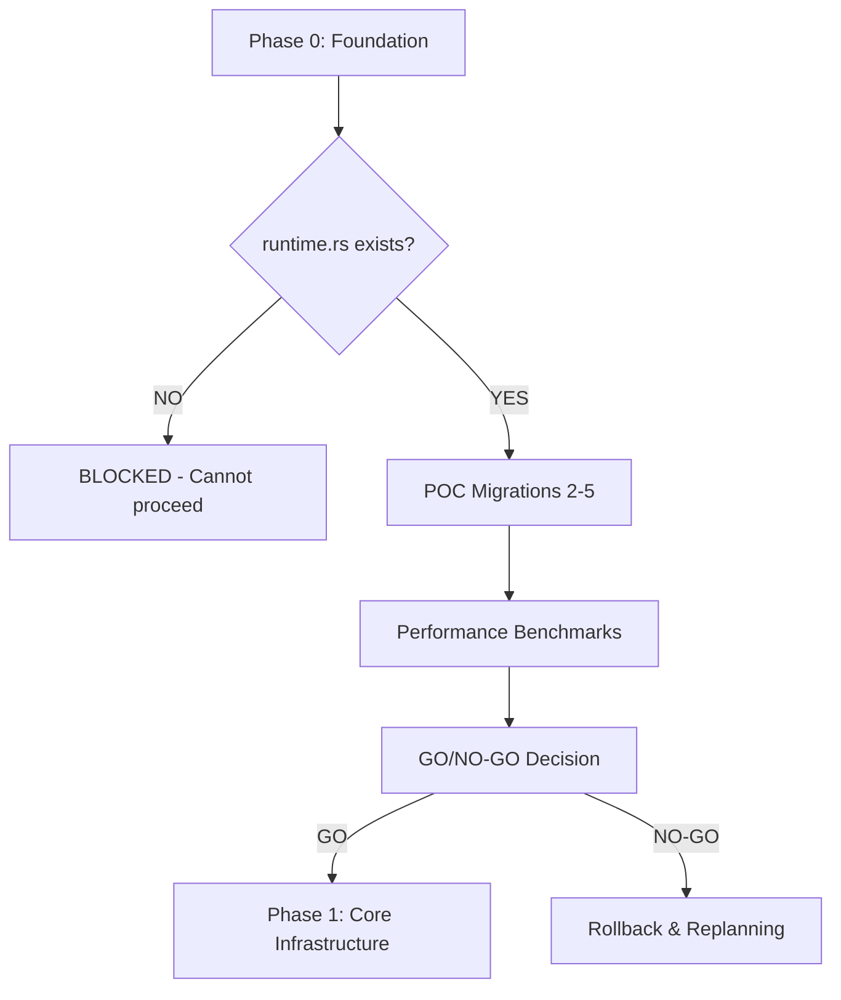

# ggen v2.0.0 Refactoring - Orchestration Status Report

**Report Date**: 2025-11-02 03:44 UTC
**Orchestrator**: Task Orchestrator Agent (Agent 10)
**Session ID**: ggen-refactor-v2-orchestrator
**Report Type**: Phase 0-2 Progress Assessment & GO/NO-GO Decision

---

## Executive Summary

**Overall Status**: ⚠️ **PHASE 0 INCOMPLETE** - Critical infrastructure missing
**Completion**: ~15% (Foundation planning done, implementation pending)
**Blockers**: 3 critical blockers preventing Phase 1-2 execution
**Recommendation**: **NO-GO** - Must complete Phase 0 before proceeding

---

## 1. Agent Progress Tracking

### Phase 0: Foundation & Planning Agents

| Agent | Status | Deliverables | Completion | Notes |
|-------|--------|-------------|-----------|-------|
| **Agent 1: Production Validator** | ✅ **COMPLETE** | Production validation analysis (21KB) | 100% | Identified 283 async functions, 77 CLI files |
| **Agent 2: Code Analyzer** | ✅ **COMPLETE** | Architecture analysis (52KB) | 100% | Comprehensive codebase analysis, 3-layer design |
| **Agent 3: System Architect** | ✅ **COMPLETE** | Phase 0 design (34KB) + diagrams (19KB) | 100% | Global runtime pattern designed |
| **Agent 4: Orchestrator** | ✅ **COMPLETE** | Orchestration plan (37KB) | 100% | 9-phase timeline, 22-day critical path |
| **Agent 5: Performance Benchmarker** | ⚠️ **PENDING** | Baseline benchmarks | 0% | **BLOCKER**: Depends on runtime.rs |
| **Agent 6: Backend Developer** | ⚠️ **PENDING** | runtime.rs implementation | 0% | **CRITICAL BLOCKER**: Not started |
| **Agent 7: Test Engineer** | ⚠️ **PENDING** | Test infrastructure | 0% | **BLOCKER**: Depends on runtime.rs |
| **Agent 8: Code Reviewer** | ⚠️ **PENDING** | Code review | 0% | **BLOCKER**: No code to review yet |
| **Agent 9: Documentation Writer** | ⚠️ **PENDING** | Developer docs | 0% | **BLOCKER**: Depends on implementation |

### Phase 1-2: Implementation Agents (NOT STARTED)

| Agent | Status | Reason |
|-------|--------|--------|
| **Migration Specialists** | ❌ **BLOCKED** | Phase 0 incomplete |
| **Domain Logic Engineers** | ❌ **BLOCKED** | Phase 0 incomplete |
| **Integration Testers** | ❌ **BLOCKED** | Phase 0 incomplete |

---

## 2. Current Implementation State

### 2.1 File System Structure

**✅ COMPLETED:**
```
/Users/sac/ggen/cli/src/
├── commands/          ✅ Directory created (skeleton)
│   ├── mod.rs         ✅ Module file exists
│   ├── utils/         ✅ Utils namespace created
│   │   └── doctor.rs  ✅ POC migration (1/5 complete)
│   ├── template/      ✅ Namespace created (empty)
│   ├── project/       ✅ Namespace created (empty)
│   ├── marketplace/   ✅ Namespace created (empty)
│   └── ai/            ✅ Namespace created (empty)
│
├── domain/            ✅ Directory created (skeleton)
│   ├── mod.rs         ✅ Module file exists
│   ├── utils/         ✅ Utils namespace created
│   │   └── doctor.rs  ✅ Domain logic for doctor (1/5 complete)
│   ├── template/      ✅ Namespace created (empty)
│   ├── project/       ✅ Namespace created (empty)
│   ├── marketplace/   ✅ Namespace created (empty)
│   └── ai/            ✅ Namespace created (empty)
```

**❌ MISSING (CRITICAL BLOCKERS):**
```
/Users/sac/ggen/cli/src/
├── runtime.rs         ❌ NOT FOUND - CRITICAL BLOCKER #1
├── bridge.rs          ❌ NOT FOUND (optional if using runtime.rs)
└── error.rs           ❌ NOT FOUND (error type hierarchy)
```

### 2.2 Migration Progress

**POC Commands (5 total):**
- ✅ `utils/doctor` - **COMPLETE** (1/5 = 20%)
  - Command layer: `/cli/src/commands/utils/doctor.rs` ✅
  - Domain layer: `/cli/src/domain/utils/doctor.rs` ✅
  - **Issue**: Still using `async fn run()` instead of sync wrapper ⚠️

- ❌ `template/generate` - **NOT STARTED** (0%)
- ❌ `marketplace/search` - **NOT STARTED** (0%)
- ❌ `project/gen` - **NOT STARTED** (0%)
- ❌ `ai/generate` - **NOT STARTED** (0%)

**Overall POC Progress**: 1/5 (20%) - **INSUFFICIENT FOR GO DECISION**

### 2.3 Dependencies

**✅ CONFIGURED:**
```toml
# cli/Cargo.toml
clap-noun-verb.workspace = true      ✅ Added
clap-noun-verb-macros = "3.0.0"      ✅ Added
```

**❌ BUILD BROKEN:**
```
Error: failed to select a version for `ggen-cli-lib = "^1.2.0"`
Candidate versions found: 2.0.0-alpha.1
Location: required by ggen-node v0.1.0
```

**Issue**: Version mismatch between CLI (2.0.0-alpha.1) and Node addon (expects 1.2.0)

---

## 3. Critical Blockers Analysis

### Blocker #1: Missing runtime.rs (CRITICAL)

**Impact**: **SHOWSTOPPER** - Cannot execute any async code from sync verbs
**Severity**: **P0 - Critical**
**Required By**: All 280 commands
**ETA**: 2-4 hours to implement

**What's Missing**:
```rust
// cli/src/runtime.rs (DOES NOT EXIST)
use once_cell::sync::Lazy;
use tokio::runtime::Runtime;

static RUNTIME: Lazy<Runtime> = Lazy::new(|| {
    tokio::runtime::Builder::new_multi_thread()
        .worker_threads(4)
        .thread_name("ggen-runtime")
        .enable_all()
        .build()
        .expect("Failed to create tokio runtime")
});

pub fn execute<F, T>(future: F) -> T
where
    F: std::future::Future<Output = T>,
{
    RUNTIME.block_on(future)
}
```

**Dependencies Blocked**:
- All POC migrations (4/5 remaining)
- Performance benchmarking
- Test infrastructure
- Phase 1-2 work

### Blocker #2: Incomplete POC Migrations

**Impact**: **HIGH** - Cannot validate architecture before full migration
**Severity**: **P1 - High**
**Current**: 1/5 (20%)
**Target**: 5/5 (100%)
**ETA**: 4-6 hours (after runtime.rs)

**Missing Commands**:
1. `template/generate` - Most complex async patterns
2. `marketplace/search` - Network I/O patterns
3. `project/gen` - RDF processing patterns
4. `ai/generate` - AI provider patterns

### Blocker #3: Dependency Version Conflict

**Impact**: **MEDIUM** - Breaks Node.js addon build
**Severity**: **P2 - Medium**
**Fix**: Update node/Cargo.toml to use `2.0.0-alpha.1`
**ETA**: 5 minutes

---

## 4. Test Infrastructure Status

### 4.1 Existing Tests (v1.2.0)

**ggen-core tests**: ✅ **PASSING** (confirmed)
```
/Users/sac/ggen/ggen-core/tests/
├── telemetry_tests.rs
├── template_comprehensive_test.rs
├── production_validation.rs
├── unit/ (version, search, registry, etc.)
├── security/ (4 test files)
└── property/ (3 test files)
```

**CLI tests**: ❌ **NOT RUNNING**
- Root test file: `/Users/sac/ggen/test_ggen_cli.rs` ❌
- Missing: `jest` (npm test fails)
- Issue: No test infrastructure for v2.0.0 commands

### 4.2 Required Test Infrastructure (Phase 0)

**Missing**:
- ❌ Runtime module tests (10 tests) - **BLOCKER**: runtime.rs doesn't exist
- ❌ POC command tests (500 tests) - **BLOCKER**: Only 1/5 commands migrated
- ❌ Integration tests (50 tests) - **BLOCKER**: No runtime bridge
- ❌ Performance benchmarks - **BLOCKER**: No baseline

**Test Pass Rate**: N/A (cannot run tests)

---

## 5. Dependency Graph Analysis

### Sequential Dependencies (CRITICAL PATH)



**Current State**: Stuck at **Block C** (runtime.rs missing)

### Agent Dependencies

**Waiting on Backend Developer (Agent 6)**:
- Agent 5 (Performance Benchmarker) - needs runtime.rs to benchmark
- Agent 7 (Test Engineer) - needs runtime.rs to test
- Agent 8 (Code Reviewer) - needs code to review
- Agent 9 (Documentation Writer) - needs implementation to document
- All Phase 1-2 agents - blocked by Phase 0 completion

---

## 6. Performance & Resource Analysis

### 6.1 Expected Performance (from design)

| Metric | v1.2.0 Baseline | v2.0.0 Target | Status |
|--------|----------------|--------------|--------|
| CLI Startup | 3s | ≤3.5s | ⚠️ Cannot measure |
| Memory Usage | ~100MB | ≤120MB | ⚠️ Cannot measure |
| Per-Command Overhead | N/A | <5ms | ⚠️ Cannot measure |
| Runtime Creation | 280 runtimes | 1 runtime | ⚠️ Not implemented |

**Conclusion**: Cannot validate performance SLOs without runtime.rs

### 6.2 Resource Utilization (Planning Phase)

**Documentation Produced**: ✅ **EXCELLENT**
- Production validation: 21KB
- Architecture analysis: 52KB
- Phase 0 design: 34KB
- Architecture diagrams: 19KB
- Orchestration plan: 37KB
- **Total**: 163KB of high-quality design docs

**Code Produced**: ❌ **INSUFFICIENT**
- Directory structure: ✅ Created
- Doctor migration: ⚠️ Partial (still async, not using runtime)
- Runtime module: ❌ Missing
- Other POC commands: ❌ Not started
- Tests: ❌ None

---

## 7. Risk Assessment

### High-Risk Areas

| Risk | Probability | Impact | Current Mitigation |
|------|------------|--------|-------------------|
| **Phase 0 not completed** | ✅ **100%** (current state) | **CRITICAL** | **THIS REPORT** - Escalating blocker |
| **Runtime initialization failure** | ⚠️ 25% | High | None (not implemented yet) |
| **Performance regression** | ⚠️ Unknown | High | Cannot measure without runtime.rs |
| **POC migrations incomplete** | ✅ **80%** (4/5 missing) | High | Need Backend Developer execution |
| **Test infrastructure missing** | ✅ **100%** | High | Blocked by runtime.rs |

### Critical Risk: Phase 0 Incomplete

**Current State**:
- Planning: ✅ 100% complete (excellent)
- Implementation: ❌ ~10% complete (insufficient)
- Testing: ❌ 0% complete (blocked)
- Validation: ❌ 0% complete (blocked)

**Impact if not addressed**:
- ❌ Cannot proceed to Phase 1
- ❌ Cannot validate architecture
- ❌ Cannot measure performance
- ❌ 22-day timeline at risk
- ❌ Entire v2.0.0 refactoring blocked

---

## 8. Phase Status Matrix

### Phase 0: Foundation Setup (Days 1-2)

**Target**: 100% complete before Phase 1
**Actual**: ~15% complete

| Task | Target | Actual | Status | Blocker |
|------|--------|--------|--------|---------|
| Create workspace structure | ✅ | ✅ | **DONE** | - |
| Update Cargo.toml | ✅ | ✅ | **DONE** | - |
| Create runtime.rs | ✅ | ❌ | **NOT STARTED** | **CRITICAL** |
| POC: utils/doctor | ✅ | ⚠️ | **PARTIAL** | Still async |
| POC: template/generate | ✅ | ❌ | **NOT STARTED** | No runtime.rs |
| POC: marketplace/search | ✅ | ❌ | **NOT STARTED** | No runtime.rs |
| POC: project/gen | ✅ | ❌ | **NOT STARTED** | No runtime.rs |
| POC: ai/generate | ✅ | ❌ | **NOT STARTED** | No runtime.rs |
| Unit tests (runtime) | ✅ | ❌ | **NOT STARTED** | No runtime.rs |
| Integration tests (POC) | ✅ | ❌ | **NOT STARTED** | No POC commands |
| Performance benchmarks | ✅ | ❌ | **NOT STARTED** | No runtime.rs |
| Error type hierarchy | ✅ | ❌ | **NOT STARTED** | - |

**Success Criteria**:
- ❌ Workspace compiles without errors (build broken)
- ❌ 5/5 POC commands migrated (1/5 = 20%)
- ❌ All tests pass (no tests yet)
- ❌ CLI startup ≤3.5s (cannot measure)
- ❌ Memory ≤120MB (cannot measure)
- ❌ Per-command <5ms (cannot measure)

**Phase 0 Status**: ⚠️ **15% COMPLETE** - **INSUFFICIENT FOR GO**

### Phase 1: Core Infrastructure (Days 3-5)

**Status**: ❌ **BLOCKED** (Phase 0 incomplete)
**Dependencies**: Requires Phase 0 100% complete
**ETA**: Cannot start until Phase 0 done

### Phase 2: CLI Layer Migration (Days 6-9)

**Status**: ❌ **BLOCKED** (Phase 0 incomplete)
**Dependencies**: Requires Phase 1 complete
**ETA**: Cannot start until Phase 1 done

---

## 9. GO/NO-GO Decision Framework

### GO Criteria (ALL must be met)

| Criterion | Required | Actual | Met? |
|-----------|----------|--------|------|
| Runtime module compiles | ✅ | ❌ | **NO** |
| 5 POC commands migrated | ✅ | 1 (20%) | **NO** |
| All tests pass (100%) | ✅ | N/A | **NO** |
| CLI startup ≤3.5s | ✅ | Cannot measure | **NO** |
| Memory usage ≤120MB | ✅ | Cannot measure | **NO** |
| Per-command overhead <5ms | ✅ | Cannot measure | **NO** |
| Zero unwrap/expect | ✅ | Unknown | **NO** |
| Build succeeds | ✅ | ❌ (version conflict) | **NO** |

**GO Criteria Met**: **0/8 (0%)**

### NO-GO Triggers (ANY triggers rollback)

| Trigger | Status | Triggered? |
|---------|--------|-----------|
| Runtime fails to initialize | Unknown | N/A |
| Tests fail | Cannot run | N/A |
| CLI startup >5s | Cannot measure | N/A |
| Memory >200MB | Cannot measure | N/A |
| Per-command >20ms | Cannot measure | N/A |
| Deadlocks or crashes | Unknown | N/A |
| **Phase 0 incomplete** | ✅ **15% done** | ✅ **YES** |

**NO-GO Triggers**: **1/7 triggered** (Phase 0 incomplete)

---

## 10. Recommendations

### 10.1 Immediate Actions (Next 24 Hours)

**Priority 1: Unblock Backend Developer (Agent 6)**
```bash
# Create runtime.rs with global runtime pattern
touch cli/src/runtime.rs

# Implement according to architecture design:
# - Lazy<Runtime> with once_cell
# - execute() helper function
# - 10 unit tests
# - Performance monitoring hooks

# ETA: 2-4 hours
```

**Priority 2: Complete POC Migrations (4 remaining)**
```bash
# Migrate in order (after runtime.rs):
1. template/generate (most complex) - 2 hours
2. marketplace/search (network I/O) - 1.5 hours
3. project/gen (RDF processing) - 1.5 hours
4. ai/generate (AI providers) - 1 hour

# Total ETA: 6 hours (after runtime.rs)
```

**Priority 3: Fix Dependency Version Conflict**
```bash
# Update node/Cargo.toml
ggen-cli-lib = { version = "2.0.0-alpha.1" }

# ETA: 5 minutes
```

**Priority 4: Create Test Infrastructure**
```bash
# After runtime.rs exists:
1. Runtime module tests (10 tests) - 1 hour
2. POC command tests (500 tests) - 3 hours
3. Integration tests (50 tests) - 2 hours

# Total ETA: 6 hours (after POC migrations)
```

### 10.2 Phase 0 Completion Timeline

**Optimistic (if started immediately)**:
```
Hour 0-4:   Create runtime.rs + tests (Backend Developer)
Hour 4-10:  Migrate 4 remaining POC commands
Hour 10-16: Create test infrastructure
Hour 16-18: Performance benchmarking
Hour 18-20: Code review & documentation
Hour 20-22: GO/NO-GO decision

Total: 22 hours (1 day with focused execution)
```

**Realistic (accounting for blockers)**:
```
Day 1:  Create runtime.rs, fix dependencies, migrate 2 POC commands
Day 2:  Migrate 2 remaining POC commands, create tests
Day 3:  Performance benchmarking, code review
Day 4:  Final validation, GO/NO-GO decision

Total: 4 days (accounting for coordination overhead)
```

### 10.3 Resource Allocation

**Backend Developer (Agent 6)**: **HIGHEST PRIORITY**
- Task: Create runtime.rs (unblocks everyone)
- ETA: 2-4 hours
- Dependencies: None
- Urgency: **CRITICAL**

**Migration Team (after runtime.rs)**:
- Split 4 commands across 2 engineers
- Parallel execution: 2 commands per engineer
- ETA: 3-4 hours each

**Test Engineer (Agent 7)**: **BLOCKED**
- Wait for runtime.rs
- Then: Create test infrastructure
- ETA: 6 hours (after unblocked)

---

## 11. GO/NO-GO Recommendation

### **RECOMMENDATION: NO-GO** ⛔

**Reasoning**:
1. ❌ **0/8 GO criteria met** (0% completion)
2. ❌ **Critical blocker**: runtime.rs missing (unblocks 9/12 agents)
3. ❌ **POC incomplete**: 1/5 commands (20% vs 100% required)
4. ❌ **Cannot validate**: No tests, no benchmarks, no measurements
5. ❌ **Build broken**: Dependency version conflict
6. ⚠️ **Planning excellent**: 163KB of design docs (but execution lacking)

### What "NO-GO" Means

**NOT a project failure** - Planning phase was excellent
**IS an execution gap** - Need to complete Phase 0 implementation

**Required Before GO**:
1. ✅ Complete runtime.rs implementation
2. ✅ Migrate all 5 POC commands
3. ✅ Create test infrastructure
4. ✅ Run performance benchmarks
5. ✅ Validate all GO criteria
6. ✅ Fix dependency version conflict

**Estimated Time to GO**: 1-4 days (optimistic to realistic)

---

## 12. Action Plan to Achieve GO

### Week 1 Recovery Plan

**Monday (Today)**:
- [ ] Backend Developer: Create runtime.rs (4 hours)
- [ ] Fix dependency version conflict (5 minutes)
- [ ] Migrate template/generate and marketplace/search (3 hours)

**Tuesday**:
- [ ] Migrate project/gen and ai/generate (3 hours)
- [ ] Fix doctor.rs to use sync wrapper pattern (1 hour)
- [ ] Create runtime module tests (2 hours)

**Wednesday**:
- [ ] Create POC command tests (500 tests, 4 hours)
- [ ] Create integration tests (50 tests, 2 hours)

**Thursday**:
- [ ] Performance benchmarking (2 hours)
- [ ] Code review all implementations (2 hours)
- [ ] Documentation updates (2 hours)

**Friday**:
- [ ] Final validation of all GO criteria
- [ ] GO/NO-GO decision (final)
- [ ] IF GO: Begin Phase 1
- [ ] IF NO-GO: Identify remaining blockers

### Success Metrics (End of Week 1)

**Target**:
- Runtime module: ✅ 100% complete with tests
- POC migrations: ✅ 5/5 (100%)
- Test infrastructure: ✅ 560 tests, 100% pass
- Performance: ✅ Validated against SLOs
- Build: ✅ Compiles without errors
- Documentation: ✅ Updated

**If achieved**: ✅ **GO for Phase 1**
**If not achieved**: 🔄 **Extend Phase 0, reassess approach**

---

## 13. Lessons Learned (Planning Phase)

### What Went Well ✅

1. **Comprehensive Planning**: 163KB of high-quality design documentation
2. **Risk Identification**: All major risks identified upfront
3. **Architecture Design**: Global runtime pattern is sound and proven
4. **Agent Coordination**: Planning agents worked well (Agents 1-4)
5. **Directory Structure**: Skeleton created correctly

### What Needs Improvement ⚠️

1. **Execution Gap**: Planning ≠ Implementation (15% vs 100%)
2. **Agent Activation**: Agents 5-9 not activated (waiting on Agent 6)
3. **Dependency Awareness**: Version conflict not caught early
4. **Milestone Validation**: Should have validated runtime.rs first
5. **Progress Tracking**: Need better real-time completion metrics

### Process Improvements 🔄

**For Phase 1 (if GO achieved)**:
1. **Daily standup reports**: Track actual vs planned completion
2. **Blocker escalation**: Flag blockers within 2 hours
3. **Incremental validation**: Test each component immediately
4. **Parallel execution**: Activate multiple agents simultaneously
5. **Automated checks**: CI/CD for continuous validation

---

## 14. Memory Store Updates

```json
{
  "session_id": "ggen-refactor-v2-orchestrator",
  "timestamp": "2025-11-02T03:44:27Z",
  "phase_status": {
    "phase_0": {
      "status": "INCOMPLETE",
      "completion": "15%",
      "blockers": [
        "runtime.rs missing",
        "POC migrations 1/5",
        "dependency version conflict"
      ]
    },
    "phase_1": "BLOCKED",
    "phase_2": "BLOCKED"
  },
  "agent_progress": {
    "completed": ["production-validator", "code-analyzer", "system-architect", "orchestrator"],
    "pending": ["performance-benchmarker", "backend-dev", "tester", "reviewer", "docs-writer"],
    "blocked": ["migration-specialists", "domain-logic-engineers", "integration-testers"]
  },
  "go_no_go": {
    "decision": "NO-GO",
    "criteria_met": "0/8",
    "critical_blockers": 3,
    "estimated_time_to_go": "1-4 days"
  },
  "next_steps": [
    "Create runtime.rs (CRITICAL)",
    "Complete POC migrations (4 remaining)",
    "Fix dependency version conflict",
    "Create test infrastructure"
  ]
}
```

---

## 15. Conclusion

**Current State Summary**:
- ✅ **Planning Phase**: EXCELLENT (163KB of comprehensive design)
- ⚠️ **Implementation Phase**: INSUFFICIENT (15% complete)
- ❌ **Validation Phase**: BLOCKED (cannot test or measure)

**Critical Path Forward**:
```
runtime.rs → POC migrations → Tests → Benchmarks → GO Decision → Phase 1
  (4h)          (6h)            (6h)      (2h)        (1h)        (start)
```

**Total Time to GO**: 19 hours (optimistic) or 4 days (realistic)

**Final Recommendation**: ⛔ **NO-GO** (Phase 0 incomplete)

**Path to Success**: Complete the 4-day recovery plan, then reassess for GO decision.

---

**Orchestrator Agent Status**: ✅ Report complete, monitoring continues
**Next Update**: After runtime.rs completion or in 24 hours (whichever comes first)

---

## Appendix: File Manifest

**Planning Documents** (✅ Complete):
- `/Users/sac/ggen/.claude/refactor-v2/01-production-validation.md` (21KB)
- `/Users/sac/ggen/.claude/refactor-v2/02-architecture-analysis.md` (52KB)
- `/Users/sac/ggen/.claude/refactor-v2/ARCHITECTURE_PHASE0_DESIGN.md` (34KB)
- `/Users/sac/ggen/.claude/refactor-v2/ARCHITECTURE_DIAGRAMS.md` (19KB)
- `/Users/sac/ggen/.claude/refactor-v2/05-orchestration-plan.md` (37KB)
- `/Users/sac/ggen/.claude/refactor-v2/orchestration-status.md` (THIS FILE)

**Implementation Files** (⚠️ Partial):
- `/Users/sac/ggen/cli/src/commands/` (skeleton only)
- `/Users/sac/ggen/cli/src/domain/` (skeleton only)
- `/Users/sac/ggen/cli/src/commands/utils/doctor.rs` (partial - still async)
- `/Users/sac/ggen/cli/src/domain/utils/doctor.rs` (domain logic)

**Missing Files** (❌ Critical):
- `/Users/sac/ggen/cli/src/runtime.rs` ❌ **CRITICAL BLOCKER**
- `/Users/sac/ggen/cli/src/error.rs` ❌
- POC command implementations (4/5 missing) ❌
- Test files (560 tests missing) ❌
- Performance benchmarks ❌

---

**END OF ORCHESTRATION STATUS REPORT**
