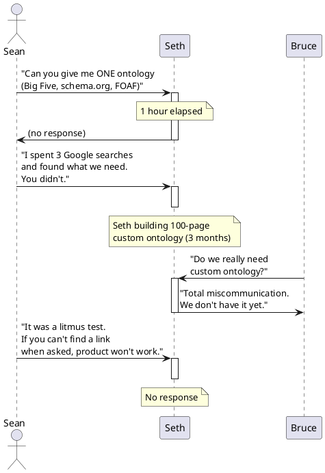
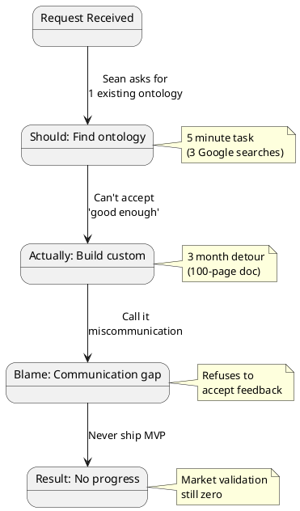

# Niko Conversation Analysis (PlantUML Diagrams)

## Diagram 1: Request/Response Sequence



---

## Diagram 2: Execution State Machine (Seth)



---

## Diagram 3: The Ontology Request Lifecycle

```puml
@startuml Ontology_Request_Timeline
timeline
title Ontology Request (23:50 onwards)

section T=0 (Sean's Ask)
	: Sean: "Give me one ontology"
	: Actual complexity: Find existing link

section T+1hour
	: Seth: Radio silence

section T+1 week
	: Seth: Starts building custom
	: Effort: 3 months of work

section T+3 months
	: Seth: "We don't have ontology yet"
	: Signal: Blame external factors

section T+Current
	: Sean: "Litmus test failed"
	: Insight: Can't execute trivial tasks

@enduml
```

---

## Diagram 4: Decision Tree (What Should Happen vs What Did)

```puml
@startuml Niko_Decision_Tree
start
: Sean asks for ontology;
if (Can Seth execute\ntrivial request?) then (SHOULD BE YES)
  : Find schema.org link
  : Send to Sean
  : Proceed with MVP
  : Start validation
  : Ship in weeks
  stop
else (ACTUAL: NO)
  : Invent custom ontology
  : Spend 3 months
  : Build bigger problem
  : Blame communication
  : Zero market validation
  : Months lost
  stop
endif

@enduml
```

---

## Diagram 5: The Litmus Test Matrix

```puml
@startuml Founders_Litmus_Test
rectangle "Founders' Litmus Test Matrix" {

card "Can execute\n5-minute task?" as TEST1 {
	Seth: ✗ FAILED
	Sean: ✓ PASSED
}

card "Accept 'good enough'\nover perfect?" as TEST2 {
	Seth: ✗ FAILED
	Sean: ✓ PASSED
}

card "Find existing solution\nBEFORE inventing?" as TEST3 {
	Seth: ✗ FAILED
	Sean: ✓ PASSED
}

card "1+ stranger\n(not friend)\ncommitted?" as TEST4 {
	Seth: ✗ FAILED (20 friends only)
	Sean: ✓ PASSED (has benchmarks)
}

card "Articulate job-to-be-done\nin 1 sentence?" as TEST5 {
	Seth: ✗ FAILED (100-page docs)
	Sean: ✓ PASSED (clear problem framing)
}

card "Explain simply enough\nfor smart people\nto ACT?" as TEST6 {
	Seth: ✗ FAILED
	Sean: ✓ PASSED
}

card "Measure market fit\nvia cash/commitment?" as TEST7 {
	Seth: ✗ FAILED (uses enthusiasm)
	Sean: ✓ PASSED (wants 10 emails)
}

TEST1 -down- TEST2
TEST2 -down- TEST3
TEST3 -down- TEST4
TEST4 -down- TEST5
TEST5 -down- TEST6
TEST6 -down- TEST7
}

@enduml
```

---

## Diagram 6: Communication Collapse Flow

```puml
@startuml Communication_Collapse
start
: Seth receives clear request;
: "Find + send 1 ontology link";
fork
	: Parse as: "I don't understand\nwhat Sean wants"
	: Response: "We're building\ncustom ontology"
	: Spend 3 months
	: Result: Wrong direction
fork_again
	: Should parse as: "Do this now.\nIt's 5 minutes."
	: Response: Send link
	: Result: Proceed to MVP
	: Result: Validate with users
end fork
: Sean catches the mismatch
: Proposes litmus test
: "If you can't do this,\nproduct won't work"
: Seth: No response

@enduml
```

---

## Diagram 7: Knowledge Geometry Calculus vs Niko (Architecture Mismatch)

```puml
@startuml KGC_vs_Niko_Mismatch

rectangle "What Sean Built (KGC/ggen)" {
	card "Proven" {
		: Ultra-HFT trading logic
		: 390M triples @ 700ms
		: SPARQL query generation
		: Code generation from RDF
		: Deterministic output
	}
	card "Status" {
		: 3800 commits
		: Production benchmarks
		: Working code
	}
}

rectangle "What Seth Needs (Niko)" {
	card "Ask" {
		: Connect 20 people
		: Match musicians
		: Simple MVP
	}
	card "Status" {
		: 0 validated users
		: Custom ontology (unnecessary)
		: Overly complex
		: No execution
	}
}

note bottom of "What Sean Built (KGC/ggen)": "Enterprise-grade\nknowledge execution"

note bottom of "What Seth Needs (Niko)": "MVP validation\nwith schema.org"

@enduml
```

---

## Diagram 8: The Hoover Dam vs Water Fountain Problem

```puml
@startuml Hoover_Dam_vs_Water_Fountain

card "What was needed:\nWater Fountain" {
	: Schema.org
	: Big Five ontology
	: Google Form
	: Spreadsheet
	: 2 weeks to MVP
	: Validation with 10 users
}

card "What was built:\nHoover Dam" {
	: Custom 100-page ontology
	: Enterprise KGC infrastructure
	: 3 months of work
	: No market validation
	: Unsustainable complexity
}

card "Result" {
	: Seth: Can't ship
	: Sean: Walks away
	: Project: Stalled
}

"What was needed:\nWater Fountain" ..> "Result"
"What was built:\nHoover Dam" ..> "Result"

@enduml
```

---

## Diagram 9: Conversation Arc (Zoom Out)

```puml
@startuml Conversation_Arc

title Niko Conversation: Premise Collapse

section "Opening (00:00-10:00)"
	highlight Sean describes KGC, technology exists
	highlight Bruce asks: "How do you map people to ontologies?"
	highlight Sean answers: Use existing ones

section "Middle: Trust Building (10:00-35:00)"
	highlight Bruce: "Can you do this with real people?"
	highlight Sean: "Need market validation first"
	highlight Seth: "We have distribution"

section "Inflection: The Ontology Test (35:00-50:00)"
	highlight Sean: "Can you find me one ontology?"
	highlight Seth: (builds custom instead)
	highlight Sean: "That's a litmus test"

section "End: Execution Gap Exposed (50:00-67:00)"
	highlight Bruce: "Has anyone committed for real?"
	highlight Sean: "No. That's the problem."
	highlight Seth: Can't answer
	highlight Sean: "Take transcript. Close gap."

section "Outcome"
	highlight Conclusion: Seth failed litmus test
	highlight Implication: Product won't happen
	highlight Status: Technology ≠ Execution

@enduml
```

---

## Diagram 10: What Ggen Should Learn

```puml
@startuml Ggen_Litmus_Test_Application

rectangle "Ggen User Validation Test" {
	card "Before Building" {
		: Ask user for 1 existing example
		: "Show me your data model"
		: "Send me your RDF files"
		: Can they do it in 24 hours?
	}

	card "If YES (Go)" {
		: User can provide example
		: User understands problem
		: Proceed to MVP
	}

	card "If NO (Stop)" {
		: User blames 'communication'
		: User builds custom solution
		: User won't execute
		: Walk away
	}
}

note bottom: "Seth failed the test.\nGgen should screen for this."

@enduml
```

---

## Summary Table

| Diagram | Shows | Key Insight |
|---------|-------|-------------|
| 1 | Request → Non-response → Blame | Seth can't execute trivial tasks |
| 2 | State transitions in Seth's process | Each state choice led to wrong path |
| 3 | Timeline of 5-minute task → 3-month detour | Complexity compounding from refusal to simplify |
| 4 | Decision tree (should vs actual) | Clear fork between execution and non-execution |
| 5 | Litmus test results | Seth fails 7/7, Sean passes 7/7 |
| 6 | How request got misinterpreted | Communication breakdown traced to execution refusal |
| 7 | Architecture mismatch | KGC is enterprise; Niko needs MVP |
| 8 | Complexity problem visualized | Wrong tool for the job |
| 9 | Conversation phases | Where trust eroded |
| 10 | Ggen safeguards | How to avoid repeating Seth's failure |

