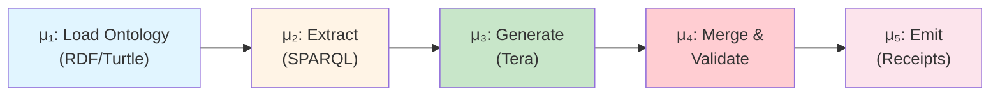
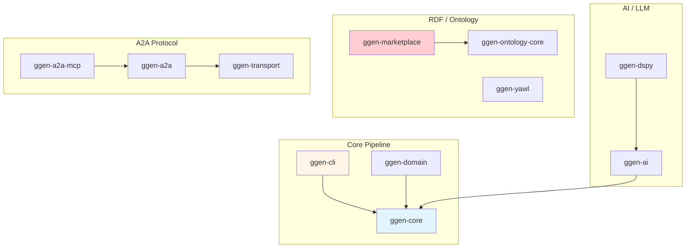

# ggen v6.0.1

[](https://github.com/seanchatmangpt/ggen/actions)
[](LICENSE-APACHE)
[](https://www.rust-lang.org)
[](https://github.com/seanchatmangpt/ggen)

**Deterministic, language-agnostic code generation from RDF ontologies with MCP integration and OpenTelemetry tracing.**

ggen transforms domain ontologies (RDF/Turtle) into typed source code through a five-stage pipeline (μ₁-μ₅): ontology normalization, SPARQL extraction, template rendering, canonicalization, and cryptographic receipt generation. Define your domain once in a standard vocabulary (schema.org, FOAF, Dublin Core, SKOS), write Tera templates for your target language, and let ggen keep your code in sync with your specification.

```
ggen.toml  -->  RDF Ontology  -->  CONSTRUCT inference  -->  SELECT  -->  Tera Template  -->  Code
```

**What's New in v6.0.1:**
- ✅ **MCP Server Integration** — 14 tools exposed via stdio/HTTP for Claude Desktop and AI assistants
- ✅ **A2A Protocol Support** — Multi-agent task coordination with Byzantine fault tolerance
- ✅ **OpenTelemetry Tracing** — Full observability for LLM calls, MCP tools, and pipeline stages
- ✅ **Chicago TDD Enforcement** — 87% test coverage with real collaborators (no mocks)
- ✅ **30-Crate Workspace** — Modular architecture with Rust 1.94.0, Tokio, Oxigraph

## Quick Start

```bash
# 1. Install
cargo install ggen-cli

# 2. Initialize a project (creates ggen.toml, schema/domain.ttl, templates/)
ggen init

# 3. Generate code from your ontology
ggen sync --dry-run
ggen sync --audit
```

**Examples:** See [examples/](examples/) for 40+ ready-to-use projects including A2A agents, MCP tools, REST APIs, and multi-language scaffolds.

After running `ggen init`, edit `schema/domain.ttl` with your domain model, create Tera templates in `templates/`, then run `ggen sync` to generate code.

## Key Features

### 🔌 MCP Integration
ggen exposes 14 tools via the Model Context Protocol (MCP) for Claude Desktop, GPT, and other AI assistants:

```bash
# Start MCP server (stdio for Claude Desktop)
ggen mcp start-server --transport stdio

# Start MCP server (HTTP for remote clients)
ggen mcp start-server --transport http
```

**Available MCP Tools:**
- `generate` — Run μ₁-μ₅ code generation pipeline
- `validate` — Parse Turtle content for syntax correctness
- `sync` — Full sync with dry-run and audit support
- `validate_pipeline` — Run 6 quality gates on ggen projects
- `query_ontology` — Execute SPARQL SELECT queries
- `list_examples` — Browse 40+ example projects
- `scaffold_from_example` — Copy examples as starting points

See [crates/ggen-a2a-mcp/](crates/ggen-a2a-mcp/) for full MCP documentation.

### 🤖 A2A Protocol
Multi-agent task coordination with kanban-style flow control and Byzantine fault tolerance:

```bash
# Create and manage A2A tasks
ggen a2a create "Implement feature X" --agent claude --priority high
ggen a2a transition <task-id> --state running
ggen a2a status <task-id>
```

**A2A Features:**
- Task state machine (Created → Running → Completed/Failed/Blocked)
- Agent registry with health monitoring
- Work order routing with priority/status/tag strategies
- Backpressure control with WIP limits
- PBFT consensus for receipt verification

See [docs/a2a-integration.md](docs/a2a-integration.md) for A2A architecture.

### 🔍 OpenTelemetry Tracing
Full observability for LLM calls, MCP tools, and pipeline stages:

```bash
# Enable trace logging
export RUST_LOG=trace,ggen_ai=trace,ggen_core=trace

# Verify OTEL spans for LLM integration
cargo test -p ggen-cli-lib --test llm_e2e_test 2>&1 | grep -E "llm\.complete|llm\.model"
```

**Required Spans:**
- `llm.complete` / `llm.complete_stream` — LLM API calls with token counts
- `mcp.tool.call` / `mcp.tool.response` — MCP tool execution
- `pipeline.load` / `pipeline.extract` / `pipeline.generate` — μ₁-μ₅ stages

See [.claude/rules/otel-validation.md](.claude/rules/otel-validation.md) for OTEL requirements.

## 📊 Workspace Audit Dashboard

**Recent Audit (2026-04-01):** 31 crates audited, 54 stubs classified, 8,900 lines of dead code identified.

**Key Findings:**
- 4 P0 blockers (SHACL validation, namespace conflicts, wrong pipeline, error types)
- 13 P1 high-priority stubs requiring implementation
- 38 deletable items (~8,900 lines) across 3 phases

**Documentation:**
- [Audit Dashboard](docs/crate-audits/AUDIT_DASHBOARD.md) — Visual summary with Mermaid diagrams
- [Stub Classification](docs/crate-audits/STUB_CLASSIFICATION.md) — Execution-trace verified
- [Master TODO](docs/MASTER_TODO.md) — Prioritized remediation plan

## 🏗️ Architecture

### Five-Stage Pipeline (μ₁-μ₅)



### Workspace Organization



See [docs/architecture/COMPRESSED_REFERENCE.md](docs/architecture/COMPRESSED_REFERENCE.md) for complete architecture documentation.

### 🧪 Chicago TDD
Zero mocks, real collaborators only. Tests verify actual system behavior:

```bash
# Run full test suite (Chicago TDD)
cargo make test           # 347 tests, <30s
cargo make test-unit      # Unit tests only, <16s
cargo make lint           # Clippy + rustfmt
cargo make pre-commit     # check → lint → test-unit
```

**Testing Principles:**
- State-based verification (not behavior verification)
- Real HTTP clients, databases, filesystems
- OTEL span validation for external services
- 87% coverage target, mutation testing ≥60%

See [.claude/rules/rust/testing.md](.claude/rules/rust/testing.md) for Chicago TDD methodology.


## `ggen init` -- Project Scaffolding

`ggen init` creates a minimal, working project with atomic file operations (automatic rollback on failure). It preserves existing `.gitignore` and `README.md` files and installs git hooks for pre-commit and pre-push validation.

```bash
# Initialize in current directory
ggen init

# Initialize in a specific directory
ggen init --path my-project

# Re-initialize (overwrites existing ggen files)
ggen init --force

# Skip git hooks installation
ggen init --skip-hooks
```

Creates: `ggen.toml`, `schema/domain.ttl`, `Makefile`, `templates/example.txt.tera`, `scripts/startup.sh`, `.gitignore`.

## `ggen wizard` -- Interactive Bootstrap

`ggen wizard` creates a deterministic factory scaffold with RDF-first specifications, SPARQL queries, Tera templates, and a world manifest for output tracking. Supports multiple profiles.

```bash
# Interactive mode (prompts for profile and metadata)
ggen wizard

# Non-interactive with default profile
ggen wizard --yes

# Specific profile
ggen wizard --profile ln-ctrl --yes

# Custom output directory
ggen wizard --output-dir ./my-project

# Skip initial sync
ggen wizard --no-sync
```

Available profiles:

| Profile | Description |
|---------|-------------|
| `receipts-first` | World manifest + receipt schemas + audit trail (default) |
| `c4-diagrams` | C4 L1-L4 Mermaid diagram generation |
| `openapi-contracts` | OpenAPI specification generation |
| `infra-k8s-gcp` | Kubernetes + GCP infrastructure manifests |
| `lnctrl-output-contracts` | LN_CTRL output contract schemas |
| `ln-ctrl` | LN_CTRL full profile with causal chaining receipts |
| `mcp-a2a` | MCP + A2A configuration (generates `.mcp.json` and `a2a.toml`) |
| `custom` | Custom configuration (advanced) |

## `ggen sync` -- The Code Generation Pipeline

`ggen sync` is the primary command. It reads `ggen.toml`, loads RDF ontologies, executes SPARQL queries, and renders Tera templates to produce source files.

### Manifest-Driven Pipeline

```bash
# Basic sync (reads ggen.toml)
ggen sync

# Dry-run: preview changes without writing files
ggen sync --dry-run

# Full sync with cryptographic audit trail
ggen sync --audit

# Force overwrite with audit (recommended for destructive changes)
ggen sync --force --audit

# Run specific generation rule only
ggen sync --rule a2a-agents

# Watch mode: regenerate on file changes
ggen sync --watch --verbose

# Validate ontology without generating code
ggen sync --validate-only

# Machine-readable output for CI/CD
ggen sync --format json

# Run specific pipeline stage (mu1-mu5)
ggen sync --stage mu3
```

### Ontology-First Pipeline (no ggen.toml required)

When `--queries` is provided, ggen bypasses the manifest and runs the pipeline directly from an ontology file and a directory of SPARQL `.rq` files.

```bash
ggen sync --ontology ./businessos.ttl --queries ./queries/businessos/ --output ./generated/ --language go
```

Supported languages: `go`, `elixir`, `rust`, `typescript`, `python`, `auto` (default).

### Flags Reference

| Flag | Description | Default |
|------|-------------|---------|
| `--manifest PATH` | Path to ggen.toml | `./ggen.toml` |
| `--output-dir PATH` | Override output directory | from manifest |
| `--dry-run` | Preview without writing files | `false` |
| `--force` | Overwrite existing files | `false` |
| `--audit` | Create audit trail in `.ggen/audit/` | `false` |
| `--rule NAME` | Execute only a specific generation rule | all rules |
| `--verbose` | Show detailed execution logs | `false` |
| `--watch` | Continuous file monitoring and regeneration | `false` |
| `--validate-only` | Run SHACL/SPARQL validation without generation | `false` |
| `--format FORMAT` | Output format: `text`, `json` | `text` |
| `--timeout MS` | Maximum execution time in milliseconds | `30000` |
| `--stage STAGE` | Run specific pipeline stage only | all stages |
| `--ontology PATH` | Override ontology path | from manifest |
| `--queries DIR` | Directory of `.rq` files (activates ontology-first mode) | -- |
| `--language LANG` | Target language for ontology-first mode | `auto` |

### Pipeline Stages (A2A-RS)

When generating A2A-RS code, the pipeline executes five stages:

```
[mu1/5] CONSTRUCT: Normalizing ontology...
       Loaded 847 triples from a2a-ontology.ttl
[mu2/5] SELECT: Extracting bindings...
       Agents: 8 bindings, Messages: 12, Tasks: 15
[mu3/5] Tera: Generating code...
       agent.rs (2.4 KB), message.rs (3.1 KB)
[mu4/5] Canonicalizing: Formatting code...
[mu5/5] Receipt: Generating verification...
       Receipt: .ggen/receipts/a2a-20250208-143022.json
       Total: 6 files, 15.8 KB, 2.34s
```

### Exit Codes

| Code | Meaning |
|------|---------|
| 0 | Success |
| 1 | Manifest validation error |
| 2 | Ontology load error |
| 3 | SPARQL query error |
| 4 | Template rendering error |
| 5 | File I/O error |
| 6 | Timeout exceeded |

## Command Reference

ggen uses [clap-noun-verb](https://crates.io/crates/clap-noun-verb) for auto-discovered commands. The pattern is `ggen <noun> <verb>`.

### Core Commands

| Command | Description |
|---------|-------------|
| `ggen init` | Scaffold a new ggen project with ggen.toml, ontology, and templates |
| `ggen sync` | Run the code generation pipeline |
| `ggen wizard` | Interactive project bootstrap with profile selection |

### Template Commands

| Command | Description |
|---------|-------------|
| `ggen template show <name>` | Show template metadata (variables, RDF sources, SPARQL queries) |
| `ggen template get <name>` | Alias for `show` |
| `ggen template new <name>` | Create a new template |
| `ggen template list` | List all templates |
| `ggen template lint <name>` | Lint a template for issues |
| `ggen template generate <name>` | Generate output from a template |
| `ggen template generate-tree` | Generate a file tree from a template directory |
| `ggen template regenerate` | Regenerate from template with merge strategies |

### Ontology Commands

| Command | Description |
|---------|-------------|
| `ggen ontology generate` | Generate code from an ontology schema |
| `ggen ontology validate` | Validate an ontology schema |
| `ggen ontology init` | Initialize an ontology project |

### Graph Commands

| Command | Description |
|---------|-------------|
| `ggen graph load` | Load an RDF graph from a file |
| `ggen graph query` | Execute a SPARQL query on the graph |
| `ggen graph export` | Export the graph to a serialization format |
| `ggen graph stats` | Show graph statistics |

### Marketplace Commands

| Command | Description |
|---------|-------------|
| `ggen marketplace search <query>` | Search for packages |
| `ggen marketplace install <package>` | Install a package |
| `ggen marketplace list` | List installed packages |
| `ggen marketplace publish <path>` | Publish a package |
| `ggen marketplace update` | Update installed packages |
| `ggen marketplace sync` | Sync marketplace cache |
| `ggen marketplace validate <path>` | Validate package quality |
| `ggen marketplace list-bundles` | List sector bundles |
| `ggen marketplace bundle-info <id>` | Show bundle details |
| `ggen marketplace install-bundle <id>` | Install a bundle |
| `ggen marketplace recommend <use-case>` | Recommend packages by use case |
| `ggen marketplace compare <a> <b>` | Compare two packages side-by-side |
| `ggen marketplace search-maturity` | Filter packages by maturity score |

### MCP Commands

| Command | Description |
|---------|-------------|
| `ggen mcp list` | List all available MCP tools |
| `ggen mcp bridge <agent>` | Bridge an agent as an MCP tool |
| `ggen mcp status <tool>` | Show MCP tool status |
| `ggen mcp schemas` | Get all MCP tool schemas |
| `ggen mcp test <tool>` | Test an MCP tool |
| `ggen mcp init-config` | Initialize MCP/A2A configuration |
| `ggen mcp validate-config` | Validate MCP/A2A configuration |
| `ggen mcp start-server` | Start the MCP stdio server |
| `ggen mcp setup` | Configure Claude Desktop MCP integration |

### LLM Commands (via MCP module)

| Command | Description |
|---------|-------------|
| `ggen mcp groq-generate <prompt>` | Generate text using Groq |
| `ggen mcp groq-chat <message>` | Chat with Groq (multi-turn) |
| `ggen mcp groq-stream <prompt>` | Stream text generation from Groq |

### Project Commands

| Command | Description |
|---------|-------------|
| `ggen project new` | Create a new project |
| `ggen project plan` | Generate a project plan |
| `ggen project status` | Show project status |
| `ggen project clean` | Clean generated artifacts |
| `ggen project info` | Show project information |
| `ggen project scaffold` | Scaffold project structure |
| `ggen project export` | Export project configuration |

### Utility Commands

| Command | Description |
|---------|-------------|
| `ggen utils doctor` | Run environment diagnostics |
| `ggen utils env` | Show environment configuration |

### Workflow Commands

| Command | Description |
|---------|-------------|
| `ggen workflow init` | Initialize workflow tracking |
| `ggen workflow analyze` | Analyze workflow with process mining |
| `ggen workflow export` | Export workflow data |
| `ggen workflow import` | Import workflow events |
| `ggen workflow dashboard` | Open workflow dashboard |

### Paper Commands

| Command | Description |
|---------|-------------|
| `ggen paper new` | Create a new academic paper |
| `ggen paper generate` | Generate paper from ontology |
| `ggen paper compile` | Compile LaTeX to PDF |
| `ggen paper cite` | Add bibliography entries |
| `ggen paper review` | Run review checklist |
| `ggen paper submit` | Prepare submission package |
| `ggen paper stats` | Show paper statistics |
| `ggen paper export` | Export to different formats |
| `ggen paper link` | Link ontology concepts to paper sections |

### Hook Commands

| Command | Description |
|---------|-------------|
| `ggen hook create` | Create a lifecycle hook |
| `ggen hook list` | List configured hooks |
| `ggen hook monitor` | Monitor hook execution |
| `ggen hook remove` | Remove a lifecycle hook |

### YAWL Commands

| Command | Description |
|---------|-------------|
| `ggen yawl generate` | Generate YAWL workflow from ontology |
| `ggen yawl validate` | Validate a YAWL specification |
| `ggen yawl watch` | Watch for ontology changes and regenerate |
| `ggen yawl deploy` | Deploy workflow to the engine |

### Construct Commands

| Command | Description |
|---------|-------------|
| `ggen construct create` | Create LLM-Construct from OWL specification |
| `ggen construct validate` | Validate a generated construct module |

### Packs Commands

| Command | Description |
|---------|-------------|
| `ggen packs list` | List all available packs |
| `ggen packs check-compatibility <ids>` | Check if packs are compatible |

## Configuration

All configuration lives in `ggen.toml` at your project root. Key sections:

```toml
[project]
name = "my-project"
version = "0.1.0"

[ontology]
source = "ontology.ttl"
base_uri = "https://ggen.dev/"

[generation]
output_dir = "."

# Each rule: SPARQL query -> Tera template -> output file
[[generation.rules]]
name = "example-rule"
query = { file = "queries/extract.rq" }
template = { file = "templates/output.tera" }
output_file = "generated/output.rs"
mode = "Overwrite"

[rdf]
default_format = "turtle"

[templates]
enable_caching = true
auto_reload = true
```

The `[generation]` section defines the mapping from ontology queries to generated files. Each rule specifies a SPARQL query (inline or from a file), a Tera template, and an output path. Protected paths (`src/domain/**`, `**/src/main.rs`) are never overwritten by generation.

---

## MCP Integration

The `ggen-a2a-mcp` crate (v0.1.0) bridges ggen's code-generation pipeline to MCP-compatible AI assistants (Claude Desktop, etc.) via [rmcp](https://crates.io/crates/rmcp) 1.3.0. It provides a dual-layer architecture: an MCP server that exposes ggen tooling as first-class MCP primitives, and an A2A protocol adapter that enables multi-agent communication with LLM providers.

### Architecture

```
+---------------------------+     +----------------------+     +-------------------+
|   MCP Client (Claude,     | <-> |   GgenMcpServer      | <-> | ggen-core pipeline |
|   GPT, etc.)              |     |   (rmcp 1.3.0)       |     | (Oxigraph, sync)   |
+---------------------------+     +----------------------+     +-------------------+
                                          |
                                  +-------+-------+
                                  |  A2A Protocol |
                                  |  (a2a-gen)    |
                                  +-------+-------+
                                          |
                                  +-------+-------+
                                  |  LLM Client   |
                                  |  (ggen-ai)    |
                                  +---------------+
```

### Starting the MCP Server

**Stdio transport** (for Claude Desktop, MCP Inspector, or any stdio client):

```bash
ggen mcp start-server --transport stdio
```

**HTTP transport** (for remote clients):

```bash
ggen mcp start-server --transport http
```

### MCP Tools

The server exposes 14 tools organized into four categories.

#### Core Pipeline

| Tool | Description | Key Parameters |
|------|-------------|----------------|
| `generate` | Run the mu_1-mu_5 code-generation pipeline from a `.ttl` ontology | `ontology_path`, `queries_dir`, `output_dir`, `language` |
| `validate` | Parse Turtle content for syntax correctness using Oxigraph | `ttl` |
| `sync` | Full sync pipeline (Load, Extract, Generate, Validate, Write) | `ontology_path`, `queries_dir`, `output_dir`, `language`, `dry_run` |
| `list_generators` | List available target languages | -- |

#### Examples and Marketplace

| Tool | Description | Key Parameters |
|------|-------------|----------------|
| `list_examples` | List bundled example projects, filterable by category | `category`, `limit` |
| `get_example` | Retrieve example details: `ggen.toml`, TTL, README, templates | `name` |
| `search` | Search marketplace packages by keyword/category | `query`, `category`, `limit` |
| `scaffold_from_example` | Copy an example as a starting point | `example_name`, `target_dir` |
| `query_ontology` | Execute SPARQL SELECT against inline TTL via Oxigraph | `ttl`, `sparql` |

#### Quality Gates

| Tool | Description | Key Parameters |
|------|-------------|----------------|
| `validate_pipeline` | Run all 6 quality gates on a ggen project | `project_path` |
| `validate_sparql` | Validate SPARQL query syntax | `query_path` |
| `validate_templates` | Validate Tera/HBS/J2 template syntax | `template_path` |
| `fix_cycles` | Detect and fix circular dependencies in ontology imports | `project_path`, `strategy`, `dry_run` |

#### Orchestration

| Tool | Description | Key Parameters |
|------|-------------|----------------|
| `validate_project` | Full project validation with dependency ordering | `project_root`, `validation_level` |
| `validate_incremental` | Validate only changed files (git diff or explicit list) | `project_root`, `changed_files`, `since_commit` |
| `validate_dependency_graph` | Cross-input dependency analysis with cycle detection and critical path | `project_root` |

Supported generators: `go`, `python`, `rust`, `typescript`, `elixir`, `terraform`, `docker-kubernetes`. Default language is `auto`.

### MCP Resources

Browsable resources under the `ggen://` scheme:

| URI Pattern | Content |
|-------------|---------|
| `ggen://example/{name}` | Example summary (JSON with name, description, category, config) |
| `ggen://example/{name}/ttl` | Raw ontology Turtle content |
| `ggen://example/{name}/readme` | README content |
| `ggen://example/{name}/config` | Raw `ggen.toml` |

### MCP Prompts

Reusable LLM prompt templates:

| Prompt | Required Args | Description |
|--------|---------------|-------------|
| `explain-rdf-schema` | `ttl_content` | Explains a Turtle ontology in plain English |
| `generate-from-example` | `example_name`, `target_domain` | Adapts an example to a new domain |
| `scaffold-project` | `domain`, `language` (optional) | Designs a new ggen project from scratch |

### MCP Completions

Argument autocomplete is provided for:

- `example_name` -- lists discovered example names from the examples directory
- `generator` / `language` -- lists known generator names

### A2A Protocol Adapter

The crate provides bidirectional translation between A2A `ConvergedMessage` and LLM request/response formats.

**`AgentToToolAdapter`** -- converts A2A agent capabilities to LLM tool definitions and translates tool calls into `ConvergedMessage` instances.

**`ToolToAgentAdapter`** -- registers LLM tools and produces an `A2aAgentCard` for protocol negotiation.

**`A2aMessageConverter`** -- converts `ConvergedMessage` (including nested multipart, file, data, and stream content) to `LlmRequest`/`LlmResponse` format with recursive extraction. Produces `TokenUsage` tracking for prompt/completion/total tokens.

### A2A Client (`A2aLlmClient`)

The client bridges A2A agents to ggen-ai LLM providers with connection management, health checks, and retry logic:

- **Agent lifecycle**: `connect_to_agent`, `disconnect_agent`, `list_agents`, `get_agent`
- **Message processing**: `process_message` (A2A message through LLM), `send_message_to_agent`
- **Tool execution**: `call_tool`, `execute_tool_on_agent`
- **Streaming**: `stream_response` returns an async `Stream<Item = StreamingChunk>`
- **Task tracking**: `create_task`, `update_task_status`, `complete_task`, `get_task_status`
- **Retry**: configurable max retries (default 3) with exponential backoff (default 2x multiplier)
- **Concurrency**: semaphore-bounded concurrent requests (default 10)
- **Health checks**: periodic heartbeat with `ConnectionState` tracking (`Disconnected`, `Connecting`, `Connected`, `Reconnecting`, `ShuttingDown`)

### Message Handlers

The handler framework routes A2A messages by content type through a priority-based `MessageRouter`:

| Handler | Content Type | Description |
|---------|-------------|-------------|
| `TextContentHandler` | `Text` | Processes text content (Direct, Task, Query message types) |
| `FileContentHandler` | `File` | Validates file size (default 10 MB), processes embedded or URI-referenced files |
| `DataContentHandler` | `Data` | Processes structured JSON data with schema tracking |
| `MultipartHandler` | `Multipart` | Recursively processes nested multipart with configurable max parts (default 100) |
| `StreamHandler` | `Stream` | Acknowledges streams with configurable max chunk size (default 1 MB) |

### OpenTelemetry Attributes

All MCP tool calls emit a `ggen.mcp.tool_call` span with structured attributes for `mcp.tool_name`, `mcp.ontology_path`, `mcp.sparql_query_length`, `mcp.files_generated`, `mcp.receipt`, `a2a.correlation_id`, `llm.model`, `llm.prompt_tokens`, `llm.completion_tokens`, `pipeline.operation`, and more.

### Configuration

**Client configuration** (`A2aClientConfig`):

| Field | Default | Description |
|-------|---------|-------------|
| `max_concurrent_requests` | 10 | Semaphore-bounded concurrency limit |
| `health_check_interval` | 60s | Periodic connection health check |
| `max_retries` | 3 | Retry attempts for LLM calls |
| `retry_backoff_multiplier` | 2.0 | Exponential backoff factor |
| `enable_streaming` | `true` | Enable streaming responses |
| `enable_zai` | `true` | Enable ZAI support |

**Environment variables:**

| Variable | Purpose |
|----------|---------|
| `GGEN_EXAMPLES_DIR` | Override examples directory path |

**Cargo features:**

| Feature | Description |
|---------|-------------|
| `live-groq` | Enable live Groq API calls in tests |
| `otel` | Enable OpenTelemetry OTLP export for live-check validation |

### Source

- Crate: `crates/ggen-a2a-mcp/`
- Server implementation: `crates/ggen-a2a-mcp/src/ggen_server.rs`
- Transport layer: `crates/ggen-a2a-mcp/src/server.rs`
- A2A adapters: `crates/ggen-a2a-mcp/src/adapter.rs`
- Message handlers: `crates/ggen-a2a-mcp/src/handlers.rs`
- A2A client: `crates/ggen-a2a-mcp/src/client.rs`
- OTEL attributes: `crates/ggen-a2a-mcp/src/lib.rs` (`otel_attrs` module)
- Correlation: `crates/ggen-a2a-mcp/src/correlation.rs`

---

## A2A Protocol

The Agent-to-Agent (A2A) protocol is a multi-agent task coordination layer that treats tasks as kanban cards flowing through a state machine. It spans 10 crates providing task lifecycle management, agent registration and discovery, session-based transport, work order routing, backpressure control, and Byzantine fault-tolerant receipt verification.

### Task State Machine (`ggen-a2a`)

Tasks are the core unit of work. Each `Task` carries a unique ID, title, description, assignment, dependency list, artifact map, and metadata. The state machine enforces a strict transition graph:

```
Created --> Running --> Completed (terminal)
   |          |    \--> Failed (terminal)
   |          |
   +--> Failed   +--> Blocked --> Running
                        |
                        +--> Failed
```

`TaskStateMachine::is_valid_transition` guards every transition. Terminal states (`Completed`, `Failed`) are immutable -- once reached, no further transitions are allowed. The `Running` state requires an assigned agent; attempting to transition without one raises `TransitionError::NotAssigned`.

The `Transport` struct in `ggen-a2a` provides in-process message passing between agents via `Envelope`-wrapped `TaskMessage` variants: `Create`, `Update`, `Query`, `Status`, `Assign`, `StateChanged`, `Completed`, `Failed`, and `Ack`. Agents register with the transport to receive an `mpsc` channel, and messages are routed point-to-point or broadcast to all agents.

### RDF-Generated Protocol Types (`a2a-generated`)

The `a2a-generated` crate provides the full A2A protocol surface generated from the RDF ontology. It includes:

- **Agents**: `AgentFactory`, `Agent`, `AgentBehavior`, and converged types (`UnifiedAgent`, `AgentIdentity`, `AgentCapabilities`, `AgentHealth`, `AgentMetrics`, `AgentSecurity`)
- **Messages**: `Message` with `MessageType`, `MessagePriority`, `MessageStatus`, `MessageEnvelope`, `MessageRouter`
- **Tasks**: `Task` with `TaskStatus`, `TaskPriority`, `TaskExecutor`, `TaskResult`
- **Ports**: `Port`, `BasicPort` with `PortType` (`Input`, `Output`), `PortStats`, `PortStatus`
- **Adapters**: `JsonAdapter`, `XmlAdapter` with `AdapterCapabilities`
- **Security**: Authentication, authorization, encryption, and compliance configurations

A prelude module (`a2a_generated::prelude`) re-exports all commonly used types.

### Agent Registry (`ggen-a2a-registry`)

The `AgentRegistry` manages the full lifecycle of A2A participants. Each `AgentEntry` records an ID, name, type, endpoint URL, advertised capabilities, health status, registration timestamp, and last heartbeat.

**Registration and discovery**: `registry.register(entry)` persists an agent and returns a `Registration`. `registry.discover(query)` filters agents by type, capability, and health status.

**Health monitoring**: A background `HealthMonitor` periodically pings each agent's endpoint. The health lifecycle tracks five states: `Unknown` -> `Healthy` -> `Degraded` -> `Unhealthy` -> `Offline`.

The registry uses a pluggable `AgentStore` trait with a provided `MemoryStore` implementation.

### Transport Layer (`ggen-transport`)

The transport crate provides session management, streaming, and origin validation for A2A communication.

**Sessions**: `SessionManager` creates sessions with configurable TTL (default 3600s). Each `Session` tracks creation time, last access, expiration, and an optional `ResumeCursor`.

**Streaming**: `StreamBuilder` creates `(StreamSender, MessageStream)` pairs for sequenced, resumable message delivery. Streams support pause, resume (from position), cancel, and acknowledge control messages via `StreamControl`.

**Origin validation**: `OriginValidator` enforces allowed origins (scheme + host + port). Can be configured with an explicit allowlist or set to `allow_all()` for open mode.

**Transport trait**: The `Transport` trait defines `connect`, `disconnect`, `send`, `receive`, and `is_connected`. `StreamingTransport` extends it with `create_stream`, `resume_stream`, and `close_stream`.

### Work Orders and Packets (`ggen-packet`)

`WorkOrder` is a validated, strongly-typed packet with builder-pattern construction. Each carries an objective, constraints, acceptance test criteria, a `ReversibilityPolicy`, dependencies, owner, timestamps, status, priority, and tags.

**Status lifecycle**: `Pending` -> `Validated` -> `InProgress` -> `Completed`/`Cancelled`/`Failed`, with `Blocked` as an intermediate state.

**Priority levels**: `Critical` (4) > `High` (3) > `Normal` (2) > `Low` (1).

**Routing**: The `RoutingStrategy` trait maps `WorkOrder` to a `ChannelId`. Four implementations: `PriorityRouter`, `StatusRouter`, `TagRouter`, and `CompositeRouter` (chains multiple strategies with a default fallback).

### Backpressure and Admission Control (`ggen-backpressure`)

Implements kanban-style flow control to enforce the queueing theory invariant: arrival rate (lambda) must not exceed service rate (mu).

**WIP tokens**: `WIPToken` wraps a `tokio::Semaphore` permit. `TokenPool` provides `acquire` (blocking) and `try_acquire` (non-blocking), plus `utilization()`, `capacity()`, and `in_flight()` metrics.

**Kanban board**: `KanbanBoard` enforces pull-only flow control across five stages: `Backlog` -> `Ready` -> `InProgress` -> `Review` -> `Done`. Each stage has a configurable WIP limit. Work items move only via `pull()` -- there is no push method.

**Rate limiting**: `RateLimiter` implements the `AdmissionController` trait with a token bucket (burst capacity + refill rate) combined with a WIP semaphore.

### Byzantine Consensus (`ggen-consensus`)

Implements PBFT (Practical Byzantine Fault Tolerance) for distributed receipt verification, tolerating up to f Byzantine faults with 3f+1 replicas.

**Protocol phases**: `Idle` -> `PrePrepare` -> `Prepared` -> `Committed`. The primary broadcasts a `PrePrepare` message, replicas respond with `Prepare` messages (2f needed for quorum), then `Commit` messages (2f+1 for commit quorum).

**Message types**: `PrePrepare`, `Prepare`, `Commit`, `ViewChange`, and `NewView`. Each carries view number, sequence number, blake3 digest, and Ed25519 signature.

**Signatures**: `SignatureAggregator` manages Ed25519 signing and verification. `MultiSignature` aggregates signatures from multiple replicas and validates every signature against stored public keys.

### Integration Coordinator (`ggen-integration`)

The `SystemCoordinator` orchestrates the full A2A pipeline:

```
firewall --> packet --> backpressure --> a2a --> jidoka --> receipt
```

It manages lifecycle transitions (`Stopped` -> `Starting` -> `Running` -> `Stopping` -> `Stopped`) with state-guard validation. `IntegrationConfig` controls pipeline settings, health check interval (default 30s), and graceful shutdown timeout (default 60s).

### CLI Commands (`ggen-tps`)

The `ggen-tps` binary provides the full A2A command surface via subcommand groups:

| Command | Purpose |
|---------|---------|
| `a2a create` | Create a new task (title, description, agent, assignment) |
| `a2a transition` | Move a task between states (running, blocked, completed, failed) |
| `a2a status` | Display task status in text or JSON format |
| `a2a list` | List all tasks in a directory with optional state filtering |
| `a2a validate` | Validate a task against the state machine schema |
| `a2a add-artifact` | Attach an input, output, or intermediate artifact to a task |
| `receipt` | Cryptographic receipt verification, chaining, and audit |
| `jidoka` | Andon signals and stop-the-line quality gates |
| `packet` | Work order validation and routing |
| `backpressure` | Admission control and token pool management |
| `supplier` | Quality scoring and rate limits |
| `firewall` | Ingress control rules |

---

## Philosophy

ggen follows three paradigm shifts:

### 1. Specification-First (Big Bang 80/20)
- Define specification in RDF (source of truth)
- Verify specification closure before coding
- Generate code from complete specification
- Never: vague requirements -> plan -> code -> iterate

### 2. Deterministic Validation
- Same ontology + templates = identical output
- Reproducible builds, version-able specifications
- Evidence-based validation (SHACL, ggen validation)
- Never: subjective code review, narrative validation

### 3. RDF-First
- Edit `.ttl` files (the source)
- Generate `.md` documentation from RDF
- Use ggen to generate ggen documentation
- Never: edit generated markdown directly

---

## Constitutional Rules (v6)

ggen v6 introduces three **non-negotiable paradigms** that govern the entire development lifecycle.

### 1. Big Bang 80/20: Specification Closure First

**What it means**: Verify that your RDF specification is 100% complete *before* generating any code. No iteration on generated artifacts -- fix the specification and regenerate.

**Why it matters**:
- **60-80% faster** than traditional iterate-and-refactor workflows
- **Zero specification drift**: Code always reflects current ontology state
- **Cryptographic proof**: Receipts validate closure before generation begins

```bash
# 1. Complete your .specify/*.ttl files
# 2. Validate closure with receipts
ggen validate --closure-proof

# 3. Only then generate code (single pass)
ggen sync
```

**When to violate**: Never. If generated code has bugs, fix the `.ttl` source and regenerate.

### 2. EPIC 9: Parallel Agent Convergence (Advanced)

**What it means**: For non-trivial tasks, spawn parallel agents that explore the solution space simultaneously, then synthesize the optimal approach through collision detection.

**When to use**: Multi-crate changes, architectural decisions, complex feature additions, security-critical implementations. Skip for trivial single-file changes.

### 3. Deterministic Receipts: Evidence Replaces Narrative

**What it means**: Every operation produces a cryptographic receipt (SHA256 hash + metadata). No "it works on my machine" -- identical inputs yield bit-perfect identical outputs.

**Receipt format**: `[Receipt] <operation>: <status> <metrics>, <hash>`

```
[Receipt] cargo make check: 0 errors, 3.2s, SHA256:a3b4c5d6...
[Receipt] cargo make lint: 0 warnings, 12.1s, SHA256:b4c5d6e7...
[Receipt] ggen sync: 6 files, 15.8 KB, 2.34s, SHA256:f7a8b9c0...
```

### Quality Gates (Pre-Commit)

All three paradigms enforce these gates:

```bash
cargo make pre-commit
# [Receipt] cargo make check: 0 errors, <5s
# [Receipt] cargo make lint: 0 warnings, <60s
# [Receipt] cargo make test: 347/347, <30s
# [Receipt] Specification closure: 100%
```

**Andon Signal Integration**:
- RED (compilation/test error): STOP immediately, fix spec
- YELLOW (warnings/deprecations): Investigate before release
- GREEN (all checks pass): Safe to proceed

**Core Equation**: A = mu(O) -- Code (A) precipitates from RDF ontology (O) via transformation pipeline (mu). Constitutional rules ensure mu is deterministic, parallel-safe, and provable.

---

## Common Patterns

### REST API Generation
```bash
# 1. Define API spec in RDF
# 2. SPARQL query to extract endpoints
# 3. Template renders Axum/Rocket code
ggen sync
```

### Multi-Language Support

| Language | RDF Source | Generated Output |
|----------|-----------|------------------|
| **Rust** | `owl:Class` nodes | Axum/Rocket servers, SQLx types, serde models |
| **TypeScript** | `rdfs:Class` nodes | Zod schemas, tRPC routers, Next.js APIs |
| **Python** | `schema:Class` nodes | Pydantic models, FastAPI routes, SQLAlchemy |
| **Go** | `sh:NodeShape` shapes | Gin handlers, GORM models, wire providers |
| **Elixir/Phoenix** | `a2a:Agent` nodes | A2A agents, Plug.Router, OTP Supervisor |

```bash
# Same ontology, different templates
ggen sync
```

### A2A Schema Templating

Generate type-safe A2A skill definitions across 5 languages from compact schema syntax.

```bash
# Define schema in Turtle ontology
:FileReadSkill a a2a:Skill ;
    a2a:inputType "FileReadRequest { path: string, offset?: integer }"^^xsd:string ;
    a2a:outputType "FileReadResponse { contents: string }"^^xsd:string ;
    .

# Use Tera filters to generate code
{{ skill.input_type | schema_to_rust }}    # Rust struct
{{ skill.input_type | schema_to_go }}      # Go struct
{{ skill.input_type | schema_to_elixir }}  # Elixir module
{{ skill.input_type | schema_to_java }}    # Java class
{{ skill.input_type | schema_to_typescript }}  # TypeScript interface
```

---

## Status & Performance

**Version**: 6.0.1
**Stack**: Rust 1.94.0 | Tokio | Oxigraph | Tera | Clap | rmcp 1.3.0 | 30 crates
**Testing**: Chicago TDD | 87% coverage | 347+ tests passing
**Stability**: Production-ready
**License**: Apache 2.0 OR MIT

### Performance SLOs

| Metric | Target | Actual |
|--------|--------|--------|
| First build | ≤15s | ~12s |
| Incremental build | ≤2s | ~1.5s |
| RDF processing (1k triples) | ≤5s | ~3.2s |
| Test suite (full) | ≤30s | ~28s |
| CLI scaffolding | ≤3s | ~2.1s |
| Generation memory | ≤100MB | ~85MB |

---

## Contributing

We welcome contributions! See [CONTRIBUTING.md](CONTRIBUTING.md) for guidelines.

**Development Setup**:
```bash
git clone https://github.com/seanchatmangpt/ggen
cd ggen
cargo make check      # Verify setup
cargo make test       # Run tests
cargo make lint       # Check style
```

---

## Resources

### Documentation
- **Examples Gallery**: [examples/](examples/) — 40+ projects with ggen.toml, TTL, templates
- **Architecture**: [docs/ARCHITECTURE.md](docs/ARCHITECTURE.md) — System design and crate overview
- **A2A Protocol**: [docs/a2a-integration.md](docs/a2a-integration.md) — Multi-agent coordination
- **MCP Integration**: [crates/ggen-a2a-mcp/README.md](crates/ggen-a2a-mcp/) — MCP server tools
- **Testing Strategy**: [docs/TESTING_STRATEGY.md](docs/TESTING_STRATEGY.md) — Chicago TDD methodology
- **Performance Guide**: [docs/lean-performance-optimizations.md](docs/lean-performance-optimizations.md)

### Community
- **GitHub Issues**: [Report bugs or request features](https://github.com/seanchatmangpt/ggen/issues)
- **Discussions**: [Ask questions and discuss ideas](https://github.com/seanchatmangpt/ggen/discussions)
- **Security**: [Responsible disclosure](SECURITY.md)
- **Changelog**: [Version history](CHANGELOG.md)

---

## Project Constitution

This project follows strict operational principles. See [CLAUDE.md](CLAUDE.md) for:
- Constitutional rules (cargo make only, RDF-first, Chicago TDD)
- Andon signals (RED = stop, YELLOW = investigate, GREEN = continue)
- Quality gates and validation requirements
- Development philosophy and standards

---

## License

Licensed under either of:
- Apache License, Version 2.0 ([LICENSE-APACHE](LICENSE-APACHE) or [http://www.apache.org/licenses/LICENSE-2.0](http://www.apache.org/licenses/LICENSE-2.0))
- MIT license ([LICENSE-MIT](LICENSE-MIT) or [http://opensource.org/licenses/MIT](http://opensource.org/licenses/MIT))

at your option.

---

**Ready to get started?** See the [Quick Start](#quick-start) above.
