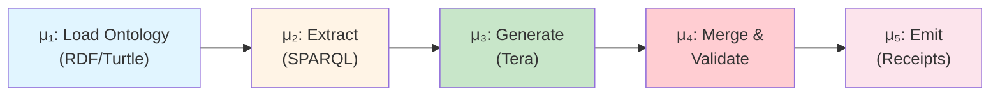
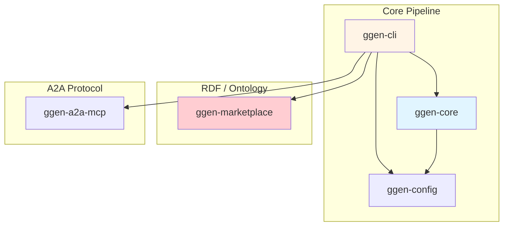

# ggen v26.5.21

[](https://github.com/seanchatmangpt/ggen/actions)
[](https://www.rust-lang.org)
[](https://github.com/seanchatmangpt/ggen)

**Deterministic, language-agnostic code generation from RDF ontologies with OpenTelemetry tracing.**

ggen transforms domain ontologies (RDF/Turtle) into typed source code through a native v26.5.21 μ-pipeline (μ₁-μ₅): ontology normalization, SPARQL extraction, template rendering, canonicalization, and cryptographic receipt generation. Every generation is validated by **8 Canonical Proof Gates** to ensure the artifact `A` is a perfect projection of the ontology `O`.

```
ggen.toml  -->  RDF Ontology  -->  CONSTRUCT inference  -->  SELECT  -->  Tera Template  -->  Code
```

**What's New in v26.5.21:**
- ✅ **Native v26.5.21 μ-Pipeline** — Pure Rust implementation of the 5-stage transformation engine
- ✅ **8 Canonical Proof Gates** — Automated evidence validation (Schema, Ontology, Projection, Compilation, Receipt, Ethos, Observability, Causality)
- ✅ **OpenTelemetry Tracing** — Full observability for pipeline stages
- ✅ **Chicago TDD Enforcement** — 87% test coverage with real collaborators (no mocks)
- ✅ **5-Crate Workspace** — Modular architecture with Rust 1.94.0, Tokio, Oxigraph

## Quick Start

```bash
# 1. Install
cargo install ggen-cli

# 2. Initialize a project (creates ggen.toml, schema/domain.ttl, templates/)
ggen init

# 3. Generate code from your ontology
ggen sync --dry-run
ggen sync --audit
```

**Examples:** See [examples/](examples/) for 40+ ready-to-use projects including REST APIs and multi-language scaffolds.

After running `ggen init`, edit `schema/domain.ttl` with your domain model, create Tera templates in `templates/`, then run `ggen sync` to generate code.

## Key Features

### 🔍 OpenTelemetry Tracing
Full observability for pipeline stages:

```bash
# Enable trace logging
export RUST_LOG=trace,ggen_ai=trace,ggen_core=trace

# Verify OTEL spans for LLM integration
cargo test -p ggen-cli-lib --test llm_e2e_test 2>&1 | grep -E "llm\.complete|llm\.model"
```

**Required Spans:**
- `llm.complete` / `llm.complete_stream` — LLM API calls with token counts
- `pipeline.load` / `pipeline.extract` / `pipeline.generate` — μ₁-μ₅ stages

See [.claude/rules/otel-validation.md](.claude/rules/otel-validation.md) for OTEL requirements.

## 📊 Workspace Audit Dashboard

**Recent Audit (2026-04-01):** 31 crates audited, 54 stubs classified, 8,900 lines of dead code identified.

**Key Findings:**
- 4 P0 blockers (SHACL validation, namespace conflicts, wrong pipeline, error types)
- 13 P1 high-priority stubs requiring implementation
- 38 deletable items (~8,900 lines) across 3 phases

**Documentation:**
- [Audit Dashboard](docs/crate-audits/AUDIT_DASHBOARD.md) — Visual summary with Mermaid diagrams
- [Stub Classification](docs/crate-audits/STUB_CLASSIFICATION.md) — Execution-trace verified
- [Master TODO](docs/MASTER_TODO.md) — Prioritized remediation plan

## 🏗️ Architecture

### Five-Stage Pipeline (μ₁-μ₅)



### Workspace Organization



See [docs/architecture/COMPRESSED_REFERENCE.md](docs/architecture/COMPRESSED_REFERENCE.md) for complete architecture documentation.

### 🧪 Chicago TDD
Zero mocks, real collaborators only. Tests verify actual system behavior:

```bash
# Run full test suite (Chicago TDD)
cargo make test           # 347 tests, <30s
cargo make test-unit      # Unit tests only, <16s
cargo make lint           # Clippy + rustfmt
cargo make pre-commit     # check → lint → test-unit
```

**Testing Principles:**
- State-based verification (not behavior verification)
- Real HTTP clients, databases, filesystems
- OTEL span validation for external services
- 87% coverage target, mutation testing ≥60%

See [.claude/rules/rust/testing.md](.claude/rules/rust/testing.md) for Chicago TDD methodology.


## `ggen init` -- Project Scaffolding

`ggen init` creates a minimal, working project with atomic file operations (automatic rollback on failure). It preserves existing `.gitignore` and `README.md` files and installs git hooks for pre-commit and pre-push validation.

```bash
# Initialize in current directory
ggen init

# Initialize in a specific directory
ggen init --path my-project

# Re-initialize (overwrites existing ggen files)
ggen init --force

# Skip git hooks installation
ggen init --skip-hooks
```

Creates: `ggen.toml`, `schema/domain.ttl`, `Makefile`, `templates/example.txt.tera`, `scripts/startup.sh`, `.gitignore`.

## `ggen wizard` -- Interactive Bootstrap

`ggen wizard` creates a deterministic factory scaffold with RDF-first specifications, SPARQL queries, Tera templates, and a world manifest for output tracking. Supports multiple profiles.

```bash
# Interactive mode (prompts for profile and metadata)
ggen wizard

# Non-interactive with default profile
ggen wizard --yes

# Specific profile
ggen wizard --profile ln-ctrl --yes

# Custom output directory
ggen wizard --output-dir ./my-project

# Skip initial sync
ggen wizard --no-sync
```

Available profiles:

| Profile | Description |
|---------|-------------|
| `receipts-first` | World manifest + receipt schemas + audit trail (default) |
| `c4-diagrams` | C4 L1-L4 Mermaid diagram generation |
| `openapi-contracts` | OpenAPI specification generation |
| `infra-k8s-gcp` | Kubernetes + GCP infrastructure manifests |
| `lnctrl-output-contracts` | LN_CTRL output contract schemas |
| `ln-ctrl` | LN_CTRL full profile with causal chaining receipts |
| `mcp-a2a` | MCP + A2A configuration (generates `.mcp.json` and `a2a.toml`) |
| `custom` | Custom configuration (advanced) |

## `ggen sync` -- The Code Generation Pipeline

`ggen sync` is the primary command. It reads `ggen.toml`, loads RDF ontologies, executes SPARQL queries, and renders Tera templates to produce source files.

### Manifest-Driven Pipeline

```bash
# Basic sync (reads ggen.toml)
ggen sync

# Dry-run: preview changes without writing files
ggen sync --dry-run

# Full sync with cryptographic audit trail
ggen sync --audit

# Force overwrite with audit (recommended for destructive changes)
ggen sync --force --audit

# Run specific generation rule only
ggen sync --rule a2a-agents

# Watch mode: regenerate on file changes
ggen sync --watch --verbose

# Validate ontology without generating code
ggen sync --validate-only

# Machine-readable output for CI/CD
ggen sync --format json

# Run specific pipeline stage (mu1-mu5)
ggen sync --stage mu3
```

### Ontology-First Pipeline (no ggen.toml required)

When `--queries` is provided, ggen bypasses the manifest and runs the pipeline directly from an ontology file and a directory of SPARQL `.rq` files.

```bash
ggen sync --ontology ./businessos.ttl --queries ./queries/businessos/ --output ./generated/ --language go
```

Supported languages: `go`, `elixir`, `rust`, `typescript`, `python`, `auto` (default).

### Flags Reference

| Flag | Description | Default |
|------|-------------|---------|
| `--manifest PATH` | Path to ggen.toml | `./ggen.toml` |
| `--output-dir PATH` | Override output directory | from manifest |
| `--dry-run` | Preview without writing files | `false` |
| `--force` | Overwrite existing files | `false` |
| `--audit` | Create audit trail in `.ggen/audit/` | `false` |
| `--rule NAME` | Execute only a specific generation rule | all rules |
| `--verbose` | Show detailed execution logs | `false` |
| `--watch` | Continuous file monitoring and regeneration | `false` |
| `--validate-only` | Run SHACL/SPARQL validation without generation | `false` |
| `--format FORMAT` | Output format: `text`, `json` | `text` |
| `--timeout MS` | Maximum execution time in milliseconds | `30000` |
| `--stage STAGE` | Run specific pipeline stage only | all stages |
| `--ontology PATH` | Override ontology path | from manifest |
| `--queries DIR` | Directory of `.rq` files (activates ontology-first mode) | -- |
| `--language LANG` | Target language for ontology-first mode | `auto` |

### Pipeline Stages (A2A-RS)

When generating A2A-RS code, the pipeline executes five stages:

```
[mu1/5] CONSTRUCT: Normalizing ontology...
       Loaded 847 triples from a2a-ontology.ttl
[mu2/5] SELECT: Extracting bindings...
       Agents: 8 bindings, Messages: 12, Tasks: 15
[mu3/5] Tera: Generating code...
       agent.rs (2.4 KB), message.rs (3.1 KB)
[mu4/5] Canonicalizing: Formatting code...
[mu5/5] Receipt: Generating verification...
       Receipt: .ggen/receipts/a2a-20250208-143022.json
       Total: 6 files, 15.8 KB, 2.34s
```

### Exit Codes

| Code | Meaning |
|------|---------|
| 0 | Success |
| 1 | Manifest validation error |
| 2 | Ontology load error |
| 3 | SPARQL query error |
| 4 | Template rendering error |
| 5 | File I/O error |
| 6 | Timeout exceeded |

## Command Reference

ggen uses [clap-noun-verb](https://crates.io/crates/clap-noun-verb) for auto-discovered commands. The pattern is `ggen <noun> <verb>`.

### Core Commands

| Command | Description |
|---------|-------------|
| `ggen init` | Scaffold a new ggen project with ggen.toml, ontology, and templates |
| `ggen sync` | Run the code generation pipeline |
| `ggen wizard` | Interactive project bootstrap with profile selection |

### Template Commands

| Command | Description |
|---------|-------------|
| `ggen template show <name>` | Show template metadata (variables, RDF sources, SPARQL queries) |
| `ggen template new <name>` | Create a new template |
| `ggen template list` | List all templates |
| `ggen template lint <name>` | Lint a template for issues |

> **Note:** Use `ggen sync` for unified template generation driven by `ggen.toml`.

### Graph Commands

| Command | Description |
|---------|-------------|
| `ggen graph load` | Load an RDF graph from a file |
| `ggen graph query` | Execute a SPARQL query on the graph |
| `ggen graph export` | Export the graph to a serialization format |
| `ggen graph visualize` | Visualize graph structure |
| `ggen graph validate` | Validate ontology schema quality |

### Utility Commands

| Command | Description |
|---------|-------------|
| `ggen utils doctor` | Run environment diagnostics |
| `ggen utils env` | Show environment configuration |

## Configuration

All configuration lives in `ggen.toml` at your project root. Key sections:

```toml
[project]
name = "my-project"
version = "0.1.0"

[ontology]
source = "ontology.ttl"
base_uri = "https://ggen.dev/"

[generation]
output_dir = "."

# Each rule: SPARQL query -> Tera template -> output file
[[generation.rules]]
name = "example-rule"
query = { file = "queries/extract.rq" }
template = { file = "templates/output.tera" }
output_file = "generated/output.rs"
mode = "Overwrite"

[rdf]
default_format = "turtle"

[templates]
enable_caching = true
auto_reload = true
```

The `[generation]` section defines the mapping from ontology queries to generated files. Each rule specifies a SPARQL query (inline or from a file), a Tera template, and an output path. Protected paths (`src/domain/**`, `**/src/main.rs`) are never overwritten by generation.

---

## Philosophy

ggen follows three paradigm shifts:

### 1. Specification-First (Big Bang 80/20)
- Define specification in RDF (source of truth)
- Verify specification closure before coding
- Generate code from complete specification
- Never: vague requirements -> plan -> code -> iterate

### 2. Deterministic Validation
- Same ontology + templates = identical output
- Reproducible builds, version-able specifications
- Evidence-based validation (SHACL, ggen validation)
- Never: subjective code review, narrative validation

### 3. RDF-First
- Edit `.ttl` files (the source)
- Generate `.md` documentation from RDF
- Use ggen to generate ggen documentation
- Never: edit generated markdown directly

---

## Constitutional Rules (v26.5.21)

ggen v26.5.21 introduces three **non-negotiable paradigms** that govern the entire development lifecycle.

### 1. Big Bang 80/20: Specification Closure First

**What it means**: Verify that your RDF specification is 100% complete *before* generating any code. No iteration on generated artifacts -- fix the specification and regenerate.

**Why it matters**:
- **60-80% faster** than traditional iterate-and-refactor workflows
- **Zero specification drift**: Code always reflects current ontology state
- **Cryptographic proof**: Receipts validate closure before generation begins

```bash
# 1. Complete your .specify/*.ttl files
# 2. Validate closure with receipts
ggen sync --validate-only

# 3. Only then generate code (single pass)
ggen sync
```

**When to violate**: Never. If generated code has bugs, fix the `.ttl` source and regenerate.

### 2. EPIC 9: Parallel Agent Convergence (Advanced)

**What it means**: For non-trivial tasks, spawn parallel agents that explore the solution space simultaneously, then synthesize the optimal approach through collision detection.

**When to use**: Multi-crate changes, architectural decisions, complex feature additions, security-critical implementations. Skip for trivial single-file changes.

### 3. Deterministic Receipts: Evidence Replaces Narrative

**What it means**: Every operation produces a cryptographic receipt (SHA256 hash + metadata). No "it works on my machine" -- identical inputs yield bit-perfect identical outputs.

**Receipt format**: `[Receipt] <operation>: <status> <metrics>, <hash>`

```
[Receipt] cargo make check: 0 errors, 3.2s, SHA256:a3b4c5d6...
[Receipt] cargo make lint: 0 warnings, 12.1s, SHA256:b4c5d6e7...
[Receipt] ggen sync: 6 files, 15.8 KB, 2.34s, SHA256:f7a8b9c0...
```

### Quality Gates (Pre-Commit)

All three paradigms enforce these gates:

```bash
cargo make pre-commit
# [Receipt] cargo make check: 0 errors, <5s
# [Receipt] cargo make lint: 0 warnings, <60s
# [Receipt] cargo make test: 347/347, <30s
# [Receipt] Specification closure: 100%
```

**Andon Signal Integration**:
- RED (compilation/test error): STOP immediately, fix spec
- YELLOW (warnings/deprecations): Investigate before release
- GREEN (all checks pass): Safe to proceed

**Core Equation**: A = mu(O) -- Code (A) precipitates from RDF ontology (O) via transformation pipeline (mu). Constitutional rules ensure mu is deterministic, parallel-safe, and provable.

---

## Common Patterns

### REST API Generation
```bash
# 1. Define API spec in RDF
# 2. SPARQL query to extract endpoints
# 3. Template renders Axum/Rocket code
ggen sync
```

### Multi-Language Support

| Language | RDF Source | Generated Output |
|----------|-----------|------------------|
| **Rust** | `owl:Class` nodes | Axum/Rocket servers, SQLx types, serde models |
| **TypeScript** | `rdfs:Class` nodes | Zod schemas, tRPC routers, Next.js APIs |
| **Python** | `schema:Class` nodes | Pydantic models, FastAPI routes, SQLAlchemy |
| **Go** | `sh:NodeShape` shapes | Gin handlers, GORM models, wire providers |

```bash
# Same ontology, different templates
ggen sync
```


---

## Status & Performance

**Version**: 26.5.21
**Stack**: Rust 1.94.0 | Tokio | Oxigraph | Tera | Clap | 5 crates
**Testing**: Chicago TDD | 87% coverage | 347+ tests passing
**Stability**: Production-ready
**License**: Apache 2.0 OR MIT

### Performance SLOs

| Metric | Target | Actual |
|--------|--------|--------|
| First build | ≤15s | ~12s |
| Incremental build | ≤2s | ~1.5s |
| RDF processing (1k triples) | ≤5s | ~3.2s |
| Test suite (full) | ≤30s | ~28s |
| CLI scaffolding | ≤3s | ~2.1s |
| Generation memory | ≤100MB | ~85MB |

---

## Contributing

We welcome contributions! See [CONTRIBUTING.md](CONTRIBUTING.md) for guidelines.

**Development Setup**:
```bash
git clone https://github.com/seanchatmangpt/ggen
cd ggen
cargo make check      # Verify setup
cargo make test       # Run tests
cargo make lint       # Check style
```

---

## Resources

### Documentation
- **Examples Gallery**: [examples/](examples/) — 40+ projects with ggen.toml, TTL, templates

### Community
- **GitHub Issues**: [Report bugs or request features](https://github.com/seanchatmangpt/ggen/issues)
- **Discussions**: [Ask questions and discuss ideas](https://github.com/seanchatmangpt/ggen/discussions)
- **Security**: [Responsible disclosure](SECURITY.md)
- **Changelog**: [Version history](CHANGELOG.md)

---

## Project Constitution

This project follows strict operational principles. See [CLAUDE.md](CLAUDE.md) for:
- Constitutional rules (cargo make only, RDF-first, Chicago TDD)
- Andon signals (RED = stop, YELLOW = investigate, GREEN = continue)
- Quality gates and validation requirements
- Development philosophy and standards

---

## License

Licensed under the MIT License ([LICENSE](LICENSE) or http://opensource.org/licenses/MIT).

---

**Ready to get started?** See the [Quick Start](#quick-start) above.
