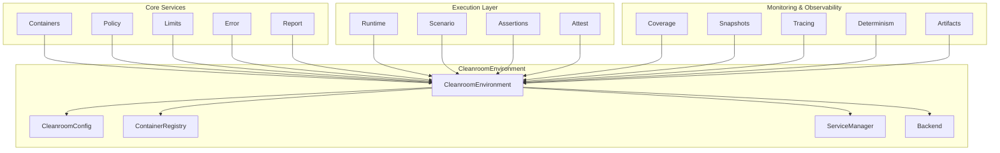
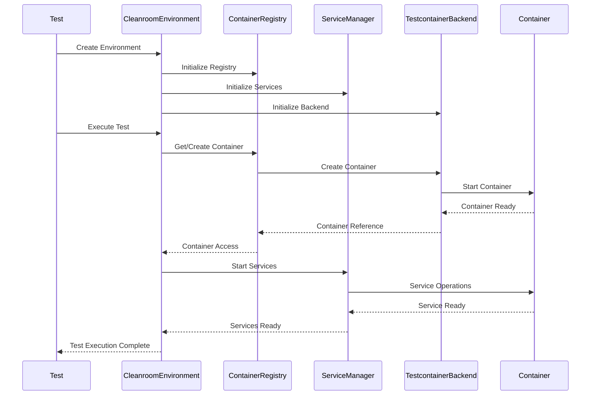
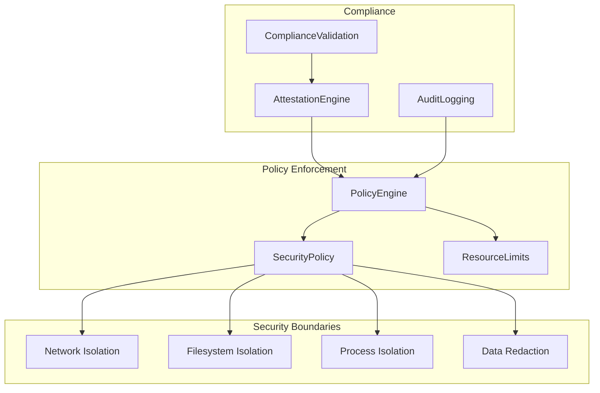
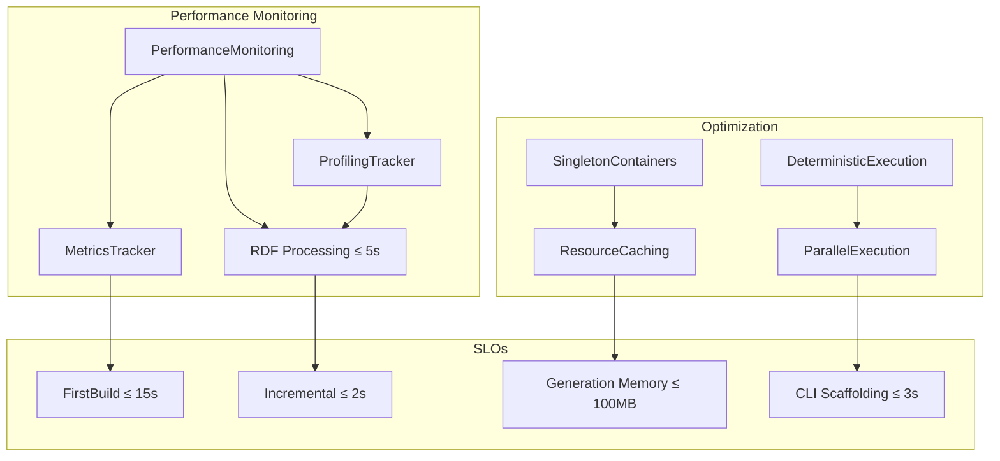
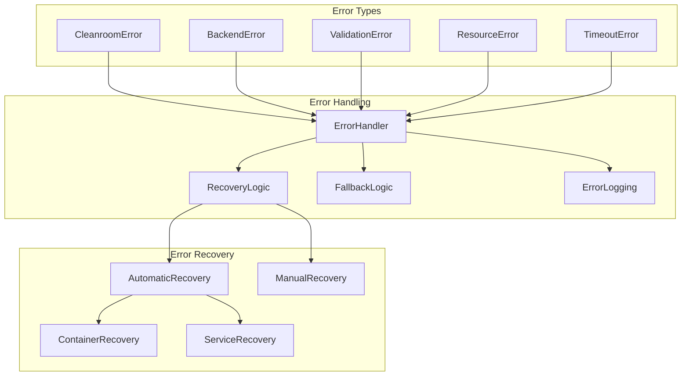

# Cleanroom Architecture Overview

## System Architecture

The Cleanroom Testing Framework is designed as a comprehensive, production-ready testing environment using testcontainers with core team best practices. The architecture follows a modular design with clear separation of concerns.

### Core Components

## Component Responsibilities

### CleanroomEnvironment
- **Purpose**: Central orchestrator for the testing environment
- **Responsibilities**:
  - Session management with unique UUIDs
  - Container lifecycle management and registry
  - Service management and coordination
  - Backend abstraction and integration
  - Test execution coordination and policy enforcement

### Core Services
- **Containers**: PostgreSQL, Redis, and generic container implementations
- **Policy**: Security policies, resource limits, and compliance rules
- **Limits**: Resource monitoring and enforcement
- **Error**: Comprehensive error handling and recovery
- **Report**: Test reporting and result aggregation

### Execution Layer
- **Runtime**: Command execution with timeout and policy enforcement
- **Scenario**: Multi-step test orchestration with deterministic execution
- **Assertions**: Test result validation and verification
- **Attest**: Security and compliance verification

### Monitoring & Observability
- **Coverage**: Test coverage measurement and reporting
- **Snapshots**: Snapshot testing and validation
- **Tracing**: Distributed tracing and observability
- **Determinism**: Deterministic execution with fixed seeds
- **Artifacts**: Test artifact collection and management

## Data Flow

## Security Architecture

## Performance Architecture

## Error Handling Architecture

## Integration Points

### Testcontainers Integration
- Uses testcontainers-rs version 0.25
- Supports PostgreSQL, Redis, and generic containers
- Implements singleton pattern for performance
- Provides health checks and readiness probes

### Docker Integration
- Requires Docker daemon for container execution
- Supports container customization and configuration
- Implements proper cleanup and resource management
- Provides network isolation and port mapping

### Rust Integration
- Built with Rust stable toolchain
- Uses tokio for async runtime
- Implements RAII for resource management
- Provides type-safe configuration and error handling

## Best Practices Implemented

1. **Singleton Containers**: Start containers once per test suite for performance
2. **Resource Monitoring**: Track CPU, memory, disk, and network usage
3. **Security Isolation**: Network, filesystem, and process isolation
4. **Deterministic Execution**: Fixed seeds for reproducible tests
5. **Coverage Tracking**: Track test coverage and execution paths
6. **Snapshot Testing**: Capture and compare test outputs
7. **Tracing & Observability**: Detailed tracing and metrics collection
8. **Error Handling**: Comprehensive error handling and recovery
9. **Performance Monitoring**: Real-time performance monitoring and alerting
10. **RAII Management**: Automatic resource cleanup and lifecycle management

