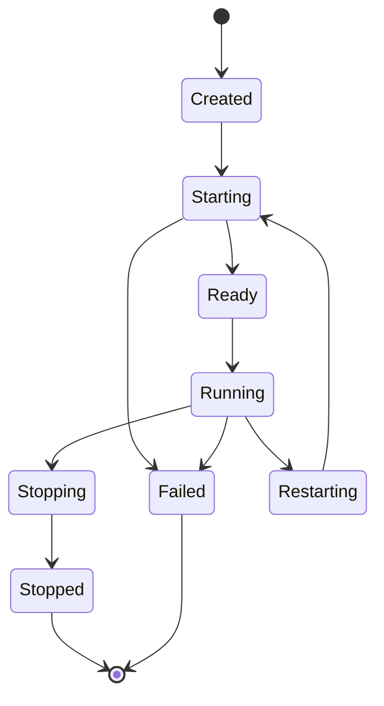
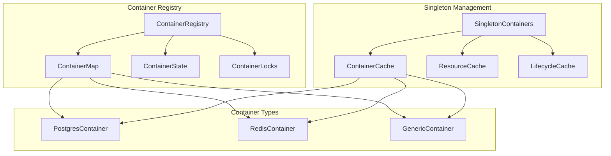
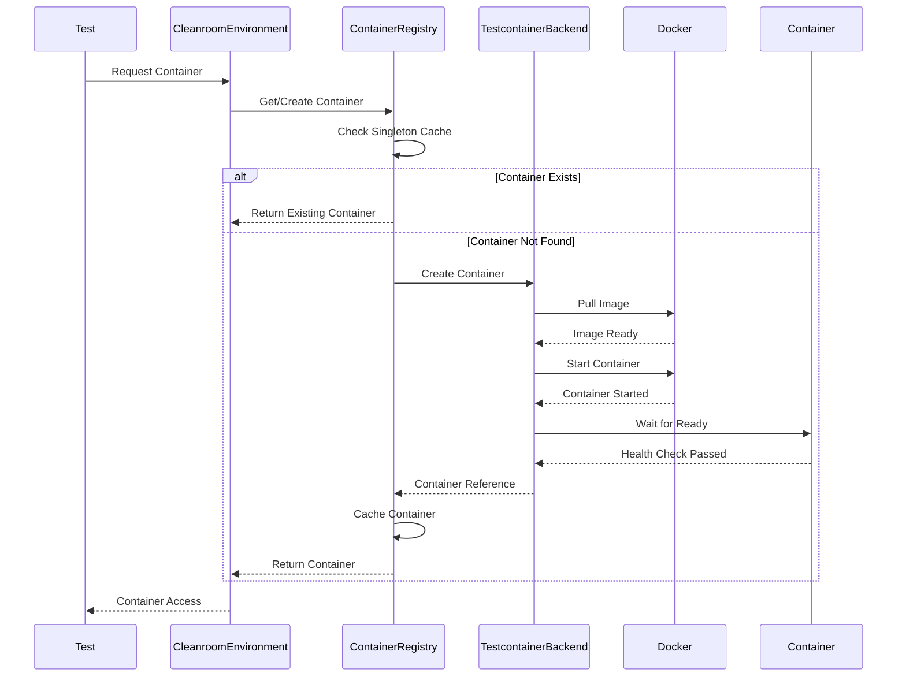
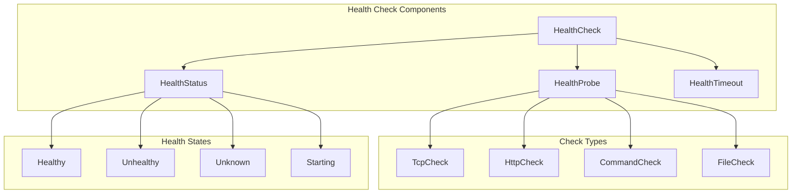
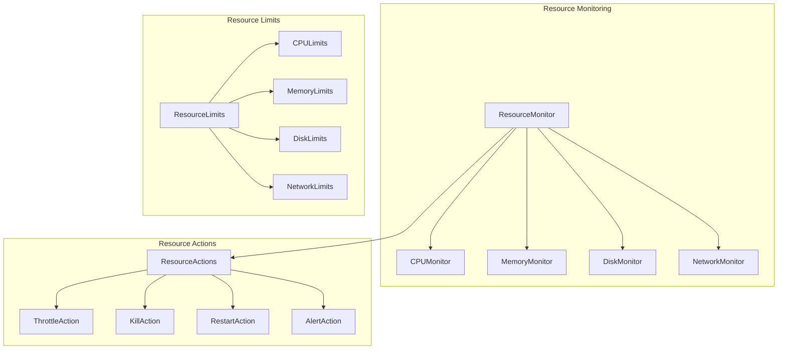
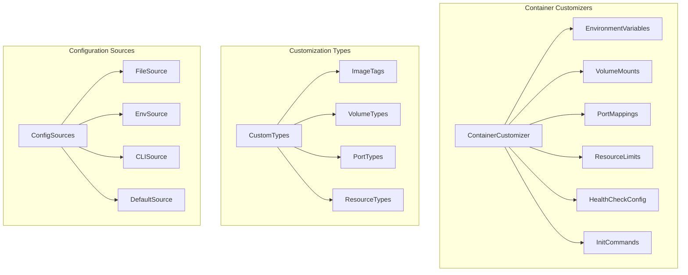
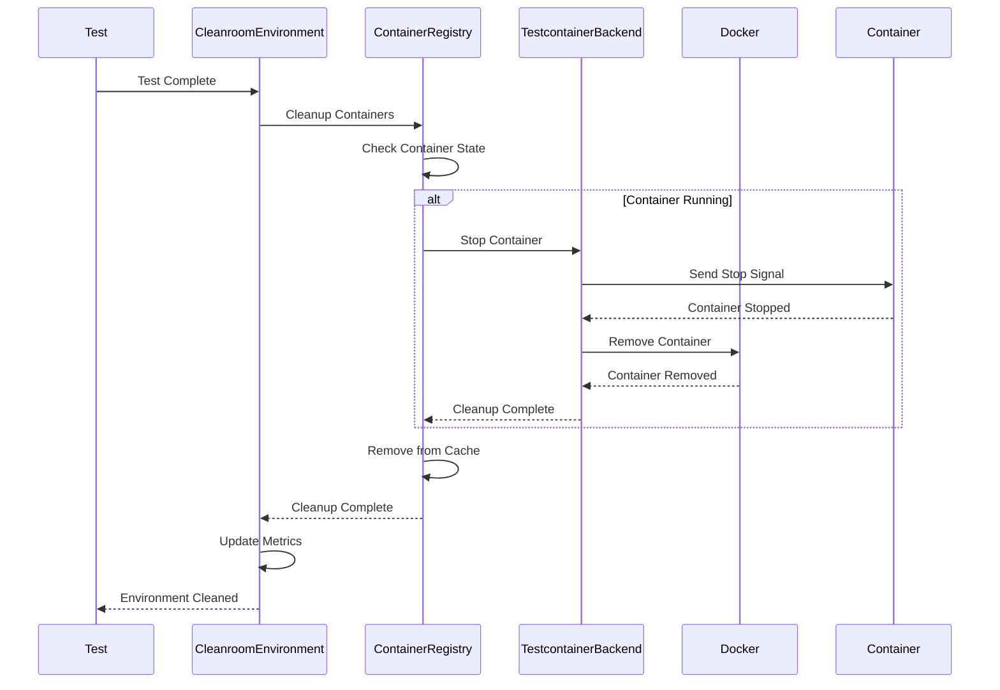
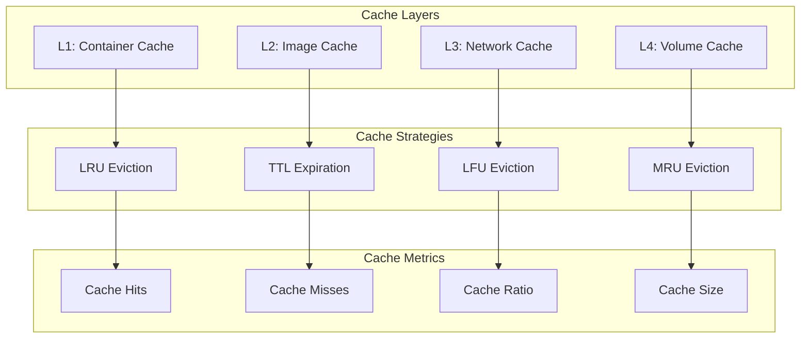
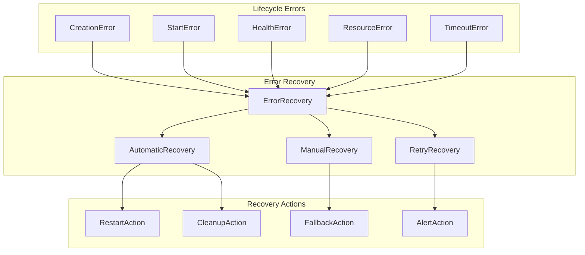
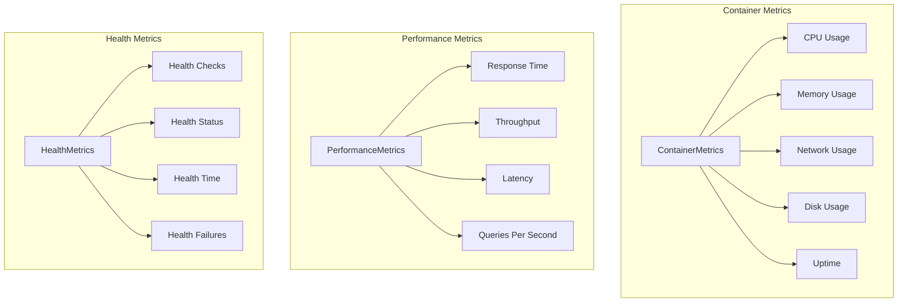

# Container Lifecycle Management

## Container Lifecycle Overview

The Cleanroom framework implements a sophisticated container lifecycle management system following core team best practices for performance, reliability, and resource efficiency.

## Lifecycle States



## Container Registry Pattern



## Container Creation Flow



## Health Check System



## Resource Management



## Container Customization



## Cleanup and Teardown



## Performance Optimizations

### Singleton Pattern Implementation

```rust
// Containers are created once and reused across tests
let postgres = environment.get_or_create_container("postgres", || {
    PostgresContainer::new(&environment.docker_client, "testdb", "testuser", "testpass")
}).await.unwrap();
```

### Resource Caching



## Error Handling in Lifecycle



## Monitoring and Observability

### Container Metrics



## Best Practices

1. **Singleton Containers**: Start containers once per test suite for performance
2. **Health Checks**: Implement comprehensive health check system
3. **Resource Limits**: Enforce resource limits to prevent system overload
4. **Graceful Shutdown**: Implement proper cleanup and teardown procedures
5. **Error Recovery**: Implement automatic error recovery mechanisms
6. **Monitoring**: Track container metrics and performance
7. **Caching**: Implement multi-layer caching for performance
8. **Customization**: Support flexible container customization
9. **Isolation**: Ensure proper container isolation and security
10. **Determinism**: Maintain deterministic container lifecycle

