# Error Architecture

## Error System Overview

The Cleanroom framework implements a comprehensive error handling system following core team best practices with structured error types, context preservation, and user-friendly error messages.

## Error Hierarchy

```mermaid
graph TB
    subgraph "Core Error Types"
        CE[CleanroomError]
        EK[ErrorKind]
        BE[BackendError]
        PE[PolicyError]
        SE[ScenarioError]
        SVE[ServiceError]
        CFE[ConfigError]
    end
    
    subgraph "ErrorKind Variants"
        EK2[ContainerError]
        EK3[NetworkError]
        EK4[ResourceLimitExceeded]
        EK5[Timeout]
        EK6[ConfigurationError]
        EK7[PolicyViolation]
        EK8[DeterministicError]
        EK9[CoverageError]
        EK10[SnapshotError]
        EK11[TracingError]
        EK12[RedactionError]
        EK13[ReportError]
        EK14[IoError]
        EK15[SerializationError]
        EK16[ValidationError]
        EK17[InternalError]
    end
    
    subgraph "Specialized Error Types"
        BE2[BackendError Variants]
        PE2[PolicyError Variants]
        SE2[ScenarioError Variants]
        SVE2[ServiceError Variants]
        CFE2[ConfigError Variants]
    end
    
    CE --> EK
    CE --> BE
    CE --> PE
    CE --> SE
    CE --> SVE
    CE --> CFE
    
    EK --> EK2
    EK --> EK3
    EK --> EK4
    EK --> EK5
    EK --> EK6
    EK --> EK7
    EK --> EK8
    EK --> EK9
    EK --> EK10
    EK --> EK11
    EK --> EK12
    EK --> EK13
    EK --> EK14
    EK --> EK15
    EK --> EK16
    EK --> EK17
    
    BE --> BE2
    PE --> PE2
    SE --> SE2
    SVE --> SVE2
    CFE --> CFE2
```

## CleanroomError Structure

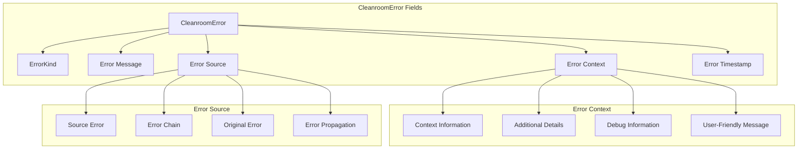

## Error Creation Flow

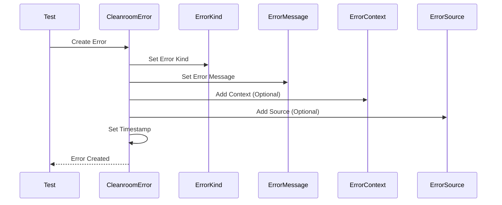

## ErrorKind Categories

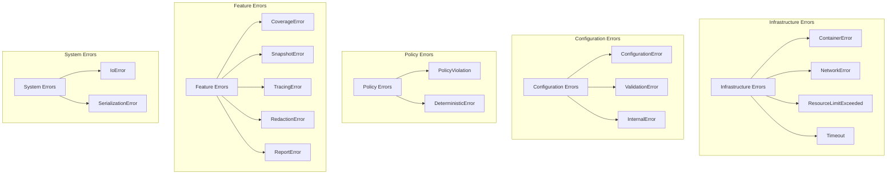

## Specialized Error Types

### BackendError Variants

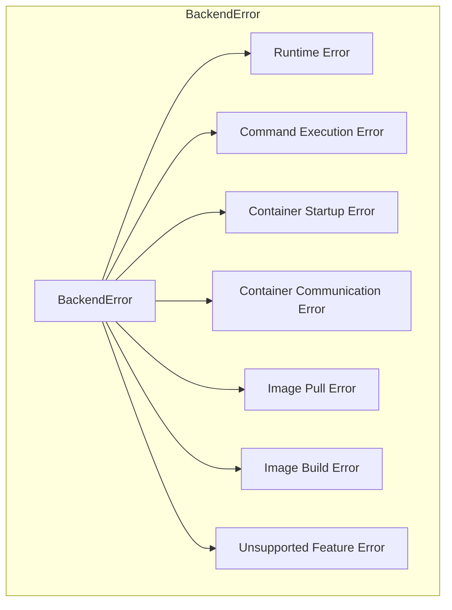

### PolicyError Variants

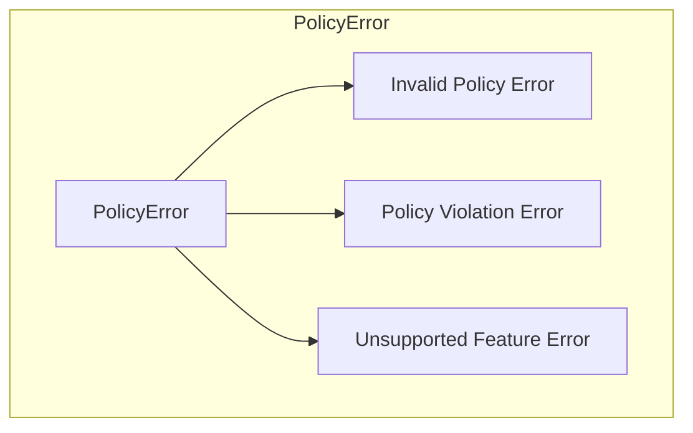

### ScenarioError Variants

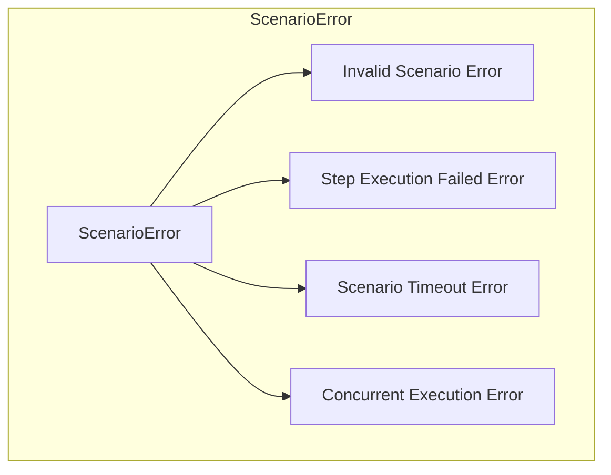

### ServiceError Variants

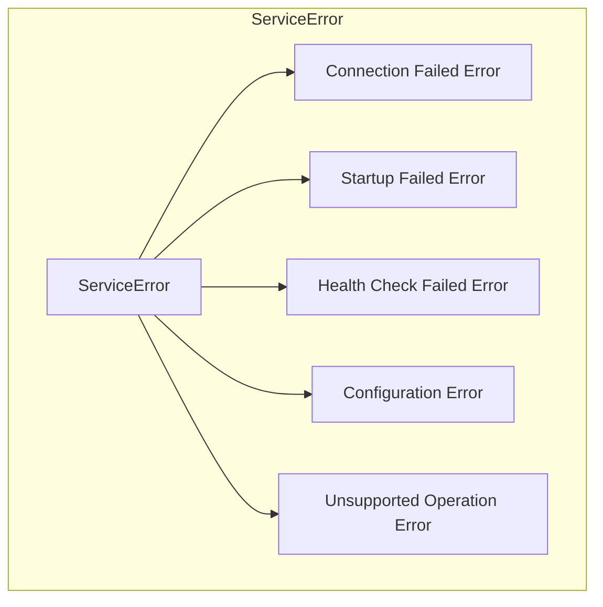

### ConfigError Variants

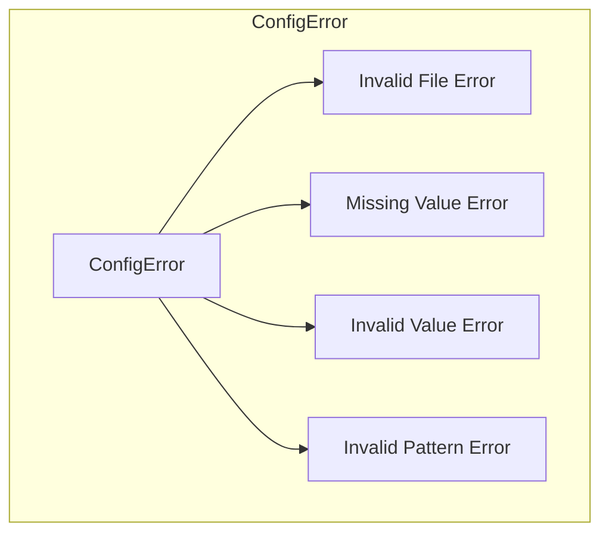

## Error Conversion and Propagation

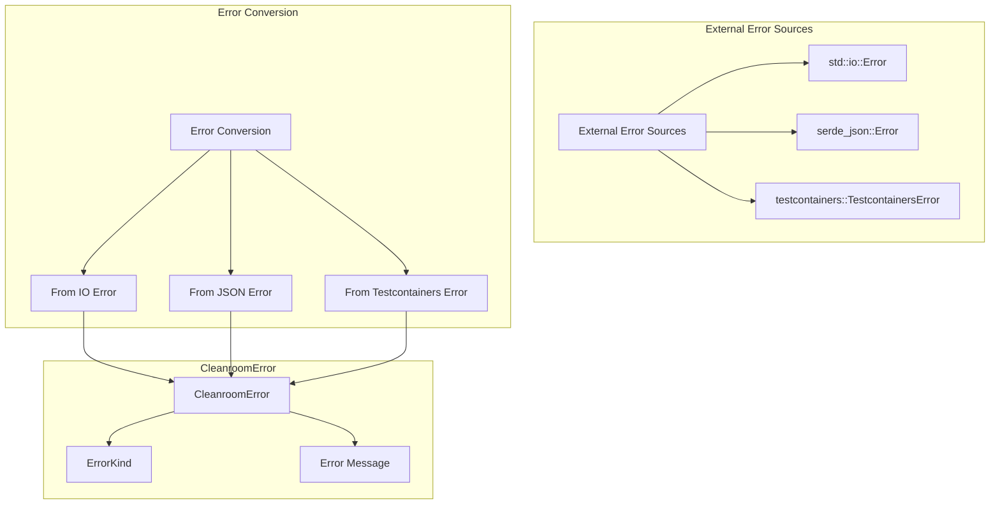

## Error Handling Patterns

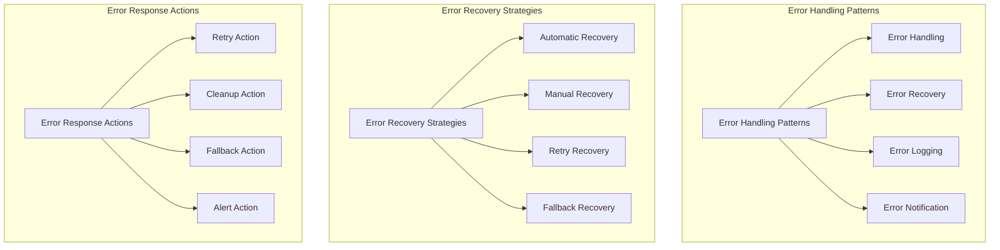

## Error Context and Metadata

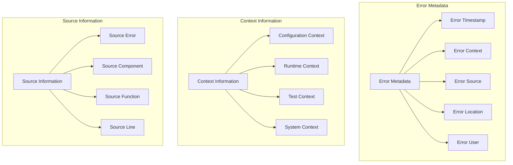

## Error Display and Formatting

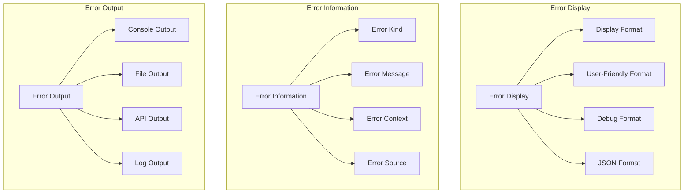

## Error Testing and Validation

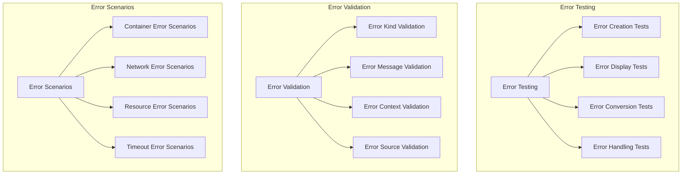

## Error Best Practices

### 1. Error Creation
```rust
// Good: Use specific error constructors
let error = CleanroomError::container_error("Container failed to start")
    .with_context("PostgreSQL container")
    .with_source("testcontainers");

// Avoid: Generic error creation
let error = CleanroomError::new(ErrorKind::ContainerError, "Container failed");
```

### 2. Error Context
```rust
// Good: Add meaningful context
let error = CleanroomError::timeout_error("Operation timed out")
    .with_context("Database connection attempt")
    .with_source("PostgreSQL service");

// Avoid: Minimal context
let error = CleanroomError::timeout_error("Timeout");
```

### 3. Error Conversion
```rust
// Good: Convert external errors properly
let result: Result<String> = std::fs::read_to_string("config.toml")
    .map_err(|e| CleanroomError::io_error("Failed to read config file")
        .with_source(e.to_string()))?;

// Avoid: Losing error information
let result: Result<String> = std::fs::read_to_string("config.toml")
    .map_err(|_| CleanroomError::io_error("File read failed"))?;
```

### 4. Error Handling
```rust
// Good: Handle errors with specific types
match result {
    Ok(value) => println!("Success: {:?}", value),
    Err(CleanroomError { kind: ErrorKind::ContainerError, .. }) => {
        eprintln!("Container error occurred");
        // Handle container-specific error
    },
    Err(CleanroomError { kind: ErrorKind::Timeout, .. }) => {
        eprintln!("Timeout occurred");
        // Handle timeout-specific error
    },
    Err(e) => {
        eprintln!("Unexpected error: {}", e);
        // Handle unexpected error
    },
}

// Avoid: Generic error handling
match result {
    Ok(value) => println!("Success: {:?}", value),
    Err(e) => eprintln!("Error: {}", e),
}
```

### 5. Error Propagation
```rust
// Good: Propagate errors with context
fn process_data() -> Result<String> {
    let data = read_file("data.txt")?; // ? operator propagates error
    let processed = transform_data(data)?;
    Ok(processed)
}

// Avoid: Swallowing errors
fn process_data() -> Result<String> {
    let data = match read_file("data.txt") {
        Ok(d) => d,
        Err(_) => return Err(CleanroomError::io_error("File read failed")),
    };
    Ok(data)
}
```

## Error Monitoring and Alerting

### Error Metrics
- Error frequency by type
- Error rate trends
- Error recovery success rate
- Error impact assessment
- Error resolution time

### Error Alerts
- Critical error alerts
- Error threshold breaches
- Error pattern anomalies
- Error escalation procedures
- Error notification channels

### Error Reporting
- Daily error summary
- Weekly error trends
- Monthly error analysis
- Quarterly error review
- Annual error assessment

