# Error Flow Diagrams

## Error Flow Overview

This document provides detailed flow diagrams showing how errors propagate through the Cleanroom framework and how they are handled at different levels.

## Error Creation and Propagation Flow

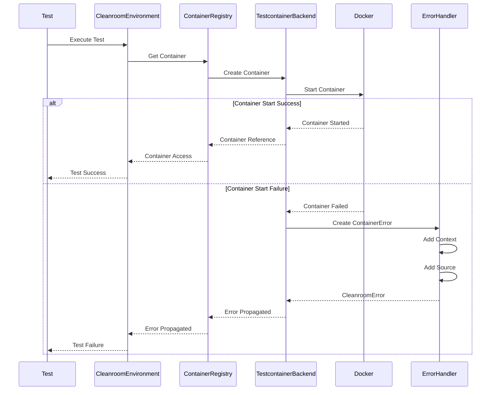

## Error Handling Hierarchy

```mermaid
graph TB
    subgraph "Error Handling Layers"
        L1[Layer 1: Application Level]
        L2[Layer 2: Framework Level]
        L3[Layer 3: Component Level]
        L4[Layer 4: System Level]
    end
    
    subgraph "Layer 1 - Application"
        T[Test Code]
        EH1[Test Error Handler]
        ER1[Test Error Recovery]
    end
    
    subgraph "Layer 2 - Framework"
        CE[CleanroomEnvironment]
        EH2[Framework Error Handler]
        ER2[Framework Error Recovery]
    end
    
    subgraph "Layer 3 - Component"
        CR[ContainerRegistry]
        SM[ServiceManager]
        TC[TestcontainerBackend]
        EH3[Component Error Handler]
        ER3[Component Error Recovery]
    end
    
    subgraph "Layer 4 - System"
        D[Docker]
        OS[Operating System]
        EH4[System Error Handler]
        ER4[System Error Recovery]
    end
    
    L1 --> L2
    L2 --> L3
    L3 --> L4
    
    T --> EH1
    EH1 --> ER1
    
    CE --> EH2
    EH2 --> ER2
    
    CR --> EH3
    SM --> EH3
    TC --> EH3
    EH3 --> ER3
    
    D --> EH4
    OS --> EH4
    EH4 --> ER4
```

## Error Recovery Flow

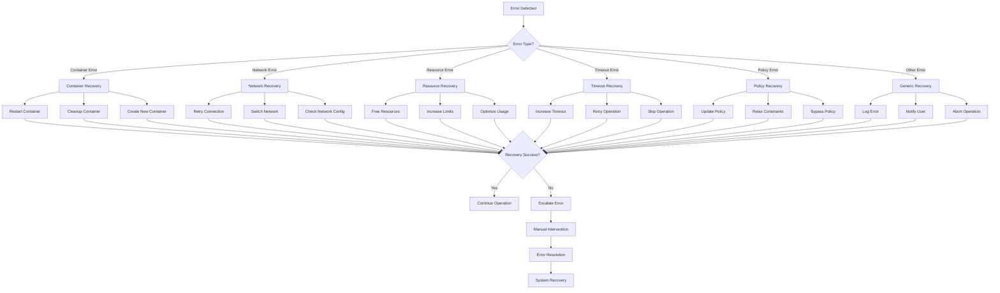

## Error Context Propagation

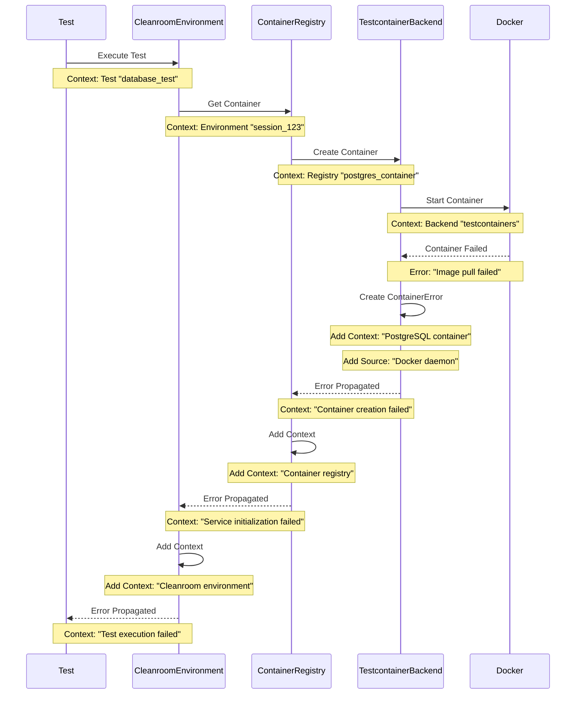

## Error Classification Flow

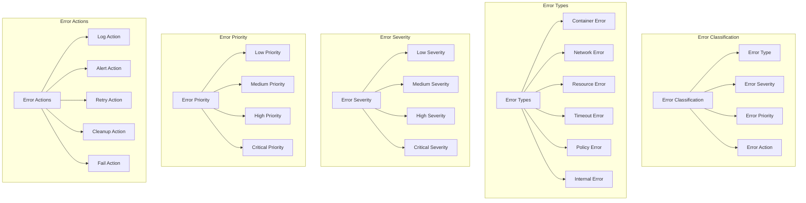

## Error Monitoring Flow

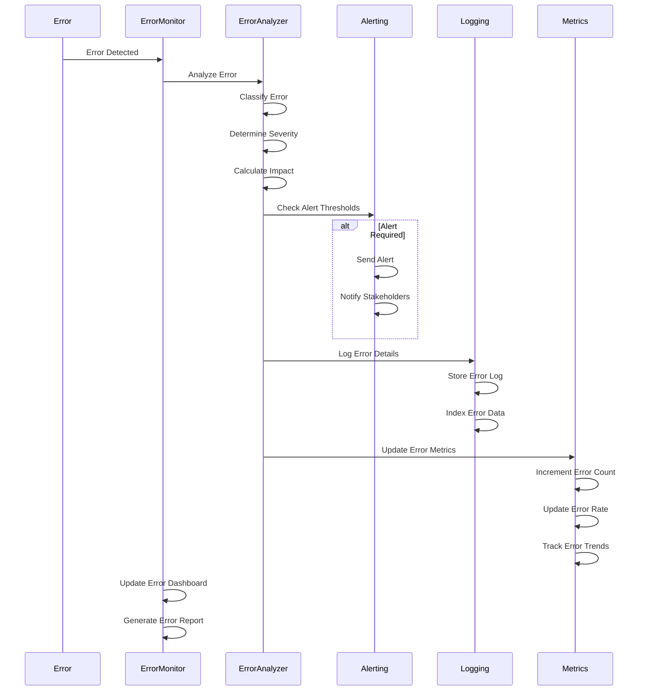

## Error Response Flow

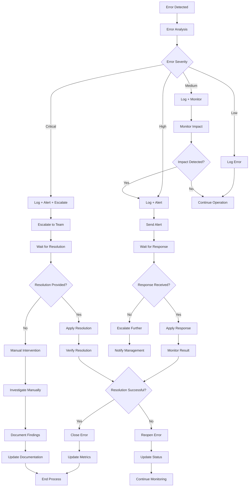

## Error Escalation Flow

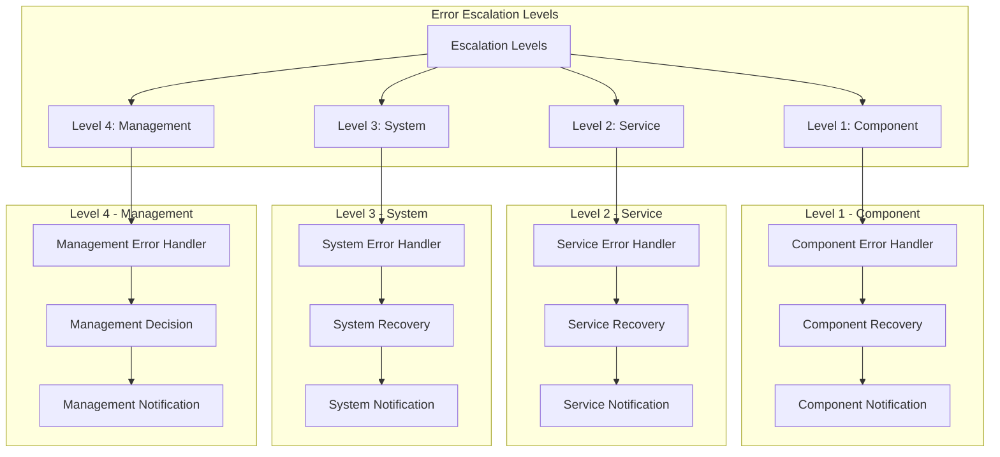

## Error Recovery Strategies

```mermaid
graph TB
    subgraph "Recovery Strategies"
        RS[Recovery Strategies]
        AR[Automatic Recovery]
        MR[Manual Recovery]
        RR[Retry Recovery]
        FR[Fallback Recovery]
    end
    
    subgraph "Automatic Recovery"
        AR2[Automatic Recovery]
        AR3[Container Restart]
        AR4[Service Restart]
        AR5[Resource Cleanup]
        AR6[Network Reset]
    end
    
    subgraph "Manual Recovery"
        MR2[Manual Recovery]
        MR3[Human Intervention]
        MR4[Configuration Change]
        MR5[System Maintenance]
        MR6[Hardware Replacement]
    end
    
    subgraph "Retry Recovery"
        RR2[Retry Recovery]
        RR3[Exponential Backoff]
        RR4[Linear Backoff]
        RR5[Fixed Retry]
        RR6[Adaptive Retry]
    end
    
    subgraph "Fallback Recovery"
        FR2[Fallback Recovery]
        FR3[Alternative Service]
        FR4[Reduced Functionality]
        FR5[Offline Mode]
        FR6[Emergency Mode]
    end
    
    RS --> AR
    RS --> MR
    RS --> RR
    RS --> FR
    
    AR --> AR2
    AR2 --> AR3
    AR2 --> AR4
    AR2 --> AR5
    AR2 --> AR6
    
    MR --> MR2
    MR2 --> MR3
    MR2 --> MR4
    MR2 --> MR5
    MR2 --> MR6
    
    RR --> RR2
    RR2 --> RR3
    RR2 --> RR4
    RR2 --> RR5
    RR2 --> RR6
    
    FR --> FR2
    FR2 --> FR3
    FR2 --> FR4
    FR2 --> FR5
    FR2 --> FR6
```

## Error Metrics and Analytics

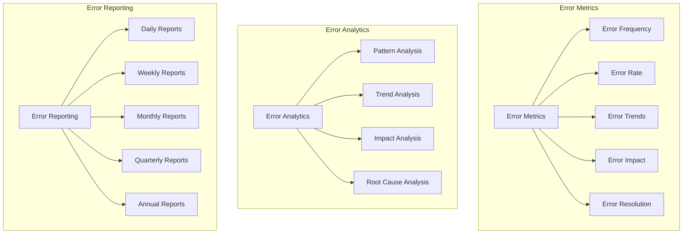

## Error Testing Flow

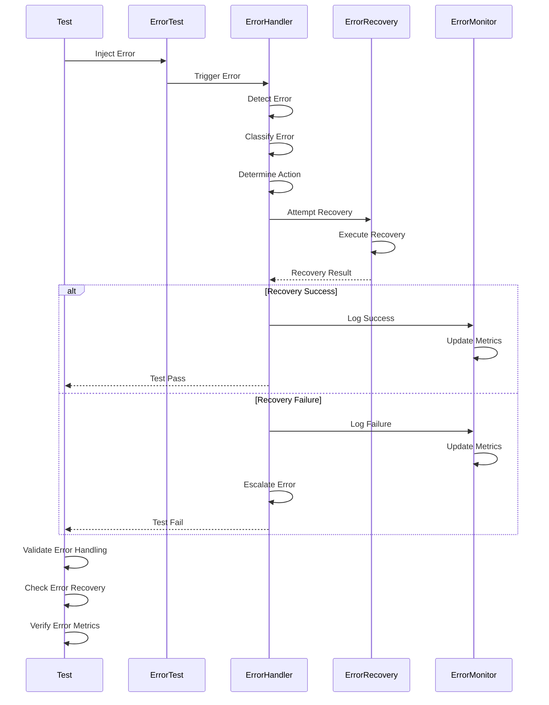

## Error Best Practices Flow

```mermaid
graph TB
    subgraph "Error Best Practices"
        EBP[Error Best Practices]
        EC[Error Creation]
        EH[Error Handling]
        EP[Error Propagation]
        ER[Error Recovery]
        EM[Error Monitoring]
    end
    
    subgraph "Error Creation"
        EC2[Error Creation]
        EC3[Use Specific Constructors]
        EC4[Add Meaningful Context]
        EC5[Include Source Information]
        EC6[Set Appropriate Timestamps]
    end
    
    subgraph "Error Handling"
        EH2[Error Handling]
        EH3[Handle Specific Types]
        EH4[Provide User-Friendly Messages]
        EH5[Implement Proper Logging]
        EH6[Enable Error Tracing]
    end
    
    subgraph "Error Propagation"
        EP2[Error Propagation]
        EP3[Use ? Operator]
        EP4[Preserve Error Context]
        EP5[Add Layer-Specific Context]
        EP6[Maintain Error Chain]
    end
    
    subgraph "Error Recovery"
        ER2[Error Recovery]
        ER3[Implement Retry Logic]
        ER4[Provide Fallback Options]
        ER5[Enable Graceful Degradation]
        ER6[Support Manual Intervention]
    end
    
    subgraph "Error Monitoring"
        EM2[Error Monitoring]
        EM3[Track Error Metrics]
        EM4[Monitor Error Trends]
        EM5[Set Up Alerts]
        EM6[Generate Reports]
    end
    
    EBP --> EC
    EBP --> EH
    EBP --> EP
    EBP --> ER
    EBP --> EM
    
    EC --> EC2
    EC2 --> EC3
    EC2 --> EC4
    EC2 --> EC5
    EC2 --> EC6
    
    EH --> EH2
    EH2 --> EH3
    EH2 --> EH4
    EH2 --> EH5
    EH2 --> EH6
    
    EP --> EP2
    EP2 --> EP3
    EP2 --> EP4
    EP2 --> EP5
    EP2 --> EP6
    
    ER --> ER2
    ER2 --> ER3
    ER2 --> ER4
    ER2 --> ER5
    ER2 --> ER6
    
    EM --> EM2
    EM2 --> EM3
    EM2 --> EM4
    EM2 --> EM5
    EM2 --> EM6
```
