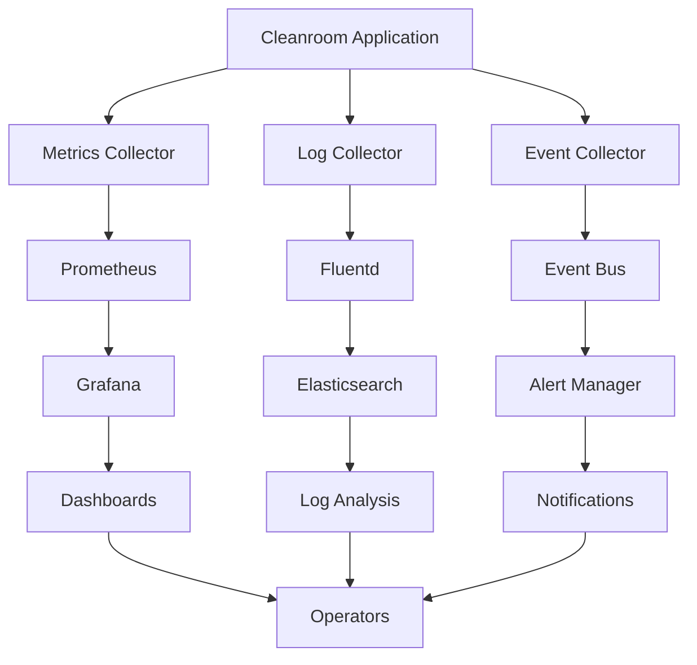

# Monitoring Guide

This guide provides comprehensive instructions for setting up monitoring, observability, and alerting for the Cleanroom Testing Framework.

## Table of Contents

1. [Overview](#overview)
2. [Monitoring Architecture](#monitoring-architecture)
3. [Metrics Collection](#metrics-collection)
4. [Log Aggregation](#log-aggregation)
5. [Alerting](#alerting)
6. [Dashboards](#dashboards)
7. [Performance Monitoring](#performance-monitoring)
8. [Security Monitoring](#security-monitoring)
9. [Troubleshooting](#troubleshooting)

## Overview

### Monitoring Objectives

The Cleanroom monitoring system provides:

- **Real-time Visibility**: Current system state and performance
- **Historical Analysis**: Trends and patterns over time
- **Proactive Alerting**: Early warning of issues
- **Capacity Planning**: Resource usage forecasting
- **Security Monitoring**: Threat detection and response
- **Compliance Reporting**: Audit trails and compliance metrics

### Key Metrics

#### System Metrics
- **CPU Usage**: Processor utilization percentage
- **Memory Usage**: RAM consumption and availability
- **Disk Usage**: Storage utilization and I/O performance
- **Network Usage**: Bandwidth consumption and latency

#### Application Metrics
- **Request Rate**: API requests per second
- **Response Time**: API response latency
- **Error Rate**: Failed requests percentage
- **Throughput**: Tests executed per minute

#### Container Metrics
- **Container Count**: Active containers
- **Container Health**: Health check status
- **Resource Usage**: Per-container resource consumption
- **Lifecycle Events**: Start/stop events

#### Business Metrics
- **Test Success Rate**: Test pass/fail ratio
- **Test Duration**: Average test execution time
- **Resource Efficiency**: Cost per test
- **User Activity**: Active users and sessions

## Monitoring Architecture

### Architecture Overview



### Components

#### Metrics Collection
- **Prometheus**: Time-series database for metrics
- **Node Exporter**: System metrics collection
- **cAdvisor**: Container metrics collection
- **Custom Exporters**: Application-specific metrics

#### Log Aggregation
- **Fluentd**: Log collection and forwarding
- **Elasticsearch**: Log storage and indexing
- **Kibana**: Log analysis and visualization
- **Logstash**: Log processing and enrichment

#### Alerting
- **Alert Manager**: Alert routing and management
- **PagerDuty**: Incident management
- **Slack**: Team notifications
- **Email**: Critical alert notifications

#### Visualization
- **Grafana**: Metrics dashboards
- **Kibana**: Log dashboards
- **Custom Dashboards**: Business-specific views

## Metrics Collection

### 1. Prometheus Setup

#### Installation
```bash
# Download Prometheus
wget https://github.com/prometheus/prometheus/releases/download/v2.40.0/prometheus-2.40.0.linux-amd64.tar.gz
tar xzf prometheus-2.40.0.linux-amd64.tar.gz
sudo mv prometheus-2.40.0.linux-amd64 /opt/prometheus

# Create user
sudo useradd --no-create-home --shell /bin/false prometheus
sudo chown -R prometheus:prometheus /opt/prometheus
```

#### Configuration
```bash
# Create configuration file
sudo tee /etc/prometheus/prometheus.yml > /dev/null <<EOF
global:
  scrape_interval: 15s
  evaluation_interval: 15s

rule_files:
  - "cleanroom_rules.yml"

scrape_configs:
  - job_name: 'prometheus'
    static_configs:
      - targets: ['localhost:9090']

  - job_name: 'cleanroom'
    static_configs:
      - targets: ['localhost:8080']
    scrape_interval: 10s
    metrics_path: /metrics
    scrape_timeout: 5s

  - job_name: 'node-exporter'
    static_configs:
      - targets: ['localhost:9100']

  - job_name: 'cadvisor'
    static_configs:
      - targets: ['localhost:8080']

  - job_name: 'postgres-exporter'
    static_configs:
      - targets: ['localhost:9187']

  - job_name: 'redis-exporter'
    static_configs:
      - targets: ['localhost:9121']
EOF
```

#### Service Configuration
```bash
# Create systemd service
sudo tee /etc/systemd/system/prometheus.service > /dev/null <<EOF
[Unit]
Description=Prometheus
Wants=network-online.target
After=network-online.target

[Service]
User=prometheus
Group=prometheus
Type=simple
ExecStart=/opt/prometheus/prometheus \\
  --config.file /etc/prometheus/prometheus.yml \\
  --storage.tsdb.path /opt/prometheus/data \\
  --web.console.templates=/opt/prometheus/consoles \\
  --web.console.libraries=/opt/prometheus/console_libraries \\
  --web.listen-address=0.0.0.0:9090 \\
  --web.enable-lifecycle

[Install]
WantedBy=multi-user.target
EOF

# Start service
sudo systemctl daemon-reload
sudo systemctl start prometheus
sudo systemctl enable prometheus
```

### 2. Node Exporter

#### Installation
```bash
# Download Node Exporter
wget https://github.com/prometheus/node_exporter/releases/download/v1.5.0/node_exporter-1.5.0.linux-amd64.tar.gz
tar xzf node_exporter-1.5.0.linux-amd64.tar.gz
sudo mv node_exporter-1.5.0.linux-amd64/node_exporter /usr/local/bin/
sudo chown root:root /usr/local/bin/node_exporter
```

#### Service Configuration
```bash
# Create systemd service
sudo tee /etc/systemd/system/node_exporter.service > /dev/null <<EOF
[Unit]
Description=Node Exporter
Wants=network-online.target
After=network-online.target

[Service]
User=node_exporter
Group=node_exporter
Type=simple
ExecStart=/usr/local/bin/node_exporter \\
  --collector.systemd \\
  --collector.textfile.directory=/var/lib/node_exporter/textfile_collector

[Install]
WantedBy=multi-user.target
EOF

# Create user
sudo useradd --no-create-home --shell /bin/false node_exporter
sudo mkdir -p /var/lib/node_exporter/textfile_collector
sudo chown node_exporter:node_exporter /var/lib/node_exporter/textfile_collector

# Start service
sudo systemctl daemon-reload
sudo systemctl start node_exporter
sudo systemctl enable node_exporter
```

### 3. cAdvisor

#### Docker Installation
```bash
# Run cAdvisor container
docker run -d \
  --name=cadvisor \
  --restart=unless-stopped \
  --volume=/:/rootfs:ro \
  --volume=/var/run:/var/run:ro \
  --volume=/sys:/sys:ro \
  --volume=/var/lib/docker/:/var/lib/docker:ro \
  --volume=/dev/disk/:/dev/disk:ro \
  --publish=8080:8080 \
  --detach=true \
  gcr.io/cadvisor/cadvisor:latest
```

### 4. Custom Metrics

#### Cleanroom Metrics Endpoint
```rust
// Add to cleanroom application
use prometheus::{Counter, Histogram, Gauge, Registry, Encoder, TextEncoder};

pub struct Metrics {
    pub requests_total: Counter,
    pub request_duration: Histogram,
    pub active_containers: Gauge,
    pub tests_executed: Counter,
    pub tests_failed: Counter,
}

impl Metrics {
    pub fn new() -> Self {
        Self {
            requests_total: Counter::new("cleanroom_requests_total", "Total requests").unwrap(),
            request_duration: Histogram::new("cleanroom_request_duration_seconds", "Request duration").unwrap(),
            active_containers: Gauge::new("cleanroom_active_containers", "Active containers").unwrap(),
            tests_executed: Counter::new("cleanroom_tests_executed_total", "Tests executed").unwrap(),
            tests_failed: Counter::new("cleanroom_tests_failed_total", "Tests failed").unwrap(),
        }
    }
    
    pub fn register(&self, registry: &Registry) -> Result<()> {
        registry.register(Box::new(self.requests_total.clone()))?;
        registry.register(Box::new(self.request_duration.clone()))?;
        registry.register(Box::new(self.active_containers.clone()))?;
        registry.register(Box::new(self.tests_executed.clone()))?;
        registry.register(Box::new(self.tests_failed.clone()))?;
        Ok(())
    }
}
```

#### Metrics Handler
```rust
// Add metrics endpoint
pub async fn metrics_handler(metrics: &Metrics) -> Result<Response<Body>> {
    let encoder = TextEncoder::new();
    let metric_families = prometheus::gather();
    let mut buffer = Vec::new();
    encoder.encode(&metric_families, &mut buffer)?;
    
    Ok(Response::builder()
        .status(200)
        .header("Content-Type", encoder.format_type())
        .body(Body::from(buffer))?)
}
```

## Log Aggregation

### 1. Fluentd Setup

#### Installation
```bash
# Install Fluentd
curl -L https://toolbelt.treasuredata.com/sh/install-ubuntu-focal-td-agent4.sh | sh

# Start service
sudo systemctl start td-agent
sudo systemctl enable td-agent
```

#### Configuration
```bash
# Create Fluentd configuration
sudo tee /etc/td-agent/td-agent.conf > /dev/null <<EOF
<source>
  @type tail
  path /var/log/cleanroom/*.log
  pos_file /var/log/td-agent/cleanroom.log.pos
  tag cleanroom
  format json
  time_key time
  time_format %Y-%m-%dT%H:%M:%S.%L%z
</source>

<source>
  @type tail
  path /var/log/syslog
  pos_file /var/log/td-agent/syslog.pos
  tag syslog
  format syslog
</source>

<filter cleanroom>
  @type record_transformer
  <record>
    service cleanroom
    environment production
  </record>
</filter>

<match cleanroom>
  @type elasticsearch
  host localhost
  port 9200
  index_name cleanroom
  type_name log
  <buffer>
    @type file
    path /var/log/td-agent/buffer/cleanroom
    flush_interval 10s
    chunk_limit_size 1MB
  </buffer>
</match>

<match syslog>
  @type elasticsearch
  host localhost
  port 9200
  index_name syslog
  type_name log
  <buffer>
    @type file
    path /var/log/td-agent/buffer/syslog
    flush_interval 10s
    chunk_limit_size 1MB
  </buffer>
</match>
EOF

# Restart service
sudo systemctl restart td-agent
```

### 2. Elasticsearch Setup

#### Docker Installation
```bash
# Create Elasticsearch cluster
docker run -d \
  --name elasticsearch \
  --restart=unless-stopped \
  -p 9200:9200 \
  -p 9300:9300 \
  -e "discovery.type=single-node" \
  -e "ES_JAVA_OPTS=-Xms1g -Xmx1g" \
  -v elasticsearch_data:/usr/share/elasticsearch/data \
  elasticsearch:8.5.0
```

#### Configuration
```bash
# Wait for Elasticsearch to start
sleep 30

# Create index template
curl -X PUT "localhost:9200/_template/cleanroom" -H 'Content-Type: application/json' -d'
{
  "index_patterns": ["cleanroom-*"],
  "settings": {
    "number_of_shards": 1,
    "number_of_replicas": 0
  },
  "mappings": {
    "properties": {
      "@timestamp": {
        "type": "date"
      },
      "level": {
        "type": "keyword"
      },
      "message": {
        "type": "text"
      },
      "service": {
        "type": "keyword"
      },
      "environment": {
        "type": "keyword"
      }
    }
  }
}'
```

### 3. Kibana Setup

#### Docker Installation
```bash
# Run Kibana container
docker run -d \
  --name kibana \
  --restart=unless-stopped \
  -p 5601:5601 \
  -e "ELASTICSEARCH_HOSTS=http://elasticsearch:9200" \
  --link elasticsearch:elasticsearch \
  kibana:8.5.0
```

## Alerting

### 1. Alert Manager Setup

#### Installation
```bash
# Download Alert Manager
wget https://github.com/prometheus/alertmanager/releases/download/v0.25.0/alertmanager-0.25.0.linux-amd64.tar.gz
tar xzf alertmanager-0.25.0.linux-amd64.tar.gz
sudo mv alertmanager-0.25.0.linux-amd64 /opt/alertmanager
sudo useradd --no-create-home --shell /bin/false alertmanager
sudo chown -R alertmanager:alertmanager /opt/alertmanager
```

#### Configuration
```bash
# Create Alert Manager configuration
sudo tee /etc/alertmanager/alertmanager.yml > /dev/null <<EOF
global:
  smtp_smarthost: 'localhost:587'
  smtp_from: 'alerts@company.com'

route:
  group_by: ['alertname']
  group_wait: 10s
  group_interval: 10s
  repeat_interval: 1h
  receiver: 'web.hook'

receivers:
- name: 'web.hook'
  webhook_configs:
  - url: 'http://localhost:5001/'

- name: 'slack'
  slack_configs:
  - api_url: 'https://hooks.slack.com/services/YOUR/SLACK/WEBHOOK'
    channel: '#alerts'
    title: 'Cleanroom Alert'
    text: '{{ range .Alerts }}{{ .Annotations.summary }}{{ end }}'

- name: 'pagerduty'
  pagerduty_configs:
  - service_key: 'YOUR_PAGERDUTY_SERVICE_KEY'
    description: '{{ .GroupLabels.alertname }}'
    details:
      summary: '{{ .GroupLabels.alertname }}'
      severity: '{{ .Labels.severity }}'
EOF
```

#### Service Configuration
```bash
# Create systemd service
sudo tee /etc/systemd/system/alertmanager.service > /dev/null <<EOF
[Unit]
Description=Alert Manager
Wants=network-online.target
After=network-online.target

[Service]
User=alertmanager
Group=alertmanager
Type=simple
ExecStart=/opt/alertmanager/alertmanager \\
  --config.file=/etc/alertmanager/alertmanager.yml \\
  --storage.path=/opt/alertmanager/data \\
  --web.listen-address=0.0.0.0:9093

[Install]
WantedBy=multi-user.target
EOF

# Start service
sudo systemctl daemon-reload
sudo systemctl start alertmanager
sudo systemctl enable alertmanager
```

### 2. Alert Rules

#### Prometheus Alert Rules
```bash
# Create alert rules file
sudo tee /etc/prometheus/cleanroom_rules.yml > /dev/null <<EOF
groups:
- name: cleanroom.rules
  rules:
  - alert: CleanroomServiceDown
    expr: up{job="cleanroom"} == 0
    for: 1m
    labels:
      severity: critical
    annotations:
      summary: "Cleanroom service is down"
      description: "Cleanroom service has been down for more than 1 minute"

  - alert: HighCPUUsage
    expr: 100 - (avg by(instance) (irate(node_cpu_seconds_total{mode="idle"}[5m])) * 100) > 80
    for: 5m
    labels:
      severity: warning
    annotations:
      summary: "High CPU usage detected"
      description: "CPU usage is above 80% for more than 5 minutes"

  - alert: HighMemoryUsage
    expr: (node_memory_MemTotal_bytes - node_memory_MemAvailable_bytes) / node_memory_MemTotal_bytes * 100 > 85
    for: 5m
    labels:
      severity: warning
    annotations:
      summary: "High memory usage detected"
      description: "Memory usage is above 85% for more than 5 minutes"

  - alert: HighDiskUsage
    expr: (node_filesystem_size_bytes - node_filesystem_free_bytes) / node_filesystem_size_bytes * 100 > 90
    for: 5m
    labels:
      severity: warning
    annotations:
      summary: "High disk usage detected"
      description: "Disk usage is above 90% for more than 5 minutes"

  - alert: ContainerHighCPUUsage
    expr: rate(container_cpu_usage_seconds_total[5m]) * 100 > 80
    for: 5m
    labels:
      severity: warning
    annotations:
      summary: "Container high CPU usage"
      description: "Container {{ $labels.name }} CPU usage is above 80%"

  - alert: ContainerHighMemoryUsage
    expr: container_memory_usage_bytes / container_spec_memory_limit_bytes * 100 > 85
    for: 5m
    labels:
      severity: warning
    annotations:
      summary: "Container high memory usage"
      description: "Container {{ $labels.name }} memory usage is above 85%"

  - alert: TestFailureRate
    expr: rate(cleanroom_tests_failed_total[5m]) / rate(cleanroom_tests_executed_total[5m]) * 100 > 10
    for: 5m
    labels:
      severity: warning
    annotations:
      summary: "High test failure rate"
      description: "Test failure rate is above 10% for more than 5 minutes"

  - alert: SlowResponseTime
    expr: histogram_quantile(0.95, rate(cleanroom_request_duration_seconds_bucket[5m])) > 1
    for: 5m
    labels:
      severity: warning
    annotations:
      summary: "Slow response time"
      description: "95th percentile response time is above 1 second"
EOF
```

### 3. Notification Channels

#### Slack Integration
```bash
# Create Slack webhook
curl -X POST "https://hooks.slack.com/services/YOUR/SLACK/WEBHOOK" \
  -H 'Content-type: application/json' \
  -d '{
    "text": "🚨 Cleanroom Alert",
    "attachments": [{
      "color": "danger",
      "fields": [{
        "title": "Alert",
        "value": "{{ .GroupLabels.alertname }}",
        "short": true
      }, {
        "title": "Severity",
        "value": "{{ .Labels.severity }}",
        "short": true
      }]
    }]
  }'
```

#### PagerDuty Integration
```bash
# Create PagerDuty service
curl -X POST "https://api.pagerduty.com/services" \
  -H "Authorization: Token token=YOUR_TOKEN" \
  -H "Content-Type: application/json" \
  -d '{
    "service": {
      "name": "Cleanroom",
      "description": "Cleanroom Testing Framework",
      "escalation_policy": {
        "id": "YOUR_ESCALATION_POLICY_ID"
      }
    }
  }'
```

## Dashboards

### 1. Grafana Setup

#### Installation
```bash
# Install Grafana
wget https://dl.grafana.com/oss/release/grafana-9.3.0.linux-amd64.tar.gz
tar xzf grafana-9.3.0.linux-amd64.tar.gz
sudo mv grafana-9.3.0 /opt/grafana
sudo useradd --no-create-home --shell /bin/false grafana
sudo chown -R grafana:grafana /opt/grafana
```

#### Service Configuration
```bash
# Create systemd service
sudo tee /etc/systemd/system/grafana.service > /dev/null <<EOF
[Unit]
Description=Grafana
After=network-online.target

[Service]
User=grafana
Group=grafana
Type=simple
ExecStart=/opt/grafana/bin/grafana-server \\
  --config=/etc/grafana/grafana.ini \\
  --pidfile=/var/run/grafana/grafana-server.pid \\
  --packaging=tar

[Install]
WantedBy=multi-user.target
EOF

# Start service
sudo systemctl daemon-reload
sudo systemctl start grafana
sudo systemctl enable grafana
```

### 2. Dashboard Configuration

#### System Overview Dashboard
```json
{
  "dashboard": {
    "title": "Cleanroom System Overview",
    "panels": [
      {
        "title": "CPU Usage",
        "type": "graph",
        "targets": [
          {
            "expr": "100 - (avg by(instance) (irate(node_cpu_seconds_total{mode=\"idle\"}[5m])) * 100)",
            "legendFormat": "CPU Usage %"
          }
        ]
      },
      {
        "title": "Memory Usage",
        "type": "graph",
        "targets": [
          {
            "expr": "(node_memory_MemTotal_bytes - node_memory_MemAvailable_bytes) / node_memory_MemTotal_bytes * 100",
            "legendFormat": "Memory Usage %"
          }
        ]
      },
      {
        "title": "Disk Usage",
        "type": "graph",
        "targets": [
          {
            "expr": "(node_filesystem_size_bytes - node_filesystem_free_bytes) / node_filesystem_size_bytes * 100",
            "legendFormat": "Disk Usage %"
          }
        ]
      },
      {
        "title": "Network Traffic",
        "type": "graph",
        "targets": [
          {
            "expr": "rate(node_network_receive_bytes_total[5m])",
            "legendFormat": "Receive"
          },
          {
            "expr": "rate(node_network_transmit_bytes_total[5m])",
            "legendFormat": "Transmit"
          }
        ]
      }
    ]
  }
}
```

#### Application Dashboard
```json
{
  "dashboard": {
    "title": "Cleanroom Application Metrics",
    "panels": [
      {
        "title": "Request Rate",
        "type": "graph",
        "targets": [
          {
            "expr": "rate(cleanroom_requests_total[5m])",
            "legendFormat": "Requests/sec"
          }
        ]
      },
      {
        "title": "Response Time",
        "type": "graph",
        "targets": [
          {
            "expr": "histogram_quantile(0.50, rate(cleanroom_request_duration_seconds_bucket[5m]))",
            "legendFormat": "50th percentile"
          },
          {
            "expr": "histogram_quantile(0.95, rate(cleanroom_request_duration_seconds_bucket[5m]))",
            "legendFormat": "95th percentile"
          }
        ]
      },
      {
        "title": "Error Rate",
        "type": "graph",
        "targets": [
          {
            "expr": "rate(cleanroom_requests_total{status=~\"5..\"}[5m]) / rate(cleanroom_requests_total[5m]) * 100",
            "legendFormat": "Error Rate %"
          }
        ]
      },
      {
        "title": "Active Containers",
        "type": "singlestat",
        "targets": [
          {
            "expr": "cleanroom_active_containers",
            "legendFormat": "Active Containers"
          }
        ]
      }
    ]
  }
}
```

#### Container Dashboard
```json
{
  "dashboard": {
    "title": "Container Metrics",
    "panels": [
      {
        "title": "Container CPU Usage",
        "type": "graph",
        "targets": [
          {
            "expr": "rate(container_cpu_usage_seconds_total[5m]) * 100",
            "legendFormat": "{{ container_name }}"
          }
        ]
      },
      {
        "title": "Container Memory Usage",
        "type": "graph",
        "targets": [
          {
            "expr": "container_memory_usage_bytes",
            "legendFormat": "{{ container_name }}"
          }
        ]
      },
      {
        "title": "Container Network I/O",
        "type": "graph",
        "targets": [
          {
            "expr": "rate(container_network_receive_bytes_total[5m])",
            "legendFormat": "{{ container_name }} Receive"
          },
          {
            "expr": "rate(container_network_transmit_bytes_total[5m])",
            "legendFormat": "{{ container_name }} Transmit"
          }
        ]
      }
    ]
  }
}
```

### 3. Kibana Dashboards

#### Log Analysis Dashboard
```json
{
  "dashboard": {
    "title": "Cleanroom Log Analysis",
    "panels": [
      {
        "title": "Log Volume Over Time",
        "type": "histogram",
        "query": "*",
        "timeField": "@timestamp"
      },
      {
        "title": "Error Logs",
        "type": "table",
        "query": "level:ERROR",
        "columns": ["@timestamp", "level", "message", "service"]
      },
      {
        "title": "Warning Logs",
        "type": "table",
        "query": "level:WARN",
        "columns": ["@timestamp", "level", "message", "service"]
      },
      {
        "title": "Top Error Messages",
        "type": "pie",
        "query": "level:ERROR",
        "groupBy": "message"
      }
    ]
  }
}
```

## Performance Monitoring

### 1. Performance Metrics

#### Key Performance Indicators (KPIs)
- **Response Time**: P50, P95, P99 percentiles
- **Throughput**: Requests per second
- **Error Rate**: Percentage of failed requests
- **Availability**: Uptime percentage
- **Resource Utilization**: CPU, memory, disk usage

#### Performance Targets
- **Response Time**: P95 < 1 second
- **Throughput**: > 1000 requests/second
- **Error Rate**: < 0.1%
- **Availability**: > 99.9%
- **Resource Utilization**: < 80%

### 2. Performance Testing

#### Load Testing
```bash
# Install Apache Bench
sudo apt install apache2-utils

# Run load test
ab -n 10000 -c 100 http://localhost:8080/health

# Install wrk
git clone https://github.com/wg/wrk.git
cd wrk && make
sudo cp wrk /usr/local/bin/

# Run advanced load test
wrk -t12 -c400 -d30s http://localhost:8080/health
```

#### Performance Monitoring Script
```bash
#!/bin/bash
# Performance monitoring script

echo "=== Cleanroom Performance Report ==="
echo "Date: $(date)"
echo

# System metrics
echo "=== System Metrics ==="
echo "CPU Usage: $(top -bn1 | grep "Cpu(s)" | awk '{print $2}' | cut -d'%' -f1)%"
echo "Memory Usage: $(free | grep Mem | awk '{printf("%.1f", $3/$2 * 100.0)}')%"
echo "Disk Usage: $(df -h / | awk 'NR==2{print $5}')"
echo

# Application metrics
echo "=== Application Metrics ==="
echo "Response Time: $(curl -w "@curl-format.txt" -o /dev/null -s http://localhost:8080/health)"
echo "Active Connections: $(netstat -an | grep :8080 | wc -l)"
echo "Process Count: $(ps aux | grep cleanroom | wc -l)"
echo

# Container metrics
echo "=== Container Metrics ==="
echo "Container Count: $(docker ps | wc -l)"
echo "Container CPU Usage: $(docker stats --no-stream --format "table {{.CPUPerc}}" | tail -n +2 | awk '{sum+=$1} END {print sum/NR}')%"
echo "Container Memory Usage: $(docker stats --no-stream --format "table {{.MemUsage}}" | tail -n +2 | awk '{sum+=$1} END {print sum/NR}')"
echo

# Performance recommendations
echo "=== Performance Recommendations ==="
CPU_USAGE=$(top -bn1 | grep "Cpu(s)" | awk '{print $2}' | cut -d'%' -f1)
if (( $(echo "$CPU_USAGE > 80" | bc -l) )); then
    echo "⚠️  High CPU usage detected. Consider scaling horizontally."
fi

MEMORY_USAGE=$(free | grep Mem | awk '{printf("%.1f", $3/$2 * 100.0)}')
if (( $(echo "$MEMORY_USAGE > 80" | bc -l) )); then
    echo "⚠️  High memory usage detected. Consider increasing memory or optimizing."
fi

DISK_USAGE=$(df -h / | awk 'NR==2{print $5}' | sed 's/%//')
if (( $DISK_USAGE > 80 )); then
    echo "⚠️  High disk usage detected. Consider cleaning up or expanding storage."
fi
```

### 3. Performance Optimization

#### Database Optimization
```sql
-- Check slow queries
SELECT query, mean_time, calls 
FROM pg_stat_statements 
ORDER BY mean_time DESC 
LIMIT 10;

-- Check index usage
SELECT schemaname, tablename, attname, n_distinct, correlation 
FROM pg_stats 
WHERE schemaname = 'public' 
ORDER BY n_distinct DESC;

-- Analyze table statistics
ANALYZE;
```

#### Application Optimization
```rust
// Enable connection pooling
let pool = PgPoolOptions::new()
    .max_connections(100)
    .acquire_timeout(Duration::from_secs(30))
    .build(database_url)
    .await?;

// Enable query caching
let cache = Arc::new(MemoryCache::new());

// Optimize serialization
#[derive(Serialize, Deserialize)]
struct OptimizedResponse {
    #[serde(skip_serializing_if = "Option::is_none")]
    optional_field: Option<String>,
}
```

## Security Monitoring

### 1. Security Metrics

#### Key Security Indicators
- **Failed Login Attempts**: Number of failed authentication attempts
- **Suspicious Activity**: Unusual patterns in system access
- **Security Violations**: Policy violations and security breaches
- **Access Patterns**: User access patterns and anomalies
- **Threat Detection**: Real-time threat detection alerts

#### Security Targets
- **Failed Logins**: < 10 per hour per user
- **Security Violations**: 0 per day
- **Threat Detection**: < 1 false positive per day
- **Access Anomalies**: < 5 per day
- **Response Time**: < 5 minutes for critical alerts

### 2. Security Monitoring Setup

#### Security Event Collection
```bash
# Configure audit logging
sudo tee /etc/audit/auditd.conf > /dev/null <<EOF
log_file = /var/log/audit/audit.log
log_format = RAW
log_group = adm
priority_boost = 4
flush = INCREMENTAL_ASYNC
freq = 50
num_logs = 5
disp_qos = lossy
dispatcher = /sbin/audispd
name_format = NONE
max_log_file = 6
max_log_file_action = ROTATE
space_left = 75
space_left_action = SYSLOG
action_mail_acct = root
admin_space_left = 50
admin_space_left_action = SUSPEND
disk_full_action = SUSPEND
disk_error_action = SUSPEND
EOF

# Start audit service
sudo systemctl start auditd
sudo systemctl enable auditd
```

#### Security Rules
```bash
# Create security monitoring rules
sudo tee /etc/audit/rules.d/cleanroom-security.rules > /dev/null <<EOF
# Monitor file access
-w /opt/cleanroom -p rwxa -k cleanroom_files

# Monitor process execution
-w /usr/local/bin/cleanroom -p x -k cleanroom_exec

# Monitor network connections
-a always,exit -F arch=b64 -S socket -k cleanroom_network

# Monitor system calls
-a always,exit -F arch=b64 -S execve -k cleanroom_execve
EOF

# Reload audit rules
sudo auditctl -R /etc/audit/rules.d/cleanroom-security.rules
```

### 3. Threat Detection

#### Anomaly Detection
```python
#!/usr/bin/env python3
# Anomaly detection script

import json
import requests
from datetime import datetime, timedelta

def detect_anomalies():
    """Detect security anomalies"""
    
    # Get recent logs
    response = requests.get('http://localhost:9200/cleanroom-*/_search', 
                          json={
                              "query": {
                                  "range": {
                                      "@timestamp": {
                                          "gte": "now-1h"
                                      }
                                  }
                              }
                          })
    
    logs = response.json()['hits']['hits']
    
    anomalies = []
    
    for log in logs:
        source = log['_source']
        
        # Check for failed logins
        if 'failed login' in source.get('message', '').lower():
            anomalies.append({
                'type': 'failed_login',
                'timestamp': source['@timestamp'],
                'message': source['message']
            })
        
        # Check for suspicious commands
        if any(cmd in source.get('message', '') for cmd in ['rm -rf', 'chmod 777', 'sudo su']):
            anomalies.append({
                'type': 'suspicious_command',
                'timestamp': source['@timestamp'],
                'message': source['message']
            })
        
        # Check for unusual network activity
        if 'connection from' in source.get('message', '').lower():
            anomalies.append({
                'type': 'unusual_network',
                'timestamp': source['@timestamp'],
                'message': source['message']
            })
    
    return anomalies

def send_alert(anomaly):
    """Send security alert"""
    
    alert = {
        'severity': 'high',
        'type': 'security_anomaly',
        'anomaly': anomaly,
        'timestamp': datetime.now().isoformat()
    }
    
    # Send to Slack
    requests.post('https://hooks.slack.com/services/SECURITY/TEAM/WEBHOOK',
                  json={'text': f'🚨 Security Anomaly: {anomaly["type"]}'})
    
    # Send to PagerDuty
    requests.post('https://api.pagerduty.com/incidents',
                  headers={'Authorization': 'Token token=YOUR_TOKEN'},
                  json={'incident': alert})

if __name__ == '__main__':
    anomalies = detect_anomalies()
    for anomaly in anomalies:
        send_alert(anomaly)
```

## Troubleshooting

### 1. Common Monitoring Issues

#### Prometheus Not Collecting Metrics
```bash
# Check Prometheus status
sudo systemctl status prometheus

# Check configuration
promtool check config /etc/prometheus/prometheus.yml

# Check targets
curl http://localhost:9090/api/v1/targets

# Check logs
sudo journalctl -u prometheus -n 50
```

#### Grafana Dashboard Not Loading
```bash
# Check Grafana status
sudo systemctl status grafana

# Check configuration
sudo grafana-cli admin reset-admin-password admin

# Check database
sudo -u grafana psql grafana -c "SELECT * FROM dashboard;"

# Check logs
sudo journalctl -u grafana -n 50
```

#### Elasticsearch Not Indexing Logs
```bash
# Check Elasticsearch status
curl http://localhost:9200/_cluster/health

# Check indices
curl http://localhost:9200/_cat/indices

# Check Fluentd status
sudo systemctl status td-agent

# Check Fluentd logs
sudo journalctl -u td-agent -n 50
```

### 2. Performance Issues

#### High Memory Usage
```bash
# Check memory usage
free -h
ps aux --sort=-%mem | head -10

# Check Prometheus memory
curl http://localhost:9090/api/v1/query?query=prometheus_local_storage_memory_series

# Check Elasticsearch memory
curl http://localhost:9200/_nodes/stats/jvm
```

#### Slow Query Performance
```bash
# Check Prometheus query performance
curl http://localhost:9090/api/v1/query?query=up

# Check Elasticsearch query performance
curl -X POST "localhost:9200/cleanroom-*/_search" -H 'Content-Type: application/json' -d'
{
  "query": {
    "match_all": {}
  },
  "profile": true
}'
```

### 3. Alert Issues

#### Alerts Not Firing
```bash
# Check Alert Manager status
sudo systemctl status alertmanager

# Check alert rules
promtool check rules /etc/prometheus/cleanroom_rules.yml

# Check active alerts
curl http://localhost:9093/api/v1/alerts

# Check notification channels
curl http://localhost:9093/api/v1/receivers
```

#### False Positives
```bash
# Check alert thresholds
grep -A 5 -B 5 "threshold" /etc/prometheus/cleanroom_rules.yml

# Check alert grouping
grep -A 10 "group_by" /etc/alertmanager/alertmanager.yml

# Check alert suppression
grep -A 10 "inhibit_rules" /etc/alertmanager/alertmanager.yml
```

## Best Practices

### 1. Monitoring Best Practices

#### Metric Design
- Use consistent naming conventions
- Include relevant labels
- Avoid high cardinality metrics
- Use appropriate metric types

#### Alert Design
- Set appropriate thresholds
- Use meaningful alert names
- Include relevant context
- Avoid alert fatigue

#### Dashboard Design
- Keep dashboards focused
- Use appropriate visualizations
- Include relevant time ranges
- Make dashboards actionable

### 2. Operational Best Practices

#### Maintenance
- Regular backup of configurations
- Monitor monitoring systems
- Test alerting regularly
- Update documentation

#### Security
- Secure monitoring endpoints
- Use authentication and authorization
- Encrypt sensitive data
- Regular security audits

#### Performance
- Optimize query performance
- Use appropriate retention policies
- Monitor resource usage
- Scale monitoring systems

This monitoring guide provides comprehensive instructions for setting up and maintaining monitoring for the Cleanroom Testing Framework. Regular review and updates of monitoring configurations are essential for maintaining effective observability.
