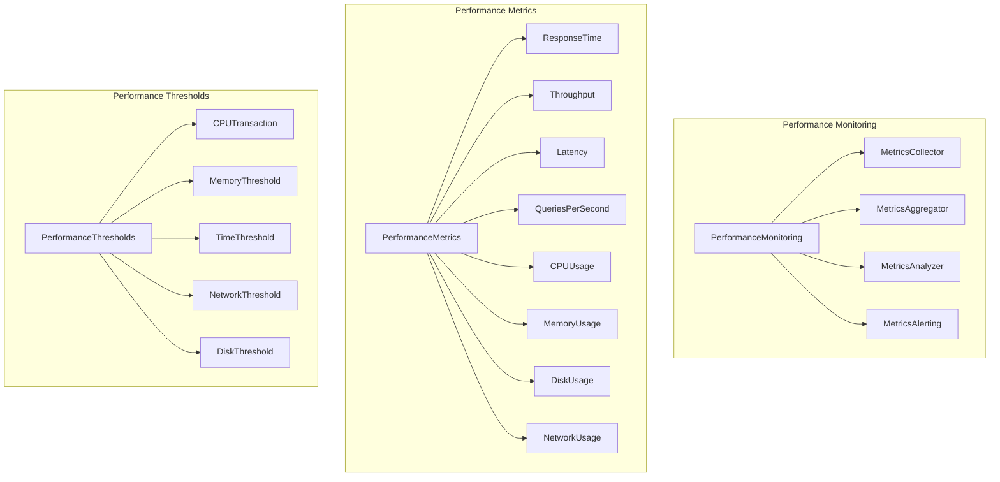
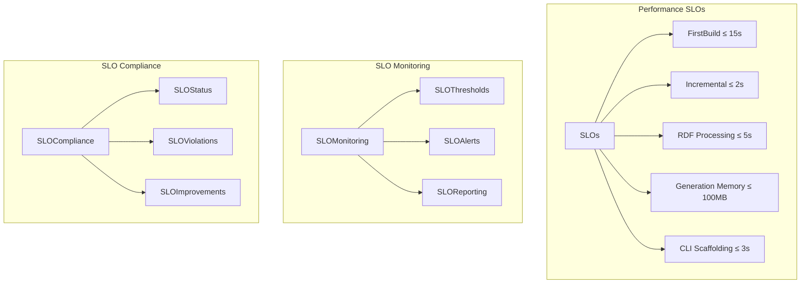
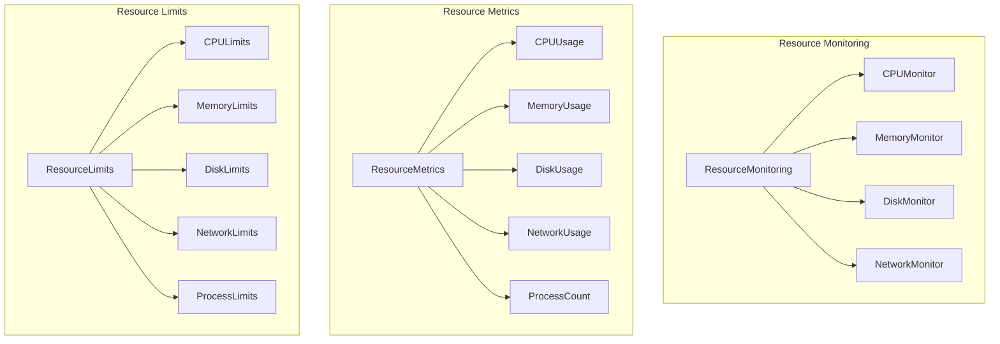
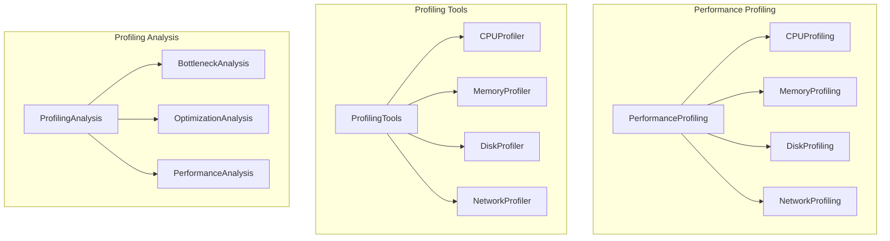
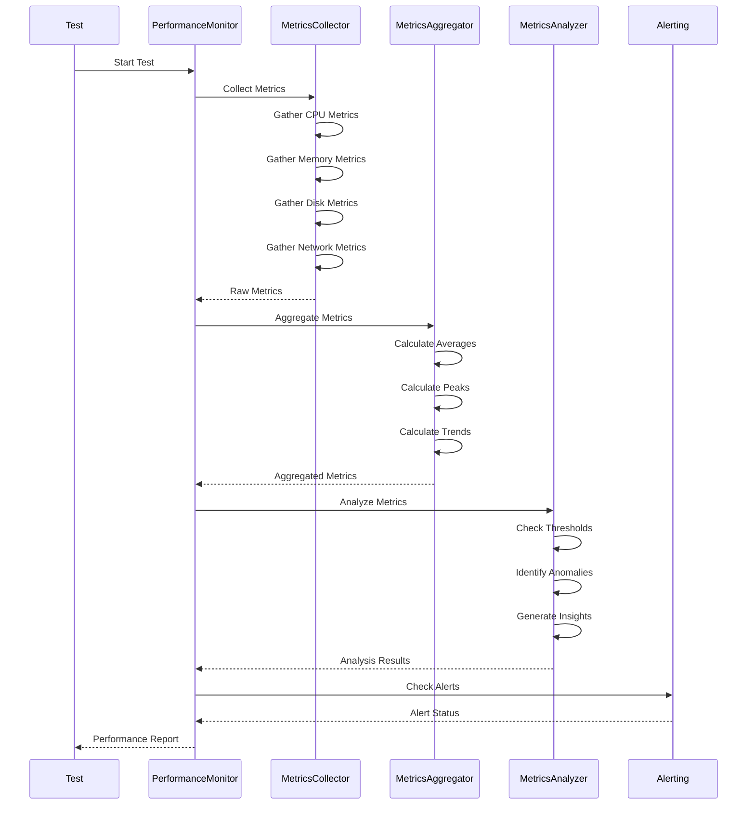
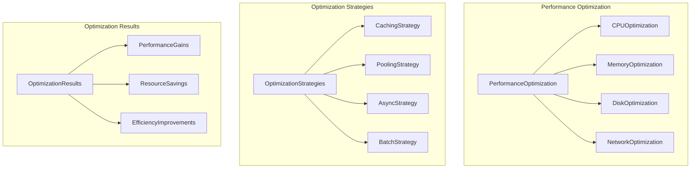
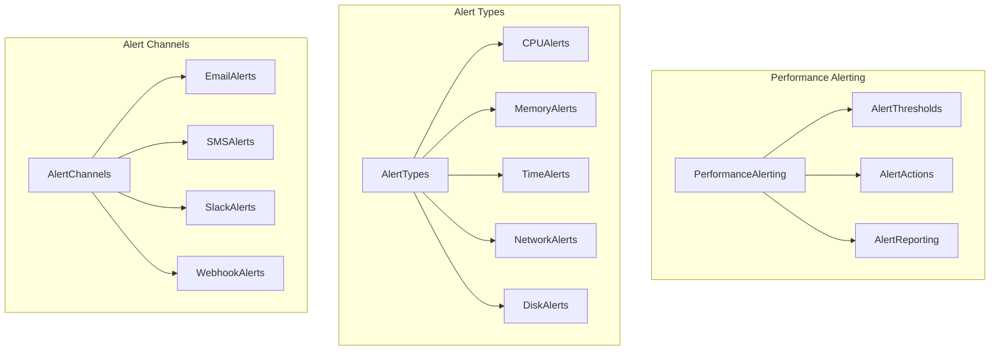
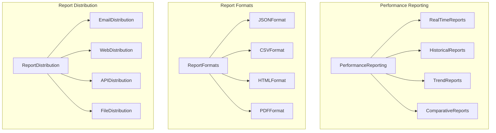

# Performance Monitoring

## Performance Monitoring Architecture

The Cleanroom framework implements comprehensive performance monitoring to ensure optimal execution and resource utilization.

## Performance Monitoring Overview



## SLOs (Service Level Objectives)



## Resource Monitoring



## Performance Profiling



## Performance Metrics Collection



## Performance Optimization



## Performance Alerting



## Performance Reporting



## Performance Configuration

### Basic Performance Monitoring
```rust
let mut config = CleanroomConfig::default();
config.performance_monitoring.enable_monitoring = true;
config.performance_monitoring.metrics_interval = Duration::from_secs(5);
config.performance_monitoring.enable_profiling = false;
config.performance_monitoring.enable_memory_tracking = true;
```

### Advanced Performance Monitoring
```rust
let mut config = CleanroomConfig::default();
config.performance_monitoring.enable_monitoring = true;
config.performance_monitoring.metrics_interval = Duration::from_secs(1);
config.performance_monitoring.enable_profiling = true;
config.performance_monitoring.enable_memory_tracking = true;

// Configure thresholds
config.performance_monitoring.thresholds.max_cpu_usage_percent = 80.0;
config.performance_monitoring.thresholds.max_memory_usage_bytes = 1024 * 1024 * 1024;
config.performance_monitoring.thresholds.max_test_execution_time = Duration::from_secs(300);
config.performance_monitoring.thresholds.max_container_startup_time = Duration::from_secs(30);
```

### Resource Limits Configuration
```rust
let mut config = CleanroomConfig::default();
config.resource_limits.max_cpu_usage_percent = 80.0;
config.resource_limits.max_memory_usage_bytes = 1024 * 1024 * 1024;
config.resource_limits.max_disk_usage_bytes = 10 * 1024 * 1024 * 1024;
config.resource_limits.max_network_bandwidth_bytes_per_sec = 100 * 1024 * 1024;
config.resource_limits.max_container_count = 10;
config.resource_limits.max_test_execution_time = Duration::from_secs(300);
config.resource_limits.enable_resource_monitoring = true;
config.resource_limits.resource_cleanup_timeout = Duration::from_secs(60);
```

## Performance Best Practices

### 1. Resource Monitoring
- Monitor CPU, memory, disk, and network usage
- Set appropriate resource limits
- Implement resource cleanup procedures
- Track resource utilization trends

### 2. Performance Profiling
- Enable profiling for performance-critical tests
- Use CPU and memory profilers
- Analyze performance bottlenecks
- Optimize hot paths

### 3. SLO Compliance
- Monitor SLO compliance continuously
- Set up alerts for SLO violations
- Track SLO trends over time
- Implement SLO improvement plans

### 4. Performance Optimization
- Use singleton containers for performance
- Implement caching strategies
- Optimize resource allocation
- Use async operations where appropriate

### 5. Performance Alerting
- Set up performance alerts
- Configure alert thresholds
- Implement alert escalation
- Monitor alert effectiveness

### 6. Performance Reporting
- Generate regular performance reports
- Track performance trends
- Compare performance across versions
- Share performance insights

## Performance Troubleshooting

### Common Performance Issues
1. **High CPU Usage**: Check for infinite loops, inefficient algorithms
2. **Memory Leaks**: Monitor memory usage, implement proper cleanup
3. **Slow Disk I/O**: Optimize file operations, use SSD storage
4. **Network Latency**: Check network configuration, optimize data transfer
5. **Container Startup Time**: Use pre-built images, optimize container configuration

### Performance Debugging
1. **Enable Profiling**: Use performance profilers to identify bottlenecks
2. **Monitor Metrics**: Track performance metrics in real-time
3. **Analyze Logs**: Review performance logs for issues
4. **Test Optimization**: Implement performance optimizations
5. **Validate Improvements**: Measure performance improvements

### Performance Optimization Strategies
1. **Caching**: Implement multi-layer caching
2. **Pooling**: Use connection and resource pooling
3. **Async Operations**: Use async/await for I/O operations
4. **Batch Processing**: Process data in batches
5. **Resource Reuse**: Reuse containers and resources

