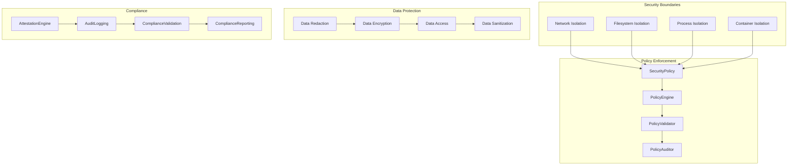
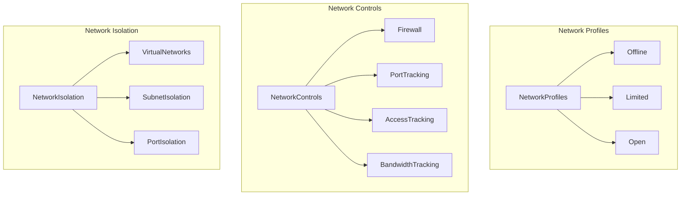
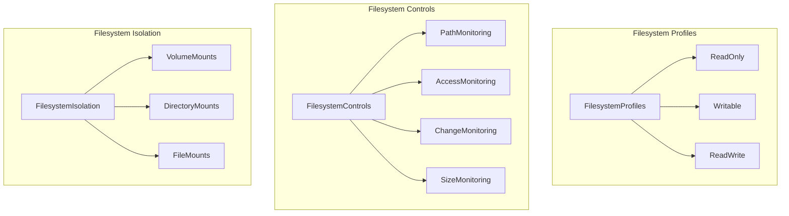
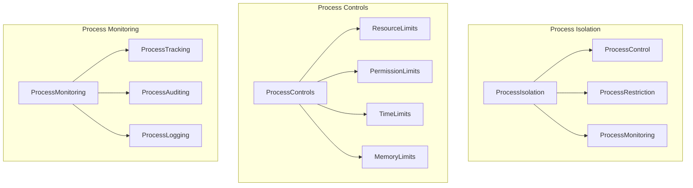
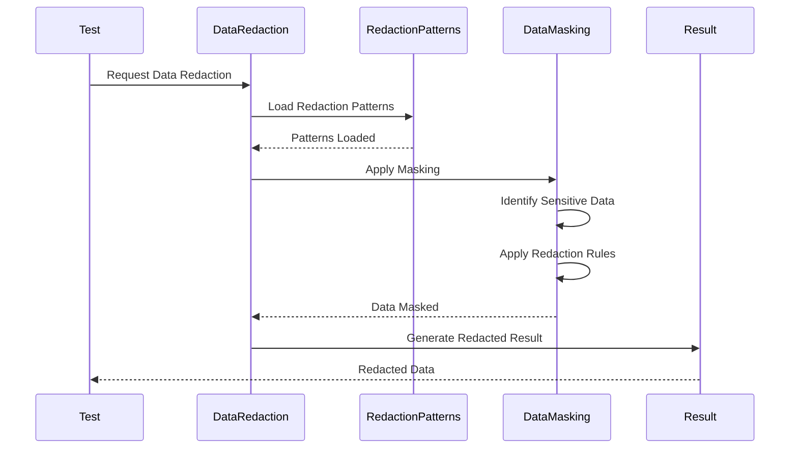
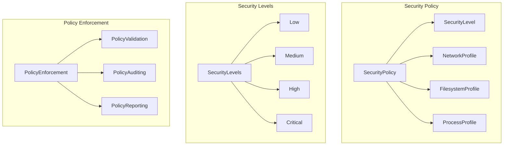
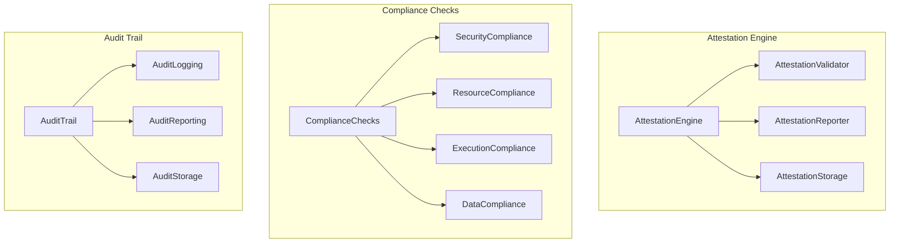
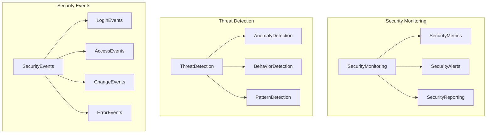

# Security Architecture

## Security Overview

The Cleanroom framework implements comprehensive security measures following core team best practices for isolation, data protection, and compliance.

## Security Architecture Diagram



## Network Security



## Filesystem Security



## Process Security



## Data Redaction System



## Security Policy Configuration



## Compliance and Attestation



## Security Monitoring



## Security Best Practices

### 1. Network Isolation
```rust
// Configure network isolation
config.security_policy.enable_network_isolation = true;
config.security_policy.allowed_ports = vec![5432, 6379, 8080];
config.security_policy.blocked_addresses = vec!["10.0.0.0/8".to_string()];
```

### 2. Filesystem Isolation
```rust
// Configure filesystem isolation
config.security_policy.enable_filesystem_isolation = true;
config.security_policy.readonly_filesystem = true;
config.security_policy.allowed_paths = vec!["/tmp".to_string(), "/var/tmp".to_string()];
```

### 3. Process Isolation
```rust
// Configure process isolation
config.security_policy.enable_process_isolation = true;
config.security_policy.max_process_count = 10;
config.security_policy.allowed_commands = vec!["psql".to_string(), "redis-cli".to_string()];
```

### 4. Data Redaction
```rust
// Configure data redaction
config.security_policy.enable_data_redaction = true;
config.security_policy.redaction_patterns = vec![
    r"password\s*=\s*[^\s]+".to_string(),
    r"token\s*=\s*[^\s]+".to_string(),
    r"key\s*=\s*[^\s]+".to_string(),
];
```

### 5. Audit Logging
```rust
// Configure audit logging
config.security_policy.enable_audit_logging = true;
config.security_policy.audit_level = AuditLevel::Detailed;
config.security_policy.audit_retention_days = 90;
```

## Security Configuration Examples

### High Security Configuration
```rust
let mut config = CleanroomConfig::default();
config.security_policy.security_level = SecurityLevel::High;
config.security_policy.enable_network_isolation = true;
config.security_policy.enable_filesystem_isolation = true;
config.security_policy.enable_process_isolation = true;
config.security_policy.enable_data_redaction = true;
config.security_policy.enable_audit_logging = true;
config.security_policy.allowed_ports = vec![5432, 6379];
config.security_policy.readonly_filesystem = true;
config.security_policy.max_process_count = 5;
```

### Medium Security Configuration
```rust
let mut config = CleanroomConfig::default();
config.security_policy.security_level = SecurityLevel::Medium;
config.security_policy.enable_network_isolation = true;
config.security_policy.enable_filesystem_isolation = false;
config.security_policy.enable_process_isolation = true;
config.security_policy.enable_data_redaction = true;
config.security_policy.enable_audit_logging = true;
config.security_policy.allowed_ports = vec![5432, 6379, 8080, 3000];
```

### Low Security Configuration
```rust
let mut config = CleanroomConfig::default();
config.security_policy.security_level = SecurityLevel::Low;
config.security_policy.enable_network_isolation = false;
config.security_policy.enable_filesystem_isolation = false;
config.security_policy.enable_process_isolation = false;
config.security_policy.enable_data_redaction = true;
config.security_policy.enable_audit_logging = false;
```

## Security Monitoring and Alerting

### Security Metrics
- Network access attempts
- Filesystem access patterns
- Process execution counts
- Data redaction events
- Policy violation attempts
- Security event frequency

### Security Alerts
- Unauthorized network access
- Filesystem permission violations
- Process limit exceeded
- Data redaction failures
- Policy enforcement failures
- Security event anomalies

### Security Reporting
- Daily security summary
- Weekly compliance report
- Monthly security audit
- Quarterly security review
- Annual security assessment

## Compliance Standards

The Cleanroom framework supports compliance with:
- **SOC 2**: Security, availability, and confidentiality
- **ISO 27001**: Information security management
- **PCI DSS**: Payment card industry security
- **HIPAA**: Healthcare information privacy
- **GDPR**: General data protection regulation

## Security Incident Response

### Incident Detection
1. Automated monitoring and alerting
2. Anomaly detection and pattern recognition
3. Threat intelligence integration
4. Security event correlation

### Incident Response
1. Immediate containment and isolation
2. Evidence collection and preservation
3. Impact assessment and analysis
4. Recovery and restoration procedures
5. Post-incident review and improvement

### Incident Reporting
1. Internal security team notification
2. Management escalation procedures
3. Regulatory compliance reporting
4. Customer notification requirements
5. Public disclosure protocols

