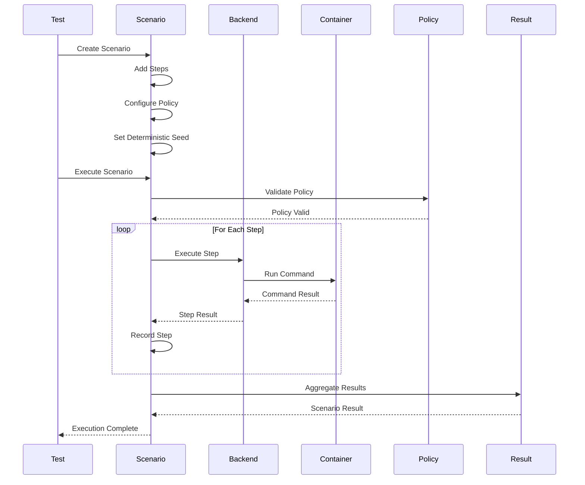
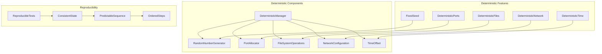
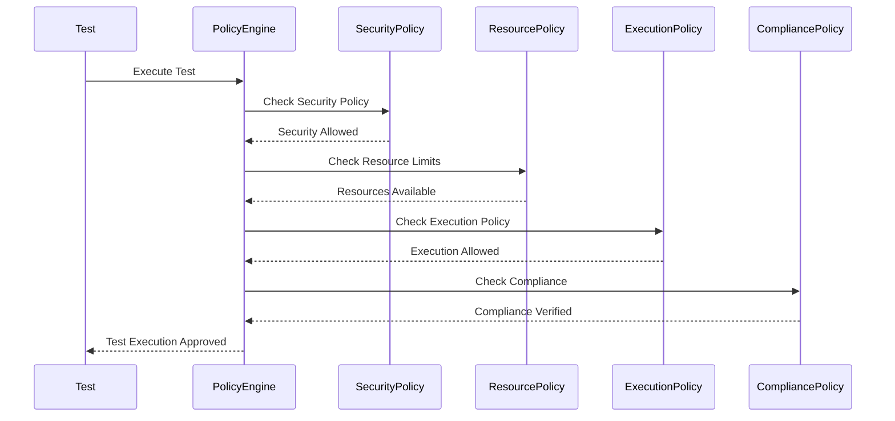
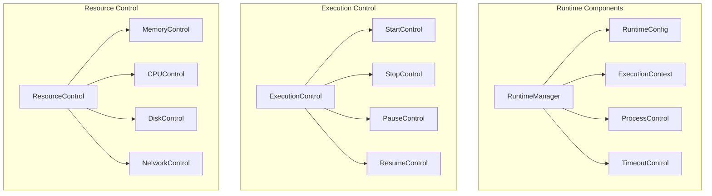
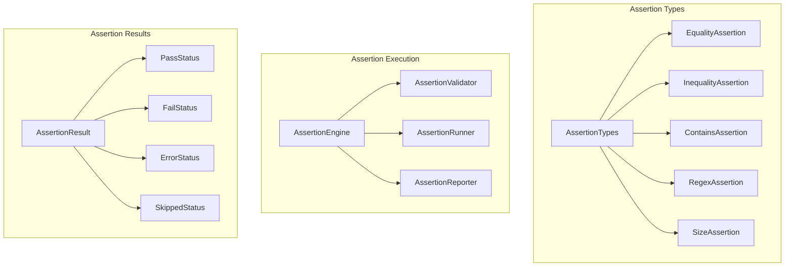
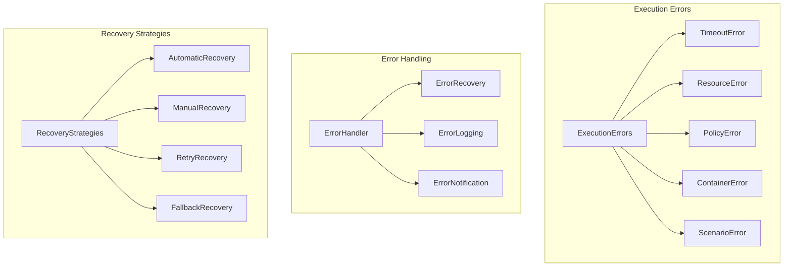
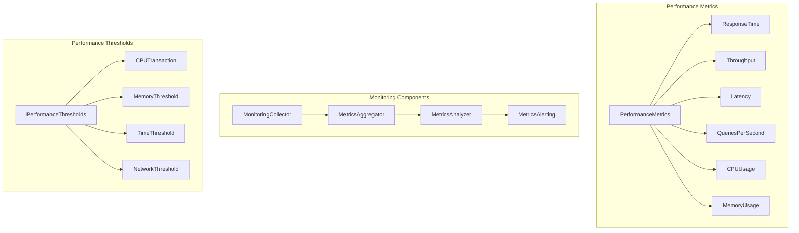
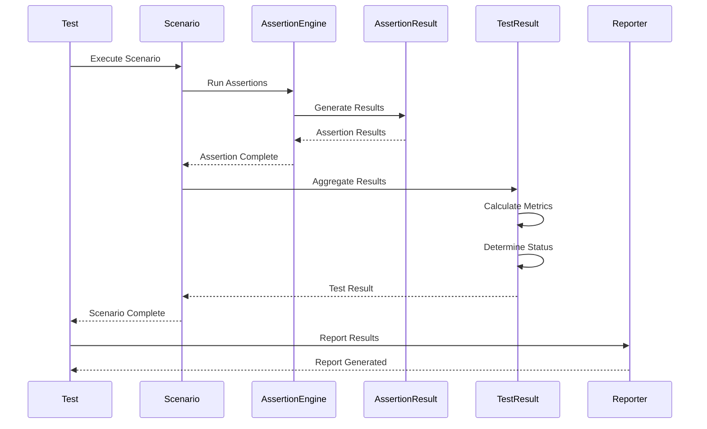
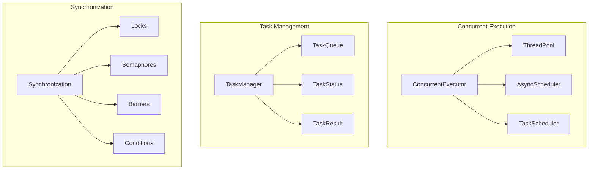

# Test Execution Flow

## Test Execution Architecture

The Cleanroom framework provides a comprehensive test execution system with deterministic execution, scenario orchestration, and comprehensive monitoring.

## Execution Flow Overview

```mermaid
graph TB
    subgraph "Test Execution Pipeline"
        TE[Test Execution]
        PE[Policy Enforcement]
        RE[Resource Management]
        CE[Container Execution]
        SE[Scenario Execution]
        AE[Assertion Execution]
        RE2[Result Evaluation]
    end
    
    subgraph "Execution Context"
        EC[ExecutionContext]
        RC[RuntimeContext]
        SC[ScenarioContext]
        AC[AssertionContext]
    end
    
    subgraph "Execution Results"
        ER[ExecutionResult]
        SR[ScenarioResult]
        AR[AssertionResult]
        TR[TestResult]
    end
    
    TE --> PE
    PE --> RE
    RE --> CE
    CE --> SE
    SE --> AE
    AE --> RE2
    
    EC --> RC
    RC --> SC
    SC --> AC
    
    ER --> SR
    SR --> AR
    AR --> TR
```

## Scenario Execution Flow

## Deterministic Execution

## Policy Enforcement Flow

## Runtime Management

## Assertion Engine

## Error Handling in Execution

## Performance Monitoring

## Test Result Aggregation

## Concurrent Execution

## Best Practices for Test Execution

1. **Deterministic Execution**: Use fixed seeds for reproducible tests
2. **Policy Enforcement**: Enforce security and resource policies
3. **Error Handling**: Implement comprehensive error handling and recovery
4. **Performance Monitoring**: Monitor execution performance and resource usage
5. **Concurrent Execution**: Support concurrent test execution where appropriate
6. **Result Aggregation**: Aggregate and report test results comprehensively
7. **Timeout Management**: Implement proper timeout handling
8. **Resource Management**: Manage resources efficiently during execution
9. **Assertion Validation**: Validate test results with comprehensive assertions
10. **Scenario Orchestration**: Orchestrate complex test scenarios effectively

