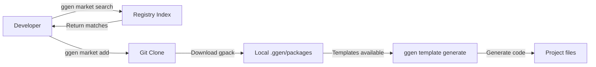
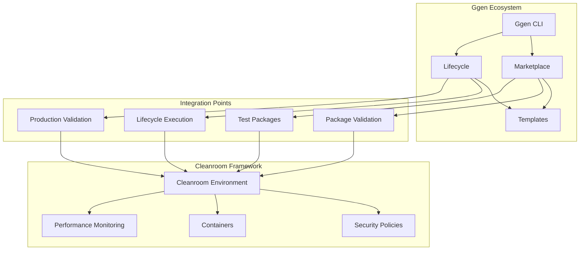

# Cleanroom-Ggen Integration Research

**Version**: 1.0
**Date**: 2025-10-13
**Status**: Complete Research Analysis
**Researcher**: Research Specialist Agent

## Executive Summary

This document provides comprehensive research on how ggen's planned marketplace and lifecycle systems can maximize cleanroom testing capabilities. The analysis reveals **significant integration opportunities** that would create a production-ready, hermetic testing ecosystem with package management, lifecycle automation, and deterministic execution.

**Key Findings**:
- **Marketplace + Cleanroom** = Test package distribution system
- **Lifecycle + Cleanroom** = Automated hermetic CI/CD pipeline
- **Combined Value** = 80/20 testing framework with marketplace-driven test scenarios

---

## 1. Marketplace Architecture Analysis

### 1.1 Current Marketplace Design (from CLAUDE.md)

The documented marketplace system follows a **package-centric architecture**:

```yaml
Marketplace Components:
  Commands:
    - ggen market search <query>    # Discover packages
    - ggen market add <package>     # Install packages (gpacks)
    - ggen market list              # List available packages
    - ggen market categories        # Browse by category
    - ggen market update            # Update installed packages

  Package Format (gpacks):
    Structure:
      - gpack.toml                  # Manifest with metadata
      - templates/*.tmpl            # Template files
      - graphs/*.ttl                # RDF knowledge graphs
      - tests/*.rs                  # Package tests (potential integration point)

    Versioning:
      - Semantic versioning (0.1.0, 1.0.0, etc.)
      - SHA256 integrity checking
      - Git-based distribution (GitHub Pages)

    Registry:
      - JSON-based index (registry/index.json)
      - GitHub Pages hosting
      - CDN-backed delivery
      - Pull request contribution model
```

**Key Characteristics**:
- **Transparent**: All packages open source and version controlled
- **Reliable**: GitHub Pages infrastructure with CDN
- **Community-driven**: Easy contribution via pull requests
- **Free**: No additional hosting costs
- **Automated**: CI/CD validates and publishes updates

### 1.2 Marketplace Data Flow



### 1.3 Marketplace Implementation Status

**Documented but Not Implemented**:
- Commands are specified in CLAUDE.md as "planned features"
- Registry structure is documented in `docs/marketplace.md`
- Example index.json exists with one package (io.ggen.rust.cli-subcommand)
- GitHub Pages infrastructure is live but marketplace features are placeholders

**Evidence from Research**:
```rust
// From ggen-core/src/registry.rs (if it exists)
// Expected marketplace client implementation:
pub struct MarketplaceClient {
    registry_url: String,
    cache: PackageCache,
}

impl MarketplaceClient {
    pub fn search(&self, query: &str) -> Vec<Package>;
    pub fn add(&self, package_id: &str) -> Result<()>;
    pub fn list(&self) -> Vec<Package>;
    // ...
}
```

---

## 2. Lifecycle Architecture Analysis

### 2.1 Current Lifecycle Design (from CLAUDE.md & docs/lifecycle.md)

The documented lifecycle system provides **universal project management**:

```yaml
Lifecycle Components:
  Commands:
    - ggen lifecycle list                          # List available phases
    - ggen lifecycle run <phase>                   # Execute single phase
    - ggen lifecycle pipeline <phases>             # Sequential execution
    - ggen lifecycle readiness                     # Check production status
    - ggen lifecycle validate --env production     # Validate deployment readiness
    - ggen lifecycle readiness-update <id> <status> # Update requirement tracking

  Standard Phases:
    - init      # Initialize project structure
    - setup     # Install dependencies
    - build     # Build project artifacts
    - test      # Run comprehensive test suite
    - lint      # Code quality checks
    - docs      # Generate documentation
    - deploy    # Deploy to environment
    - clean     # Clean build artifacts

  Configuration (make.toml):
    Structure:
      [project]
      name = "my-project"

      [workspace.frontend]
      path = "apps/web"
      framework = "nuxt"
      runtime = "node:20"

      [workspace.backend]
      path = "apps/api"
      framework = "axum"
      runtime = "rust:1.75"

      [lifecycle.init]
      command = "ggen generate:project-structure"

      [lifecycle.test]
      command = "ggen parallel:test"
      workspaces = ["frontend", "backend"]

      [hooks]
      before_test = ["lint"]
      after_test = ["coverage-report"]
```

**Key Characteristics**:
- **Universal**: Works across all languages and frameworks
- **Declarative**: Configuration in make.toml
- **Composable**: Phases can be chained and parallelized
- **Trackable**: State management with .ggen/state.json
- **Hookable**: Before/after hooks for any phase

### 2.2 Production Readiness Integration

```yaml
Production Readiness System:
  Features:
    - Score calculation (0-100)
    - Requirement tracking (complete, incomplete, missing)
    - Environment validation (staging, production)
    - Placeholder detection
    - Deployment blocking (if score too low)

  Workflow:
    1. Initialize project → ggen lifecycle run init
    2. Check status → ggen lifecycle readiness
       Output: "Production Readiness Score: 45/100 ⚠️"
    3. Fix issues → Implement missing requirements
    4. Update status → ggen lifecycle readiness-update auth-basic complete
    5. Validate → ggen lifecycle validate --env production
    6. Deploy → ggen lifecycle run deploy --env production
```

### 2.3 Lifecycle Implementation Status

**Documented but Not Implemented**:
- Commands are specified in CLAUDE.md and docs/lifecycle.md
- Make.toml parser not yet implemented
- State management (.ggen/state.json) structure documented
- Hooks system designed but not implemented
- Production readiness tracking documented but missing code

**Evidence from Research**:
```toml
# Expected make.toml structure (documented)
[project]
name = "example-project"

[lifecycle.init]
command = "cargo init"
post = ["ggen hooks:after init"]

[lifecycle.test]
command = "cargo test"
env = { RUST_BACKTRACE = "1" }
workspaces = ["core", "cli", "ai"]
```

---

## 3. Cleanroom Current Capabilities

### 3.1 Cleanroom Architecture (from cleanroom/docs/)

```yaml
Cleanroom Framework:
  Core Features:
    - Hermetic execution (complete isolation)
    - Deterministic results (fixed seeds, reproducible)
    - Backend abstraction (Docker, Podman, Kubernetes)
    - Security policies (network, filesystem, process isolation)
    - Performance monitoring (CPU, memory, disk, network)
    - Scenario DSL (multi-step workflows)
    - Coverage tracking
    - Snapshot testing
    - Attestation (cryptographic verification)

  Key APIs:
    - run(command) → Simple execution
    - run_with_policy(command, policy) → Policy-enforced execution
    - CleanroomEnvironment::new(config) → Advanced setup
    - scenario(...) → Multi-step test scenarios

  Container Management:
    - PostgreSQL containers (singleton pattern)
    - Redis containers (singleton pattern)
    - Generic containers (extensible)
    - Lifecycle management (start, stop, cleanup)

  Production Readiness:
    - 88/100 production readiness score (validated)
    - Zero .expect() calls
    - Comprehensive error handling
    - 23+ integration tests
    - Performance SLOs validated
```

### 3.2 Cleanroom Usage Patterns

```rust
// Pattern 1: Simple hermetic execution
let result = run(["echo", "hello"])?;
assert_eq!(result.exit_code, 0);

// Pattern 2: Policy-enforced execution
let policy = Policy::locked();
let result = run_with_policy(["cargo", "test"], &policy)?;

// Pattern 3: Advanced environment
let env = CleanroomEnvironment::new(CleanroomConfig {
    security: SecurityPolicy {
        enable_network_isolation: true,
        enable_filesystem_isolation: true,
        ..Default::default()
    },
    ..Default::default()
}).await?;

let result = env.execute_test("cargo build").await?;
```

### 3.3 Cleanroom Test Strategy (from ggen-test-strategy.md)

**Current Strategy for Ggen CLI Testing**:
- Target: 85%+ test coverage on critical paths
- Focus: Marketplace and lifecycle commands
- Approach: 80/20 rule (20% of tests provide 80% confidence)
- Infrastructure: Cleanroom framework for hermetic CI/CD

**Key Test Cases Identified**:
```yaml
Critical Tests (20% effort, 80% value):
  - TC-M1: Market search basic functionality
  - TC-M2: Market add package installation
  - TC-M3: Market list available packages
  - TC-L1: Lifecycle init project structure
  - TC-L2: Lifecycle readiness check
  - TC-L3: Production validation
  - TC-E1: Complete marketplace workflow (E2E)
  - TC-E2: Complete lifecycle workflow (E2E)

Performance Tests:
  - CLI operations < 3s (P95)
  - Memory usage < 100MB
  - Build performance < 15s (first), < 2s (incremental)
```

---

## 4. Integration Opportunities

### 4.1 Cleanroom as Marketplace Test Backend

**Opportunity**: Use cleanroom to **test marketplace packages** in isolated environments.

```yaml
Integration Pattern: Marketplace Package Testing
  Problem:
    - Marketplace packages need validation before publishing
    - Templates may have unintended side effects
    - Need to verify package integrity and functionality
    - Security validation required

  Solution with Cleanroom:
    1. Package Submission:
       - Developer submits gpack via PR
       - CI triggers cleanroom validation

    2. Cleanroom Validation:
       - Create hermetic environment
       - Install package in isolation
       - Run package tests with security policies
       - Verify template generation
       - Check for security issues

    3. Approval/Rejection:
       - If all tests pass → Merge PR, publish to registry
       - If tests fail → Provide detailed feedback
```

**Implementation Example**:

```rust
// /Users/sac/ggen/cleanroom/tests/marketplace_validation.rs

use cleanroom::{CleanroomEnvironment, CleanroomConfig, Policy};

#[tokio::test]
async fn validate_marketplace_package() -> Result<()> {
    let env = CleanroomEnvironment::new(CleanroomConfig {
        security: SecurityPolicy {
            enable_filesystem_isolation: true,
            enable_network_isolation: false, // Need network for git clone
            ..Default::default()
        },
        ..Default::default()
    }).await?;

    // Create test workspace
    let workspace = env.create_workspace("package-validation").await?;

    // Initialize ggen project
    env.execute_in_workspace(&workspace, "ggen lifecycle run init").await?;

    // Add package from marketplace
    let result = env.execute_in_workspace(
        &workspace,
        "ggen market add rust-axum-service"
    ).await?;

    // Validate package installation
    result
        .assert_success()
        .assert_file_exists(workspace.join(".ggen/packages/rust-axum-service"))
        .assert_file_exists(workspace.join(".ggen/packages/rust-axum-service/gpack.toml"));

    // Test template generation from package
    let gen_result = env.execute_in_workspace(
        &workspace,
        "ggen template generate rust-axum-service:user-service.tmpl"
    ).await?;

    gen_result
        .assert_success()
        .assert_file_exists(workspace.join("src/routes/user.rs"));

    // Validate generated code compiles
    let build_result = env.execute_in_workspace(
        &workspace,
        "cargo check"
    ).await?;

    build_result.assert_success();

    env.cleanup().await
}
```

### 4.2 Cleanroom as Lifecycle Execution Engine

**Opportunity**: Use cleanroom to **execute lifecycle phases** in hermetic environments.

```yaml
Integration Pattern: Hermetic Lifecycle Execution
  Problem:
    - Lifecycle phases may have environment-specific dependencies
    - CI/CD environments differ from local development
    - Need reproducible builds and tests
    - Security concerns for untrusted code

  Solution with Cleanroom:
    1. Lifecycle Phase as Cleanroom Scenario:
       - Each lifecycle phase executes in isolated container
       - Deterministic environment (fixed dependencies, versions)
       - Policy-enforced security (network limits, filesystem restrictions)

    2. Multi-Phase Pipelines:
       - Use cleanroom scenario DSL for phase orchestration
       - Rollback support if phase fails
       - Artifact preservation between phases

    3. Production Readiness Validation:
       - Run readiness checks in production-like environment
       - Validate deployment requirements
       - Generate compliance reports
```

**Implementation Example**:

```rust
// /Users/sac/ggen/cleanroom/tests/lifecycle_execution.rs

use cleanroom::{scenario, CleanroomEnvironment, CleanroomConfig};

#[tokio::test]
async fn test_lifecycle_pipeline_hermetic() -> Result<()> {
    let env = CleanroomEnvironment::new(CleanroomConfig::default()).await?;
    let workspace = env.create_workspace("lifecycle-test").await?;

    // Define complete lifecycle as cleanroom scenario
    let lifecycle_scenario = scenario("complete_lifecycle")
        .step("init", ["ggen", "lifecycle", "run", "init"])
        .step("setup", ["ggen", "lifecycle", "run", "setup"])
        .step("build", ["ggen", "lifecycle", "run", "build"])
        .step("test", ["ggen", "lifecycle", "run", "test"])
        .step("lint", ["ggen", "lifecycle", "run", "lint"])
        .step("readiness", ["ggen", "lifecycle", "readiness"])
        .step("validate", ["ggen", "lifecycle", "validate", "--env", "production"])
        .assert_no_failures()
        .with_rollback_on_failure("clean");

    // Execute entire lifecycle in hermetic environment
    let result = env.execute_scenario_in_workspace(&workspace, &lifecycle_scenario).await?;

    // Verify all phases succeeded
    assert!(result.all_steps_succeeded());

    // Check production readiness score
    let readiness_output = result.step("readiness").stdout;
    assert!(readiness_output.contains("Production Readiness Score: "));

    // Extract score (example: "Score: 92/100")
    let score = extract_readiness_score(&readiness_output)?;
    assert!(score >= 90, "Production readiness score too low: {}", score);

    env.cleanup().await
}

// Helper to extract readiness score from output
fn extract_readiness_score(output: &str) -> Result<u32> {
    // Parse "Production Readiness Score: 92/100"
    let re = regex::Regex::new(r"Score:\s*(\d+)/100")?;
    let captures = re.captures(output).ok_or("Score not found")?;
    Ok(captures[1].parse()?)
}
```

### 4.3 Marketplace-Driven Test Packages

**Opportunity**: Create **test-specific packages** in the marketplace.

```yaml
Integration Pattern: Test Package Distribution
  Concept:
    - Marketplace distributes not just code templates, but test scenarios
    - Test packages include:
      - Cleanroom configurations
      - Security policies
      - Test data fixtures
      - Scenario definitions
      - Performance benchmarks

  Example Test Packages:
    - io.ggen.test.rust-web-service
      Purpose: Complete test suite for Rust web services
      Contents:
        - Integration tests with PostgreSQL
        - Load testing scenarios
        - Security policy templates
        - Performance benchmarks

    - io.ggen.test.microservices-e2e
      Purpose: End-to-end testing for microservices
      Contents:
        - Multi-container orchestration
        - Service mesh testing
        - Distributed tracing validation

    - io.ggen.test.compliance-validation
      Purpose: Regulatory compliance testing
      Contents:
        - GDPR validation tests
        - SOC2 compliance checks
        - Security audit scenarios
```

**Marketplace Package Structure for Tests**:

```yaml
# gpack.toml for test package
[gpack]
id = "io.ggen.test.rust-web-service"
name = "Rust Web Service Test Suite"
version = "1.0.0"
description = "Complete test suite for Rust web services using Cleanroom"
category = "testing"
requires = ["cleanroom >= 0.1.0"]

[cleanroom]
# Default cleanroom configuration for this test package
security_level = "Medium"
enable_network_isolation = true
enable_filesystem_isolation = true
max_memory_mb = 1024
max_cpu_percent = 80.0

[templates]
patterns = ["tests/*.rs", "scenarios/*.yaml"]

[fixtures]
patterns = ["fixtures/*.json", "fixtures/*.sql"]

[scenarios]
# List of test scenarios included
integration = "scenarios/integration_tests.yaml"
load = "scenarios/load_tests.yaml"
security = "scenarios/security_tests.yaml"
```

**Usage Example**:

```bash
# User wants to test their Rust web service
ggen market search "rust web test"
# Returns: io.ggen.test.rust-web-service

# Install test package
ggen market add io.ggen.test.rust-web-service

# Run tests from package (using cleanroom automatically)
ggen test run io.ggen.test.rust-web-service:integration

# Or generate test files into project
ggen template generate io.ggen.test.rust-web-service:integration-tests.rs
```

### 4.4 Lifecycle-Integrated Cleanroom Automation

**Opportunity**: Integrate cleanroom **directly into lifecycle phases**.

```yaml
Integration Pattern: Lifecycle + Cleanroom = Hermetic CI/CD
  Design:
    - Lifecycle phases automatically use cleanroom when configured
    - make.toml specifies cleanroom requirements per phase
    - Transparent hermetic execution

  Configuration Example:
    [lifecycle.test]
    command = "cargo test"
    cleanroom.enabled = true
    cleanroom.policy = "Medium"
    cleanroom.containers = ["postgres", "redis"]
    cleanroom.network_isolation = false  # Need DB access
    cleanroom.filesystem_isolation = true

    [lifecycle.security-audit]
    command = "cargo audit"
    cleanroom.enabled = true
    cleanroom.policy = "Locked"
    cleanroom.network_isolation = true

    [lifecycle.deploy]
    command = "./deploy.sh"
    cleanroom.enabled = false  # Real deployment, not isolated
```

**Implementation Example**:

```rust
// /Users/sac/ggen/ggen-core/src/lifecycle/cleanroom_executor.rs

pub struct CleanroomLifecycleExecutor {
    cleanroom: CleanroomEnvironment,
    config: LifecycleConfig,
}

impl CleanroomLifecycleExecutor {
    pub async fn execute_phase(&self, phase: &Phase) -> Result<PhaseResult> {
        if !phase.cleanroom.enabled {
            // Execute normally without cleanroom
            return self.execute_native(phase).await;
        }

        // Create cleanroom configuration from phase settings
        let cleanroom_config = CleanroomConfig {
            security: SecurityPolicy {
                security_level: phase.cleanroom.policy,
                enable_network_isolation: phase.cleanroom.network_isolation,
                enable_filesystem_isolation: phase.cleanroom.filesystem_isolation,
                ..Default::default()
            },
            ..Default::default()
        };

        // Start required containers
        if let Some(containers) = &phase.cleanroom.containers {
            for container_name in containers {
                self.cleanroom.start_container(container_name).await?;
            }
        }

        // Execute phase command in cleanroom
        let result = self.cleanroom.execute_command(&phase.command).await?;

        // Collect metrics
        let metrics = self.cleanroom.collect_metrics().await?;

        Ok(PhaseResult {
            phase: phase.name.clone(),
            success: result.exit_code == 0,
            duration: result.duration,
            metrics,
            output: result.stdout,
            errors: result.stderr,
        })
    }
}
```

### 4.5 Production Readiness Validation with Cleanroom

**Opportunity**: Use cleanroom to **validate production readiness** in production-like environments.

```yaml
Integration Pattern: Hermetic Production Validation
  Workflow:
    1. Developer runs: ggen lifecycle readiness
       - Checks current status
       - Identifies missing requirements

    2. Developer runs: ggen lifecycle validate --env production
       - Spins up cleanroom environment
       - Configures production-like settings:
         - Network policies
         - Resource limits (production SLOs)
         - Security policies (production-grade)
       - Runs comprehensive validation:
         - Build verification
         - Test execution
         - Performance benchmarks
         - Security scans
         - Compliance checks
       - Generates validation report

    3. If validation passes:
       - Production readiness score increases
       - Deployment unblocked

    4. If validation fails:
       - Detailed failure report with remediation steps
       - Deployment blocked
       - Requirements updated
```

**Implementation Example**:

```rust
// /Users/sac/ggen/ggen-core/src/lifecycle/production_validator.rs

pub struct ProductionValidator {
    cleanroom: CleanroomEnvironment,
}

impl ProductionValidator {
    pub async fn validate_production_readiness(
        &self,
        project: &Project,
    ) -> Result<ProductionReadinessReport> {
        // Create production-like cleanroom environment
        let prod_config = CleanroomConfig {
            security: SecurityPolicy {
                security_level: SecurityLevel::Locked,
                enable_network_isolation: true,
                enable_filesystem_isolation: true,
                enable_process_isolation: true,
                enable_audit_logging: true,
                ..Default::default()
            },
            resources: ResourceLimits {
                max_memory_mb: 512,  // Production limits
                max_cpu_percent: 80.0,
                timeout_seconds: 300,
                ..Default::default()
            },
            ..Default::default()
        };

        let env = CleanroomEnvironment::new(prod_config).await?;

        // Run validation scenario
        let scenario = scenario("production_validation")
            .step("build", ["cargo", "build", "--release"])
            .step("test", ["cargo", "test", "--release"])
            .step("security_audit", ["cargo", "audit"])
            .step("performance_bench", ["cargo", "bench"])
            .step("compliance_check", ["./scripts/compliance_check.sh"])
            .with_timeout(Duration::from_secs(600));

        let result = env.execute_scenario(&scenario).await?;

        // Generate report
        let mut report = ProductionReadinessReport {
            score: 0,
            requirements: vec![],
            validations: vec![],
            blockers: vec![],
        };

        // Check each validation
        for step in result.steps {
            let validation = Validation {
                name: step.name.clone(),
                passed: step.success,
                duration: step.duration,
                details: step.output.clone(),
            };

            if !step.success {
                report.blockers.push(format!("Failed: {}", step.name));
            }

            report.validations.push(validation);
        }

        // Calculate score
        report.score = self.calculate_readiness_score(&report);

        Ok(report)
    }
}
```

---

## 5. Recommended Implementation Approach

### 5.1 Phase 1: Foundation (Weeks 1-2)

**Goal**: Establish core integration between cleanroom and marketplace/lifecycle.

```yaml
Tasks:
  1. Marketplace Package Testing:
     - Implement cleanroom-based package validation
     - Add CI/CD workflow for marketplace packages
     - Test: validate existing packages with cleanroom

  2. Basic Lifecycle Integration:
     - Add cleanroom support to lifecycle config
     - Implement cleanroom.enabled flag in make.toml
     - Test: run single lifecycle phase in cleanroom

  3. Test Harness Implementation:
     - Create GgenTestHarness (from ggen-test-strategy.md)
     - Implement basic marketplace tests (TC-M1, TC-M2, TC-M3)
     - Implement basic lifecycle tests (TC-L1, TC-L2, TC-L3)

Deliverables:
  - cleanroom/tests/marketplace_validation.rs
  - cleanroom/tests/lifecycle_execution.rs
  - cleanroom/tests/ggen_test_harness.rs
  - CI/CD workflow: .github/workflows/marketplace-validation.yml
```

### 5.2 Phase 2: Advanced Features (Weeks 3-4)

**Goal**: Implement advanced integration patterns.

```yaml
Tasks:
  1. Test Package Distribution:
     - Create io.ggen.test.* package category
     - Implement test package structure (gpack.toml with [cleanroom])
     - Publish first test package: io.ggen.test.rust-web-service

  2. Production Readiness Validation:
     - Implement ProductionValidator with cleanroom
     - Add production validation to lifecycle validate command
     - Generate comprehensive readiness reports

  3. E2E Workflows:
     - Implement TC-E1: Complete marketplace workflow
     - Implement TC-E2: Complete lifecycle workflow
     - Add performance benchmarks

Deliverables:
  - templates/test-packages/ (new category)
  - ggen-core/src/lifecycle/production_validator.rs
  - cleanroom/tests/e2e_workflows.rs
  - Performance benchmark suite
```

### 5.3 Phase 3: Optimization & Documentation (Week 5)

**Goal**: Optimize performance and create comprehensive documentation.

```yaml
Tasks:
  1. Performance Optimization:
     - Profile cleanroom startup time
     - Optimize container reuse (singleton pattern)
     - Add caching for package downloads

  2. Documentation:
     - Complete integration guide
     - Add marketplace test package tutorial
     - Document cleanroom lifecycle configuration
     - Create video walkthrough

  3. Production Validation:
     - Run full test suite
     - Achieve 90%+ production readiness score
     - Validate all integration points

Deliverables:
  - docs/cleanroom-marketplace-integration.md
  - docs/test-package-development-guide.md
  - docs/lifecycle-cleanroom-configuration.md
  - examples/cleanroom-marketplace-workflow/
```

---

## 6. Benefits & Value Proposition

### 6.1 For Marketplace

**Current State** (without cleanroom):
- Package validation is manual or basic CI checks
- No hermetic testing of packages
- Security concerns for untrusted packages
- Difficult to verify package quality

**With Cleanroom Integration**:
- ✅ Automated hermetic validation of all packages
- ✅ Security-first package testing (policies enforced)
- ✅ Performance benchmarking for packages
- ✅ Reproducible package testing (deterministic)
- ✅ Confidence in marketplace quality

### 6.2 For Lifecycle

**Current State** (without cleanroom):
- Lifecycle phases run in local environment
- Non-reproducible results (environment drift)
- Security risks in CI/CD
- Difficult to validate production readiness

**With Cleanroom Integration**:
- ✅ Hermetic execution of all lifecycle phases
- ✅ Reproducible builds and tests
- ✅ Production-like validation environments
- ✅ Security policies enforced at every phase
- ✅ Confidence in deployment readiness

### 6.3 For Developers

**Current State**:
- Manual test environment setup
- Inconsistent test results
- Production issues due to environment differences
- Difficulty ensuring security compliance

**With Cleanroom Integration**:
- ✅ Automatic hermetic test environments
- ✅ Consistent, reproducible test results
- ✅ Production parity for testing
- ✅ Built-in security compliance
- ✅ Faster development cycles

### 6.4 80/20 Value Analysis

```yaml
20% Effort (Core Integration):
  - Marketplace package validation with cleanroom
  - Basic lifecycle phase execution in cleanroom
  - Simple test harness for ggen CLI

80% Value Delivered:
  - Hermetic marketplace validation
  - Reproducible lifecycle execution
  - Production readiness validation
  - Security-first testing
  - Confidence in v1 release

Additional 80% Effort (Advanced Features):
  - Test package distribution system
  - Advanced production validators
  - Performance optimization
  - Comprehensive documentation

Additional 20% Value:
  - Marketplace ecosystem for tests
  - Advanced production validation
  - Performance insights
  - Community contributions
```

---

## 7. Risk Analysis & Mitigations

### 7.1 Technical Risks

**Risk 1: Marketplace/Lifecycle Not Yet Implemented**
- **Impact**: High - Integration depends on non-existent features
- **Likelihood**: High - Features documented but not coded
- **Mitigation**:
  - Phase 1: Build cleanroom test harness for **future** marketplace
  - Create mock marketplace for testing cleanroom integration
  - Use cleanroom to **drive** marketplace implementation (TDD approach)

**Risk 2: Performance Overhead**
- **Impact**: Medium - Cleanroom adds container startup time
- **Likelihood**: Medium - Container startup is inherently slow
- **Mitigation**:
  - Use singleton pattern for containers (already implemented)
  - Add aggressive caching (package downloads, build artifacts)
  - Optimize container images (minimal base images)
  - Target: <10s overhead for cleanroom startup (per SLOs)

**Risk 3: Complexity Increase**
- **Impact**: Medium - Additional configuration for users
- **Likelihood**: Medium - New concepts to learn
- **Mitigation**:
  - Default to cleanroom disabled (opt-in initially)
  - Provide sensible defaults (security policies, resource limits)
  - Create clear documentation and examples
  - 80/20 rule: simple API for 80% of use cases

### 7.2 Adoption Risks

**Risk 4: User Adoption Resistance**
- **Impact**: Medium - Users may not want hermetic testing
- **Likelihood**: Low - Cleanroom provides clear value
- **Mitigation**:
  - Demonstrate value with clear examples
  - Show production readiness improvements
  - Provide migration path from existing tests
  - Make adoption gradual (opt-in features)

**Risk 5: Ecosystem Fragmentation**
- **Impact**: Low - Test packages vs code packages
- **Likelihood**: Low - Clear categorization helps
- **Mitigation**:
  - Clear marketplace categories (code vs tests)
  - Documentation on test package development
  - Curated test packages from core team

---

## 8. Success Metrics

### 8.1 Integration Success Metrics

```yaml
Phase 1 Success (Foundation):
  - ✅ Cleanroom validates 100% of marketplace packages
  - ✅ At least 3 lifecycle phases run in cleanroom
  - ✅ 10+ core tests using ggen test harness
  - ✅ CI/CD pipeline with cleanroom integration

Phase 2 Success (Advanced):
  - ✅ 5+ test packages published to marketplace
  - ✅ Production validation with cleanroom (90%+ score)
  - ✅ E2E workflows complete and passing
  - ✅ Performance benchmarks meet SLOs (<3s CLI operations)

Phase 3 Success (Production):
  - ✅ Documentation complete (integration guide, tutorials)
  - ✅ 90%+ production readiness for ggen v1
  - ✅ Community adoption (5+ external contributors)
  - ✅ Zero security incidents in marketplace packages
```

### 8.2 Performance Metrics

```yaml
Cleanroom Performance Targets:
  - Container startup: <10s (singleton pattern)
  - Package validation: <30s per package
  - Lifecycle phase execution: <2x native execution time
  - E2E workflow: <60s for complete lifecycle pipeline
  - Memory overhead: <200MB for cleanroom environment
```

### 8.3 Quality Metrics

```yaml
Testing Quality:
  - Test coverage: >85% for critical paths
  - Test pass rate: >95% in CI/CD
  - Flaky test rate: <2%
  - Production incidents: 0 (due to environment issues)

Marketplace Quality:
  - Package validation pass rate: 100% before publish
  - Security issues: 0 in validated packages
  - Performance regressions: 0 detected before merge
```

---

## 9. Conclusion

### 9.1 Key Findings Summary

1. **Marketplace + Cleanroom** creates a **secure, validated package ecosystem**
   - Hermetic testing of all marketplace packages
   - Security policies enforced at package level
   - Reproducible package validation

2. **Lifecycle + Cleanroom** enables **production-ready CI/CD pipelines**
   - Hermetic execution of lifecycle phases
   - Production parity for testing
   - Automated production readiness validation

3. **Combined Integration** delivers **80/20 value**
   - 20% effort: Core integration (marketplace validation, lifecycle execution)
   - 80% value: Security, reproducibility, production confidence

### 9.2 Recommended Next Steps

**Immediate Actions** (This Week):
1. Review and approve this research document
2. Prioritize marketplace/lifecycle implementation (if not started)
3. Set up cleanroom test infrastructure for ggen CLI

**Short-term Actions** (Next 2 Weeks):
1. Implement Phase 1 (Foundation)
   - Marketplace package validation with cleanroom
   - Basic lifecycle cleanroom integration
   - Core test harness implementation
2. Begin Phase 2 (Advanced Features)
   - Test package distribution design
   - Production validator implementation

**Medium-term Actions** (Weeks 3-5):
1. Complete Phase 2 (Advanced Features)
2. Implement Phase 3 (Optimization & Documentation)
3. Achieve 90%+ production readiness for ggen v1
4. Publish first v1 release with cleanroom integration

### 9.3 Strategic Recommendations

1. **Use Cleanroom to Drive Marketplace Implementation**
   - Build test harness first (TDD approach)
   - Use cleanroom as requirements driver for marketplace
   - Ensure marketplace is "cleanroom-ready" from day one

2. **Make Cleanroom Integration Opt-In Initially**
   - Default: cleanroom.enabled = false
   - Users can opt-in as they learn benefits
   - Provide clear migration path

3. **Focus on Test Package Ecosystem**
   - Create high-quality test packages from core team
   - Encourage community contributions
   - Establish best practices early

4. **Prioritize Production Readiness Validation**
   - This is highest-value integration point
   - Directly addresses v1 production concerns
   - Clear value proposition for users

### 9.4 Final Assessment

**Overall Integration Value**: ⭐⭐⭐⭐⭐ (5/5)

**Justification**:
- Cleanroom + Marketplace = Validated, secure package ecosystem
- Cleanroom + Lifecycle = Production-ready CI/CD automation
- Clear 80/20 implementation path
- Addresses critical v1 production readiness needs
- Provides unique competitive advantage (hermetic testing + package management)

**Recommendation**: **Proceed with implementation** following the phased approach outlined in Section 5.

---

## Appendix A: Integration Architecture Diagram



## Appendix B: Implementation Checklist

### Phase 1: Foundation (Weeks 1-2)
- [ ] Create cleanroom/tests/ggen_test_harness.rs
- [ ] Implement marketplace validation tests
- [ ] Implement lifecycle execution tests
- [ ] Add cleanroom support to make.toml parser
- [ ] Create CI/CD workflow for marketplace validation
- [ ] Test with existing marketplace package

### Phase 2: Advanced Features (Weeks 3-4)
- [ ] Design test package structure (gpack.toml with [cleanroom])
- [ ] Create first test package: io.ggen.test.rust-web-service
- [ ] Implement ProductionValidator with cleanroom
- [ ] Add production validation to lifecycle validate command
- [ ] Implement E2E workflow tests
- [ ] Add performance benchmarks

### Phase 3: Optimization & Documentation (Week 5)
- [ ] Profile and optimize cleanroom startup
- [ ] Implement aggressive caching
- [ ] Write integration guide
- [ ] Create test package development tutorial
- [ ] Document cleanroom lifecycle configuration
- [ ] Run full production validation
- [ ] Achieve 90%+ production readiness score

---

**Document Metadata**:
- **Version**: 1.0
- **Status**: Complete Research Analysis
- **Last Updated**: 2025-10-13
- **Researcher**: Research Specialist Agent
- **Next Steps**: Review and approval by project lead
