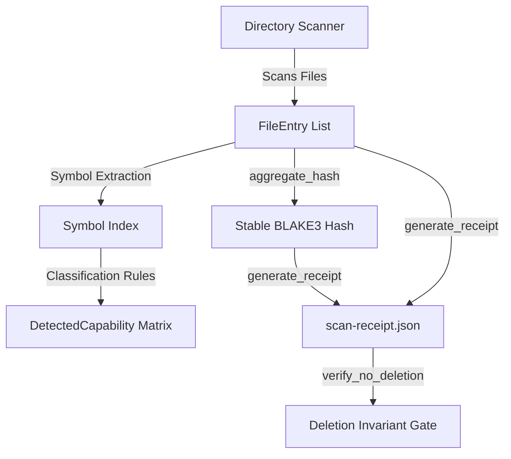

# cpmp (Computer Project Mapping Protocol)

Computer Project Mapping Protocol (CPMP) provides multi-language repository scanning, semantic capability classification, structural symbol extraction, and cryptographic directory state verification.

## Features

- **Multi-Language Directory Scanner**: Recursively scans directory trees to index files across languages (Rust, Go, Python, JavaScript, TypeScript, Java, C/C++, Erlang, Wasm, etc.).
- **Semantic Capability Classification**: Matches repository symbols against classification lists to identify capability categories (e.g. Network, Cryptography, File System).
- **Dormancy Signal Filtering**: Re-classifies capabilities inside workspace-excluded or dormant packages, providing repository-level dependency health metrics.
- **Deterministic State Receipts**: Computes stable directory content hashes using BLAKE3 (`aggregate_hash`) and emits signed `scan-receipt.json` files.
- **Deletion Check Invariants**: Provides `verify_no_deletion` gates to prove that subsequent builds or generation actions did not silently purge workspace assets.
- **CLI Commands**: Integrates `clap-noun-verb` for distributed subcommand registration under `cpmp catalog`.

## Architecture & Design

`cpmp` maps physical source repositories into abstract capability graphs and registers metadata.



### Module Structure
- **`scanner`**: Core filesystem traverser indexing source files and computing BLAKE3 hashes.
- **`classification` / `capability`**: Identifies structural capabilities by matches against code signatures.
- **`receipt`**: Cryptographic receipt writing and order-independent tree hashing.
- **`catalog`**: CLI verbs registered under the `cpmp catalog` command.
- **`db`**: Optional SQLite database backend (enabled via feature flag).

---

## Public API Examples

### 1. Directory Scanning and Receipt Generation

```rust
use cpmp::scanner;
use cpmp::receipt::generate_receipt;
use cpmp::models::FileEntry;
use std::path::{Path, PathBuf};

fn main() -> Result<(), Box<dyn std::error::Error>> {
    let scan_paths = vec![PathBuf::from("crates/ggen-core")];
    let output_dir = Path::new("target/cpmp-output");

    // 1. Scan directory structure to capture file entries
    let files: Vec<FileEntry> = scanner::scan(&scan_paths, output_dir)?;

    // 2. Generate the deterministic scan receipt (JSON + TOML copies)
    let receipt = generate_receipt(
        &files,
        output_dir,
        vec!["crates/ggen-core".to_string()],
        vec!["target/cpmp-output/scan-receipt.json".to_string()],
    )?;

    println!("Scan Complete. Deterministic Hash: {}", receipt.aggregate_hash);
    Ok(())
}
```

### 2. Verifying Receipt Drift (No-Deletion Check)

```rust
use cpmp::receipt::verify_no_deletion;
use std::path::PathBuf;

fn main() -> Result<(), Box<dyn std::error::Error>> {
    let before = PathBuf::from("target/cpmp-output/receipts/scan_before.toml");
    let after = PathBuf::from("target/cpmp-output/receipts/scan_after.toml");

    // Verifies that no files documented in `before` were deleted in `after`
    // Prints a REFUSAL warning if files are missing.
    verify_no_deletion(&before, &after)?;

    Ok(())
}
```

---

## Usage Instructions

### Installation

Add `cpmp` to your workspace or project `Cargo.toml`:

```toml
[dependencies]
cpmp = { path = "crates/cpmp" }
```

### CLI Interface

`cpmp` exposes a CLI built with `clap-noun-verb` for scanning and listing capability catalogs from the command line:

```bash
# Run catalog scanning
cargo run --bin cpmp catalog scan --path . --out ./output
```

### Running Tests

Execute the order-independent hash and scanning unit tests:

```bash
cargo test -p cpmp
```

## Cargo Features

- **`sqlite`**: Optional feature that enables the rusqlite-backed catalog database. Off by default to keep the compilation profile lightweight.

## License

This crate is licensed under the MIT License.
