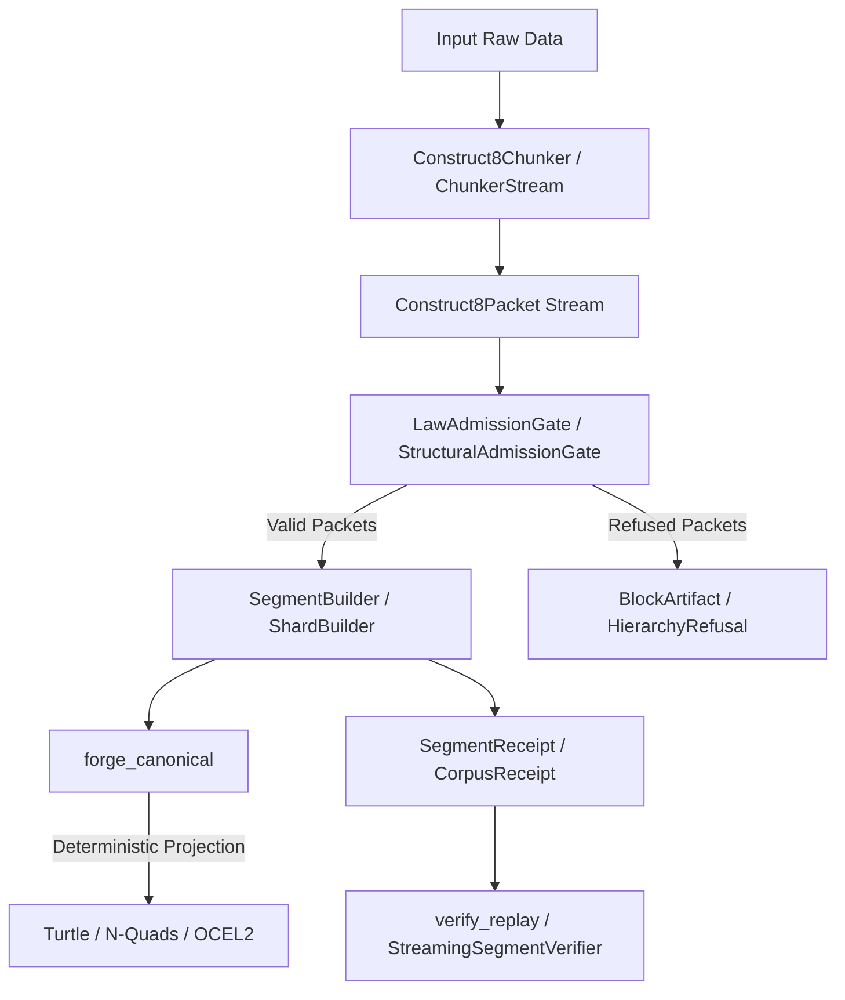

# KNHK Construct8 Genesis Engine (`genesis-construct8`)

> **KNHK decides what may exist. Construct8 Genesis makes it exist eight triples at a time. The Forge turns it into bytes. Receipts prove it happened. Replay proves it again.**

*See the full [VISION_2030_GGEN_GENESIS_DOCTRINE](../../docs/VISION_2030_GGEN_GENESIS_DOCTRINE.md) for the complete strategic doctrine.*

`genesis-construct8` is the concrete, physical construction layer for the KNHK framework. While KNHK’s upper layers define the governing frame (typing, determinism, validation, and guard laws), this engine provides the concrete, memory-efficient materialization of trillion-scale triple corpora through bounded, zero-allocation 8-triple construction packets.

---

## 1. Architectural Overview

Large semantic graphs are **not** represented as giant in-memory objects. Instead, they are processed as packet streams. The engine ingests, validates, constructs, and signs triples in bounded chunks.



### Components

- **`Construct8Packet`**: Zero-allocation, `#[repr(C)]` layout representing subject, predicate, and object arrays (8 slots at a time) with bitmasks for validity, emission, and blocking status.
- **Admission Gates**: Gated structures (`StructuralAdmissionGate`, `LawAdmissionGate`) that validate input packets against structural and vocabulary constraints before materialization.
- **The Forge**: Deterministic code generator that projects packet streams into standardized serializations (N-Quads, Turtle, and OCEL 2.0) without heap-allocating the entire graph.
- **Verification & Replay**: Verifiers (`StreamingSegmentVerifier`, `verify_replay`) that replay cryptographic receipts (`SegmentReceipt`, `ShardReceipt`, `CorpusReceipt`) to verify state transitions deterministically.

---

## 2. The Absolute Invariants

1. **No exported bytes bypass the forge.** All canonical representations are generated by the forge.
2. **No hot-path packet contains more than eight active triples.** Bounded by `Construct8Packet`.
3. **No private predicate authority in public-vocabulary mode.** Checked by the admission rules.
4. **Every emitted artifact has a hash.** Backed by `blake3` computation.
5. **Every hash is bound to a receipt.**
6. **Every receipt can be replayed.** Replays are side-effect-free and mathematically verifiable.
7. **Every refusal is materialized as a BLOCK artifact.**

---

## 3. Installation & Cargo Features

Add the dependency to your `Cargo.toml`:

```toml
[dependencies]
genesis-construct8 = { version = "26.7.1", path = "../genesis-construct8" }
```

### Features

| Feature | Description | Default |
|---------|-------------|---------|
| `std` | Exposes standard library integrations (file I/O, OS-level clocks) | Yes |
| `metrics` | Enables real-time throughput and memory consumption stats | No |

---

## 4. Public API Usage Example

Below is a complete, compile-ready example demonstrating how to parse raw inputs into `Construct8Packet`s, filter them through an admission gate, forge canonical N-Quads, and verify the resulting receipt.

```rust
use genesis_construct8::{
    parse_input_to_packets, forge_canonical, verify_replay,
    Construct8Packet, SymbolTable, SegmentBuilder, LawAdmissionGate
};
use std::collections::HashMap;

fn main() -> Result<(), Box<dyn std::error::Error>> {
    // 1. Initialize a SymbolTable for mapping subject/predicate/object hashes
    let mut symbols = SymbolTable::new();
    let sub_id = symbols.insert("http://example.org/subject/1");
    let pred_id = symbols.insert("http://example.org/predicate/type");
    let obj_id = symbols.insert("http://example.org/object/TypeA");

    // 2. Build a raw Construct8Packet with the symbols mapped
    let mut subjects = [0u32; 8];
    let mut predicates = [0u32; 8];
    let mut objects = [0u32; 8];
    
    subjects[0] = sub_id;
    predicates[0] = pred_id;
    objects[0] = obj_id;

    let packet = Construct8Packet {
        epoch: 1,
        law_ref: 101,
        subjects,
        predicates,
        objects,
        kind_mask: 0b00000001,  // Slot 0 is active
        valid_mask: 0b00000001, // Slot 0 is valid
        emit_mask: 0b00000001,  // Slot 0 is marked for emission
        block_mask: 0,
        order: 0,
        receipt_seed: [0u8; 32],
    };

    // 3. Build a Segment with the valid packets
    let packets = vec![packet];
    let mut segment_builder = SegmentBuilder::new(1); // Epoch 1
    
    // Add packets to the builder
    for pkt in &packets {
        segment_builder.push(*pkt)?;
    }
    
    let segment = segment_builder.build()?;

    // 4. Forge canonical N-Quads from the segment
    let mut output_bytes = Vec::new();
    let receipt = forge_canonical(&segment, &symbols, &mut output_bytes)?;

    println!("Forged N-Quads bytes: {} bytes", output_bytes.len());
    println!("Generated transition receipt: {:?}", receipt.hash());

    // 5. Verify the transition receipt via replay
    let replay_result = verify_replay(&segment, &receipt);
    assert!(replay_result.is_ok(), "Replay verification failed!");
    println!("✓ Replay verification passed cleanly!");

    Ok(())
}
```

---

## 5. Operations CLI (`knhk8`)

Operational CLI commands for managing construction packets directly:

```bash
# 1. Forge canonical bytes from candidate packets
knhk8 forge nquads evidence.c8 --out evidence.nq --receipt

# 2. Verify an N-Quads file against its receipt
knhk8 verify evidence.nq --receipt evidence.nq.receipt.json

# 3. Simulate replay via receipts
knhk8 replay evidence.nq.receipt.json
```

---

## 6. Testing

Run the suite of unit and structural validation tests using cargo:

```bash
cargo test --package genesis-construct8
```
