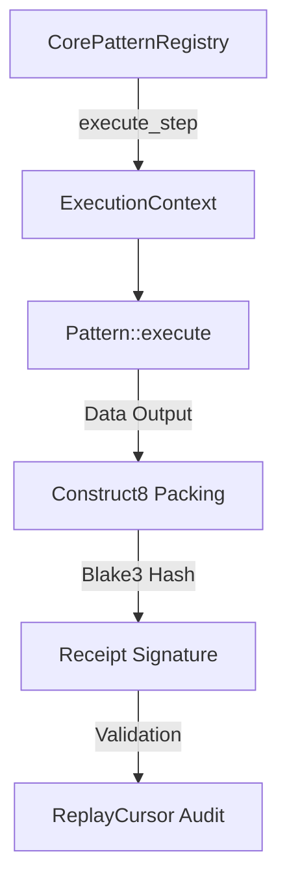

# genesis-core-v2

Core runtime execution engine, YAWL pattern traits, and zero-allocation data primitives for KNHK V2.

This crate contains the implementation of the KNHK V2 workflow engine. It provides the async-ready, validation-gated `Pattern` trait, built-in control-flow patterns, cryptographic receipt generation, process security gates, and event replay cursors designed for high-performance execution.

## Features

- **Pattern Trait System**: Defines the async-ready, validation-gated execution model for all 43 standard YAWL workflow patterns. Optimized for a ≤5µs hot-path execution.
- **Control-Flow Patterns**: Built-in implementations of core control flows including `SequencePattern` (WCP-1), `ParallelSplitPattern` (WCP-2), and `ExclusiveChoicePattern` (WCP-3).
- **Process Admission Gates (Church / Revelation)**: Evaluates process standing against cryptographic authority gates (`passes_all_gates`, `verify_lamb_authority`, `Church`, `JerusalemGate`).
- **Binary Relation Primitives**: Memory-mapped binary structures designed for zero-copy, heap-allocation-free data composition:
  - `Pair2`: Predicate-assumed left-right byte pair.
  - `RelationPage`: Const-generic fixed-capacity array page mapping binary relations.
  - `Construct8`: Bounded lane packing for up to 8 relation pairs.
- **Cryptographic Transition Receipts**: Deterministic BLAKE3 receipt chain generation (`Receipt::generate`).
- **Tamper-Evident Replay Cursors**: Audits chronological event traces sequentially against signed receipts using `ReplayCursor`.
- **Thread-Safe Registry**: Concurrent, thread-safe pattern registration and discovery (`CorePatternRegistry`) backed by `DashMap`.

## Architecture & Design

`genesis-core-v2` acts as the execution engine for the KNHK V2 platform, linking structural definitions to deterministic execution results.



### Module Structure
- **`primitives`**: Bounded binary types (`Pair2`, `RelationPage`, `Construct8`, `Receipt`, `ReplayCursor`).
- **`revelation`**: Security gates (`Church`, `JerusalemGate`, `Seal`) that audit execution authority.
- **`registry`**: Thread-safe DASHMAP-based pattern registry.
- **`split_laws`**: Splitting gates for partitioning computation.
- **`inventory`**: Workspace artifact classification schemas.

---

## Public API Examples

### 1. Registering and Executing Workflow Steps

```rust
use genesis_core_v2::{Pattern, ExclusiveChoicePattern, SequencePattern, CorePatternRegistry};
use genesis_types_v2::{ExecutionContext, WorkflowStep, StepId, PatternId};
use std::sync::Arc;
use serde_json::json;

#[tokio::main]
async fn main() -> Result<(), genesis_types_v2::Error> {
    // 1. Initialize registry and register patterns
    let registry = CorePatternRegistry::new();
    let seq_pattern = Arc::new(SequencePattern::new());
    registry.register(seq_pattern);

    // 2. Setup execution context and workflow step
    let mut context = ExecutionContext::new("workflow-run-99".to_string());
    context.data.insert("init_value".to_string(), json!("hello"));

    let step = WorkflowStep {
        id: StepId::generate(),
        pattern_id: PatternId::new(1), // Sequence pattern ID
        inputs: std::collections::HashMap::new(),
        outputs: vec![],
    };

    // 3. Execute the step through the registry
    registry.execute_step(&step, &mut context).await?;
    println!("Step executed successfully. New state: {:?}", context.state);

    Ok(())
}
```

### 2. Packaging Binary Relations and Verifying receipts

```rust
use genesis_core_v2::{Pair2, Construct8, Receipt, ReplayCursor, Refusal};

fn main() -> Result<(), Refusal> {
    // 1. Pack binary relation pairs (zero heap allocation)
    let mut pack = Construct8::new(1, 100); // Epoch 1, Relation ID 100
    pack.push(Pair2::new(10, 20))?;
    pack.push(Pair2::new(30, 40))?;

    // 2. Generate a deterministic BLAKE3 receipt signature
    let prior_hash = [0u8; 32];
    let receipt = Receipt::generate(&pack, &prior_hash);
    println!("Transition Receipt Signature: {}", hex::encode(receipt.signature));

    // 3. Replay audit log using a ReplayCursor
    let mut cursor = ReplayCursor::new();
    cursor.advance(&pack, &receipt)?;

    assert_eq!(cursor.expected_epoch, 1);
    assert_eq!(cursor.processed_count, 1);
    assert_eq!(cursor.last_receipt, receipt.signature);

    println!("Process replay validated successfully!");
    Ok(())
}
```

### 3. Evaluating Process Admission Authority Gates

```rust
use genesis_core_v2::{passes_all_gates, verify_lamb_authority, Church, SealState};

fn main() {
    let authority_signature = [0u8; 64]; // Mock signature
    let message_bytes = b"process-evidence-payload";

    // Validate signature authority
    let is_authorized = verify_lamb_authority(&authority_signature, message_bytes);
    println!("Authority validation: {}", is_authorized);
}
```

---

## Usage Instructions

### Installation

Add `genesis-core-v2` to your workspace or project `Cargo.toml`:

```toml
[dependencies]
genesis-core-v2 = { path = "crates/genesis-core-v2" }
```

### Running Tests

Run the unit tests verifying pattern traits, binary serialization, and security gates:

```bash
cargo test -p genesis-core-v2
```

## Cargo Features

This crate compiles with standard library support and exposes no optional features.

## License

This crate is licensed under the MIT License.
