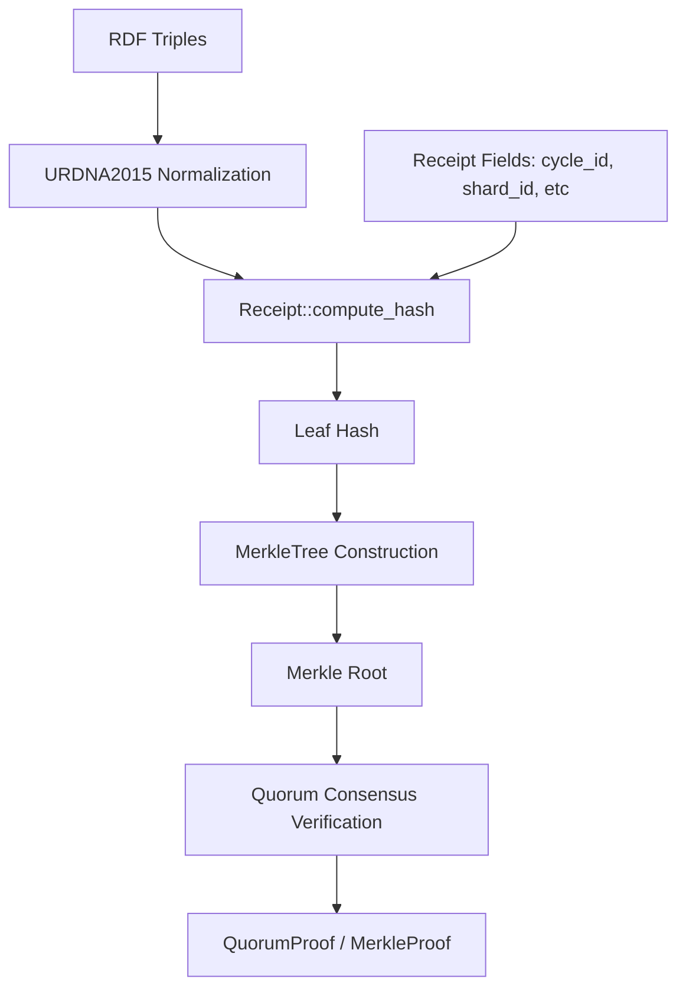

# KNHK Lockchain Provenance Engine (`genesis-lockchain`)

> **Distributed lock synchronization and Merkle-provenance validation for the KNHK kernel.**

*See the full [VISION_2030_GGEN_GENESIS_DOCTRINE](../../docs/VISION_2030_GGEN_GENESIS_DOCTRINE.md) for the complete strategic doctrine.*

`genesis-lockchain` provides the distributed state-locking and cryptographic provenance validation layers for KNHK. It guarantees that multi-party network state transitions are transactionally isolated, signed via consensus quorums, and tracked via Merkle-proof receipts.

---

## 1. Architectural Overview

The engine ensures that state changes are represented as RDF datasets, normalized via canonicalization rules, hashed into a Merkle tree, and signed by a consensus quorum.



### Components

- **`Receipt`**: The core verification structure, capturing transition cycles, shard indexes, hook markers, execution ticks, and state hashes. It uses URDNA2015 basic canonicalization combined with SHA-256 for deterministic hashing.
- **`MerkleTree`**: Aggregates transition receipts into a cryptographic Merkle tree, generating lightweight proofs that permit leaf verification against the tree's root.
- **`QuorumManager`**: Manages peer nodes, collects digital signatures, and validates quorum consensus policies to seal Merkle roots.
- **`LockchainStorage`**: Zero-allocation backing store for managing locked ranges, persistent lock status, and receipt indexes.

---

## 2. Invariants & Safety Gates

1. **No lock release without a valid quorum receipt.** Locks must remain active until the consensus quorum generates and signs the receipt.
2. **Deterministic receipt hashing.** All receipts are hashed using URDNA2015 canonicalization combined with SHA-256.
3. **Auditability.** All lock transitions are recorded as append-only records that can be replayed to reconstruct the lock state.

---

## 3. Installation & Cargo Features

Add the dependency to your `Cargo.toml`:

```toml
[dependencies]
genesis-lockchain = { version = "26.7.1", path = "../genesis-lockchain" }
```

### Features

| Feature | Description | Default |
|---------|-------------|---------|
| `std` | Exposes standard library integrations (file locking, system timers) | Yes |
| `network` | Enables peer-to-peer TCP transport channels | No |

---

## 4. Public API Usage Example

Below is a complete, compile-ready example demonstrating how to initialize a `Receipt`, compute its canonical hash, insert it into a `MerkleTree`, and verify the Merkle proof.

```rust
use genesis_lockchain::{Receipt, MerkleTree, MerkleProof};

fn main() -> Result<(), Box<dyn std::error::Error>> {
    // 1. Create a new transition receipt
    let receipt = Receipt::new(
        1001,      // cycle_id
        1,         // shard_id
        12,        // hook_id
        4500,      // actual_ticks
        0xDEADBEEF // hash_a
    );

    // 2. Compute the canonical hash (normalizes input RDF and hashes it)
    let rdf_data = "<http://example.org/node> <http://example.org/property> \"value\" .\n";
    let receipt_hash = receipt.compute_hash(rdf_data)?;
    println!("Canonical Receipt Hash: {}", hex::encode(receipt_hash));

    // 3. Populate a Merkle Tree with receipt hashes
    let leaf_hashes = vec![
        receipt_hash,
        [0u8; 32], // sibling hash
    ];
    let tree = MerkleTree::new(leaf_hashes)?;

    // 4. Generate a Merkle proof for the first receipt
    let proof = tree.generate_proof(0)?;
    let root = tree.root();

    // 5. Verify the receipt hash against the Merkle root
    let is_valid = proof.verify(root, receipt_hash)?;
    assert!(is_valid, "Merkle proof verification failed!");
    println!("✓ Receipt Merkle proof verified successfully!");

    Ok(())
}
```

---

## 5. Testing

Run the test suite to verify distributed locking, Merkle trees, and consensus structures:

```bash
cargo test --package genesis-lockchain
```
