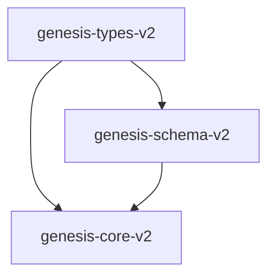

# genesis-types-v2

Foundational types, data structures, and errors for the KNHK V2 workflow engine.

This crate defines the shared domain model and data schemas used throughout the Genesis ecosystem. It includes workflow execution states, POWL (Process Trees with Or/And/Seq/Loop operator nodes) process graphs, and process admission report types.

## Features

- **Workflow Domain Types**: Strongly-typed structures for tracking executions, steps, and execution states (e.g., `ExecutionId`, `StepId`, `PatternId`, `ExecutionContext`).
- **POWL Process Law Graphs**: Represent workflows as semantic graphs using `PowlGraph`, `PowlNode`, and `PowlEdge` with built-in structural validation checks.
- **Process Admission Reports**: Define structured audit reports (`ProcessAdmissionReport`, `GateResult`, and `AdmissionStatus`) to model process compliance against authority/security gates.
- **TAMPER-Evident Evidence**: Integrated BLAKE3 cryptographic verification of admission report contents.
- **Serialization-Safe**: Full `serde` support for clean JSON/JSON-LD serialization and deserialization.

## Architecture & Design

`genesis-types-v2` is designed as a pure data-plane type library with zero external system dependencies (such as databases or network frameworks). It is a foundational dependency for the Genesis runtime:



### Module Structure
- **Workflow State Management**: `ExecutionContext` and `ExecutionState` are used to track running instances of workflows.
- **POWL Process Representation**: `PowlGraph` maps process logic. The `.validate()` function performs structural assertions (e.g., ensuring edge endpoints exist, checking for unique node IDs).
- **Process Admission Gates**: Model security/compliance checkpoints using the `GateResult` array, which derives an overall admission state.

---

## Public API Examples

### 1. Declaring and Moving a Workflow Through States

```rust
use genesis_types_v2::{ExecutionContext, ExecutionState, StepId};

fn main() {
    // 1. Initialize a workflow execution context
    let mut context = ExecutionContext::new("invoice-processing-flow".to_string());
    assert_eq!(context.state, ExecutionState::Pending);

    // 2. Transition to running
    context.state = ExecutionState::Running;
    let step_id = StepId::generate();
    context.current_step = Some(step_id);

    // 3. Store step input data in context memory
    context.data.insert("invoice_total".to_string(), serde_json::json!(450.0));
    println!("Workflow context initialized: {}", context.workflow_id);
}
```

### 2. Constructing and Validating a POWL Graph

```rust
use genesis_types_v2::{PowlGraph, PowlNode, PowlEdge};

fn main() -> Result<(), Box<dyn std::error::Error>> {
    let graph = PowlGraph {
        id: "seq-001".to_string(),
        name: "LinearApproval".to_string(),
        nodes: vec![
            PowlNode {
                id: "start".to_string(),
                activity: "SubmitRequest".to_string(),
                object_refs: vec!["draft_doc".to_string()],
                guard: None,
            },
            PowlNode {
                id: "end".to_string(),
                activity: "NotifyRequester".to_string(),
                object_refs: vec!["final_receipt".to_string()],
                guard: None,
            },
        ],
        edges: vec![
            PowlEdge {
                from: "start".to_string(),
                to: "end".to_string(),
                condition: None,
            }
        ],
        root: "start".to_string(),
        sinks: vec!["end".to_string()],
    };

    // Run structural checks
    let violations = graph.validate();
    if !violations.is_empty() {
        println!("Graph validation failed: {:?}", violations);
    } else {
        println!("Graph is structurally valid!");
    }

    Ok(())
}
```

### 3. Emitting a Process Admission Report

```rust
use genesis_types_v2::{ProcessAdmissionReport, GateResult, AdmissionStatus};
use chrono::Utc;
use uuid::Uuid;

fn main() {
    let gates = vec![
        GateResult {
            gate_id: "GATE_AUTH_001".to_string(),
            gate_name: "StewardshipSignature".to_string(),
            status: AdmissionStatus::Alive,
            detail: "Steward signature verified by BLAKE3 MAC".to_string(),
            evidence_hash: Some("4a5b6c...".to_string()),
        }
    ];

    let report = ProcessAdmissionReport {
        operation_id: Uuid::new_v4().to_string(),
        graph_id: "seq-001".to_string(),
        status: ProcessAdmissionReport::compute_status(&gates),
        gates,
        receipt_hash: None,
        timestamp: Utc::now(),
    };

    // Derive and bind the cryptographic receipt hash
    let signed_report = report.with_receipt_hash();
    println!("Report Receipt Hash: {:?}", signed_report.receipt_hash);
}
```

---

## Usage Instructions

### Installation

Add `genesis-types-v2` to your workspace or project `Cargo.toml`:

```toml
[dependencies]
genesis-types-v2 = { path = "crates/genesis-types-v2" }
```

### Running Tests

Execute unit tests for serialization, validation, and status calculations:

```bash
cargo test -p genesis-types-v2
```

## Cargo Features

This crate does not expose optional features; it compiles with standard library and Serde support enabled by default.

## License

This crate is licensed under the MIT License.
