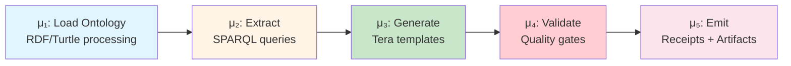
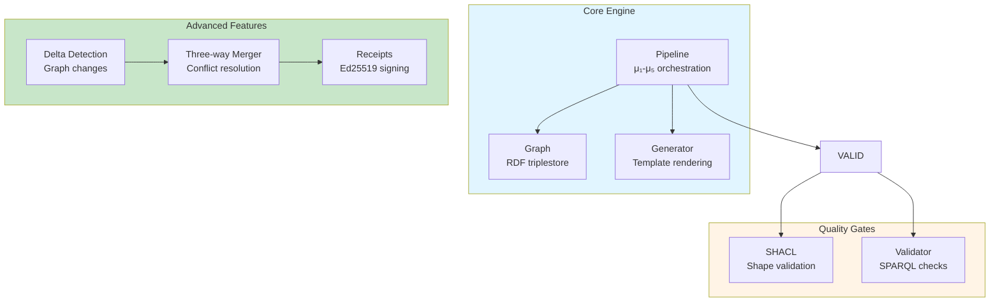

# ggen-core

Core graph-aware code generation engine for ggen, providing RDF processing, template management, and code generation capabilities.

## Overview

ggen-core implements the five-stage μ₁-μ₅ pipeline for ontology-governed code generation:

## Features

- RDF/SPARQL processing and querying
- Template engine with frontmatter support
- Deterministic code generation
- Marketplace and registry support
- Pipeline management for code generation workflows
- Graph delta detection and three-way merging
- Cryptographic receipt generation (Ed25519)
- SHACL validation for ontology constraints

## Module Organization (49 modules)

## Usage

This crate is primarily used internally by the main ggen binary. See the main ggen documentation for usage examples.

**Key Types:**
- `Graph` - RDF triplestore wrapper
- `Pipeline` - μ₁-μ₅ orchestration
- `Generator` - Template rendering engine
- `Receipt` - Cryptographic proof of generation
- `ThreeWayMerger` - Conflict-aware merging

## Related Crates

- `ggen-cli` - Command-line interface
- `ggen-domain` - Business logic layer
- `ggen-ontology-core` - RDF/SPARQL utilities
- `ggen-receipt` - Ed25519 receipt infrastructure

