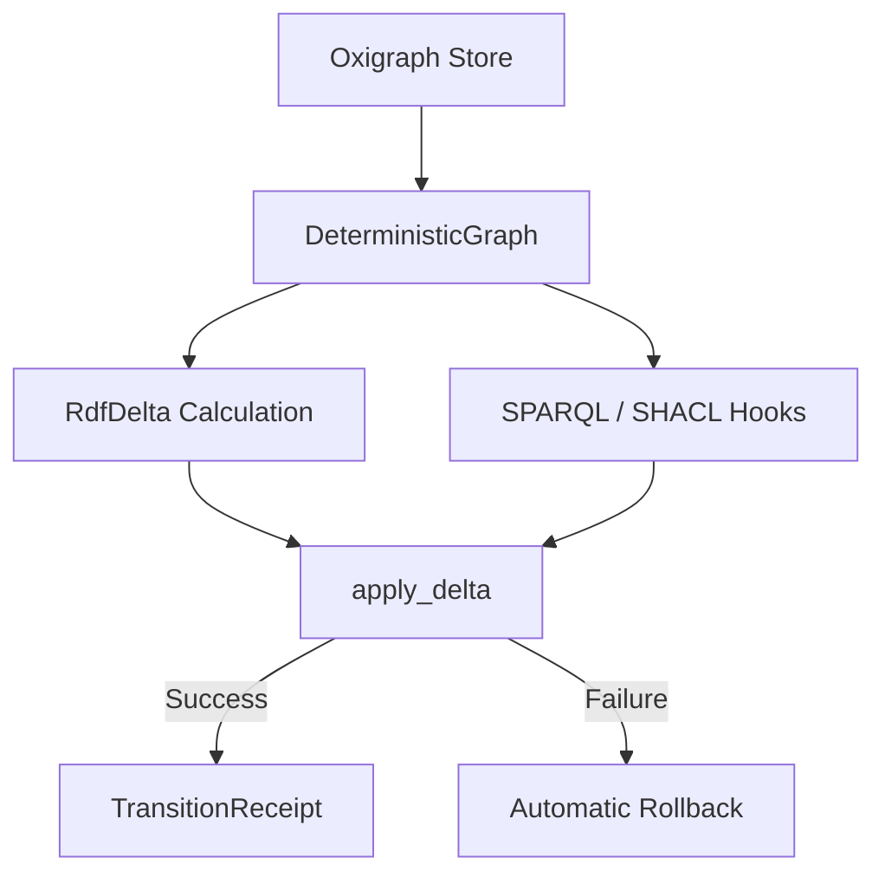

# ggen-graph

Deterministic, transaction-safe, and cryptographically provable RDF graph database module for the `ggen` framework.

`ggen-graph` provides a thread-safe, deterministic RDF graph wrapper around [Oxigraph](https://github.com/oxigraph/oxigraph). It ensures reproducible state hashing, computes state change deltas, enforces validation hooks (using SPARQL queries or SHACL shapes), and generates cryptographic transition receipts to prove state transitions.

## Features

- **Deterministic State Hashing**: Enforces a strict canonical ordering on quads to generate stable, collision-resistant BLAKE3 hashes of the graph database state.
- **State Change Detection (RDF Deltas)**: Computes state differences between two graphs as `RdfDelta` objects containing additions and deletions in N-Quads format.
- **Atomic Validation Hooks**: Supports `KnowledgeHook` constraints defined as SPARQL `ASK` or `SELECT` queries that run atomically during delta application.
- **Cryptographic Transition Receipts**: Emits a `TransitionReceipt` binding the prior state hash, new state hash, delta hash, and timestamp under a BLAKE3-signed envelope.
- **Automatic Rollback**: Guarantees ACID-like atomic transitions. If a verification hook or SHACL validation fails, the graph rolls back to its exact prior state.
- **Three-Pole Coherence Checking**: Evaluates alignment, drift, and divergence across three poles (e.g., local state, remote index, registry) to detect state drift.
- **SHACL Shape Validation**: Programmatic validation of RDF graphs against W3C SHACL shape constraints.

## Architecture & Design

`ggen-graph` acts as the deterministic state engine of the `ggen` framework. The crate architecture is structured as follows:



### Module Overview
- **`graph`**: Core `DeterministicGraph` wrapper around `oxigraph::store::Store`.
- **`delta`**: Calculation of graph differences (`RdfDelta`) as sets of serialized N-Quads.
- **`receipt`**: Cryptographic receipt representation (`TransitionReceipt`) with self-verifying BLAKE3 content hashes.
- **`shacl` / `sparql`**: Validation using W3C SHACL constraints and SPARQL query validation.
- **`coherence`**: Multi-pole drift and coherence checks evaluating state alignment.
- **`interchangeable`**: Adapter layers to map between the graph database and structural Rust/`no_std` memory buffers.

---

## Public API Examples

### 1. Basic Graph Insertion and State Hashing

```rust
use ggen_graph::{DeterministicGraph, parse_nquad, GraphError};

fn main() -> Result<(), GraphError> {
    // Initialize a new deterministic graph
    let graph = DeterministicGraph::new()?;

    // Parse an N-Quad string
    let quad_str = "<http://example.org/alice> <http://example.org/name> \"Alice\" <http://example.org/graph> .";
    let quad = parse_nquad(quad_str).map_err(|e| GraphError::Serialization(e.to_string()))?;

    // Insert and query
    graph.insert_quad(&quad)?;
    assert!(graph.contains_quad(&quad)?);

    // Retrieve state hash
    let hash: [u8; 32] = graph.state_hash()?;
    println!("Graph State Hash: {}", hex::encode(hash));

    Ok(())
}
```

### 2. Computing Deltas and Applying with Validation Hooks

```rust
use ggen_graph::{DeterministicGraph, RdfDelta, KnowledgeHook, parse_nquad, GraphError};

fn main() -> Result<(), GraphError> {
    let graph = DeterministicGraph::new()?;
    let target = DeterministicGraph::new()?;

    let q1 = parse_nquad("<http://example.org/a> <http://example.org/p> \"v1\" <http://example.org/g> .")
        .map_err(|e| GraphError::Serialization(e.to_string()))?;
    let q2 = parse_nquad("<http://example.org/b> <http://example.org/p> \"v2\" <http://example.org/g> .")
        .map_err(|e| GraphError::Serialization(e.to_string()))?;

    graph.insert_quad(&q1)?;
    target.insert_quad(&q1)?;
    target.insert_quad(&q2)?;

    // Compute the RDF delta between the current state and target state
    let delta = RdfDelta::compute(&graph, &target)?;
    assert_eq!(delta.additions.len(), 1);

    // Create a verification hook (must return true/pass)
    let check_no_charlie = KnowledgeHook::new(
        "no_charlie".to_string(),
        "ASK WHERE { FILTER NOT EXISTS { GRAPH ?g { ?s <http://example.org/name> \"Charlie\" } } }".to_string(),
    );

    // Apply the delta atomically under validation hooks
    // If validation fails, the transaction is rolled back.
    let receipt = graph.apply_delta(&delta, &[check_no_charlie])?;

    // Verify the cryptographic transition receipt
    receipt.verify()?;
    println!("Transition successful. Post-hash: {}", hex::encode(receipt.post_state_hash));

    Ok(())
}
```

### 3. Evaluating Coherence Across State Poles

```rust
use ggen_graph::{CoherenceChecker, Pole, PoleState, GraphError};
use std::collections::HashMap;

fn main() -> Result<(), GraphError> {
    // Collect the states of three poles (e.g. registry, remote index, local workspace)
    let local_hash = [1u8; 32];
    let remote_hash = [1u8; 32];
    let registry_hash = [2u8; 32]; // drifted

    let mut poles = HashMap::new();
    poles.insert(Pole::Local, PoleState { state_hash: local_hash, epoch: 10 });
    poles.insert(Pole::Remote, PoleState { state_hash: remote_hash, epoch: 10 });
    poles.insert(Pole::Registry, PoleState { state_hash: registry_hash, epoch: 9 });

    // Run the coherence check
    let checker = CoherenceChecker::new(poles);
    let report = checker.check();

    if !report.is_coherent() {
        println!("Drift detected: {:?}", report.drifts);
    } else {
        println!("All poles coherent!");
    }

    Ok(())
}
```

---

## Usage Instructions

### Installation

Add `ggen-graph` to your workspace or project `Cargo.toml`:

```toml
[dependencies]
ggen-graph = { path = "crates/ggen-graph" }
```

### Running Tests

Execute the unit and integration tests for this crate:

```bash
cargo test -p ggen-graph
```

## Cargo Features

This crate does not expose optional features; it compiles with the default Oxigraph features and standard library support.

## License

This crate is licensed under the MIT License.
