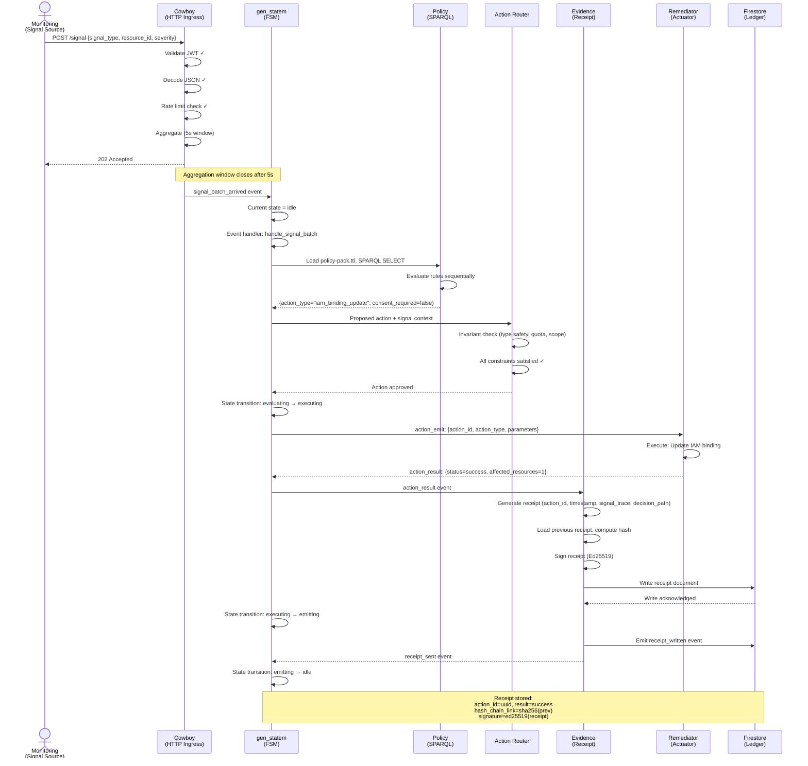
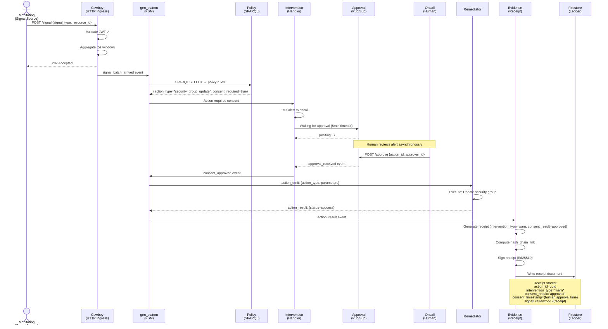
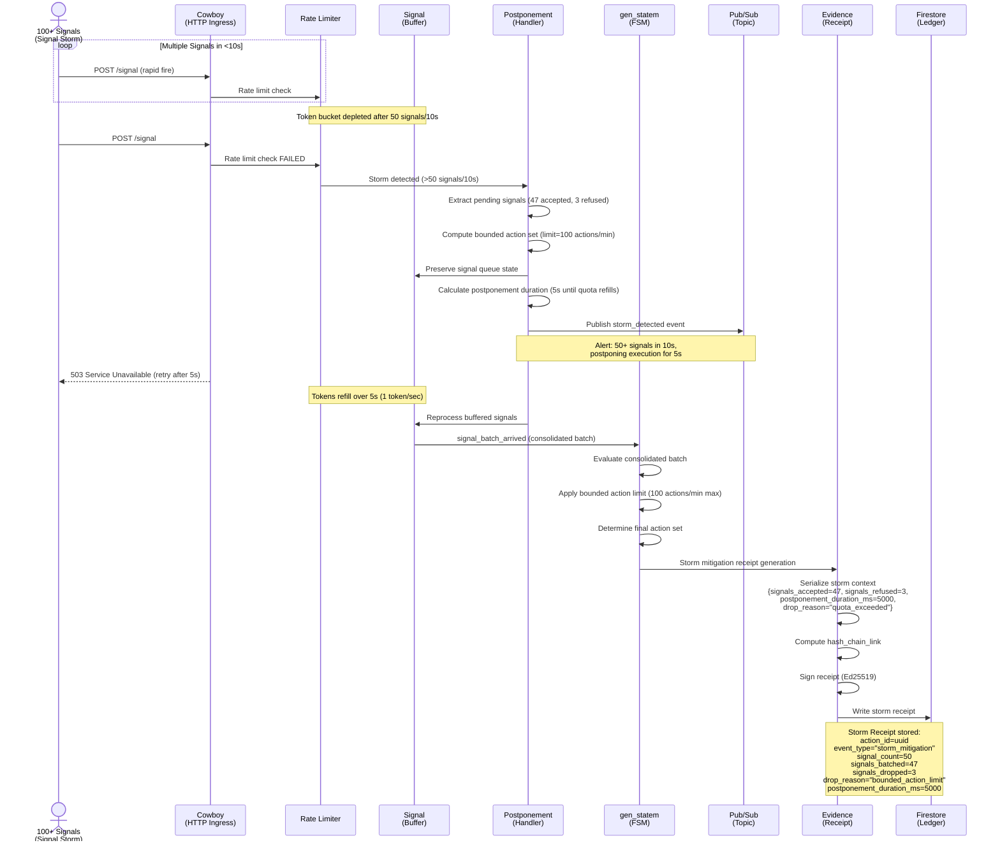
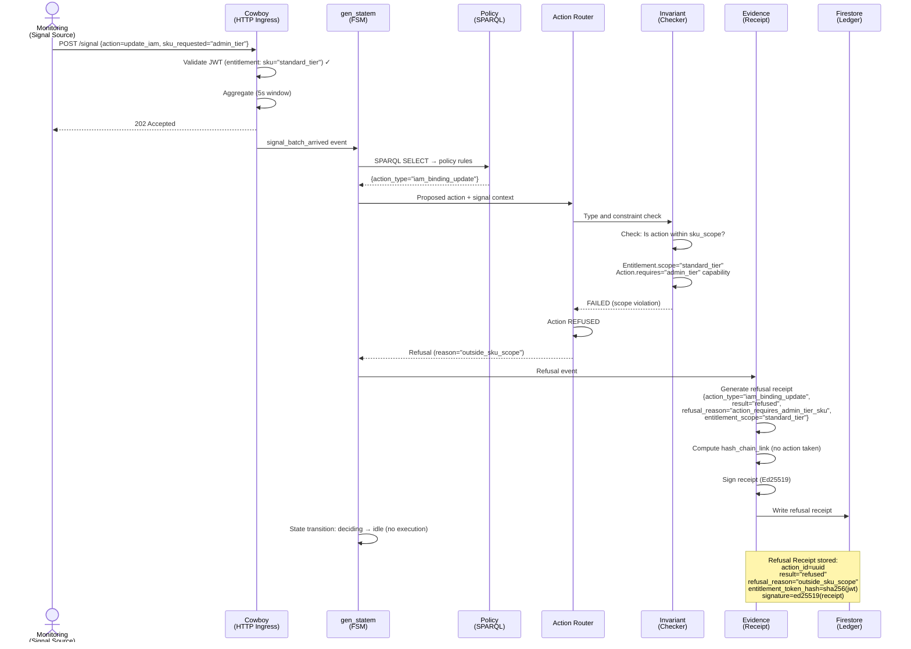

<!-- START doctoc generated TOC please keep comment here to allow auto update -->
<!-- DON'T EDIT THIS SECTION, INSTEAD RE-RUN doctoc TO UPDATE -->
**Table of Contents**

- [C4 Level 4: Runtime Sequences - Signals, State Transitions, and Receipts](#c4-level-4-runtime-sequences---signals-state-transitions-and-receipts)
  - [Runtime Overview](#runtime-overview)
  - [Sequence Diagram 1: Normal Execution (Happy Path)](#sequence-diagram-1-normal-execution-happy-path)
  - [Sequence Diagram 2: Intervention (Warn → Approval → Execute)](#sequence-diagram-2-intervention-warn-%E2%86%92-approval-%E2%86%92-execute)
  - [Sequence Diagram 3: Storm Handling (Rate Limit Postponement)](#sequence-diagram-3-storm-handling-rate-limit-postponement)
  - [Sequence Diagram 4: Refusal (Policy Block + Scope Violation)](#sequence-diagram-4-refusal-policy-block--scope-violation)
  - [Runtime State Diagram (gen_statem FSM)](#runtime-state-diagram-gen_statem-fsm)
  - [Glossary Cross-Reference](#glossary-cross-reference)
  - [Receipt Contract (Evidence Plane)](#receipt-contract-evidence-plane)
  - [Performance Requirements](#performance-requirements)
  - [Definition of Done](#definition-of-done)

<!-- END doctoc generated TOC please keep comment here to allow auto update -->

# C4 Level 4: Runtime Sequences - Signals, State Transitions, and Receipts

**Document Purpose**: Define runtime behavior through sequence diagrams showing signal→decision→action→receipt flows, including interventions, storms, and refusals.

**Version**: 1.0 | **Date**: 2026-01-25

---

## Runtime Overview

The autonomic reconciliation engine's behavior is defined by **4 core sequences**:

| Sequence | Trigger | Flow | Receipt |
|----------|---------|------|---------|
| **Normal Execution** | Signal arrives → Policy allows → Action executes | Ingress → FSM → Router → Remediator | success |
| **Intervention** | Signal arrives → Policy requires consent | Ingress → FSM → Intervention handler → Approval → Executor | approved |
| **Storm Handling** | >50 signals/10s OR action quota exceeded | Ingress → Rate limiter → Postponement | postponed |
| **Refusal** | Signal arrives → Policy blocks OR scope violation | Ingress → FSM → Router rejects | refused |

---

## Sequence Diagram 1: Normal Execution (Happy Path)



**Timeline**:
- T+0: Signal arrives at HTTP ingress
- T+5s: Aggregation window closes, batch sent to FSM
- T+5.2s: FSM evaluates policy (50ms)
- T+5.25s: Router approves action (10ms)
- T+5.26s: Action sent to remediator
- T+5.5s: Remediator executes, result returned (240ms)
- T+5.55s: Receipt generated and signed (50ms)
- T+5.6s: Firestore write completes (50ms)
- **Total latency**: P99 < 2s (from signal to receipt generation)

---

## Sequence Diagram 2: Intervention (Warn → Approval → Execute)



**Timeline**:
- T+0: Signal arrives
- T+5s: Aggregation window closes
- T+5.2s: Policy indicates consent required
- T+5.3s: Intervention handler activates, alert sent to oncall
- T+30s (example): Human approves via Pub/Sub
- T+30.1s: FSM transitions to executing
- T+30.5s: Remediator executes action
- T+30.6s: Receipt generated (includes human approval timestamp)
- **Key metric**: Consent latency (human approval time) recorded in receipt

---

## Sequence Diagram 3: Storm Handling (Rate Limit Postponement)



**Key Points**:
- **Storm Detection**: Triggered when >50 signals arrive in <10s (configurable threshold)
- **Bounded Action**: Limit to 100 actions/minute (prevents resource exhaustion)
- **Signal Preservation**: Dropped signals logged in receipt (auditable)
- **Postponement Duration**: 5s (tokens refill at 1/sec, quota = 100)
- **Receipt Includes**: Drop reason, signal counts, postponement duration, reprocessing time

**Storm Metrics** (visible in Prometheus):
- Counter: `gov_storm_detections_total{reason}` (incremented per storm)
- Counter: `gov_signals_dropped_total{reason}` (count of dropped signals)
- Gauge: `gov_signal_queue_depth` (current backlog)
- Histogram: `gov_postponement_duration_seconds` (distribution of postponement times)

---

## Sequence Diagram 4: Refusal (Policy Block + Scope Violation)



**Refusal Types**:

| Refusal Reason | Root Cause | Example |
|----------------|-----------|---------|
| `policy_blocked` | Policy rule returns deny | Security policy: cannot update IAM binding when event_type="compliance_override" |
| `outside_sku_scope` | Action requires capability not in SKU | Action requires "admin_tier", entitlement is "standard_tier" |
| `quota_exceeded` | Resource limit reached | Action would exceed 1000 rules/resource limit |
| `missing_required_field` | Signal missing required field | signal_type missing, cannot determine action |
| `permission_denied` | Principal unauthorized | Service account lacks compute.instances.update permission |

**Receipt Structure for Refusal**:
```json
{
  "action_id": "uuid-refusal-001",
  "timestamp": "2026-01-25T14:35:00Z",
  "signal_trace": ["sig-001"],
  "decision_path": [
    {"rule": "policy/scope/within-sku", "result": false, "matched": true}
  ],
  "action_proposed": "iam_binding_update",
  "result": "refused",
  "refusal_reason": "action_requires_admin_tier_sku",
  "entitlement_context": {
    "sku_scope": "standard_tier",
    "required_scope": "admin_tier"
  },
  "hash_chain_link": "sha256(previous_receipt)",
  "signature": "ed25519(...)"
}
```

---

## Runtime State Diagram (gen_statem FSM)

```
┌─────────────────────────────────────────────────────────────┐
│ gen_statem FSM - Deterministic State Transitions             │
└─────────────────────────────────────────────────────────────┘

                        ┌─────────┐
                        │  START  │
                        └────┬────┘
                             │
                             ↓
                        ┌─────────┐
                        │  idle   │◄──────┐ (state=init)
                        └────┬────┘       │
                             │           │
                   (signal_batch_arrived) (receipt_sent)
                             │           │
                             ↓           │
                      ┌──────────────┐   │
                      │  evaluating  │   │
                      └────┬─────────┘   │
                           │             │
                 (policy_evaluated)      │
                           │             │
                           ↓             │
                      ┌──────────────┐   │
                      │  deciding    │   │
                      └────┬─────────┘   │
                           │             │
                    (decision_made)      │
                           │             │
            ┌──────────────┴──────────────┐
            │                             │
            ↓                             ↓
      ┌──────────────┐            ┌──────────────┐
      │  executing   │            │ refused      │
      │  (or await)  │            │ (terminal)   │
      └────┬─────────┘            └──────┬───────┘
           │                             │
     (action_result)                     │
           │                             │
           ↓                             │
      ┌──────────────┐                   │
      │  emitting    │                   │
      └────┬─────────┘                   │
           │                             │
      (receipt_sent)                     │
           │                             │
           └─────────────┬───────────────┘
                         │
                         ↓
                    ┌─────────┐
                    │  idle   │ (ready for next signal)
                    └─────────┘
```

**States**:
- **idle**: Waiting for signal_batch_arrived event
- **evaluating**: Loading policy, executing SPARQL queries
- **deciding**: Evaluating rules, making decision (approve/refuse/intervention)
- **executing**: Routing action to remediator (or waiting for consent if intervention)
- **emitting**: Generating receipt, writing to Firestore
- **refused**: Terminal state (no action taken, receipt generated)

**Event Handlers** (deterministic):
- `signal_batch_arrived`: idle → evaluating (always)
- `policy_evaluated`: evaluating → deciding (always)
- `decision_made`: deciding → executing (or to refused if policy blocks)
- `action_result`: executing → emitting (always)
- `receipt_sent`: emitting → idle (always)

---

## Glossary Cross-Reference

- **gen_statem**: Erlang OTP finite state machine behavior (deterministic transitions)
- **Signal Aggregation**: Windowing (5s) + deduplication to reduce noise
- **Token Bucket**: Rate limiter data structure (capacity tokens, refill 1/sec)
- **Storm**: >50 signals in <10s (triggers postponement + jidoka enforcement)
- **Bounded Action**: Limit to 100 actions/minute (resource protection)
- **Intervention**: Warn → human approval → execute flow
- **Jidoka**: Stop-the-line enforcement (refuse action if policy blocks or evidence fails)
- **Hash-Chain**: Merkle-linked receipts (each includes SHA256 of prior)
- **Receipt**: Cryptographically signed proof of action or refusal

---

## Receipt Contract (Evidence Plane)

**Receipts Generated**:

| Sequence | Result | Receipt.result | Receipt.intervention_type |
|----------|--------|---------------|-----------------------------|
| Normal Execution | Action executed | success | none |
| Intervention | Approval given, action executed | success | warn |
| Intervention | Approval refused/timeout | cancelled | warn |
| Storm Handling | Signals postponed | postponed | storm |
| Refusal | Policy blocks | refused | none |

**Receipt Metadata Always Includes**:
- action_id (UUID)
- timestamp (ISO 8601 UTC)
- signal_trace (List[String])
- decision_path (List[Rule Evaluation])
- result (success | failure | refused | postponed | cancelled)
- hash_chain_link (SHA256 of previous receipt, or null)
- signature (Ed25519, cryptographic proof)
- entitlement_context (token_hash, principal, sku_scope)

---

## Performance Requirements

| Metric | SLO |
|--------|-----|
| Signal ingestion latency (HTTP to 202) | <100ms, P99 |
| Aggregation window | 5s (fixed) |
| Policy evaluation (SPARQL) | <50ms, P99 |
| Router invariant check | <10ms, P99 |
| Receipt generation + signing | <50ms, P99 |
| Firestore write | <1s, P99 |
| **Total signal-to-receipt** | **<2s**, P95 |
| Storm detection threshold | >50 signals/10s |
| Bounded action limit | 100 actions/minute |
| Intervention consent timeout | 5 minutes |

---

## Definition of Done

- [ ] Sequence diagram 1: Normal execution (9 actors, 20 messages)
- [ ] Sequence diagram 2: Intervention flow (10 actors, 18 messages)
- [ ] Sequence diagram 3: Storm handling (8 actors, 19 messages)
- [ ] Sequence diagram 4: Refusal path (7 actors, 13 messages)
- [ ] All 4 diagrams render in Mermaid without syntax errors
- [ ] gen_statem FSM state diagram shows all 6 states + transitions
- [ ] Event handlers defined (deterministic mapping of event → state transition)
- [ ] Receipt structure for each sequence type documented
- [ ] Timeline with latency milestones for all 4 sequences
- [ ] Storm detection logic: threshold, postponement duration, bounded actions
- [ ] Intervention consent: timeout (5min), approval method (Pub/Sub), alert mechanism
- [ ] Refusal reasons: 5 types listed with examples
- [ ] Performance SLOs: All latencies and thresholds specified
- [ ] Jidoka enforcement: Stop-the-line rules articulated
- [ ] Hash-chain: Merkle linking explained in all sequences
- [ ] Receipt generation: Signing, Firestore write, Cloud Logging mirror documented

---

**Next**: See [evidence-plane.md](evidence-plane.md) for Level 5 evidence plane architecture (separation from data/control planes).
