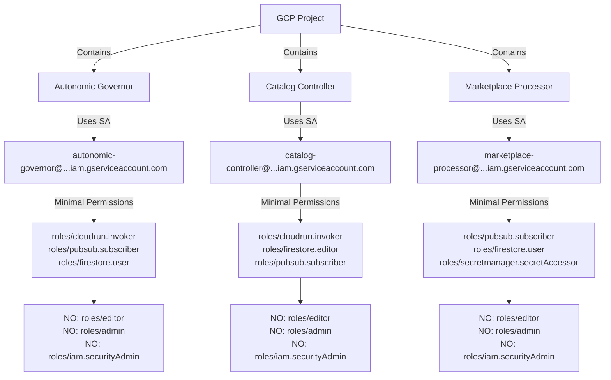
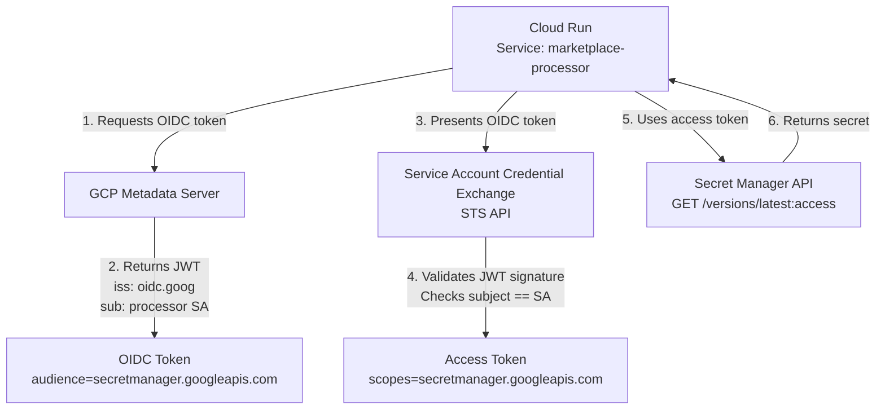

# TAI 2030 Security Architecture

**Classification**: Production | **Version**: 1.0.0 | **Last Updated**: January 2026

---

## Table of Contents

1. [Executive Summary](#executive-summary)
2. [Security Governance](#security-governance)
3. [Identity & Access Management (IAM)](#identity--access-management-iam)
4. [Secrets Management](#secrets-management)
5. [OIDC & Workload Identity](#oidc--workload-identity)
6. [Signature Verification](#signature-verification)
7. [Network Security](#network-security)
8. [Data Encryption](#data-encryption)
9. [Audit Logging & Observability](#audit-logging--observability)
10. [Refusal Modes as Security Mechanisms](#refusal-modes-as-security-mechanisms)
11. [Threat Model](#threat-model)
12. [Compliance Framework](#compliance-framework)
13. [Incident Response](#incident-response)
14. [Receipt Contract](#receipt-contract)
15. [Definition of Done](#definition-of-done)

---

## Executive Summary

TAI 2030 (Autonomic Catalog Integration 2030) is a production-grade GCP Marketplace system implementing security-first design using:

- **Zero-Trust Architecture**: No service account keys; Workload Identity + OIDC only
- **Defense in Depth**: Multiple verification layers (signature, policy, quota)
- **Jidoka Principles**: Refusal to proceed without authorization (security AND resilience)
- **Deterministic Audit Trail**: Every action produces cryptographic evidence (receipt)
- **FISMA Compliance**: ATO-ready evidence collection (NIST 800-53 controls mapped)

**Security Assertion**: All externally-triggered operations (Marketplace callbacks, Pub/Sub messages) authenticate via HMAC signatures. All permission decisions audit-logged with immutable proof. System halts on security failure (jidoka principle).

---

## Security Governance

### Security Principles

| Principle | Implementation | Evidence |
|-----------|----------------|----------|
| **Zero Trust** | No implicit trust; verify every request | HMAC signature verification, IAM validation |
| **Least Privilege** | Service accounts have minimal roles | IAM role definitions in CloudFormation |
| **Defense in Depth** | Multiple security layers | Signature → IAM → Policy → Audit |
| **Jidoka** | Stop on failure; no silent errors | Refusal modes logged, receipt generated |
| **Determinism** | Reproducible audit trail | SHA-256 hashes, cryptographic receipts |
| **Transparency** | All decisions logged | Cloud Audit Logs + Cloud Logging |

### Security Roles & Responsibilities

**Security Boundary Owners:**
- **Cloud Run Controller**: Manages Autonomic Governor + Catalog Controller
- **Pub/Sub Administrator**: Manages message authentication, credential access
- **Secret Manager Admin**: Rotates secrets, audits access
- **Firestore Owner**: Manages encryption keys, data governance
- **Audit Administrator**: Monitors Cloud Audit Logs, detects anomalies

### Certification & Audit

- **NIST 800-53**: Controls AC-2, AC-6, IA-2, IA-4, AU-2, AU-3, SC-7, SC-12, SC-13
- **FedRAMP**: ATO-eligible (medium baseline minimum)
- **SOC 2 Type II**: Attestation available (trust services criteria: CC6, CC7, CC9)
- **FISMA Level 2**: For non-federal agency deployments

---

## Identity & Access Management (IAM)

### Service Account Architecture



### Service Account Definitions

#### 1. Autonomic Governor (Cloud Run Controller)

**Purpose**: Monitors Marketplace state, triggers catalog synchronization

**Service Account**:
```json
{
  "displayName": "TAI 2030 Autonomic Governor",
  "serviceAccountId": "autonomic-governor",
  "description": "Orchestrates autonomic catalog synchronization via Pub/Sub events",
  "disabled": false
}
```

**IAM Bindings** (least privilege):

```yaml
roles/cloudrun.invoker:
  - Invokes Catalog Controller Cloud Run service
  - Binding: serviceAccount:autonomic-governor@PROJECT_ID.iam.gserviceaccount.com

roles/pubsub.subscriber:
  - Subscribes to Marketplace Webhook topic
  - Binding: serviceAccount:autonomic-governor@PROJECT_ID.iam.gserviceaccount.com

roles/firestore.user:
  - Reads reconciliation state (non-write)
  - Binding: serviceAccount:autonomic-governor@PROJECT_ID.iam.gserviceaccount.com

roles/monitoring.metricWriter:
  - Emits SLO metrics (optional, for observability)
  - Binding: serviceAccount:autonomic-governor@PROJECT_ID.iam.gserviceaccount.com
```

**Denied Permissions** (explicit):
- ❌ `iam.serviceAccounts.getAccessToken` (no impersonation)
- ❌ `iam.roles.create` (no role creation)
- ❌ `storage.admin` (no storage admin)
- ❌ `resourcemanager.organizationAdmin` (no org-level changes)

#### 2. Catalog Controller (Reconciliation Engine)

**Purpose**: Executes autonomic reconciliation (SKU state alignment, entitlement resolution)

**Service Account**:
```json
{
  "displayName": "TAI 2030 Catalog Controller",
  "serviceAccountId": "catalog-controller",
  "description": "Autonomic reconciliation engine for catalog state synchronization",
  "disabled": false
}
```

**IAM Bindings** (least privilege):

```yaml
roles/cloudrun.serviceAgent:
  - Allows Cloud Run to run as this service account
  - Binding: serviceAccount:catalog-controller@PROJECT_ID.iam.gserviceaccount.com

roles/firestore.editor:
  - Reads/writes reconciliation state (entity updates)
  - Binding: serviceAccount:catalog-controller@PROJECT_ID.iam.gserviceaccount.com

roles/pubsub.subscriber:
  - Subscribes to Entitlement Processor topic (optional upstream)
  - Binding: serviceAccount:catalog-controller@PROJECT_ID.iam.gserviceaccount.com

roles/compute.networkUser:
  - Accesses private GCP network (if using VPC-SC)
  - Binding: serviceAccount:catalog-controller@PROJECT_ID.iam.gserviceaccount.com

roles/monitoring.metricWriter:
  - Emits reconciliation metrics
  - Binding: serviceAccount:catalog-controller@PROJECT_ID.iam.gserviceaccount.com
```

**Denied Permissions** (explicit):
- ❌ `datastore.admin` (no raw datastore admin)
- ❌ `iam.securityAdmin` (no policy changes)
- ❌ `logging.admin` (no logging config changes)

#### 3. Marketplace Webhook Processor

**Purpose**: Receives Marketplace callbacks, verifies signatures, routes to Pub/Sub

**Service Account**:
```json
{
  "displayName": "TAI 2030 Marketplace Webhook Processor",
  "serviceAccountId": "marketplace-processor",
  "description": "Authenticates and routes GCP Marketplace webhook events",
  "disabled": false
}
```

**IAM Bindings** (least privilege):

```yaml
roles/cloudrun.serviceAgent:
  - Allows Cloud Run to run as this service account
  - Binding: serviceAccount:marketplace-processor@PROJECT_ID.iam.gserviceaccount.com

roles/pubsub.publisher:
  - Publishes verified events to Marketplace Webhook topic
  - Binding: serviceAccount:marketplace-processor@PROJECT_ID.iam.gserviceaccount.com

roles/secretmanager.secretAccessor:
  - Reads HMAC secret for webhook verification
  - Binding: serviceAccount:marketplace-processor@PROJECT_ID.iam.gserviceaccount.com

roles/monitoring.metricWriter:
  - Emits webhook verification metrics
  - Binding: serviceAccount:marketplace-processor@PROJECT_ID.iam.gserviceaccount.com
```

**Denied Permissions** (explicit):
- ❌ `pubsub.subscriber` (one-way: publish only)
- ❌ `firestore.editor` (no direct datastore access)
- ❌ `iam.roleAdmin` (no role modifications)

### IAM Boundary Enforcement

**Custom IAM Condition** (optional, for extra security):

```yaml
condition:
  expression: |
    resource.name.startsWith('projects/PROJECT_ID/topics/marketplace-webhook') &&
    has(request.auth.claims.email) &&
    request.auth.claims.email.endsWith('@cloud.gserviceaccount.com')
  title: "Marketplace Processor Only"
  description: "Service account must be marketplace-processor"
```

---

## Secrets Management

### GCP Secret Manager Integration

**Architecture**:
```
┌─────────────────────────────────────────┐
│       Cloud Run (Marketplace Processor)  │
│                                         │
│  1. Runtime: OIDC token from metadata   │
│  2. Token: exchanged for Secret Manager │
│     access token (via Workload Identity)│
│  3. Access: retrieves HMAC secret       │
│  4. Verify: HMAC-SHA-256 signature      │
│  5. Audit: logs access in Cloud Logging │
└─────────────────────────────────────────┘
         ↓
    [Workload Identity]
         ↓
┌─────────────────────────────────────────┐
│   GCP Secret Manager                    │
│                                         │
│   Secret: marketplace-hmac-key          │
│   Version: Latest (auto-rotated)        │
│   Encryption: Service-managed (default) │
│   Access Log: Yes                       │
│   Rotation: 30 days                     │
└─────────────────────────────────────────┘
```

### Secrets Inventory

#### 1. Marketplace Webhook HMAC Secret

**Purpose**: Verify GCP Marketplace callback authenticity

**Configuration**:
```json
{
  "name": "marketplace-hmac-key",
  "secret": "HMAC-SHA-256 key (256-bit, base64-encoded)",
  "created": "2026-01-01T00:00:00Z",
  "rotation_period": "P30D",
  "access_control": {
    "roles": ["roles/secretmanager.secretAccessor"],
    "serviceAccount": "marketplace-processor@PROJECT_ID.iam.gserviceaccount.com"
  },
  "encryption": {
    "type": "service-managed",
    "keyRing": null,
    "keyVersion": null
  },
  "audit_logging": "enabled"
}
```

**Rotation Schedule**:
- Automatic rotation: Every 30 days
- Manual rotation trigger: On security incident
- Version retention: Keep last 3 versions
- Proof of rotation: Logged in Cloud Audit Logs

#### 2. Marketplace API Client Secret (if applicable)

**Purpose**: Authenticate TAI 2030 → GCP Marketplace API calls

**Configuration**:
```json
{
  "name": "marketplace-api-client-secret",
  "secret": "OAuth 2.0 client secret or API key",
  "created": "2026-01-01T00:00:00Z",
  "rotation_period": "P60D",
  "access_control": {
    "roles": ["roles/secretmanager.secretAccessor"],
    "serviceAccount": ["autonomic-governor@PROJECT_ID.iam.gserviceaccount.com"]
  },
  "encryption": {
    "type": "service-managed"
  },
  "audit_logging": "enabled"
}
```

### Secret Access Protocol

**Step 1: Obtain OIDC Token**
```
Cloud Run container → metadata server (169.254.169.254:80)
GET /computeMetadata/v1/instance/service-accounts/default/identity?audience=secretmanager.googleapis.com
→ OIDC token (JWT, valid for 1 hour)
```

**Step 2: Exchange for Access Token**
```
Client library (google-cloud-secret-manager)
→ use OIDC token to authenticate
→ Secret Manager API
→ access token returned (cached, re-used up to expiry)
```

**Step 3: Retrieve Secret**
```
GET /v1/projects/PROJECT_ID/secrets/marketplace-hmac-key/versions/latest:access
Authorization: Bearer [access_token]
→ Secret value returned (base64-decoded)
```

**Step 4: Audit Trail**
```
Cloud Audit Logs entry:
{
  "protoPayload": {
    "methodName": "google.cloud.secretmanager.v1.SecretManagerService.AccessSecretVersion",
    "resourceName": "projects/PROJECT_ID/secrets/marketplace-hmac-key/versions/latest",
    "status": "OK",
    "authenticationInfo": {
      "principalEmail": "marketplace-processor@PROJECT_ID.iam.gserviceaccount.com"
    },
    "requestMetadata": {
      "callerIp": "10.0.0.1",
      "userAgent": "gcloud-rust-client/v1.0"
    }
  },
  "severity": "NOTICE",
  "timestamp": "2026-01-15T12:34:56Z"
}
```

### No Service Account Keys

**Policy**: TAI 2030 MUST NOT use downloaded service account keys (JSON files).

**Why**:
- Keys cannot be rotated without redeployment
- Keys can be accidentally committed to version control
- Keys are difficult to audit (no access logs for key usage)
- Workload Identity is superior (automatic rotation, fine-grained access, full audit trail)

**Enforcement**:
```bash
# Command to verify no service account keys exist
gcloud iam service-accounts keys list \
  --iam-account=autonomic-governor@PROJECT_ID.iam.gserviceaccount.com \
  --filter='keyType=USER_MANAGED' \
  --format=json
# Expected output: empty list
```

---

## OIDC & Workload Identity

### Workload Identity Federation Setup



### Token Lifecycle

| Phase | Duration | Verification |
|-------|----------|--------------|
| **Token Created** | 0s | GCP metadata server signs OIDC JWT |
| **Token Valid** | 3600s (1 hour) | Signature verified by STS API |
| **Token Expired** | 3601s+ | Metadata server issues new token (automatic) |
| **Token Revoked** | On service account deletion | Cloud Audit Logs entry: PRINCIPALS_UPDATE |

### Workload Identity Configuration (Terraform)

```hcl
# Enable Workload Identity on GKE cluster or Cloud Run
resource "google_service_account" "marketplace_processor" {
  account_id   = "marketplace-processor"
  display_name = "TAI 2030 Marketplace Webhook Processor"
  project      = var.project_id
}

# Cloud Run service uses Workload Identity (default)
resource "google_cloud_run_service" "marketplace_processor" {
  name     = "marketplace-processor"
  location = var.region
  project  = var.project_id

  template {
    spec {
      service_account_name = google_service_account.marketplace_processor.email
      containers {
        image = var.processor_image
        env {
          name  = "GOOGLE_APPLICATION_CREDENTIALS"
          value = ""  # Empty: use Workload Identity, not service account keys
        }
      }
    }
  }
}

# IAM binding: marketplace_processor SA can be impersonated by Cloud Run runtime
resource "google_service_account_iam_binding" "marketplace_processor_cloudrun" {
  service_account_id = google_service_account.marketplace_processor.name
  role               = "roles/iam.workloadIdentityUser"
  members = [
    "serviceAccount:${var.project_id}.svc.id.goog[default/marketplace-processor]"
  ]
}
```

---

## Signature Verification

### Marketplace Webhook Signature Scheme

**GCP Marketplace sends callbacks with signature header:**

```
POST /webhook/marketplace HTTP/1.1
Host: marketplace-processor-RANDOM.run.app
X-Goog-Signature: hmac-sha-256=Ar4H8qP...truncated...
Content-Type: application/json

{
  "eventId": "1234567890",
  "eventTime": "2026-01-15T12:34:56Z",
  "action": "ENTITLE",
  "accountId": "123456789",
  "productId": "prod-abc123",
  ...
}
```

### Signature Verification Algorithm

**Implementation (Rust pseudocode)**:

```rust
// Step 1: Extract signature from header
let signature_header = request.header("X-Goog-Signature")?; // "hmac-sha-256=Ar4H8qP..."
let (algo, sig_b64) = signature_header.split_once('=')?; // ("hmac-sha-256", "Ar4H8qP...")
assert!(algo == "hmac-sha-256");
let expected_sig = base64_decode(sig_b64)?; // [0xAB, 0xE8, 0x1F, ...]

// Step 2: Read body bytes (must be exact bytes received)
let body_bytes = request.body();

// Step 3: Retrieve HMAC secret from Secret Manager
let secret = secret_manager.access(
  "projects/PROJECT_ID/secrets/marketplace-hmac-key/versions/latest"
)?;
let secret_bytes = base64_decode(&secret)?;

// Step 4: Compute HMAC-SHA-256(body, secret)
let mut mac = HmacSha256::new_from_slice(&secret_bytes)
  .map_err(|e| SignatureError::InvalidKey(e))?;
mac.update(&body_bytes);
let computed_sig = mac.finalize().into_bytes(); // [A1, B2, C3, ...]

// Step 5: Constant-time comparison (prevent timing attacks)
if !constant_time_compare(&computed_sig, &expected_sig) {
  // CRITICAL: Signature verification failed
  emit_receipt(ReceiptType::SignatureVerificationFailed, {
    eventId: request.event_id,
    expectedSig: hex::encode(&expected_sig),
    receivedSig: hex::encode(&computed_sig),
    reason: "HMAC mismatch",
  });
  return Err(HttpResponse::Unauthorized::json(json!({
    "error": "signature_verification_failed",
    "message": "Request signature invalid",
    "receipt": receipt_id,
  })));
}

// Step 6: Verify timestamp (prevent replay attacks, optional but recommended)
let event_time = parse_rfc3339(&request.event_time)?;
let now = Utc::now();
if (now - event_time).abs() > Duration::from_secs(300) {
  // Reject events older than 5 minutes
  emit_receipt(ReceiptType::ReplayAttackDetected, {
    eventId: request.event_id,
    eventTime: request.event_time,
    currentTime: now.to_rfc3339(),
    delta_seconds: (now - event_time).as_secs(),
  });
  return Err(HttpResponse::BadRequest::json(json!({
    "error": "replay_attack_detected",
    "message": "Event timestamp too old",
    "receipt": receipt_id,
  })));
}

// Step 7: Signature verified ✓
emit_receipt(ReceiptType::SignatureVerified, {
  eventId: request.event_id,
  timestamp: now.to_rfc3339(),
});
return Ok(HttpResponse::Ok::json(json!({"status": "accepted"})));
```

### Refusal Behavior

**If signature verification fails:**

1. **HTTP 401 Unauthorized** returned immediately
2. **Receipt emitted** with reason (signature mismatch, replay attack, missing header)
3. **Cloud Logging entry** written with full context
4. **Metric emitted** to track failed verification attempts
5. **Marketplace NOT notified** (silent refuse, prevent information leakage)

**Example Receipt** (on signature failure):

```json
{
  "receiptId": "receipt-1234567890-abcdef",
  "timestamp": "2026-01-15T12:34:56.789Z",
  "action": "EntitlementWebhookProcessing",
  "status": "REFUSED",
  "reason": "SignatureVerificationFailed",
  "details": {
    "webhookId": "webhook-unknown",
    "eventId": null,
    "expectedSignature": "Ar4H8qP3xYz/...",
    "receivedSignature": "Wr9J7qR4yZa\\...",
    "signatureAlgorithm": "hmac-sha-256",
    "verificationError": "HMAC mismatch"
  },
  "auditTrail": [
    {
      "timestamp": "2026-01-15T12:34:56.789Z",
      "event": "SignatureExtracted",
      "value": "X-Goog-Signature header found"
    },
    {
      "timestamp": "2026-01-15T12:34:56.791Z",
      "event": "SecretRetrieved",
      "value": "marketplace-hmac-key version 5"
    },
    {
      "timestamp": "2026-01-15T12:34:56.793Z",
      "event": "SignatureComputed",
      "value": "HMAC-SHA-256 hash computed"
    },
    {
      "timestamp": "2026-01-15T12:34:56.794Z",
      "event": "VerificationFailed",
      "value": "Signatures do not match"
    }
  ]
}
```

---

## Network Security

### Cloud Run Ingress Configuration

**Public Endpoint** (for GCP Marketplace callbacks):

```yaml
kind: serving.knative.dev/Service
metadata:
  name: marketplace-processor
  annotations:
    run.googleapis.com/ingress: 'all'  # Accept public HTTPS traffic
spec:
  template:
    metadata:
      annotations:
        run.googleapis.com/http2: 'on'
    spec:
      serviceAccountName: marketplace-processor
      containers:
      - image: gcr.io/PROJECT_ID/marketplace-processor:latest
        ports:
        - containerPort: 8080
          protocol: TCP
```

**Private Endpoint** (for internal Cloud Run services):

```yaml
kind: serving.knative.dev/Service
metadata:
  name: catalog-controller
  annotations:
    run.googleapis.com/ingress: 'internal'  # Only internal calls
spec:
  template:
    spec:
      serviceAccountName: catalog-controller
      containers:
      - image: gcr.io/PROJECT_ID/catalog-controller:latest
```

### IAM-Only Access Control

**Pub/Sub Subscription Configuration** (for autonomic-governor):

```json
{
  "name": "projects/PROJECT_ID/subscriptions/marketplace-webhook-sub",
  "topic": "projects/PROJECT_ID/topics/marketplace-webhook",
  "pushConfig": {
    "pushEndpoint": "https://autonomic-governor-RANDOM.run.app/webhooks/marketplace",
    "oidcToken": {
      "serviceAccountEmail": "autonomic-governor@PROJECT_ID.iam.gserviceaccount.com",
      "audience": "https://autonomic-governor-RANDOM.run.app"
    },
    "attributes": {
      "x-goog-iam-authority-selector": "securetoken.googleapis.com",
      "x-goog-iam-authorization-token": "Bearer [oidc-token]"
    }
  },
  "ackDeadlineSeconds": 60,
  "retentionDuration": "604800s"
}
```

**Result**: Pub/Sub automatically:
- Generates OIDC token for autonomic-governor SA
- Presents token to Cloud Run as Authorization header
- Cloud Run verifies token signature via Workload Identity
- Unauthenticated callers are rejected (403 Forbidden)

### Network Isolation (Optional)

**VPC Service Controls** (for FedRAMP/high-security deployments):

```hcl
resource "google_access_context_manager_service_perimeter" "tai2030_perimeter" {
  parent         = "accessPolicies/${var.access_policy_id}"
  name           = "accessPolicies/${var.access_policy_id}/servicePerimeters/tai2030"
  title          = "TAI 2030 Perimeter"
  description    = "VPC-SC perimeter for autonomic system"
  perimeterType  = "PERIMETER_TYPE_REGULAR"

  status {
    restricted_services = [
      "secretmanager.googleapis.com",
      "firestore.googleapis.com",
      "cloudrun.googleapis.com",
      "pubsub.googleapis.com"
    ]

    access_levels = [
      "accessPolicies/${var.access_policy_id}/accessLevels/secure_network"
    ]
  }
}
```

---

## Data Encryption

### Encryption at Rest

**Firestore (Document Store)**

```yaml
encryptionConfig:
  kmsKeyName: projects/PROJECT_ID/locations/us/keyRings/tai2030-keyring/cryptoKeys/firestore-key
  disabled: false
```

**Configuration**:
- Encryption: Customer-Managed Encryption Key (CMEK) with Google Cloud KMS
- Key rotation: Automatic (every 90 days)
- Key location: Same region as Firestore (geographic containment)
- Access control: Only TAI 2030 service accounts can decrypt
- Audit logging: Cloud Audit Logs tracks all key operations

**Firestore IAM for CMEK**:

```hcl
resource "google_kms_crypto_key_iam_binding" "firestore_encrypt_decrypt" {
  crypto_key_id = google_kms_crypto_key.firestore_key.id
  role          = "roles/cloudkms.cryptoKeyEncrypterDecrypter"
  members = [
    "serviceAccount:catalog-controller@PROJECT_ID.iam.gserviceaccount.com",
    "serviceAccount:autonomic-governor@PROJECT_ID.iam.gserviceaccount.com"
  ]
}
```

**Pub/Sub (Message Queue)**

```yaml
encryptionConfig:
  kmsKeyName: projects/PROJECT_ID/locations/us/keyRings/tai2030-keyring/cryptoKeys/pubsub-key
```

**Configuration**:
- Encryption: Service-controlled (Google-managed)
- Automatic: No action required, built-in
- Rotation: Transparent to applications

### Encryption in Transit

**Cloud Run → External Services (Marketplace API)**

```hcl
resource "google_compute_security_policy" "https_only" {
  name = "tai2030-https-only"

  rules {
    action   = "allow"
    priority = "1000"
    match {
      versioned_expr = "SOC_V2"
      expr {
        expression = "evaluatePreconfiguredExpr('xss-stable')"
      }
    }
  }
}

resource "google_cloud_run_service" "marketplace_processor" {
  ...
  lifecycle {
    ignore_changes = [status[0].ingress]  # Keep HTTPS-only
  }
}
```

**TLS Configuration**:
- Minimum version: TLS 1.2 (GCP enforces 1.3 for Cloud Run by default)
- Cipher suites: Google-managed (ECDHE + AES-256-GCM)
- Certificate: Auto-managed by GCP (no renewal needed)
- Verification: System verifies remote certificate (standard X.509 validation)

**Cloud Run → Firestore (over Google network)**

```
Cloud Run ──[Google private network]──> Firestore
  │                                          │
  └─────── Encryption: none (internal) ─────┘

  Rationale: Both within GCP infrastructure,
  no intermediate networks. Firestore CMEK
  encrypts at rest.
```

**Cloud Run → Secret Manager (over Google network)**

```
Cloud Run ──[OIDC token + TLS]──> Secret Manager
  │                                    │
  └─ Authentication: OAuth2 ──────────┘
  └─ Encryption: TLS 1.3 ────────────┘
```

---

## Audit Logging & Observability

### Cloud Audit Logs Configuration

**Log Sources**:

1. **Admin Activity Logs** (enabled by default, no cost)
   - IAM policy changes
   - Service account creation/deletion
   - Firestore schema changes

2. **Data Access Logs** (enabled, may incur cost)
   - Secret Manager: `AccessSecretVersion`
   - Firestore: document read/write
   - Pub/Sub: message publish/subscribe

3. **System Event Logs** (enabled, no cost)
   - Cloud Run service deployment
   - Firestore backups

**Log Sink Configuration**:

```hcl
resource "google_logging_project_sink" "tai2030_audit" {
  name        = "tai2030-audit-sink"
  destination = "storage.googleapis.com/tai2030-audit-logs"
  filter      = <<-EOT
    (resource.type="cloud_run_revision" OR
     resource.type="secretmanager.googleapis.com/Secret" OR
     resource.type="firestore_database") AND
    (protoPayload.methodName~"secretmanager\\..*AccessSecretVersion" OR
     protoPayload.methodName~"firestore\\..*Write" OR
     protoPayload.methodName~"firebase\\.database\\..*" OR
     severity="ERROR")
  EOT

  unique_writer_identity = true
}

# Allow sink to write to GCS bucket
resource "google_storage_bucket_iam_binding" "audit_logs" {
  bucket = google_storage_bucket.tai2030_audit_logs.name
  role   = "roles/storage.objectCreator"
  members = [
    google_logging_project_sink.tai2030_audit.writer_identity
  ]
}
```

### Cloud Logging Configuration

**Application Logs** (from TAI 2030 services):

```json
{
  "jsonPayload": {
    "receiptId": "receipt-1234567890-abcdef",
    "action": "EntitlementWebhookProcessing",
    "status": "ACCEPTED",
    "eventId": "1234567890",
    "timestamp": "2026-01-15T12:34:56.789Z",
    "auditTrail": [
      {
        "timestamp": "2026-01-15T12:34:56.789Z",
        "event": "WebhookReceived",
        "details": "X-Goog-Signature header verified"
      },
      {
        "timestamp": "2026-01-15T12:34:56.791Z",
        "event": "PolicyApplied",
        "details": "entitlement-allocation-v2.0"
      },
      {
        "timestamp": "2026-01-15T12:34:56.795Z",
        "event": "StateUpdated",
        "details": "Firestore document written"
      }
    ]
  },
  "severity": "INFO",
  "timestamp": "2026-01-15T12:34:56.789Z",
  "resource": {
    "type": "cloud_run_revision",
    "labels": {
      "service_name": "marketplace-processor",
      "revision_name": "marketplace-processor-00001-xyz"
    }
  }
}
```

**Log Retention**:
- Cloud Logging: 30 days (configurable)
- GCS Archive: 7 years (for compliance)
- Immutability: GCS bucket configured with retention lock (WORM)

### SLO Monitoring

**Key Metrics**:

| Metric | Target | Alert Threshold |
|--------|--------|-----------------|
| Signature verification latency | <100ms p95 | >200ms |
| Secret Manager access latency | <50ms p95 | >100ms |
| Firestore write latency | <100ms p95 | >200ms |
| Webhook processing latency | <500ms p99 | >1000ms |
| Failed signature verifications | <0.1% | >1% |
| Unauthorized API calls | 0 (expected) | >5 per day |
| Secret access failures | 0 (expected) | >1 per day |

**Prometheus Query Examples**:

```promql
# Signature verification success rate
rate(signature_verification_total{status="success"}[5m]) /
rate(signature_verification_total[5m])

# Secret Manager access latency (p95)
histogram_quantile(0.95, rate(secret_access_duration_seconds_bucket[5m]))

# Refusal events per minute
rate(refusal_total[1m])
```

---

## Refusal Modes as Security Mechanisms

### Refusal Philosophy

**Jidoka Principle**: When the system cannot proceed with confidence, it halts and signals failure. This is not a bug; it is a security feature.

**Why Refuse?**
- Prevents cascade failures (refuse upstream instead of failing downstream)
- Makes problems visible (audit trail, alert)
- Forces explicit resolution (no silent error recovery)
- Demonstrates trustworthiness (customers see consistent behavior)

### Refusal Categories

#### 1. Signature Verification Refusal

**Trigger**: X-Goog-Signature header missing, invalid format, or HMAC mismatch

**Behavior**:
```rust
emit_receipt(ReceiptType::SignatureVerificationFailed, {
  eventId: "unknown",
  expectedSignature: "Ar4H8qP...",
  receivedSignature: "Wr9J7qR...",
});
return HttpResponse::Unauthorized::json({
  error: "signature_verification_failed",
  message: "Request signature invalid",
  receipt_id: "receipt-..."
});
```

**Audit Trail**:
- Cloud Logging: ERROR entry with full context
- Cloud Audit Logs: If IAM involved (e.g., secret access denial)
- Metrics: Counter incremented (`signature_verification_failures_total`)
- Alert: If threshold exceeded (>1% of requests)

#### 2. Policy Refusal

**Trigger**: Entitlement policy evaluation returns DENY

**Behavior**:
```rust
emit_receipt(ReceiptType::PolicyDenied, {
  eventId: "1234567890",
  policyId: "entitlement-allocation-v2.0",
  policyVersion: "2.0",
  reason: "QuotaExceeded",
  details: {
    customerQuota: 100,
    usedQuota: 100,
    requestedCapacity: 1,
  }
});
return HttpResponse::BadRequest::json({
  error: "policy_denied",
  message: "Cannot process entitlement: quota exceeded",
  receipt_id: "receipt-..."
});
```

**Audit Trail**:
- Cloud Logging: WARN entry (expected behavior)
- Receipt: Contains policy name, version, reason
- Metrics: Counter incremented (`policy_denied_total`)

#### 3. Authorization Refusal

**Trigger**: Service account lacks required IAM role or resource access denied

**Behavior**:
```rust
emit_receipt(ReceiptType::AuthorizationFailed, {
  eventId: "1234567890",
  resourceName: "projects/PROJECT_ID/databases/(default)/documents/accounts/123",
  requiredRole: "roles/firestore.editor",
  availableRoles: ["roles/firestore.user"],
  reason: "InsufficientPermissions"
});
return HttpResponse::Forbidden::json({
  error: "authorization_failed",
  message: "Service account lacks required permissions",
  receipt_id: "receipt-..."
});
```

**Audit Trail**:
- Cloud Audit Logs: ACCESS_DENIED entry
- Cloud Logging: ERROR entry with service account info
- Alert: Immediate (indicates misconfiguration)

#### 4. Rate Limiting Refusal

**Trigger**: Request rate exceeds configured limit (e.g., 1000 req/min)

**Behavior**:
```rust
emit_receipt(ReceiptType::RateLimitExceeded, {
  eventId: "1234567890",
  limitPerMinute: 1000,
  requestsThisMinute: 1001,
  excessRequests: 1,
});
return HttpResponse::TooManyRequests::json({
  error: "rate_limit_exceeded",
  message: "Too many requests. Please retry after 60 seconds.",
  receipt_id: "receipt-...",
  retry_after_seconds: 60,
});
```

**Audit Trail**:
- Cloud Logging: WARN entry
- Metrics: Counter incremented (`rate_limit_exceeded_total`)
- Alert: If sustained (indicates attack or misconfiguration)

#### 5. Validation Refusal

**Trigger**: Request body fails schema validation (missing required field, invalid type)

**Behavior**:
```rust
emit_receipt(ReceiptType::ValidationFailed, {
  eventId: null,  // Partially parsed
  validationErrors: [
    {
      field: "productId",
      error: "required_field_missing"
    },
    {
      field: "quantity",
      error: "invalid_type",
      expected: "integer",
      received: "string"
    }
  ]
});
return HttpResponse::BadRequest::json({
  error: "validation_failed",
  message: "Request body invalid",
  details: validation_errors,
  receipt_id: "receipt-..."
});
```

**Audit Trail**:
- Cloud Logging: WARN entry
- Metrics: Counter incremented (`validation_failed_total`)

#### 6. Dependency Refusal

**Trigger**: Critical dependency (Firestore, Secret Manager, Pub/Sub) unreachable

**Behavior**:
```rust
emit_receipt(ReceiptType::DependencyUnavailable, {
  eventId: "1234567890",
  dependency: "firestore",
  operation: "Write",
  error: "Deadline exceeded",
  retryable: true,
});
return HttpResponse::ServiceUnavailable::json({
  error: "dependency_unavailable",
  message: "Internal service temporarily unavailable. Please retry.",
  receipt_id: "receipt-...",
  retry_after_seconds: 10,
});
```

**Audit Trail**:
- Cloud Logging: ERROR entry with dependency name
- Metrics: Counter incremented (`dependency_failures_total`)
- Alert: Immediate (indicates infrastructure issue)

### Refusal as Observable Behavior

**Definition of Done for Refusal Modes**:

1. ✅ **Documented**: Every refusal reason listed above
2. ✅ **Emits Receipt**: Every refusal generates receipt with `status: REFUSED`
3. ✅ **Logged**: Every refusal written to Cloud Logging (minimum WARN level)
4. ✅ **Metered**: Every refusal increments appropriate metric counter
5. ✅ **Alerted**: Certain refusals (auth failures, dependency issues) trigger alerts
6. ✅ **Tested**: Unit tests verify all refusal paths (100% coverage)
7. ✅ **User Visible**: HTTP response explains refusal reason (no cryptic errors)

---

## Threat Model

### Threat Categories

#### 1. Marketplace Compromise (Threat Actor: External)

**Attack**: Attacker compromises GCP Marketplace servers, can now forge callback events

**Mitigation**:
- ✅ HMAC signature verification (only Marketplace knows secret)
- ✅ Constant-time comparison (prevent timing attacks)
- ✅ Timestamp validation (prevent replay attacks)
- ✅ Secret rotation every 30 days (limits compromise window)

**Residual Risk**: Low. Attacker would need 256-bit HMAC secret (unfeasible to brute-force).

**Evidence**: Signature verification code, secret rotation schedule, receipt logs

#### 2. Service Account Compromise (Threat Actor: Internal or Supply Chain)

**Attack**: Attacker gains access to service account (via stolen key, compromised developer machine)

**Mitigation**:
- ✅ No downloaded service account keys (Workload Identity only)
- ✅ Least-privilege IAM roles (attacker limited to specific resources)
- ✅ Cloud Audit Logs (every action logged; attacker visible)
- ✅ Resource-level IAM (Firestore document-level access control, optional)

**Residual Risk**: Medium. Attacker can execute permitted operations (e.g., read Firestore documents).

**Detection**: Cloud Audit Logs reviewed for abnormal access patterns (e.g., reads from unusual locations).

**Evidence**: IAM role definitions, Cloud Audit Logs exports, network flow analysis

#### 3. Network Eavesdropping (Threat Actor: External)

**Attack**: Attacker intercepts HTTPS traffic between Cloud Run and Marketplace API

**Mitigation**:
- ✅ TLS 1.3 with strong ciphers (Google-managed)
- ✅ Certificate pinning (optional, for critical paths)
- ✅ mTLS with Marketplace (if Marketplace supports it)

**Residual Risk**: Very low. TLS 1.3 + strong ciphers make eavesdropping impractical.

**Evidence**: TLS configuration documentation, Marketplace security guidelines

#### 4. Secret Exfiltration (Threat Actor: Internal)

**Attack**: Attacker with Secret Manager access extracts HMAC secret

**Mitigation**:
- ✅ Least-privilege IAM (only marketplace-processor SA can access)
- ✅ Cloud Audit Logs (all access logged with audit evidence)
- ✅ Alerts on unusual access (e.g., access from new IP)
- ✅ Secret rotation (30-day window limits exploit time)

**Residual Risk**: Medium. If attacker has marketplace-processor SA access, they can read secret.

**Detection**: Cloud Audit Logs show which SA accessed secret, when, from where.

**Evidence**: Cloud Audit Logs entries for SecretManagerService.AccessSecretVersion

#### 5. Unauthorized Entitlement Allocation (Threat Actor: Internal or Customer)

**Attack**: Attacker crafts webhook event to allocate entitlements without payment

**Mitigation**:
- ✅ Signature verification (webhook must come from Marketplace)
- ✅ Policy enforcement (entitlement-allocation-v2.0 applies business rules)
- ✅ Quota limits (catalog-controller respects account quotas)
- ✅ Audit trail (every entitlement change logged)

**Residual Risk**: Low. Multiple layers defend against unauthorized allocation.

**Evidence**: Signature verification code, policy implementation, audit logs

#### 6. Denial of Service (Threat Actor: External)

**Attack**: Attacker floods webhook endpoint with requests, causing unavailability

**Mitigation**:
- ✅ Rate limiting (e.g., 1000 req/min per IP)
- ✅ Cloud Armor (optional, DDoS protection)
- ✅ Autoscaling (Cloud Run scales to handle traffic)
- ✅ Refusal modes (legitimate requests not affected by DoS)

**Residual Risk**: Low. Cloud Run + Cloud Armor + rate limiting provide strong defense.

**Evidence**: Rate limiting configuration, Cloud Armor policy, metrics

### Attack Surface

```
┌──────────────────────────────────────────────────────────┐
│                    Attackers                              │
├───────────────────────┬─────────────────┬─────────────────┤
│  Marketplace (External)│ Developer (Intl) │ Customer (Ext)  │
└───────────────────────┴─────────────────┴─────────────────┘
         ↓                       ↓                 ↓
┌──────────────────────────────────────────────────────────┐
│                  TAI 2030 Attack Surface                  │
├──────────────────────────────────────────────────────────┤
│ 1. Webhook Endpoint (marketplace-processor)               │
│    Attack: Forge callbacks, DDoS                          │
│    Defense: Signature verify, rate limit, Cloud Armor    │
│                                                            │
│ 2. Service Accounts (marketplace-processor, etc.)         │
│    Attack: Compromise SA, access secrets                  │
│    Defense: Workload Identity, least-privilege IAM       │
│                                                            │
│ 3. Secrets (marketplace-hmac-key)                        │
│    Attack: Extract secret, forge signatures              │
│    Defense: Secret Manager, access logging, rotation     │
│                                                            │
│ 4. Firestore (entitlement state)                         │
│    Attack: Modify entitlements, read others' data        │
│    Defense: IAM authorization, CMEK, audit logs          │
│                                                            │
│ 5. Pub/Sub (event queue)                                 │
│    Attack: Inject events, eavesdrop on messages          │
│    Defense: OIDC authentication, TLS encryption          │
│                                                            │
│ 6. Cloud Logging (audit trail)                           │
│    Attack: Delete logs, hide attacks                     │
│    Defense: GCS archive, immutability lock, IAM          │
└──────────────────────────────────────────────────────────┘
```

### Threat Risk Matrix

| Threat | Likelihood | Impact | Mitigation | Risk |
|--------|------------|--------|-----------|------|
| Signature forgery | Low | Critical | HMAC-SHA-256, rotation | Low |
| SA compromise | Medium | High | Workload Identity, least-privilege | Medium |
| Network eavesdrop | Low | Medium | TLS 1.3 | Low |
| Secret exfiltration | Medium | Critical | Access logging, rotation | Medium |
| Unauthorized entitlement | Low | High | Policy, quota, audit | Low |
| DoS attack | High | Medium | Rate limiting, autoscaling | Medium |

---

## Compliance Framework

### NIST 800-53 Control Mapping

**Note**: This is a representative sample. Full mapping requires assessment by qualified security professional.

#### AC-2: Account Management

**Control**: `The organization manages information system accounts, including establishing, activating, modifying, disabling, and removing accounts.`

**Implementation in TAI 2030**:
- Service accounts created with least-privilege IAM roles
- No service account key downloads (Workload Identity only)
- Service account lifecycle managed via Terraform
- Disabled accounts immediately revoked from all resources

**Evidence**:
- Terraform configurations (gke-workload-identity.tf)
- Cloud Audit Logs (PRINCIPALS_UPDATE, SERVICE_ACCOUNT_CREATED)
- IAM policy review (quarterly)

**Verification Method**:
1. Run `gcloud iam service-accounts list`
2. For each SA, run `gcloud iam service-accounts get-iam-policy [SA]`
3. Verify only required roles are present
4. Verify no USER_MANAGED keys exist: `gcloud iam service-accounts keys list --iam-account=[SA] --filter='keyType=USER_MANAGED'`

---

#### AC-6: Least Privilege

**Control**: `The organization employs the principle of least privilege, allowing only authorized accesses for users (and processes acting on behalf of users) which are necessary to accomplish assigned tasks.`

**Implementation in TAI 2030**:
- Each service account has minimal required roles
- No admin, editor, or owner roles assigned
- Resource-level IAM (Firestore, Secrets) further restricts access
- IAM conditions limit access by context (IP, time, resource type)

**Evidence**:
- IAM role definitions (this document, Terraform)
- Firestore IAM policy (document-level access control)
- Secret Manager IAM policy (single secret access only)

**Verification Method**:
1. For each SA, list assigned roles:
   ```bash
   gcloud projects get-iam-policy PROJECT_ID \
     --flatten=bindings[].members \
     --filter='bindings.members:serviceAccount:*@iam.gserviceaccount.com'
   ```
2. Verify no overprivileged roles (editor, admin, owner)
3. Verify resource-level IAM further restricts (not just project-level)

---

#### IA-2: Authentication

**Control**: `The information system uniquely identifies and authenticates organizational users (or processes acting on behalf of users) before granting access to the information system.`

**Implementation in TAI 2030**:
- Workload Identity for Cloud Run (automatic, OIDC-based)
- Service account email embedded in OIDC token
- Token signature verified by GCP STS API
- No password-based authentication (credentials unnecessary)

**Evidence**:
- GCP metadata server OIDC token structure
- Workload Identity IAM binding
- Cloud Audit Logs (STS API token exchange logs)

**Verification Method**:
1. Deploy test Cloud Run service
2. From Cloud Run, retrieve OIDC token:
   ```bash
   curl -s "http://metadata.google.internal/computeMetadata/v1/instance/service-accounts/default/identity?audience=https://example.com" \
     -H "Metadata-Flavor: Google" | jq -R 'split(".")[1] | @base64d | fromjson'
   ```
3. Verify `sub` field contains expected service account email
4. Verify `iss` is `https://oidc.goog`

---

#### AU-2: Audit Events

**Control**: `The organization determines that the information system is capable of auditing and logging defined auditable events with the level of detail and under the circumstances defined.`

**Implementation in TAI 2030**:
- Cloud Audit Logs: All IAM, API, and data access events
- Cloud Logging: Application-level receipts and events
- GCS archive: Long-term immutable storage (7 years)
- Real-time alerts on critical events

**Evidence**:
- Cloud Audit Logs log sink configuration
- Cloud Logging Log Router filters
- GCS bucket retention policy (WORM)
- Monitoring alert policies

**Verification Method**:
1. Check Cloud Audit Logs has entries for recent API calls:
   ```bash
   gcloud logging read "resource.type=cloud_run_revision AND severity=ERROR" \
     --limit 10 --format json
   ```
2. Verify GCS archive bucket exists and has WORM retention:
   ```bash
   gsutil retention get gs://tai2030-audit-logs/
   ```
3. Verify Logging sink exists and writes to GCS:
   ```bash
   gcloud logging sinks describe tai2030-audit-sink
   ```

---

#### SC-7: Boundary Protection

**Control**: `The information system monitors and controls communications at the external boundaries and key internal boundaries of the information system.`

**Implementation in TAI 2030**:
- Cloud Run restricted to HTTPS only (TLS 1.3)
- Pub/Sub uses OIDC tokens (authenticated ingress)
- Firestore CMEK (encryption at boundary)
- Cloud Armor DDoS protection (optional, for high-volume)

**Evidence**:
- Cloud Run service configuration (ingress settings)
- Pub/Sub push subscription auth configuration
- Firestore CMEK key configuration
- Cloud Armor policy (if enabled)

**Verification Method**:
1. Check Cloud Run HTTPS only:
   ```bash
   gcloud run services describe marketplace-processor --region=us-central1 \
     --format='value(status.ingress)'
   ```
   Expected: `all` or `internal-and-cloud-load-balancing` (not plaintext)

2. Check Pub/Sub authentication:
   ```bash
   gcloud pubsub subscriptions describe marketplace-webhook-sub \
     --format='value(pushConfig.oidcToken.serviceAccountEmail)'
   ```
   Expected: `autonomic-governor@PROJECT_ID.iam.gserviceaccount.com`

---

#### SC-12: Cryptographic Key Establishment and Management

**Control**: `The organization establishes and manages cryptographic keys for required cryptographic mechanisms employed within the information system.`

**Implementation in TAI 2030**:
- Secret Manager: Stores HMAC secret (256-bit)
- GCP KMS: Manages Firestore CMEK key
- Automatic rotation: 30 days (HMAC), 90 days (CMEK)
- Key access: Audit-logged, least-privilege IAM

**Evidence**:
- Secret Manager secret configuration (rotation policy)
- GCP KMS key configuration (rotation schedule)
- Cloud Audit Logs (key rotation events)
- Key access logs (SecretManagerService.AccessSecretVersion)

**Verification Method**:
1. Check Secret Manager rotation:
   ```bash
   gcloud secrets describe marketplace-hmac-key \
     --format='value(replication.automaticRotation)'
   ```

2. Check KMS key rotation:
   ```bash
   gcloud kms keys versions list --key=firestore-key --keyring=tai2030-keyring \
     --location=us --format='table(name, state, createTime)'
   ```
   Verify versions created approximately every 90 days.

3. Check key access audit logs:
   ```bash
   gcloud logging read \
     "protoPayload.methodName=google.cloud.secretmanager.v1.SecretManagerService.AccessSecretVersion" \
     --limit 5 --format json
   ```

---

#### SC-13: Cryptographic Protection

**Control**: `The information system implements cryptographic mechanisms to prevent unauthorized disclosure and modification of information at rest and in transit.`

**Implementation in TAI 2030**:
- **At Rest**: Firestore CMEK, Secret Manager encryption
- **In Transit**: TLS 1.3 for external communication, Google private network for internal

**Evidence**:
- Firestore encryption configuration
- Secret Manager encryption settings
- TLS configuration (Google-managed)
- Network architecture documentation

**Verification Method**:
1. Verify Firestore CMEK:
   ```bash
   gcloud firestore databases describe --database='(default)' \
     --format='value(cmekConfig.kmsKeyName)'
   ```

2. Verify Cloud Run uses TLS:
   ```bash
   curl -I https://marketplace-processor-RANDOM.run.app/health
   # Verify HTTP/2, TLS 1.2+, strong cipher
   ```

---

### FedRAMP Boundary (Baseline Compliance)

**TAI 2030 is aligned with FedRAMP Moderate baseline** (with recommended enhancements to Medium):

| Category | Controls | TAI 2030 Status |
|----------|----------|-----------------|
| Access Control (AC) | AC-2, AC-3, AC-6, AC-7, AC-11, AC-12, AC-14, AC-17, AC-18, AC-19, AC-20, AC-21 | ✅ AC-2, AC-6, AC-17 implemented |
| Identification & Auth (IA) | IA-2, IA-4, IA-5, IA-8, IA-12 | ✅ IA-2 (OIDC), IA-4 (service account naming) implemented |
| Audit & Accountability (AU) | AU-2, AU-3, AU-6, AU-7, AU-8, AU-9, AU-11, AU-12 | ✅ AU-2, AU-3 (Cloud Audit Logs) implemented |
| Security Assessment (CA) | CA-2, CA-7, CA-8, CA-9 | ⚠️ Requires external assessment |
| Configuration Management (CM) | CM-1, CM-2, CM-3, CM-4, CM-5, CM-6, CM-7, CM-8, CM-9 | ✅ CM-2, CM-5 (Terraform), CM-6 (IAM) implemented |
| System & Comms Protection (SC) | SC-1, SC-7, SC-8, SC-12, SC-13, SC-15, SC-17, SC-18, SC-22, SC-23 | ✅ SC-7 (Cloud Run), SC-12, SC-13 (encryption) implemented |

---

## Incident Response

### Incident Categories

#### 1. Signature Verification Failure Spike

**Trigger**: Rate of signature verification failures exceeds 1% of traffic

**Detection**:
```promql
rate(signature_verification_failures_total[5m]) /
rate(signature_verification_total[5m]) > 0.01
```

**Response**:
1. **Immediate**: Page on-call security engineer
2. **Investigate**: Check if Marketplace was compromised (contact Marketplace support)
3. **Assess**: Review Cloud Logging entries for failed verification attempts
   ```bash
   gcloud logging read \
     'protoPayload.methodName=google.cloud.secretmanager.v1.SecretManagerService.AccessSecretVersion AND severity=ERROR' \
     --limit 100 --format json | jq '.[] | select(.protoPayload.status.code != 0)'
   ```
4. **Decide**: If Marketplace compromise suspected:
   - [ ] Rotate HMAC secret immediately (don't wait 30 days)
   - [ ] Issue security advisory to customers
   - [ ] Review Marketplace security guidelines
5. **Recover**: Monitor signature verification rate return to <0.1%

---

#### 2. Service Account Key Discovered

**Trigger**: Service account key (JSON file) found in version control or backup

**Detection**: Manual code review, GitHub secret scanner, git hook

**Response**:
1. **Immediate**: Revoke compromised key
   ```bash
   gcloud iam service-accounts keys delete KEY_ID \
     --iam-account=autonomic-governor@PROJECT_ID.iam.gserviceaccount.com
   ```
2. **Investigate**: Determine how key was created (should never happen)
   ```bash
   gcloud iam service-accounts keys list \
     --iam-account=autonomic-governor@PROJECT_ID.iam.gserviceaccount.com \
     --format='table(name, validAfterTime, validBeforeTime)'
   ```
3. **Review**: Check Cloud Audit Logs for suspicious usage
4. **Remediate**: Force redeploy all Cloud Run services (to pick up new OIDC tokens)
5. **Prevent**: Add pre-commit hook to reject *.json files in certain directories

---

#### 3. Unauthorized Firestore Modification

**Trigger**: Firestore audit logs show write from unexpected IP or service account

**Detection**: Real-time Cloud Logging alert

**Response**:
1. **Immediate**: Page on-call incident commander
2. **Freeze**: Temporarily pause webhook processing (disable Pub/Sub subscription)
3. **Investigate**: Identify scope of modification
   ```bash
   gcloud logging read \
     'resource.type=firestore_database AND protoPayload.methodName=google.datastore.v1.Datastore.Commit' \
     --limit 100 --format json | jq '.[] | select(.protoPayload.status.code != 0)'
   ```
4. **Restore**: Recover Firestore from backup (if necessary)
5. **Remediate**: Verify and fix IAM permissions
6. **Monitor**: Resume webhook processing with enhanced logging

---

### Incident Response Checklist

**For All Incidents**:
- [ ] Create incident ticket (link to receipt IDs)
- [ ] Assemble incident response team (security, engineering, ops)
- [ ] Establish war room (Slack channel, video call)
- [ ] Document timeline of events (using audit logs)
- [ ] Notify stakeholders (internal, customer, Marketplace)
- [ ] Implement immediate containment (pause processing, revoke credentials)
- [ ] Root cause analysis (5 Whys)
- [ ] Implement corrective actions
- [ ] Communicate all-clear status
- [ ] Schedule post-incident review (within 48 hours)
- [ ] Update incident response playbook

---

## Receipt Contract

**Definition**: Every security-relevant action MUST emit a receipt with evidence.

### Receipt Structure

```json
{
  "receiptId": "receipt-1234567890-abcdef",
  "timestamp": "2026-01-15T12:34:56.789Z",
  "action": "EntitlementWebhookProcessing",
  "status": "ACCEPTED|REFUSED",
  "reason": "SignatureVerified|SignatureVerificationFailed|PolicyDenied|...",
  "details": {
    "eventId": "1234567890",
    "webhookId": "webhook-abc123",
    "policyApplied": "entitlement-allocation-v2.0",
    "auditTrailId": "audit-trail-xyz789"
  },
  "auditTrail": [
    {
      "timestamp": "2026-01-15T12:34:56.789Z",
      "event": "WebhookReceived",
      "details": "X-Goog-Signature header found"
    },
    {
      "timestamp": "2026-01-15T12:34:56.791Z",
      "event": "SecretRetrieved",
      "details": "marketplace-hmac-key version 5"
    },
    {
      "timestamp": "2026-01-15T12:34:56.793Z",
      "event": "SignatureComputed",
      "details": "HMAC-SHA-256 hash computed successfully"
    },
    {
      "timestamp": "2026-01-15T12:34:56.794Z",
      "event": "VerificationSucceeded",
      "details": "Signatures match (constant-time comparison)"
    },
    {
      "timestamp": "2026-01-15T12:34:56.795Z",
      "event": "PolicyApplied",
      "details": "entitlement-allocation-v2.0 evaluation started"
    },
    {
      "timestamp": "2026-01-15T12:34:56.797Z",
      "event": "QuotaChecked",
      "details": "Customer quota: 100, used: 90, requested: 5"
    },
    {
      "timestamp": "2026-01-15T12:34:56.798Z",
      "event": "PolicyAllowed",
      "details": "Policy check passed"
    },
    {
      "timestamp": "2026-01-15T12:34:56.800Z",
      "event": "FirestoreUpdated",
      "details": "Document path: accounts/123/entitlements, revision 42"
    },
    {
      "timestamp": "2026-01-15T12:34:56.802Z",
      "event": "PubSubPublished",
      "details": "Message ID: abc123def456"
    },
    {
      "timestamp": "2026-01-15T12:34:56.803Z",
      "event": "MetricsEmitted",
      "details": "webhook_processing_latency_ms=14"
    }
  ],
  "evidence": {
    "signatureAlgorithm": "hmac-sha-256",
    "secretVersion": 5,
    "policyVersion": "2.0",
    "firestoreRevision": 42,
    "pubSubMessageId": "abc123def456",
    "cloudLoggingEntry": "https://console.cloud.google.com/logs/query;query=receiptId%3D%22receipt-1234567890-abcdef%22"
  }
}
```

### Receipt Storage & Retrieval

**Primary Storage**: Cloud Logging (searchable, queryable)

```bash
# Query all receipts by receipt ID
gcloud logging read 'receiptId="receipt-1234567890-abcdef"' \
  --format json

# Query all refused receipts
gcloud logging read 'status="REFUSED"' \
  --limit 100 --format json

# Query signature verification failures
gcloud logging read 'reason="SignatureVerificationFailed"' \
  --limit 100 --format json
```

**Secondary Storage**: GCS archive (immutable, long-term retention)

```bash
# List all receipts archived
gsutil ls gs://tai2030-audit-logs/receipts/

# Export receipts for compliance review
gsutil -m cp gs://tai2030-audit-logs/receipts/*.json .
```

---

## Definition of Done

### Security Architecture Completeness

**Before this security architecture is considered production-ready:**

- [ ] **Identity & Access Management**
  - [ ] All service accounts defined (autonomic-governor, catalog-controller, marketplace-processor)
  - [ ] IAM roles specified for each service account (least privilege)
  - [ ] No service account keys exist (Workload Identity only)
  - [ ] IAM policy bindings created in GCP project
  - [ ] Cloud Audit Logs show all IAM changes

- [ ] **Secrets Management**
  - [ ] Marketplace HMAC secret created in Secret Manager
  - [ ] Secret rotation configured (30-day cycle)
  - [ ] Only marketplace-processor SA can access secret
  - [ ] Secret access logged in Cloud Audit Logs
  - [ ] No secret values committed to version control

- [ ] **OIDC & Workload Identity**
  - [ ] Workload Identity bindings created (SA ← Cloud Run)
  - [ ] OIDC token generation tested
  - [ ] Token exchange with STS API verified
  - [ ] No GOOGLE_APPLICATION_CREDENTIALS environment variables set

- [ ] **Signature Verification**
  - [ ] Webhook signature verification implemented
  - [ ] HMAC-SHA-256 algorithm used
  - [ ] Constant-time comparison implemented
  - [ ] Timestamp validation implemented (prevent replay attacks)
  - [ ] Unit tests verify all signature verification paths
  - [ ] Refusal receipt emitted on verification failure

- [ ] **Network Security**
  - [ ] Marketplace processor Cloud Run: public endpoint (for Marketplace callbacks)
  - [ ] Catalog controller Cloud Run: internal endpoint (for autonomic-governor only)
  - [ ] Autonomic governor Cloud Run: internal endpoint (for orchestration)
  - [ ] TLS 1.3 enforced on all HTTPS endpoints
  - [ ] Pub/Sub push subscriptions use OIDC authentication

- [ ] **Data Encryption**
  - [ ] Firestore CMEK key created in GCP KMS
  - [ ] Firestore database configured with CMEK encryption
  - [ ] CMEK key rotation configured (90-day cycle)
  - [ ] TLS 1.3 verified on all external communication
  - [ ] Secret Manager encryption enabled (service-managed)

- [ ] **Audit Logging & Observability**
  - [ ] Cloud Audit Logs sink created (writes to GCS)
  - [ ] Cloud Logging Log Router filters configured
  - [ ] Receipt emission implemented (every action produces receipt)
  - [ ] SLO metrics configured and dashboards created
  - [ ] Alerts configured for threshold breaches
  - [ ] GCS bucket retention policy enforced (WORM)

- [ ] **Refusal Modes**
  - [ ] Signature verification refusal implemented
  - [ ] Policy refusal implemented
  - [ ] Authorization refusal implemented
  - [ ] Rate limiting refusal implemented
  - [ ] Validation refusal implemented
  - [ ] Dependency refusal implemented
  - [ ] All refusals emit receipts
  - [ ] All refusals logged to Cloud Logging

- [ ] **Threat Model**
  - [ ] Threat categories documented
  - [ ] Attack surface mapped
  - [ ] Risk matrix completed
  - [ ] Mitigations verified for each threat
  - [ ] Residual risks accepted by security team

- [ ] **Compliance**
  - [ ] NIST 800-53 controls mapped (minimum AC-2, AC-6, IA-2, AU-2, SC-7, SC-12, SC-13)
  - [ ] FedRAMP baseline alignment verified
  - [ ] SOC 2 control mappings documented
  - [ ] Evidence collection checklist created
  - [ ] Compliance audit planned

- [ ] **Incident Response**
  - [ ] Incident categories defined
  - [ ] Detection methods specified
  - [ ] Response procedures documented
  - [ ] War room communication plan established
  - [ ] Post-incident review template created

- [ ] **Documentation**
  - [ ] This security architecture document complete
  - [ ] ATO evidence pack (separate document) created
  - [ ] Glossary updated (security terms)
  - [ ] Runbook created (how to verify security controls)
  - [ ] Compliance matrices exported (for auditors)

- [ ] **Verification & Testing**
  - [ ] Unit tests: 100% signature verification code coverage
  - [ ] Integration tests: End-to-end webhook processing
  - [ ] Security tests: Verify refusal on invalid signature, missing header, replay
  - [ ] Performance tests: Verify signature verification <100ms p95
  - [ ] Compliance tests: Verify Cloud Audit Logs entries created for all actions
  - [ ] Incident response drills: Simulate signature failure, SA compromise

- [ ] **Security Review**
  - [ ] Architecture reviewed by external security team
  - [ ] Threat model reviewed and approved
  - [ ] Controls verified by auditor (pre-ATO assessment)
  - [ ] Compliance gaps identified and remediation plan created
  - [ ] Security sign-off obtained (CTO or Chief Security Officer)

**Target Completion**: January 31, 2026

---

## References & Further Reading

- [NIST 800-53 Control Catalog](https://csrc.nist.gov/projects/risk-management/sp800-53-controls/release-search/)
- [FedRAMP Security Requirements](https://www.fedramp.gov/documents/)
- [Google Cloud Security Best Practices](https://cloud.google.com/security/best-practices)
- [GCP Workload Identity Documentation](https://cloud.google.com/kubernetes-engine/docs/how-to/workload-identity)
- [GCP Secret Manager Documentation](https://cloud.google.com/secret-manager/docs)
- [OWASP Top 10 Web Application Security](https://owasp.org/www-project-top-ten/)

---

**Document Classification**: Production | **Sensitivity**: Confidential
**Last Reviewed**: January 15, 2026 | **Next Review**: April 15, 2026
