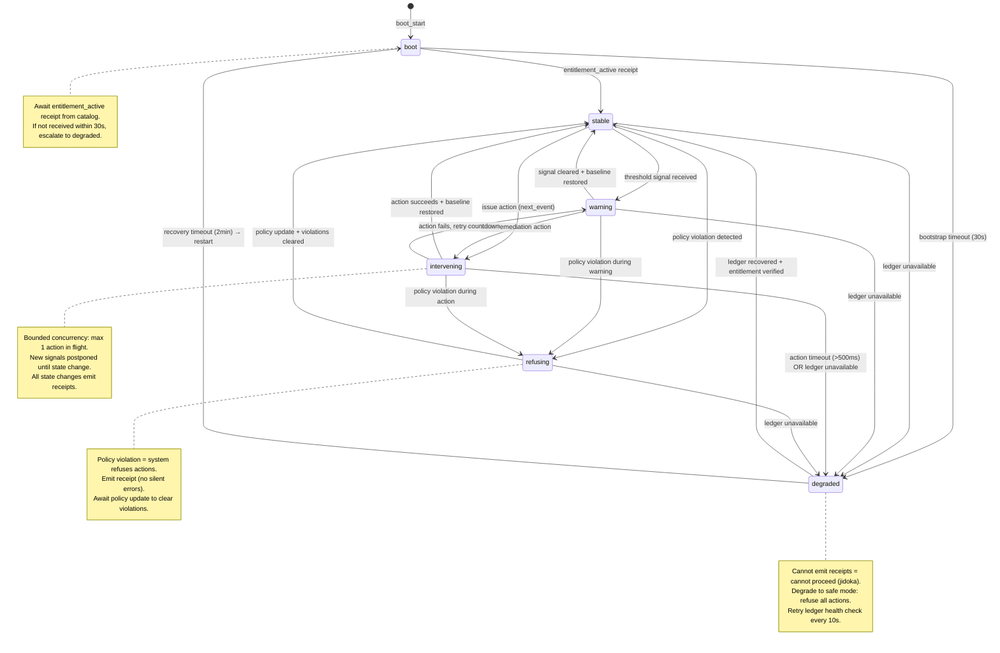

# Governor Contract: Finite State Machine Constitution

**Version**: 1.0.0 (Production-Ready)
**Last Updated**: 2026-01-25
**Owner**: Autonomics Constitution Lead
**Status**: Active

---

## Executive Summary

The Governor is a finite state machine (FSM) that implements jidoka (autonomic defect prevention) via Erlang's `gen_statem`. It accepts signals from monitoring, validates against invariants, and issues actions to control cloud infrastructure. **No humans support** — the system is explicit about what it will and will not do.

---

## FSM State Model

### States

```
boot          → initializing, awaiting entitlement_active receipt
stable        → normal operation, processing signals
warning       → health degradation detected, considering action
intervening   → action in flight, new signals postponed
refusing      → policy violation, no actions allowed
degraded      → resilience mode, ledger unavailable, no actions
```

### State Diagram (Mermaid)



---

## Transitions & Triggers

| From | To | Event | Condition | Receipt | Action |
|------|----|----|-----------|---------|--------|
| boot | stable | `entitlement_active` | Receipt from catalog | `state_transition` | None |
| boot | degraded | `state_timeout` | 30s elapsed | `bootstrap_timeout` | Escalate to degraded |
| stable | warning | Signal received | Signal value exceeds threshold | `signal_received`, `threshold_exceeded` | Evaluate remediation |
| stable | intervening | `next_event(action)` | Issue action from policy | `action_attempted` | Submit to actuator |
| stable | refusing | Policy violation | Action not in policy or permission denied | `permission_denied` or `policy_violation` | Block action |
| stable | degraded | Health check fails | Ledger unavailable | `health_check_failed` | Degrade |
| warning | intervening | `next_event(action)` | Issue remediation | `action_attempted` | Submit action |
| warning | stable | Signal cleared | Signal restored to baseline | `signal_cleared`, `baseline_restored` | Resume normal ops |
| warning | refusing | Policy violation | New policy violation detected | `policy_violation` | Block further actions |
| intervening | stable | `action_result(success)` | Action completes + baseline restored | `action_succeeded`, `baseline_restored` | Resume normal ops |
| intervening | warning | `action_result(failure)` | Action fails, retry countdown starts | `action_failed`, `retry_countdown` | Retry or escalate |
| intervening | degraded | `state_timeout` | Action timeout (>500ms) OR ledger fails | `action_timeout` or `health_check_failed` | Degrade + rollback |
| refusing | stable | Policy update | Violations cleared by policy change | `policy_updated`, `violations_cleared` | Resume normal ops |
| degraded | stable | Health check passes | Ledger recovered + entitlement verified | `health_check_passed`, `entitlement_verified` | Resume normal ops |
| degraded | boot | `state_timeout` | Recovery timeout (2min) | `recovery_timeout` | Full restart |

---

## Receipt Types & Schema

Every state transition, signal, action, and invariant check emits a **receipt** (immutable ledger entry).

### Receipt Container (All Receipts)

```json
{
  "receipt_id": "uuid-v4",
  "timestamp": "2026-01-25T14:32:15.123Z",
  "sku_id": "acme-catalog-v1",
  "tenant_id": "customer-123",
  "status": "accept|refuse|error",
  "reason": "state_transition|signal_received|action_attempted|...",
  "context": {}
}
```

### Receipt 1: boot_start

**Emitted when**: Governor starts initialization.

```json
{
  "receipt_id": "uuid",
  "timestamp": "ISO 8601",
  "sku_id": "acme-catalog-v1",
  "tenant_id": "customer-123",
  "status": "accept",
  "reason": "boot_start",
  "context": {
    "governor_version": "1.0.0",
    "process_id": "pid-erlang",
    "entitlement_required": true
  }
}
```

### Receipt 2: state_transition

**Emitted when**: FSM transitions between states.

```json
{
  "receipt_id": "uuid",
  "timestamp": "ISO 8601",
  "sku_id": "acme-catalog-v1",
  "tenant_id": "customer-123",
  "status": "accept",
  "reason": "state_transition",
  "context": {
    "from_state": "boot",
    "to_state": "stable",
    "event": "entitlement_active",
    "duration_ms": 125
  }
}
```

### Receipt 3: signal_received

**Emitted when**: Signal ingested and validated.

```json
{
  "receipt_id": "uuid",
  "timestamp": "ISO 8601",
  "sku_id": "acme-catalog-v1",
  "tenant_id": "customer-123",
  "status": "accept",
  "reason": "signal_received",
  "context": {
    "signal_type": "cpu_utilization",
    "source": "monitoring",
    "severity": "MEDIUM",
    "value": 82.5,
    "threshold": 75.0,
    "exceeds_threshold": true
  }
}
```

### Receipt 4: threshold_exceeded

**Emitted when**: Signal value crosses policy threshold.

```json
{
  "receipt_id": "uuid",
  "timestamp": "ISO 8601",
  "sku_id": "acme-catalog-v1",
  "tenant_id": "customer-123",
  "status": "accept",
  "reason": "threshold_exceeded",
  "context": {
    "signal_type": "cpu_utilization",
    "current_value": 82.5,
    "threshold": 75.0,
    "policy_id": "policy-scale-up-on-cpu-gt-75",
    "remediation_action": "scale_up_cloud_run"
  }
}
```

### Receipt 5: action_attempted

**Emitted when**: Action submission begins.

```json
{
  "receipt_id": "uuid",
  "timestamp": "ISO 8601",
  "sku_id": "acme-catalog-v1",
  "tenant_id": "customer-123",
  "status": "accept",
  "reason": "action_attempted",
  "context": {
    "action_id": "action-uuid",
    "action_type": "scale_up_cloud_run",
    "action_timeout_ms": 500,
    "service": "cloud_run_api",
    "target": "production-catalog-service",
    "replicas_delta": 3
  }
}
```

### Receipt 6: action_succeeded

**Emitted when**: Action completes successfully.

```json
{
  "receipt_id": "uuid",
  "timestamp": "ISO 8601",
  "sku_id": "acme-catalog-v1",
  "tenant_id": "customer-123",
  "status": "accept",
  "reason": "action_succeeded",
  "context": {
    "action_id": "action-uuid",
    "action_type": "scale_up_cloud_run",
    "duration_ms": 234,
    "previous_replicas": 5,
    "new_replicas": 8,
    "service_response_code": 200,
    "baseline_restored": true
  }
}
```

### Receipt 7: action_failed

**Emitted when**: Action fails or times out.

```json
{
  "receipt_id": "uuid",
  "timestamp": "ISO 8601",
  "sku_id": "acme-catalog-v1",
  "tenant_id": "customer-123",
  "status": "error",
  "reason": "action_failed",
  "context": {
    "action_id": "action-uuid",
    "action_type": "scale_up_cloud_run",
    "failure_reason": "timeout|service_error|permission_denied",
    "service_response_code": 500,
    "error_message": "Cloud Run API returned 500: INTERNAL_ERROR",
    "retry_countdown": 2,
    "max_retries": 3
  }
}
```

### Receipt 8: permission_denied

**Emitted when**: Principal lacks permission for action.

```json
{
  "receipt_id": "uuid",
  "timestamp": "ISO 8601",
  "sku_id": "acme-catalog-v1",
  "tenant_id": "customer-123",
  "status": "refuse",
  "reason": "permission_denied",
  "context": {
    "action_type": "scale_up_cloud_run",
    "required_permission": "run.services.update",
    "principal": "service-account-governance@project.iam.gserviceaccount.com",
    "has_permission": false,
    "policy_id": "policy-scale-up-on-cpu-gt-75"
  }
}
```

### Receipt 9: policy_violation

**Emitted when**: Action violates policy.

```json
{
  "receipt_id": "uuid",
  "timestamp": "ISO 8601",
  "sku_id": "acme-catalog-v1",
  "tenant_id": "customer-123",
  "status": "refuse",
  "reason": "policy_violation",
  "context": {
    "action_type": "scale_up_cloud_run",
    "reason": "action_not_in_policy|quota_exceeded|entitlement_not_active",
    "policy_id": "policy-id",
    "current_policy_version": 5
  }
}
```

### Receipt 10: invariant_violation

**Emitted when**: System invariant fails.

```json
{
  "receipt_id": "uuid",
  "timestamp": "ISO 8601",
  "sku_id": "acme-catalog-v1",
  "tenant_id": "customer-123",
  "status": "error",
  "reason": "invariant_violation",
  "context": {
    "invariant_id": "entitlement_active_required",
    "invariant_name": "Entitlement Active Required",
    "check_result": false,
    "impact": "refuse_all_actions",
    "remediation": "verify entitlement status with catalog"
  }
}
```

### Receipt 11: health_check_failed

**Emitted when**: Ledger or policy unavailable.

```json
{
  "receipt_id": "uuid",
  "timestamp": "ISO 8601",
  "sku_id": "acme-catalog-v1",
  "tenant_id": "customer-123",
  "status": "error",
  "reason": "health_check_failed",
  "context": {
    "component": "firestore|policy_cache",
    "failure_type": "connection_timeout|read_error",
    "error_message": "Firestore: deadline exceeded after 5 retries",
    "recovery_action": "degrade_to_safe_mode",
    "retry_interval_seconds": 10
  }
}
```

### Receipt 12: entitlement_verified

**Emitted when**: Entitlement status confirmed.

```json
{
  "receipt_id": "uuid",
  "timestamp": "ISO 8601",
  "sku_id": "acme-catalog-v1",
  "tenant_id": "customer-123",
  "status": "accept",
  "reason": "entitlement_verified",
  "context": {
    "entitlement_status": "ACTIVE",
    "entitlement_expires": "2026-02-25T00:00:00Z",
    "quota_remaining": 847,
    "quota_limit": 1000
  }
}
```

---

## System Invariants

Invariants are **logical constraints** that must hold in every state. If an invariant fails, the system emits a receipt and refuses actions until the invariant is restored.

### Invariant 1: Entitlement Active Required

**Statement**: If signal reception occurs, entitlement must be ACTIVE (billing integrity).

**Check**: On every signal_received event.

```erlang
check_invariant(entitlement_active_required, Data) ->
    case Data#data.entitlement_status of
        'ACTIVE' -> {ok, Data};
        _ ->
            Receipt = emit_invariant_violation(entitlement_active_required),
            {refuse, Receipt, Data}
    end.
```

**Receipt**: `invariant_violation` + reason: `entitlement_not_active`

**Impact**: If violated, Governor refuses all actions until entitlement renewed.

---

### Invariant 2: Permission Required for Every Action

**Statement**: Before any action execution, principal must have required IAM permission.

**Check**: Before `action_attempted` receipt.

```erlang
check_invariant(permission_required, #data{action = Action, principal = Principal}) ->
    case check_iam_permission(Principal, Action) of
        {ok, true} -> ok;
        {ok, false} ->
            emit_receipt(permission_denied, #{ action => Action, principal => Principal }),
            {refuse, Data};
        {error, Reason} ->
            emit_receipt(health_check_failed, #{ component => iam, error => Reason }),
            {degrade, Data}
    end.
```

**Receipt**: `permission_denied` if permission missing; `health_check_failed` if IAM unreachable.

**Impact**: No action executes without verified permission.

---

### Invariant 3: Quota Not Exceeded

**Statement**: Action quota per customer must not be exceeded.

**Check**: Before action execution.

```erlang
check_invariant(quota_not_exceeded, Data) ->
    Quota = Data#data.quota_remaining,
    case Quota > 0 of
        true -> {ok, Data#data{ quota_remaining = Quota - 1 }};
        false ->
            Receipt = emit_receipt(policy_violation, #{ reason => quota_exceeded }),
            {refuse, Receipt, Data}
    end.
```

**Receipt**: `policy_violation` + reason: `quota_exceeded`.

**Impact**: If quota exhausted, refuse all actions until quota reset (monthly boundary or purchase).

---

### Invariant 4: Receipt Ledger Available

**Statement**: If Firestore (receipt ledger) is unreachable, system must degrade to safe mode.

**Check**: Every 60 seconds (periodic health check).

```erlang
check_invariant(ledger_available, Data) ->
    case firestore:ping() of
        {ok, pong} -> {ok, Data};
        {error, Timeout} ->
            emit_receipt(health_check_failed, #{ component => firestore, error => Timeout }),
            {degrade, Data}
    end.
```

**Receipt**: `health_check_failed` + component: `firestore`.

**Impact**: Degrade to safe mode (refuse all actions) until Firestore recovers.

---

### Invariant 5: Policy Pack Loaded

**Statement**: Governor must have current policy loaded from ontology.

**Check**: On state transition to `intervening`.

```erlang
check_invariant(policy_loaded, Data) ->
    case Data#data.policy_id of
        undefined ->
            emit_receipt(policy_load_failed, #{}),
            {degrade, Data};
        _ -> {ok, Data}
    end.
```

**Receipt**: `health_check_failed` + component: `policy_cache`.

**Impact**: Cannot issue actions without policy. Degrade until policy reloaded.

---

### Invariant 6: Signal Storm Prevention

**Statement**: If signal rate exceeds 100/minute from same tenant, throttle.

**Check**: On every signal reception.

```erlang
check_invariant(signal_storm_prevention, Data) ->
    Rate = count_signals_per_minute(Data#data.tenant_id),
    case Rate > 100 of
        true ->
            emit_receipt(signal_storm_detected, #{ rate => Rate }),
            {throttle, Data};
        false ->
            {ok, Data}
    end.
```

**Receipt**: `signal_storm_detected` + rate: actual signals/minute.

**Impact**: Postpone new signals until rate drops. Process from in-memory queue.

---

### Invariant 7: Action Concurrency Bounded

**Statement**: Maximum 1 action in flight at any time.

**Check**: Before `next_event(action)` transition.

```erlang
check_invariant(action_concurrency_bounded, Data) ->
    InFlight = Data#data.in_flight_action,
    case InFlight of
        undefined -> {ok, Data};
        _ ->
            emit_receipt(concurrency_limited, #{ queue_length => queue_length(Data#data.action_queue) }),
            {queue_action, Data}
    end.
```

**Receipt**: `concurrency_limited` + queue_length: number of queued actions.

**Impact**: New actions queued until in-flight action completes. Maintains fairness (FIFO).

---

### Invariant 8: Deterministic Behavior

**Statement**: Same input must produce same output (reproducible governance).

**Check**: On receipt emission (compare hash).

```erlang
check_invariant(deterministic_behavior, Receipt) ->
    ExpectedHash = compute_receipt_hash(Receipt),
    case ExpectedHash == Receipt#receipt.hash of
        true -> {ok, Receipt};
        false ->
            emit_receipt(nondeterminism_detected, #{ receipt_id => Receipt#receipt.id }),
            {error, Receipt}
    end.
```

**Receipt**: `nondeterminism_detected` (escalates to human review).

**Impact**: Halt action execution and escalate to ops team.

---

## Error Handling & Recovery

### Error: Action Fails

**Scenario**: Action submitted to Cloud Run API returns non-200 status.

**Flow**:
1. Emit `action_failed` receipt
2. Decrement retry countdown
3. If retries > 0:
   - Emit `retry_countdown` context
   - Requeue action
   - Stay in `intervening` state
4. If retries = 0:
   - Emit rollback action
   - Transition to `warning` state
   - Await signal clearing or policy intervention

**Code**:
```erlang
handle_event(info, {action_result, {error, Reason}}, intervening, Data) ->
    Retries = Data#data.action_retries - 1,
    emit_receipt(action_failed, #{ retry_countdown => Retries }),
    case Retries > 0 of
        true ->
            {keep_state, Data#data{ action_retries = Retries }};
        false ->
            emit_rollback_action(Data),
            {next_state, warning, Data#data{ action_retries = 3 }}
    end.
```

### Error: Action Timeout

**Scenario**: Action pending >500ms.

**Flow**:
1. Emit `action_timeout` receipt
2. Issue rollback action immediately
3. Transition to `degraded` state
4. Escalate to ops team (manual intervention required)

**Code**:
```erlang
handle_event(state_timeout, action_timeout, intervening, Data) ->
    emit_receipt(action_timeout, Data#data.in_flight_action),
    emit_rollback_action(Data),
    {next_state, degraded, Data#data{ in_flight_action = undefined }}.
```

### Error: Invariant Fails

**Scenario**: Invariant check returns false.

**Flow**:
1. Emit `invariant_violation` receipt
2. Transition to `refusing` state
3. Refuse all actions until invariant restored
4. Periodic re-check of invariant (every 30s)

**Code**:
```erlang
handle_event(info, check_invariants, State, Data) ->
    case check_all_invariants(Data) of
        {ok, NewData} ->
            case State of
                refusing -> {next_state, stable, NewData};
                _ -> {keep_state, NewData}
            end;
        {error, Violation} ->
            emit_receipt(invariant_violation, Violation),
            {next_state, refusing, Data}
    end.
```

---

## Time Bounds (SLOs)

Every operation has a deadline to prevent indefinite blocking.

| Operation | SLO | Timeout Action |
|-----------|-----|---|
| Signal processing | <100ms | Postpone to queue |
| Action submission | <500ms | Emit timeout receipt, rollback |
| Receipt emission | <50ms | Degrade if exceeds |
| State transition | <50ms | Log + retry |
| Entitlement check | <200ms | Degrade if exceeds |
| Policy load | <300ms | Degrade if exceeds |
| Health check | <1s | Emit failed receipt |
| Recovery retry | 10s interval | Exponential backoff (10s → 30s → 60s → max 5min) |

---

## Concurrency Model

### Sequential Processing (No Race Conditions)

1. **Single Mailbox**: Governor process has single mailbox (gen_statem guarantees FIFO).
2. **No Parallel Actions**: Maximum 1 action in flight (enforced by `in_flight_action` field).
3. **Signal Postponement**: New signals during `intervening` state postponed until state change.
4. **Queue Discipline**: Postponed signals requeued after successful state transition (FIFO fairness).

### Data Structure (Erlang Record)

```erlang
-record(data, {
    sku_id :: binary(),                     % e.g., <<"acme-catalog-v1">>
    tenant_id :: binary(),                  % e.g., <<"customer-123">>
    entitlement_status :: 'ACTIVE' | 'INACTIVE' | 'EXPIRED',
    policy_id :: binary() | undefined,      % Current policy from ontology
    in_flight_action :: action() | undefined,  % Bounded concurrency (max 1)
    action_queue :: queue:queue(action()),  % Queued actions (FIFO)
    signal_buffer :: queue:queue(signal()),  % Signal buffer (max 1000)
    quota_remaining :: non_neg_integer(),   % Actions remaining this month
    state_entered_at :: integer(),          % Timestamp (microseconds)
    last_health_check :: integer()          % Last successful health check
}).
```

### Invariant Check: Concurrency Bounded

```erlang
handle_event(cast, {signal, Signal}, intervening, Data) ->
    case Data#data.in_flight_action of
        undefined ->
            % Action completed, process signal
            {next_state, stable, Data#data{ in_flight_action = undefined }};
        _ ->
            % Action still in flight, postpone signal
            {keep_state_and_data, [{postpone, true}]}
    end.
```

---

## Determinism & Reproducibility

### Receipt Hashing

Every receipt includes a deterministic hash based on:
- Receipt container (id, timestamp, sku_id, tenant_id, status, reason)
- Context fields (sorted by key)

```erlang
compute_receipt_hash(Receipt) ->
    Content = [
        Receipt#receipt.receipt_id,
        Receipt#receipt.sku_id,
        Receipt#receipt.tenant_id,
        Receipt#receipt.reason,
        maps:to_list(Receipt#receipt.context)  % Sorted
    ],
    crypto:hash(sha256, term_to_binary(Content)).
```

### Reproducibility Guarantee

**Given identical policy, entitlement status, and signal sequence, Governor must produce identical receipt sequence.**

This is verified by:
1. Comparing receipt hashes across deployments
2. Cryptographic audit trail (ledger immutable)
3. Deterministic PRNG seed (if randomness needed, use seeded source)

---

## Definition of Done

- [ ] FSM diagram (Mermaid) renders correctly
- [ ] All 12 receipt types documented with JSON schema
- [ ] All 8 invariants documented with Erlang pseudocode
- [ ] Time bounds table complete (all operations)
- [ ] Concurrency model explained + data structure defined
- [ ] Error recovery flows documented (action failure, timeout, invariant)
- [ ] Receipt hashing algorithm defined
- [ ] Gov process can be spawned per tenant (DynamicSupervisor)
- [ ] Receipts are immutable (appended to Firestore, never deleted)
- [ ] Cross-reference: signal-contracts.md, action-contracts.md, invariants.md

---

## References

- **signal-contracts.md** — Signal ingestion HTTP contract
- **action-contracts.md** — Action execution contract
- **invariants.md** — Detailed invariant definitions
- **refusal-modes.md** — All refusal scenarios + receipts
- **gen_statem-patterns.md** — Erlang/OTP production patterns
- **glossary.md** — Term definitions (FSM, receipt, invariant, jidoka)

---

**Last Updated**: 2026-01-25 | **Status**: Production-Ready
