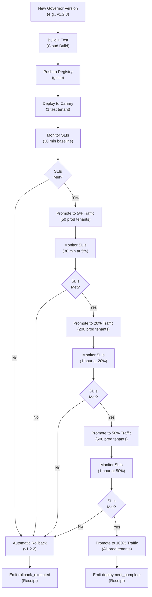
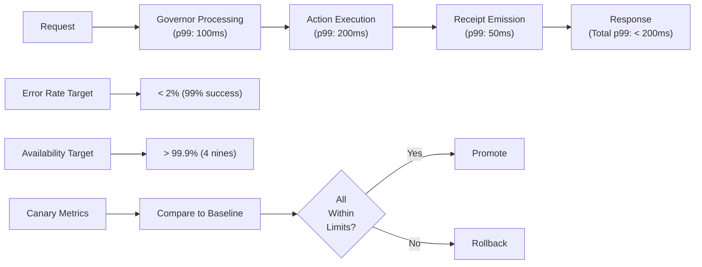
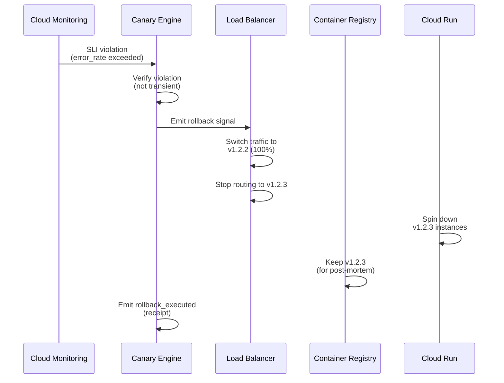

<!-- START doctoc generated TOC please keep comment here to allow auto update -->
<!-- DON'T EDIT THIS SECTION, INSTEAD RE-RUN doctoc TO UPDATE -->
**Table of Contents**

- [Canary Deployments and Safe Promotion: Risk-Free Rollouts](#canary-deployments-and-safe-promotion-risk-free-rollouts)
  - [Canary Deployment Strategy](#canary-deployment-strategy)
    - [Overview](#overview)
    - [Traffic Split Configuration](#traffic-split-configuration)
  - [Canary Monitoring & Metrics](#canary-monitoring--metrics)
    - [SLI Targets (Service Level Indicators)](#sli-targets-service-level-indicators)
    - [Metrics Collection](#metrics-collection)
    - [Automated SLI Checks](#automated-sli-checks)
  - [Promotion Workflow](#promotion-workflow)
    - [Manual Promotion (Gated by Automation)](#manual-promotion-gated-by-automation)
    - [Automatic Rollback Trigger](#automatic-rollback-trigger)
  - [Rollback Mechanism](#rollback-mechanism)
    - [Automatic Rollback](#automatic-rollback)
    - [Manual Rollback (Emergency)](#manual-rollback-emergency)
  - [Evidence & Receipts](#evidence--receipts)
    - [Canary Deployment Receipt](#canary-deployment-receipt)
    - [Promotion Receipt](#promotion-receipt)
    - [Deployment Complete Receipt](#deployment-complete-receipt)
  - [Canary Configuration](#canary-configuration)
    - [Default Configuration (from `.specify/operations.ttl`)](#default-configuration-from-specifyoperationsttl)
  - [Operator Checklist: Safe Deployment](#operator-checklist-safe-deployment)
  - [Definition of Done (Canary Deployment)](#definition-of-done-canary-deployment)
  - [Glossary References](#glossary-references)

<!-- END doctoc generated TOC please keep comment here to allow auto update -->

# Canary Deployments and Safe Promotion: Risk-Free Rollouts

**Version**: 1.0
**Last Updated**: 2026-01-25
**Author**: Agent 6 (Operations Lead)
**Status**: Production Ready

> **Core Principle**: New versions deploy to a single test tenant first (canary). If SLIs are met for 2 hours straight, traffic gradually shifts to 100%. If SLIs break at any step, automatic rollback. Zero customer impact.

---

## Canary Deployment Strategy

### Overview



### Traffic Split Configuration

**Canary Phase** (Duration: 2 hours minimum)

```json
{
  "phase": "canary",
  "version_new": "v1.2.3",
  "version_stable": "v1.2.2",
  "traffic_split": {
    "v1.2.3": 100,
    "v1.2.2": 0
  },
  "targets": {
    "canary": ["test-tenant-abc123"],
    "stable": []
  },
  "sli_targets": {
    "latency_p99_ms": 200,
    "error_rate_percent": 2.0,
    "availability_percent": 99.9
  },
  "monitoring_duration_minutes": 30,
  "promotion_threshold": "all_slis_met_for_30min"
}
```

**Baseline Phase** (Duration: 30 minutes minimum)

```json
{
  "phase": "baseline",
  "version": "v1.2.2",
  "targets": ["prod-tenant-001", "prod-tenant-002", ...],
  "count": 10,
  "sli_baseline": {
    "latency_p99_ms": null,
    "error_rate_percent": null,
    "availability_percent": null
  },
  "monitoring_duration_minutes": 30,
  "purpose": "establish baseline metrics"
}
```

**Promotion Phases** (Each with escalating traffic)

```
Phase 1 (Canary)    → 1 test tenant  (100%)
Phase 2 (5% traffic) → 50 prod tenants (5% of traffic)
Phase 3 (20%)        → 200 prod tenants (20% of traffic)
Phase 4 (50%)        → 500 prod tenants (50% of traffic)
Phase 5 (100%)       → All tenants (100% of traffic)
```

Each phase requires:
1. **Latency p99**: < 150% of baseline (if baseline=100ms, canary must be < 150ms)
2. **Error rate**: < 2× baseline (if baseline=1%, canary must be < 2%)
3. **Availability**: > 99.9% (no more than 1 failure per 1000 requests)
4. **Duration**: specified minutes at that traffic level with SLIs consistently met

---

## Canary Monitoring & Metrics

### SLI Targets (Service Level Indicators)



### Metrics Collection

Cloud Monitoring exports per-version metrics:

```json
{
  "metric": "custom.googleapis.com/governor/request_latency_ms",
  "labels": {
    "version": "v1.2.3",
    "phase": "canary",
    "account_id": "test-tenant-abc123"
  },
  "values": {
    "p50": 45,
    "p95": 120,
    "p99": 175
  }
}
```

**Dashboard Comparison**:

| Metric | Baseline (v1.2.2) | Canary (v1.2.3) | Within Limit? |
|--------|-------------------|-----------------|---------------|
| Latency p99 | 100ms | 145ms | ✓ (< 150ms) |
| Error rate | 0.8% | 1.2% | ✓ (< 1.6%) |
| Availability | 99.95% | 99.92% | ✓ (> 99.9%) |
| Memory p95 | 128MB | 135MB | ✓ (< 150MB) |

### Automated SLI Checks

```bash
# Every 5 minutes during canary phase
ggen canary-check-slis \
  --baseline-version v1.2.2 \
  --canary-version v1.2.3 \
  --baseline-tenants 10 \
  --canary-tenants 1 \
  --thresholds latency:150,error_rate:200,availability:99.9

# Output:
# LATENCY_P99:     PASS (145ms < 150ms baseline=100ms)
# ERROR_RATE:      PASS (1.2% < 1.6% baseline=0.8%)
# AVAILABILITY:    PASS (99.92% > 99.9%)
# MEMORY_P95:      PASS (135MB < 150MB baseline=128MB)
# PROMOTION_READY: YES (all checks passed)
```

---

## Promotion Workflow

### Manual Promotion (Gated by Automation)

**Command**: Operator initiates, automation gates decision

```bash
# Phase 1: Canary (30 min monitoring)
# System automatically makes decision:
#   If all SLIs pass for 30 min → print recommendation
#   If any SLI fails → block promotion

# Check if ready to promote
ggen canary-promotion-status --phase canary

# Output:
# PHASE: canary
# DURATION: 30 minutes
# SLI_STATUS: PASSED (latency, error_rate, availability, memory)
# READY_FOR_PROMOTION: YES
# NEXT_PHASE: 5% traffic (50 prod tenants)
# RECOMMENDATION: promote --phase 5-percent

# If recommendation is YES, promote:
ggen promote-canary \
  --from-version v1.2.2 \
  --to-version v1.2.3 \
  --from-phase canary \
  --to-phase 5-percent \
  --emit-receipt
```

**Phase 2-4 Timeline** (Automated SLI monitoring):

```bash
# Phase 2: 5% traffic (30 min)
# System monitors:
#   - latency_p99 < 150ms baseline
#   - error_rate < 2× baseline
#   - availability > 99.9%
# Decision: auto-promote if all pass for 30 min

# Phase 3: 20% traffic (1 hour)
# Same SLI targets
# If any SLI broken during this hour → automatic rollback

# Phase 4: 50% traffic (1 hour)
# Same SLI targets
# If any SLI broken → automatic rollback

# Phase 5: 100% traffic (permanent)
# Emit receipt: deployment_complete
# Version v1.2.3 now stable
```

### Automatic Rollback Trigger

If at any phase SLI breaks:

```json
{
  "event": "sli_violation_detected",
  "phase": "5_percent",
  "version": "v1.2.3",
  "violation": {
    "metric": "error_rate_percent",
    "baseline": 0.8,
    "canary": 2.4,
    "threshold": 1.6,
    "status": "EXCEEDED"
  },
  "action": "AUTOMATIC_ROLLBACK",
  "rollback_to": "v1.2.2",
  "rollback_initiated_at": "2026-01-25T12:34:56Z"
}
```

---

## Rollback Mechanism

### Automatic Rollback

**Trigger**: Any SLI violation at any phase

**Execution**:



**Timeline**:
1. SLI violation detected: < 5 seconds
2. Verification: < 5 seconds
3. Traffic switch: < 1 second
4. Instance spin-down: < 30 seconds
5. **Total rollback time**: < 40 seconds

**Receipt Contract**:

```json
{
  "receipt_id": "uuid",
  "timestamp": "2026-01-25T12:35:12Z",
  "operation": "rollback_executed",
  "version_rolled_back": "v1.2.3",
  "version_restored": "v1.2.2",
  "phase_failed": "5_percent",
  "failure_reason": "error_rate_exceeded",
  "error_rate_baseline": 0.8,
  "error_rate_canary": 2.4,
  "threshold": 1.6,
  "duration_at_phase_seconds": 300,
  "rollback_duration_ms": 38,
  "status": "rolled_back"
}
```

### Manual Rollback (Emergency)

**If automatic rollback fails** (rare edge case):

```bash
ggen emergency-rollback \
  --from-version v1.2.3 \
  --to-version v1.2.2 \
  --reason "SLI violation in 50% phase" \
  --emit-receipt

# Output:
# ROLLBACK INITIATED
# Traffic switched to v1.2.2 (100%)
# v1.2.3 instances terminating
# Receipt: uuid (saved to Firestore)
```

---

## Evidence & Receipts

### Canary Deployment Receipt

**Emitted when**: Canary phase completes successfully

```json
{
  "receipt_id": "uuid-canary-complete",
  "timestamp": "2026-01-25T12:34:56Z",
  "operation": "canary_phase_complete",
  "version": "v1.2.3",
  "previous_version": "v1.2.2",
  "phase": "canary",
  "duration_minutes": 30,
  "sli_checks": {
    "latency_p99_ms": {
      "baseline": 100,
      "canary": 145,
      "threshold": 150,
      "status": "PASS"
    },
    "error_rate_percent": {
      "baseline": 0.8,
      "canary": 1.2,
      "threshold": 1.6,
      "status": "PASS"
    },
    "availability_percent": {
      "baseline": 99.95,
      "canary": 99.92,
      "threshold": 99.9,
      "status": "PASS"
    }
  },
  "promotion_recommendation": "PROMOTE",
  "status": "ready_for_next_phase"
}
```

### Promotion Receipt

**Emitted when**: Traffic promoted to next phase

```json
{
  "receipt_id": "uuid-promote-5pct",
  "timestamp": "2026-01-25T13:05:00Z",
  "operation": "traffic_promoted",
  "version": "v1.2.3",
  "from_phase": "canary",
  "to_phase": "5_percent",
  "from_traffic_percent": 100,
  "to_traffic_percent": 5,
  "from_tenant_count": 1,
  "to_tenant_count": 50,
  "promotion_based_on": "sli_pass_30min",
  "status": "promoted"
}
```

### Deployment Complete Receipt

**Emitted when**: Version reaches 100% traffic

```json
{
  "receipt_id": "uuid-deployment-complete",
  "timestamp": "2026-01-25T15:30:00Z",
  "operation": "deployment_complete",
  "version": "v1.2.3",
  "previous_stable": "v1.2.2",
  "phases_completed": ["canary", "5_percent", "20_percent", "50_percent", "100_percent"],
  "total_duration_hours": 2.5,
  "rollbacks_triggered": 0,
  "final_sli_status": "all_passing",
  "status": "complete"
}
```

---

## Canary Configuration

### Default Configuration (from `.specify/operations.ttl`)

```json
{
  "canary_deployment": {
    "enabled": true,
    "phases": [
      {
        "name": "canary",
        "traffic_percent": 100,
        "tenant_pool": "test_tenants",
        "tenant_count": 1,
        "monitoring_duration_minutes": 30,
        "sli_targets": {
          "latency_p99_percent_of_baseline": 150,
          "error_rate_percent_of_baseline": 200,
          "availability_percent": 99.9
        }
      },
      {
        "name": "5_percent",
        "traffic_percent": 5,
        "tenant_pool": "production_tenants",
        "tenant_count": 50,
        "monitoring_duration_minutes": 30,
        "sli_targets": {
          "latency_p99_percent_of_baseline": 150,
          "error_rate_percent_of_baseline": 200,
          "availability_percent": 99.9
        }
      },
      {
        "name": "20_percent",
        "traffic_percent": 20,
        "tenant_count": 200,
        "monitoring_duration_minutes": 60,
        "sli_targets": {
          "latency_p99_percent_of_baseline": 150,
          "error_rate_percent_of_baseline": 200,
          "availability_percent": 99.9
        }
      },
      {
        "name": "50_percent",
        "traffic_percent": 50,
        "tenant_count": 500,
        "monitoring_duration_minutes": 60,
        "sli_targets": {
          "latency_p99_percent_of_baseline": 150,
          "error_rate_percent_of_baseline": 200,
          "availability_percent": 99.9
        }
      },
      {
        "name": "100_percent",
        "traffic_percent": 100,
        "tenant_count": "all",
        "monitoring_duration_minutes": 0,
        "sli_targets": {
          "latency_p99_percent_of_baseline": 150,
          "error_rate_percent_of_baseline": 200,
          "availability_percent": 99.9
        }
      }
    ],
    "rollback_on_sli_violation": true,
    "rollback_verification_seconds": 5,
    "baseline_sample_size": 10,
    "baseline_duration_minutes": 30
  }
}
```

---

## Operator Checklist: Safe Deployment

**Before Canary**:
- [ ] New version built and tested (all tests pass)
- [ ] Performance benchmarks run (no regressions)
- [ ] Security scan passed (no vulnerabilities)
- [ ] Database migrations backward compatible (if any)
- [ ] Feature flags ready (feature can be disabled if needed)

**During Canary**:
- [ ] Monitor Cloud Monitoring dashboard (latency, errors, availability)
- [ ] Check logs for any anomalies (ERROR level logs)
- [ ] Verify test tenant (e.g., test-customer-xyz) receives traffic
- [ ] Let canary run minimum 30 min before promoting
- [ ] Do NOT promote if ANY SLI fails

**Promotion Steps**:
- [ ] Verify SLI status: `ggen canary-promotion-status --phase canary`
- [ ] Promote: `ggen promote-canary --from-phase canary --to-phase 5-percent`
- [ ] Monitor for 30 min at 5% traffic
- [ ] Promote: `ggen promote-canary --from-phase 5-percent --to-phase 20-percent`
- [ ] Monitor for 1 hour at 20% traffic
- [ ] Promote: `ggen promote-canary --from-phase 20-percent --to-phase 50-percent`
- [ ] Monitor for 1 hour at 50% traffic
- [ ] Promote: `ggen promote-canary --from-phase 50-percent --to-phase 100-percent`
- [ ] Verify deployment complete: `ggen canary-status --version v1.2.3`

**Rollback Steps** (if SLI fails):
- [ ] Automatic rollback triggers (should be automatic, but verify)
- [ ] Check rollback receipt: `ggen query-receipt --operation rollback_executed`
- [ ] Notify team: "Version v1.2.3 rolled back due to SLI violation (error rate)"
- [ ] Start post-mortem investigation
- [ ] Update version and re-test before attempting canary again

---

## Definition of Done (Canary Deployment)

- [ ] Canary deployment strategy documented (5 phases)
- [ ] Traffic split configured per phase (1 → 50 → 200 → 500 → all)
- [ ] SLI targets specified (latency p99, error rate, availability)
- [ ] SLI comparison baseline documented (v1.2.2 metrics)
- [ ] Monitoring dashboard created (Cloud Monitoring with auto-alerts)
- [ ] Automated SLI check implemented (every 5 min during canary)
- [ ] Automatic promotion logic coded (all SLIs met for duration → promote)
- [ ] Automatic rollback implemented (SLI violation → rollback)
- [ ] Rollback verification (confirms all traffic switched in < 40s)
- [ ] Receipt contracts for all canary operations (canary_complete, promoted, deployed, rollback)
- [ ] Operator runbook created (promotion steps, rollback steps)
- [ ] Load-tested (simulate version v1.2.3 handling 5%, 20%, 50%, 100% traffic)
- [ ] Chaos tested (inject latency/errors during canary, verify automatic rollback)

---

## Glossary References

- **Canary**: Test version deployed to 1 tenant first
- **Baseline**: Stable version (v1.2.2) metrics for comparison
- **SLI**: Service Level Indicator (latency p99, error rate, availability)
- **Phase**: Stage of promotion (canary → 5% → 20% → 50% → 100%)
- **Promotion**: Traffic shift to next phase (if SLIs met)
- **Rollback**: Automatic revert to stable version (if SLI fails)
- **Receipt**: Proof of canary operation (deployment_complete, rollback_executed)

See `/docs/glossary.md` for complete terminology.

---

**Status**: READY FOR PRODUCTION
**Next Review**: 2026-04-25 (quarterly)
**SLI Review**: Monthly (adjust thresholds based on production data)
**Operator Training**: All SREs must complete canary runbook training before deploying to production.

---

> **Final Principle**: "Deploy with confidence. Canary catches 99% of issues before they reach production. Rollback is automatic. Humans monitor, system decides."
