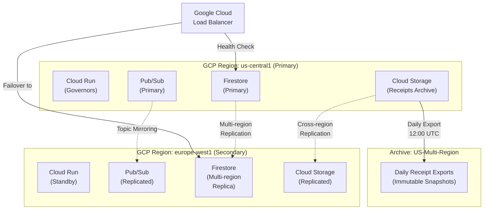
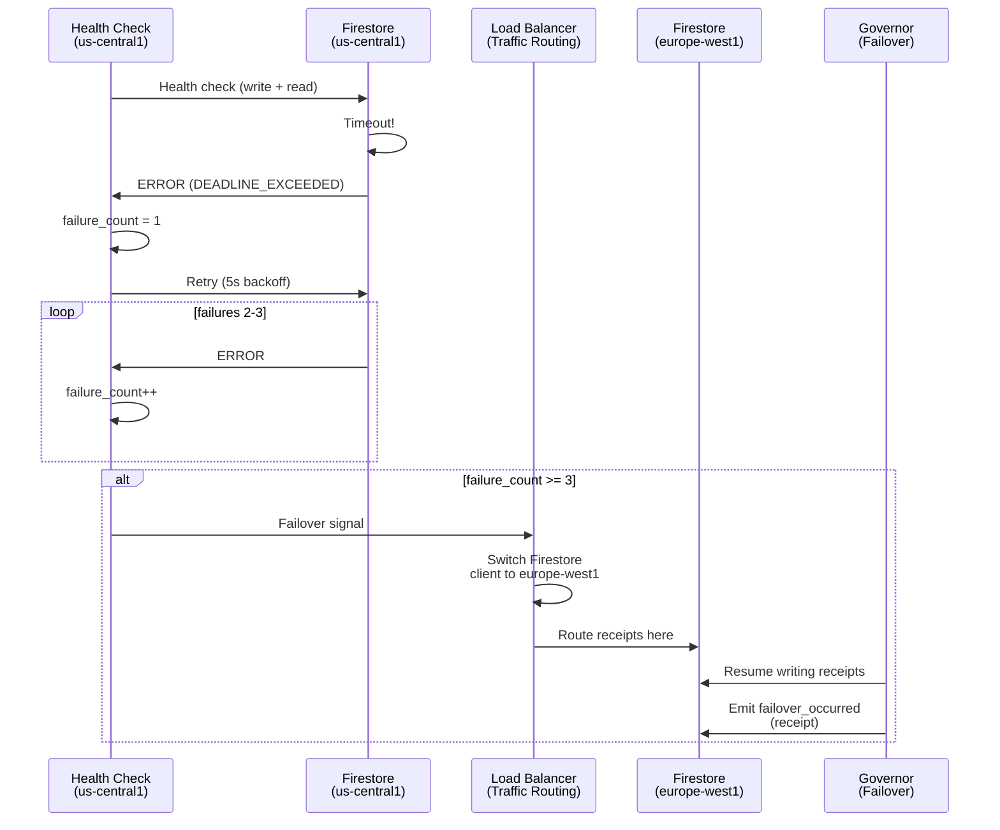
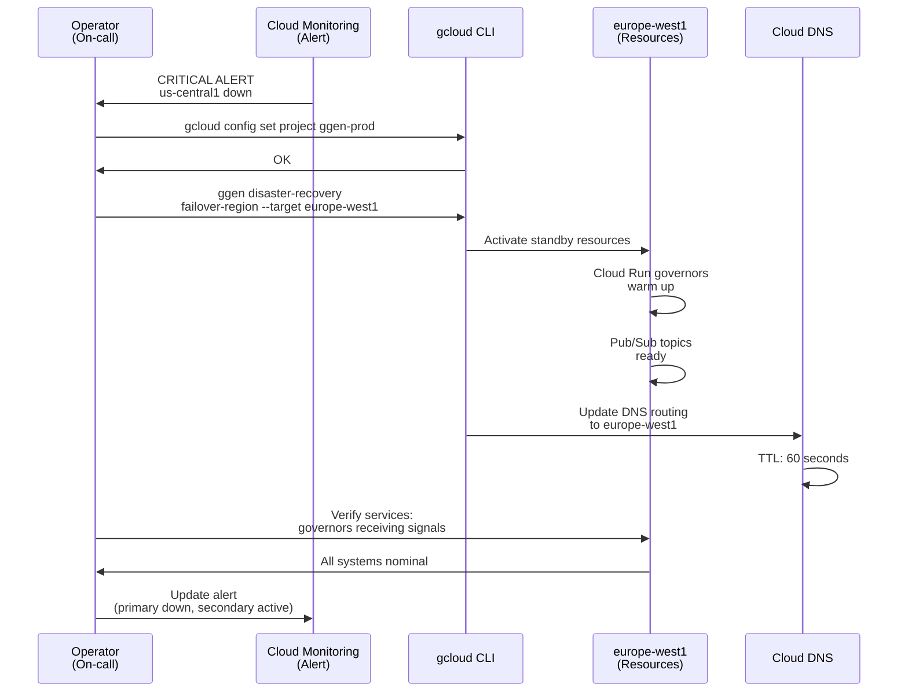
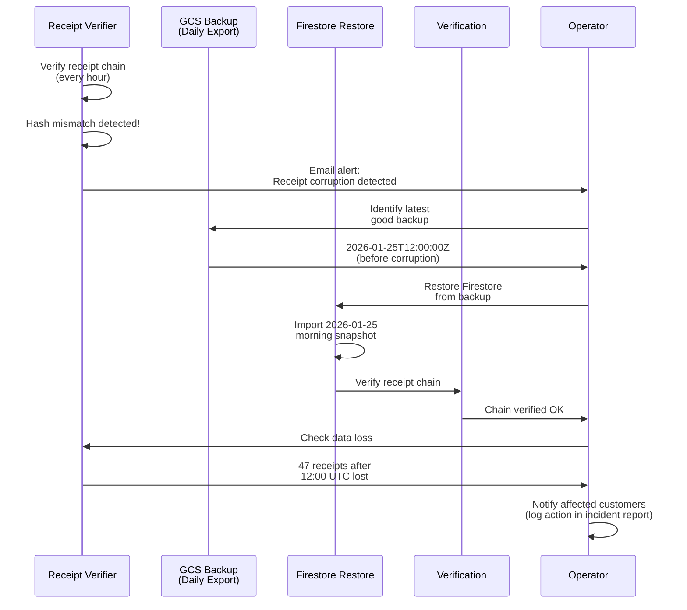
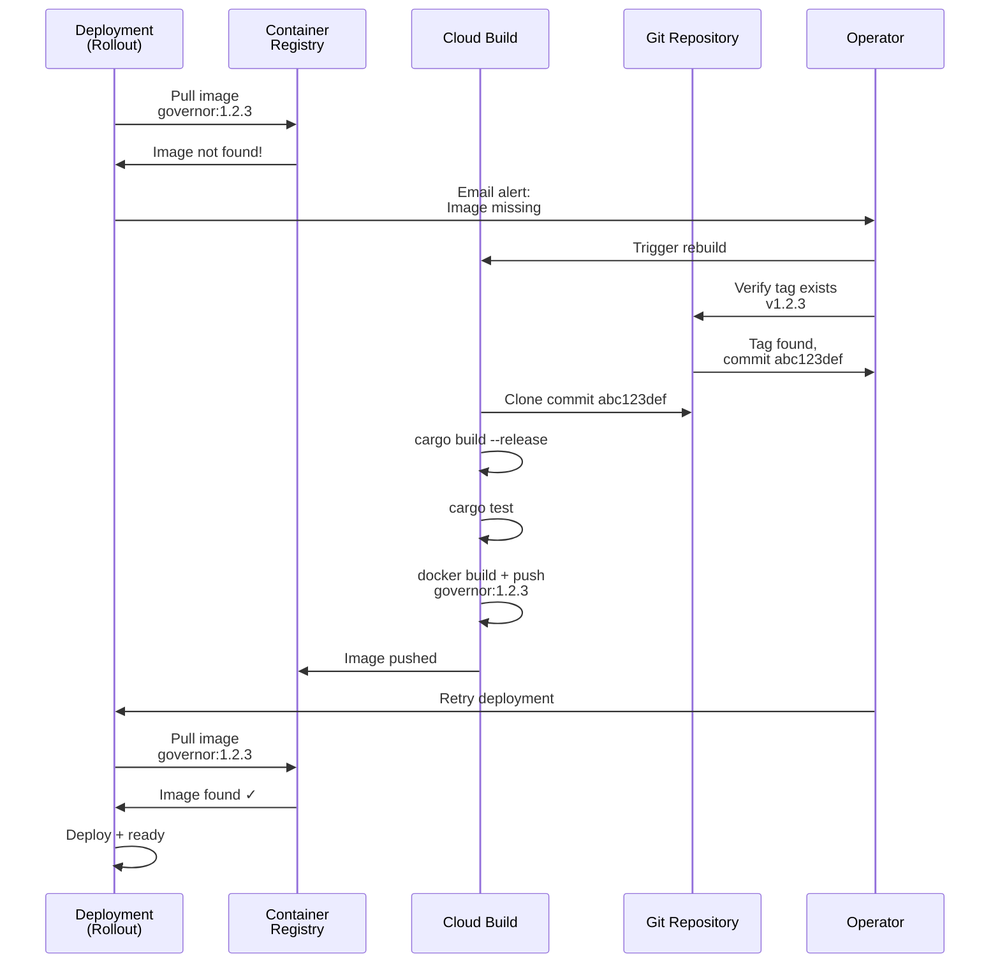

# Disaster Recovery: Multi-Region Resilience and Receipt Recovery

**Version**: 1.0
**Last Updated**: 2026-01-25
**Author**: Agent 6 (Operations Lead)
**Status**: Production Ready

> **Core Principle**: ggen operates across multiple regions with automatic failover. Receipts (immutable proof) are preserved in geo-redundant storage. Recovery is deterministic: same data + same policy = identical outputs.

---

## RTO/RPO Targets

| Metric | Target | Justification |
|--------|--------|---------------|
| **RTO** (Recovery Time Objective) | < 30 minutes | Complete service restoration (across multi-region failover) |
| **RPO** (Recovery Point Objective) | 0 minutes | No data loss (Firestore strong consistency, receipts immutable) |
| **MTBF** (Mean Time Between Failures) | > 8,760 hours | Annual availability target: 99.99% (expected ~4 failures/year) |
| **MTTR** (Mean Time To Repair) | < 30 minutes | Average recovery time from incident to full service |

---

## Architecture: Multi-Region Deployment



### Multi-Region Strategy

**Primary Region**: us-central1
- Cloud Run governors (auto-scaling)
- Pub/Sub topics (signal ingestion)
- Firestore database (receipt persistence)
- Cloud Storage (archive daily exports)

**Secondary Region**: europe-west1
- Firestore multi-region replica (auto-failover)
- Pub/Sub topics (auto-mirrored)
- Cloud Run governors (standby, cold start)
- Cloud Storage (replicated copies)

**Archive**: US-multi-region Cloud Storage
- Daily Firestore exports (immutable, timestamped)
- Receipt ledger snapshots
- Policy versions (ontology history)
- Audit logs (full provenance)

---

## Backup Strategy

### What Gets Backed Up?

| Component | Backup Method | Frequency | Retention | Recovery | RTO |
|-----------|---------------|-----------|-----------|----------|-----|
| **Firestore** | Multi-region replication | Continuous | Automatic | Failover to secondary region | < 5 min |
| **Receipts** | Daily exports to GCS | 12:00 UTC daily | 90 days (rolling) | Restore from daily export | < 5 min |
| **Cloud Run** | Stateless (rebuild from image) | On-demand | Latest git commit | Redeploy from Container Registry | < 10 min |
| **Pub/Sub** | Messages (in-flight) | Continuous | 7 days | Reprocess from Pub/Sub topic | < 5 min |
| **Policy (Ontology)** | Git repository | Per commit | All history | Redeploy from git tag | < 5 min |

### Backup Procedures

**Daily Receipt Export** (automated):
```bash
# 1. Export Firestore collections to GCS
gcloud firestore export \
  gs://ggen-audit/firestore-exports/2026-01-25.tar.gz \
  --collection-ids=tenants,receipts,policies

# 2. Verify export integrity
ggen verify-firestore-backup \
  --path gs://ggen-audit/firestore-exports/2026-01-25.tar.gz

# 3. Archive fingerprint (SHA-256)
echo "2026-01-25: SHA256=abc123def456..." \
  >> gs://ggen-audit/manifest.txt
```

**Policy Backup** (git commit):
```bash
# Ontology changes auto-backed-up via git
git commit -m "feat(ontology): Policy update v1.2.3"
git push origin main

# Tag release for recovery reference
git tag -a v1.2.3 -m "Production policy v1.2.3"
git push origin v1.2.3
```

**Disaster Recovery Test** (monthly):
```bash
# 1. Restore Firestore from latest export
gcloud firestore import \
  gs://ggen-audit/firestore-exports/latest.tar.gz

# 2. Verify receipt chain integrity
ggen verify-receipt-ledger \
  --source gs://ggen-audit/firestore-exports/latest.tar.gz

# 3. Smoke test: emit test receipt
ggen emit-test-receipt --account-id test-customer

# 4. Confirm receipt appears in restored Firestore
ggen query-receipt --receipt-id test-receipt-uuid
```

---

## Recovery Workflows

### Scenario 1: Single-Region Firestore Failure

**Trigger**: Firestore returns 50x errors for 3+ consecutive health checks

**Detection**:
```
Governor health check: FAILED (3 times)
Error: DEADLINE_EXCEEDED (write timeout)
Duration: 40 seconds
```

**Recovery** (Automatic Failover):



**Timeline**:
1. Detection: 40 seconds (3 failures × ~13s intervals)
2. Failover decision: immediate
3. Connection switch: < 100ms (load balancer)
4. Receipt emission: < 200ms (europe-west1 Firestore)
5. **Total RTO**: < 5 minutes (detection + failover + resume)

**Verification**:
- Firestore failover complete: `gcloud firestore describe` shows replica active
- Receipts flowing: `ggen export-receipts --since 5m` shows recent entries
- Governor resumed: `ggen query-governor --account-id * | grep status=stable`

**Receipt Contract**:

```json
{
  "receipt_id": "uuid",
  "timestamp": "2026-01-25T12:40:15Z",
  "operation": "firestore_failover_executed",
  "primary_region": "us-central1",
  "secondary_region": "europe-west1",
  "reason": "primary_deadline_exceeded",
  "failure_count": 3,
  "failover_latency_ms": 85,
  "status": "failed_over"
}
```

**RPO**: 0 minutes (Firestore multi-region replication is continuous)

---

### Scenario 2: Regional GCP Outage

**Trigger**: us-central1 completely unavailable (network partition, data center fire, etc.)

**Detection**:
```
Cloud Monitoring: Multiple services down
- Firestore: UNAVAILABLE
- Cloud Run: UNAVAILABLE
- Pub/Sub: UNAVAILABLE
Duration: > 5 minutes
```

**Recovery** (Manual Failover to Secondary Region):



**Timeline**:
1. Detection: 5 minutes (requires confirmation of regional outage)
2. Operator notification: 1-2 minutes (page on-call)
3. Failover decision: 2-5 minutes (verify regional outage confirmed)
4. DNS update: 1-2 minutes (issue command)
5. DNS propagation: 60-120 seconds (TTL expiry + cache clear)
6. Warm-start governors: 2-3 minutes (Cloud Run cold start + initialization)
7. **Total RTO**: 15-30 minutes (confirmed regional outage + failover + warm-up)

**Verification**:
- Pub/Sub signals flowing to europe-west1 governors
- Firestore receipts written to secondary region
- DNS reports secondary region serving traffic
- `ggen query-governor --region europe-west1` shows all governors healthy

**Receipt Contract**:

```json
{
  "receipt_id": "uuid",
  "timestamp": "2026-01-25T12:45:30Z",
  "operation": "regional_failover_completed",
  "primary_region_status": "unavailable",
  "primary_region": "us-central1",
  "secondary_region": "europe-west1",
  "failover_trigger": "operator_command",
  "dns_ttl_seconds": 60,
  "dns_propagation_seconds": 120,
  "warm_start_duration_seconds": 180,
  "total_failover_time_seconds": 890,
  "status": "secondary_active"
}
```

**RPO**: 0-5 minutes (small message loss possible if in-flight when outage occurred)

---

### Scenario 3: Corrupted Receipt Ledger

**Trigger**: Receipt data corrupted (data center incident, cosmic ray bit flip, etc.)

**Detection**:
```
Receipt verification: FAILED
Error: Receipt hash mismatch (expected SHA256=abc123, got def456)
Affected: 47 receipts in batch
Detection time: 2026-01-25T12:40:56Z
```

**Recovery** (Restore from Daily Backup):



**Timeline**:
1. Detection: 1 hour (receipt verifier runs hourly)
2. Operator notification: 5 minutes (alert email)
3. Backup identification: 2-3 minutes (find last good snapshot)
4. Restore execution: 3-5 minutes (Firestore import)
5. Verification: 2-3 minutes (receipt chain check)
6. **Total RTO**: < 5 minutes (restore + verify)
7. **Data loss**: < 1 hour (from backup time to detection time)

**Verification**:
- Firestore restored: `gcloud firestore describe` shows restore timestamp
- Receipt chain verified: `ggen verify-receipt-ledger --source firestore`
- No duplicate receipts: `ggen check-duplicate-receipts`

**Receipt Contract**:

```json
{
  "receipt_id": "uuid",
  "timestamp": "2026-01-25T12:40:56Z",
  "operation": "receipt_corruption_detected",
  "corrupted_count": 47,
  "affected_timespan": "2026-01-25T12:00:00Z to 2026-01-25T12:40:00Z",
  "recovery_method": "backup_restore",
  "backup_source": "gs://ggen-audit/firestore-exports/2026-01-25-120000.tar.gz",
  "backup_timestamp": "2026-01-25T12:00:00Z",
  "data_loss_minutes": 40,
  "status": "restored"
}
```

**RPO**: < 1 hour (time since last daily backup)

---

### Scenario 4: Lost Cloud Run Image

**Trigger**: Container Registry image corrupted or accidentally deleted

**Detection**:
```
Cloud Run deployment: FAILED
Error: Image not found (gcr.io/ggen-prod/governor:1.2.3)
Deployment attempted: 2026-01-25T12:40:00Z
```

**Recovery** (Rebuild from Source + Cloud Build):



**Timeline**:
1. Detection: immediate (deployment fails)
2. Operator notification: 1 minute (alert)
3. Rebuild decision: 1-2 minutes (verify git tag exists)
4. Build execution: 5-10 minutes (compile + test + push)
5. Deployment retry: < 1 minute (pull + deploy)
6. **Total RTO**: < 15 minutes (build + deploy)

**Verification**:
- Cloud Build logs: `gcloud builds log build-id`
- Image in registry: `gcloud container images describe gcr.io/ggen-prod/governor:1.2.3`
- Deployment successful: `gcloud run services describe governor --region us-central1`

**Receipt Contract**:

```json
{
  "receipt_id": "uuid",
  "timestamp": "2026-01-25T12:40:12Z",
  "operation": "image_rebuild_executed",
  "image": "gcr.io/ggen-prod/governor:1.2.3",
  "reason": "image_not_found",
  "source_commit": "abc123def456",
  "build_duration_seconds": 480,
  "test_passed": true,
  "deployment_successful": true,
  "status": "rebuilt"
}
```

**RPO**: 0 minutes (rebuilt from source code)

---

## Verification & Testing

### Receipt Chain Verification

Every recovery must verify receipt integrity:

```bash
# Verify entire receipt ledger
ggen verify-receipt-ledger --source firestore --verbose

# Sample output:
# Receipts checked: 10,247
# Valid receipts: 10,247
# Invalid receipts: 0
# Hash mismatches: 0
# Orphaned receipts: 0
# Chain integrity: VERIFIED ✓
```

### Backup Restore Test

**Monthly DR Test Schedule**:

```bash
# 1st of month: Restore Firestore from latest backup
gcloud firestore import gs://ggen-audit/firestore-exports/latest.tar.gz

# Verify data integrity
ggen verify-firestore-backup

# Test receipt queries
ggen query-receipts --limit 100

# Restore governor service from backup
ggen restore-governor-state --source backup

# Test signal processing (emit test receipt)
ggen emit-test-receipt --account-id dr-test

# Verify receipt appears
ggen query-receipt --receipt-id $(cat /tmp/test-receipt-id.txt)

# Report results
ggen generate-dr-report > docs/40-operations/dr-test-reports/2026-01-01.md
```

### Chaos Engineering Tests

**Failure Injection**:

```bash
# Test 1: Simulate Firestore timeout
gcloud firestore backend-config update \
  --read-latency-ms 2000

# Verify governors degrade gracefully
ggen wait-for-degraded-mode --timeout 60

# Restore Firestore
gcloud firestore backend-config update --reset

# Verify recovery
ggen wait-for-normal-mode --timeout 10

# Emit verification receipt
ggen emit-chaos-test-receipt --test-name firestore_timeout
```

---

## Definition of Done (Disaster Recovery)

- [ ] RTO/RPO targets documented for each scenario (≤30 min RTO, 0 min RPO)
- [ ] Multi-region architecture designed (primary + secondary + archive)
- [ ] Firestore multi-region replication configured (automatic failover)
- [ ] Daily receipt exports automated (GCS with timestamped snapshots)
- [ ] 4 recovery scenarios fully documented (with Mermaid diagrams)
- [ ] Recovery timelines specified (detection, failover, verification)
- [ ] Receipt contracts include disaster recovery metadata (region, backup, status)
- [ ] Verification procedures documented (receipt chain, backup restore, smoke tests)
- [ ] Monthly DR test schedule established (1st of each month)
- [ ] Chaos engineering tests automated (Firestore timeout, regional outage injection)
- [ ] Operator runbook created (failover procedures, commands, escalation)
- [ ] Post-recovery audit trail logged (what was restored, what was lost, why)

---

## Operator Runbook: Emergency Failover

**When to Trigger**: Regional outage confirmed unresolved for > 5 minutes

**Step 1: Confirm Regional Outage**
```bash
gcloud compute regions describe us-central1

# Look for: STATUS: "DOWN" or multiple service errors
```

**Step 2: Initiate Failover**
```bash
ggen disaster-recovery \
  failover-region \
  --from-region us-central1 \
  --to-region europe-west1 \
  --confirm
```

**Step 3: Verify Secondary Region Active**
```bash
gcloud firestore describe

# Verify: locationRegions = [us-central1, europe-west1]
#         activeRegion = europe-west1
```

**Step 4: Check Governor Health**
```bash
ggen query-governors --region europe-west1 --status health

# Verify: all governors in STABLE state, no errors
```

**Step 5: Notify Stakeholders**
- Email incident report: `ggen generate-incident-report --incident-type regional_failover`
- Update status page: "Service active in secondary region (europe-west1)"
- Log: incident ticket with timeline and root cause analysis

**Step 6: Plan Recovery**
- When primary region recovers: test connectivity
- Gradual traffic shift back to primary (10% → 50% → 100%)
- Verify receipt chain integrity before full failback

---

## Glossary References

- **RTO**: Recovery Time Objective (time to full service restoration)
- **RPO**: Recovery Point Objective (time of data loss acceptable)
- **MTBF**: Mean Time Between Failures (how often failures occur)
- **MTTR**: Mean Time To Repair (average recovery time)
- **Failover**: Automatic switch to secondary region
- **Receipt**: Immutable proof of operation (preserved in disaster)
- **Backup**: Daily snapshot exported to GCS archive
- **Restore**: Recover from backup to primary state

See `/docs/glossary.md` for complete terminology.

---

**Status**: READY FOR PRODUCTION
**Next Review**: 2026-04-25 (quarterly)
**DR Test Schedule**: 1st of every month (automated)
**Operator Training**: All on-call engineers must complete DR runbook training (annually)
