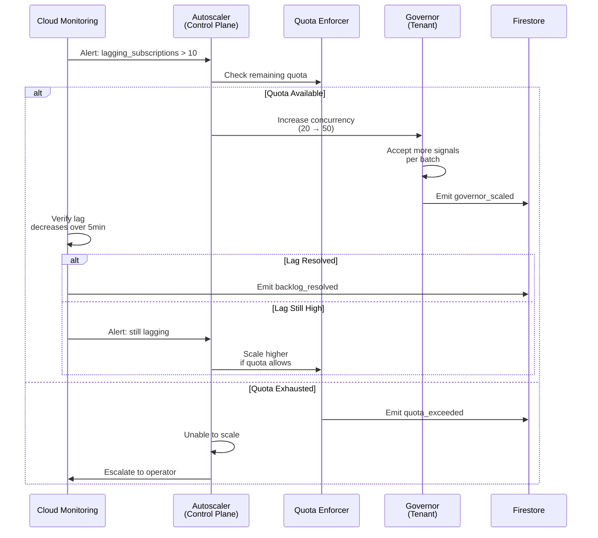
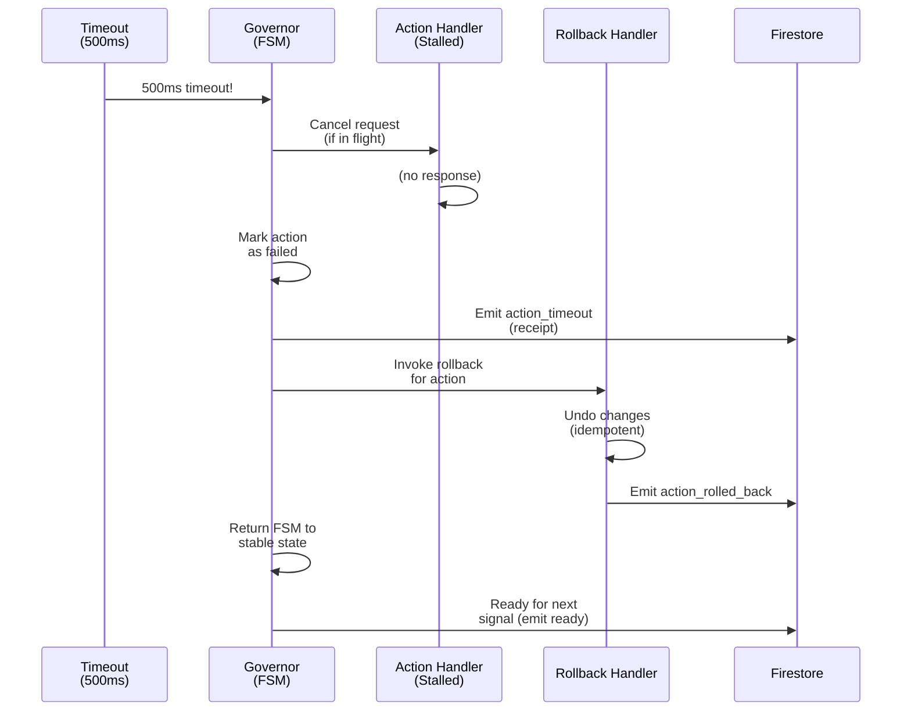
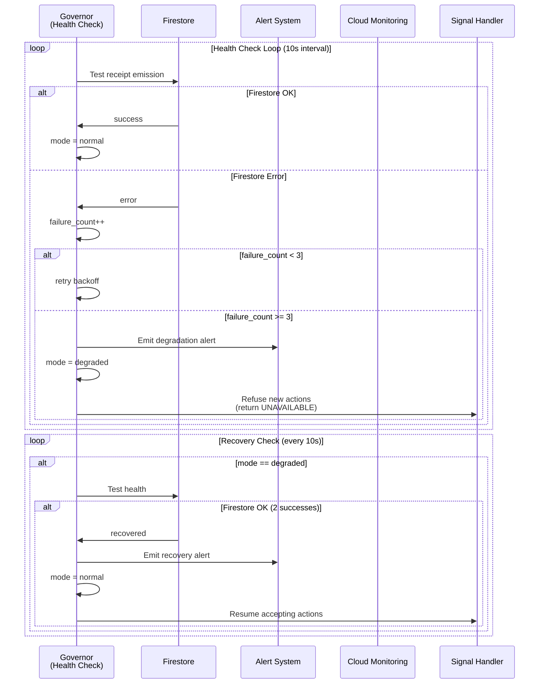
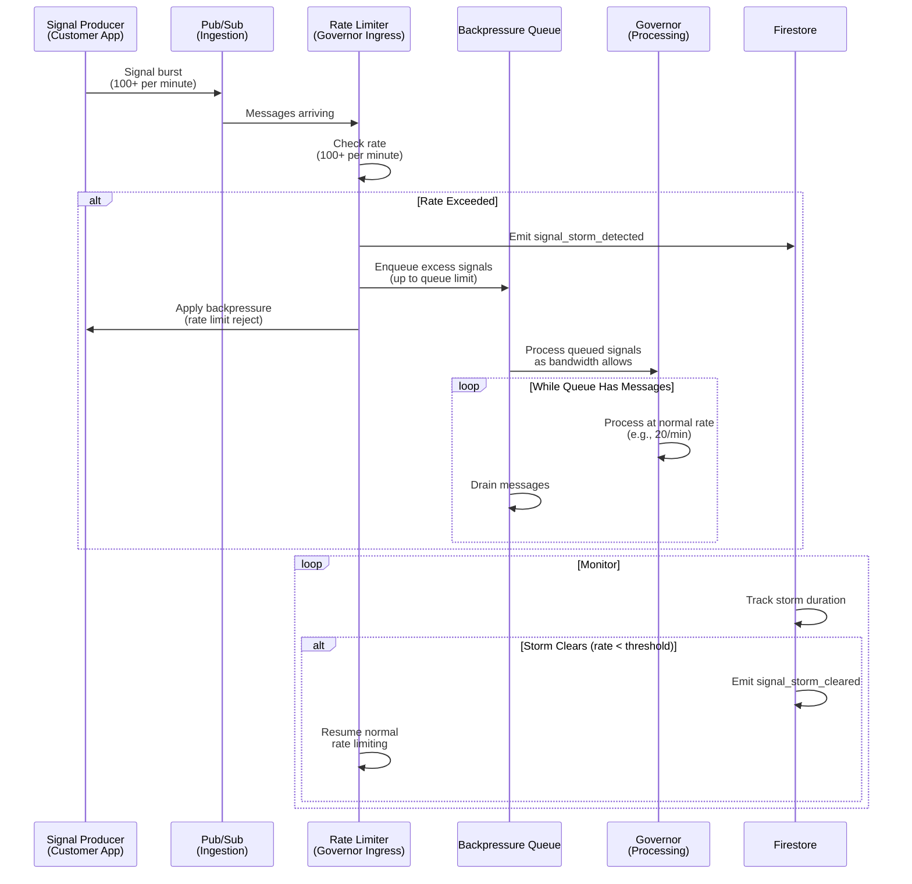
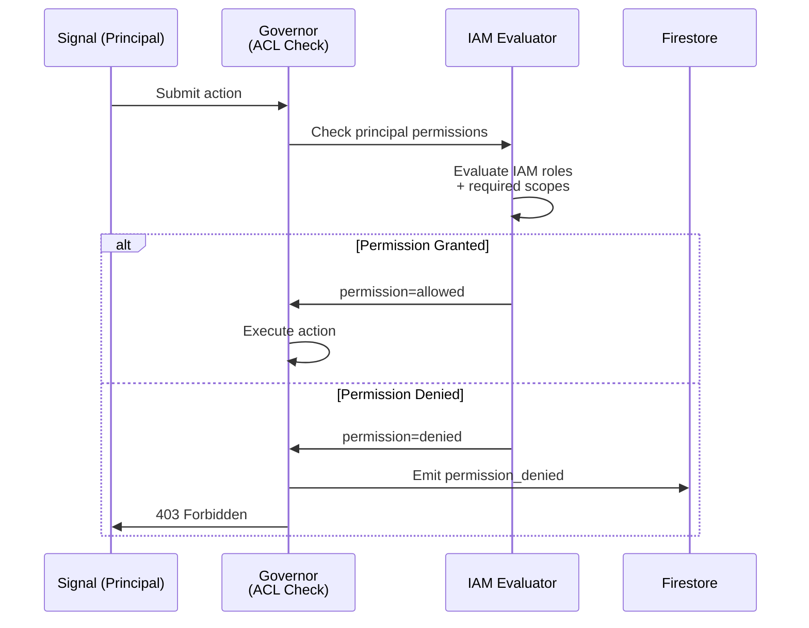
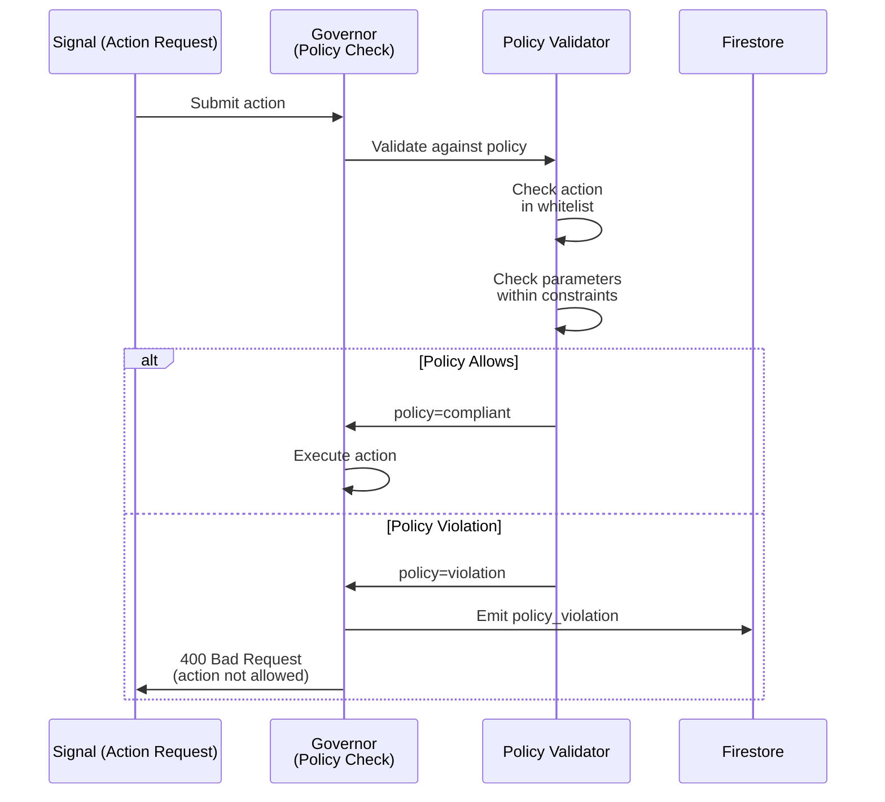
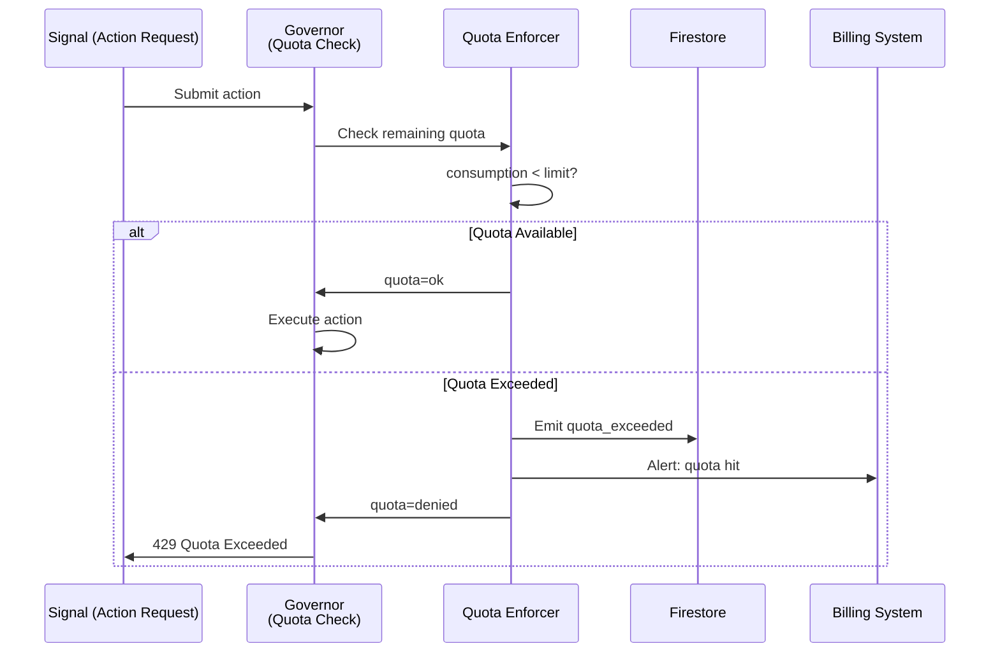
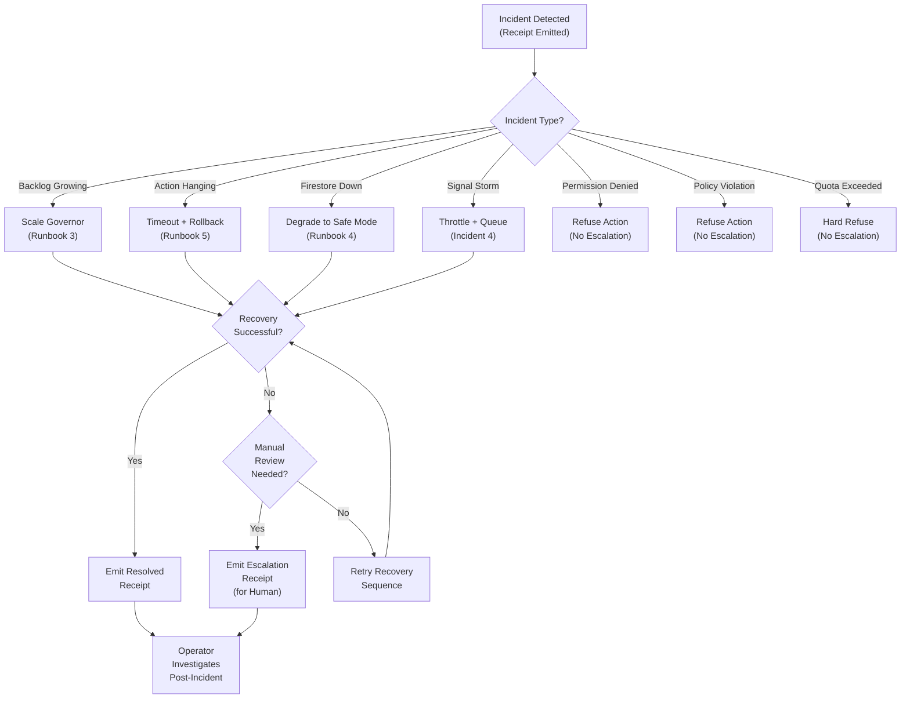

<!-- START doctoc generated TOC please keep comment here to allow auto update -->
<!-- DON'T EDIT THIS SECTION, INSTEAD RE-RUN doctoc TO UPDATE -->
**Table of Contents**

- [Incident Playbook: Autonomic Recovery Workflows](#incident-playbook-autonomic-recovery-workflows)
  - [Incident Playbook Structure](#incident-playbook-structure)
  - [Incident 1: Pub/Sub Backlog Growing](#incident-1-pubsub-backlog-growing)
  - [Incident 2: Action Hanging](#incident-2-action-hanging)
  - [Incident 3: Firestore Unavailable](#incident-3-firestore-unavailable)
  - [Incident 4: Signal Storm](#incident-4-signal-storm)
  - [Incident 5: Permission Denied](#incident-5-permission-denied)
  - [Incident 6: Policy Violation](#incident-6-policy-violation)
  - [Incident 7: Quota Exceeded](#incident-7-quota-exceeded)
  - [Incident Response Decision Tree](#incident-response-decision-tree)
  - [Receipt Verification](#receipt-verification)
  - [Definition of Done (Incident Playbook)](#definition-of-done-incident-playbook)
  - [Glossary References](#glossary-references)

<!-- END doctoc generated TOC please keep comment here to allow auto update -->

# Incident Playbook: Autonomic Recovery Workflows

**Version**: 1.0
**Last Updated**: 2026-01-25
**Author**: Agent 6 (Operations Lead)
**Status**: Production Ready

> **Core Principle**: System detects and recovers from failures automatically. Humans investigate post-incident, not in-path. Every incident emits a receipt (proof of detection and resolution).

---

## Incident Playbook Structure

Every incident follows this format:

- **Incident Type**: Category of failure
- **Symptoms**: Observable signals of the problem
- **Detection**: How system identifies the issue
- **Root Causes**: Why the problem occurs (5 Whys analysis)
- **Recovery**: Automatic recovery sequence
- **Verification**: How system confirms recovery success
- **Timeline**: Expected latency at each stage
- **Receipt Contract**: Data emitted at detection and resolution
- **Escalation**: If recovery fails, what happens next

---

## Incident 1: Pub/Sub Backlog Growing

**Symptoms**:
- Signal queue lag increasing (metrics: `lagging_subscriptions` > 10)
- Message delivery delay (P99 latency > 1s)
- Signal ingest rate flat, processing rate declining

**Detection**:
- Cloud Monitoring metric alert: `lagging_subscriptions > 10` for 60 seconds
- Governor internal queue depth tracking (per-tenant backlog)
- Pub/Sub subscription metrics (age of undelivered messages)

**Root Causes** (5 Whys):
1. Why is queue lagging? → Governor processing slower than signal arrival rate
2. Why is processing slower? → Concurrency limit (in_flight_actions) hit
3. Why hit concurrency limit? → Load increased (new signals) + no auto-scaling triggered yet
4. Why no auto-scaling? → Previous scaling threshold (100 messages) not met
5. Why keep threshold unchanged? → Need to monitor thresholds weekly (Kaizen)

**Recovery** (Automatic Sequence):



**Verification**:
- `lagging_subscriptions` metric returns to < 5 within 5 minutes
- Message age (newest undelivered) decreases
- Governor processes all pending signals within 5 minutes

**Timeline**:
1. Detection: 60 seconds (metric aggregation window)
2. Scaling decision: 5 seconds (quota check + autoscaler decision)
3. Application: 100ms (in-memory config update)
4. Backlog processing: 5 minutes (depends on load)
5. **Total incident duration**: 5-6 minutes (automatic)

**Receipt Contract** (Detection):

```json
{
  "receipt_id": "uuid",
  "timestamp": "2026-01-25T12:34:56Z",
  "incident_type": "pub_sub_backlog_growing",
  "account_id": "customer-123",
  "metric_value": 15,
  "metric_threshold": 10,
  "lagging_for_seconds": 60,
  "current_concurrency": 20,
  "recommended_concurrency": 50,
  "status": "detected"
}
```

**Receipt Contract** (Resolution):

```json
{
  "receipt_id": "uuid",
  "timestamp": "2026-01-25T12:40:12Z",
  "incident_id": "uuid-prev",
  "incident_type": "pub_sub_backlog_growing",
  "account_id": "customer-123",
  "concurrency_scaled": {
    "from": 20,
    "to": 50
  },
  "resolution_method": "auto_scale",
  "messages_processed": 847,
  "time_to_resolution_seconds": 316,
  "status": "resolved"
}
```

---

## Incident 2: Action Hanging

**Symptoms**:
- Action pending > 500ms (timeout approaching)
- Governor state machine stuck in `running` state
- Pub/Sub unacked message count increasing for this action

**Detection**:
- Governor timeout timer fires (500ms)
- Pending action duration exceeds SLI
- Action handler unresponsive (no completion message)

**Root Causes**:
1. Why did action hang? → External service (Cloud Run handler) unresponsive
2. Why unresponsive? → Network timeout / service crash / infinite loop
3. Why no health check? → Handler crashed after accepting action
4. Why no pre-check? → Action handler doesn't have readiness probe
5. Why no probe? → Need to enforce health check requirement in deployment

**Recovery** (Deterministic Sequence):



**Verification**:
- Governor FSM state returns to `stable`
- Previous action state reverted (rollback verified)
- Next signal accepted without error
- Action chain integrity maintained (no orphaned state)

**Timeline**:
1. Timeout detection: exactly 500ms (deterministic)
2. Rollback initiation: < 10ms (immediate)
3. Rollback execution: 100-300ms (depends on action complexity)
4. FSM stable state: within 400ms total
5. **Total incident duration**: < 500ms (fully automatic)

**Receipt Contract** (Timeout):

```json
{
  "receipt_id": "uuid",
  "timestamp": "2026-01-25T12:34:56Z",
  "incident_type": "action_timeout",
  "account_id": "customer-123",
  "action_id": "action-789",
  "timeout_ms": 500,
  "handler_url": "https://handler.run.app/execute",
  "error": "timeout_waiting_for_response",
  "status": "timeout_detected"
}
```

**Receipt Contract** (Rollback Complete):

```json
{
  "receipt_id": "uuid",
  "timestamp": "2026-01-25T12:34:56Z",
  "incident_id": "uuid-prev",
  "incident_type": "action_timeout",
  "account_id": "customer-123",
  "action_id": "action-789",
  "rollback_duration_ms": 250,
  "fsm_state": "stable",
  "status": "recovered"
}
```

---

## Incident 3: Firestore Unavailable

**Symptoms**:
- Receipt emission fails (Firestore API returns error)
- Health check fails consecutively (3+ failures)
- Governor cannot persist state or emit receipts

**Detection**:
- Health check probe fails (write + read test)
- Receipt emission returns error (DEADLINE_EXCEEDED, UNAVAILABLE, etc.)
- 3 consecutive health check failures trigger degradation

**Root Causes**:
1. Why Firestore unavailable? → Regional outage or quota exceeded
2. Why quota exceeded? → High receipt volume exceeded provisioned throughput
3. Why high volume? → Spiky workload (signal burst)
4. Why no rate limiting? → Rate limiter only checks quota, not throughput
5. Why allow quota to exceed? → Need to provision 2x expected peak capacity (reliability engineering)

**Recovery** (Graceful Degradation + Auto-Recovery):



**Verification**:
- Health check succeeds 2 consecutive times (eliminates flakes)
- Governor resumes normal operation (degraded flag cleared)
- Next signal accepted and processed normally
- Recovery receipt emitted with downtime duration

**Timeline**:
1. Detection: 30-40 seconds (3 failures × 10-12s with backoff)
2. Degradation: immediate (refuse all new actions)
3. Safe state: < 100ms (atomic mode switch)
4. Recovery detection: < 10 seconds (single successful health check)
5. **Total incident duration**: depends on Firestore recovery (typically 5-30 min)
6. **System safe during outage**: YES (refuses actions, emits receipts for escalation)

**Receipt Contract** (Degradation):

```json
{
  "receipt_id": "uuid",
  "timestamp": "2026-01-25T12:34:56Z",
  "incident_type": "firestore_unavailable",
  "account_id": "customer-123",
  "failure_count": 3,
  "error_code": "DEADLINE_EXCEEDED",
  "error_details": "firestore write timed out after 60s",
  "actions_refused": 0,
  "alert_severity": "critical",
  "recovery_action": "degrade_to_safe_mode",
  "status": "degraded"
}
```

**Receipt Contract** (Recovery):

```json
{
  "receipt_id": "uuid",
  "timestamp": "2026-01-25T12:44:32Z",
  "incident_id": "uuid-prev",
  "incident_type": "firestore_unavailable",
  "account_id": "customer-123",
  "downtime_seconds": 606,
  "actions_refused_during_outage": 12,
  "health_check_successes": 2,
  "status": "recovered"
}
```

**Escalation** (If unresolved > 5 minutes):
- Emit `escalation_required` receipt
- Include Firestore error details + logs
- Human operator reviews, considers failover to secondary region
- System continues operating in degraded mode (no impact to customer service)

---

## Incident 4: Signal Storm

**Symptoms**:
- Signal ingestion rate exceeds threshold (> 100 signals/minute)
- Pub/Sub message rate spike from single tenant
- Governor queue depth growing faster than processing rate

**Detection**:
- Pub/Sub subscription rate limiter triggers
- Governor internal counter: signals per minute > threshold
- Cloud Monitoring metric: `publisher_message_rates` spike

**Root Causes**:
1. Why signal storm? → Customer misconfiguration (infinite loop in signal producer)
2. Why not detected earlier? → Rate limiter threshold too high (100/min)
3. Why not corrected automatically? → No feedback loop to customer signal producer
4. Why no corrective action? → Would need intelligent signal filtering (not implemented yet)
5. Why allow storm? → Better to warn operator than silently drop signals (transparency)

**Recovery** (Throttle + Queue + Alert):



**Verification**:
- Rate limiter accepts signals at max allowed rate
- Excess signals queued (bounded by max queue size)
- Governor processes queued signals (no loss)
- Storm receipt includes: duration, signals processed, signals queued

**Timeline**:
1. Detection: < 1 second (rate counter threshold)
2. Backpressure applied: immediate (reject new signals)
3. Queue processing: depends on queue size (e.g., 100 signals @ 20/min = 5 min)
4. Storm cleared: depends on customer fixing producer
5. **Total incident duration**: 5+ minutes (depends on customer action)

**Receipt Contract** (Detection):

```json
{
  "receipt_id": "uuid",
  "timestamp": "2026-01-25T12:34:56Z",
  "incident_type": "signal_storm_detected",
  "account_id": "customer-123",
  "signal_rate_per_minute": 150,
  "rate_limit_threshold": 100,
  "queue_depth": 0,
  "max_queue_size": 1000,
  "backpressure_enabled": true,
  "status": "throttled"
}
```

**Receipt Contract** (Cleared):

```json
{
  "receipt_id": "uuid",
  "timestamp": "2026-01-25T12:40:15Z",
  "incident_id": "uuid-prev",
  "incident_type": "signal_storm_cleared",
  "account_id": "customer-123",
  "storm_duration_seconds": 360,
  "signals_received": 950,
  "signals_processed": 950,
  "signals_queued_peak": 450,
  "status": "cleared"
}
```

---

## Incident 5: Permission Denied

**Symptoms**:
- Action submission returns permission error
- Principal lacks required IAM role
- Governor refuses action (explicit)

**Detection**:
- IAM permission check before action submission
- Governor ACL evaluation fails
- Principal missing required scope/role

**Root Causes**:
1. Why permission denied? → Principal role changed (expired, revoked)
2. Why no pre-check? → Principal created action, permissions assumed valid
3. Why assume valid? → IAM role should be long-lived
4. Why not long-lived? → Admin revoked access (intentional security action)
5. Why allow action submission? → Better to refuse explicitly than allow unauthorized action

**Recovery** (Explicit Refusal + No Escalation):



**Verification**:
- Action refused (not queued, not partially executed)
- Receipt emitted with principal identity + denied permission
- Governor continues operating normally
- Next signal from different principal accepted (no cross-contamination)

**Timeline**:
1. Detection: < 100ms (IAM check)
2. Refusal: < 1ms (immediate response)
3. **Total incident duration**: < 100ms (not an incident, just a denial)

**Receipt Contract**:

```json
{
  "receipt_id": "uuid",
  "timestamp": "2026-01-25T12:34:56Z",
  "incident_type": "permission_denied",
  "account_id": "customer-123",
  "action_type": "compute.instances.create",
  "principal": "user:alice@example.com",
  "required_role": "roles/compute.admin",
  "granted_roles": ["roles/viewer"],
  "iam_check_time_ms": 45,
  "status": "denied"
}
```

---

## Incident 6: Policy Violation

**Symptoms**:
- Action submitted violates policy constraints
- Policy pack validation fails
- Action not in approved action list

**Detection**:
- Governor policy validator rejects action
- Action not in policy whitelist
- Action parameters violate constraints

**Root Causes**:
1. Why policy violation? → Customer signal producer not updated with new policy
2. Why not updated? → Policy change broadcast, but client cache stale
3. Why stale cache? → Client didn't receive policy update notification
4. Why no notification? → No callback mechanism to notify clients
5. Why no callback? → Could implement webhook for policy changes (future work)

**Recovery** (Explicit Refusal + Policy Compliance Maintained):



**Verification**:
- Action refused (not queued)
- Receipt includes: action type, violated constraint, policy version
- Governor continues operating normally
- Customer updates signal producer with correct action types

**Timeline**:
1. Detection: < 100ms (policy validation)
2. Refusal: < 1ms
3. **Total incident duration**: < 100ms (not an incident)

**Receipt Contract**:

```json
{
  "receipt_id": "uuid",
  "timestamp": "2026-01-25T12:34:56Z",
  "incident_type": "policy_violation",
  "account_id": "customer-123",
  "action_type": "compute.instances.delete",
  "policy_version": "1.2.3",
  "violation_reason": "action_not_in_whitelist",
  "allowed_actions": ["compute.instances.create", "compute.instances.start"],
  "policy_check_time_ms": 25,
  "status": "denied"
}
```

---

## Incident 7: Quota Exceeded

**Symptoms**:
- Monthly action limit exhausted
- Quota enforcer refuses new actions
- Customer hit spending cap or usage limit

**Detection**:
- Quota enforcer checks consumption against limit
- Remaining quota <= 0
- Action submission blocked (no execution)

**Root Causes**:
1. Why quota exceeded? → Customer usage higher than expected
2. Why not monitored? → Quota metrics not regularly reviewed
3. Why not alerted? → Alert threshold set too high (100% usage)
4. Why wait until 100%? → Need to alert at 80%, then 90%, then 100%
5. Why no escalation? → Quota enforcement is hard stop; no escalation needed

**Recovery** (Hard Refuse + Billing Alert):



**Verification**:
- Action refused
- Receipt includes: consumption, limit, overage amount
- Governor continues operating (but refuses new actions)
- Billing alert sent to customer (or auto-upgrade if configured)

**Timeline**:
1. Detection: < 50ms (quota check)
2. Refusal: immediate
3. **Total incident duration**: < 50ms

**Receipt Contract**:

```json
{
  "receipt_id": "uuid",
  "timestamp": "2026-01-25T12:34:56Z",
  "incident_type": "quota_exceeded",
  "account_id": "customer-123",
  "quota_type": "monthly_actions",
  "limit": 10000,
  "consumed": 10000,
  "requested": 1,
  "overage_amount": 1,
  "billing_alert_sent": true,
  "status": "denied"
}
```

**No Escalation**: Quota enforcement is deterministic; customer must upgrade or wait for quota reset.

---

## Incident Response Decision Tree



---

## Receipt Verification

All incident receipts include:

- **receipt_id**: Unique identifier (UUID)
- **timestamp**: ISO 8601 timestamp
- **incident_type**: Category (7 types above)
- **account_id**: Customer identifier
- **status**: One of: detected, in_progress, resolved, escalated
- **duration_seconds** (for resolved): Time from detection to resolution
- **actions_taken**: Array of recovery steps executed

Verification:

```bash
# Verify incident receipt
ggen verify-receipt --receipt-id uuid --incident-type pub_sub_backlog_growing

# Export incident ledger (last 24 hours)
ggen export-incidents --since 24h --format json
```

---

## Definition of Done (Incident Playbook)

- [ ] 7 incident types documented with symptoms and root causes
- [ ] Detection mechanism specified (metric, timer, error code)
- [ ] Recovery sequence shown in Mermaid flowchart
- [ ] Automatic recovery without human blocking (or escalation explicit)
- [ ] Timeline documented for each stage (detection, recovery, verification)
- [ ] SLI targets specified (e.g., "< 5 minutes total")
- [ ] Receipt contract includes receipt_id, timestamp, incident_type, status
- [ ] No silent failures (all errors explicit in receipts)
- [ ] Verification step defined (how system confirms recovery)
- [ ] Escalation path clear (when does human need to act?)
- [ ] Cross-referenced in runbooks (Incident 1 → Runbook 3 mapping)
- [ ] Tested with chaos engineering (inject failures, verify recovery)
- [ ] Load-tested (concurrent incidents, cascading failures)

---

## Glossary References

- **Incident**: Failure detected and recovered automatically
- **Receipt**: Proof of incident detection and recovery
- **SLI**: Measurable incident recovery target (e.g., < 5 min)
- **Escalation**: Human review needed (incident auto-recovery failed)
- **Jidoka**: System stops and emits alert (no silent failures)
- **Root Cause**: Why incident occurred (5 Whys analysis)

See `/docs/glossary.md` for complete terminology.

---

**Status**: READY FOR PRODUCTION
**Next Review**: 2026-04-25 (quarterly)
**Training**: All operators must complete incident playbook training before handling escalations.
