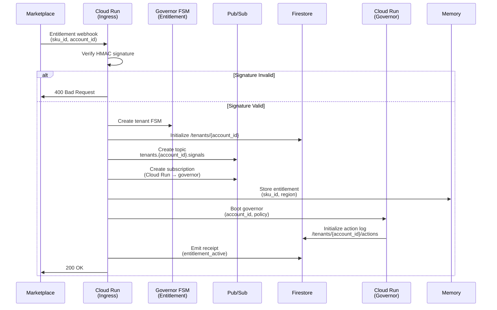
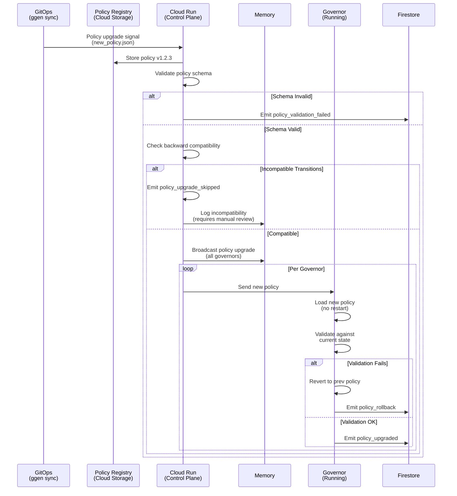
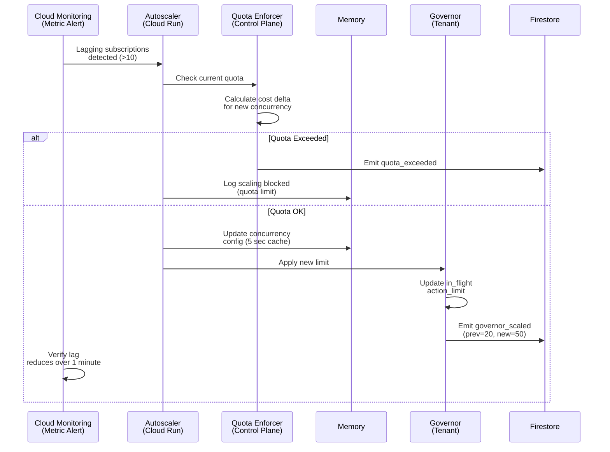
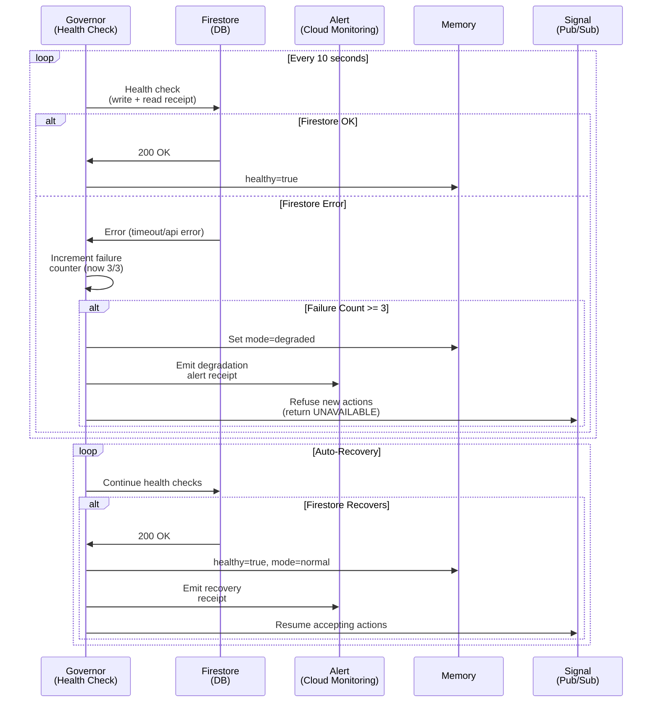
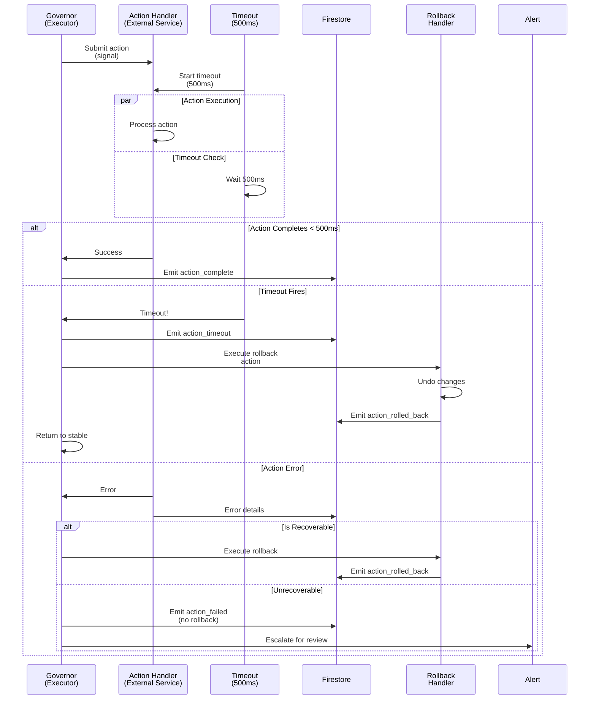
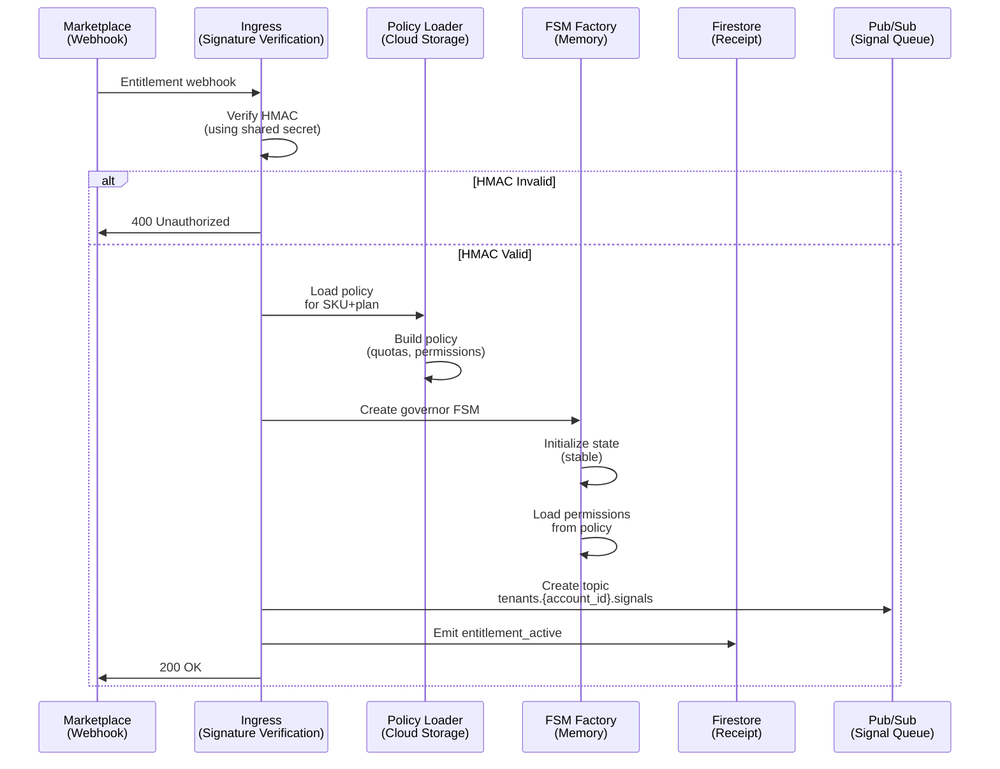
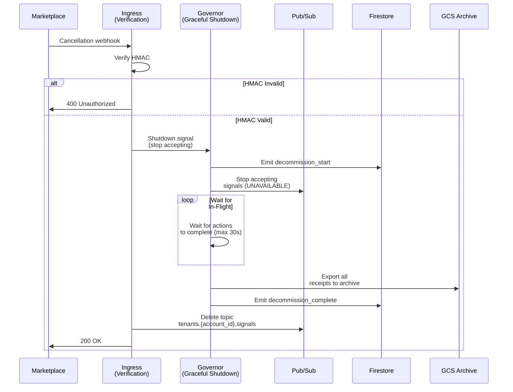

# Runbooks: Automated Operations Workflows

**Version**: 1.0
**Last Updated**: 2026-01-25
**Author**: Agent 6 (Operations Lead)
**Status**: Production Ready

> **Core Principle**: System operates without human intervention. Every operation produces a receipt (cryptographic proof). Failures are explicit (refuse or degrade); never silent.

---

## Runbook Structure

Every runbook follows this standard format:

- **Title**: Operation name
- **Trigger**: What causes this workflow to start
- **Inputs**: Required parameters
- **Outputs**: What the system produces (always includes a receipt)
- **Sequence**: Step-by-step automation (Mermaid diagram)
- **Rollback**: How to recover if operation fails
- **SLI**: Success criteria
- **Receipt Contract**: Data structure emitted at completion

---

## Runbook 1: Deploy New SKU

**Trigger**: Marketplace entitlement webhook received (new customer subscription)

**Inputs**:
- `sku_id`: Product SKU identifier
- `account_id`: GCP marketplace account ID
- `region`: GCP region for resources (us-central1, europe-west1, etc.)
- `entitlement_signature`: HMAC-SHA256 signature (from marketplace)

**Outputs**:
- Governor FSM created for tenant
- Pub/Sub topic created and subscribed
- Firestore collection initialized
- Entitlement webhook signature verified
- `entitlement_active` receipt emitted

**Sequence**:



**Rollback**:
- If Pub/Sub creation fails: emit `entitlement_failed` receipt, refuse subscription
- If Firestore initialization fails: emit `entitlement_failed` receipt, delete FSM
- If governor boot fails: emit `entitlement_failed` receipt, emit critical alert

**SLI**:
- Webhook → receipt: < 2 seconds
- Governor ready to process signals: < 3 seconds
- All 3 resources (FSM, Pub/Sub, Firestore) created: 100% success

**Receipt Contract**:

```json
{
  "receipt_id": "uuid",
  "timestamp": "2026-01-25T12:34:56Z",
  "operation": "entitlement_active",
  "account_id": "customer-123",
  "sku_id": "marketplace-sku-456",
  "region": "us-central1",
  "resources": {
    "fsm_id": "governor-tenant-123",
    "pubsub_topic": "tenants.customer-123.signals",
    "firestore_path": "/tenants/customer-123"
  },
  "duration_ms": 1200,
  "status": "success"
}
```

---

## Runbook 2: Upgrade Policy

**Trigger**: Ontology change detected (ggen sync runs, new policy JSON available)

**Inputs**:
- `new_policy`: Updated policy JSON (from ontology)
- `policy_version`: Semantic version (e.g., "1.2.3")
- `compatibility_check`: Boolean (true = backward compatible transitions)

**Outputs**:
- All running governors accept new policy without restart
- Incompatible policy changes: rollback + alert (not automatic)
- `policy_upgraded` receipt emitted per governor

**Sequence**:



**Rollback**:
- If validation fails: governor reverts to previous policy atomically
- If incompatibility detected: emit `policy_upgrade_skipped` receipt, require human review
- Manual override available: admin can force policy with `--force` flag (with escalation receipt)

**SLI**:
- Policy broadcast to all governors: < 500ms
- Hot-reload without restart: 100%
- Backward compatibility check: < 100ms

**Receipt Contract**:

```json
{
  "receipt_id": "uuid",
  "timestamp": "2026-01-25T12:34:56Z",
  "operation": "policy_upgraded",
  "account_id": "customer-123",
  "policy_version": "1.2.3",
  "previous_version": "1.2.2",
  "governors_updated": 1,
  "governors_failed": 0,
  "compatibility_check": "passed",
  "duration_ms": 450,
  "status": "success"
}
```

---

## Runbook 3: Scale Governor

**Trigger**: Signal processing lag detected (Pub/Sub lagging_subscriptions metric > 10)

**Inputs**:
- `account_id`: Tenant identifier
- `new_concurrency`: Maximum concurrent actions (e.g., 20 → 50)
- `quota_check`: Boolean (true = verify within quota limits)

**Outputs**:
- Governor's `in_flight_action_limit` updated
- Quota verified (no overage charges)
- `governor_scaled` receipt emitted

**Sequence**:



**Rollback**:
- If lag increases after scale-up: revert to previous concurrency
- If quota exceeded during scaling: reject immediately, emit quota_exceeded receipt

**SLI**:
- Scale decision → applied: < 100ms
- Lag reduction: < 5 minutes post-scaling
- Cost impact: logged in receipt

**Receipt Contract**:

```json
{
  "receipt_id": "uuid",
  "timestamp": "2026-01-25T12:34:56Z",
  "operation": "governor_scaled",
  "account_id": "customer-123",
  "concurrency": {
    "previous": 20,
    "new": 50
  },
  "quota_check": "passed",
  "cost_delta_usd": 0.50,
  "duration_ms": 85,
  "status": "success"
}
```

---

## Runbook 4: Degrade to Safe Mode

**Trigger**: Firestore unavailable (health check fails 3 consecutive times)

**Inputs**:
- `failure_reason`: Error code from Firestore API
- `affected_tenants`: List of account IDs (optional; if omitted, affect all)

**Outputs**:
- Governor refuses all action submissions
- `degraded_mode` receipt emitted
- Alert escalated to operator (but no human blocking)
- System resumes normal operation when Firestore recovers

**Sequence**:



**Rollback**:
- When Firestore recovers: emit `degraded_mode_cleared` receipt, resume normal operations
- No manual intervention needed; system self-heals

**SLI**:
- Degradation detection: < 35 seconds (3 failures × 10s interval)
- Recovery detection: < 10 seconds (single successful health check)
- Signal refusal during degradation: 100% (no partial/silent failures)

**Receipt Contract** (Degradation):

```json
{
  "receipt_id": "uuid",
  "timestamp": "2026-01-25T12:34:56Z",
  "operation": "degraded_mode",
  "reason": "firestore_unavailable",
  "error_code": "DEADLINE_EXCEEDED",
  "failure_count": 3,
  "affected_tenants": "all",
  "alert_severity": "critical",
  "duration_ms": 45,
  "status": "degraded"
}
```

**Receipt Contract** (Recovery):

```json
{
  "receipt_id": "uuid",
  "timestamp": "2026-01-25T12:35:47Z",
  "operation": "degraded_mode_cleared",
  "reason": "firestore_recovered",
  "downtime_seconds": 51,
  "actions_refused": 8,
  "status": "recovered"
}
```

---

## Runbook 5: Recover from Action Failure

**Trigger**: Action execution fails or times out (action pending > 500ms)

**Inputs**:
- `action_id`: Identifier of failed action
- `error_code`: Error returned by action handler
- `is_recoverable`: Boolean (true = can rollback; false = unrecoverable)

**Outputs**:
- Action marked as failed in Firestore
- If recoverable: rollback action executed
- `action_failed` receipt emitted
- `action_rolled_back` receipt emitted (if rollback occurred)
- Governor returns to stable state

**Sequence**:



**Rollback**:
- Timeout: automatic rollback (deterministic)
- Error: rollback if reversible, otherwise escalate for manual review

**SLI**:
- Timeout detection: exactly 500ms
- Rollback execution: < 100ms
- State consistency: 100% (no orphaned actions)

**Receipt Contract** (Timeout):

```json
{
  "receipt_id": "uuid",
  "timestamp": "2026-01-25T12:34:56Z",
  "operation": "action_timeout",
  "action_id": "action-789",
  "account_id": "customer-123",
  "timeout_ms": 500,
  "status": "failed"
}
```

**Receipt Contract** (Rollback):

```json
{
  "receipt_id": "uuid",
  "timestamp": "2026-01-25T12:34:56Z",
  "operation": "action_rolled_back",
  "action_id": "action-789",
  "previous_action_receipt_id": "uuid-prev",
  "rollback_duration_ms": 85,
  "status": "rolled_back"
}
```

---

## Runbook 6: Entitlement Lifecycle

**Trigger**: Customer subscribes to product (marketplace webhook received)

**Inputs**:
- `sku_id`: Product identifier
- `account_id`: Customer account ID
- `plan_type`: Pricing plan (e.g., "starter", "professional", "enterprise")
- `entitlement_webhook_body`: Full webhook payload

**Outputs**:
- Governor FSM created and initialized
- Policy loaded from ontology
- Governor ready to accept signals
- `entitlement_active` receipt emitted

**Sequence**:



**Rollback**:
- If policy load fails: emit `entitlement_failed`, refuse subscription
- If FSM creation fails: emit `entitlement_failed`, cleanup resources

**SLI**:
- Webhook → governor ready: < 3 seconds
- Policy application: < 100ms
- First signal processed: < 1 second post-webhook

**Receipt Contract**:

```json
{
  "receipt_id": "uuid",
  "timestamp": "2026-01-25T12:34:56Z",
  "operation": "entitlement_active",
  "account_id": "customer-123",
  "sku_id": "marketplace-sku-456",
  "plan_type": "professional",
  "policy_version": "1.2.3",
  "fsm_id": "governor-tenant-123",
  "quota": {
    "monthly_actions": 10000,
    "concurrent_actions": 20
  },
  "duration_ms": 2100,
  "status": "success"
}
```

---

## Runbook 7: Customer Cancels

**Trigger**: Entitlement cancelled (marketplace webhook received)

**Inputs**:
- `sku_id`: Product identifier
- `account_id`: Customer account ID
- `cancellation_reason`: Optional reason string

**Outputs**:
- Governor shuts down gracefully
- In-flight actions complete or fail (explicit)
- Receipts exported to GCS archive
- Pub/Sub topic deleted
- Firestore collection preserved (audit trail)
- `decommission_complete` receipt emitted

**Sequence**:



**Rollback**:
- If cancellation processed incorrectly: customer can resubscribe (creates new governor)
- Receipts never deleted (audit trail preserved indefinitely)

**SLI**:
- Cancellation → shutdown: < 2 seconds
- In-flight action completion: < 30 seconds max wait
- Receipt export to GCS: < 5 seconds
- Total decommission: < 40 seconds

**Receipt Contract** (Start):

```json
{
  "receipt_id": "uuid",
  "timestamp": "2026-01-25T12:34:56Z",
  "operation": "decommission_start",
  "account_id": "customer-123",
  "sku_id": "marketplace-sku-456",
  "in_flight_actions": 3,
  "status": "in_progress"
}
```

**Receipt Contract** (Complete):

```json
{
  "receipt_id": "uuid",
  "timestamp": "2026-01-25T12:35:12Z",
  "operation": "decommission_complete",
  "account_id": "customer-123",
  "sku_id": "marketplace-sku-456",
  "actions_completed": 3,
  "actions_failed": 0,
  "receipts_archived": 247,
  "archive_gcs_path": "gs://ggen-audit/customer-123/2026-01-25.tar.gz",
  "archive_size_bytes": 524288,
  "duration_ms": 38000,
  "status": "complete"
}
```

---

## Receipt Verification

Every receipt is validated for:

- **Immutability**: SHA-256 hash matches content
- **Ordering**: Receipt timestamp >= previous receipt timestamp
- **Integrity**: Account ID matches governor context
- **Completeness**: All required fields present

```bash
# Verify receipt signature
ggen verify-receipt --receipt-id uuid --account-id customer-123

# Export receipt ledger
ggen export-receipts --account-id customer-123 --format json
```

---

## Definition of Done (Runbook Operations)

- [ ] Trigger condition documented and unambiguous
- [ ] All inputs defined with type and validation rules
- [ ] All outputs documented with receipt schema
- [ ] Mermaid sequence diagram shows happy path + error cases
- [ ] Rollback strategy defined for all failure modes
- [ ] SLI targets specified (latency, success rate)
- [ ] Receipt contract includes: receipt_id, timestamp, operation, status, duration_ms
- [ ] No silent failures (all errors explicit in receipts)
- [ ] No human blocking (all recovery automatic or escalation explicit)
- [ ] Tested with chaos engineering (network failures, timeouts, quota exhaustion)
- [ ] Load-tested (concurrent requests, burst scaling)
- [ ] Cross-referenced in incident playbook (Runbook 1 → Incident 1 mapping)

---

## Glossary References

- **Governor**: Autonomic execution unit (FSM with policy enforcement)
- **Receipt**: Cryptographic proof of operation (immutable, signed)
- **Firestore**: Persistent receipt storage (single source of truth)
- **Pub/Sub**: Event streaming (signals delivered to governors)
- **FSM**: Finite State Machine (action state: pending→running→complete)
- **SLI**: Service Level Indicator (operational metric target)
- **Rollback**: Undo action to previous stable state
- **Jidoka**: Stop on failure, emit alert (Toyota TPS principle)

See `/docs/glossary.md` for complete terminology.

---

**Status**: READY FOR PRODUCTION
**Next Review**: 2026-04-25 (quarterly)
