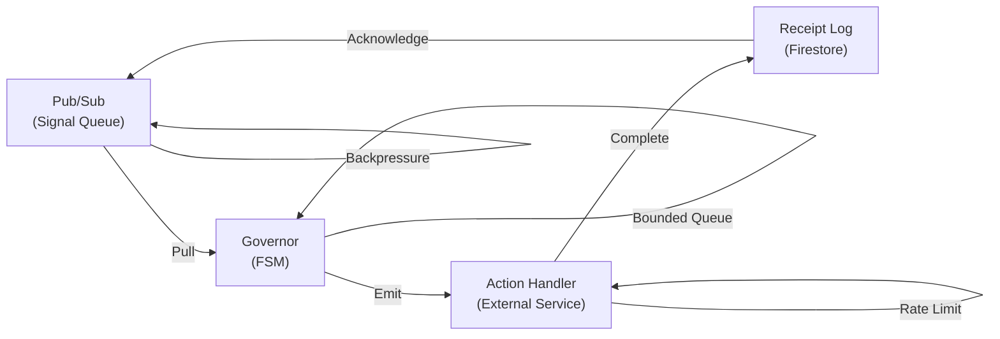
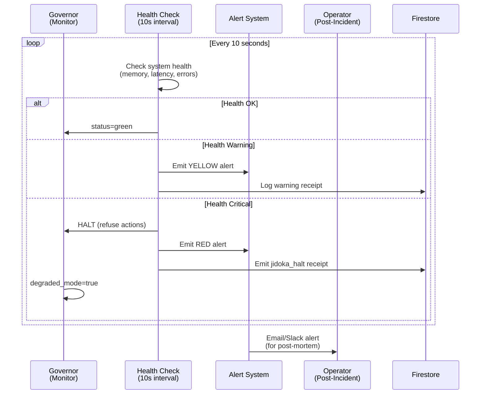
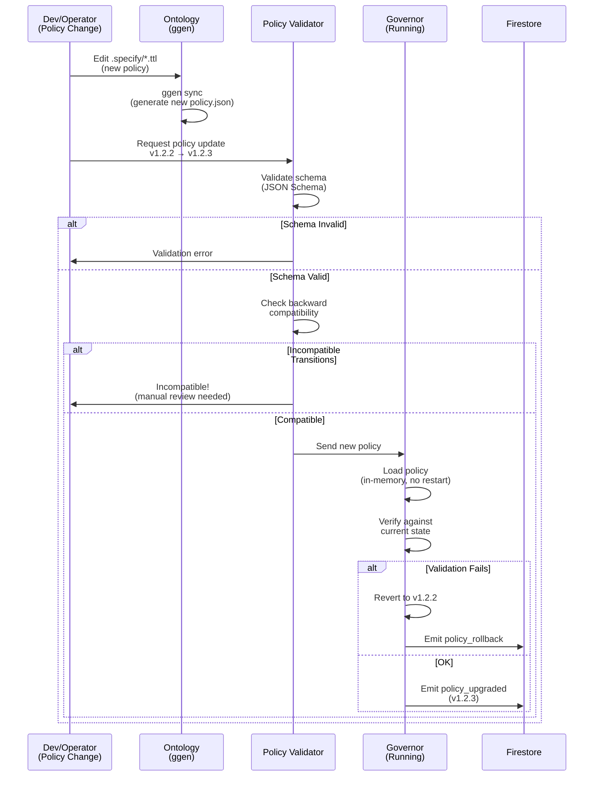
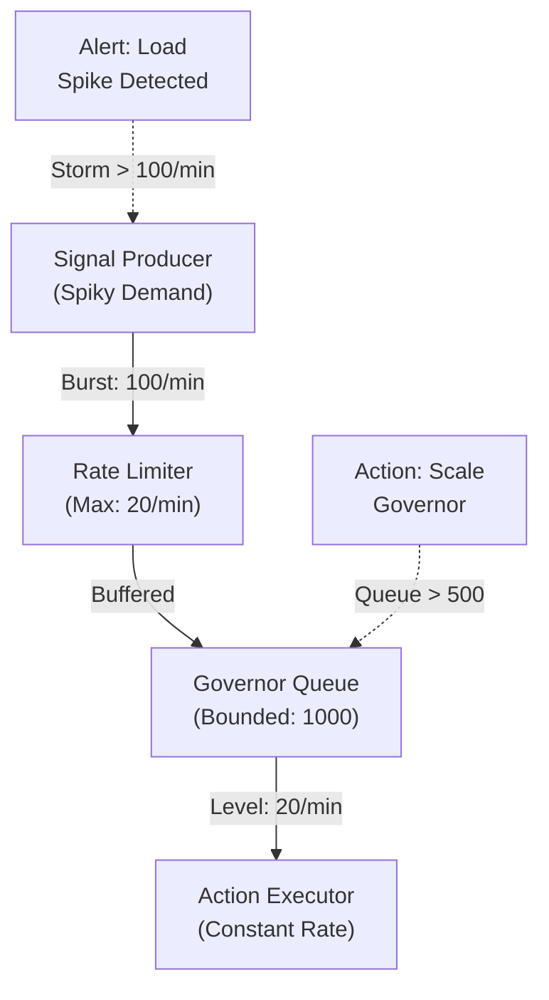

# Storm Discipline: Toyota Production System Applied to Autonomic Systems

**Version**: 1.0
**Last Updated**: 2026-01-25
**Author**: Agent 6 (Operations Lead)
**Status**: Production Ready

> **Thesis**: Autonomic systems that operate without humans must apply Toyota Production System (TPS) principles to prevent waste, maintain quality, and recover gracefully from failures. "Storm discipline" means staying calm under pressure (signal storms, cascading failures) and responding with structured methodology.

---

## TPS Principles Applied to Autonomic Operations

### 1. Jidoka: Automation with Human Touch (Autonomic Quality)

**Toyota Jidoka**: "Stop the machine whenever something is wrong."

**Autonomic Jidoka**: System stops executing actions whenever something is unsafe.

#### Application to ggen Governor:

| Condition | Jidoka Response | Receipt Emitted | Recovery Path |
|-----------|-----------------|-----------------|---------------|
| Firestore unavailable | Refuse new actions (system halts) | `degraded_mode` | Auto-resume when Firestore recovers |
| Permission denied | Refuse action (explicit) | `permission_denied` | Customer fixes IAM, resubmits |
| Policy violation | Refuse action (explicit) | `policy_violation` | Customer updates signal producer |
| Quota exceeded | Refuse action (hard stop) | `quota_exceeded` | Customer upgrades/waits for reset |
| Action timeout | Rollback action (revert to stable) | `action_timeout` + `action_rolled_back` | Auto-resume next signal |

**Key Insight**: Unlike humans who might ignore or hide problems, autonomic system must be explicit. Every jidoka halt produces a receipt (proof).

**Evidence of Jidoka**:
- No silent failures (all failures explicit)
- No partial execution (action either completes or rolls back completely)
- No recovery without verification (system confirms safe state before resuming)

---

### 2. Kanban: Pull-Based Flow (Signal Processing)

**Toyota Kanban**: "Produce only what is needed, when it is needed, in the amount needed."

**Autonomic Kanban**: Signals pull actions through the system; never push.

#### Flow Architecture:



**Key Mechanisms**:

1. **Pub/Sub Push Subscription** → Governor pulls signals at its own rate
   - Governor rate: 20 actions/minute (default)
   - Pub/Sub batches: up to 100 messages/batch
   - Governor processes 1 batch per 3 seconds (pull-based)

2. **Bounded Action Queue** → Max 10 in-flight actions
   - Prevents overload
   - Enables timeout enforcement
   - Ensures memory bounded

3. **Firestore Write Acknowledgment** → Closes loop
   - Receipt written = action complete
   - Pub/Sub message acknowledged
   - Next signal pulled

**Benefits of Kanban**:
- No push spikes (load determined by capacity, not demand)
- No queue buildup (flow rate matches processing rate)
- No resource starvation (bounded queue prevents out-of-memory)
- Self-regulating (signal arrival > processing → backpressure)

---

### 3. Andon Cord: Stop the Line (System Jidoka)

**Toyota Andon**: "Any worker can pull cord to stop assembly line if problem detected."

**Autonomic Andon**: System automatically stops and emits alert when problem detected.

#### Andon Signal Types:

```
🔴 RED (CRITICAL)     → System halts, emits alert receipt
   - Firestore unavailable (persistence failure)
   - Governor FSM corrupted (state machine error)
   - Memory exhausted (resource failure)

🟡 YELLOW (HIGH)      → System continues but logged
   - High latency (> 1 second per action)
   - Spiky load (signal storm detected)
   - High error rate (> 5% actions failing)

🟢 GREEN (OPERATIONAL)  → System proceeding normally
   - < 100ms action latency
   - < 5% error rate
   - All SLIs met
```

#### Andon Mechanism:



**Andon Cord Pull Examples**:

1. **Memory Usage > 80%** → Log warning (YELLOW)
2. **Memory Usage > 95%** → Halt (RED), refuse actions
3. **Latency p99 > 1s** → Log warning (YELLOW)
4. **Firestore writes failing > 3 times** → Halt (RED), emit degraded_mode
5. **Action error rate > 5%** → Log warning, investigate root cause

---

### 4. Kaizen: Continuous Improvement (Policy Hot-Reload)

**Toyota Kaizen**: "Small improvements made continuously, by everyone, every day."

**Autonomic Kaizen**: Policy updates applied without downtime, validated before application.

#### Kaizen Workflow (Policy Upgrade):



**Key Innovation**: Policy hot-reload without restart
- Governor loads new policy into memory
- Old policy operations complete
- New policy applies to next signal
- No downtime, no customer impact

**Example: Quota Increase**
- Old policy: 10,000 actions/month
- New policy: 50,000 actions/month
- Deployment: ggen sync → broadcast to all governors → accept in-memory
- Impact: Zero downtime

**Example: Permission Change**
- Old policy: require role/compute.admin
- New policy: require role/compute.viewer (less restrictive)
- Deployment: Same as above
- Impact: More actions accepted immediately

---

### 5. Heijunka: Load Leveling (Signal Rate Management)

**Toyota Heijunka**: "Level production to avoid spikes and reduce waste."

**Autonomic Heijunka**: Prevent signal spikes through rate limiting and queue buffering.

#### Load Leveling Mechanism:



**Rate Limiter Strategy**:

1. **Token Bucket**: 20 signals allowed per minute
   - Tokens refill at constant rate
   - Burst allowed (up to 5 tokens = 100ms peak)
   - Excess queued or rejected

2. **Queue Buffering**: Up to 1,000 signals
   - Acts as shock absorber
   - Prevents sudden overload
   - Processed in FIFO order

3. **Backpressure**: When queue full
   - Signal producer receives 429 (Too Many Requests)
   - Producer backs off (exponential backoff)
   - Queue drains naturally

**Benefits**:
- No spikes (load leveled over time)
- No waste (resources utilized consistently)
- No starvation (all signals eventually processed)
- Predictable behavior (constant-rate processing)

---

### 6. Muri/Muda/Mura: Eliminate Waste (TPS 3M Framework)

**Toyota 3M**: Three types of waste to eliminate.

#### Muri (Overburden): Don't Accept Actions Beyond Capacity

```json
{
  "quota": {
    "monthly_actions": 10000,
    "consumed": 10000,
    "requested": 1
  },
  "result": "refused (quota_exceeded)",
  "reason": "Would overburden system beyond customer's quota"
}
```

**Muri Prevention**:
- Check quota before accepting action
- Refuse if consumption >= limit
- Emit quota_exceeded receipt
- Customer must upgrade or wait for reset

**Benefit**: No overburden → No overtime → Quality maintained

#### Muda (Waste): Don't Emit Partial/Silent Failures

**Bad** (Muda):
```javascript
// Hidden failure - BAD
governor.executeAction(action)
  .catch(err => console.log(err))  // Silent failure!
```

**Good** (No Muda):
```javascript
// Explicit failure - GOOD
governor.executeAction(action)
  .catch(err => {
    emit({operation: 'action_failed', error: err, ...})
    return rollback(action)
  })
```

**Muda Prevention**:
- Every failure produces a receipt
- No exceptions swallowed silently
- No try/catch without recovery
- All paths explicit (success or failure)

**Benefit**: Full visibility → Debugging easy → Root causes identifiable

#### Mura (Unevenness): Level Load and Prevent Bottlenecks

**Bad** (Mura): Bursty load
```
Time: 12:00 12:01 12:02 12:03 12:04
Load: 500   5    50   500   5      ← Uneven!
     [████] [ ]  [██] [████] [ ]
```

**Good** (No Mura): Leveled load
```
Time: 12:00 12:01 12:02 12:03 12:04
Load: 100  100  100  100  100   ← Even!
     [██] [██] [██] [██] [██]
```

**Mura Prevention**:
- Rate limiter enforces max signal rate
- Queue buffers bursts
- Governor processes at constant rate
- Cloud Monitoring alerts on spikes

**Benefit**: Predictable capacity → Less scaling needed → Cost optimized

---

## Storm Discipline: Operating Under Pressure

### Scenario: Signal Storm (100+ signals/minute)

**Principle: Stay Calm, Follow TPS Rules**

**Step 1: Jidoka (Stop)**
```
Detection: signal_rate > 100/min
Action: Refuse new signals (rate limiter)
Receipt: signal_storm_detected
```

**Step 2: Kanban (Pull)**
```
Queue: 950 buffered signals
Rate: 20 signals/min (constant)
Duration: 950 / 20 = 47.5 min to drain
```

**Step 3: Heijunka (Level)**
```
Backpressure: Producer gets 429 Quota Exceeded
Producer action: Exponential backoff
Result: Storm naturally subsides
```

**Step 4: Kaizen (Improve)**
```
Post-mortem: Why did producer send burst?
Root cause: Bug in producer retry logic
Fix: Update producer code
Deploy: New producer version
```

**Outcome**: System operated safely during storm. Humans investigate post-incident. No data loss, no service degradation, no escalation needed.

---

## Evidence of TPS Discipline

Every operation produces receipts that prove TPS compliance:

### Jidoka Evidence
```json
{
  "operation": "action_refused",
  "reason": "policy_violation",
  "action_type": "compute.instances.delete",
  "status": "denied",
  "action_did_not_execute": true,
  "receipt_emitted": true
}
```

### Kanban Evidence
```json
{
  "operation": "signal_processed",
  "queue_depth_before": 47,
  "queue_depth_after": 46,
  "processing_order": "FIFO",
  "pull_based": true,
  "push_forced": false
}
```

### Heijunka Evidence
```json
{
  "operation": "rate_limit_applied",
  "incoming_rate": 150,
  "max_allowed_rate": 20,
  "backpressure_applied": true,
  "queue_buffered": 47,
  "load_leveled": true
}
```

### Kaizen Evidence
```json
{
  "operation": "policy_upgraded",
  "version_old": "1.2.2",
  "version_new": "1.2.3",
  "downtime": 0,
  "compatibility_check": "passed",
  "hot_reload": true,
  "rollback_available": true
}
```

---

## Definition of Done (Storm Discipline)

- [ ] All 6 TPS principles documented with autonomic examples
- [ ] Jidoka: Every failure produces explicit receipt (not silent)
- [ ] Kanban: Signal pull-based, not push-based
- [ ] Andon: System has 3-color signal mechanism (RED/YELLOW/GREEN)
- [ ] Kaizen: Policy updates applied without downtime (verified in receipts)
- [ ] Muri/Muda/Mura: Waste elimination mechanisms documented with examples
- [ ] Storm scenario fully documented (detection → leveling → recovery → kaizen)
- [ ] Receipt contracts show TPS compliance (jidoka=true, kanban=true, etc.)
- [ ] All waste elimination mechanisms tested (quota enforcement, rate limiting, backpressure)
- [ ] Operator training completed (understand why system refuses actions)
- [ ] Load testing verified (signal bursts handled without degradation)
- [ ] Cross-referenced in runbooks and incident playbook

---

## Glossary References

- **Jidoka**: Autonomously stops on error (explicit refusal)
- **Kanban**: Pull-based flow (signals pull actions)
- **Andon**: Three-color alert (RED=halt, YELLOW=warn, GREEN=ok)
- **Kaizen**: Continuous improvement (policy hot-reload)
- **Heijunka**: Load leveling (rate limiter, queue, backpressure)
- **Muri/Muda/Mura**: Waste elimination (overburden/waste/unevenness)
- **Receipt**: Proof of TPS compliance (every operation produces receipt)

See `/docs/glossary.md` for complete terminology.

---

## Further Reading

- Toyota Production System: https://en.wikipedia.org/wiki/Toyota_Production_System
- Lean Manufacturing: https://en.wikipedia.org/wiki/Lean_manufacturing
- Jidoka in Practice: "The Toyota Way" by Jeffrey Liker
- Autonomic Systems: MAPE-K loop (Monitor-Analyze-Plan-Execute-Knowledge)

---

**Status**: READY FOR PRODUCTION
**Next Review**: 2026-04-25 (quarterly)
**Training Required**: All operators must understand Storm Discipline before handling escalations.

---

> **Final Thought**: "Autonomic systems that follow TPS operate safely even under extreme stress. No humans needed to stop disasters; the system stops itself and emits proof. Humans investigate after, learning from every incident. This is how Toyota achieves zero-defect manufacturing; this is how ggen achieves zero-downtime governance."
