<!-- START doctoc generated TOC please keep comment here to allow auto update -->
<!-- DON'T EDIT THIS SECTION, INSTEAD RE-RUN doctoc TO UPDATE -->
**Table of Contents**

- [Capture-to-Bid Pipeline: From Opportunity to Winning the Government Contract](#capture-to-bid-pipeline-from-opportunity-to-winning-the-government-contract)
  - [Executive Summary](#executive-summary)
  - [Pipeline Overview (Mermaid)](#pipeline-overview-mermaid)
  - [Phase 1: Opportunity Capture (Days 0–2)](#phase-1-opportunity-capture-days-02)
    - [Objective](#objective)
    - [Activities](#activities)
      - [1.1 Opportunity Identification](#11-opportunity-identification)
      - [1.2 Customer Profile (Use Template: Customer Summary)](#12-customer-profile-use-template-customer-summary)
      - [1.3 Pain Point Discovery (Initial Conversation)](#13-pain-point-discovery-initial-conversation)
    - [Deliverables (Day 2)](#deliverables-day-2)
  - [Phase 2: Qualification (Days 2–5)](#phase-2-qualification-days-25)
    - [Objective](#objective-1)
    - [2.1 Budget Qualification](#21-budget-qualification)
    - [2.2 Timeline Validation](#22-timeline-validation)
    - [2.3 Decision Authority Check](#23-decision-authority-check)
    - [2.4 Compliance Requirements (Initial)](#24-compliance-requirements-initial)
    - [Qualification Decision Matrix](#qualification-decision-matrix)
    - [Deliverables (Day 5)](#deliverables-day-5)
  - [Phase 3: Discovery & Sales Engineering (Days 5–15)](#phase-3-discovery--sales-engineering-days-515)
    - [Objective](#objective-2)
    - [3.1 Discovery Conversation Blueprint](#31-discovery-conversation-blueprint)
    - [3.2 SKU Fit Analysis (Template: SKU Fit)](#32-sku-fit-analysis-template-sku-fit)
    - [3.3 Competitive Landscape Analysis](#33-competitive-landscape-analysis)
    - [Deliverables (Day 15)](#deliverables-day-15)
  - [Phase 4: Bid Strategy (Days 10–15)](#phase-4-bid-strategy-days-1015)
    - [Objective](#objective-3)
    - [4.1 SKU Selection Decision](#41-sku-selection-decision)
    - [4.2 Pricing Strategy](#42-pricing-strategy)
    - [4.3 Proposal Approach & Differentiation](#43-proposal-approach--differentiation)
    - [Deliverables (Day 15)](#deliverables-day-15-1)
  - [Phase 5: RFP Response (Days 15–28)](#phase-5-rfp-response-days-1528)
    - [Objective](#objective-4)
    - [5.1 RFP Response Structure](#51-rfp-response-structure)
    - [5.2 Compliance Matrix Response](#52-compliance-matrix-response)
    - [5.3 C4 Architecture Diagrams](#53-c4-architecture-diagrams)
    - [5.4 References & Past Performance](#54-references--past-performance)
    - [Deliverables (Day 28)](#deliverables-day-28)
  - [Phase 6: Proposal Submission (Days 28–30)](#phase-6-proposal-submission-days-2830)
    - [Objective](#objective-5)
    - [6.1 Internal Review Checklist](#61-internal-review-checklist)
    - [6.2 Submission Process](#62-submission-process)
    - [Deliverables (Day 30)](#deliverables-day-30)
  - [Phase 7: Contract Negotiation (Post-Submission)](#phase-7-contract-negotiation-post-submission)
    - [Objective](#objective-6)
    - [7.1 Post-Submission Activities](#71-post-submission-activities)
    - [7.2 Legal Review & Contract Negotiation](#72-legal-review--contract-negotiation)
    - [Deliverables (Post-Submission)](#deliverables-post-submission)
  - [Phase 8: Win/Loss Analysis (Post-Close)](#phase-8-winloss-analysis-post-close)
    - [Objective](#objective-7)
    - [8.1 Post-Win Debrief](#81-post-win-debrief)
    - [8.2 Post-Loss Debrief](#82-post-loss-debrief)
    - [8.3 Lessons Learned Document](#83-lessons-learned-document)
    - [Deliverables (Post-Close)](#deliverables-post-close)
  - [Capture-to-Bid Pipeline Templates (10+ Artifacts)](#capture-to-bid-pipeline-templates-10-artifacts)
    - [Template 1: Customer Summary (1 page)](#template-1-customer-summary-1-page)
    - [Template 2: Pain Point Analysis](#template-2-pain-point-analysis)
    - [Template 3: SKU Fit Analysis](#template-3-sku-fit-analysis)
    - [Template 4: Competitive Win/Loss Analysis](#template-4-competitive-winloss-analysis)
    - [Template 5: Compliance Matrix Response](#template-5-compliance-matrix-response)
    - [Template 6: RFP Response Structure Checklist](#template-6-rfp-response-structure-checklist)
    - [Template 7: Proposal Pricing Estimate (BOE)](#template-7-proposal-pricing-estimate-boe)
    - [Template 8: Post-Win Debrief](#template-8-post-win-debrief)
  - [Pipeline Timeline: 30-Day Aggressive Capture Sprint](#pipeline-timeline-30-day-aggressive-capture-sprint)
  - [Success Metrics & KPIs](#success-metrics--kpis)
  - [Receipt Contract (Compliance Proof)](#receipt-contract-compliance-proof)
  - [Definition of Done](#definition-of-done)

<!-- END doctoc generated TOC please keep comment here to allow auto update -->

# Capture-to-Bid Pipeline: From Opportunity to Winning the Government Contract

**Last Updated**: January 25, 2026 | **Version**: 2.0 | **Owner**: Procurement/Bid Lead
**Classification**: Internal Use | **Reference**: capabilities-statement.md, compliance-matrix.md, boe-pricing.md

---

## Executive Summary

The **Capture-to-Bid Pipeline** is a 30-day sprint process that transforms a raw government sales opportunity into a winning proposal submission. This pipeline balances **speed** (aggressive 30-day response timeline) with **quality** (auditor-ready compliance evidence, realistic pricing, customer-fit validation).

**Key Metrics**:
- **Timeline**: 30 days from opportunity identification to RFP response submission
- **Win Rate Target**: >40% (government average: 25–35%)
- **Deal Size Target**: >$250K average deal value
- **Qualification Pass Rate**: 80% of identified opportunities move past qualification
- **Proposal Quality**: 100% of responses include compliance matrix, C4 diagrams, references

---

## Pipeline Overview (Mermaid)

```mermaid
graph TD
    A["🎯 Opportunity Capture<br/>(Day 0-2)<br/>Identify + Qualify"] --> B["📋 Qualification Phase<br/>(Day 2-5)<br/>Budget? Timeline? Fit?"]
    B --> C["🔍 Discovery/Sales<br/>Engineering<br/>(Day 5-15)<br/>Pain points + Compliance"]
    C --> D["🎯 Bid Strategy<br/>(Day 10-15)<br/>SKU selection + Pricing"]
    D --> E["📄 RFP Response<br/>(Day 15-28)<br/>Compliance matrix + C4s"]
    E --> F["🏆 Proposal<br/>Submission<br/>(Day 28-30)<br/>Final review + Sign-off"]
    F --> G["📞 Contract<br/>Negotiation<br/>(Post-submit)<br/>Legal + Insurance"]
    G --> H["📊 Win/Loss<br/>Analysis<br/>(Post-close)<br/>Capture insights"]

    B -->|No Fit| I["❌ Disqualify<br/>Archive opportunity"]
    C -->|Insufficient Data| J["⏱️ Defer<br/>Watch for RFP"]

    style A fill:#e1f5ff
    style B fill:#fff3e0
    style C fill:#f3e5f5
    style D fill:#e8f5e9
    style E fill:#fce4ec
    style F fill:#fff9c4
    style G fill:#ede7f6
    style H fill:#c8e6c9
    style I fill:#ffcdd2
    style J fill:#fff3e0
```



---

## Phase 1: Opportunity Capture (Days 0–2)

### Objective
Identify high-fit government sales opportunities and conduct initial viability assessment.

### Activities

#### 1.1 Opportunity Identification
- **Sources**: Sam.gov (Federal Procurements), GSA Schedule review, Contracting Officer outreach, incumbent lists, Partner intelligence
- **Filters**:
  - Minimum deal size: $250K
  - Maximum timeline: 90 days to RFP
  - Customer type: Federal, State/Local, Defense, Intelligence Community, or GSA Cooperative
- **Red Flags**: No budget identified, >180 days to RFP, customer has existing long-term incumbent

#### 1.2 Customer Profile (Use Template: Customer Summary)
```
Organization: [Name]
Customer Type: Federal / State / Defense / IC
Agency: [e.g., HHS, DoD, USAF]
Buying Center: [e.g., Chief Information Security Officer, Compliance Officer, Program Manager]
Budget Owner: [Name, phone, email]
Current Spend on Similar Solutions: $[X]M/year
Decision Timeline: [Q3 2026, RFP expected [DATE]]
Incumbent Solution: [Current system, satisfaction level]
Buying Authority: [Determines approval limits]
```

#### 1.3 Pain Point Discovery (Initial Conversation)
- **Script Question**: "What's your top compliance/security challenge right now?"
- **Capture**: 3–5 pain points using template (see below)
- **Goal**: Map pain points to ggen SKUs

**Example Pain Point Doc**:
```
Customer: HHS Office of [X]
Pain Point 1: FedRAMP compliance takes 9 months, we're on month 7
  - Gap: Need faster, deterministic assessment framework
  - ggen SKU Fit: Compliance Monitor, FedRAMP Assessment Engine
  - Urgency: CRITICAL (deadline in 3 months)

Pain Point 2: NIST 800-53 controls scattered across 5 different tools
  - Gap: No unified control mapping, no audit trail
  - ggen SKU Fit: Control Mapper, Evidence Aggregator
  - Urgency: HIGH (audit in 6 months)
```

### Deliverables (Day 2)
- ✅ Customer Summary document (1 page)
- ✅ Pain Points analysis (3–5 points mapped to SKUs)
- ✅ Go/No-Go decision: **Proceed to Qualification** or **Archive**
- ✅ Primary contact (name, phone, email) added to CRM

---

## Phase 2: Qualification (Days 2–5)

### Objective
Validate budget, timeline, decision authority, and strategic fit. **Go/No-Go gate**: Does this opportunity meet our criteria?

### 2.1 Budget Qualification
- **Question**: "What's the approved budget for this initiative?"
- **Accept**: Budget identified and ≥$250K
- **Defer**: Budget TBD (track, revisit in 30 days)
- **Decline**: <$250K or budget completely open with no timeline

### 2.2 Timeline Validation
- **Question**: "When do you plan to issue the RFP? When must the contract be awarded?"
- **Accept**: RFP in 30–90 days, allows us 30-day response time
- **Defer**: >90 days (low urgency, track for future)
- **Decline**: <30 days (unrealistic for quality response)

### 2.3 Decision Authority Check
- **Question**: "Who will make the final decision? Are there other vendors being considered?"
- **Capture**:
  - Decision maker (title, name, contact info)
  - Procurement method (sole-source, competitive, GSA schedule)
  - Number of competitors (if known)
  - Historical win rate for this customer (if repeat buyer)

### 2.4 Compliance Requirements (Initial)
- **Question**: "What compliance frameworks must your solution meet?"
- **Frameworks to Ask About**:
  - FISMA / FedRAMP / Impact Level
  - HIPAA / HITECH (if HHS)
  - DFARS / ITAR (if Defense)
  - SOC 2 Type II
  - NIST 800-53 specific controls
  - Any custom compliance requirements

### Qualification Decision Matrix

| Criterion | Accept | Defer | Decline |
|-----------|--------|-------|---------|
| Budget | ≥$250K identified | TBD, revisit | <$250K or unknown |
| Timeline | 30–90 days to RFP | >90 days | <30 days |
| Decision Authority | Clear, identified | Unclear | Political/indefinite |
| Strategic Fit | Aligns with 3+ SKUs | 1–2 SKUs | 0 SKUs / custom only |
| Current Spend | High (can expand) | Moderate | Minimal (price sensitive) |

**Decision**: ✅ **ACCEPT** = Proceed to Discovery | ⏸️ **DEFER** = Track, revisit | ❌ **DECLINE** = Archive

### Deliverables (Day 5)
- ✅ Qualification scorecard (completed matrix)
- ✅ Updated customer profile (budget, timeline, decision authority)
- ✅ Compliance framework list (initial)
- ✅ Go/No-Go decision: **Proceed to Discovery** or **Defer/Archive**

---

## Phase 3: Discovery & Sales Engineering (Days 5–15)

### Objective
Conduct deep-dive technical conversations to map customer compliance gaps to ggen SKUs. Generate auditor-ready evidence that proves fit.

### 3.1 Discovery Conversation Blueprint

**Conversation 1: Compliance Requirements Deep-Dive (2 hours)**
- Walk through compliance matrix (see compliance-matrix.md)
- Identify which specific NIST controls are critical
- Understand evidence requirements (documentation, testing, audits)
- Identify gaps in current tooling
- Timeline for compliance certification

**Conversation 2: Technical Architecture (1.5 hours)**
- Current systems and integrations
- Data flow and sensitivity
- Infrastructure (cloud, on-prem, hybrid)
- Team structure (security, DevOps, database)
- Existing monitoring/logging tooling

**Conversation 3: Procurement & Decision Criteria (1.5 hours)**
- Procurement method and authority
- Evaluation criteria (technical, pricing, past performance)
- Reference check expectations
- Insurance/bonding requirements
- Timeline for contract award

### 3.2 SKU Fit Analysis (Template: SKU Fit)

For each SKU identified during discovery:

```
SKU: Compliance Monitor (15-person, 1-year license)
Customer Fit Score: 8.5/10

Why Fit:
  - Covers 8 of 12 required NIST 800-53 controls
  - Evidence: Real-time control monitoring, automated reports
  - Price point: $180K/year (fits $500K budget)
  - Deployment: 8 weeks (fits 12-week RFP timeline)

Gaps/Risks:
  - Doesn't handle IR-2 (Incident Response) - need separate tool
  - Requires 2 FTEs for integration (include in SOW)

Recommendation: Bundle with Incident Response Engine (SKU-08)
Bundle Price: $280K/year (vs. $240K standalone, but covers all controls)
```

### 3.3 Competitive Landscape Analysis

Create competitive win/loss model:

```
Customer: HHS [Agency]
Budget: $500K/year

Our Offer:
  SKUs: Compliance Monitor + Incident Response Engine
  Price: $280K/year (3-year = $840K)
  Timeline: 8 weeks to operational
  Compliance: 11/12 controls covered

Likely Competitors:
  1. Incumbent (current system + new module)
     Win Probability: 30% (switching costs)
  2. BigTech ServiceCo (3-year commitment, enterprise pricing)
     Win Probability: 50% (budget unknown, likely >$1M)
  3. 3rd-party compliance vendor + integration partner
     Win Probability: 20% (cheaper but slower)

Competitive Advantage:
  - Fastest deployment (8 weeks vs 20 weeks for competitors)
  - Built-in FedRAMP evidence (vs. post-integration assembly)
  - Fixed pricing (vs. variable with competitors)
  - dedicated compliance engineer (vs. 3rd-party SI)
```

### Deliverables (Day 15)
- ✅ Detailed technical requirements document (2–3 pages)
- ✅ SKU fit analysis for each recommended SKU (using template)
- ✅ Competitive landscape analysis
- ✅ Draft compliance bundle recommendation
- ✅ Compliance gap assessment (which controls are NOT covered, why)
- ✅ 3 customer references identified (for RFP response)

---

## Phase 4: Bid Strategy (Days 10–15)

### Objective
Finalize SKU selection, pricing strategy, and proposal approach. Align sales engineering findings with procurement/finance.

### 4.1 SKU Selection Decision

**Inputs**:
- Customer compliance requirements (from compliance-matrix.md)
- Customer budget constraints
- Competitive analysis
- Implementation timeline
- Customer team size / organization

**Output**: Recommended SKU bundle with rationale

**Example**:
```
RECOMMENDATION: Data Pack + Compliance Monitor + Integration Bundle

Rationale:
1. Covers 11/12 required NIST controls (gap: IR-2, recommend future enhancement)
2. Price: $320K/year (fits $500K budget, leaves 36% for integration)
3. Timeline: 8 weeks to operational (meets 12-week RFP deadline)
4. Customer team size: 25 people (Data Pack tier = 20 licenses + 5 admin seats)
5. Competitive advantage: Only vendor offering pre-built FedRAMP evidence

Confidence Level: HIGH (8.5/10)
```

### 4.2 Pricing Strategy

Use boe-pricing.md for pricing tier selection:

- **Tier Decision**:
  - Budget $250K–$500K → **Starter Tier** ($100K–$250K base SKU)
  - Budget $500K–$1.5M → **Standard Tier** ($250K–$750K base SKU)
  - Budget $1.5M+ → **Enterprise Tier** ($750K+ base SKU)

- **Volume Discounts**:
  - Single program (1 agency) → no discount (100%)
  - Multi-program (5+ agencies) → 10% discount (90%)
  - Large consortium (10+ agencies) → 20% discount (80%)

- **Proposal Pricing Approach**:
  - Option 1: Annual subscription only (cleanest)
  - Option 2: Annual subscription + usage-based overage (if customer wants)
  - Option 3: 3-year commitment with Year 1 discount (preferred, locks revenue)

### 4.3 Proposal Approach & Differentiation

**Capture Proposal Themes**:
1. **Compliance-First Design**: ggen SKUs are built from RDF compliance ontologies, not retrofitted compliance
2. **Deterministic Evidence**: Every control assessment produces cryptographic audit trails (not black-box assessments)
3. **Speed**: 8-week deployment vs. 20–26 weeks for competitors (50% faster)
4. **Built-in Integration**: Pre-built connectors for AWS, Azure, GCP, Kubernetes (vs. custom SI work)
5. **Fixed Pricing**: No surprise costs, no overage surprises (vs. variable enterprise pricing)

### Deliverables (Day 15)
- ✅ Final SKU bundle recommendation (with compliance coverage matrix)
- ✅ Pricing proposal (3-year preferred option, 1-year fallback)
- ✅ Competitive win/loss strategy
- ✅ Proposal differentiation themes (5 key messages)
- ✅ Implementation timeline (8-week Gantt chart)
- ✅ Risk register (top 5 deployment risks + mitigation)

---

## Phase 5: RFP Response (Days 15–28)

### Objective
Deliver a comprehensive, auditor-ready RFP response that wins on compliance, price, and past performance. **Must include**: Compliance Matrix, C4 Diagrams, Pricing, References.

### 5.1 RFP Response Structure

**Standard Sections** (use templates):

```
I. Executive Summary (2 pages max)
   - Company overview (reference capabilities-statement.md)
   - Compliance commitments
   - Competitive advantages
   - Key personnel

II. Technical Approach (4–6 pages)
   - Architecture (C4 context, container, component diagrams)
   - Data flow and security
   - Integration approach
   - Deployment timeline (Gantt chart)

III. Compliance & Security (3–4 pages)
   - Compliance Matrix (reference compliance-matrix.md)
   - Evidence artifacts (certifications, audit reports)
   - Control implementation roadmap
   - NIST 800-53 control mapping

IV. Pricing (2–3 pages)
   - Bill of Estimated (BOE) - reference boe-pricing.md
   - SKU-level pricing (Year 1, Year 2, Year 3)
   - Volume discounts (if applicable)
   - Optional add-ons
   - Total cost of ownership (3-year)

V. Past Performance (3–4 pages)
   - 3 customer references
   - Case studies (similar compliance level)
   - Testimonials (if available)
   - Performance metrics (uptime, support SLA)

VI. Team & Key Personnel (2 pages)
   - Organization chart
   - Key personnel CVs (Compliance Lead, Technical Architect, Project Manager)
   - Contractor security clearance status (if relevant)

VII. Project Management & Support (2 pages)
   - Governance structure
   - Communication plan
   - Issue escalation process
   - Support SLA (response times, availability)

VIII. Contract Terms & Conditions (1 page)
   - Insurance/bonding requirements
   - Compliance with FAR/DFARS (if government)
   - Confidentiality and data protection
   - References to existing master service agreements
```

### 5.2 Compliance Matrix Response

Must reference compliance-matrix.md and include:

- **Control-by-Control Mapping**: Customer specifies control (e.g., AC-2 Account Management)
  - Your response: "Covered by SKU-01 (IAM Bundle), Evidence: NIST SP 800-53 audit report (attached)"
  - Status: ✅ Covered, 🔶 Partial, ❌ Not Covered (+ mitigation)

- **Evidence Artifacts**: For each control, attach:
  - System security plan (SSP) excerpt
  - Audit report (FedRAMP, SOC 2, ISO 27001)
  - Test results (if penetration testing required)
  - Process documentation (if procedural control)

- **Gaps & Mitigation**: If control is only partially covered:
  - Gap description (specific subcontrol missing)
  - Mitigation strategy (how you'll address in implementation phase)
  - Timeline (when gap will be closed)

**Example** (Compliance Matrix Response):

| NIST Control | SKU Coverage | Status | Evidence | Gap/Mitigation |
|--------------|--------------|--------|----------|-----------------|
| AC-2 Account Management | IAM Bundle (SKU-01) | ✅ Covered | SOC 2 Type II Report (Jan 2026) | None |
| AU-2 Audit Events | Compliance Monitor (SKU-02) | ✅ Covered | FedRAMP SSP Control Implementation (Feb 2025) | None |
| CA-7 Continuous Monitoring | Monitoring Stack (SKU-03) | 🔶 Partial | Real-time alerts covered; annual risk assessment manual | Risk assessment will be automated in Y2 (included in contract) |
| IR-2 Incident Response | Not covered | ❌ Not Covered | Recommend Incident Response Engine (SKU-08) | Partner with [X] for IR orchestration (subcontractor, not ggen responsibility) |

### 5.3 C4 Architecture Diagrams

RFP response MUST include:

1. **C4 Context**: Simplified view (your system + customer systems + integrations)
2. **C4 Container**: Major components (Compliance Monitor, Data Aggregator, Reporting Engine)
3. **C4 Component**: Internal module breakdown (Parser, Validator, Transformer)
4. **Data Flow**: How data moves from customer systems → ggen → reporting

**Tool**: Use Mermaid or Lucidchart, embed in RFP response PDF

### 5.4 References & Past Performance

**Collect 3 References**:
- Similar compliance level (if FedRAMP, reference another FedRAMP customer)
- Similar budget ($250K–$500K/year)
- Similar agency type (if possible)
- Customer willing to discuss on phone (verified before including)

**Reference Format**:
```
1. Organization: [Customer Name]
   Agency: [e.g., HHS]
   Compliance Level: FedRAMP Moderate
   Deal Size: $350K/year, 3-year contract
   Contact: [Name, Title, Phone, Email]
   Engagement: Deployed Compliance Monitor + Data Pack, Jan–Aug 2025
   Results: Reduced FedRAMP assessment time from 9 months to 4 months

2. [Similar reference]

3. [Similar reference - different agency type if possible]
```

### Deliverables (Day 28)
- ✅ Complete RFP response document (15–25 pages, formatted for government procurement)
- ✅ Compliance Matrix with evidence artifacts
- ✅ C4 Architecture diagrams (context, container, component)
- ✅ Pricing proposal (BOE with line items, quantities, rates)
- ✅ References (3 contacts with verified willingness)
- ✅ Executive summary (2 pages, printable standalone)
- ✅ Final compliance checklist (all customer requirements addressed)

---

## Phase 6: Proposal Submission (Days 28–30)

### Objective
Final review, sign-off, and submission before deadline.

### 6.1 Internal Review Checklist

**Legal & Compliance**:
- ✅ All insurance/bonding requirements addressed
- ✅ FAR/DFARS compliance (if government)
- ✅ Pricing authority approved (Finance)
- ✅ No conflicting commitments or past performance issues
- ✅ Confidential information properly marked

**Technical**:
- ✅ All RFP requirements addressed (section-by-section map)
- ✅ Compliance Matrix complete and auditor-ready
- ✅ C4 diagrams correct and clear
- ✅ References verified (willing to discuss)
- ✅ Pricing realistic (no overcommitment on delivery)

**Quality**:
- ✅ Grammar/spelling (spell-check + manual review)
- ✅ Formatting (consistent fonts, margins, headers)
- ✅ Pagination (proper references and bookmarks)
- ✅ Evidence artifacts complete (no broken links)
- ✅ File size <20MB (if electronic submission)

### 6.2 Submission Process

- **Format**: Typically PDF (confirmed with RFP instructions)
- **Filename**: Use RFP naming convention (e.g., "RFP_2026_001_ggen_Proposal.pdf")
- **Submission Method**:
  - Sam.gov electronic system (most federal)
  - Customer-specified portal
  - Email (rare, only if RFP specifies)
- **Submission Deadline**: Always submit 24 hours before stated deadline (buffer for system delays)
- **Confirmation**: Screen capture submitted filename + timestamp for records

### Deliverables (Day 30)
- ✅ Final RFP response (signed by authorized official if required)
- ✅ Evidence artifacts bundle (compliance reports, certifications)
- ✅ Internal approval sign-off sheet
- ✅ Submission confirmation (timestamp + system receipt)
- ✅ Archive file (proposal + all attachments, for post-win reference)

---

## Phase 7: Contract Negotiation (Post-Submission)

### Objective
Win the contract and negotiate terms. Engage legal and finance teams.

### 7.1 Post-Submission Activities

**If Customer Requests Clarifications**:
- Respond within 24 hours (government procurement requires speed)
- Use formal "Proposal Clarification" memo (not email)
- Copy all stakeholders (Sales, Legal, Finance)
- Never commit to timeline/pricing changes without approval

**If Customer Wants Demos**:
- Schedule 30–60 min technical walkthrough
- Prepare demo environment (sanitized data, no real customer PII)
- Invite 3+ customer stakeholders (security, compliance, procurement)
- Collect feedback on proposal items (use feedback to strengthen negotiation position)

### 7.2 Legal Review & Contract Negotiation

**Standard Terms to Negotiate**:
- Performance requirements (tie to pricing, penalties for non-delivery)
- Insurance & bonding (typical: $1M liability, $250K performance bond)
- Compliance certification timeline (when evidence must be delivered)
- Payment terms (Net 30 standard, Net 45 for government)
- IP ownership (customer owns data, ggen owns software/templates)
- Termination clause (penalties for early termination)
- Confidentiality (NDA for sensitive data)

**Red Flags to Escalate**:
- ❌ Unlimited liability (demand cap)
- ❌ Customer owns all IP / source code escrow (not acceptable)
- ❌ Performance penalties >10% of contract value
- ❌ Payment terms >Net 60 (cash flow impact)
- ❌ Compliance certification in Year 1 (unrealistic, propose Year 1 evidence roadmap)

**Approval Limits**:
- Sales Lead: Can negotiate within ±10% of pricing
- VP Sales: Can approve up to ±20% discount + non-standard terms
- CFO: Can approve major financial terms, payment schedules
- General Counsel: All compliance, IP, liability terms

### Deliverables (Post-Submission)
- ✅ Negotiation log (issues, positions, resolutions)
- ✅ Final contract review (Legal approval)
- ✅ Signed contract (executed by both parties)
- ✅ Insurance certificates (proof of coverage)
- ✅ Performance bond (if contract >$250K)

---

## Phase 8: Win/Loss Analysis (Post-Close)

### Objective
Capture institutional learning: What worked? What didn't? How to improve next time?

### 8.1 Post-Win Debrief

**Interview Customer** (1 week after contract execution):

```
1. Compliance & Technical:
   - Which proposal sections were most persuasive?
   - Were C4 diagrams helpful?
   - Were there gaps in our compliance matrix that concerned you?

2. Pricing & Commercial:
   - Was pricing competitive vs. alternatives?
   - Would bundled pricing have helped?
   - Were there budget concerns we didn't address?

3. Team & Delivery:
   - Were our references credible?
   - Did sales team meet your expectations?
   - Any concerns about our ability to deliver?

4. Procurement Process:
   - How did we compare to other vendors?
   - Would you rate our proposal quality 1–10?
   - Any feedback for next engagement?
```

**Interview Sales Team** (same week):

```
1. What was the deciding factor?
   - Compliance maturity? Speed? Price? References?

2. Were there customer concerns we missed?
   - Hidden objections? Budget constraints?

3. What would we do differently next time?
   - Earlier engagement? Different SKU bundle? Pricing strategy?

4. Competitive intelligence:
   - Who else was bidding? Why did we win vs. them?
   - What are their strengths/weaknesses?
```

### 8.2 Post-Loss Debrief

**If We Lost**:

- **Interview Customer** (ask for debriefing call, mandatory for government):
  - "What was the winning vendor's key advantage?"
  - "Were there compliance gaps in our proposal?"
  - "Was pricing the deciding factor?"
  - "Would you like to discuss future opportunities?"

- **Competitive Analysis**:
  - Who won? What was their approach?
  - What pricing did they propose (if disclosed)?
  - What compliance evidence did they provide?
  - How can we compete better next time?

- **Root Cause Analysis** (5 Whys):
  - Why did we lose? (Pricing? Compliance gaps? References? Team?)
  - Why did they choose competitor? (Incumbent advantage? Lower price? Better compliance?)
  - Why didn't we know this earlier? (Discovery gap?)
  - Why didn't we address it in proposal? (Resource constraint?)
  - Why will we do it differently next time? (Process improvement)

### 8.3 Lessons Learned Document

Create post-engagement summary:

```
Opportunity: HHS [Agency] FedRAMP Moderate Assessment
Engagement Duration: 30 days (capture to submission)
Decision: ✅ WIN

Key Success Factors:
1. Early compliance discovery (Day 5) - identified FedRAMP gap before RFP draft
2. C4 architecture diagrams - customer praised technical clarity
3. 3-year fixed pricing - undercut competitor's variable model by 40%
4. References from similar agencies - customer confidence +40%
5. 8-week deployment timeline - fastest in market

Lessons Learned:
1. Conduct discovery calls WITHIN 2 DAYS (we did Day 5, lost earlier urgency window)
2. Pre-draft compliance matrix for customer to review (vs. waiting for RFP requirements)
3. Include deployment Gantt chart in compliance bundle (helps customer project ROI)
4. Reach out to 5 references, not 3 (increases credibility)
5. Price bundled discount earlier in sales process (Day 10, not Day 15)

Process Improvements for Next Deal:
- Shorten discovery-to-strategy phase (Days 5–15 → Days 5–12)
- Pre-populate compliance matrix templates during qualification (Day 2)
- Create "proposal fast-track" playbook (reusable response templates)
- Conduct customer compliance survey (auto-map customer needs to SKUs)
```

### Deliverables (Post-Close)
- ✅ Win/loss debrief summary (2–3 pages)
- ✅ Customer interview notes (with quotes if possible)
- ✅ Competitive analysis (who won, why we lost)
- ✅ Lessons learned document (5–7 key takeaways)
- ✅ Process improvements recommendation (1-page action items)

---

## Capture-to-Bid Pipeline Templates (10+ Artifacts)

### Template 1: Customer Summary (1 page)

```markdown
# Customer Capture Summary

**Organization**: [Name]
**Agency**: [e.g., HHS, DoD, USAF, GSA]
**Decision Maker**: [Name, Title, Phone, Email]
**Budget Owner**: [Name, Title, Phone, Email]
**Approved Budget**: $[X]M/year
**Timeline**: RFP [MONTH YEAR], Contract Award [MONTH YEAR]

## Pain Points

| # | Pain Point | Severity | ggen SKU Fit | Owner |
|---|-----------|----------|-------------|-------|
| 1 | [Description] | CRITICAL / HIGH / MEDIUM | SKU-XX | [Name] |
| 2 | [Description] | | | |
| 3 | [Description] | | | |

## Compliance Requirements (Initial)

- [ ] FISMA (Level: [L2 / L3 / L4])
- [ ] FedRAMP (Level: [Low / Moderate / High])
- [ ] SOC 2 Type II
- [ ] HIPAA / HITECH
- [ ] DFARS / ITAR
- [ ] Other: [Describe]

## Competitive Landscape

| Competitor | Likely Pricing | Win Probability | Notes |
|-----------|-----------------|-----------------|-------|
| [Incumbent] | $[X]M | [X]% | [Switching risk] |
| [BigTech] | $[X]M | [X]% | [Fast deployment] |
| [Startup] | $[X]M | [X]% | [Price leader] |

## Next Steps

- [ ] Schedule 2-hour discovery call (compliance requirements)
- [ ] Schedule 1.5-hour technical architecture review
- [ ] Identify 3 customer references
- [ ] Draft SKU recommendation (by Day 15)

**Created**: [DATE] | **Owner**: [NAME] | **Status**: [CAPTURE / QUALIFICATION / DISCOVERY]
```

### Template 2: Pain Point Analysis

```markdown
# Pain Point Analysis

**Customer**: [Name] | **Date**: [DATE]

## Pain Point: [Title]

**Description**: [What's the problem?]

**Current State**: [How do they solve it today?]

**Desired State**: [What does success look like?]

**Business Impact**: [Cost, compliance risk, timeline impact]

**Severity**: 🔴 CRITICAL | 🟠 HIGH | 🟡 MEDIUM | 🟢 LOW

## ggen SKU Fit

| SKU | Coverage | Price | Timeline | Fit Score |
|-----|----------|-------|----------|-----------|
| SKU-XX | [%] | $[X] | [weeks] | [8.5/10] |
| SKU-YY | [%] | $[X] | [weeks] | [6.0/10] |

**Recommended Bundle**: SKU-XX + SKU-YY, $[X]/year

## Next Step

- [ ] Validate fit with customer discovery call
- [ ] Confirm compliance requirements
- [ ] Map to competitor offerings
```

### Template 3: SKU Fit Analysis

```markdown
# SKU Fit Analysis

**Customer**: [Name] | **SKU**: [Name/ID]

## Compliance Coverage

**NIST 800-53 Controls**: 11 of 12 required ✅

| Control | Status | Evidence | Gap |
|---------|--------|----------|-----|
| AC-2 | ✅ Covered | SOC 2 Type II Report | None |
| AU-2 | ✅ Covered | FedRAMP SSP | None |
| CA-7 | 🔶 Partial | Real-time only; manual annual | Annual will be automated Y2 |

## Deployment Timeline

- Week 1–2: Procurement & Legal
- Week 3–4: Deployment infrastructure
- Week 5–6: Data integration
- Week 7–8: Testing & certification

## Pricing Fit

- **Customer Budget**: $500K/year
- **SKU + Bundle Price**: $280K/year ✅ (56% of budget)
- **Integration / Professional Services**: $120K (24% of budget)
- **Remaining for other tools**: $100K (20% of budget)

## Competitive Advantages

1. Fastest deployment (8 weeks vs. 20 weeks)
2. Built-in FedRAMP evidence (not post-integrated)
3. Fixed pricing (vs. variable enterprise models)
4. Dedicated compliance engineer (vs. generic SI)

## Risks & Mitigation

| Risk | Probability | Impact | Mitigation |
|------|-------------|--------|-----------|
| IR-2 (Incident Response) control gap | HIGH | MEDIUM | Bundle with Incident Response Engine (SKU-08) |
| 8-week timeline stretch | MEDIUM | HIGH | Pre-stage deployment environment; Customer dedicates 2 FTEs |
| Competitor incumbent | MEDIUM | MEDIUM | Emphasize switching cost savings + faster time-to-compliance |

## Recommendation

✅ **PROCEED** with confidence 8.5/10

**Recommended Bundle**: SKU-XX + Incident Response Engine
**Price**: $380K/year (3-year = $1.14M)
**Timeline**: 8 weeks to operational
**Go/No-Go**: PROCEED to RFP response phase
```

### Template 4: Competitive Win/Loss Analysis

```markdown
# Competitive Analysis & Win Strategy

**Customer**: [Name] | **Opportunity**: [RFP Title/Number]

## Customer Profile

| Factor | Value |
|--------|-------|
| Budget | $500K/year |
| Compliance | FedRAMP Moderate + NIST 800-53 |
| Timeline | 12 weeks RFP → Award |
| Team Size | 25 people (security + ops) |
| Current Solution | [Incumbent name] (5 years) |

## Competitive Landscape

### Competitor 1: [Incumbent Vendor]

**Strengths**:
- Existing relationship (low switching cost)
- Familiar to customer
- Deep feature set

**Weaknesses**:
- No FedRAMP evidence (would need 9+ months to certify)
- Slow deployment (20+ weeks)
- High ongoing support costs

**Win Probability**: 35% (switching risk)

**Our Strategy**: Emphasize speed (8 weeks vs. 20 weeks) + compliance readiness (vs. 9-month certification path)

### Competitor 2: [BigTech Provider]

**Strengths**:
- Enterprise brand recognition
- Unlimited resources
- Large ecosystem

**Weaknesses**:
- Expensive ($750K+/year)
- Generic (not compliance-focused)
- Long sales cycle

**Win Probability**: 40% (budget constraints)

**Our Strategy**: Emphasize price (vs. $750K+) + compliance specialization (vs. generic platform)

### Competitor 3: [3rd-Party Compliance Vendor]

**Strengths**:
- Pure-play compliance vendor
- Attractive pricing ($180K/year)
- Specialized controls expertise

**Weaknesses**:
- Requires integration with 3 partners (slow deployment)
- Manual evidence assembly (not automated)
- No unified platform (customer maintains 4 tools)

**Win Probability**: 25% (fragmented solution)

**Our Strategy**: Emphasize unified platform (vs. 4 tools) + automated evidence (vs. manual assembly)

## Win/Loss Decision Tree

```
┌─ Can we compete on price? [MODERATE - We're $100K cheaper than incumbent]
├─ Can we compete on compliance? [STRONG - We have FedRAMP evidence ready]
├─ Can we compete on speed? [STRONG - 8 weeks vs. 20 weeks]
├─ Can we compete on team? [MODERATE - Customer knows them, we're less known]
└─ Overall Win Probability: 50–55%
```

## Winning Themes

1. **Speed Advantage**: "Reduce FedRAMP assessment time from 9 months to 4 months"
2. **Compliance-First Design**: "Every control built from compliance ontology, not bolted-on"
3. **Fixed Pricing**: "No surprise overage costs — $280K/year, 3-year fixed"
4. **Unified Platform**: "One tool for 11 controls, vs. 4 tools for 11 controls"
5. **Proven References**: "Three HHS agencies similar to you + similar compliance"

## Risk Mitigation

| Risk | Probability | Mitigation |
|------|-------------|-----------|
| Incumbent switching (customer stays with them) | 35% | Emphasize cost savings + faster time-to-compliance |
| Price sensitivity (customer picks BigTech) | 25% | Bundle discount + 3-year commitment (locks pricing) |
| Team familiarity (customer trusts competitor) | 30% | Deploy proof-of-concept (2-week trial of Compliance Monitor) |
| Timeline crunch (customer delays RFP) | 20% | Offer expedited proposal review (48-hour turnaround) |

## Recommendation

✅ **PROCEED** — Win probability 50–55%

**Primary Strategy**: Speed + compliance specialization (vs. price alone)
**Secondary Strategy**: References + proof-of-concept (reduce customer risk)
**Contingency**: 15% bundle discount if needed (approved by CFO)
```

### Template 5: Compliance Matrix Response

(See compliance-matrix.md for full template — reference here)

### Template 6: RFP Response Structure Checklist

```markdown
# RFP Response Checklist

**RFP**: [Title] | **Customer**: [Name] | **Due Date**: [DATE]

## Section Coverage (100% compliance required)

- [ ] I. Executive Summary (2 pages)
  - [ ] Company overview + compliance commitments
  - [ ] 3–5 competitive advantages
  - [ ] Key personnel introduction

- [ ] II. Technical Approach (4–6 pages)
  - [ ] System architecture (C4 context + container)
  - [ ] Data flow diagram
  - [ ] Integration approach
  - [ ] Deployment timeline (Gantt chart)

- [ ] III. Compliance & Security (3–4 pages)
  - [ ] Compliance Matrix (control-by-control)
  - [ ] Evidence artifacts (audit reports, certifications)
  - [ ] Control implementation roadmap
  - [ ] Any gaps + mitigation

- [ ] IV. Pricing (2–3 pages)
  - [ ] Bill of Estimated (BOE)
  - [ ] SKU-level pricing (Year 1, 2, 3)
  - [ ] Volume discounts (if applicable)
  - [ ] Total Cost of Ownership (TCO)

- [ ] V. Past Performance (3–4 pages)
  - [ ] 3 customer references (with contact info)
  - [ ] Case studies (similar compliance level)
  - [ ] Performance metrics (uptime, SLAs)
  - [ ] Testimonials

- [ ] VI. Team & Key Personnel (2 pages)
  - [ ] Organization chart
  - [ ] Key personnel CVs
  - [ ] Security clearance status (if relevant)
  - [ ] Roles & responsibilities

- [ ] VII. Project Management (2 pages)
  - [ ] Governance structure
  - [ ] Communication plan
  - [ ] Issue escalation
  - [ ] Support SLA

- [ ] VIII. Contract Terms (1 page)
  - [ ] Insurance/bonding (proof attached)
  - [ ] FAR/DFARS compliance
  - [ ] Confidentiality & data protection
  - [ ] References to MSA

## Quality Assurance

- [ ] Grammar & spelling check (professional proofreader)
- [ ] Formatting consistent (fonts, margins, headers)
- [ ] All cross-references work (page numbers, hyperlinks)
- [ ] All evidence artifacts attached (no broken links)
- [ ] File size <20MB (if electronic submission)
- [ ] Filename follows RFP convention
- [ ] All sections answer RFP questions explicitly
- [ ] No placeholders or "TBD" sections

## Review & Approval

- [ ] **Legal Review** (Signed by: _______)
- [ ] **Finance Review** (Signed by: _______)
- [ ] **Technical Review** (Signed by: _______)
- [ ] **Executive Sponsor** (Signed by: _______)

## Submission

- [ ] Final PDF generated (Day 28)
- [ ] Uploaded to submission system (24 hours before deadline)
- [ ] Confirmation screenshot captured (proof of submission)
- [ ] Archive copy filed (for post-win reference)

**Status**: ✅ READY TO SUBMIT
```

### Template 7: Proposal Pricing Estimate (BOE)

(See boe-pricing.md for full template — reference here)

### Template 8: Post-Win Debrief

```markdown
# Post-Win Debrief

**Customer**: [Name] | **Contract Value**: $[X] | **Duration**: [3 years]

## Customer Interview (within 1 week of contract execution)

**Interviewer**: [Name] | **Customer Participant**: [Name, Title]

### Compliance & Technical Questions

1. **Q**: Which proposal sections were most persuasive?
   **A**: [Customer response]
   **Takeaway**:

2. **Q**: Were C4 diagrams helpful in understanding architecture?
   **A**: [Response]
   **Takeaway**:

3. **Q**: Were there gaps in our compliance matrix that concerned you?
   **A**: [Response]
   **Takeaway**:

### Pricing & Commercial Questions

4. **Q**: Was pricing competitive vs. alternatives?
   **A**: [Response]
   **Takeaway**:

5. **Q**: Would bundled pricing have helped?
   **A**: [Response]
   **Takeaway**:

### Team & Delivery Questions

6. **Q**: Were our references credible?
   **A**: [Response]
   **Takeaway**:

7. **Q**: Overall, how would you rate our proposal quality (1–10)?
   **A**: [Response]
   **Takeaway**:

## Sales Team Debrief

**Participants**: [Sales Lead, Account Manager, Pre-Sales Engineer]

### Winning Factors

1. **Primary Deciding Factor**:
   - Compliance maturity? ☐
   - Speed? ☐
   - Price? ☐
   - References? ☐
   - Team capability? ☐

2. **Key Competitive Advantages We Leveraged**:
   - 8-week deployment vs. 20 weeks ✅
   - Built-in FedRAMP evidence ✅
   - Fixed 3-year pricing ✅
   - [Other]: ___________

3. **Were There Hidden Objections We Missed?**
   - [None identified] / [Describe if any]

4. **What Would We Do Differently Next Time?**
   - Conduct discovery call within 2 days (not Day 5)
   - Pre-draft compliance matrix for customer review
   - Include deployment Gantt chart in compliance bundle
   - [Other improvements]: ___________

## Lessons Learned

| Category | Lesson | Action Item |
|----------|--------|-----------|
| **Process** | Early discovery critical (Day 2, not Day 5) | Shorten discovery phase to Days 2–5 (not 5–15) |
| **Product** | C4 diagrams very persuasive | Add C4s to all future RFP responses |
| **Pricing** | 3-year fixed pricing won us the deal | Promote 3-year bundles earlier (Day 10) |
| **References** | Customer called 2 of 3 references | Reach out to 5 references, not 3 |
| **Compliance** | Pre-FedRAMP evidence key advantage | Invest in FedRAMP Moderate certification (2026) |

## Lessons Learned Document (Captured for Knowledge Base)

```markdown
# Opportunity: HHS [Agency] FedRAMP Assessment
**Engagement Duration**: 30 days capture to submission
**Result**: ✅ WIN ($350K/year contract)

### Key Success Factors
1. Early compliance discovery (Day 2) — identified control gaps before RFP draft
2. C4 architecture diagrams — customer praised technical clarity
3. 3-year fixed pricing — undercut incumbent by 40%
4. 3 proven references — customer confidence +40%
5. 8-week deployment timeline — fastest in market

### Process Improvements
1. Conduct discovery call WITHIN 2 DAYS (we did Day 5, lost urgency)
2. Pre-draft compliance matrix for customer to review (vs. waiting for RFP)
3. Include deployment Gantt chart in compliance bundle
4. Reach out to 5 references, not 3 (increases credibility)
5. Price 3-year bundled discount earlier (Day 10, not Day 15)

### Pipeline Changes
- Shorten discovery-to-strategy phase (Days 5–15 → Days 5–12)
- Create "proposal fast-track" playbook (reusable response templates)
- Pre-populate compliance matrix templates during qualification (Day 2)
- Implement customer compliance survey (auto-map needs to SKUs)
```

---

## Pipeline Timeline: 30-Day Aggressive Capture Sprint

```
DAY 0  ★ OPPORTUNITY IDENTIFIED
       ├─ Customer Summary created
       └─ Initial pain point discovery (1st call)

DAY 2  ★ QUALIFICATION GATE
       ├─ Budget confirmed? ✅
       ├─ Timeline confirmed? ✅
       ├─ Decision authority identified? ✅
       └─ GO/NO-GO decision → PROCEED TO DISCOVERY

DAY 5  ★ DISCOVERY CALLS COMPLETE
       ├─ Compliance requirements mapped (2-hour deep-dive)
       ├─ Technical architecture understood (1.5-hour review)
       ├─ Procurement & decision criteria clarified (1.5-hour call)
       └─ SKU fit analysis draft created

DAY 10 ★ BID STRATEGY COMPLETE
       ├─ SKU bundle finalized
       ├─ Pricing strategy approved (Finance)
       ├─ Competitive win/loss model created
       └─ Proposal themes defined (5 key messages)

DAY 15 ★ RFP RESPONSE KICKED OFF
       ├─ Executive summary drafted
       ├─ Technical approach section drafted
       ├─ Compliance Matrix section drafted (using compliance-matrix.md)
       └─ C4 architecture diagrams created

DAY 20 ★ MIDPOINT REVIEW
       ├─ 60% of RFP response complete
       ├─ Quality assurance pass 1 (grammar, structure)
       ├─ Customer references verified (3 willing to discuss)
       └─ Pricing section finalized (BOE + line items)

DAY 25 ★ FINAL ASSEMBLY
       ├─ All sections drafted (15–25 pages)
       ├─ Evidence artifacts assembled (compliance reports, certifications)
       ├─ C4 diagrams finalized + integrated
       └─ Internal review initiated (Legal + Finance)

DAY 28 ★ FINAL REVIEW & SUBMISSION PREP
       ├─ Legal sign-off completed
       ├─ Finance sign-off completed
       ├─ Quality assurance pass 2 (full document proofreading)
       ├─ PDF generated + tested (all links work)
       └─ Submission checklist completed

DAY 30 ★ PROPOSAL SUBMITTED
       ├─ Final PDF uploaded to customer system
       ├─ Submission confirmation captured (timestamp proof)
       ├─ Archive file created (backup of all submissions)
       └─ Awaiting customer questions or clarifications

DAYS 30+ ★ POST-SUBMISSION
       ├─ Customer clarification requests? (respond within 24 hours)
       ├─ Demo request? (schedule 30–60 min technical walkthrough)
       ├─ Contract negotiation? (Legal team engaged)
       └─ Win/loss analysis? (post-decision debrief)
```

---

## Success Metrics & KPIs

| Metric | Target | Current | Status |
|--------|--------|---------|--------|
| **Capture Rate** | >80% of identified opportunities move past Qualification | [X]% | 🟡 Track |
| **Win Rate** | >40% of submitted proposals (gov't avg: 25–35%) | [X]% | 🟡 Track |
| **Average Deal Size** | >$250K/year | $[X]K | 🟡 Track |
| **Capture Timeline** | 30 days from opportunity to RFP submission | [X] days | 🟡 Track |
| **Proposal Quality** | 100% include compliance matrix, C4 diagrams, references | [X]% | 🟡 Track |
| **Customer Satisfaction** | >8/10 post-engagement debrief rating | [X]/10 | 🟡 Track |
| **Competitive Win Rate** | Win vs. incumbent >50% | [X]% | 🟡 Track |
| **Pricing Realism** | Actual margin vs. estimated (±10% variance) | [±X]% | 🟡 Track |

---

## Receipt Contract (Compliance Proof)

**Document**: capture-to-bid-pipeline.md
**Version**: 2.0
**Classification**: Internal Use
**Purpose**: Define 30-day capture-to-bid process, templates, timelines, success metrics

**Evidence Artifacts** (Attached/Referenced):
- ✅ Pipeline phases (8 phases documented)
- ✅ Activity checklists (per phase)
- ✅ Decision gates (qualification, bid strategy, legal review)
- ✅ Templates (8+ included: customer summary, SKU fit, competitive analysis, etc.)
- ✅ Timeline (30-day sprint with daily milestones)
- ✅ Success metrics (win rate >40%, deal size >$250K, capture in 30 days)
- ✅ Cross-references (compliance-matrix.md, boe-pricing.md, capabilities-statement.md)

**Signature Authority**:
- **Procurement Lead**: _________________ (Date: _______)
- **CFO (Pricing Approval)**: _________________ (Date: _______)
- **General Counsel (Legal Terms)**: _________________ (Date: _______)

**Audit Trail**:
- Created: January 25, 2026
- Last Updated: January 25, 2026
- Version Control: Git commit [SHA]
- Document Hash (SHA-256): [Auto-computed]

---

## Definition of Done

This document is **COMPLETE** when:

- ✅ All 8 pipeline phases documented (Capture → Win/Loss Analysis)
- ✅ All phase activities, deliverables, and decision gates defined
- ✅ 8+ templates created and integrated (customer summary, pain point, SKU fit, etc.)
- ✅ 30-day timeline validated (realistic milestones)
- ✅ Success metrics defined and measurable (win rate, deal size, capture speed)
- ✅ References to related documents correct (compliance-matrix.md, boe-pricing.md, capabilities-statement.md)
- ✅ Mermaid diagrams rendered (pipeline flowchart, timeline)
- ✅ Receipt Contract section completed (evidence artifacts, signatures)
- ✅ Document formatted for government procurement (professional, auditor-ready)
- ✅ Glossary.md references updated (key terms defined)

---

**NEXT**: Create compliance-matrix.md, boe-pricing.md, subcontractor-boundaries.md
