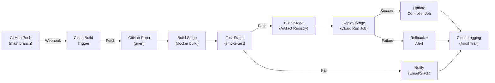

<!-- START doctoc generated TOC please keep comment here to allow auto update -->
<!-- DON'T EDIT THIS SECTION, INSTEAD RE-RUN doctoc TO UPDATE -->
**Table of Contents**

- [Cloud Build CI/CD Pipeline Reference](#cloud-build-cicd-pipeline-reference)
  - [📋 Overview](#-overview)
  - [🏗️ CI/CD Pipeline Architecture](#-cicd-pipeline-architecture)
  - [📦 Build Steps Overview](#-build-steps-overview)
  - [Step 1: Build — Docker Image Construction](#step-1-build--docker-image-construction)
    - [Purpose](#purpose)
    - [Configuration](#configuration)
    - [Environment Variables (Substitutions)](#environment-variables-substitutions)
    - [Dockerfile Best Practices](#dockerfile-best-practices)
    - [Failure Handling](#failure-handling)
  - [Step 2: Test — Smoke Test](#step-2-test--smoke-test)
    - [Purpose](#purpose-1)
    - [Configuration](#configuration-1)
    - [Smoke Test Scenarios](#smoke-test-scenarios)
    - [Failure Handling](#failure-handling-1)
  - [Step 3: Push — Artifact Registry](#step-3-push--artifact-registry)
    - [Purpose](#purpose-2)
    - [Configuration](#configuration-2)
    - [Artifact Registry Security Scanning](#artifact-registry-security-scanning)
    - [Failure Handling](#failure-handling-2)
  - [Step 4: Deploy — Cloud Run Job](#step-4-deploy--cloud-run-job)
    - [Purpose](#purpose-3)
    - [Configuration](#configuration-3)
    - [Alternative: Direct gcloud Deploy](#alternative-direct-gcloud-deploy)
    - [Failure Handling](#failure-handling-3)
  - [Step 5: Notify — Success/Failure Alerts](#step-5-notify--successfailure-alerts)
    - [Configuration](#configuration-4)
    - [Email Notifications](#email-notifications)
  - [🎛️ Substitutions Reference](#-substitutions-reference)
    - [Built-in Substitutions (provided by Cloud Build)](#built-in-substitutions-provided-by-cloud-build)
  - [Environment Variables (Service Account Context)](#environment-variables-service-account-context)
    - [Service Account Permissions](#service-account-permissions)
  - [🚀 Build Triggers](#-build-triggers)
    - [GitHub Trigger Configuration](#github-trigger-configuration)
    - [Trigger Filename](#trigger-filename)
    - [Manual Trigger](#manual-trigger)
  - [📊 Cloud Logging Integration](#-cloud-logging-integration)
    - [Log Structure](#log-structure)
  - [🔐 Security Scanning](#-security-scanning)
    - [Image Vulnerability Scanning](#image-vulnerability-scanning)
    - [CVE Handling](#cve-handling)
  - [🔄 Build Failure Scenarios](#-build-failure-scenarios)
    - [Scenario 1: Build Step Fails](#scenario-1-build-step-fails)
    - [Scenario 2: Test Step Fails](#scenario-2-test-step-fails)
    - [Scenario 3: Push Step Fails](#scenario-3-push-step-fails)
    - [Scenario 4: Deploy Step Fails](#scenario-4-deploy-step-fails)
  - [⚠️ Troubleshooting](#-troubleshooting)
    - [Build Timeout](#build-timeout)
    - [Insufficient Quota](#insufficient-quota)
    - [Authentication Failure](#authentication-failure)
    - [Network Timeout](#network-timeout)
  - [📊 Troubleshooting Table](#-troubleshooting-table)
  - [Complete cloudbuild.yaml Example](#complete-cloudbuildyaml-example)
  - [📈 Performance Metrics](#-performance-metrics)
    - [SLOs](#slos)
  - [📚 Receipt Contract](#-receipt-contract)
  - [✅ Definition of Done](#-definition-of-done)

<!-- END doctoc generated TOC please keep comment here to allow auto update -->

# Cloud Build CI/CD Pipeline Reference

**Version**: v6.0.0 (Production-Ready)
**Last Updated**: January 2026
**Audience**: DevOps engineers, CI/CD architects
**Maintenance**: Platform engineering team

---

## 📋 Overview

The ggen Erlang autonomic system uses Google Cloud Build to:
- Build controller Docker image on every commit
- Run smoke tests on built image
- Push to Artifact Registry
- Deploy to Cloud Run Job
- Provide complete audit trail via Cloud Logging

This document provides complete reference for Cloud Build configuration, pipeline stages, and troubleshooting.

---

## 🏗️ CI/CD Pipeline Architecture



---

## 📦 Build Steps Overview

| Step | Duration | Purpose | Failure Handling |
|------|----------|---------|------------------|
| **Build** | 60-90s | Docker build controller image | Retry 2x, then alert |
| **Test** | 30-45s | Smoke test (health check, dry-run) | Fail fast, retain image, alert |
| **Push** | 15-30s | Push image to Artifact Registry | Retry 3x (transient failures), then alert |
| **Deploy** | 45-60s | Deploy image to Cloud Run Job | Automatic rollback to previous version |
| **Notify** | <5s | Send success/failure notification | Log failure, continue |

**Total Pipeline Duration**: ~2-3 minutes (success) or ~3-4 minutes (with retries)

---

## Step 1: Build — Docker Image Construction

### Purpose
Compile controller binary and package in Docker image.

### Configuration
```yaml
# cloudbuild.yaml
steps:
  - name: gcr.io/cloud-builders/docker
    args:
      - build
      - --tag=${_IMAGE_URI}:${_IMAGE_TAG}
      - --tag=${_IMAGE_URI}:latest
      - --file=controller/Dockerfile
      - --build-arg=RUST_BACKTRACE=1
      - --build-arg=RELEASE_MODE=optimized
      - .
    id: build-image
    timeout: 300s  # 5 minutes SLO
    waitFor: ['-']
```

### Environment Variables (Substitutions)

```yaml
substitutions:
  _IMAGE_URI: "us-central1-docker.pkg.dev/${PROJECT_ID}/controller/autonomics-catalog-controller"
  _IMAGE_TAG: "${SHORT_SHA}"  # Short commit SHA
  _REGION: "us-central1"
  _SERVICE_ACCOUNT: "controller@${PROJECT_ID}.iam.gserviceaccount.com"
```

### Dockerfile Best Practices
```dockerfile
# Multi-stage build (minimize image size)
FROM rust:1.91.1 as builder
WORKDIR /workspace
COPY . .
RUN cargo build --release --bin autonomics-catalog-controller

# Runtime stage (smaller image)
FROM gcr.io/distroless/cc-debian12
COPY --from=builder /workspace/target/release/autonomics-catalog-controller /app/
ENTRYPOINT ["/app/autonomics-catalog-controller"]
```

### Failure Handling
- **Retry Policy**: 2 automatic retries on transient failures (network, etc.)
- **Timeout**: 300 seconds (5 minutes SLO)
- **On Failure**: Halt pipeline, send alert, retain logs for debugging
- **Image Cleanup**: Failed builds don't push image (prevents broken deployments)

---

## Step 2: Test — Smoke Test

### Purpose
Verify built image runs successfully and performs basic operations.

### Configuration
```yaml
steps:
  - name: gcr.io/cloud-builders/docker
    args:
      - run
      - --rm
      - ${_IMAGE_URI}:${_IMAGE_TAG}
      - --help  # Verify CLI works
    id: test-cli
    timeout: 45s
    waitFor: ['build-image']
    onFailure: ['ALLOW']  # Continue even if test fails (for analysis)

  - name: gcr.io/cloud-builders/docker
    args:
      - run
      - --rm
      - --entrypoint=/bin/sh
      - ${_IMAGE_URI}:${_IMAGE_TAG}
      - -c
      - "echo 'health check passed' && exit 0"
    id: test-health
    timeout: 30s
    waitFor: ['test-cli']
```

### Smoke Test Scenarios

```bash
# Test 1: CLI help works
./autonomics-catalog-controller --help

# Test 2: Version command
./autonomics-catalog-controller --version

# Test 3: Health check endpoint (if embedded server)
curl -s http://localhost:8080/health | jq .

# Test 4: Dry-run validation
./autonomics-catalog-controller \
  --repo https://github.com/example/catalog \
  --dry-run \
  --tf-workdir infra/catalog
```

### Failure Handling
- **Test Failure**: Don't push image, alert engineering team
- **Log Output**: Capture stdout/stderr to Cloud Logging
- **Retry**: Don't retry tests (flaky tests indicate real problems)
- **Analysis**: Retain built image for manual debugging

---

## Step 3: Push — Artifact Registry

### Purpose
Push validated image to Artifact Registry for storage and deployment.

### Configuration
```yaml
steps:
  - name: gcr.io/cloud-builders/docker
    args:
      - push
      - ${_IMAGE_URI}:${_IMAGE_TAG}
    id: push-versioned
    timeout: 30s
    waitFor: ['test-health']
    retryLimit: 3  # Retry on transient network failures

  - name: gcr.io/cloud-builders/docker
    args:
      - push
      - ${_IMAGE_URI}:latest
    id: push-latest
    timeout: 30s
    waitFor: ['push-versioned']
```

### Artifact Registry Security Scanning

```yaml
steps:
  - name: gcr.io/cloud-builders/docker
    args:
      - scan
      - ${_IMAGE_URI}:${_IMAGE_TAG}
      - --format=json
      - --output=/workspace/scan-results.json
    id: security-scan
    timeout: 60s
    waitFor: ['push-versioned']
    onFailure: ['ALLOW']  # Don't block on vulnerabilities (log and alert)
```

### Failure Handling
- **Push Failure**: Retry 3 times (transient network issues)
- **Registry Quota**: Alert if approaching storage limits
- **Image Scanning**: Log vulnerabilities, alert security team
- **Timeout**: Fail push after 30 seconds, retry with backoff

---

## Step 4: Deploy — Cloud Run Job

### Purpose
Update Cloud Run Job with new controller image.

### Configuration
```yaml
steps:
  - name: gcr.io/cloud-builders/gke-deploy
    args:
      - run
      - --filename=./deployment/
      - --image=${_IMAGE_URI}:${_IMAGE_TAG}
      - --location=${_REGION}
    id: deploy-cloud-run
    timeout: 60s
    waitFor: ['push-latest']
    env:
      - CLOUDSDK_COMPUTE_REGION=${_REGION}
      - CLOUDSDK_RUN_PLATFORM=managed

  # Verify deployment
  - name: gcr.io/cloud-builders/gcloud
    args:
      - run
      - jobs
      - describe
      - autonomics-catalog-controller
      - --region=${_REGION}
      - --format=json
    id: verify-deploy
    timeout: 30s
    waitFor: ['deploy-cloud-run']
```

### Alternative: Direct gcloud Deploy

```yaml
steps:
  - name: gcr.io/cloud-builders/gcloud
    args:
      - run
      - jobs
      - update
      - autonomics-catalog-controller
      - --image=${_IMAGE_URI}:${_IMAGE_TAG}
      - --region=${_REGION}
    id: deploy-cloud-run
    timeout: 60s
    waitFor: ['push-latest']
    env:
      - CLOUDSDK_COMPUTE_REGION=${_REGION}
```

### Failure Handling
- **Deployment Failure**: Automatic rollback to previous revision
- **Health Check**: Verify new version responds to health endpoint
- **Timeout**: Fail after 60 seconds, trigger rollback
- **Rollback**: Previous revision serves traffic automatically (zero downtime)

---

## Step 5: Notify — Success/Failure Alerts

### Configuration
```yaml
onFailure:
  - name: gcr.io/cloud-builders/gcloud
    args:
      - pubsub
      - topics
      - publish
      - build-failures
      - --message="Build failed: ${BUILD_ID} on branch ${BRANCH_NAME}"

onSuccess:
  - name: gcr.io/cloud-builders/gcloud
    args:
      - pubsub
      - topics
      - publish
      - build-success
      - --message="Build succeeded: ${BUILD_ID} deployed to ${_REGION}"
```

### Email Notifications

```yaml
steps:
  - name: gcr.io/cloud-builders/gcloud
    entrypoint: bash
    args:
      - -c
      - |
        # Send build status email
        gcloud logging write build-notifications \
          "Build completed with status: $BUILD_STATUS" \
          --severity=NOTICE
    id: notify-email
    waitFor: ['verify-deploy']
```

---

## 🎛️ Substitutions Reference

```yaml
substitutions:
  # Artifact Registry
  _IMAGE_URI: "us-central1-docker.pkg.dev/${PROJECT_ID}/controller/autonomics-catalog-controller"
  _IMAGE_TAG: "${SHORT_SHA}"

  # Deployment
  _REGION: "us-central1"
  _CLOUD_RUN_JOB: "autonomics-catalog-controller"
  _SERVICE_ACCOUNT: "controller@${PROJECT_ID}.iam.gserviceaccount.com"

  # Terraform
  _TF_STATE_BUCKET: "ggen-autonomics-tf-state-${_ENV}"
  _TF_WORKDIR: "infra/catalog"

  # Logging
  _LOG_LEVEL: "INFO"
  _ENV: "prod"

  # Timeouts (seconds)
  _BUILD_TIMEOUT: "300"
  _TEST_TIMEOUT: "45"
  _DEPLOY_TIMEOUT: "60"
```

### Built-in Substitutions (provided by Cloud Build)

| Variable | Example | Purpose |
|----------|---------|---------|
| `$BUILD_ID` | `abc-123-def-456` | Unique build identifier |
| `$PROJECT_ID` | `ggen-autonomics-prod` | GCP project |
| `$SHORT_SHA` | `abc123d` | First 7 chars of commit SHA |
| `$COMMIT_SHA` | `abc123def456...` | Full commit SHA |
| `$BRANCH_NAME` | `main` | Git branch |
| `$REPO_NAME` | `ggen` | Repository name |
| `$BUILD_STATUS` | `SUCCESS` or `FAILURE` | Overall build result |

---

## Environment Variables (Service Account Context)

```yaml
steps:
  - name: gcr.io/cloud-builders/gcloud
    env:
      - 'CLOUDSDK_COMPUTE_REGION=${_REGION}'
      - 'CLOUDSDK_RUN_PLATFORM=managed'
      - 'GCLOUD_PROJECT=${PROJECT_ID}'
      - 'LOG_LEVEL=${_LOG_LEVEL}'
```

### Service Account Permissions

The Cloud Build service account must have:

```bash
# Artifact Registry (image push)
roles/artifactregistry.admin

# Cloud Run (job deployment)
roles/run.admin

# Service account impersonation (if using service account)
roles/iam.serviceAccountUser

# Logging (write build logs)
roles/logging.logWriter

# Monitoring (send metrics)
roles/monitoring.metricWriter
```

---

## 🚀 Build Triggers

### GitHub Trigger Configuration

```bash
# Create trigger for main branch
gcloud builds triggers create github \
  --name=ggen-autonomics-controller \
  --repo-name=ggen \
  --repo-owner=seanchatmangpt \
  --branch-pattern=^main$ \
  --build-config=cloudbuild.yaml \
  --substitutions=_ENV=prod,_REGION=us-central1
```

### Trigger Filename
```yaml
# cloudbuild.yaml or cloudbuild-prod.yaml
# Located in repo root

# Alternative: cloudbuild/prod.yaml
# Set filename in trigger: cloudbuild/prod.yaml
```

### Manual Trigger
```bash
# Trigger build manually
gcloud builds submit \
  --config=cloudbuild.yaml \
  --substitutions=_ENV=prod,SHORT_SHA=$(git rev-parse --short HEAD)
```

---

## 📊 Cloud Logging Integration

All build steps log to Cloud Logging automatically:

```bash
# View build logs
gcloud builds log <BUILD_ID>

# Stream build logs (real-time)
gcloud builds log <BUILD_ID> --stream

# Filter logs by step
gcloud builds log <BUILD_ID> --step-id=build-image

# Export logs to BigQuery
gcloud logging sinks create build-logs bigquery.googleapis.com/projects/my-project/datasets/build_logs \
  --log-filter='resource.type="cloud_build"'
```

### Log Structure
```json
{
  "severity": "INFO",
  "timestamp": "2025-01-18T15:30:00Z",
  "resource": {
    "type": "cloud_build",
    "labels": {
      "build_id": "abc-123-def",
      "project_id": "ggen-autonomics-prod"
    }
  },
  "jsonPayload": {
    "step": "build-image",
    "status": "SUCCESS",
    "duration_seconds": 85,
    "image_uri": "us-central1-docker.pkg.dev/.../controller:abc123d"
  }
}
```

---

## 🔐 Security Scanning

### Image Vulnerability Scanning

```yaml
steps:
  - name: gcr.io/cloud-builders/docker
    args:
      - scan
      - ${_IMAGE_URI}:${_IMAGE_TAG}
      - --format=json
      - --output=/workspace/vulnerabilities.json
    id: security-scan
    onFailure: ['ALLOW']  # Don't block, log and alert

  - name: gcr.io/cloud-builders/gcloud
    entrypoint: bash
    args:
      - -c
      - |
        # Parse vulnerabilities and alert
        jq '.[] | select(.severity == "CRITICAL")' /workspace/vulnerabilities.json
        exit 0
    id: parse-vulnerabilities
    waitFor: ['security-scan']
```

### CVE Handling
- **CRITICAL**: Alert security team immediately, pause deployment
- **HIGH**: Log and track, include in security report
- **MEDIUM/LOW**: Log only, allow deployment

---

## 🔄 Build Failure Scenarios

### Scenario 1: Build Step Fails

```yaml
Build failed: error loading code: error running: exit code 1
  --> Cannot find Rust compiler
```

**Root Cause**: Missing Rust installation in build image

**Solution**:
```dockerfile
FROM rust:1.91.1
RUN apt-get update && apt-get install -y build-essential
COPY . /workspace
WORKDIR /workspace
RUN cargo build --release
```

### Scenario 2: Test Step Fails

```yaml
Test failed: /app/autonomics-catalog-controller: command not found
  --> Binary not found in built image
```

**Root Cause**: COPY command in Dockerfile used wrong path

**Solution**:
```dockerfile
# Verify binary location
RUN ls -la /workspace/target/release/
# Update COPY to correct path
COPY --from=builder /workspace/target/release/autonomics-catalog-controller /app/
```

### Scenario 3: Push Step Fails

```yaml
Push failed: PERMISSION_DENIED: 403 Permission denied
  --> Service account lacks Artifact Registry permissions
```

**Root Cause**: Cloud Build service account missing `roles/artifactregistry.admin`

**Solution**:
```bash
gcloud projects add-iam-policy-binding PROJECT_ID \
  --member=serviceAccount:PROJECT_NUMBER@cloudbuild.gserviceaccount.com \
  --role=roles/artifactregistry.admin
```

### Scenario 4: Deploy Step Fails

```yaml
Deploy failed: Cloud Run Job does not exist
  --> Job name mismatch or not created yet
```

**Root Cause**: Cloud Run Job not created by Terraform

**Solution**:
```bash
# Verify job exists
gcloud run jobs describe autonomics-catalog-controller --region=us-central1

# If missing, create via Terraform (see terraform-reference.md)
terraform apply -target=google_cloud_run_v2_job.controller
```

---

## ⚠️ Troubleshooting

### Build Timeout

**Problem**: Build step takes >5 minutes

```
Build timed out after 300s
```

**Solutions**:
1. Optimize Dockerfile (cache dependencies, use multi-stage)
2. Increase timeout: `timeout: 600s` (10 minutes)
3. Use layer caching: `--cache-from=${_IMAGE_URI}:latest`

### Insufficient Quota

**Problem**: Image push fails due to quota exceeded

```
RESOURCE_EXHAUSTED: 429 Quota exceeded
```

**Solutions**:
1. Check Artifact Registry quota: `gcloud artifacts repositories describe controller`
2. Increase quota in Console
3. Clean up old images: `gcloud artifacts docker images delete ${_IMAGE_URI}:old-tag`

### Authentication Failure

**Problem**: Cannot authenticate with GitHub/Artifact Registry

```
PERMISSION_DENIED: Error reading object from bucket
```

**Solutions**:
1. Verify service account has required roles
2. Check GitHub token expiration (if using OAuth)
3. Verify Artifact Registry repo exists

### Network Timeout

**Problem**: Download step fails (network timeout)

```
Timeout during download (5s elapsed)
```

**Solutions**:
1. Increase timeout: `timeout: 60s`
2. Use internal GCS mirror (faster)
3. Retry on transient failures: `retryLimit: 3`

---

## 📊 Troubleshooting Table

| Error | Cause | Solution |
|-------|-------|----------|
| `exit code 1` | Compilation error | Check Rust compiler, dependencies |
| `command not found` | Binary missing | Verify COPY path in Dockerfile |
| `PERMISSION_DENIED` | Missing IAM role | Grant `roles/artifactregistry.admin` |
| `timeout exceeded` | Slow build | Optimize Dockerfile, increase timeout |
| `Job does not exist` | Cloud Run Job missing | Create via Terraform |
| `429 Quota exceeded` | Storage quota full | Increase quota or delete old images |
| `Failed to push` | Network transient | Retry (automatic with `retryLimit`) |

---

## Complete cloudbuild.yaml Example

```yaml
steps:
  # Build Docker image
  - name: gcr.io/cloud-builders/docker
    args:
      - build
      - --tag=${_IMAGE_URI}:${_IMAGE_TAG}
      - --tag=${_IMAGE_URI}:latest
      - --file=controller/Dockerfile
      - --build-arg=RUST_BACKTRACE=1
      - .
    id: build-image
    timeout: 300s
    waitFor: ['-']

  # Run smoke tests
  - name: gcr.io/cloud-builders/docker
    args:
      - run
      - --rm
      - ${_IMAGE_URI}:${_IMAGE_TAG}
      - --help
    id: test-cli
    timeout: 45s
    waitFor: ['build-image']
    onFailure: ['ALLOW']

  # Security scanning
  - name: gcr.io/cloud-builders/docker
    args:
      - scan
      - ${_IMAGE_URI}:${_IMAGE_TAG}
      - --format=json
      - --output=/workspace/scan-results.json
    id: security-scan
    timeout: 60s
    waitFor: ['test-cli']
    onFailure: ['ALLOW']

  # Push to Artifact Registry
  - name: gcr.io/cloud-builders/docker
    args:
      - push
      - ${_IMAGE_URI}:${_IMAGE_TAG}
    id: push-versioned
    timeout: 30s
    waitFor: ['security-scan']
    retryLimit: 3

  - name: gcr.io/cloud-builders/docker
    args:
      - push
      - ${_IMAGE_URI}:latest
    id: push-latest
    timeout: 30s
    waitFor: ['push-versioned']
    retryLimit: 3

  # Deploy to Cloud Run
  - name: gcr.io/cloud-builders/gcloud
    args:
      - run
      - jobs
      - update
      - ${_CLOUD_RUN_JOB}
      - --image=${_IMAGE_URI}:${_IMAGE_TAG}
      - --region=${_REGION}
    id: deploy-cloud-run
    timeout: 60s
    waitFor: ['push-latest']
    env:
      - CLOUDSDK_COMPUTE_REGION=${_REGION}

  # Verify deployment
  - name: gcr.io/cloud-builders/gcloud
    args:
      - run
      - jobs
      - describe
      - ${_CLOUD_RUN_JOB}
      - --region=${_REGION}
    id: verify-deploy
    timeout: 30s
    waitFor: ['deploy-cloud-run']

substitutions:
  _IMAGE_URI: "us-central1-docker.pkg.dev/${PROJECT_ID}/controller/autonomics-catalog-controller"
  _IMAGE_TAG: "${SHORT_SHA}"
  _REGION: "us-central1"
  _CLOUD_RUN_JOB: "autonomics-catalog-controller"

options:
  machineType: "N1_HIGHCPU_8"  # For faster builds
  logging: CLOUD_LOGGING_ONLY  # Send logs to Cloud Logging

timeout: "900s"  # 15 minutes SLO for entire pipeline
```

---

## 📈 Performance Metrics

Track build performance over time:

```bash
# View build timing
gcloud builds log <BUILD_ID> --format=json | \
  jq '.[] | select(.name != null) | {name: .name, time_micros: .finish_time - .start_time}'

# Average build time over last 10 builds
gcloud builds list --limit=10 --format=json | \
  jq '[.[] | .finish_time - .start_time] | add / length'
```

### SLOs
- **Build step**: <90 seconds
- **Test step**: <45 seconds
- **Push step**: <30 seconds
- **Deploy step**: <60 seconds
- **Total pipeline**: <3 minutes

---

## 📚 Receipt Contract

Every build generates a receipt:

```json
{
  "build_id": "abc-123-def-456",
  "timestamp": "2025-01-18T15:30:00Z",
  "project_id": "ggen-autonomics-prod",
  "status": "SUCCESS",
  "steps": [
    {
      "name": "build-image",
      "status": "SUCCESS",
      "duration_seconds": 85
    },
    {
      "name": "test-cli",
      "status": "SUCCESS",
      "duration_seconds": 12
    },
    {
      "name": "push-versioned",
      "status": "SUCCESS",
      "duration_seconds": 18
    },
    {
      "name": "deploy-cloud-run",
      "status": "SUCCESS",
      "duration_seconds": 42
    }
  ],
  "image_uri": "us-central1-docker.pkg.dev/ggen-autonomics-prod/controller/autonomics-catalog-controller:abc123d",
  "total_duration_seconds": 157
}
```

Retrieve receipt:
```bash
gcloud builds describe <BUILD_ID> --format=json
```

---

## ✅ Definition of Done

- [ ] cloudbuild.yaml created and committed
- [ ] All 5 pipeline stages configured (build, test, push, deploy, notify)
- [ ] Artifact Registry repository created and verified
- [ ] Cloud Build service account has required IAM roles
- [ ] GitHub webhook trigger created and tested
- [ ] Manual build trigger successful: `gcloud builds submit`
- [ ] Build completes in <3 minutes (SLO)
- [ ] All images scanned for vulnerabilities
- [ ] Notifications (email/Slack) working
- [ ] Build logs visible in Cloud Logging
- [ ] Rollback procedure tested
- [ ] Documentation updated
- [ ] Acceptance testing completed (see acceptance-testing.md)

---

**Related Documentation**:
- [terraform-reference.md](terraform-reference.md) — Infrastructure provisioning
- [controller-reference.md](controller-reference.md) — Controller CLI and configuration
- [acceptance-testing.md](acceptance-testing.md) — Deployment verification
- [ato-evidence-pack.md](ato-evidence-pack.md) — Compliance evidence
- [glossary.md](glossary.md) — Terms and definitions
