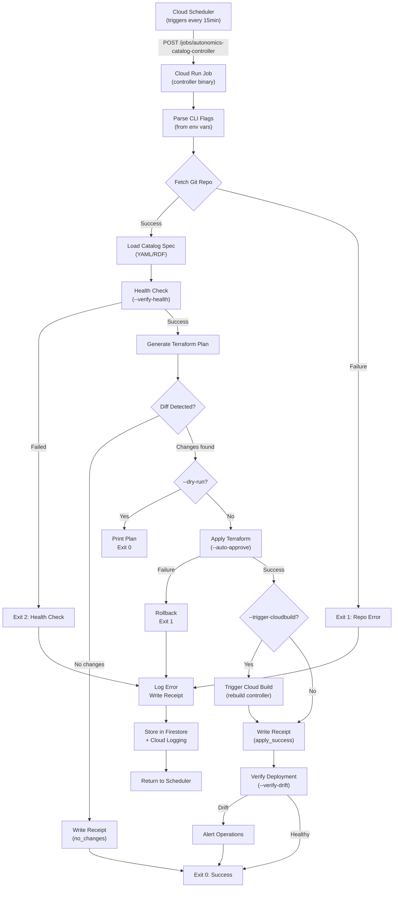

# Catalog Controller CLI Reference

**Version**: v6.0.0 (Production-Ready)
**Last Updated**: January 2026
**Audience**: Platform engineers, DevOps, operations
**Binary Location**: `controller/autonomics-catalog-controller`

---

## 📋 Overview

The **Autonomics Catalog Controller** is a command-line tool and Cloud Run Job that implements the autonomic reconciliation engine for marketplace catalog management.

**Core Function**: Periodically fetch catalog spec from Git repo, reconcile with Terraform state, and update GCP infrastructure to match specification.

**Deployment**: Cloud Run Job (triggered by Cloud Scheduler every 15 minutes)

---

## 🚀 Quick Start

```bash
# Display help
./autonomics-catalog-controller --help

# Version
./autonomics-catalog-controller --version

# Dry-run (preview changes without applying)
./autonomics-catalog-controller \
  --repo https://github.com/example/catalog \
  --branch main \
  --project-id my-project \
  --dry-run

# Production run (apply changes)
./autonomics-catalog-controller \
  --repo https://github.com/example/catalog \
  --branch main \
  --project-id my-project \
  --firestore-collection catalog_runs \
  --verify-health \
  --trigger-cloudbuild
```

---

## 🎛️ CLI Flags (Complete Reference)

### Repository & Branch

```bash
--repo <URL>
  GCP project ID for resource creation
  Type: string
  Required: true
  Environment Variable: CATALOG_REPO
  Example: https://github.com/seanchatmangpt/ggen-catalog.git

--branch <name>
  Git branch to fetch catalog spec from
  Type: string
  Default: main
  Environment Variable: CATALOG_BRANCH
  Example: main, develop, staging
```

### GCP Configuration

```bash
--project-id <id>
  GCP project ID for resource creation
  Type: string
  Required: true
  Environment Variable: GOOGLE_CLOUD_PROJECT
  Example: ggen-autonomics-prod

--region <region>
  GCP region for default operations
  Type: string
  Default: us-central1
  Environment Variable: GCP_REGION
  Example: us-central1, us-east1, europe-west1
```

### Terraform State & Workspace

```bash
--tf-state-bucket <bucket>
  GCS bucket containing Terraform state
  Type: string
  Required: true
  Environment Variable: TF_STATE_BUCKET
  Example: ggen-autonomics-tf-state-prod
  Notes: Must have versioning enabled (see terraform-reference.md)

--tf-workdir <path>
  Terraform working directory within repo
  Type: string
  Default: infra/catalog
  Environment Variable: TF_WORKDIR
  Example: infra/catalog, infra/shared, infra/controller

--tf-workspace <name>
  Terraform workspace (dev, stage, prod)
  Type: string
  Default: prod
  Environment Variable: TF_WORKSPACE
  Example: dev, staging, prod
  Notes: Must exist in Terraform state
```

### Firestore Configuration

```bash
--firestore-collection <name>
  Firestore collection for run receipts
  Type: string
  Default: catalog_runs
  Environment Variable: FIRESTORE_COLLECTION
  Example: catalog_runs, controller_receipts

--firestore-database <id>
  Firestore database ID
  Type: string
  Default: (default)
  Environment Variable: FIRESTORE_DATABASE
  Notes: Only set if using non-default database
```

### Health & Verification

```bash
--verify-health <bool>
  Verify GCP resources are healthy before/after reconciliation
  Type: boolean
  Default: true
  Environment Variable: VERIFY_HEALTH
  Example: --verify-health=true or --verify-health=false
  Behavior:
    - Before run: Check Terraform state backend accessible
    - After run: Check deployed resources responding to health checks

--verify-drift <bool>
  Verify no drift between Terraform state and GCP reality
  Type: boolean
  Default: true
  Environment Variable: VERIFY_DRIFT
  Example: --verify-drift=true
  Behavior:
    - Compare Terraform plan with actual GCP state
    - Alert if drift detected (manual intervention needed)
```

### Build Triggering & Deployment

```bash
--trigger-cloudbuild <bool>
  Automatically trigger Cloud Build after catalog change
  Type: boolean
  Default: true
  Environment Variable: TRIGGER_CLOUDBUILD
  Example: --trigger-cloudbuild=true
  Behavior:
    - On spec change: Trigger controller image rebuild + deployment
    - On no change: Skip Cloud Build (no rebuild needed)

--auto-approve <bool>
  Skip Terraform plan review, auto-apply changes
  Type: boolean
  Default: false
  Environment Variable: AUTO_APPROVE
  Example: --auto-approve=false (manual review), --auto-approve=true (autonomous)
  Security: Use false in production, true only for fully-tested scenarios
```

### Execution Control

```bash
--dry-run <bool>
  Preview changes without modifying infrastructure
  Type: boolean
  Default: false
  Environment Variable: DRY_RUN
  Example: --dry-run=true
  Behavior:
    - Fetch catalog spec
    - Generate Terraform plan
    - Print plan to stdout
    - Don't apply changes
    - Don't write receipt

--log-level <level>
  Logging verbosity
  Type: string (DEBUG, INFO, WARN, ERROR)
  Default: INFO
  Environment Variable: LOG_LEVEL
  Example: --log-level=DEBUG (verbose), --log-level=ERROR (quiet)

--timeout <seconds>
  Maximum execution time
  Type: integer
  Default: 3600 (1 hour)
  Environment Variable: EXECUTION_TIMEOUT
  Example: --timeout=1800 (30 minutes)
  Notes: Cloud Run Job timeout SLO is 1 hour
```

### Advanced Options

```bash
--output-format <format>
  Output format for results
  Type: string (json, text, yaml)
  Default: json
  Environment Variable: OUTPUT_FORMAT
  Example: --output-format=json (structured), --output-format=text (human)

--audit-trail <bool>
  Generate cryptographic audit trail
  Type: boolean
  Default: true
  Environment Variable: AUDIT_TRAIL
  Example: --audit-trail=true
  Behavior:
    - Hash all input files
    - Hash all output files
    - Generate receipt with hashes
    - Store in Firestore + GCS

--backup-state <bool>
  Backup Terraform state before apply
  Type: boolean
  Default: true
  Environment Variable: BACKUP_STATE
  Example: --backup-state=true
  Behavior:
    - Create GCS snapshot before terraform apply
    - Enable rollback if apply fails
```

---

## 🌍 Environment Variables (Complete List)

| Variable | Type | Default | Required | Description |
|----------|------|---------|----------|-------------|
| `CATALOG_REPO` | string | - | yes | Git repository URL |
| `CATALOG_BRANCH` | string | main | no | Git branch name |
| `GOOGLE_CLOUD_PROJECT` | string | - | yes | GCP project ID |
| `GCP_REGION` | string | us-central1 | no | GCP region |
| `TF_STATE_BUCKET` | string | - | yes | GCS bucket for Terraform state |
| `TF_WORKDIR` | string | infra/catalog | no | Terraform working directory |
| `TF_WORKSPACE` | string | prod | no | Terraform workspace name |
| `FIRESTORE_COLLECTION` | string | catalog_runs | no | Firestore collection for receipts |
| `FIRESTORE_DATABASE` | string | (default) | no | Firestore database ID |
| `VERIFY_HEALTH` | bool | true | no | Verify health before/after |
| `VERIFY_DRIFT` | bool | true | no | Detect state drift |
| `TRIGGER_CLOUDBUILD` | bool | true | no | Trigger build on change |
| `AUTO_APPROVE` | bool | false | no | Auto-apply Terraform changes |
| `DRY_RUN` | bool | false | no | Preview only |
| `LOG_LEVEL` | string | INFO | no | Logging verbosity |
| `EXECUTION_TIMEOUT` | int | 3600 | no | Timeout in seconds |
| `OUTPUT_FORMAT` | string | json | no | Output format |
| `AUDIT_TRAIL` | bool | true | no | Generate audit trail |
| `BACKUP_STATE` | bool | true | no | Backup state before apply |
| `GITHUB_TOKEN` | string | - | optional | GitHub personal access token (for private repos) |

---

## 🚀 Execution Flow



---

## 📤 Outputs & Logging

### Cloud Logging (JSON Structured Logs)

```json
{
  "timestamp": "2025-01-18T15:30:00Z",
  "severity": "INFO",
  "labels": {
    "run_id": "20250118-1530",
    "status": "success",
    "action": "reconcile"
  },
  "jsonPayload": {
    "catalog_source": "https://github.com/example/catalog",
    "catalog_branch": "main",
    "tf_workspace": "prod",
    "changes_applied": 3,
    "resources_created": 1,
    "resources_modified": 2,
    "resources_destroyed": 0,
    "cloud_build_triggered": true,
    "build_id": "abc-123-def",
    "duration_seconds": 145,
    "exit_code": 0
  }
}
```

### Firestore Receipt (Stored in catalog_runs collection)

```json
{
  "runId": "20250118-1530",
  "timestamp": "2025-01-18T15:30:00Z",
  "status": "success",
  "catalogSource": {
    "repo": "https://github.com/example/catalog",
    "branch": "main",
    "commitSha": "abc123def456..."
  },
  "terraformChanges": {
    "plan": {
      "resources_to_add": 1,
      "resources_to_change": 2,
      "resources_to_destroy": 0
    },
    "apply": {
      "resources_added": 1,
      "resources_changed": 2,
      "resources_destroyed": 0
    }
  },
  "cloudBuild": {
    "triggered": true,
    "buildId": "abc-123-def-456"
  },
  "healthCheck": {
    "verified": true,
    "timestamp": "2025-01-18T15:31:00Z"
  },
  "driftDetection": {
    "driftDetected": false,
    "verified": true
  },
  "auditTrail": {
    "inputHash": "sha256:abc123...",
    "outputHashes": {
      "main.tf": "sha256:def456...",
      "terraform.tfstate": "sha256:ghi789..."
    }
  },
  "duration": {
    "totalSeconds": 145,
    "breakdown": {
      "fetch_spec_seconds": 15,
      "health_check_seconds": 10,
      "terraform_plan_seconds": 20,
      "terraform_apply_seconds": 85,
      "verify_seconds": 15
    }
  }
}
```

### Exit Codes

| Code | Meaning | Action |
|------|---------|--------|
| **0** | Success | No action needed; schedule next run |
| **1** | Failure | Alert operations team; retain logs |
| **2** | Configuration Error | Fix environment variables/flags; retry |
| **3** | Permission Denied | Verify IAM roles; contact admin |
| **4** | Timeout | Increase `--timeout`; investigate slow operations |
| **5** | State Locked | Wait for other apply to complete; retry |

---

## 🩺 Health Check Endpoints

If using Cloud Run with embedded HTTP server:

```bash
# Liveness check (is process alive?)
curl -s http://localhost:8080/health

# Response: 200 OK
{
  "status": "healthy",
  "timestamp": "2025-01-18T15:30:00Z"
}

# Readiness check (can accept requests?)
curl -s http://localhost:8080/readiness

# Response: 200 OK
{
  "ready": true,
  "dependencies": {
    "firestore": "connected",
    "terraform_backend": "accessible",
    "cloud_logging": "writable"
  }
}
```

---

## ⚙️ Cloud Run Job Configuration

Deployed via Terraform (see terraform-reference.md):

```bash
# View Cloud Run Job configuration
gcloud run jobs describe autonomics-catalog-controller --region=us-central1

# Manual execution
gcloud run jobs execute autonomics-catalog-controller --region=us-central1

# View execution logs
gcloud run jobs logs read autonomics-catalog-controller --region=us-central1 --limit=50

# Update environment variables
gcloud run jobs update autonomics-catalog-controller \
  --set-env-vars=LOG_LEVEL=DEBUG \
  --region=us-central1
```

### Service Account Permissions

The controller service account needs:

```bash
# Roles required
roles/datastore.user              # Firestore: write receipts
roles/pubsub.publisher            # Pub/Sub: publish signals
roles/storage.objectViewer        # GCS: read Terraform state
roles/cloudlogging.logWriter      # Cloud Logging: write logs
roles/cloudbuild.builds.create    # Cloud Build: trigger builds (if --trigger-cloudbuild)
roles/cloudbuild.builds.editor    # Cloud Build: manage builds

# Grant roles
gcloud projects add-iam-policy-binding PROJECT_ID \
  --member=serviceAccount:controller@PROJECT_ID.iam.gserviceaccount.com \
  --role=roles/datastore.user
```

---

## 🔍 Troubleshooting

### Error: "Permission Denied: Firestore"

```
Error: Operation failed: PERMISSION_DENIED
  Firestore write failed: insufficient permissions
```

**Diagnosis**:
```bash
gcloud projects get-iam-policy PROJECT_ID \
  --flatten="bindings[].members" \
  --filter="bindings.members:serviceAccount:controller@*" \
  --format=table
```

**Solution**:
```bash
gcloud projects add-iam-policy-binding PROJECT_ID \
  --member=serviceAccount:controller@PROJECT_ID.iam.gserviceaccount.com \
  --role=roles/datastore.user
```

### Error: "State Lock Held"

```
Error: Error acquiring the state lock
Lock Info:
  ID: abc123
  Who: user@example.com
  Version: 1.0.0
```

**Diagnosis**:
```bash
# Check active locks
gcloud firestore documents list \
  --collection-id=terraform_locks \
  --database='(default)'
```

**Solution**:
```bash
# Wait for lock to expire (5 min default), OR
# Force unlock (DANGEROUS - only if process crashed)
terraform force-unlock abc123
```

### Error: "Catalog Repo Not Found"

```
Error: Repository not found: https://github.com/example/catalog
  Permission denied or repository does not exist
```

**Diagnosis**:
```bash
# Test git clone
git clone https://github.com/example/catalog /tmp/test

# If private repo, verify GitHub token
echo $GITHUB_TOKEN
```

**Solution**:
```bash
# For private repos, provide GitHub token
export GITHUB_TOKEN=ghp_xxxxxxxxxxxxxxxxxxxx
./autonomics-catalog-controller \
  --repo https://github.com/example/catalog \
  --branch main
```

### Error: "Terraform State Bucket Not Accessible"

```
Error: Failed to read state from GCS bucket
  Bucket does not exist or not accessible
```

**Diagnosis**:
```bash
# Check bucket exists and is accessible
gsutil ls gs://ggen-tf-state-prod/

# Check versioning enabled
gsutil versioning get gs://ggen-tf-state-prod/
```

**Solution**:
```bash
# Enable versioning
gsutil versioning set on gs://ggen-tf-state-prod/

# Verify service account has access
gsutil iam ch serviceAccount:controller@PROJECT_ID.iam.gserviceaccount.com:objectViewer \
  gs://ggen-tf-state-prod/
```

### Error: "Timeout Exceeded"

```
Error: Execution timeout (3600s exceeded)
  Terraform apply taking longer than expected
```

**Diagnosis**:
```bash
# Check Cloud Run Job timeout
gcloud run jobs describe autonomics-catalog-controller --region=us-central1 | grep timeout

# Check Terraform apply duration
gcloud logging read "resource.type=cloud_run_job" --limit=1 --format=json | jq '.[] | .jsonPayload.duration'
```

**Solutions**:
1. Increase timeout: `--timeout=7200` (2 hours)
2. Optimize Terraform (reduce number of resources)
3. Increase Cloud Run Job memory/CPU (via Terraform)

---

## 📊 Troubleshooting Table

| Error | Root Cause | Solution |
|-------|-----------|----------|
| `PERMISSION_DENIED: Firestore` | Missing IAM role | Grant `roles/datastore.user` |
| `State lock held` | Another apply in progress | Wait for lock expiry or force unlock |
| `Repository not found` | Private repo without token | Provide `GITHUB_TOKEN` env var |
| `Bucket not accessible` | No versioning or IAM | Enable versioning, grant access |
| `Timeout exceeded` | Slow operation | Increase `--timeout`, optimize Terraform |
| `Cloud Build failed` | Image build/test failure | Check Cloud Build logs |
| `Drift detected` | Manual changes to resources | Review drift, apply fix via Terraform |
| `Health check failed` | Resources not responding | Verify resource state, check logs |

---

## 🔐 Security Best Practices

### 1. Use Secret Manager for Credentials

```bash
# Store GitHub token in Secret Manager
echo -n "ghp_xxxxxxxxxxxxxxxxxxxx" | \
  gcloud secrets create github-token --data-file=-

# Grant access to controller service account
gcloud secrets add-iam-policy-binding github-token \
  --member=serviceAccount:controller@PROJECT_ID.iam.gserviceaccount.com \
  --role=roles/secretmanager.secretAccessor

# Access in Cloud Run Job (via Terraform)
# Set env var to secret value: projects/PROJECT/secrets/github-token/versions/latest
```

### 2. Use Least Privilege IAM

Don't grant editor/admin roles unnecessarily:

```bash
# ✗ WRONG - too permissive
gcloud projects add-iam-policy-binding PROJECT_ID \
  --member=serviceAccount:controller@PROJECT_ID.iam.gserviceaccount.com \
  --role=roles/editor

# ✓ CORRECT - least privilege
gcloud projects add-iam-policy-binding PROJECT_ID \
  --member=serviceAccount:controller@PROJECT_ID.iam.gserviceaccount.com \
  --role=roles/datastore.user

gcloud projects add-iam-policy-binding PROJECT_ID \
  --member=serviceAccount:controller@PROJECT_ID.iam.gserviceaccount.com \
  --role=roles/storage.objectViewer
```

### 3. Audit Trail & Receipts

Always enable audit trail for compliance:

```bash
# Production should have --audit-trail=true (default)
./autonomics-catalog-controller \
  --repo https://github.com/example/catalog \
  --audit-trail=true
```

### 4. Firewall Control

Restrict Cloud Run Job traffic if needed:

```bash
# Restrict to Cloud Scheduler only (internal traffic)
gcloud run jobs update autonomics-catalog-controller \
  --vpc-connector ggen-vpc \
  --vpc-egress private-ranges-only
```

---

## 📊 Performance Tuning

### Cloud Run Job Memory/CPU

```bash
# Increase resources for faster reconciliation
gcloud run jobs update autonomics-catalog-controller \
  --memory 2Gi \
  --cpu 4
```

| Memory | CPU | Use Case | Est. Duration |
|--------|-----|----------|---|
| 512Mi | 1 | Small catalog (<10 SKUs) | 2-3 min |
| 1Gi | 2 | Medium catalog (10-50 SKUs) | 1.5-2 min |
| 2Gi | 4 | Large catalog (50+ SKUs) | 1-1.5 min |

### Optimization Tips

1. **Reduce Git clones**: Use `--skip-git-verify` if state is recently synced
2. **Parallelize Terraform**: Use `terraform plan -parallelism=10`
3. **Cache Terraform**: Store `.terraform/` in GCS, download in Cloud Run
4. **Use Terraform targets**: Apply only changed resources with `-target` flag

---

## 📚 Receipt Contract

Verify receipt format in Firestore:

```bash
# Query latest receipt
gcloud firestore documents list --collection-id=catalog_runs --limit=1

# View specific receipt
gcloud firestore documents get catalog_runs/20250118-1530
```

Expected fields (all required):
- `runId`: Unique identifier
- `timestamp`: ISO 8601 timestamp
- `status`: "success" | "failure" | "partial"
- `catalogSource`: Repository info
- `terraformChanges`: Plan and apply results
- `auditTrail`: Content hashes
- `duration`: Execution time breakdown

---

## ✅ Definition of Done

- [ ] Controller binary built and tested
- [ ] Cloud Run Job created via Terraform
- [ ] Service account with required IAM roles
- [ ] Environment variables configured in Cloud Run
- [ ] Cloud Scheduler trigger configured (every 15 minutes)
- [ ] Test execution successful: `gcloud run jobs execute`
- [ ] Receipt written to Firestore on success
- [ ] Error handling verified (all exit codes tested)
- [ ] Health checks passing
- [ ] Cloud Logging shows structured JSON output
- [ ] Drift detection verified
- [ ] Rollback procedure tested
- [ ] Documentation updated
- [ ] Acceptance testing completed (see acceptance-testing.md)

---

**Related Documentation**:
- [terraform-reference.md](terraform-reference.md) — Infrastructure provisioning
- [cloudbuild-reference.md](cloudbuild-reference.md) — CI/CD pipeline
- [acceptance-testing.md](acceptance-testing.md) — Deployment verification
- [ato-evidence-pack.md](ato-evidence-pack.md) — Compliance evidence
- [glossary.md](glossary.md) — Terms and definitions
