<!-- START doctoc generated TOC please keep comment here to allow auto update -->
<!-- DON'T EDIT THIS SECTION, INSTEAD RE-RUN doctoc TO UPDATE -->
**Table of Contents**

- [Change Control Policy](#change-control-policy)
  - [Table of Contents](#table-of-contents)
  - [Executive Summary](#executive-summary)
  - [Change Types & Classification](#change-types--classification)
    - [By Impact Category](#by-impact-category)
    - [By Urgency Level](#by-urgency-level)
  - [Change Control Workflow](#change-control-workflow)
    - [Step 1: Change Request (PROPOSED State)](#step-1-change-request-proposed-state)
    - [Step 2: Change Review (PROPOSED → APPROVED)](#step-2-change-review-proposed-%E2%86%92-approved)
    - [Step 3: Deployment Approval (APPROVED → DEPLOYING)](#step-3-deployment-approval-approved-%E2%86%92-deploying)
    - [Step 4: Canary Deployment (DEPLOYING State)](#step-4-canary-deployment-deploying-state)
    - [Step 5: Post-Deployment (DEPLOYED or ROLLED_BACK State)](#step-5-post-deployment-deployed-or-rolled_back-state)
  - [State Machine (gen_statem)](#state-machine-gen_statem)
    - [FSM Diagram](#fsm-diagram)
    - [State Definitions](#state-definitions)
    - [Transitions](#transitions)
  - [Change Authority & Approval](#change-authority--approval)
    - [Authority Mapping](#authority-mapping)
    - [Approval Requirements](#approval-requirements)
    - [Signature Requirements](#signature-requirements)
  - [Approval Criteria](#approval-criteria)
    - [Compliance Review](#compliance-review)
    - [Security Review](#security-review)
    - [Performance Review](#performance-review)
    - [Rollback Readiness](#rollback-readiness)
    - [Testing Evidence](#testing-evidence)
  - [Communication Protocol](#communication-protocol)
    - [Notification Timeline](#notification-timeline)
    - [Notification Channels](#notification-channels)
    - [Message Templates](#message-templates)
  - [Rollback Procedures](#rollback-procedures)
    - [Universal Rollback Template](#universal-rollback-template)
  - [Evidence & Receipts](#evidence--receipts)
    - [Artifact Retention](#artifact-retention)
    - [Receipt Contents](#receipt-contents)
  - [Policy Hot-Reload](#policy-hot-reload)
    - [Safe vs Unsafe Changes](#safe-vs-unsafe-changes)
    - [Hot-Reload Workflow](#hot-reload-workflow)
    - [Configuration Polling](#configuration-polling)
  - [Canary Deployment](#canary-deployment)
    - [SLI Monitoring Dashboard](#sli-monitoring-dashboard)
    - [Automatic Halt Logic](#automatic-halt-logic)
  - [Change Request Template](#change-request-template)
  - [Approval Checklist](#approval-checklist)
  - [Definition of Done](#definition-of-done)
  - [Receipt Contract](#receipt-contract)

<!-- END doctoc generated TOC please keep comment here to allow auto update -->

# Change Control Policy

**Classification**: Internal | **Version**: 1.0.0 | **For**: ggen v6.0.0 Production Operations

**Authority**: Chief Technology Officer | **Last Updated**: January 2026 | **Next Review**: April 2026

---

## Table of Contents

1. [Executive Summary](#executive-summary)
2. [Change Types & Classification](#change-types--classification)
3. [Change Control Workflow](#change-control-workflow)
4. [State Machine (gen_statem)](#state-machine-gen_statem)
5. [Change Authority & Approval](#change-authority--approval)
6. [Approval Criteria](#approval-criteria)
7. [Communication Protocol](#communication-protocol)
8. [Rollback Procedures](#rollback-procedures)
9. [Evidence & Receipts](#evidence--receipts)
10. [Policy Hot-Reload](#policy-hot-reload)
11. [Canary Deployment](#canary-deployment)
12. [Change Request Template](#change-request-template)
13. [Approval Checklist](#approval-checklist)
14. [Definition of Done](#definition-of-done)

---

## Executive Summary

**Change Control** is the disciplined, deterministic process by which all modifications to production systems are proposed, reviewed, approved, deployed, and either committed or rolled back. This policy enforces a **gen_statem-based state machine** that prevents ad-hoc changes, ensures compliance visibility, and enables safe rollback.

**Core Principles**:
- Every change follows the same workflow (no exceptions)
- Changes are treated as state transitions (PROPOSED → APPROVED → DEPLOYING → DEPLOYED or ROLLED_BACK)
- All decisions are audited and evidenced (receipts with who/when/why)
- Rollback is always available (every change has explicit rollback procedure)
- Changes are canary-deployed (5% → 25% → 50% → 100%, with SLI monitoring)
- Compliance impact is pre-assessed (government contracting requires early visibility)

**Stakeholders**:
- **Change Requestor**: Initiates change request
- **Change Reviewer**: Assesses compliance, security, performance impact
- **Change Authority**: Approves change deployment
- **Deployment Engineer**: Executes canary deployment + full rollout
- **Monitoring Officer**: Watches SLIs during deployment window
- **Incident Commander**: Halts deployment on anomaly, initiates rollback

---

## Change Types & Classification

### By Impact Category

| Type | Definition | Example | Authority | SLO |
|------|-----------|---------|-----------|-----|
| **Policy Update** | Constitution, contract, governance | Update CDO pricing policy | CISO + CFO | 2 weeks review |
| **SKU Update** | Marketplace catalog change | Add new GCP SKU | Product Manager | 1 week review |
| **Controller Update** | Catalog autonomic logic | Update SKU replication algorithm | Engineering Lead | 3-day review + canary |
| **Terraform Update** | Infrastructure-as-Code | Add GKE cluster autoscaling | DevOps Lead | 5-day review + canary |
| **Dependency Update** | Rust crate, npm package, Erlang release | Upgrade Oxigraph 0.5.2 → 0.5.3 | Tech Lead | 3-day review + canary + CVE check |
| **Security Patch** | CVE mitigation, access control fix | Rotate HMAC key, fix SQL injection | CISO | 24-hour expedited |
| **Compliance Fix** | Government-mandated change | Update audit logging per FedRAMP | Compliance Officer | 48-hour expedited |

### By Urgency Level

| Level | Criteria | Approval SLO | Deployment Window |
|-------|----------|--------------|-------------------|
| **ROUTINE** | No compliance/security impact, backward compatible | 5 business days | Next weekly deployment window |
| **PRIORITY** | Compliance or performance impact, requires testing | 2 business days | Next bi-weekly deployment window |
| **EXPEDITED** | Security patch or compliance mandate | 4 business hours | Immediate (after canary) |
| **EMERGENCY** | Zero-day exploit, compliance violation at risk | 30 minutes | Immediate deployment (skip canary if unavoidable) |

---

## Change Control Workflow

### Step 1: Change Request (PROPOSED State)

**Trigger**: Developer or operator identifies change need.

**Inputs**:
- Change Request Form (see template below)
- Impact Assessment (preliminary)
- Rollback Plan (sketch)

**Activities**:
1. Document change in Change Request Form
2. Assign change ID: `CHANGE-YYYYMMDD-###`
3. Route to Change Reviewer based on type
4. Store change record in `/ggen/receipts/changes/` directory

**Outputs**:
- Change Record created (JSON)
- Change Reviewer assigned
- Review SLO clock starts

**Example Change Record** (`/ggen/receipts/changes/CHANGE-20260125-001.json`):
```json
{
  "changeId": "CHANGE-20260125-001",
  "type": "Controller Update",
  "title": "Fix SKU replication race condition",
  "requestor": "alice@example.com",
  "createdAt": "2026-01-25T08:15:00Z",
  "description": "Catalog Controller spawns duplicate SKUs under high load due to missing atomic check-and-set. Root cause: Firestore transaction isolation insufficient for concurrent writes.",
  "affectedComponents": ["ggen-domain/src/autonomic/controller.rs"],
  "businessImpact": "Duplicate SKUs cause billing inconsistency; ~0.5% of SKU manifests affected",
  "complianceImpact": "Audit trail ambiguity - may require manual reconciliation of 2024 manifests",
  "securityImpact": "None",
  "performanceImpact": "None (fix actually improves throughput by eliminating wasted transactions)",
  "backwardCompatible": true,
  "rollbackPlan": "Revert commit XYZ, manual SKU deduplication script (est. 2 hours)",
  "testingDone": "Unit test + integration test with 50 concurrent writers + canary test on staging",
  "state": "PROPOSED",
  "estimatedDeploymentTime": "15 minutes"
}
```

---

### Step 2: Change Review (PROPOSED → APPROVED)

**Trigger**: Change Reviewer begins assessment (within SLO).

**Reviewer Role**:
- Security Architect (for security/infrastructure changes)
- Compliance Officer (for compliance/government changes)
- Tech Lead (for technical/code changes)
- Product Manager (for catalog/SKU changes)

**Review Checklist** (see Approval Criteria section):
- [ ] Compliance impact assessed (FedRAMP, government contracting requirements)
- [ ] Security review completed (no new CVEs, no privilege escalation, no data exposure)
- [ ] Performance impact modeled (SLOs maintained? Any regressions?)
- [ ] Rollback procedure validated (can it be executed in <30 min?)
- [ ] Testing evidence reviewed (unit + integration + canary tests pass)
- [ ] Communication plan confirmed (who gets notified when deployed?)

**Outputs**:
- Approval/Rejection decision with detailed rationale
- Risk assessment (residual risk level: Low/Medium/High)
- Deployment conditions (canary %, SLI thresholds for halt)
- Change record updated with review metadata

**Example Approval** (JSON):
```json
{
  "changeId": "CHANGE-20260125-001",
  "state": "APPROVED",
  "reviewer": "bob@example.com",
  "reviewedAt": "2026-01-25T14:30:00Z",
  "complianceReview": {
    "status": "PASS",
    "findings": "Audit trail impact requires manual SKU reconciliation tool (can be added in CHANGE-20260201-XXX). Current change complies with FedRAMP audit requirements.",
    "governmentNotificationRequired": false
  },
  "securityReview": {
    "status": "PASS",
    "findings": "Atomic check-and-set implemented correctly. No privilege escalation. Isolation level verified."
  },
  "performanceReview": {
    "status": "PASS",
    "findings": "Fix removes wasted Firestore transactions (~20% reduction in transaction cost per deployment window)"
  },
  "deploymentConditions": {
    "canaryPercent": 25,
    "haltThreshold": {
      "errorRate": 0.01,
      "latencyP99": 500,
      "cpuUsage": 0.75
    },
    "notifyGovernmentUpon": "none",
    "requiresDowntime": false
  },
  "riskLevel": "LOW",
  "approvalAuthority": "Tech Lead",
  "approvalRequired": "single"
}
```

---

### Step 3: Deployment Approval (APPROVED → DEPLOYING)

**Trigger**: Change Authority reviews Change Reviewer's recommendation.

**Authority Role** (by change type):
| Type | Authority | Escalation |
|------|-----------|-----------|
| Policy Update | CISO + CFO | Board |
| SKU Update | Product Manager | VP Product |
| Controller Update | Engineering Lead | VP Engineering |
| Terraform Update | DevOps Lead | VP Infrastructure |
| Dependency Update | Tech Lead | VP Engineering |
| Security Patch | CISO | Incident Commander |
| Compliance Fix | Compliance Officer | Chief Legal Officer |

**Approval Inputs**:
- Change Review summary
- Risk assessment
- Rollback readiness confirmation
- Canary deployment strategy

**Outputs**:
- Approval signature + timestamp (received via email or webhook)
- Deployment window assigned (within 5 business days for ROUTINE, immediately for EMERGENCY)
- Change state → DEPLOYING
- Deployment team notified

**Approval Record** (JSON):
```json
{
  "changeId": "CHANGE-20260125-001",
  "state": "DEPLOYING",
  "authority": "Engineering Lead",
  "authorityEmail": "eng-lead@example.com",
  "authorizedAt": "2026-01-25T15:45:00Z",
  "deploymentWindow": "2026-01-26T03:00:00Z",
  "deploymentEngineer": "charlie@example.com",
  "monitoringOfficer": "dave@example.com",
  "incidentCommander": "eve@example.com",
  "rollbackApproved": true,
  "rollbackEstimatedTime": "15 minutes"
}
```

---

### Step 4: Canary Deployment (DEPLOYING State)

**Trigger**: Deployment window opens, Deployment Engineer begins rollout.

**Canary Stages** (all with real traffic):

**Stage 1: 5% Canary (15 minutes)**
- Deploy change to 5% of pods/replicas
- Monitor SLIs: error rate, latency, CPU, memory
- If SLI healthy: proceed to Stage 2
- If SLI violated: halt, trigger rollback, notify Incident Commander

**Stage 2: 25% Canary (30 minutes)**
- Deploy to 25% of capacity
- Monitor SLIs for sustained health
- If healthy: proceed to Stage 3
- If violated: halt, trigger rollback

**Stage 3: 50% Canary (30 minutes)**
- Deploy to 50% of capacity
- Monitor SLIs for anomalies
- If healthy: proceed to full deployment
- If violated: halt, trigger rollback

**Stage 4: 100% Deployment (15 minutes)**
- Deploy to remaining 50%
- Monitor for 24 hours post-deployment
- If no incidents: mark DEPLOYED
- If incident detected: trigger rollback, incident post-mortem

**SLI Monitoring** (real-time dashboard):
```
Error Rate:     < 1% baseline
Latency P99:    < 500ms baseline
CPU Usage:      < 75% capacity
Memory Usage:   < 80% capacity
Transaction:    < 5% failure rate
Marketplace API: < 500ms latency
```

**Deployment Record** (JSON):
```json
{
  "changeId": "CHANGE-20260125-001",
  "deploymentId": "DEPLOY-20260126-001",
  "startedAt": "2026-01-26T03:00:00Z",
  "stages": [
    {
      "stageName": "5% Canary",
      "startedAt": "2026-01-26T03:00:00Z",
      "endedAt": "2026-01-26T03:15:00Z",
      "status": "HEALTHY",
      "sliMetrics": {
        "errorRate": 0.004,
        "latencyP99": 320,
        "cpuUsage": 0.45,
        "memoryUsage": 0.52
      },
      "decision": "PROCEED_TO_STAGE_2"
    },
    {
      "stageName": "25% Canary",
      "startedAt": "2026-01-26T03:15:00Z",
      "endedAt": "2026-01-26T03:45:00Z",
      "status": "HEALTHY",
      "sliMetrics": {
        "errorRate": 0.005,
        "latencyP99": 350,
        "cpuUsage": 0.48,
        "memoryUsage": 0.55
      },
      "decision": "PROCEED_TO_STAGE_3"
    },
    {
      "stageName": "50% Canary",
      "startedAt": "2026-01-26T03:45:00Z",
      "endedAt": "2026-01-26T04:15:00Z",
      "status": "HEALTHY",
      "sliMetrics": {
        "errorRate": 0.006,
        "latencyP99": 380,
        "cpuUsage": 0.52,
        "memoryUsage": 0.58
      },
      "decision": "PROCEED_TO_100_PERCENT"
    },
    {
      "stageName": "100% Deployment",
      "startedAt": "2026-01-26T04:15:00Z",
      "endedAt": "2026-01-26T04:30:00Z",
      "status": "HEALTHY",
      "sliMetrics": {
        "errorRate": 0.007,
        "latencyP99": 400,
        "cpuUsage": 0.55,
        "memoryUsage": 0.60
      },
      "decision": "MARK_DEPLOYED"
    }
  ],
  "deploymentEngineer": "charlie@example.com",
  "monitoringOfficer": "dave@example.com",
  "state": "DEPLOYED"
}
```

---

### Step 5: Post-Deployment (DEPLOYED or ROLLED_BACK State)

**Success Path (DEPLOYED)**:
- Change runs in production for 24 hours without incident
- SLIs remain healthy
- Change marked DEPLOYED (permanent)
- Stakeholders notified: "Change successful, no rollback needed"
- Change record archived

**Failure Path (ROLLED_BACK)**:
- SLI threshold exceeded during canary or post-deployment
- Incident Commander authorizes rollback
- Deployment Engineer executes rollback (revert to previous state)
- RCA (Root Cause Analysis) initiated
- Change marked ROLLED_BACK with incident details
- Stakeholders notified: "Change rolled back due to [issue]. RCA in progress."

**Example ROLLED_BACK Record**:
```json
{
  "changeId": "CHANGE-20260125-002",
  "deploymentId": "DEPLOY-20260127-001",
  "state": "ROLLED_BACK",
  "failureStage": "25% Canary",
  "failureTime": "2026-01-27T04:35:00Z",
  "failureReason": "Memory usage spike to 92% during SKU sync",
  "sliViolations": [
    {
      "metric": "Memory Usage",
      "baseline": 0.60,
      "observed": 0.92,
      "threshold": 0.80,
      "severity": "HIGH"
    }
  ],
  "incidentCommander": "eve@example.com",
  "rollbackInitiatedAt": "2026-01-27T04:36:00Z",
  "rollbackCompletedAt": "2026-01-27T04:42:00Z",
  "rollbackSummary": "Reverted to previous version. Memory usage returned to baseline.",
  "rcaInitiated": true,
  "rcaTicket": "INCIDENT-20260127-001",
  "nextSteps": "RCA completion required before re-deployment. Investigate memory leak in new code."
}
```

---

## State Machine (gen_statem)

### FSM Diagram

```mermaid
stateDiagram-v2
    [*] --> PROPOSED: Change Request Submitted

    PROPOSED --> APPROVED: Review Passed
    PROPOSED --> REJECTED: Review Failed
    REJECTED --> [*]

    APPROVED --> DEPLOYING: Deployment Authorized

    DEPLOYING --> DEPLOYED: All Canary Stages Passed
    DEPLOYING --> ROLLED_BACK: SLI Violation Detected

    DEPLOYED --> [*]
    ROLLED_BACK --> [*]

    note right of PROPOSED
        Change Reviewer assesses compliance,
        security, performance, rollback readiness
        SLO: Review within 5 business days (ROUTINE)
    end note

    note right of APPROVED
        Change Authority approves deployment.
        Awaits deployment window.
        SLO: Approval within 2 business days
    end note

    note right of DEPLOYING
        Canary deployment: 5% → 25% → 50% → 100%
        SLI monitoring at each stage.
        Total deployment time: ~90 minutes
    end note

    note right of DEPLOYED
        Change permanent. Post-deployment monitoring
        for 24 hours. All SLIs healthy.
    end note

    note right of ROLLED_BACK
        Automatic rollback on SLI violation.
        RCA initiated. Change marked failed.
    end note
```



### State Definitions

| State | Entry Criteria | Exit Criteria | Timeout | Data Retained |
|-------|---|---|---|---|
| **PROPOSED** | Change Request Form submitted | Review completed (APPROVED or REJECTED) | 5 business days | Full change record, review comments |
| **APPROVED** | Review passed, all checks green | Deployment authorized | 30 days | Approval decision, authority signature |
| **DEPLOYING** | Deployment window begins | 100% deployed OR rollback initiated | 4 hours max | Deployment record, SLI metrics, stage progression |
| **DEPLOYED** | 100% deployed + 24h SLI monitoring healthy | Change considered permanent | N/A | Deployment success record, final SLI metrics |
| **ROLLED_BACK** | SLI threshold exceeded | RCA completed | N/A | Failure record, SLI violation details, RCA ticket |

### Transitions

**PROPOSED → APPROVED**:
- **Guard**: Review checklist all green
- **Action**: Notify Change Authority for deployment approval
- **Evidence**: Review record with reviewer signature

**PROPOSED → REJECTED**:
- **Guard**: Review checklist has blocking findings (e.g., "FAIL" for security/compliance)
- **Action**: Notify requestor with rejection rationale; suggest remediation
- **Evidence**: Rejection record with reviewer comments

**APPROVED → DEPLOYING**:
- **Guard**: Deployment window arrived AND authority approval received
- **Action**: Notify Deployment Engineer; start canary deployment
- **Evidence**: Approval record with authority signature + timestamp

**DEPLOYING → DEPLOYED**:
- **Guard**: All canary stages passed; 24h post-deployment monitoring healthy
- **Action**: Mark change permanent; archive records
- **Evidence**: Deployment success record with SLI metrics

**DEPLOYING → ROLLED_BACK**:
- **Guard**: SLI violated (e.g., error rate > 1% or latency P99 > 500ms)
- **Action**: Automatically halt deployment, trigger rollback procedure, notify Incident Commander
- **Evidence**: Failure record with SLI violations + timestamp

---

## Change Authority & Approval

### Authority Mapping


### Approval Requirements

| Change Type | Primary Authority | Secondary Authority | Escalation Path | Approval SLO |
|---|---|---|---|---|
| Policy Update | CISO | CFO | Board (if gov impact) | 5 days |
| SKU Update | Product Manager | Tech Lead | VP Product (if >100 SKUs) | 7 days |
| Controller Update | Engineering Lead | CISO (if security impact) | VP Engineering (if arch change) | 3 days |
| Terraform Update | DevOps Lead | CISO (if network/secrets) | VP Infrastructure (if SLA impact) | 5 days |
| Dependency Update | Tech Lead | DevOps (if binary bloat) | VP Engineering (if major version) | 3 days |
| Security Patch | CISO | Incident Commander (if critical) | Incident Commander (if severity HIGH/CRITICAL) | 24 hours |
| Compliance Fix | Compliance Officer | CISO (if security related) | Chief Legal (if gov mandate) | 48 hours |

### Signature Requirements

- **Routine**: Single signature (Primary Authority)
- **Priority**: Two signatures (Primary + Secondary)
- **Expedited**: One signature (Primary Authority), escalation path notified within 1 hour
- **Emergency**: Verbal approval (CISO or Incident Commander), recorded in incident log, email confirmation required within 1 hour

---

## Approval Criteria

### Compliance Review

**Questions for Compliance Officer**:

1. **Does this change affect audit trail, logging, or accountability?**
   - If YES: Ensure audit events logged, retention policy maintained, government notification plan
   - If NO: Proceed

2. **Does this change affect encryption, secrets, or access control?**
   - If YES: Ensure no privilege escalation, encryption at rest/in transit, secrets rotation schedule
   - If NO: Proceed

3. **Does this change require government notification?**
   - If YES: Determine timeline (FedRAMP requires 10 days for material changes), draft notification
   - If NO: Proceed

4. **Are there regulatory deadlines (contract terms, compliance mandates)?**
   - If YES: Ensure change fits deployment window, prioritize if deadline imminent
   - If NO: Proceed

**Pass Criteria**:
- ✅ No new audit gaps introduced
- ✅ No new encryption/secrets risks introduced
- ✅ Government notification plan documented (if required)
- ✅ Compliance officer signature obtained

---

### Security Review

**Questions for Security Architect**:

1. **Does this change introduce new network surface or trust boundary?**
   - If YES: Zero-trust architecture applied? All endpoints authenticated/encrypted?
   - If NO: Proceed

2. **Does this change handle secrets, encryption keys, or authentication credentials?**
   - If YES: Secrets stored in Secret Manager? Keys rotated? No hardcoded secrets?
   - If NO: Proceed

3. **Does this change process or store user data or sensitive information?**
   - If YES: Data classification applied? Access control enforced? Sanitization in place?
   - If NO: Proceed

4. **Are there CVE advisories or security patches pending for dependencies?**
   - If YES: Update dependencies, verify all patches applied before deployment
   - If NO: Proceed

**Pass Criteria**:
- ✅ No new CVEs introduced
- ✅ No privilege escalation paths
- ✅ No data exposure vectors
- ✅ Secrets managed correctly (never hardcoded)
- ✅ Security architect signature obtained

---

### Performance Review

**Questions for DevOps Lead**:

1. **Does this change affect CPU, memory, network, or storage usage?**
   - If YES: Benchmark before/after, model impact on SLOs
   - If NO: Proceed

2. **Are there any algorithmic complexity changes?**
   - If YES: O(n) analysis performed, regression tested
   - If NO: Proceed

3. **Does this change affect Firestore transaction count, Pub/Sub message volume, or Cloud Storage bandwidth?**
   - If YES: Cost model updated, budget impact assessed
   - If NO: Proceed

4. **Are there resource constraints we're hitting (quota, limits)?**
   - If YES: Request quota increase before deployment
   - If NO: Proceed

**Pass Criteria**:
- ✅ All SLOs maintained or improved (error rate, latency, CPU, memory)
- ✅ No new quota limits exceeded
- ✅ Cost impact < 10% (or approved if > 10%)
- ✅ Rollback estimated time < 30 minutes
- ✅ DevOps lead signature obtained

---

### Rollback Readiness

**Questions for Deployment Engineer**:

1. **Is there a clear rollback procedure documented?**
   - Procedure must include: revert commands, data consistency check, SLI verification, estimated time
   - If missing: Change cannot be approved until procedure documented

2. **Can rollback be executed in < 30 minutes?**
   - If NO: Escalate to architecture review (may indicate change is too risky)
   - If YES: Proceed

3. **Are there any data schema changes that require migration rollback?**
   - If YES: Ensure backward compatibility; document migration rollback steps
   - If NO: Proceed

4. **Is production data backup current (< 24 hours old)?**
   - If NO: Run backup before deployment window
   - If YES: Proceed

**Pass Criteria**:
- ✅ Rollback procedure documented and tested (at least on staging)
- ✅ Estimated rollback time < 30 minutes
- ✅ Data consistency verified pre/post-rollback
- ✅ Deployment engineer signature obtained

---

### Testing Evidence

**Required Test Evidence**:

1. **Unit Tests**: Core change logic tested with 80%+ coverage
2. **Integration Tests**: End-to-end workflows tested (CLI, API, database)
3. **Canary Test**: Change deployed to isolated environment, traffic replayed, metrics verified
4. **Rollback Test**: Rollback procedure executed on staging, verified successful (optional but recommended)
5. **Load Test** (for performance-sensitive changes): Change validated under projected load

**Pass Criteria**:
- ✅ All test categories completed
- ✅ All tests passing (0 failures)
- ✅ Test results documented in change record
- ✅ Coverage >= 80% for changed code

---

## Communication Protocol

### Notification Timeline


### Notification Channels

| Event | Channels | Recipients | Urgency |
|---|---|---|---|
| Change Request Submitted | Email + Slack #deployments | Change Reviewer, Stakeholders | Info |
| Review Passed (APPROVED) | Email + Slack #deployments + #leadership | All stakeholders, Change Authority | Info |
| Review Failed (REJECTED) | Email + Slack | Requestor, Change Reviewer | High |
| Deployment Authorized | Email + Slack #deployments + PagerDuty | Deployment Engineer, Ops team, Incident Commander | High |
| Deployment Started | Slack #deployments + alert | Ops team, Incident Commander, SLI owners | High |
| Canary Stage Transition | Slack #deployments + SLI dashboard | Ops team, Monitoring Officer | Info |
| SLI Violation (Rollback Triggered) | PagerDuty alert + SMS + Slack | Incident Commander, DevOps Lead, Engineering Lead | Critical |
| Rollback Initiated | PagerDuty alert + Email | All stakeholders | Critical |
| Rollback Completed | Email + Slack | All stakeholders, Incident Commander | High |
| 24h Post-Deployment (Healthy) | Email + Slack #deployments | All stakeholders | Info |
| RCA Completed | Email + Slack #deployments | All stakeholders, Incident Commander | Info |

### Message Templates

**"Change Request Submitted"**:
```
Subject: Change Request [ID] - [Title]
To: change-reviewer@example.com, change-stakeholders@example.com

Change ID: CHANGE-20260125-001
Title: Fix SKU replication race condition
Requestor: alice@example.com
Type: Controller Update
Urgency: PRIORITY

Description: [Copy from change request]

Review SLO: [Review due date]

Impact Summary:
- Business: Fixes billing inconsistency (0.5% of SKUs)
- Compliance: Requires audit trail reconciliation
- Security: None
- Performance: Improves throughput

Please review and provide feedback by [SLO date].

Change Record: /ggen/receipts/changes/CHANGE-20260125-001.json
```

**"Review Passed - Ready for Deployment Approval"**:
```
Subject: ✅ APPROVED - Change [ID] - [Title]
To: change-authority@example.com, all-stakeholders@example.com

Change ID: CHANGE-20260125-001
Title: Fix SKU replication race condition
Reviewer: bob@example.com
Review Status: APPROVED

Recommendation: Approve for deployment

Key Findings:
- Compliance: PASS (audit trail requires manual reconciliation, acceptable)
- Security: PASS (atomic operations verified)
- Performance: PASS (eliminates wasted transactions)
- Rollback: VERIFIED (15-minute rollback procedure)

Deployment SLO: [Authority must approve by date/time]

Change Record: /ggen/receipts/changes/CHANGE-20260125-001.json
```

**"Deployment Started - Canary Stage 1"**:
```
Subject: 🚀 DEPLOYING [ID] - Stage 1 Canary (5%)
To: deployments@example.com, incident-commander@example.com

Change ID: CHANGE-20260125-001
Stage: 1 (5% Canary)
Started: [timestamp]

Current SLIs:
- Error Rate: 0.4% (baseline: 0.7%, threshold: 1.0%)
- Latency P99: 320ms (baseline: 400ms, threshold: 500ms)
- CPU Usage: 45% (threshold: 75%)
- Memory Usage: 52% (threshold: 80%)

Status: ✅ HEALTHY - Proceeding to Stage 2

Next Stage: 25% Canary (ETA: [time])
Incident Commander: [name]
```

**"Rollback Initiated - SLI Violation"**:
```
Subject: 🚨 ROLLBACK [ID] - SLI Violation
To: incident-commander@example.com, all-stakeholders@example.com

Change ID: CHANGE-20260125-001
Stage: 25% Canary
Failure: Memory Usage Spike

SLI Violation:
- Metric: Memory Usage
- Baseline: 60%
- Observed: 92%
- Threshold: 80%
- Severity: HIGH

Action: Automatic rollback initiated
Rollback Engineer: [name]
Rollback ETA: [time]

Incident Commander: [name] (taking lead on response)
Next Steps: RCA to investigate memory leak

Ticket: INCIDENT-20260127-001
```

---

## Rollback Procedures

### Universal Rollback Template

Every change must include a documented rollback procedure. Use this template:

```markdown
## Rollback Procedure for [Change ID]

### Trigger
Automatic: SLI threshold exceeded during canary
Manual: Incident Commander authorizes rollback

### Prerequisites
- [ ] Backup of current state exists (time: [date], status: [VERIFIED])
- [ ] Rollback script tested on staging (date: [date], result: [PASSED])
- [ ] Incident Commander notified
- [ ] Communication channel opened (#deployments Slack)

### Rollback Steps

1. **Halt Deployment** (0 min)
   - Stop all new pod deployments
   - Command: `kubectl rollout undo deployment/ggen-controller -n production --to-revision=[N]`
   - Verify: `kubectl get deployment/ggen-controller -o jsonpath='{.spec.template.spec.containers[0].image}'` should show old image
   - Time: < 2 minutes

2. **Verify Data Consistency** (2 min)
   - Check Firestore for partial state (if applicable)
   - Command: `ggen integrity-check --focus skus`
   - Expected output: "0 inconsistencies found"
   - If inconsistencies found: Run reconciliation tool
   - Time: 3-5 minutes

3. **Verify SLIs Return to Baseline** (5 min)
   - Monitor error rate: should drop to < 0.7% within 2 minutes
   - Monitor latency P99: should drop to < 400ms within 2 minutes
   - Monitor CPU/memory: should normalize within 5 minutes
   - Command: Check SLI dashboard `/dashboards/production-slis`
   - Expected: All metrics in green within 10 minutes
   - Time: 10 minutes

4. **Communication** (throughout)
   - Post to #deployments: "Rollback complete, investigating root cause"
   - Email stakeholders: "Change rolled back due to [reason]. RCA in progress."
   - Create incident ticket: `INCIDENT-YYYYMMDD-XXX`

### Estimated Total Time: 15 minutes
### Success Criteria
- All pods running previous version
- Error rate < 0.7%
- Latency P99 < 400ms
- No data inconsistencies
- Incident ticket created

### Troubleshooting
If rollback fails:
1. Contact DevOps Lead + Incident Commander
2. Run manual data recovery script: `ggen restore-from-backup --backup-id=[ID]`
3. Verify recovery: `ggen integrity-check`
```

---

## Evidence & Receipts

### Artifact Retention

All change records and decisions must be retained for audit and compliance purposes:

```
/ggen/receipts/changes/
  ├── CHANGE-20260125-001.json          (change request + reviews + approvals)
  ├── CHANGE-20260125-001-deploy.json   (deployment record + SLI metrics)
  ├── CHANGE-20260125-001-incident.json (if rolled back, incident details)
  └── ...
```

### Receipt Contents

**Change Request Receipt** (`CHANGE-*.json`):
```json
{
  "changeId": "CHANGE-20260125-001",
  "metadata": {
    "createdAt": "2026-01-25T08:15:00Z",
    "createdBy": "alice@example.com",
    "lastModified": "2026-01-26T15:45:00Z"
  },
  "request": { /* change request form */ },
  "reviews": [
    {
      "type": "Compliance Review",
      "reviewer": "compliance@example.com",
      "status": "PASS",
      "completedAt": "2026-01-25T14:30:00Z",
      "findings": "..."
    },
    {
      "type": "Security Review",
      "reviewer": "security@example.com",
      "status": "PASS",
      "completedAt": "2026-01-25T15:00:00Z",
      "findings": "..."
    }
  ],
  "approval": {
    "authority": "Engineering Lead",
    "authorityEmail": "eng-lead@example.com",
    "approved": true,
    "approvedAt": "2026-01-25T15:45:00Z",
    "approvalSignature": "MIIBIjANBgkqhk... (JWT token)"
  },
  "state": "DEPLOYED"
}
```

**Deployment Receipt** (`CHANGE-*-deploy.json`):
```json
{
  "changeId": "CHANGE-20260125-001",
  "deploymentId": "DEPLOY-20260126-001",
  "metadata": {
    "startedAt": "2026-01-26T03:00:00Z",
    "completedAt": "2026-01-26T04:30:00Z",
    "duration": "90 minutes"
  },
  "engineer": {
    "name": "charlie@example.com",
    "authority": "Deployment Engineer"
  },
  "stages": [ /* canary stages with SLI metrics */ ],
  "outcome": "DEPLOYED",
  "postDeploymentMonitoring": {
    "duration": "24 hours",
    "startedAt": "2026-01-26T04:30:00Z",
    "endedAt": "2026-01-27T04:30:00Z",
    "incidents": 0,
    "status": "HEALTHY"
  }
}
```

---

## Policy Hot-Reload

### Safe vs Unsafe Changes

**Safe Changes** (can be reloaded without service restart):
- Marketplace pricing policy (SKU discounts, contract terms)
- Audit logging thresholds
- Feature flags (A/B test configuration)
- Rate limiting policies
- Caching TTLs

**Unsafe Changes** (require service restart):
- Database schema (new fields, removed columns)
- API contracts (new required fields, breaking changes)
- Cryptographic algorithms
- Service account permissions
- Network topology

### Hot-Reload Workflow

**For Safe Changes**:
```
1. Change Request submitted
2. Review + Approval completed
3. Policy updated in configuration system (e.g., Firestore config collection)
4. ggen Controller polls for config changes (every 30 seconds)
5. Controller applies new policy in-memory
6. No service restart required; no downtime
```

**For Unsafe Changes**:
```
1. Change Request submitted
2. Review + Approval completed
3. Canary deployment with new binary version
4. Standard rollout: 5% → 25% → 50% → 100%
5. 24h post-deployment monitoring
6. Rollback available if SLI violated
```

### Configuration Polling

ggen Controller implements safe config reloading:

```rust
// Pseudo-code: config polling loop
loop {
  current_config = read_config_from_firestore("ggen-config");
  if current_config.version > last_loaded_config.version {
    // Safe fields (pricing, thresholds, flags)
    load_safe_config_fields(current_config);

    // Unsafe fields detected → halt, log alert, notify ops
    if has_breaking_changes(current_config) {
      log_alert("Config change requires restart");
      emit_to_monitoring("CONFIG_CHANGE_REQUIRES_RESTART");
      // Do NOT apply unsafe changes
    }
  }

  sleep(30.seconds());
}
```

---

## Canary Deployment

### SLI Monitoring Dashboard

**Real-Time Metrics During Deployment**:

```
┌─────────────────────────────────────────────────────────────┐
│ DEPLOYMENT SLI DASHBOARD - CHANGE-20260125-001              │
├─────────────────────────────────────────────────────────────┤
│ Current Stage: 25% Canary (13 min elapsed)│
│                                                               │
│ ERROR RATE            LATENCY P99           CPU USAGE        │
│ ↓ 0.5% ✅             → 350ms ✅            ↓ 48% ✅         │
│ baseline: 0.7%        baseline: 400ms       threshold: 75%   │
│ threshold: 1.0%       threshold: 500ms                       │
│                                                               │
│ MEMORY USAGE          TRANSACTIONS          AVAILABILITY     │
│ → 55% ✅              ↓ 980/s ✅             99.8% ✅         │
│ baseline: 60%         baseline: 1000/s      threshold: 99%   │
│ threshold: 80%        (5% reduction)                         │
│                                                               │
│ DECISION: ✅ HEALTHY - All metrics in green                 │
│ Next Stage: 50% Canary (ETA: 13:45 UTC)                    │
└─────────────────────────────────────────────────────────────┘
```

### Automatic Halt Logic

Deployment automatically halts if ANY metric exceeds threshold for > 2 minutes:

```rust
if (current_error_rate > threshold && duration_over_threshold > 2.minutes) {
  halt_deployment();
  emit_alert("ERROR_RATE_VIOLATION");
  initiate_rollback();
}
```

**Halt Thresholds** (configurable per change):

| Metric | Threshold | Duration | Action |
|---|---|---|---|
| Error Rate | > 1.0% | > 2 min | Halt + Rollback |
| Latency P99 | > 500ms | > 2 min | Halt + Rollback |
| CPU Usage | > 75% | > 3 min | Halt + Rollback |
| Memory Usage | > 80% | > 3 min | Halt + Rollback |
| Availability | < 99% | > 1 min | Halt + Rollback |

---

## Change Request Template

```markdown
# Change Request Form

## Metadata
- **Change ID**: [Auto-generated by system]
- **Submitted By**: [Name + Email]
- **Submission Date**: [Date + Time UTC]
- **Change Type**: [Policy Update / SKU Update / Controller Update / Terraform Update / Dependency Update / Security Patch / Compliance Fix]
- **Urgency**: [ROUTINE / PRIORITY / EXPEDITED / EMERGENCY]

## Description
### What is changing?
[Detailed description of the change]

### Why is this change needed?
[Business justification, customer request, compliance mandate, etc.]

### What components are affected?
[List: Catalog Controller, Marketplace Processor, Autonomic Governor, etc.]

### Files to be changed
[List of files/commits]

## Impact Assessment

### Business Impact
- [ ] Affects revenue: [Estimate]
- [ ] Affects customer experience: [Describe]
- [ ] Affects market launch timeline: [Describe]

### Compliance Impact
- [ ] Affects audit trail: [Describe]
- [ ] Affects government contract terms: [Describe]
- [ ] Requires government notification: [ ] Yes [ ] No

### Security Impact
- [ ] Introduces new attack surface: [Describe]
- [ ] Changes authentication/authorization: [Describe]
- [ ] Changes encryption/secrets handling: [Describe]
- [ ] Security review required: [ ] Yes [ ] No

### Performance Impact
- [ ] Affects CPU/memory/network: [Describe]
- [ ] Affects transaction latency: [Describe]
- [ ] Affects throughput: [Describe]
- [ ] SLO impact: [ ] None [ ] Minor [ ] Major

### Backward Compatibility
- [ ] Fully backward compatible (no breaking changes)
- [ ] Requires data migration: [Describe]
- [ ] Requires client update: [Describe]

## Testing

### Tests Completed
- [ ] Unit tests (% coverage: __)
- [ ] Integration tests (# test cases: __)
- [ ] Canary test (staging environment: [ ] Pass [ ] Fail)
- [ ] Load test (peak load scenario: [ ] Pass [ ] Fail)
- [ ] Rollback test (staging: [ ] Pass [ ] Fail)

### Test Evidence
[Link to test results, logs, metrics]

## Rollback Plan

### Rollback Procedure
[Detailed rollback steps, rollback commands, data consistency verification]

### Estimated Rollback Time
[Minutes to complete rollback]

### Rollback Success Criteria
- [ ] All pods running previous version
- [ ] Error rate < baseline
- [ ] Latency P99 < baseline
- [ ] No data inconsistencies

## Deployment Plan

### Deployment Window
[Proposed date + time + duration]

### Canary Strategy
- Stage 1: 5% (15 min)
- Stage 2: 25% (30 min)
- Stage 3: 50% (30 min)
- Stage 4: 100% (15 min)

### SLI Monitoring
[Define halt thresholds for this change]

## Approvals (filled by reviewers)

### Change Reviewer
- [ ] Compliance review: [ ] PASS [ ] FAIL
- [ ] Security review: [ ] PASS [ ] FAIL
- [ ] Performance review: [ ] PASS [ ] FAIL
- [ ] Rollback readiness: [ ] PASS [ ] FAIL
- **Reviewer**: [Name + Signature]
- **Review Date**: [Date + Time UTC]

### Change Authority
- **Authority**: [Name + Title]
- **Decision**: [ ] APPROVED [ ] REJECTED
- **Approval Date**: [Date + Time UTC]
- **Signature**: [Digital signature / JWT token]

## Notes
[Any additional context]
```

---

## Approval Checklist

Before marking change as APPROVED, verify:

- [ ] **Compliance Review**
  - [ ] Audit trail impact assessed
  - [ ] Encryption/secrets handling verified
  - [ ] Government notification plan documented (if required)
  - [ ] Regulatory deadlines identified

- [ ] **Security Review**
  - [ ] Zero-trust architecture verified (if network changes)
  - [ ] No privilege escalation paths
  - [ ] No data exposure vectors
  - [ ] CVEs checked (dependency changes)
  - [ ] Secrets never hardcoded

- [ ] **Performance Review**
  - [ ] Resource usage impact modeled (CPU, memory, network)
  - [ ] Algorithmic complexity verified (if applicable)
  - [ ] Cost impact assessed (cloud resources)
  - [ ] All SLOs maintained or improved

- [ ] **Rollback Readiness**
  - [ ] Rollback procedure documented and specific
  - [ ] Rollback time < 30 minutes
  - [ ] Data consistency verification included
  - [ ] Rollback tested on staging (recommended)

- [ ] **Testing Evidence**
  - [ ] Unit tests exist + pass (>80% coverage)
  - [ ] Integration tests exist + pass
  - [ ] Canary test completed + passed
  - [ ] Load test completed (if performance-sensitive)
  - [ ] All tests documented in change record

- [ ] **Communication Plan**
  - [ ] Stakeholders identified + contact info
  - [ ] Notification timeline documented
  - [ ] Escalation path clear (if rollback needed)

---

## Definition of Done

Change request is complete when:

- ✅ Change Request Form fully filled out (all sections completed)
- ✅ Impact Assessment conducted (business, compliance, security, performance)
- ✅ All tests completed + passing (unit, integration, canary, load, rollback)
- ✅ Rollback procedure documented + tested
- ✅ Change Review completed (all criteria green)
- ✅ Change Authority approval obtained (signature + timestamp)
- ✅ Canary deployment completed (all 4 stages passed)
- ✅ Post-deployment monitoring verified (24 hours, no incidents)
- ✅ Change record archived (/ggen/receipts/changes/)
- ✅ All stakeholders notified of final outcome (DEPLOYED or ROLLED_BACK)
- ✅ RCA completed (if rolled back) + findings documented

**No change can be marked complete without meeting ALL criteria above.**

---

## Receipt Contract

**This document is a binding policy specification. Every change decision must produce:**

1. **Change Request Receipt**: JSON record of all proposal metadata
2. **Change Review Receipt**: JSON record of all review decisions + rationale
3. **Approval Receipt**: JSON record of authority approval (with digital signature)
4. **Deployment Receipt**: JSON record of canary execution + SLI metrics
5. **Outcome Receipt**: JSON record of final state (DEPLOYED or ROLLED_BACK)

**All receipts are cryptographically signed and immutable (stored in GCS with WORM retention).**

**Verification**: Customer can audit any change by requesting `/ggen/receipts/changes/CHANGE-*.json`

---

**Last Updated**: January 2026 | **Next Review**: April 2026
