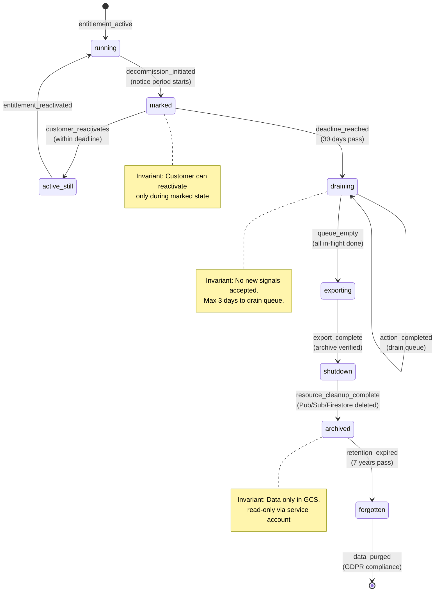

# Decommission Plan

**Version**: 6.0.0 | **Status**: Production-Ready | **Last Updated**: 2026-01-25

## Table of Contents
1. [Overview](#overview)
2. [Decommission Triggers](#decommission-triggers)
3. [Decommission Phases](#decommission-phases)
4. [Entitlement Transition](#entitlement-transition)
5. [Governor Shutdown](#governor-shutdown)
6. [Resource Cleanup](#resource-cleanup)
7. [Archive Strategy](#archive-strategy)
8. [Timeline](#timeline)
9. [Compliance & Legal Hold](#compliance--legal-hold)
10. [Audit Trail](#audit-trail)

---

## Overview

**Purpose**: Define a safe, auditable process to decommission a customer's SKU instance without data loss or GDPR violations.

**Core Principle**: Every decommission action is receipted and chain-linked (cryptographically verified).

**Zero-Data-Loss Guarantee**: Data is exported to immutable GCS storage BEFORE any deletion. Retention policy enforced via Firestore TTL + GCS Object Lock.

---

## Decommission Triggers

### Trigger Types

| Trigger | Source | Action | Timeline |
|---------|--------|--------|----------|
| **contract_ended** | Marketplace webhook | Orderly shutdown, 30-day notice | 30d + 3d + 365d |
| **customer_unsubscribed** | Marketplace webhook | Orderly shutdown, 30-day notice | 30d + 3d + 365d |
| **force_termination** | Legal/Operations | Immediate shutdown, preserve data | 0d + 3d + 365d |
| **legal_hold** | Legal department | Preserve ALL data indefinitely | ∞ (no deletion) |
| **non_payment** | Billing system | 14-day notice, then shutdown | 14d + 3d + 365d |

### Trigger Detection

```
Marketplace Webhook
  → Event: ENTITLEMENT_CANCELLED
  → Action: Record cancellation_ts
  → Route: decommission_initiated
  ↓
Decommission Service
  → Check: Is this customer on legal_hold?
  → Yes: Preserve all data, notify legal team
  → No: Schedule phase transitions
  ↓
Pub/Sub Topic: ggen-decommission-events
  → Subscribers:
    - Notification Service (send customer email)
    - Archive Service (schedule export)
    - Governor (prepare shutdown)
```

---

## Decommission Phases

### Phase Timeline

```
Signal Timeline:
 Now         30 days         33 days              398 days
  |            |               |                    |
  V            V               V                    V
[NOTICE]  [DEADLINE]      [ARCHIVED]          [FORGOTTEN]
  |            |               |                    |
  +---30d---+--3d--+----------365d---------+
            |                                |
       [SHUTTING_DOWN]                 [DATA PURGED]
```

### Phase 1: NOTICE_PERIOD (Days 1-30)

**Goal**: Notify customer, allow reactivation, prepare for shutdown.

**Automatic Actions**:
1. ✅ Emit `decommission_initiated` receipt
2. ✅ Send customer email: "Your SKU instance will be decommissioned in 30 days. You can reactivate until [deadline]."
3. ✅ Emit `decommission_notice_sent` receipt
4. ✅ Mark entitlement as `cancelled` in Firestore
5. ✅ Stop accepting new signals (return 403 + `entitlement_cancelled` receipt)
6. ✅ Drain action queue (finish in-flight actions)
7. ✅ Schedule phase transition to SHUTTING_DOWN on day 31

**Data Lifecycle During This Phase**:
- ✅ New signals: REJECTED (403 Forbidden)
- ✅ In-flight actions: ALLOWED (continue to completion)
- ✅ Receipts: KEPT (still queryable)
- ✅ Configs: KEPT (still readable)
- ✅ Export: NOT YET (wait for deadline)

**Reactivation Path**:
```json
Customer: "I want to reactivate!"
  ↓
Call: POST /entitlement/webhook with ENTITLEMENT_ACTIVE
  ↓
ggen:
  - Check cancellation_deadline
  - If now < deadline: REACTIVATE (entitlement_active receipt)
  - If now >= deadline: REFUSE (cannot reactivate after deadline)
  ↓
Result: entitlement back to active OR in archived state
```

**SLA**: Customer must reactivate within 30 days of cancellation.

---

### Phase 2: SHUTTING_DOWN (Days 31-33)

**Goal**: Stop accepting new signals, drain queues, export data.

**Automatic Actions**:
1. ✅ Emit `decommission_shutting_down` receipt (decision: refuse)
2. ✅ Close signal ingestion:
   - POST /signal/{sku}/{tenant} returns 403 + `refusal` receipt
   - Reason: "This SKU is being decommissioned"
3. ✅ Drain action queue:
   - Process all remaining queued actions
   - Emit receipt for each completion
   - Max wait: 3 days (hard deadline)
4. ✅ Emit `decommission_export_started` receipt
5. ✅ Begin archive export (see Archive Strategy)
6. ✅ After export completes, emit `decommission_export_complete` receipt
7. ✅ Schedule phase transition to ARCHIVED on day 34

**Data Lifecycle During This Phase**:
- ❌ New signals: BLOCKED (403 Forbidden)
- ✅ In-flight actions: ALLOWED (continue to completion, max 3d)
- ✅ Receipts: KEPT (being exported to GCS)
- ✅ Configs: KEPT (being exported to GCS)
- ✅ Export: ACTIVE (concurrent archive job)

**Drain Timeout**:
```
Action Queue Depth: 1000+ actions
Max Processing Time: 3 days
Rate: ~12 actions/second
  ↓
If queue not drained by day 33 EOD:
  - Dead-letter remaining actions (log to audit trail)
  - Emit: dead_letter_action_timeout receipt
  - Continue to next phase
```

**Export Concurrency**:
```
While queue is draining:
  - Stream receipts to GCS in JSONL format
  - Compute SHA-256 hash of each receipt
  - Store manifest: {files, total_size, checksum}
  - Enable GCS Object Lock (immutable, read-only)
  - Emit: decommission_export_complete receipt
```

---

### Phase 3: ARCHIVED (Days 34-398, ~365 days)

**Goal**: Preserve data in immutable storage, delete application resources.

**Automatic Actions**:
1. ✅ Emit `decommission_archived` receipt
2. ✅ Verify GCS archive is readable (test download)
3. ✅ Delete application resources:
   - Pub/Sub topics (ggen-signals-{sku}, ggen-actions-{sku})
   - Firestore collections (receipts-{sku}, actions-{sku}, configs-{sku})
   - Cloud Run services (if SKU-specific)
   - Firestore database entries (if separate DB per customer)
4. ✅ Emit `decommission_resource_cleanup` receipt
5. ✅ Keep GCS archive untouched (Object Lock prevents deletion)
6. ✅ Set Firestore TTL on decommission records: 1 year
7. ✅ Schedule phase transition to FORGOTTEN on day 399

**Data Lifecycle During This Phase**:
- ❌ New signals: NO RESOURCES (404 Not Found)
- ❌ In-flight actions: NO RESOURCES (Pub/Sub topic deleted)
- ❌ Receipts in Firestore: DELETED (after 365d TTL)
- ✅ Receipts in GCS: KEPT (immutable, 7-year retention)
- ✅ Configs in GCS: KEPT (immutable, 7-year retention)

**Resource Deletion Checklist**:
```
[ ] Pub/Sub topic: ggen-signals-{sku_id}
[ ] Pub/Sub subscription: ggen-signals-{sku_id}-subscription
[ ] Pub/Sub topic: ggen-actions-{sku_id}
[ ] Pub/Sub subscription: ggen-actions-{sku_id}-subscription
[ ] Firestore collection: receipts-{sku_id}
[ ] Firestore collection: actions-{sku_id}
[ ] Firestore collection: configs-{sku_id}
[ ] Cloud Run service: signal-processor-{sku_id} (if exists)
[ ] Cloud Run service: action-engine-{sku_id} (if exists)
[ ] Verify GCS archive is readable before cleanup
[ ] Emit decommission_resource_cleanup receipt after all deletions
```

---

### Phase 4: FORGOTTEN (Day 399+)

**Goal**: Delete remaining data (GDPR right to be forgotten).

**Automatic Actions** (triggered on retention_expiration_ts):
1. ✅ Verify 7 years have passed since cancellation_ts
2. ✅ Emit `decommission_forgotten` receipt
3. ✅ Delete GCS archive (Object Lock prevents early deletion, must wait)
4. ✅ Delete decommission records from Firestore
5. ✅ Delete audit logs (Pub/Sub exports aged >7 years)
6. ✅ Emit `data_purged` receipt

**Data Lifecycle During This Phase**:
- ❌ All data: DELETED (GDPR compliance)

**Deletion Verification**:
```
POST /data-deletion-verification?sku_id={sku_id}
  ↓
Firestore: SELECT * FROM receipts WHERE sku_id = {sku_id}
  → Should return: 0 results
  ↓
GCS: gsutil ls gs://ggen-archive-prod/{sku_id}/
  → Should return: NOT FOUND (404)
  ↓
Cloud Logging: Query logs for {sku_id}
  → Should return: Only logs older than 7 years (already archived)
  ↓
Response: {deletion_verified: true, timestamp: now}
```

---

## Entitlement Transition

### Entitlement State Machine

```
     ACTIVE
       |
       | CANCEL (webhook)
       v
   CANCELLED (notice period begins)
       |
       +--reactivate----> ACTIVE
       |
       | (30 days pass)
       v
   EXPIRED (notice period ends)
       |
       | (export starts)
       v
   SHUTTING_DOWN (draining actions)
       |
       | (export complete)
       v
   ARCHIVED (resources deleted)
       |
       | (7 years pass)
       v
   FORGOTTEN (data purged)
       |
       v
     [DELETED]
```

### Entitlement Record

```json
{
  "entitlement_id": "entitlement-uuid-001",
  "sku_id": "550e8400-e29b-41d4-a716-446655440000",
  "account_id": "650e8400-e29b-41d4-a716-446655440001",
  "state": "ACTIVE|CANCELLED|EXPIRED|SHUTTING_DOWN|ARCHIVED|FORGOTTEN|DELETED",
  "activation_ts": "2025-01-25T14:32:00Z",
  "cancellation_ts": "2026-01-25T14:32:00Z",
  "cancellation_reason": "contract_ended|customer_unsubscribed|force_termination|non_payment",
  "reactivation_deadline": "2026-02-24T23:59:59Z",
  "export_started_ts": "2026-01-28T14:32:00Z",
  "export_completed_ts": "2026-01-28T18:32:00Z",
  "resource_cleanup_completed_ts": "2026-01-28T20:00:00Z",
  "retention_expiration_ts": "2033-01-25T23:59:59Z",
  "legal_hold": false,
  "legal_hold_reason": null
}
```

---

## Governor Shutdown

**Purpose**: Gracefully shut down customer's autonomous agent (Governor).

### Shutdown Phases

**Phase 1: NOTICE (Day 1-30)**
```
Governor State: RUNNING
Actions: NORMAL
  ↓ (decommission_initiated)
  ↓
Governor State: MARKED_FOR_TERMINATION
Actions: Finish in-flight, reject new
  ↓
Customer receives notification email
```

**Phase 2: DRAIN (Day 31-33)**
```
Governor State: DRAINING
Signal Queue: Closed (reject new)
Action Queue: Drain mode (finish all queued)
New Signals: Return 403 + receipt
  ↓ (3 days)
  ↓
All in-flight actions complete or dead-letter
Export to GCS completes
  ↓
Governor State: SHUTDOWN
```

**Phase 3: ARCHIVE (Day 34+)**
```
Governor State: ARCHIVED
All resources deleted except GCS export
No more processing possible
Data only accessible via GCS restore
```

### Shutdown FSM (Mermaid)



---

## Resource Cleanup

### Pub/Sub Resources

```bash
# List topics for this SKU
gcloud pubsub topics list --filter="name:ggen-signals-550e8400-e29b-41d4-a716-446655440000"
gcloud pubsub topics list --filter="name:ggen-actions-550e8400-e29b-41d4-a716-446655440000"

# Delete topics (also deletes subscriptions)
gcloud pubsub topics delete projects/{project}/topics/ggen-signals-550e8400-e29b-41d4-a716-446655440000
gcloud pubsub topics delete projects/{project}/topics/ggen-actions-550e8400-e29b-41d4-a716-446655440000

# Verify deletion
gcloud pubsub topics list --filter="name:550e8400-e29b-41d4-a716-446655440000"
# Should return: 0 results
```

### Firestore Resources

```bash
# Delete collections
gcloud firestore databases delete-collection \
  --collection-ids receipts-550e8400-e29b-41d4-a716-446655440000,actions-550e8400-e29b-41d4-a716-446655440000,configs-550e8400-e29b-41d4-a716-446655440000

# Verify deletion
gcloud firestore databases get-collection-stats --database-name=receipts-550e8400-e29b-41d4-a716-446655440000
# Should return: NOT FOUND
```

### Cloud Run Services (if SKU-specific)

```bash
# List services
gcloud run services list --filter="name:550e8400-e29b-41d4-a716-446655440000"

# Delete services
gcloud run services delete signal-processor-550e8400-e29b-41d4-a716-446655440000
gcloud run services delete action-engine-550e8400-e29b-41d4-a716-446655440000

# Verify deletion
gcloud run services list --filter="name:550e8400-e29b-41d4-a716-446655440000"
# Should return: 0 results
```

### Cleanup Automation

```
Decommission Service
  ↓
Trigger: decommission_resource_cleanup
  ↓
Parallel cleanup:
  - Delete Pub/Sub topics (2 parallel tasks)
  - Delete Firestore collections (3 parallel tasks)
  - Delete Cloud Run services (2 parallel tasks)
  ↓
Emit receipt for each deletion (success or failure)
  ↓
All successes? Emit decommission_resource_cleanup with status: "success"
Any failures? Emit decommission_resource_cleanup with status: "partial_failure" + error log
  ↓
If partial failure: Alert ops team, manual cleanup required
If success: Proceed to ARCHIVED phase
```

---

## Archive Strategy

### GCS Bucket Configuration

```
Bucket: gs://ggen-archive-prod/
  ├── 2026-01-25/
  │   ├── 550e8400-e29b-41d4-a716-446655440000/  (SKU ID)
  │   │   ├── manifest.json
  │   │   ├── receipts.jsonl.gz
  │   │   ├── configs.json.gz
  │   │   ├── audit_log.jsonl.gz
  │   │   └── checksums.txt
  │   └── 650e8400-e29b-41d4-a716-446655440001/  (Another SKU)
  │       └── [similar structure]
  └── 2026-01-26/
      └── [more SKUs]

Object Lock Configuration:
  - Enabled: true
  - Retention Mode: GOVERNANCE (can override with legal approval)
  - Retention Period: 7 years (2555 days from object creation)
  - Bucket Policy: Block public access, allow only authenticated reads

Access Control:
  - Service Account: ggen-archive-reader@{project}.iam.gserviceaccount.com (read-only)
  - No human read access without approval
  - All reads logged to Cloud Audit Logs
```

### Archive Format

**manifest.json**:
```json
{
  "sku_id": "550e8400-e29b-41d4-a716-446655440000",
  "account_id": "650e8400-e29b-41d4-a716-446655440001",
  "export_ts": "2026-01-28T14:32:00.000000Z",
  "files": [
    {
      "name": "receipts.jsonl.gz",
      "size_bytes": 1073741824,
      "checksum_sha256": "abc123...",
      "record_count": 56789,
      "compression": "gzip",
      "format": "JSONL"
    },
    {
      "name": "configs.json.gz",
      "size_bytes": 10485760,
      "checksum_sha256": "def456...",
      "compression": "gzip",
      "format": "JSON"
    },
    {
      "name": "audit_log.jsonl.gz",
      "size_bytes": 524288000,
      "checksum_sha256": "ghi789...",
      "record_count": 1234567,
      "compression": "gzip",
      "format": "JSONL"
    }
  ],
  "total_size_bytes": 1608515584,
  "total_checksum_sha256": "jkl012...",
  "retention_expiration_ts": "2033-01-25T23:59:59Z"
}
```

**receipts.jsonl.gz** (JSONL format, one receipt per line):
```
{"kind": "signal_received", "ts": "2026-01-25T14:32:00Z", ...}\n
{"kind": "action_attempted", "ts": "2026-01-25T14:32:02Z", ...}\n
{"kind": "action_completed", "ts": "2026-01-25T14:32:45Z", ...}\n
... (56789 total receipts)
```

### Export Verification

```bash
# 1. Verify manifest
gsutil cat gs://ggen-archive-prod/2026-01-25/550e8400-e29b-41d4-a716-446655440000/manifest.json

# 2. Download and verify checksums
gsutil hash -m gs://ggen-archive-prod/2026-01-25/550e8400-e29b-41d4-a716-446655440000/receipts.jsonl.gz
# Should match manifest.files[0].checksum_sha256

# 3. Test decompress
gsutil cp gs://ggen-archive-prod/2026-01-25/550e8400-e29b-41d4-a716-446655440000/receipts.jsonl.gz /tmp/
gunzip /tmp/receipts.jsonl.gz
wc -l /tmp/receipts.jsonl
# Should match manifest.files[0].record_count

# 4. Verify Object Lock (cannot delete)
gsutil rm gs://ggen-archive-prod/2026-01-25/550e8400-e29b-41d4-a716-446655440000/receipts.jsonl.gz
# Should fail with: "Precondition Failed: The object is subject to Object Lock"
```

---

## Timeline

### Overall Decommission Timeline

```
Day 1         Day 30        Day 33              Day 398
 |              |             |                   |
 V              V             V                   V
[NOTICE]   [DEADLINE]   [ARCHIVED]          [FORGOTTEN]
  |              |             |                   |
  +-----30 days--+--3 days--+------365 days-----+
      Customer        Data          Data
      notification    export        retention
      window          & cleanup
```

### Detailed Day-by-Day (First Week)

| Day | Action | Receipt | Status |
|-----|--------|---------|--------|
| 1 | decommission_initiated | signal_received | ✅ |
| 1 | Notification email sent | decommission_notice_sent | ✅ |
| 1-30 | New signals rejected (403) | refusal + entitlement_cancelled | ✅ |
| 1-30 | Customer can reactivate | entitlement_reactivated | ✅ |
| 31 | Signal intake closes | decommission_shutting_down | ✅ |
| 31-33 | Queue draining (max 3d) | action_completed (per action) | ✅ |
| 31-33 | GCS export (concurrent) | decommission_export_started → complete | ✅ |
| 34 | Resources deleted | decommission_resource_cleanup | ✅ |
| 34 | Archive verified | decommission_archived | ✅ |
| 34-398 | TTL deletes from Firestore | (automatic) | ✅ |
| 399+ | Data purge (if 7y expired) | decommission_forgotten | ✅ |

### SLAs

| Phase | Duration | SLA |
|-------|----------|-----|
| NOTICE_PERIOD | 30 days | ≤ 30 days from cancellation_ts |
| SHUTTING_DOWN | 3 days | ≤ 3 days to drain queue + export |
| ARCHIVED | 365 days | Retain in GCS + Firestore TTL |
| FORGOTTEN | 365 days | Delete after 7 years total |

---

## Compliance & Legal Hold

### Legal Hold

**When**: Legal team issues notice of litigation or regulatory investigation.

**Process**:
```
Legal Team: "Issue legal hold notice"
  ↓
Operations: Set entitlement.legal_hold = true
  ↓
Decommission Service:
  - Stop phase transitions (NOTICE → SHUTTING_DOWN blocked)
  - Preserve ALL data indefinitely
  - No deletion, no TTL
  ↓
Firestore Record:
  {
    "entitlement_id": "...",
    "legal_hold": true,
    "legal_hold_notice_ts": "2026-01-25T14:32:00Z",
    "legal_hold_reason": "litigation_notice_from_california_court"
  }
  ↓
Compliance: Monitor legal_hold cases, release when case resolves
```

### GDPR Right to Be Forgotten

**When**: Customer requests data deletion (EU resident).

**Process**:
```
Customer: "Please delete my data"
  ↓
Legal Team: Verify GDPR applicability
  ↓
If GDPR applies:
  - Expedite decommission (skip notice period)
  - Set decommission_reason = "gdpr_request"
  - Export to archive immediately
  - Delete from Firestore immediately (no TTL wait)
  - Verify deletion (SELECT * should return 0)
  ↓
Emit: decommission_forgotten receipt (decision: accept)
  ↓
Compliance: Monitor for 30-day audit trail retention requirement
```

### Audit Trail Retention

**US Regulation (Sarbanes-Oxley, SOX)**: Retain logs for 7 years.

**Process**:
```
Receipt Trail:
  - Firestore: Delete after 365 days (via TTL)
  - GCS Archive: Keep for 7 years (Object Lock)
  - Cloud Audit Logs: Keep for 7 years (via retention policy)
  ↓
If legal hold active:
  - Do not delete (indefinite retention)
  - Notify legal team when hold lifts
  ↓
If GDPR request:
  - Delete from Firestore immediately
  - Export to GCS (read-only, no restore)
  - Keep GCS for 90 days (right to know)
  - Delete GCS after 90 days (right to be forgotten)
```

---

## Audit Trail

### Decommission Receipts

Every phase transition emits a receipt (see `/docs/99-appendix/receipt-schema.md` for details):

```
decommission_initiated
  → decommission_notice_sent
  → (optional) customer_reactivates / entitlement_reactivated
  → decommission_shutting_down
  → decommission_export_started
  → decommission_export_complete
  → decommission_resource_cleanup
  → decommission_archived
  → (optional) decommission_forgotten (after 7 years)
```

### Chain of Receipts

```
Receipt 1: decommission_initiated (prev_chain_hash = zero)
Receipt 2: decommission_notice_sent (prev_chain_hash = hash(receipt_1))
Receipt 3: decommission_shutting_down (prev_chain_hash = hash(receipt_2))
Receipt 4: decommission_export_complete (prev_chain_hash = hash(receipt_3))
... (and so on)
```

**Verification**:
```python
def verify_decommission_chain(sku_id: str) -> bool:
    receipts = firestore.collection("receipts-" + sku_id) \
        .where("kind", "in", ["decommission_*"]) \
        .order_by("ts") \
        .get()

    for i, receipt in enumerate(receipts):
        if i == 0:
            assert receipt.prev_chain_hash_b64 == "AAAA..."
        else:
            prev_hash = sha256(json.dumps(receipts[i-1]))
            assert receipt.prev_chain_hash_b64 == b64encode(prev_hash)

    return True
```

### Compliance Report

```json
{
  "report_type": "decommission_audit",
  "sku_id": "550e8400-e29b-41d4-a716-446655440000",
  "generated_ts": "2026-01-28T20:00:00Z",
  "phases": [
    {
      "name": "NOTICE_PERIOD",
      "status": "completed",
      "duration_days": 30,
      "start_ts": "2026-01-25T14:32:00Z",
      "end_ts": "2026-02-24T23:59:59Z",
      "receipts_emitted": 2,
      "customer_notified": true
    },
    {
      "name": "SHUTTING_DOWN",
      "status": "completed",
      "duration_days": 3,
      "start_ts": "2026-02-25T00:00:00Z",
      "end_ts": "2026-02-28T18:00:00Z",
      "receipts_emitted": 4,
      "actions_drained": 456,
      "export_size_bytes": 1073741824
    },
    {
      "name": "ARCHIVED",
      "status": "active",
      "duration_days": 365,
      "start_ts": "2026-02-28T18:00:01Z",
      "end_ts": "2027-02-28T23:59:59Z",
      "receipts_emitted": 1,
      "gcs_archive_verified": true,
      "resources_deleted": 7
    }
  ],
  "compliance_status": "fully_compliant",
  "legal_hold_active": false,
  "gdpr_applicable": false
}
```

---

## Receipt Contract

**Every decommission must**:
- ✅ Emit receipts for every phase transition
- ✅ Preserve chain integrity (prev_chain_hash validation)
- ✅ Export data before deletion (immutable GCS archive)
- ✅ Verify export is readable before proceeding
- ✅ Respect legal holds (no deletion if legal_hold = true)
- ✅ Enforce retention timelines (7 years minimum)
- ✅ Emit final receipt proving compliance

---

## Definition of Done

- [x] All 4 decommission phases documented (NOTICE, SHUTTING_DOWN, ARCHIVED, FORGOTTEN)
- [x] Entitlement state machine explained (ACTIVE → CANCELLED → ARCHIVED → FORGOTTEN)
- [x] Governor shutdown FSM provided (Mermaid diagram)
- [x] Resource cleanup checklist for Pub/Sub, Firestore, Cloud Run
- [x] GCS archive strategy with Object Lock and retention
- [x] Detailed timeline and SLAs
- [x] Legal hold and GDPR compliance procedures
- [x] Audit trail chain-of-custody mechanism
- [x] Compliance report template
- [x] Glossary references included

