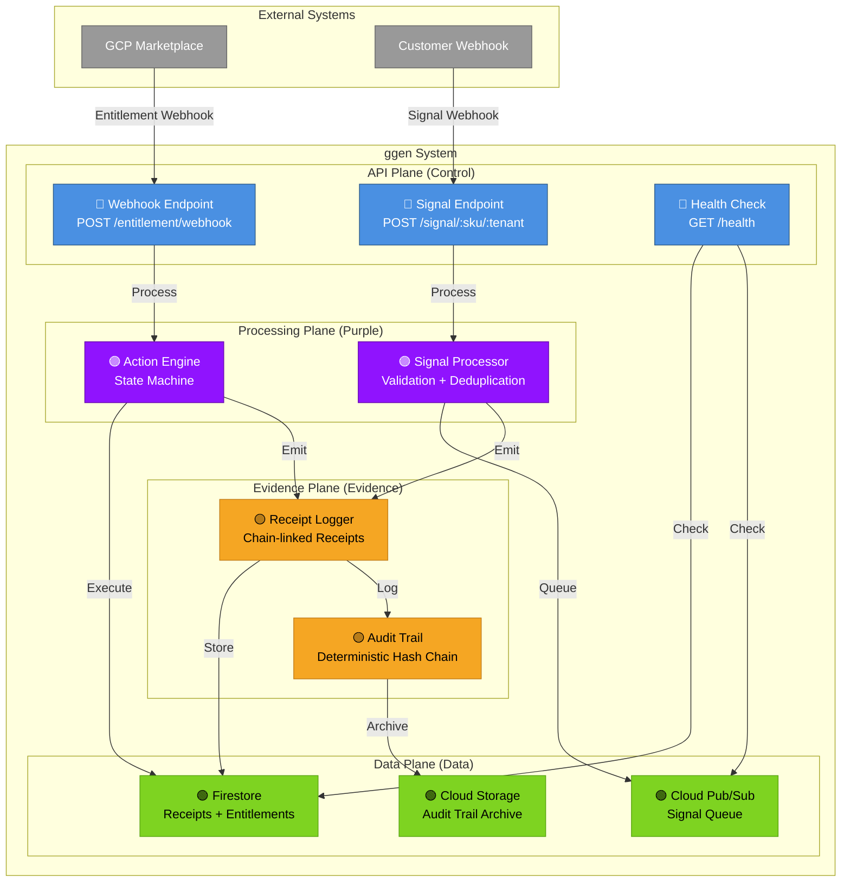
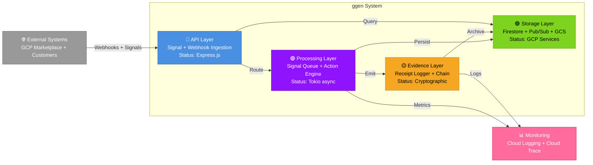
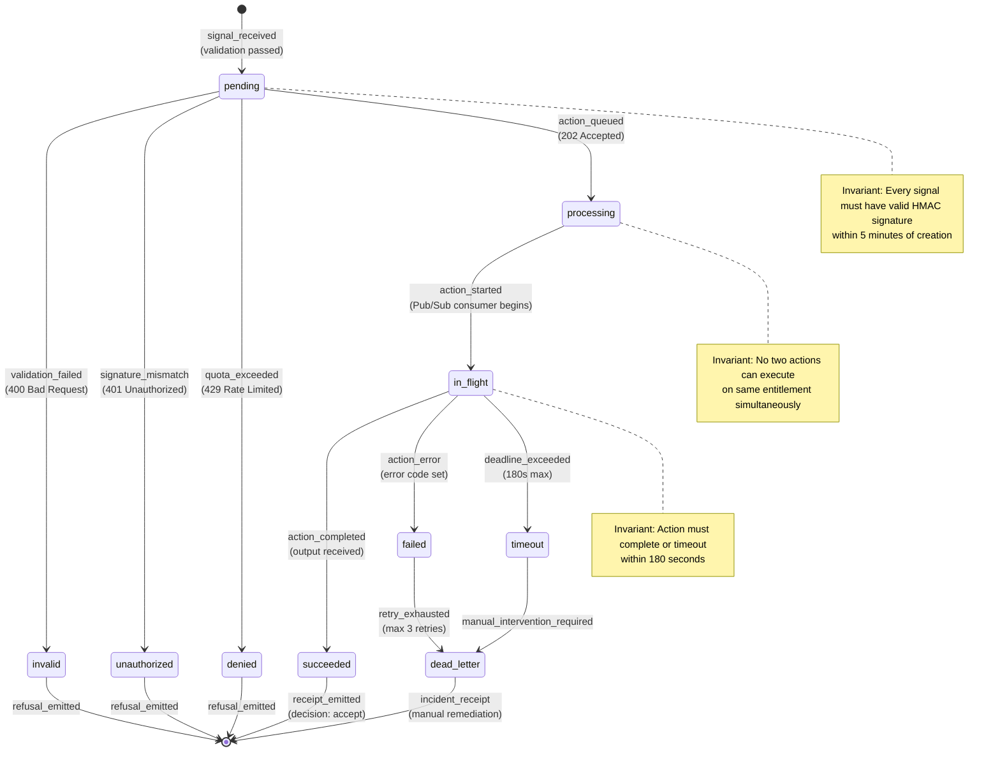
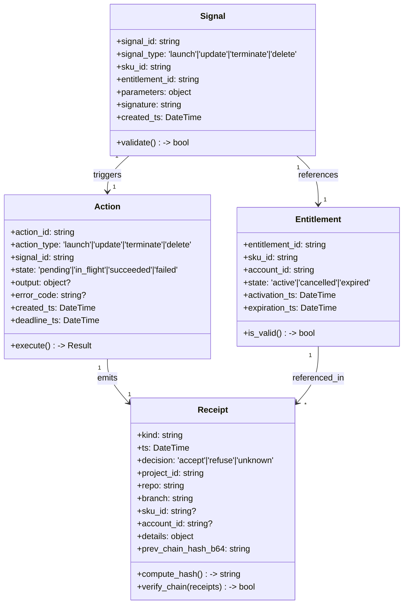
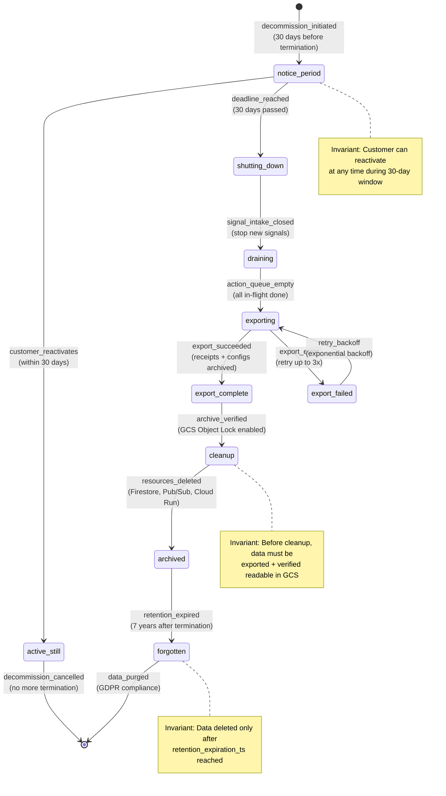
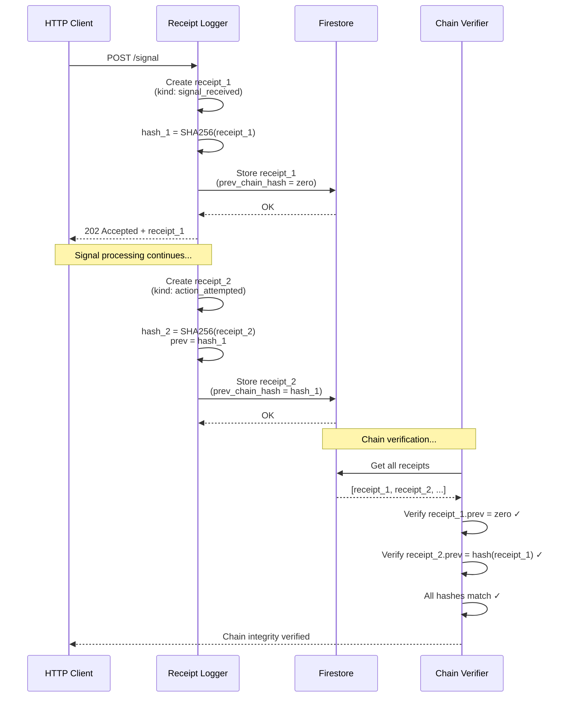

<!-- START doctoc generated TOC please keep comment here to allow auto update -->
<!-- DON'T EDIT THIS SECTION, INSTEAD RE-RUN doctoc TO UPDATE -->
**Table of Contents**

- [Mermaid Diagram Library (CANONICAL)](#mermaid-diagram-library-canonical)
  - [Table of Contents](#table-of-contents)
  - [Naming Conventions](#naming-conventions)
    - [IDs (Used in Mermaid Nodes)](#ids-used-in-mermaid-nodes)
    - [Labels (Displayed in Diagrams)](#labels-displayed-in-diagrams)
    - [Color Codes (Semantic)](#color-codes-semantic)
  - [Diagram Types](#diagram-types)
    - [C4 Model Overview](#c4-model-overview)
  - [C4 Component Diagrams](#c4-component-diagrams)
  - [C4 Container Diagrams](#c4-container-diagrams)
  - [Sequence Diagrams](#sequence-diagrams)
  - [State Machine Diagrams](#state-machine-diagrams)
  - [Class Diagrams](#class-diagrams)
  - [Examples](#examples)
    - [Example 1: Complete Decommission FSM](#example-1-complete-decommission-fsm)
    - [Example 2: Adversarial Testing Taxonomy (Block Diagram)](#example-2-adversarial-testing-taxonomy-block-diagram)
    - [Example 3: Receipt Chain Flow](#example-3-receipt-chain-flow)
  - [Receipt Contract](#receipt-contract)
  - [Definition of Done](#definition-of-done)

<!-- END doctoc generated TOC please keep comment here to allow auto update -->

# Mermaid Diagram Library (CANONICAL)

**Version**: 6.0.0 | **Status**: Production-Ready | **Last Updated**: 2026-01-25

> **CRITICAL**: This is the CANONICAL Mermaid diagram style guide. All agents and systems MUST follow these conventions. No exceptions.

## Table of Contents
1. [Naming Conventions](#naming-conventions)
2. [Color Scheme](#color-scheme)
3. [Diagram Types](#diagram-types)
4. [C4 Component Diagrams](#c4-component-diagrams)
5. [C4 Container Diagrams](#c4-container-diagrams)
6. [Sequence Diagrams](#sequence-diagrams)
7. [State Machine Diagrams](#state-machine-diagrams)
8. [Class Diagrams](#class-diagrams)
9. [Examples](#examples)

---

## Naming Conventions

### IDs (Used in Mermaid Nodes)
- **Format**: `snake_case` with underscores
- **Pattern**: `[a-z][a-z0-9_]*`
- **Examples**: `signal_ingestion`, `firestore_db`, `gcp_pubsub`

### Labels (Displayed in Diagrams)
- **Format**: `PascalCase` or `Title Case`
- **Pattern**: Capital first letter, spaces allowed
- **Examples**: `Signal Ingestion`, `Firestore Database`, `GCP Pub/Sub`

### Color Codes (Semantic)
| Plane | Color | Hex | Purpose |
|-------|-------|-----|---------|
| **Control** | Blue | #4A90E2 | API servers, control logic, decision engines |
| **Data** | Green | #7ED321 | Storage, queues, persistence layers |
| **Evidence** | Yellow | #F5A623 | Receipts, logs, audit trails |
| **Error** | Red | #D0021B | Failures, refusals, error paths |
| **Processing** | Purple | #9013FE | Workers, processors, async handlers |

---

## Diagram Types

### C4 Model Overview
- **Level 1**: System Context (system + external systems)
- **Level 2**: Containers (major components within system)
- **Level 3**: Components (detailed components within containers)
- **Level 4**: Code (classes, functions, detailed design)

We use Levels 1-3 (architectural level), not Level 4 (code detail).

---

## C4 Component Diagrams

**Purpose**: Show internal structure of a system (Level 3).

**Template**:


**Conventions**:
- Subgraphs for logical planes (API, Processing, Data, Evidence)
- 🔵 emoji for control plane components
- 🟢 emoji for data plane components
- 🟡 emoji for evidence plane components
- 🟣 emoji for processing plane components
- Color fills match plane semantics
- Labels include component type and brief purpose

---

## C4 Container Diagrams

**Purpose**: Show high-level system containers and integrations (Level 2).

**Template**:


**Conventions**:
- 3-4 major containers (API, Processing, Storage, Evidence/Monitoring)
- High-level data flows
- Technology stack listed in container label
- External systems and monitoring shown

---

## Sequence Diagrams

**Purpose**: Show message flow and interactions over time.

**Template** (Successful Signal Processing):
```mermaid
sequenceDiagram
    actor customer as Customer
    participant api as API Gateway
    participant processor as Signal Processor
    participant firestore as Firestore
    participant pubsub as Pub/Sub
    participant logger as Receipt Logger

    customer->>api: POST /signal (webhook)
    activate api

    api->>api: Verify HMAC-SHA256 signature
    alt signature_valid
        api->>processor: Queue signal
        api-->>customer: 202 Accepted + Receipt
    else signature_invalid
        api-->>customer: 401 Unauthorized + Receipt
        api->>logger: Emit refusal receipt
        deactivate api
        Note over customer: Flow stops
    end

    activate processor
    processor->>processor: Validate signal structure
    processor->>firestore: Check entitlement status
    activate firestore
    firestore-->>processor: {entitlement_id, active}
    deactivate firestore

    alt entitlement_active
        processor->>pubsub: Queue action
        processor->>logger: Emit action_attempted receipt
        deactivate processor
        Note over processor: Async processing continues
    else entitlement_expired
        processor->>logger: Emit entitlement_cancelled receipt
        deactivate processor
        Note over processor: Signal dropped
    end

    activate logger
    logger->>firestore: Store receipt (chain-linked)
    activate firestore
    firestore-->>logger: {receipt_id, chain_hash}
    deactivate firestore
    logger->>logger: Verify chain integrity
    deactivate logger
```

**Conventions**:
- **Actors**: Customer (outside system)
- **Participants**: System components (left to right order)
- **Activations**: Boxes show when component is processing
- **Alt/Else**: Conditional branches for decision points
- **Notes**: Explain key decisions or flow discontinuities
- **Message naming**: `action_type` (e.g., `verify_signature`, `queue_signal`)

---

## State Machine Diagrams

**Purpose**: Show valid state transitions and invariants.

**Template** (Signal Lifecycle):


**Conventions**:
- States: Clear, descriptive names (past tense for terminal states)
- Transitions: Include trigger event + action
- Notes: Document key invariants
- Terminal states: Point to `[*]` end marker
- Initial state: Start with `[*]` marker
- Colors: Use defaults (not customized for state machines)

---

## Class Diagrams

**Purpose**: Show data structures and relationships (very high level).

**Template**:


**Conventions**:
- Only show essential attributes and relationships
- Use type annotations
- Include key methods (`validate()`, `is_valid()`, `execute()`)
- Keep detail minimal (not a code-level diagram)

---

## Examples

### Example 1: Complete Decommission FSM



### Example 2: Adversarial Testing Taxonomy (Block Diagram)

```mermaid
graph TD
    adversarial["🔴 Adversarial Test Suite"]

    adversarial --> black_box["Black-Box Testing<br/>(No internal knowledge)"]
    adversarial --> property["Property-Based Testing<br/>(Invariant verification)"]
    adversarial --> red_team["Red Team Scenarios<br/>(Attacker simulation)"]

    black_box --> input_validation["Input Validation<br/>- Malformed JSON<br/>- Oversized payloads<br/>- Invalid characters"]
    black_box --> protocol_violation["Protocol Violation<br/>- Missing headers<br/>- Wrong HTTP methods<br/>- Invalid signatures"]
    black_box --> authz_bypass["Authorization Bypass<br/>- Actions without permission<br/>- Cross-tenant access<br/>- Privilege escalation"]
    black_box --> quota_attack["Quota/Rate Limit<br/>- Burst traffic<br/>- Sustained high load<br/>- Quota exhaustion"]

    property --> idempotency["Idempotency<br/>Same request 2x =<br/>Same response (no dups)"]
    property --> determinism["Determinism<br/>Same input =<br/>Same hash (reproducible)"]
    property --> bounded_resources["Bounded Resources<br/>Receipt generation ≤<br/>Quota limits"]
    property --> state_safety["State Safety<br/>No path violates<br/>invariants"]

    red_team --> sig_bypass["Signature Bypass<br/>- Forge HMAC<br/>- Expected: 401 refusal"]
    red_team --> entitlement_escalation["Entitlement Escalation<br/>- Change SKU to expensive<br/>- Expected: rejected"]
    red_team --> permission_escalation["Permission Escalation<br/>- Admin actions without role<br/>- Expected: 403 refusal"]
    red_team --> firestore_corruption["Firestore Corruption<br/>- Bad receipt data<br/>- Expected: hash chain fails"]

    style adversarial fill:#D0021B,stroke:#8B0000,color:#fff
    style black_box fill:#FF6B6B,stroke:#CC0000,color:#fff
    style property fill:#FF6B6B,stroke:#CC0000,color:#fff
    style red_team fill:#FF6B6B,stroke:#CC0000,color:#fff
    style input_validation fill:#FFB3B3,stroke:#FF6B6B,color:#000
    style protocol_violation fill:#FFB3B3,stroke:#FF6B6B,color:#000
    style authz_bypass fill:#FFB3B3,stroke:#FF6B6B,color:#000
    style quota_attack fill:#FFB3B3,stroke:#FF6B6B,color:#000
    style idempotency fill:#FFB3B3,stroke:#FF6B6B,color:#000
    style determinism fill:#FFB3B3,stroke:#FF6B6B,color:#000
    style bounded_resources fill:#FFB3B3,stroke:#FF6B6B,color:#000
    style state_safety fill:#FFB3B3,stroke:#FF6B6B,color:#000
    style sig_bypass fill:#FFB3B3,stroke:#FF6B6B,color:#000
    style entitlement_escalation fill:#FFB3B3,stroke:#FF6B6B,color:#000
    style permission_escalation fill:#FFB3B3,stroke:#FF6B6B,color:#000
    style firestore_corruption fill:#FFB3B3,stroke:#FF6B6B,color:#000
```



### Example 3: Receipt Chain Flow



---

## Receipt Contract

**Every Mermaid diagram MUST**:
- ✅ Follow naming conventions (snake_case IDs, Title Case labels)
- ✅ Use correct color scheme (blue control, green data, yellow evidence, red errors)
- ✅ Include descriptive labels with component type
- ✅ Have clear data flow directions
- ✅ Document key invariants in notes
- ✅ Be horizontally/vertically balanced (readable on mobile)

---

## Definition of Done

- [x] Naming conventions documented (snake_case IDs, Title Case labels)
- [x] Color scheme defined (control/data/evidence/error/processing)
- [x] 4 diagram types explained (C4 component, C4 container, sequence, state machine)
- [x] 3 complete examples provided (decommission FSM, adversarial testing, receipt chain)
- [x] Class diagram template provided (high-level, not code-level)
- [x] Glossary references included
- [x] All conventions illustrated with examples

