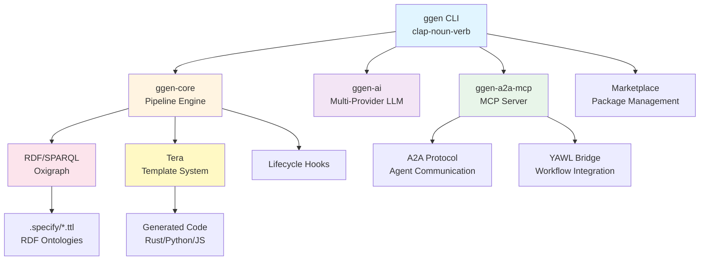
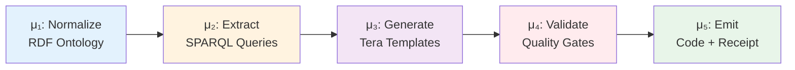
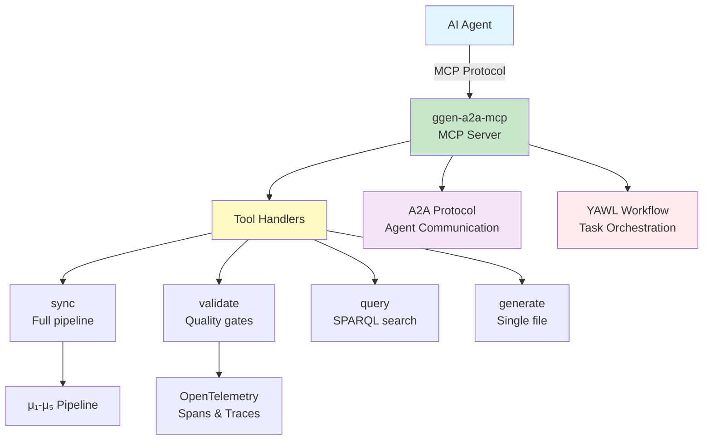
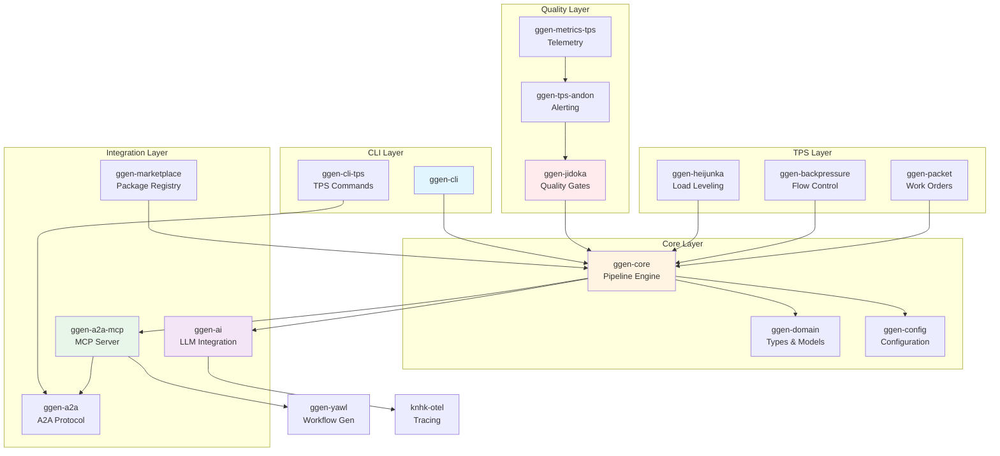

<!-- START doctoc generated TOC please keep comment here to allow auto update -->
<!-- DON'T EDIT THIS SECTION, INSTEAD RE-RUN doctoc TO UPDATE -->
**Table of Contents**

- [ggen System Architecture](#ggen-system-architecture)
  - [System Overview](#system-overview)
  - [Five-Stage μ Pipeline](#five-stage-μ-pipeline)
  - [MCP/A2A Integration](#mcpa2a-integration)
  - [Component Relationships](#component-relationships)
  - [Core Components](#core-components)
    - [1. RDF/SPARQL Engine (Oxigraph)](#1-rdfsparql-engine-oxigraph)
    - [2. Template System (Tera)](#2-template-system-tera)
    - [3. AI Integration (genai)](#3-ai-integration-genai)
    - [4. CLI Framework (clap-noun-verb)](#4-cli-framework-clap-noun-verb)
    - [5. Marketplace (Package Management)](#5-marketplace-package-management)
    - [6. Lifecycle Hooks](#6-lifecycle-hooks)
    - [7. MCP Server (ggen-a2a-mcp)](#7-mcp-server-ggen-a2a-mcp)
  - [Complete Data Flow](#complete-data-flow)
  - [Key Design Decisions](#key-design-decisions)
    - [Why RDF over JSON/YAML?](#why-rdf-over-jsonyaml)
    - [Why Tera over Other Template Engines?](#why-tera-over-other-template-engines)
    - [Why clap-noun-verb over Standard clap?](#why-clap-noun-verb-over-standard-clap)
    - [Why Multi-Provider AI (genai)?](#why-multi-provider-ai-genai)
  - [System Characteristics](#system-characteristics)
    - [Deterministic Generation](#deterministic-generation)
    - [Multi-Language Support](#multi-language-support)
    - [Environment-Specific Behavior](#environment-specific-behavior)
  - [Performance Characteristics](#performance-characteristics)
    - [Build Performance](#build-performance)
    - [Runtime Performance](#runtime-performance)
    - [Scalability](#scalability)
  - [Detailed Architecture Documentation](#detailed-architecture-documentation)
  - [Version History](#version-history)

<!-- END doctoc generated TOC please keep comment here to allow auto update -->

# ggen System Architecture

**Quick Reference**: 2-minute architecture overview
**Last Updated**: 2026-03-31
**Version**: 6.0.1

---

## System Overview



---

## Five-Stage μ Pipeline

The core code generation pipeline follows a five-stage process (μ₁-μ₅):



### Pipeline Stages

| Stage | Name | Purpose | Output |
|-------|------|---------|--------|
| **μ₁** | Normalize | Load and normalize RDF ontologies | Unified RDF graph |
| **μ₂** | Extract | SPARQL queries extract structured data | Template variables |
| **μ₃** | Generate | Tera renders templates with variables | Generated code |
| **μ₄** | Validate | Quality gates (lint, test, format) | Validation results |
| **μ₅** | Emit | Write files + cryptographic receipt | Final artifacts |

---

## MCP/A2A Integration

The MCP (Model Context Protocol) server enables AI agent integration:



### MCP Tools

| Tool | Purpose | OTEL Spans |
|------|---------|------------|
| `sync` | Run full μ₁-μ₅ pipeline | `pipeline.*`, `llm.*` |
| `validate` | Quality gate validation | `quality_gate.*` |
| `query` | SPARQL ontology search | `mcp.tool.call` |
| `generate` | Single-file generation | `mcp.tool.call` |

---

## Component Relationships



---

## Core Components

### 1. RDF/SPARQL Engine (Oxigraph)

**Purpose**: Knowledge graph processing for ontology-driven development

**Key Features**:
- In-memory and persistent RDF stores
- SPARQL 1.1 query support
- Multiple RDF formats (Turtle, RDF/XML, N-Triples)
- Graph operations (load, query, update, export)

**Data Flow**: `RDF Ontology → SPARQL Query → Template Variables`

**Example**:
```bash
# Load ontology into RDF store
ggen graph load --file schema.ttl

# Query for code generation data
ggen graph query --sparql "SELECT ?class ?property WHERE { ?class a owl:Class }"
```

**See**: `docs/explanations/fundamentals/rdf-for-programmers.md`

---

### 2. Template System (Tera)

**Purpose**: Transform RDF query results into code across multiple languages

**Key Features**:
- Jinja2-like template syntax
- Filters and functions for code generation
- Deterministic rendering (same inputs → same outputs)
- Multi-language support (Rust, Python, JavaScript, etc.)

**Data Flow**: `Template Variables → Tera Rendering → Generated Code`

**Example**:
```jinja2
// Template: class.rs.tera

pub struct {{ class.name | pascal_case }} {
    
    pub {{ prop.name }}: {{ prop.type }},
    
}

```

**See**: `docs/how-to/generation/use-templates.md`

---

### 3. AI Integration (genai)

**Purpose**: Enhance code generation with LLM intelligence

**Key Features**:
- Multi-provider abstraction (OpenAI, Anthropic, Ollama, Groq)
- Streaming responses
- Token usage tracking
- Graceful degradation (works without AI)

**Data Flow**: `RDF Context + Prompt → LLM → AI-Enhanced Code`

**Example**:
```bash
# Generate code with AI assistance
ggen ai generate --template class.rs.tera --context schema.ttl --provider anthropic
```

**See**: `docs/how-to/generation/use-ai-generation.md`

---

### 4. CLI Framework (clap-noun-verb)

**Purpose**: Auto-discovering command structure with zero boilerplate

**Key Features**:
- Automatic command discovery from crate structure
- Hierarchical commands (noun + verb pattern)
- Built-in help and validation
- Extensible via crates

**Structure**:
```
ggen/
├── graph/
│   ├── load      # ggen graph load
│   ├── query     # ggen graph query
│   └── export    # ggen graph export
├── ai/
│   ├── generate  # ggen ai generate
│   └── embed     # ggen ai embed
└── marketplace/
    ├── install   # ggen marketplace install
    └── publish   # ggen marketplace publish
```

**See**: `docs/reference/cli/auto-discovery.md`

---

### 5. Marketplace (Package Management)

**Purpose**: Distribute and version templates and ontologies

**Key Features**:
- Template packages (ggen-templates-*)
- Ontology packages (ggen-ontologies-*)
- Semantic versioning
- Dependency resolution
- Lockfile-based reproducibility

**Example**:
```bash
# Install template package
ggen marketplace install ggen-templates-rust-rest-api

# Use installed template
ggen generate --template @rust-rest-api/endpoint.rs.tera
```

**See**: `docs/how-to/marketplace/use-packages.md`

---

### 6. Lifecycle Hooks

**Purpose**: Validate and format code before/after generation

**Key Features**:
- Pre-generation validation (check prerequisites)
- Post-generation formatting (run formatters)
- Environment-specific behavior (dev vs ci vs prod)
- Configurable via ggen.toml

**Configuration** (ggen.toml):
```toml
[lifecycle]
enabled = true

[lifecycle.phases.pre_generate]
scripts = ["scripts/validate-docs/validate-all.sh"]

[lifecycle.phases.post_generate]
scripts = ["scripts/format-docs.sh"]
```

**See**: `docs/reference/configuration/lifecycle-hooks.md`

---

### 7. MCP Server (ggen-a2a-mcp)

**Purpose**: Enable AI agent integration via Model Context Protocol

**Key Features**:
- stdio and HTTP transport modes
- 4 core tools (sync, validate, query, generate)
- A2A protocol integration for multi-agent workflows
- YAWL workflow bridge for task orchestration
- OpenTelemetry tracing for all operations

**Architecture**:
```text
┌─────────────────────────────────────────────┐
│              ggen-a2a-mcp Crate             │
├─────────────┬─────────────┬─────────────────┤
│  LLM Client │ Translation │  A2A Protocol   │
│  (ggen-ai)  │    Layer    │  (a2a-gen)      │
├─────────────┼─────────────┼─────────────────┤
│  RMCP Tool  │ Conversion  │  Agent Skills   │
│  Interface  │    Layer    │  Interface      │
└─────────────┴─────────────┴─────────────────┘
```

**Tools**:
- `sync`: Run full μ₁-μ₅ pipeline with audit trail
- `validate`: Execute quality gates (lint, test, format)
- `query`: SPARQL search over ontologies
- `generate`: Single-file code generation

**See**: `docs/a2a-integration.md`, `crates/ggen-a2a-mcp/README.md`

---

## Complete Data Flow

```
1. Input: RDF Ontology (schema.ttl)
   ↓
2. Load: ggen graph load --file schema.ttl
   ↓
3. Query: SPARQL extracts structured data
   ↓
4. Template: Tera renders variables into code
   ↓
5. AI Enhancement (optional): LLM improves generated code
   ↓
6. Output: Generated code files (*.rs, *.py, *.js)
   ↓
7. Post-Processing: Lifecycle hooks format/validate
   ↓
8. Receipt: Cryptographic hash for reproducibility
```

**Key Principle**: Deterministic transforms at every step (reproducible outputs)

---

## Key Design Decisions

### Why RDF over JSON/YAML?

- ✅ **Semantic validation**: SPARQL ensures data consistency
- ✅ **Linked data**: References resolve globally (URIs)
- ✅ **Extensibility**: Add properties without breaking existing code
- ✅ **Reasoning**: Infer new facts from existing knowledge

**See**: `docs/thesis/rdf-as-universal-schema.md`

---

### Why Tera over Other Template Engines?

- ✅ **Familiar syntax**: Jinja2-like (widely known)
- ✅ **Rust native**: No FFI overhead
- ✅ **Deterministic**: Same inputs → same outputs
- ✅ **Performant**: Compiled templates, fast rendering

**See**: `docs/explanations/fundamentals/template-philosophy.md`

---

### Why clap-noun-verb over Standard clap?

- ✅ **Auto-discovery**: Add crate → command appears automatically
- ✅ **Zero boilerplate**: No manual command registration
- ✅ **Hierarchical**: Natural grouping (graph load, graph query, etc.)
- ✅ **Maintainable**: Commands live with implementation

**See**: `docs/architecture/cli-framework.md`

---

### Why Multi-Provider AI (genai)?

- ✅ **Flexibility**: Switch providers without code changes
- ✅ **Cost optimization**: Use cheaper models in dev, expensive in prod
- ✅ **Graceful degradation**: Works without AI (templates only)
- ✅ **Local support**: Ollama for offline/CI environments

**See**: `docs/thesis/ai-assisted-codegen.md`

---

## System Characteristics

### Deterministic Generation

**Goal**: Same inputs → same outputs (reproducible builds)

**Implementation**:
- RDF graphs are immutable once loaded
- SPARQL queries produce deterministic results
- Tera templates have no side effects
- No random generation (unless explicitly requested)

**Verification**: `ggen --version` output includes build hash for reproducibility

---

### Multi-Language Support

**Current Support**:
- ✅ Rust (primary target)
- ✅ Python (via Tera templates)
- ✅ JavaScript (via Tera templates)
- ✅ Any language (via custom templates)

**Extensibility**: Add new language by creating template package

---

### Environment-Specific Behavior

**Environments**: Development, CI, Production

**Configuration** (ggen.toml):
```toml
[env.development]
"ai.model" = "claude-3-haiku-20240307"  # Faster, cheaper
"logging.level" = "debug"

[env.ci]
"ai.provider" = "ollama"  # Local, no API costs
"logging.level" = "warn"

[env.production]
"ai.temperature" = 0.3  # Deterministic
"performance.max_workers" = 16
```

**See**: `docs/GGEN_TOML_NEXTJS_PATTERNS.md` for Next.js comparison

---

## Performance Characteristics

### Build Performance

- First build: ≤ 15s
- Incremental: ≤ 2s
- Check: ≤ 2s

### Runtime Performance

- RDF processing: ≤ 5s for 1k+ triples
- Template rendering: < 1ms per template
- CLI startup: ≤ 50ms

### Scalability

- Parallel generation: Up to 16 workers
- Caching: SPARQL queries, templates
- Incremental builds: Only regenerate changed files

**See**: `docs/PERFORMANCE.md`

---

## Detailed Architecture Documentation

This is a **quick reference**. For detailed documentation, see:

- **Detailed Architecture**: `docs/architecture/`
  - System design documents
  - Component specifications
  - Integration patterns

- **Fundamentals**: `docs/explanations/fundamentals/`
  - Ontology-driven development
  - RDF for programmers
  - Template philosophy

- **Thesis**: `docs/thesis/`
  - Research-level explanations
  - Design philosophy
  - Trade-off analysis

- **How-To Guides**: `docs/how-to/`
  - Practical implementation guides
  - Common scenarios
  - Best practices

- **A2A/MCP Integration**: `docs/a2a-integration.md`
  - MCP server setup
  - Agent communication
  - Workflow orchestration

---

## Version History

- **v6.0.1** (2026-03-31): MCP/A2A integration, TPS quality systems
- **v6.0.0**: Production-ready CLI with auto-discovery, lifecycle hooks, marketplace
- **v5.x**: Marketplace v2 migration, improved RDF engine
- **v4.x**: AI integration, multi-provider support
- **v3.x**: Initial release with RDF + Tera

---

**Next Steps**:
- New to ggen? → `docs/tutorials/01-quick-start.md`
- Want to generate code? → `docs/how-to/generation/`
- Understanding design? → `docs/thesis/`
- MCP/A2A integration? → `docs/a2a-integration.md`
