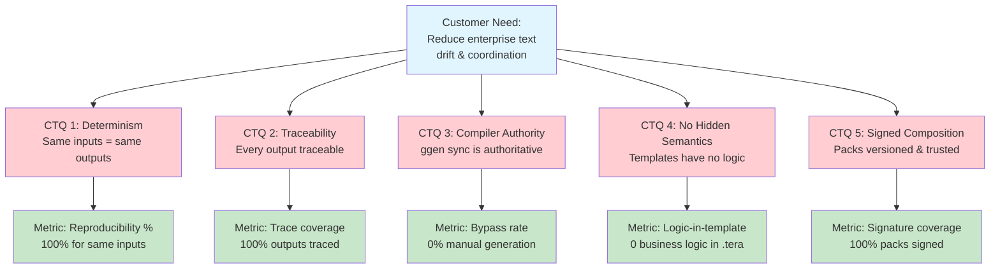
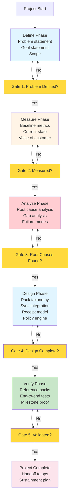
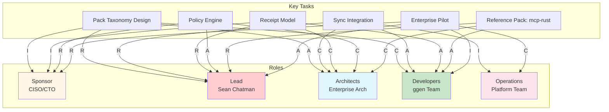

# Lean Six Sigma Project Charter — ggen

## Fortune 5 Enterprise Text Compiler Initiative

**Project Type:** Design for Lean Six Sigma (DfLSS) / Enterprise Transformation Initiative
**Business Unit:** Enterprise Architecture / Platform Engineering / AI Transformation / Knowledge Systems
**Sponsor:** CISO, CTO, Chief Enterprise Architect
**Leader:** Sean Chatman
**Black Belt / Lead Architect:** Sean Chatman

---

## 1. Business Case

Fortune 5 enterprises operate through fragmented text systems: code, APIs, workflows, spreadsheets, architecture documents, executive decks, policies, compliance artifacts, and agent capability declarations. These artifacts are currently produced and reconciled through human coordination, creating drift, delay, inconsistency, and hidden operational risk.

ggen addresses this by serving as an **ontology-governed full-text compiler** that can generate and maintain the enterprise's operational text surfaces from authoritative truth. When integrated with YAWL, MCP, A2A, receipts, and governed pack composition, ggen enables a shift from **human-coordinated production** to **machine-governed construction**.

---

## 2. Problem Statement

Current enterprise production systems rely on manual synchronization across multiple artifact classes and organizational boundaries. Architecture and implementation drift apart; protocol and capability surfaces are manually maintained; workflow, API, agent, and documentation systems are disconnected; upgrades require human choreography; validation and audit proof are reconstructed after the fact.

Within ggen itself, major enabling infrastructure exists, but critical integration and governance questions remain around pack algebra, capability composition, trust, ownership, runtime explicitness, and enterprise compiler authority.

---

## 3. Goal Statement

Design, validate, and operationalize ggen as a **governed enterprise text compiler** capable of generating coherent, deterministic, and auditable enterprise artifacts across technical, operational, architectural, and executive text surfaces.

Establish: canonical pack algebra, compiler-stage integration of packs into `ggen sync`, signed/locked/receipted pack composition, typed capability governance, deterministic generation across artifact families, enterprise policy controls suitable for Fortune 5 deployment.

---

## 4. Scope

### In Scope
- Ontology-governed artifact generation
- Pack taxonomy and composition model
- Bundle/profile/foundation pack architecture
- `ggen sync` integration for governed packs
- MCP, A2A, OpenAPI, Rust generation surfaces
- YAWL as coordination IR
- Receipt generation and proof model
- Cargo/private registry transport model
- Enterprise governance model for trust, policy, conflict resolution
- Extension to non-code artifact classes (Slidev, XLSX, architecture, quality artifacts)

### Out of Scope
- Generalized public community marketplace (phase 1)
- Unconstrained plugin ecosystem
- Manual/template-only codegen paths outside μ
- Runtime autonomy without governed receipts and validation
- Enterprise-wide rollout before reference pack proof

---

## 5. CTQs (Critical to Quality)

| # | CTQ | Definition |
|---|-----|-----------|
| 1 | **Determinism** | Same governed inputs produce same outputs |
| 2 | **Traceability** | Every output traceable to ontology, queries, templates, validators, packs |
| 3 | **Compiler Authority** | `ggen sync` is the authoritative path; no bypass generation |
| 4 | **No Hidden Semantics** | Templates contain no business logic, defaults, or inferred capability |
| 5 | **Signed Composition** | All packs versioned, trusted, policy-evaluated, lockfile-bound |
| 6 | **Conflict Safety** | Overlap, ambiguity, contradiction fail closed |
| 7 | **Runtime Explicitness** | No silent runtime selection for security-significant surfaces |
| 8 | **Proofability** | Receipts replayable, auditable, composition-aware |
| 9 | **Scalability** | Supports code, contracts, workflows, decks, spreadsheets, policy, architecture |
| 10 | **Coordination Reduction** | Demonstrable shift from manual sync to machine-governed generation |

---

## 6. Target Outcomes

### Strategic
- Establish category: **machine-governed enterprise text production**
- Cross event horizon from human-coordinated to machine-governed construction
- Reduce architecture/implementation drift
- Reduce upgrade choreography labor
- Enable enterprise capability composition at scale

### Operational
- Installable governed packs
- Pack-aware `ggen sync`
- Reference `mcp-rust` pack
- Typed atomic pack taxonomy
- Bundle and profile model
- Lockfile/provenance model
- Multi-pack receipts
- Policy-driven conflict engine

---

## 7. Baseline vs. Future State

**Baseline:** Rich but disconnected marketplace infrastructure; removed/stubbed CLI flows; no real install path; no pack-to-sync bridge; split template engines; competing architectures; strong conceptual model held by one architect; no enterprise-approved canonical pack algebra.

**Future State:** Enterprise capabilities enabled through typed pack composition; `ggen sync` loads project + pack ontology into one authoritative pipeline; YAWL, MCP, A2A, OpenAPI, Rust, receipts, Slidev, XLSX generated from common truth; profiles enforce enterprise posture; receipts prove every emitted artifact; platform does not depend on one human expert to prevent drift.

---

## 8. Measures of Success

### Primary Metrics
- % of artifacts produced through authoritative μ pipeline
- % of outputs with complete composition receipts
- % of pack installs with verified signature, provenance, lockfile entry
- Number of artifact classes emitted from shared ontology
- Reduction in manual reconciliation steps
- Reduction in drift defects between architecture, interface, implementation
- % of pack conflicts caught before generation
- % of runtime decisions made explicitly

### Secondary Metrics
- Time to enable a new governed capability
- Time to emit migration artifacts after ontology change
- Number of reusable atomic packs certified for enterprise use
- Number of business/technical text surfaces compiled from same truth source

---

## 9. Risks and Mitigations

| Risk | Mitigation |
|------|-----------|
| Concept collapse into "just a plugin marketplace" | Typed atomic pack model |
| Template/business-logic leakage | Capability-first explicit UX |
| Ambiguous ownership and overlap | Strict ownership classes |
| Silent runtime or capability defaults | Trust tiers and enterprise profiles |
| Public package trust contamination | Foundation packs for shared ontology |
| Failure to unify competing architectures | Consequence packs for upgrade law |
| Underinvestment in receipts and lockfile truth | CISO-driven policy gates |
| Institutional resistance | MCP reference pack as first proof point |

---

## 10. Methodology: DfLSS / DMADV

| Phase | Activity |
|-------|---------|
| **Define** | Problem as enterprise text drift and coordination burden |
| **Measure** | Current generation paths, manual handoffs, drift points, proof gaps |
| **Analyze** | Pack algebra, ownership conflict, runtime ambiguity, trust, compiler authority |
| **Design** | Atomic pack taxonomy, bundle/profile, sync integration, install/lockfile/provenance, receipts, CISO policy |
| **Verify** | Reference implementations: `mcp-rust`, `a2a-rust`, `openapi-rust`, one non-code target |

---

## 11. Milestones

| # | Milestone | Gate |
|---|-----------|------|
| 1 | Canonical architecture approved | Pack classes, bundle/profile distinction, CISO signoff |
| 2 | Real install path + lockfile + trust record | Ed25519 verification, cache, provenance |
| 3 | Pack-aware `ggen sync` | μ₀ integration, pack queries in pipeline |
| 4 | Reference `mcp-rust` pack proves compiler-stage generation | End-to-end proof |
| 5 | Multi-pack receipt proof | Composition receipts, provenance chain |
| 6 | Non-code enterprise text output | Broader compiler target validated |
| 7 | Enterprise pilot under controlled profile | ENTERPRISE_STRICT profile operational |

---

## 12. Deliverables by Phase

### Phase 1
- PRD/ARD for governed pack platform
- Canonical pack taxonomy
- `ggen-pack.toml` schema
- Lockfile/provenance schema
- Ownership/conflict model
- Enterprise profile model

### Phase 2
- Functioning installer
- Pack-aware `ggen sync`
- Tera-only canonical rendering path
- Reference `mcp-rust` pack
- Composition receipts

### Phase 3
- `a2a-rust` pack
- `openapi-rust` pack
- Policy foundation packs
- Runtime packs
- One enterprise text projection beyond code

### Phase 4
- Private registry integration
- Trust tiers / certification pipeline
- Enterprise rollout model
- Measurement dashboard

---

## 13. Tollgate Questions

1. Is the problem defined in measurable business terms?
2. Is the compiler authority model unambiguous?
3. Have all meaningful conflict dimensions been identified?
4. Is trust separated from package transport?
5. Are atomic packs clearly distinct from bundles and profiles?
6. Can the system fail closed on ambiguity?
7. Are receipts sufficient for audit and replay?
8. Has at least one capability family been proven end-to-end?
9. Can this reduce coordination labor at enterprise scale?
10. Does this cross the event horizon from manual synchronization to machine-governed production?

---

## Charter Statement

**This project exists to design and prove ggen as a governed enterprise text compiler that can replace human-maintained synchronization across architecture, interfaces, workflows, policies, and technical artifacts with machine-governed generation, validation, and proof.**

---

## One-Page Executive Version

| Field | Value |
|-------|-------|
| **Project** | ggen — Ontology-Governed Enterprise Text Compiler |
| **Why Now** | Fortune 5 enterprises constrained less by coding speed than by text drift and coordination overhead |
| **Goal** | Machine-governed system that compiles enterprise truth into coherent, deterministic, auditable artifact surfaces |
| **Success** | Packs install and govern; `ggen sync` authoritative; MCP/A2A/OpenAPI/Rust/Slidev/XLSX from shared truth; receipts prove outputs; profiles enforce CISO policy; coordination bottleneck reduced |
| **Critical Risks** | Hidden defaults, ambiguous overlap, public dependency trust, split architecture, false-green CLI behavior |
| **Strategic Payoff** | Cross event horizon from human-coordinated production to machine-governed construction |

---

## 14. DfLSS Visual Artifacts

### 14.1 SIPOC Diagram (Suppliers-Inputs-Process-Outputs-Customers)

```mermaid
flowchart LR
    subgraph Suppliers["Suppliers"]
        ONTO["Ontology Engineers<br/>TTL schemas"]
        TERA["Template Authors<br/>.tera templates"]
        PACK["Pack Developers<br/>ggen-pack.toml"]
        POLICY["CISO/Policy Team<br/>Enterprise rules"]
    end

    subgraph Inputs["Inputs"]
        I1["RDF Ontologies<br/>(.ttl files)"]
        I2["Templates<br/>(.tera files)"]
        I3["Pack Definitions<br/>(ggen-pack.toml)"]
        I4["Policy Rules<br/>(.rego files)"]
    end

    subgraph Process["Process: ggen sync"]
        P1["Load Ontology<br/>(μ₁)"]
        P2["Extract Queries<br/>(μ₂)"]
        P3["Generate Code<br/>(μ₃)"]
        P4["Merge & Validate<br/>(μ₄)"]
        P5["Emit Artifacts<br/>(μ₅)"]
    end

    subgraph Outputs["Outputs"]
        O1["Rust Code<br/>(.rs files)"]
        O2["OpenAPI Specs<br/>(.yaml files)"]
        O3["MCP Schemas<br/>(.json files)"]
        O4["YAWL Workflows<br/>(.xml files)"]
        O5["Receipts<br/>(.json files)"]
    end

    subgraph Customers["Customers"]
        DEV["Developers<br/>Code consumers"]
        OPS["Operations<br/>API consumers"]
        AI["AI Agents<br/>MCP/A2A users"]
        ARCH["Architects<br/>Workflow consumers"]
        AUDIT["Auditors<br/>Receipt verifiers"]
    end

    Suppliers --> Inputs
    Inputs --> Process
    Process --> Outputs
    Outputs --> Customers

    style Suppliers fill:#e1f5ff
    style Inputs fill:#fff4e6
    style Process fill:#ffcdd2
    style Outputs fill:#c8e6c9
    style Customers fill:#fce4ec
```



### 14.2 CTQ Flowdown (Critical-to-Quality Tree)



### 14.3 DMADV Phase/Gate Flowchart



### 14.4 RACI Matrix (Roles and Responsibilities)



**Legend:** R = Responsible, A = Accountable, C = Consulted, I = Informed

### 14.5 Gantt Chart (7-Month Timeline)

```mermaid
gantt
    title ggen DfLSS Project Timeline
    dateFormat YYYY-MM-DD
    section Phase 1: Define
    Problem definition           :done, p1a, 2026-04-01, 14d
    Goal statement               :done, p1b, 2026-04-01, 14d
    Scope definition             :active, p1c, 2026-04-15, 7d

    section Phase 2: Measure
    Baseline metrics             :p2a, after p1c, 14d
    Current state analysis       :p2b, after p1c, 14d
    Voice of customer            :p2c, after p1c, 14d

    section Phase 3: Analyze
    Root cause analysis          :p3a, after p2a, 21d
    Pack algebra design          :p3b, after p2a, 21d
    Failure mode analysis        :p3c, after p2a, 21d

    section Phase 4: Design
    Pack taxonomy                :p4a, after p3a, 28d
    Sync integration             :p4b, after p3a, 28d
    Receipt model                :p4c, after p3a, 28d
    Policy engine                :p4d, after p3a, 28d

    section Phase 5: Verify
    Reference mcp-rust pack      :p5a, after p4a, 28d
    End-to-end tests             :p5b, after p4a, 28d
    Milestone proof              :p5c, after p4a, 28d

    section Milestones
    M1: Architecture approved    :milestone, m1, 2026-05-01, 0d
    M2: Install path working     :milestone, m2, 2026-06-01, 0d
    M3: Pack-aware sync          :milestone, m3, 2026-07-01, 0d
    M4: Reference pack proof     :milestone, m4, 2026-08-01, 0d
    M5: Multi-pack receipts      :milestone, m5, 2026-09-01, 0d
    M6: Non-code output          :milestone, m6, 2026-10-01, 0d
    M7: Enterprise pilot        :milestone, m7, 2026-11-01, 0d
```

**Note:** Timeline spans 7 months (April 2026 - November 2026) with overlapping phases for efficiency.
