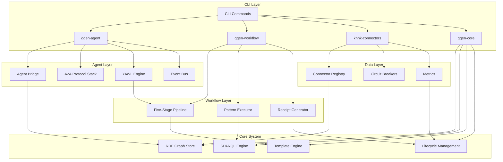

<!-- START doctoc generated TOC please keep comment here to allow auto update -->
<!-- DON'T EDIT THIS SECTION, INSTEAD RE-RUN doctoc TO UPDATE -->
**Table of Contents**

- [Integration Patterns for New Components](#integration-patterns-for-new-components)
  - [Overview](#overview)
  - [Integration Architecture](#integration-architecture)
    - [System Integration Overview](#system-integration-overview)
    - [Component Interaction Flow](#component-interaction-flow)
  - [Data Flow Patterns](#data-flow-patterns)
    - [Event-Driven Architecture](#event-driven-architecture)
    - [Pipeline Integration Pattern](#pipeline-integration-pattern)
  - [Five-Stage Pipeline Integration](#five-stage-pipeline-integration)
    - [μ₁ (Normalize) Stage Integration](#%CE%BC%E2%82%81-normalize-stage-integration)
    - [μ₂ (Extract) Stage Integration](#%CE%BC%E2%82%82-extract-stage-integration)
    - [μ₃ (Emit) Stage Integration](#%CE%BC%E2%82%83-emit-stage-integration)
    - [μ₄ (Canonicalize) Stage Integration](#%CE%BC%E2%82%84-canonicalize-stage-integration)
    - [μ₅ (Receipt) Stage Integration](#%CE%BC%E2%82%85-receipt-stage-integration)
  - [Error Handling Patterns](#error-handling-patterns)
    - [Unified Error Handling](#unified-error-handling)
    - [Circuit Breaker Pattern](#circuit-breaker-pattern)
  - [Performance Patterns](#performance-patterns)
    - [Hot Path Optimization](#hot-path-optimization)
    - [Load Balancing Pattern](#load-balancing-pattern)
  - [Security Patterns](#security-patterns)
    - [Zero-Trust Security Model](#zero-trust-security-model)
  - [Implementation Examples](#implementation-examples)
    - [End-to-End Workflow Example](#end-to-end-workflow-example)
    - [Event-Driven Example](#event-driven-example)
  - [Conclusion](#conclusion)

<!-- END doctoc generated TOC please keep comment here to allow auto update -->

# Integration Patterns for New Components

## Overview

This document outlines the integration patterns for the new components in the ggen codebase, demonstrating how `ggen-agent`, `ggen-workflow`, new CLI commands, and enterprise connectors work together within the existing 30-crate system.

## Integration Architecture

### System Integration Overview



### Component Interaction Flow

```rust
/// Unified System Interface - Central coordination point
pub struct SystemInterface {
    /// Agent system
    agent_system: AgentSystem,
    /// Workflow engine
    workflow_engine: WorkflowEngine,
    /// Connector framework
    connector_framework: ConnectorFramework,
    /// Core system
    core_system: CoreSystem,
    /// Event coordinator
    event_coordinator: EventCoordinator,
}

impl SystemInterface {
    /// Initialize all components with unified configuration
    pub fn initialize(config: SystemConfig) -> Result<Self, SystemError> {
        // Initialize core system first
        let core_system = CoreSystem::new(&config.core)?;

        // Initialize workflow engine
        let workflow_engine = WorkflowEngine::from_pipeline(&core_system.pipeline)?;

        // Initialize connector framework
        let connector_framework = ConnectorFramework::new(&config.connectors)?;

        // Initialize agent system
        let agent_system = AgentSystem::new(&config.agents, &workflow_engine)?;

        // Initialize event coordinator
        let event_coordinator = EventCoordinator::new();

        Ok(Self {
            agent_system,
            workflow_engine,
            connector_framework,
            core_system,
            event_coordinator,
        })
    }

    /// Execute unified workflow
    pub async fn execute_workflow(&mut self, workflow_spec: WorkflowSpec) -> Result<WorkflowResult, SystemError> {
        // Parse workflow specification
        let workflow = self.parse_workflow_spec(&workflow_spec)?;

        // Execute workflow stages
        self.execute_workflow_stages(&workflow).await?;

        // Collect results
        let result = self.collect_workflow_results(&workflow)?;

        // Generate receipts
        let receipt = self.generate_workflow_receipt(&result)?;

        Ok(WorkflowResult {
            result: result.data,
            receipt,
            metadata: result.metadata,
        })
    }
}
```

## Data Flow Patterns

### Event-Driven Architecture

```rust
/// Event Coordinator - Central event bus for all components
pub struct EventCoordinator {
    /// Topic-based event routing
    event_bus: EventBus,
    /// Event processors
    processors: BTreeMap<String, Box<dyn EventProcessor>>,
    /// Event filters
    filters: Vec<Box<dyn EventFilter>>,
    /// Transformers
    transformers: Vec<Box<dyn EventTransformer>>,
}

impl EventCoordinator {
    /// Process event through all components
    pub async fn process_event(&mut self, event: Event) -> Result<Vec<Event>, SystemError> {
        // Apply filters
        for filter in &self.filters {
            if !filter.filter(&event) {
                return Ok(Vec::new());
            }
        }

        // Apply transformers
        let mut transformed_events = vec![event.clone()];
        for transformer in &self.transformers {
            let mut new_events = Vec::new();
            for evt in &transformed_events {
                let transformed = transformer.transform(evt)?;
                new_events.push(transformed);
            }
            transformed_events = new_events;
        }

        // Process events through processors
        let mut results = Vec::new();
        for event in &transformed_events {
            for processor in &mut self.processors.values_mut() {
                let result = processor.process(event).await?;
                results.extend(result);
            }
        }

        // Publish to event bus
        for event in &results {
            self.event_bus.publish(event.clone()).await?;
        }

        Ok(results)
    }
}

/// Event Types for Component Communication
#[derive(Debug, Clone)]
pub enum SystemEvent {
    /// Agent lifecycle event
    AgentLifecycle {
        agent_id: AgentId,
        event: AgentLifecycleEvent,
        timestamp: u64,
    },
    /// Workflow execution event
    WorkflowExecution {
        workflow_id: WorkflowId,
        event: WorkflowExecutionEvent,
        timestamp: u64,
    },
    /// Connector event
    ConnectorEvent {
        connector_id: ConnectorId,
        event: ConnectorEvent,
        timestamp: u64,
    },
    /// Core system event
    CoreEvent {
        event: CoreSystemEvent,
        timestamp: u64,
    },
}
```

### Pipeline Integration Pattern

```rust
/// Pipeline Integration - Connect new components to five-stage pipeline
pub struct PipelineIntegration {
    /// Stage adapters for each component
    adapters: BTreeMap<StageId, Box<dyn StageAdapter>>,
    /// Pipeline hooks
    hooks: Vec<Box<dyn PipelineHook>>,
    /// Metrics collector
    metrics: PipelineMetrics,
}

impl PipelineIntegration {
    /// Integrate component with pipeline stage
    pub fn integrate_component<T>(&mut self, component: T, stage: StageId) -> Result<(), SystemError>
    where
        T: Component,
    {
        let adapter = Box::new(ComponentAdapter::new(component));
        self.adapters.insert(stage, adapter);

        // Add hooks
        if let Some(hook) = self.create_hook_for_stage(stage) {
            self.hooks.push(hook);
        }

        Ok(())
    }

    /// Process data through pipeline
    pub async fn process_pipeline(&mut self, input: PipelineInput) -> Result<PipelineOutput, SystemError> {
        let mut current_input = input;

        // Process through each stage
        for (stage_id, adapter) in &mut self.adapters {
            let stage_output = adapter.process(current_input).await?;

            // Execute hooks
            for hook in &mut self.hooks {
                hook.execute(stage_id, &current_input, &stage_output).await?;
            }

            // Update metrics
            self.metrics.record_stage_execution(*stage_id, &stage_output);

            current_input = stage_output;
        }

        Ok(current_input)
    }
}

/// Stage Adapter - Interface between components and pipeline stages
pub trait StageAdapter {
    fn process(&mut self, input: PipelineInput) -> Result<PipelineOutput, SystemError>;
    fn get_stage_id(&self) -> StageId;
    fn get_metrics(&self) -> StageMetrics;
}

/// Component Adapter - Generic adapter for any component
pub struct ComponentAdapter<T: Component> {
    component: T,
    stage_id: StageId,
}

impl<T: Component> ComponentAdapter<T> {
    pub fn new(component: T) -> Self {
        Self {
            component,
            stage_id: StageId::Unknown, // Will be set during integration
        }
    }
}

impl<T: Component> StageAdapter for ComponentAdapter<T> {
    fn process(&mut self, input: PipelineInput) -> Result<PipelineOutput, SystemError> {
        // Convert pipeline input to component input
        let component_input = self.convert_input(input)?;

        // Process through component
        let component_output = self.component.process(component_input)?;

        // Convert back to pipeline output
        self.convert_output(component_output)
    }

    fn get_stage_id(&self) -> StageId {
        self.stage_id
    }

    fn get_metrics(&self) -> StageMetrics {
        self.component.get_metrics()
    }
}
```

## Five-Stage Pipeline Integration

### μ₁ (Normalize) Stage Integration

```rust
/// μ₁ Stage Integrator - Normalize and validate component specifications
pub struct Stage1Integrator {
    /// Schema validator
    schema_validator: SchemaValidator,
    /// Configuration normalizer
    config_normalizer: ConfigNormalizer,
    /// Component registry
    component_registry: ComponentRegistry,
}

impl Stage1Integrator {
    /// Normalize agent specifications
    pub fn normalize_agent_spec(&mut self, spec: AgentSpec) -> Result<NormalizedAgentSpec, StageError> {
        // Validate against RDF schema
        let validation_result = self.schema_validator.validate_agent_spec(spec)?;

        // Normalize configuration
        let normalized_spec = self.config_normalizer.normalize_agent_spec(&validation_result)?;

        // Register component
        self.component_registry.register_agent(&normalized_spec)?;

        Ok(normalized_spec)
    }

    /// Normalize connector specifications
    pub fn normalize_connector_spec(&mut self, spec: ConnectorSpec) -> Result<NormalizedConnectorSpec, StageError> {
        // Validate against RDF schema
        let validation_result = self.schema_validator.validate_connector_spec(spec)?;

        // Normalize configuration
        let normalized_spec = self.config_normalizer.normalize_connector_spec(&validation_result)?;

        // Register component
        self.component_registry.register_connector(&normalized_spec)?;

        Ok(normalized_spec)
    }
}
```

### μ₂ (Extract) Stage Integration

```rust
/// μ₂ Stage Integrator - Extract data using SPARQL queries
pub struct Stage2Integrator {
    /// SPARQL engine
    sparql_engine: SPARQLEngine,
    /// Data extractor
    data_extractor: DataExtractor,
    /// Query optimizer
    query_optimizer: QueryOptimizer,
}

impl Stage2Integrator {
    /// Extract agent relationships
    pub fn extract_agent_relationships(&mut self, graph: &RDFGraph) -> Result<AgentRelationships, StageError> {
        // Optimize SPARQL query for agent relationships
        let optimized_query = self.query_optimizer.optimize_agent_relationships()?;

        // Execute query
        let results = self.sparql_engine.execute(graph, &optimized_query)?;

        // Extract relationships
        let relationships = self.data_extractor.extract_agent_relationships(results)?;

        Ok(relationships)
    }

    /// Extract connector data streams
    pub fn extract_connector_data(&mut self, graph: &RDFGraph) -> Result<ConnectorDataStreams, StageError> {
        // Optimize SPARQL query for connector data
        let optimized_query = self.query_optimizer.optimize_connector_data()?;

        // Execute query
        let results = self.sparql_engine.execute(graph, &optimized_query)?;

        // Extract data streams
        let data_streams = self.data_extractor.extract_connector_data(results)?;

        Ok(data_streams)
    }
}
```

### μ₃ (Emit) Stage Integration

```rust
/// μ₃ Stage Integrator - Generate output using templates
pub struct Stage3Integrator {
    /// Tera template engine
    tera: Tera,
    /// Template resolver
    template_resolver: TemplateResolver,
    /// Code generator
    code_generator: CodeGenerator,
    /// Output formatter
    output_formatter: OutputFormatter,
}

impl Stage3Integrator {
    /// Generate agent configurations
    pub fn generate_agent_configs(&mut self, context: &WorkflowContext) -> Result<GeneratedConfigs, StageError> {
        // Resolve templates for agent configuration
        let templates = self.template_resolver.resolve_agent_templates()?;

        // Generate configurations
        let mut configs = Vec::new();
        for template in templates {
            let config_content = self.tera.render_str(&template.content, &self.create_context(context))?;
            let config = self.code_generator.generate_agent_config(config_content)?;
            configs.push(config);
        }

        // Format output
        let formatted_configs = self.output_formatter.format_agent_configs(&configs)?;

        Ok(formatted_configs)
    }

    /// Generate connector configurations
    pub fn generate_connector_configs(&mut self, context: &WorkflowContext) -> Result<GeneratedConfigs, StageError> {
        // Resolve templates for connector configuration
        let templates = self.template_resolver.resolve_connector_templates()?;

        // Generate configurations
        let mut configs = Vec::new();
        for template in templates {
            let config_content = self.tera.render_str(&template.content, &self.create_context(context))?;
            let config = self.code_generator.generate_connector_config(config_content)?;
            configs.push(config);
        }

        // Format output
        let formatted_configs = self.output_formatter.format_connector_configs(&configs)?;

        Ok(formatted_configs)
    }

    fn create_context(&self, context: &WorkflowContext) -> tera::Context {
        let mut tera_context = tera::Context::new();

        // Add workflow context variables
        for (key, value) in context.variables.iter() {
            tera_context.insert(key, value);
        }

        // Add metadata
        tera_context.insert("metadata", &context.metadata);

        tera_context
    }
}
```

### μ₄ (Canonicalize) Stage Integration

```rust
/// μ₄ Stage Integrator - Canonicalize output format
pub struct Stage4Integrator {
    /// Content hasher
    content_hasher: ContentHasher,
    /// Canonicalizer
    canonicalizer: Canonicalizer,
    /// Merkle tree builder
    merkle_builder: MerkleBuilder,
    /// Deduplicator
    deduplicator: Deduplicator,
}

impl Stage4Integrator {
    /// Canonicalize agent outputs
    pub fn canonicalize_agent_output(&mut self, outputs: &[AgentOutput]) -> Result<CanonicalizedOutput, StageError> {
        // Sort outputs deterministically
        let sorted_outputs = self.deduplicator.sort_and_deduplicate(outputs)?;

        // Canonicalize format
        let canonicalized = self.canonicalizer.canonicalize_agent_outputs(&sorted_outputs)?;

        // Build Merkle tree
        let merkle_tree = self.merkle_builder.build_agent_outputs(&canonicalized)?;

        // Calculate content hash
        let content_hash = self.content_hasher.hash(&canonicalized)?;

        Ok(CanonicalizedOutput {
            content_hash,
            merkle_tree,
            data: canonicalized,
        })
    }

    /// Canonicalize connector outputs
    pub fn canonicalize_connector_output(&mut self, outputs: &[ConnectorOutput]) -> Result<CanonicalizedOutput, StageError> {
        // Sort outputs deterministically
        let sorted_outputs = self.deduplicator.sort_and_deduplicate(outputs)?;

        // Canonicalize format
        let canonicalized = self.canonicalizer.canonicalize_connector_outputs(&sorted_outputs)?;

        // Build Merkle tree
        let merkle_tree = self.merkle_builder.build_connector_outputs(&canonicalized)?;

        // Calculate content hash
        let content_hash = self.content_hasher.hash(&canonicalized)?;

        Ok(CanonicalizedOutput {
            content_hash,
            merkle_tree,
            data: canonicalized,
        })
    }
}
```

### μ₅ (Receipt) Stage Integration

```rust
/// μ₅ Stage Integrator - Generate cryptographic receipts
pub struct Stage5Integrator {
    /// Receipt generator
    receipt_generator: ReceiptGenerator,
    /// Auditor
    auditor: Auditor,
    /// Receipt store
    receipt_store: ReceiptStore,
    /// Compliance checker
    compliance_checker: ComplianceChecker,
}

impl Stage5Integrator {
    /// Generate workflow receipts
    pub fn generate_workflow_receipt(&mut self, workflow: &Workflow) -> Result<WorkflowReceipt, StageError> {
        // Generate cryptographic receipt
        let receipt = self.receipt_generator.generate_workflow_receipt(workflow)?;

        // Audit the receipt
        let audit_result = self.auditor.audit_workflow_receipt(&receipt)?;

        // Store receipt
        self.receipt_store.store_workflow_receipt(&receipt)?;

        // Check compliance
        self.compliance_checker.check_workflow_compliance(&receipt)?;

        Ok(receipt)
    }

    /// Generate agent receipts
    pub fn generate_agent_receipt(&mut self, agent: &Agent) -> Result<AgentReceipt, StageError> {
        // Generate cryptographic receipt
        let receipt = self.receipt_generator.generate_agent_receipt(agent)?;

        // Audit the receipt
        let audit_result = self.auditor.audit_agent_receipt(&receipt)?;

        // Store receipt
        self.receipt_store.store_agent_receipt(&receipt)?;

        // Check compliance
        self.compliance_checker.check_agent_compliance(&receipt)?;

        Ok(receipt)
    }

    /// Generate connector receipts
    pub fn generate_connector_receipt(&mut self, connector: &Connector) -> Result<ConnectorReceipt, StageError> {
        // Generate cryptographic receipt
        let receipt = self.receipt_generator.generate_connector_receipt(connector)?;

        // Audit the receipt
        let audit_result = self.auditor.audit_connector_receipt(&receipt)?;

        // Store receipt
        self.receipt_store.store_connector_receipt(&receipt)?;

        // Check compliance
        self.compliance_checker.check_connector_compliance(&receipt)?;

        Ok(receipt)
    }
}
```

## Error Handling Patterns

### Unified Error Handling

```rust
/// System Error - Unified error type for all components
#[derive(Debug)]
pub enum SystemError {
    /// Component-specific error
    ComponentError(String),
    /// Pipeline error
    PipelineError(String),
    /// Event error
    EventError(String),
    /// Configuration error
    ConfigurationError(String),
    /// Network error
    NetworkError(String),
    /// Security error
    SecurityError(String),
    /// Compliance error
    ComplianceError(String),
    /// Unknown error
    Unknown(String),
}

/// Error Handler - Centralized error handling
pub struct ErrorHandler {
    /// Logger
    logger: ErrorLogger,
    /// Reporter
    reporter: ErrorReporter,
    /// Recovery strategies
    recovery: RecoveryStrategies,
}

impl ErrorHandler {
    /// Handle system error
    pub async fn handle_error(&self, error: &SystemError) -> Result<(), SystemError> {
        // Log error
        self.logger.log_error(error);

        // Report error
        self.reporter.report_error(error).await?;

        // Attempt recovery
        if let Some(recovery) = self.recovery.try_recovery(error) {
            return recovery.execute().await;
        }

        // No recovery available
        Err(error.clone())
    }
}
```

### Circuit Breaker Pattern

```rust
/// System Circuit Breaker - Cross-component fault tolerance
pub struct SystemCircuitBreaker {
    /// Component-specific circuit breakers
    component_breakers: BTreeMap<ComponentId, CircuitBreaker>,
    /// Global breaker
    global_breaker: CircuitBreaker,
    /// Failure threshold
    failure_threshold: u32,
    /// Recovery timeout
    recovery_timeout_ms: u64,
}

impl SystemCircuitBreaker {
    /// Execute function with circuit breaker protection
    pub async fn execute<F, T>(&mut self, component_id: &ComponentId, f: F) -> Result<T, SystemError>
    where
        F: FnOnce() -> BoxFuture<'_, Result<T, SystemError>>,
    {
        // Check global breaker first
        if self.global_breaker.is_open() {
            return Err(SystemError::CircuitBreakerOpen);
        }

        // Get component-specific breaker
        let breaker = self.component_breakers
            .get_mut(component_id)
            .ok_or_else(|| SystemError::ComponentNotFound(component_id.clone()))?;

        // Execute with breaker protection
        breaker.call(|| async {
            f().await
        }).await
    }
}
```

## Performance Patterns

### Hot Path Optimization

```rust
/// Hot Path Cache - Frequently accessed data
#[repr(align(64))]
pub struct HotPathCache {
    /// Agent state cache
    agent_states: LruCache<AgentId, AgentState>,
    /// Workflow template cache
    workflow_templates: LruCache<WorkflowId, WorkflowTemplate>,
    /// Connector configuration cache
    connector_configs: LruCache<ConnectorId, ConnectorConfig>,
    /// SPARQL result cache
    sparql_cache: LruCache<SparqlQuery, QueryResults>,
}

/// Zero-Copy Data Transfer
pub struct ZeroCopyPipeline {
    /// Pre-allocated buffers
    buffers: BufferPool,
    /// SIMD-optimized processors
    simd_processors: Vec<Box<dyn SIMDProcessor>>,
    /// Zero-copy transfer mechanism
    transfer: ZeroCopyTransfer,
}

impl ZeroCopyPipeline {
    /// Transfer data without copying
    pub fn transfer_data(&mut self, input: &DataChunk) -> Result<DataChunk, SystemError> {
        // Acquire buffer from pool
        let mut buffer = self.buffers.acquire(input.size())?;

        // Zero-copy transfer
        let transferred = self.transfer.transfer(input, &mut buffer)?;

        // Process with SIMD
        for processor in &mut self.simd_processors {
            transferred = processor.process(transferred)?;
        }

        Ok(transferred)
    }
}
```

### Load Balancing Pattern

```rust
/// System Load Balancer - Distribute workload across components
pub struct SystemLoadBalancer {
    /// Component pool
    component_pool: Vec<ComponentHandle>,
    /// Load metrics
    load_metrics: LoadMetrics,
    /// Balancing strategy
    strategy: BalancingStrategy,
    /// Health checker
    health_checker: HealthChecker,
}

impl SystemLoadBalancer {
    /// Select best component for workload
    pub async fn select_component(&mut self, workload: &Workload) -> Result<ComponentHandle, SystemError> {
        // Filter healthy components
        let healthy_components = self.health_checker.filter_healthy(&self.component_pool).await?;

        // Calculate load metrics
        let metrics = self.load_metrics.calculate(&healthy_components).await?;

        // Select best component based on strategy
        let selected = self.strategy.select_component(workload, &metrics, &healthy_components)?;

        Ok(selected)
    }
}

/// Load Balancing Strategies
pub enum BalancingStrategy {
    /// Round robin
    RoundRobin,
    /// Least connections
    LeastConnections,
    /// Weighted round robin
    WeightedRoundRobin(Vec<f64>),
    /// Response time based
    ResponseTime,
    /// Resource utilization based
    ResourceUtilization,
}
```

## Security Patterns

### Zero-Trust Security Model

```rust
/// System Security Framework - Zero-trust security
pub struct SystemSecurityFramework {
    /// Authentication engine
    auth_engine: AuthEngine,
    /// Authorization engine
    authz_engine: AuthZEngine,
    /// Encryption engine
    encryption_engine: EncryptionEngine,
    /// Audit engine
    audit_engine: AuditEngine,
    /// Compliance checker
    compliance_engine: ComplianceEngine,
}

impl SystemSecurityFramework {
    /// Secure component communication
    pub async fn secure_communication(&self, from: &ComponentId, to: &ComponentId, data: &Data) -> Result<SecureData, SystemError> {
        // Authenticate both components
        self.auth_engine.authenticate_component(from).await?;
        self.auth_engine.authenticate_component(to).await?;

        // Check authorization
        self.authz_engine.check_permission(from, to, "communicate").await?;

        // Encrypt data
        let encrypted = self.encryption_engine.encrypt(data).await?;

        // Log audit event
        self.audit_engine.log_communication(from, to, data).await?;

        // Check compliance
        self.compliance_engine.check_communication_compliance(from, to, data).await?;

        Ok(encrypted)
    }
}
```

## Implementation Examples

### End-to-End Workflow Example

```rust
/// Complete workflow integration example
pub async fn complete_workflow_example() -> Result<WorkflowResult, SystemError> {
    // Initialize system interface
    let mut system = SystemInterface::initialize(SystemConfig::default())?;

    // Create workflow specification
    let workflow_spec = WorkflowSpec {
        name: "example-workflow".to_string(),
        stages: vec![
            StageSpec {
                name: "data-ingestion".to_string(),
                component_type: ComponentType::Connector,
                config: serde_json::json!({
                    "connector_type": "kafka",
                    "topic": "input-data",
                    "format": "json"
                }),
            },
            StageSpec {
                name: "agent-processing".to_string(),
                component_type: ComponentType::Agent,
                config: serde_json::json!({
                    "agent_type": "data-processor",
                    "workflow": "transform"
                }),
            },
            StageSpec {
                name: "output-generation".to_string(),
                component_type: ComponentType::Core,
                config: serde_json::json!({
                    "template": "output-template"
                }),
            },
        ],
    };

    // Execute workflow
    let result = system.execute_workflow(workflow_spec).await?;

    // Generate receipt
    let receipt = system.generate_workflow_receipt(&result)?;

    // Verify receipt
    let verified = receipt.verify()?;

    Ok(result)
}
```

### Event-Driven Example

```rust
/// Event-driven integration example
pub async fn event_driven_example() -> Result<Vec<Event>, SystemError> {
    // Initialize event coordinator
    let mut event_coordinator = EventCoordinator::new();

    // Register event processors
    event_coordinator.register_processor("agent", Box::new(AgentEventProcessor::new()));
    event_coordinator.register_processor("workflow", Box::new(WorkflowEventProcessor::new()));
    event_coordinator.register_processor("connector", Box::new(ConnectorEventProcessor::new()));

    // Create and process events
    let events = vec![
        SystemEvent::AgentLifecycle {
            agent_id: AgentId::new("agent-1"),
            event: AgentLifecycleEvent::Created,
            timestamp: current_timestamp(),
        },
        SystemEvent::WorkflowExecution {
            workflow_id: WorkflowId::new("workflow-1"),
            event: WorkflowExecutionEvent::Started,
            timestamp: current_timestamp(),
        },
        SystemEvent::ConnectorEvent {
            connector_id: ConnectorId::new("connector-1"),
            event: ConnectorEvent::DataReceived,
            timestamp: current_timestamp(),
        },
    ];

    // Process all events
    let mut results = Vec::new();
    for event in events {
        let processed_events = event_coordinator.process_event(event).await?;
        results.extend(processed_events);
    }

    Ok(results)
}
```

## Conclusion

The integration patterns for the new components provide a cohesive and scalable architecture that leverages the existing ggen five-stage pipeline while adding powerful new capabilities. The event-driven architecture, pipeline integration patterns, and security framework ensure that all components work together seamlessly while maintaining type safety, performance, and enterprise-grade reliability.