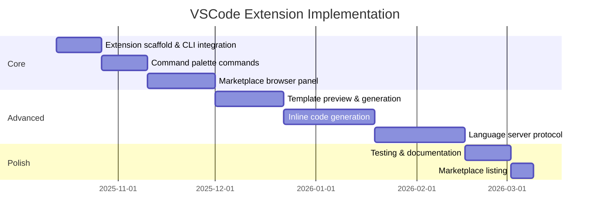

# Ggen Integration Strategy
**Comprehensive Ecosystem Architecture**

Version: 1.0
Date: 2025-10-13
Status: Design Phase

---

## Executive Summary

This document outlines the integration strategy for ggen, transforming it from a standalone CLI tool into a comprehensive development ecosystem. The strategy prioritizes developer experience, enterprise adoption, and seamless integration with existing toolchains.

### Strategic Goals

1. **Maximize Developer Reach**: Integrate with tools developers already use
2. **Enterprise-Ready**: Support enterprise workflows and security requirements
3. **Platform Agnostic**: Enable usage across all major platforms and languages
4. **Community Growth**: Foster ecosystem development through APIs and extensions

### Priority Framework

- **P0 (Critical)**: Core integrations for immediate adoption (0-3 months)
- **P1 (High)**: Key integrations for growth (3-6 months)
- **P2 (Medium)**: Enhanced capabilities (6-12 months)
- **P3 (Low)**: Long-term ecosystem expansion (12+ months)

---

## 1. IDE Integrations

### 1.1 VSCode Extension (P0)

**Design Overview**

The VSCode extension transforms ggen into a first-class IDE experience, enabling developers to discover, generate, and manage templates without leaving their editor.

**Architecture**

```
┌─────────────────────────────────────────────────────────────┐
│                    VSCode Extension                         │
├─────────────────────────────────────────────────────────────┤
│                                                             │
│  ┌──────────────┐  ┌──────────────┐  ┌──────────────┐    │
│  │   Command    │  │   WebView    │  │   Language   │    │
│  │   Palette    │  │   Panels     │  │   Server     │    │
│  └──────┬───────┘  └──────┬───────┘  └──────┬───────┘    │
│         │                  │                  │            │
│         └──────────────────┼──────────────────┘            │
│                            │                               │
│                    ┌───────▼────────┐                      │
│                    │  Extension API  │                     │
│                    └───────┬────────┘                      │
└────────────────────────────┼───────────────────────────────┘
                             │
                    ┌────────▼────────┐
                    │   Ggen CLI      │
                    │   (Rust Binary) │
                    └─────────────────┘
```

**Core Features**

1. **Command Palette Integration**
   ```typescript
   // commands.ts
   commands.registerCommand('ggen.marketSearch', async () => {
     const query = await vscode.window.showInputBox({
       prompt: 'Search marketplace',
       placeHolder: 'e.g., rust web service'
     });

     const results = await ggenCli.marketSearch(query);
     showMarketplacePanel(results);
   });
   ```

2. **Marketplace Browser Panel**
   - TreeView of categories and packages
   - Package details with ratings and usage
   - One-click installation
   - Version management

3. **Template Preview**
   ```typescript
   // preview.ts
   class TemplatePreviewProvider implements vscode.WebviewViewProvider {
     async resolveWebviewView(webviewView: vscode.WebviewView) {
       const template = await ggenCli.templateShow(templateId);
       webviewView.webview.html = renderTemplatePreview(template);
     }
   }
   ```

4. **Inline Code Generation**
   - Context menu: "Generate with ggen"
   - Quick template selection
   - Variable input forms
   - Inline diff preview before applying

5. **Status Bar Integration**
   ```typescript
   // statusBar.ts
   const statusBarItem = vscode.window.createStatusBarItem(
     vscode.StatusBarAlignment.Left
   );
   statusBarItem.text = '$(package) ggen ready';
   statusBarItem.command = 'ggen.showDashboard';
   ```

6. **Project Lifecycle Integration**
   - Task provider for lifecycle commands
   - Problem matcher for validation errors
   - Debug configuration generator

**Implementation Plan**



**Technical Specifications**

- **Language**: TypeScript
- **Framework**: VSCode Extension API
- **CLI Integration**: Child process execution with JSON output
- **WebView**: React for complex panels
- **Testing**: Jest + VSCode Test Runner
- **Distribution**: VSCode Marketplace

**Complexity**: Medium
**Priority**: P0
**Estimated Effort**: 10-12 weeks (1 developer)

---

### 1.2 IntelliJ/JetBrains Plugin (P1)

**Design Overview**

Native integration with IntelliJ IDEA, RustRover, and other JetBrains IDEs.

**Architecture**

```
┌─────────────────────────────────────────────────────────────┐
│                  IntelliJ Plugin                            │
├─────────────────────────────────────────────────────────────┤
│                                                             │
│  ┌──────────────┐  ┌──────────────┐  ┌──────────────┐    │
│  │   Actions    │  │  Tool Window │  │  Inspections │    │
│  │   & Menus    │  │   Panels     │  │   & Intents  │    │
│  └──────┬───────┘  └──────┬───────┘  └──────┬───────┘    │
│         │                  │                  │            │
│         └──────────────────┼──────────────────┘            │
│                            │                               │
│                    ┌───────▼────────┐                      │
│                    │  Plugin Service │                     │
│                    └───────┬────────┘                      │
└────────────────────────────┼───────────────────────────────┘
                             │
                    ┌────────▼────────┐
                    │   Ggen CLI      │
                    └─────────────────┘
```

**Core Features**

1. **Tool Window**
   - Docked marketplace browser
   - Template catalog
   - Lifecycle status dashboard
   - Generation history

2. **Actions**
   ```kotlin
   // GgenGenerateAction.kt
   class GgenGenerateAction : AnAction("Generate with ggen") {
       override fun actionPerformed(e: AnActionEvent) {
           val project = e.project ?: return
           val dialog = TemplateSelectionDialog(project)
           if (dialog.showAndGet()) {
               GgenService.getInstance(project)
                   .generateTemplate(dialog.selectedTemplate)
           }
       }
   }
   ```

3. **Project Templates**
   - New Project wizard integration
   - ggen templates as project types
   - Pre-configured project structure

4. **Live Templates Integration**
   - Map ggen templates to IntelliJ Live Templates
   - Variable completion
   - Custom template creation

5. **Inspection & Quick Fixes**
   - Detect outdated gpack versions
   - Suggest template improvements
   - Auto-fix common patterns

**Technical Specifications**

- **Language**: Kotlin
- **Framework**: IntelliJ Platform SDK
- **Distribution**: JetBrains Marketplace
- **Compatibility**: IntelliJ IDEA 2023.1+, RustRover, CLion

**Complexity**: High
**Priority**: P1
**Estimated Effort**: 12-16 weeks (1 developer)

---

### 1.3 Vim/Neovim Plugin (P2)

**Design Overview**

Lightweight integration for terminal-based developers.

**Core Features**

1. **Command Interface**
   ```vim
   " vim-ggen plugin
   :GgenMarketSearch rust web
   :GgenMarketAdd rust-axum-service
   :GgenTemplateGenerate service.tmpl
   :GgenLifecycleRun test
   ```

2. **Fuzzy Finder Integration**
   ```lua
   -- neovim telescope integration
   require('telescope').extensions.ggen.marketplace()
   require('telescope').extensions.ggen.templates()
   ```

3. **Completion Integration**
   - Template path completion
   - Variable name completion
   - Command completion

**Technical Specifications**

- **Language**: VimScript + Lua (Neovim)
- **Distribution**: vim-plug, packer.nvim
- **Dependencies**: fzf (optional)

**Complexity**: Low
**Priority**: P2
**Estimated Effort**: 4-6 weeks (1 developer)

---

## 2. CI/CD Integrations

### 2.1 GitHub Actions (P0)

**Design Overview**

Pre-built GitHub Actions for common ggen workflows, enabling automated template generation, validation, and marketplace publishing.

**Architecture**

```
┌─────────────────────────────────────────────────────────────┐
│                  GitHub Workflow                            │
├─────────────────────────────────────────────────────────────┤
│                                                             │
│  ┌──────────────┐  ┌──────────────┐  ┌──────────────┐    │
│  │   ggen-      │  │   ggen-      │  │   ggen-      │    │
│  │   validate   │  │   generate   │  │   publish    │    │
│  └──────┬───────┘  └──────┬───────┘  └──────┬───────┘    │
│         │                  │                  │            │
│         └──────────────────┼──────────────────┘            │
│                            │                               │
│                    ┌───────▼────────┐                      │
│                    │  GitHub Action  │                     │
│                    │   Runner Image  │                     │
│                    │  (with ggen)    │                     │
│                    └─────────────────┘                     │
└─────────────────────────────────────────────────────────────┘
```

**Pre-built Actions**

1. **ggen-setup-action**
   ```yaml
   # .github/workflows/build.yml
   - name: Setup ggen
     uses: ggen-cli/setup-ggen@v1
     with:
       version: '1.0.0'
       token: ${{ secrets.GGEN_TOKEN }}
   ```

2. **ggen-validate-action**
   ```yaml
   - name: Validate Templates
     uses: ggen-cli/validate-templates@v1
     with:
       path: './templates'
       strict: true
   ```

3. **ggen-generate-action**
   ```yaml
   - name: Generate Code
     uses: ggen-cli/generate@v1
     with:
       template: 'rust-axum-service'
       output: './src/services'
       variables: |
         service_name: user-service
         port: 8080
   ```

4. **ggen-publish-action**
   ```yaml
   - name: Publish to Marketplace
     uses: ggen-cli/publish-gpack@v1
     with:
       path: './my-gpack'
       registry: 'https://marketplace.ggen.io'
       token: ${{ secrets.GGEN_PUBLISH_TOKEN }}
   ```

5. **ggen-lifecycle-action**
   ```yaml
   - name: Run Lifecycle Stage
     uses: ggen-cli/lifecycle@v1
     with:
       stage: 'test'
       environment: 'staging'
   ```

**Common Workflows**

1. **Template Validation on PR**
   ```yaml
   name: Validate Templates
   on:
     pull_request:
       paths:
         - 'templates/**'

   jobs:
     validate:
       runs-on: ubuntu-latest
       steps:
         - uses: actions/checkout@v3
         - uses: ggen-cli/setup-ggen@v1
         - uses: ggen-cli/validate-templates@v1
           with:
             path: './templates'
   ```

2. **Automated Code Generation**
   ```yaml
   name: Generate API Clients
   on:
     push:
       paths:
         - 'api-spec.yaml'

   jobs:
     generate:
       runs-on: ubuntu-latest
       steps:
         - uses: actions/checkout@v3
         - uses: ggen-cli/setup-ggen@v1
         - uses: ggen-cli/generate@v1
           with:
             template: 'openapi-client'
             spec: './api-spec.yaml'
         - uses: peter-evans/create-pull-request@v5
           with:
             title: 'Update API clients'
   ```

3. **Marketplace Publishing**
   ```yaml
   name: Publish Package
   on:
     release:
       types: [published]

   jobs:
     publish:
       runs-on: ubuntu-latest
       steps:
         - uses: actions/checkout@v3
         - uses: ggen-cli/setup-ggen@v1
         - uses: ggen-cli/publish-gpack@v1
           with:
             token: ${{ secrets.GGEN_PUBLISH_TOKEN }}
   ```

**Technical Specifications**

- **Language**: TypeScript (action runtime), Bash (action scripts)
- **Distribution**: GitHub Marketplace
- **Container**: Alpine Linux + ggen binary
- **Caching**: Action cache for ggen installation and gpacks

**Complexity**: Low-Medium
**Priority**: P0
**Estimated Effort**: 6-8 weeks (1 developer)

---

### 2.2 GitLab CI (P1)

**Design Overview**

GitLab CI/CD templates and container images for ggen workflows.

**Core Components**

1. **CI/CD Templates**
   ```yaml
   # .gitlab-ci.yml
   include:
     - remote: 'https://ggen.io/gitlab-ci/ggen.yml'

   ggen:validate:
     extends: .ggen-validate
     variables:
       TEMPLATE_PATH: './templates'

   ggen:generate:
     extends: .ggen-generate
     variables:
       TEMPLATE: 'rust-axum-service'
   ```

2. **Container Images**
   ```dockerfile
   # Dockerfile.gitlab-ci
   FROM rust:1.75-alpine
   RUN apk add --no-cache git
   RUN cargo install ggen
   ```

**Technical Specifications**

- **Distribution**: GitLab CI/CD Catalog
- **Container Registry**: GitLab Container Registry
- **Documentation**: GitLab docs integration

**Complexity**: Low
**Priority**: P1
**Estimated Effort**: 4-6 weeks (1 developer)

---

### 2.3 Jenkins Plugin (P2)

**Design Overview**

Jenkins plugin for ggen integration in traditional CI/CD environments.

**Core Features**

1. **Pipeline Steps**
   ```groovy
   pipeline {
       stages {
           stage('Generate') {
               steps {
                   ggenGenerate template: 'rust-service',
                                variables: [service_name: 'api']
               }
           }
       }
   }
   ```

2. **Build Wrapper**
   - Auto-install ggen
   - Manage gpack cache
   - Report generation metrics

**Technical Specifications**

- **Language**: Java
- **Framework**: Jenkins Plugin API
- **Distribution**: Jenkins Update Center

**Complexity**: Medium
**Priority**: P2
**Estimated Effort**: 8-10 weeks (1 developer)

---

### 2.4 CircleCI Orb (P2)

**Design Overview**

CircleCI Orb for declarative ggen integration.

**Core Features**

```yaml
# .circleci/config.yml
version: 2.1

orbs:
  ggen: ggen/cli@1.0.0

workflows:
  build:
    jobs:
      - ggen/validate:
          path: './templates'
      - ggen/generate:
          template: 'rust-service'
          requires:
            - ggen/validate
```

**Technical Specifications**

- **Distribution**: CircleCI Orb Registry
- **Documentation**: CircleCI docs

**Complexity**: Low
**Priority**: P2
**Estimated Effort**: 4-6 weeks (1 developer)

---

## 3. Development Tool Integrations

### 3.1 cargo-make Tasks (P0)

**Design Overview**

Pre-built task definitions for common ggen workflows in Rust projects.

**Implementation**

```toml
# Makefile.toml
[tasks.ggen-init]
description = "Initialize ggen in project"
command = "ggen"
args = ["lifecycle", "run", "init"]

[tasks.ggen-generate]
description = "Generate code from templates"
command = "ggen"
args = ["template", "generate", "${TEMPLATE}"]

[tasks.ggen-validate]
description = "Validate project readiness"
command = "ggen"
args = ["lifecycle", "validate", "--env", "${ENV}"]

[tasks.ggen-deploy]
description = "Deploy using ggen lifecycle"
command = "ggen"
args = ["lifecycle", "run", "deploy", "--env", "${ENV}"]
dependencies = ["ggen-validate"]

[tasks.dev]
description = "Development workflow with ggen"
dependencies = [
    "ggen-generate",
    "build",
    "test"
]
```

**Distribution**

- Include in ggen CLI package
- Publish as standalone gpack
- Document in cargo-make cookbook

**Complexity**: Low
**Priority**: P0
**Estimated Effort**: 2-3 weeks (1 developer)

---

### 3.2 npm Scripts Integration (P1)

**Design Overview**

npm package wrapper for ggen CLI, enabling JavaScript/TypeScript projects to use ggen.

**Implementation**

1. **NPM Package**
   ```json
   {
     "name": "@ggen-cli/core",
     "version": "1.0.0",
     "bin": {
       "ggen": "./bin/ggen"
     },
     "scripts": {
       "postinstall": "node scripts/install-binary.js"
     }
   }
   ```

2. **Binary Installer**
   ```javascript
   // scripts/install-binary.js
   const { downloadBinary } = require('./download');
   const platform = process.platform;
   const arch = process.arch;

   downloadBinary(`ggen-${platform}-${arch}`, './bin/ggen');
   ```

3. **JavaScript API**
   ```javascript
   // index.js
   const { spawn } = require('child_process');

   class GgenCLI {
     async marketSearch(query) {
       const result = await this.exec(['market', 'search', query, '--json']);
       return JSON.parse(result);
     }

     async templateGenerate(template, variables) {
       return this.exec(['template', 'generate', template, '--vars', JSON.stringify(variables)]);
     }
   }

   module.exports = new GgenCLI();
   ```

4. **Usage in Projects**
   ```json
   {
     "scripts": {
       "ggen:generate": "ggen template generate rust-service",
       "ggen:validate": "ggen lifecycle validate",
       "prebuild": "npm run ggen:generate"
     },
     "devDependencies": {
       "@ggen-cli/core": "^1.0.0"
     }
   }
   ```

**Technical Specifications**

- **Language**: JavaScript/TypeScript
- **Distribution**: npm Registry
- **Binary Hosting**: GitHub Releases
- **Platforms**: Linux, macOS, Windows (x64, arm64)

**Complexity**: Medium
**Priority**: P1
**Estimated Effort**: 6-8 weeks (1 developer)

---

### 3.3 Make/Makefile Integration (P1)

**Design Overview**

Standard Makefile targets for ggen workflows.

**Implementation**

```makefile
# Makefile.ggen (include in projects)

.PHONY: ggen-init ggen-generate ggen-validate ggen-deploy

GGEN := ggen
TEMPLATE ?= rust-service
ENV ?= development

ggen-init:
	$(GGEN) lifecycle run init

ggen-generate:
	$(GGEN) template generate $(TEMPLATE)

ggen-validate:
	$(GGEN) lifecycle validate --env $(ENV)

ggen-deploy: ggen-validate
	$(GGEN) lifecycle run deploy --env $(ENV)

ggen-clean:
	$(GGEN) cache clear

# Integration targets
.PHONY: dev build deploy

dev: ggen-generate build test

build: ggen-generate
	cargo build

deploy: ggen-deploy
```

**Distribution**

- Include in ggen documentation
- Provide as downloadable template
- Generate via `ggen init` command

**Complexity**: Low
**Priority**: P1
**Estimated Effort**: 2-3 weeks (1 developer)

---

### 3.4 Docker Images (P0)

**Design Overview**

Official Docker images for ggen, enabling containerized development and CI/CD usage.

**Image Variants**

1. **Base Image (Alpine)**
   ```dockerfile
   # Dockerfile.alpine
   FROM rust:1.75-alpine AS builder
   RUN apk add --no-cache musl-dev git
   COPY . /build
   WORKDIR /build
   RUN cargo build --release --target x86_64-unknown-linux-musl

   FROM alpine:3.19
   RUN apk add --no-cache ca-certificates git
   COPY --from=builder /build/target/x86_64-unknown-linux-musl/release/ggen /usr/local/bin/
   ENTRYPOINT ["ggen"]
   CMD ["--help"]
   ```

2. **Full Image (Debian)**
   ```dockerfile
   # Dockerfile.debian
   FROM rust:1.75 AS builder
   COPY . /build
   WORKDIR /build
   RUN cargo build --release

   FROM debian:bookworm-slim
   RUN apt-get update && apt-get install -y \
       ca-certificates \
       git \
       openssh-client \
       && rm -rf /var/lib/apt/lists/*
   COPY --from=builder /build/target/release/ggen /usr/local/bin/
   ENTRYPOINT ["ggen"]
   CMD ["--help"]
   ```

3. **Development Image**
   ```dockerfile
   # Dockerfile.dev
   FROM rust:1.75
   RUN apt-get update && apt-get install -y \
       build-essential \
       git \
       openssh-client \
       && rm -rf /var/lib/apt/lists/*
   RUN cargo install ggen
   WORKDIR /workspace
   ENTRYPOINT ["ggen"]
   ```

4. **CI Image**
   ```dockerfile
   # Dockerfile.ci
   FROM ggen/ggen:latest
   RUN apk add --no-cache \
       docker-cli \
       curl \
       jq
   # Pre-install common gpacks
   RUN ggen market add rust-common && \
       ggen market add docker-templates && \
       ggen cache warmup
   ```

**Image Tagging Strategy**

```
ggen/ggen:latest          # Latest stable (alpine)
ggen/ggen:1.0.0           # Specific version (alpine)
ggen/ggen:1.0.0-alpine    # Explicit alpine
ggen/ggen:1.0.0-debian    # Debian variant
ggen/ggen:dev             # Development image
ggen/ggen:ci              # CI/CD optimized
```

**Usage Examples**

```bash
# Run ggen in container
docker run --rm -v $(pwd):/workspace ggen/ggen:latest market search "rust"

# Use in CI/CD
docker run --rm -v $(pwd):/workspace ggen/ggen:ci lifecycle validate

# Interactive development
docker run -it --rm -v $(pwd):/workspace ggen/ggen:dev bash
```

**Technical Specifications**

- **Base Images**: Alpine 3.19, Debian Bookworm
- **Registry**: Docker Hub, GitHub Container Registry
- **Architectures**: amd64, arm64
- **Size**: Alpine ~50MB, Debian ~150MB
- **Build**: Multi-stage, layer caching

**Complexity**: Low-Medium
**Priority**: P0
**Estimated Effort**: 4-6 weeks (1 developer)

---

### 3.5 Dev Containers (P1)

**Design Overview**

VSCode Dev Container and GitHub Codespaces configuration for ggen development.

**Implementation**

```json
// .devcontainer/devcontainer.json
{
  "name": "ggen Development",
  "image": "ggen/ggen:dev",
  "features": {
    "ghcr.io/devcontainers/features/rust:1": {},
    "ghcr.io/devcontainers/features/git:1": {},
    "ghcr.io/devcontainers/features/docker-in-docker:1": {}
  },
  "customizations": {
    "vscode": {
      "extensions": [
        "rust-lang.rust-analyzer",
        "ggen.ggen-vscode",
        "ms-azuretools.vscode-docker"
      ],
      "settings": {
        "ggen.autoInstall": true,
        "ggen.marketplaceUrl": "https://marketplace.ggen.io"
      }
    }
  },
  "postCreateCommand": "ggen lifecycle run init",
  "remoteUser": "vscode"
}
```

**Technical Specifications**

- **Distribution**: Dev Container spec
- **Registry**: GitHub Container Registry
- **Integration**: VSCode, GitHub Codespaces, JetBrains Gateway

**Complexity**: Low
**Priority**: P1
**Estimated Effort**: 3-4 weeks (1 developer)

---

## 4. AI Platform Integrations

### 4.1 OpenAI GPT Store App (P1)

**Design Overview**

Custom GPT for ggen, enabling natural language template generation and marketplace discovery.

**Architecture**

```
┌─────────────────────────────────────────────────────────────┐
│                    ChatGPT Interface                        │
├─────────────────────────────────────────────────────────────┤
│                                                             │
│  User: "Create a Rust web service with PostgreSQL"         │
│         ↓                                                   │
│  ┌──────────────────────────────────────────────────────┐  │
│  │  Custom GPT: ggen Assistant                          │  │
│  │  - Understands ggen commands                         │  │
│  │  - Marketplace knowledge                             │  │
│  │  - Template generation logic                         │  │
│  └───────────────────────┬──────────────────────────────┘  │
│                          │                                  │
│                   ┌──────▼──────┐                          │
│                   │   Actions   │                          │
│                   └──────┬──────┘                          │
└──────────────────────────┼─────────────────────────────────┘
                           │
                  ┌────────▼────────┐
                  │  Ggen API       │
                  │  (REST/WebHook) │
                  └─────────────────┘
```

**Custom GPT Configuration**

```yaml
# gpt-config.yaml
name: ggen Assistant
description: AI-powered code generation and marketplace discovery for ggen
instructions: |
  You are an expert assistant for the ggen CLI tool. You help developers:
  1. Search and discover packages in the ggen marketplace
  2. Generate code from templates with proper variable substitution
  3. Manage project lifecycle and deployment workflows
  4. Troubleshoot common issues and provide best practices

  Always format ggen commands in code blocks and explain what each command does.

conversation_starters:
  - "Search for Rust web service templates"
  - "Generate a microservice with authentication"
  - "How do I deploy using ggen lifecycle?"
  - "Show me popular marketplace packages"

actions:
  - type: api
    url: https://api.ggen.io/v1/gpt
    description: ggen API for marketplace search and template generation

capabilities:
  - code_interpreter
  - web_browsing
```

**API Endpoints for GPT Actions**

```rust
// src/api/gpt_actions.rs
use axum::{Router, Json};
use serde::{Deserialize, Serialize};

#[derive(Deserialize)]
struct MarketSearchRequest {
    query: String,
    limit: Option<u32>,
}

#[derive(Serialize)]
struct MarketSearchResponse {
    packages: Vec<PackageInfo>,
    total: u32,
}

async fn gpt_market_search(
    Json(req): Json<MarketSearchRequest>
) -> Json<MarketSearchResponse> {
    // Implement marketplace search
}

async fn gpt_template_generate(
    Json(req): Json<TemplateGenerateRequest>
) -> Json<TemplateGenerateResponse> {
    // Implement template generation
}

pub fn gpt_routes() -> Router {
    Router::new()
        .route("/market/search", post(gpt_market_search))
        .route("/template/generate", post(gpt_template_generate))
        .route("/lifecycle/status", post(gpt_lifecycle_status))
}
```

**Example Interactions**

```
User: "I need a Rust API service with PostgreSQL and authentication"

GPT: I'll help you create that! Here's what we'll do:

1. First, let's search for relevant packages:
```bash
ggen market search "rust web authentication"
```

Based on the marketplace, I recommend these packages:
- rust-axum-service (web framework)
- postgresql-sqlx (database)
- jwt-auth-template (authentication)

2. Install the packages:
```bash
ggen market add rust-axum-service
ggen market add postgresql-sqlx
ggen market add jwt-auth-template
```

3. Generate your service:
```bash
ggen template generate rust-axum-service:api-service.tmpl \
  --var service_name=my-api \
  --var port=8080 \
  --var auth=jwt
```

This will create a complete service with:
- RESTful API endpoints
- PostgreSQL database integration
- JWT authentication
- Docker configuration
- Tests and documentation

Would you like me to proceed with generation?
```

**Technical Specifications**

- **Platform**: OpenAI GPT Store
- **API**: REST API with OAuth2 authentication
- **Hosting**: Serverless (AWS Lambda / Cloudflare Workers)
- **Rate Limiting**: Token-based quota system

**Complexity**: Medium
**Priority**: P1
**Estimated Effort**: 8-10 weeks (1 developer)

---

### 4.2 Anthropic Claude Integration Showcase (P2)

**Design Overview**

Demonstrate ggen's AI capabilities using Claude API, with focus on complex template generation and code understanding.

**Core Features**

1. **Template Generation Assistant**
   ```rust
   // src/ai/claude_assistant.rs
   pub async fn generate_template_with_claude(
       prompt: &str,
       context: &ProjectContext
   ) -> Result<GeneratedTemplate> {
       let client = ClaudeClient::new(api_key);

       let system_prompt = format!(
           "You are a code generation expert using ggen templates. \
            Generate templates based on: {}",
           context.description()
       );

       let response = client
           .messages()
           .create(system_prompt, prompt)
           .await?;

       parse_template_from_response(response)
   }
   ```

2. **Code Review Integration**
   ```rust
   pub async fn review_generated_code(
       code: &str,
       template_name: &str
   ) -> Result<ReviewReport> {
       // Use Claude to review generated code
       // Check for security issues, best practices, etc.
   }
   ```

3. **Interactive Template Builder**
   - Chat-based template creation
   - Iterative refinement
   - Best practice suggestions

**Technical Specifications**

- **API**: Anthropic Claude API
- **Models**: Claude 3 Opus, Sonnet
- **Features**: Long context, function calling
- **Integration**: ggen CLI plugin system

**Complexity**: Medium
**Priority**: P2
**Estimated Effort**: 10-12 weeks (1 developer)

---

### 4.3 Ollama Model Marketplace (P2)

**Design Overview**

Integration with Ollama for local AI model usage, enabling offline template generation.

**Core Features**

1. **Local Model Support**
   ```bash
   # Use local Ollama model
   ggen config set ai.provider ollama
   ggen config set ai.model codellama:13b

   # Generate with local model
   ggen template generate --ai-assist service.tmpl
   ```

2. **Model Management**
   ```rust
   pub async fn ensure_ollama_model(model: &str) -> Result<()> {
       let client = OllamaClient::new("http://localhost:11434");

       if !client.has_model(model).await? {
           println!("Downloading model: {}", model);
           client.pull_model(model).await?;
       }

       Ok(())
   }
   ```

3. **Performance Optimization**
   - Model caching
   - Batch processing
   - Streaming responses

**Technical Specifications**

- **API**: Ollama HTTP API
- **Models**: CodeLlama, DeepSeek Coder, WizardCoder
- **Hosting**: Local (localhost:11434)

**Complexity**: Low-Medium
**Priority**: P2
**Estimated Effort**: 6-8 weeks (1 developer)

---

### 4.4 Hugging Face Integration (P3)

**Design Overview**

Integration with Hugging Face Hub for model hosting and template sharing.

**Core Features**

1. **Model Hosting**
   - Host fine-tuned models on HF Hub
   - Version management
   - Model cards and documentation

2. **Template Datasets**
   - Share template datasets
   - Community contributions
   - Usage analytics

3. **Inference API**
   ```bash
   ggen config set ai.provider huggingface
   ggen config set ai.model ggen-cli/codegen-templates-v1
   ```

**Complexity**: Medium
**Priority**: P3
**Estimated Effort**: 8-10 weeks (1 developer)

---

## 5. Platform Integrations

### 5.1 Homebrew (P0 - Expand)

**Current Status**: Basic Homebrew formula exists

**Expansion Plan**

1. **Formula Improvements**
   ```ruby
   # Formula/ggen.rb
   class Ggen < Formula
     desc "AI-powered code generation CLI with marketplace"
     homepage "https://ggen.io"
     url "https://github.com/ggen-cli/ggen/archive/v1.0.0.tar.gz"
     sha256 "..."
     license "MIT"

     depends_on "rust" => :build
     depends_on "openssl@3"
     depends_on "git"

     def install
       system "cargo", "install", *std_cargo_args

       # Install shell completions
       generate_completions_from_executable(bin/"ggen", "completion")

       # Install man pages
       man1.install Dir["man/*.1"]

       # Install default configuration
       (etc/"ggen").install "config/default.toml" => "config.toml"
     end

     test do
       system "#{bin}/ggen", "--version"
       system "#{bin}/ggen", "market", "list"
     end
   end
   ```

2. **Tap Repository**
   ```bash
   # Create official tap
   brew tap ggen-cli/tap
   brew install ggen-cli/tap/ggen

   # Cask for GUI tools (future)
   brew install --cask ggen-cli/tap/ggen-studio
   ```

3. **Automatic Updates**
   - GitHub Actions workflow for formula updates
   - Automated testing on multiple macOS versions
   - Release automation

**Technical Specifications**

- **Repository**: homebrew-tap (GitHub)
- **Testing**: Homebrew test-bot
- **Distribution**: Homebrew core + custom tap

**Complexity**: Low
**Priority**: P0
**Estimated Effort**: 2-3 weeks (1 developer)

---

### 5.2 APT/YUM Repositories (P1)

**Design Overview**

Debian and RPM package repositories for Linux distribution.

**Architecture**

```
┌─────────────────────────────────────────────────────────────┐
│              Package Repository Infrastructure               │
├─────────────────────────────────────────────────────────────┤
│                                                             │
│  ┌──────────────┐      ┌──────────────┐                    │
│  │  APT Repo    │      │  YUM Repo    │                    │
│  │  (Debian)    │      │  (RPM)       │                    │
│  └──────┬───────┘      └──────┬───────┘                    │
│         │                     │                             │
│         └─────────┬───────────┘                             │
│                   │                                         │
│         ┌─────────▼──────────┐                             │
│         │  Package Builder   │                             │
│         │  (GitHub Actions)  │                             │
│         └────────────────────┘                             │
└─────────────────────────────────────────────────────────────┘
```

**Implementation**

1. **Debian Package**
   ```bash
   # debian/control
   Source: ggen
   Section: devel
   Priority: optional
   Maintainer: ggen Team <team@ggen.io>
   Build-Depends: debhelper-compat (= 13),
                  cargo,
                  rustc (>= 1.75),
                  libssl-dev,
                  pkg-config
   Standards-Version: 4.6.0
   Homepage: https://ggen.io

   Package: ggen
   Architecture: any
   Depends: ${shlibs:Depends}, ${misc:Depends},
            git,
            ca-certificates
   Description: AI-powered code generation CLI
    ggen is a comprehensive CLI tool for code generation,
    template management, and AI-assisted development.
   ```

2. **RPM Spec**
   ```spec
   # ggen.spec
   Name:           ggen
   Version:        1.0.0
   Release:        1%{?dist}
   Summary:        AI-powered code generation CLI

   License:        MIT
   URL:            https://ggen.io
   Source0:        https://github.com/ggen-cli/ggen/archive/v%{version}.tar.gz

   BuildRequires:  cargo
   BuildRequires:  rust >= 1.75
   BuildRequires:  openssl-devel
   Requires:       git
   Requires:       ca-certificates

   %description
   ggen is a comprehensive CLI tool for code generation,
   template management, and AI-assisted development.

   %prep
   %autosetup

   %build
   cargo build --release

   %install
   install -Dpm 0755 target/release/ggen %{buildroot}%{_bindir}/ggen

   %files
   %license LICENSE
   %doc README.md
   %{_bindir}/ggen
   ```

3. **Repository Hosting**
   ```yaml
   # .github/workflows/package-release.yml
   name: Release Packages
   on:
     release:
       types: [published]

   jobs:
     build-deb:
       runs-on: ubuntu-latest
       steps:
         - uses: actions/checkout@v3
         - name: Build Debian package
           run: |
             dpkg-buildpackage -us -uc
         - name: Upload to APT repository
           run: |
             aptly repo add ggen ../ggen_*.deb
             aptly publish update stable

     build-rpm:
       runs-on: ubuntu-latest
       steps:
         - uses: actions/checkout@v3
         - name: Build RPM package
           run: |
             rpmbuild -ba ggen.spec
         - name: Upload to YUM repository
           run: |
             createrepo --update /var/www/yum/
   ```

4. **Repository Configuration**
   ```bash
   # APT (Debian/Ubuntu)
   echo "deb [signed-by=/usr/share/keyrings/ggen-archive-keyring.gpg] \
     https://repo.ggen.io/apt stable main" | \
     sudo tee /etc/apt/sources.list.d/ggen.list

   curl -fsSL https://repo.ggen.io/apt/gpg | \
     sudo gpg --dearmor -o /usr/share/keyrings/ggen-archive-keyring.gpg

   sudo apt update
   sudo apt install ggen

   # YUM (RHEL/CentOS/Fedora)
   sudo tee /etc/yum.repos.d/ggen.repo << EOF
   [ggen]
   name=ggen Repository
   baseurl=https://repo.ggen.io/yum/el\$releasever/\$basearch/
   enabled=1
   gpgcheck=1
   gpgkey=https://repo.ggen.io/yum/RPM-GPG-KEY-ggen
   EOF

   sudo yum install ggen
   ```

**Technical Specifications**

- **Hosting**: AWS S3 + CloudFront / Self-hosted
- **Package Formats**: .deb, .rpm
- **Architectures**: amd64, arm64
- **Signing**: GPG key signing
- **Updates**: Automated via GitHub Actions

**Complexity**: Medium
**Priority**: P1
**Estimated Effort**: 8-10 weeks (1 developer)

---

### 5.3 Chocolatey (Windows) (P1)

**Design Overview**

Windows package manager integration for easy installation on Windows systems.

**Implementation**

1. **Package Manifest**
   ```xml
   <?xml version="1.0" encoding="utf-8"?>
   <package xmlns="http://schemas.microsoft.com/packaging/2015/06/nuspec.xsd">
     <metadata>
       <id>ggen</id>
       <version>1.0.0</version>
       <title>ggen - AI-Powered Code Generation CLI</title>
       <authors>ggen Team</authors>
       <projectUrl>https://ggen.io</projectUrl>
       <licenseUrl>https://github.com/ggen-cli/ggen/blob/main/LICENSE</licenseUrl>
       <requireLicenseAcceptance>false</requireLicenseAcceptance>
       <description>
         ggen is a comprehensive CLI tool for code generation,
         template management, and AI-assisted development.
       </description>
       <tags>cli development code-generation ai templates rust</tags>
       <dependencies>
         <dependency id="git" version="2.0.0" />
       </dependencies>
     </metadata>
     <files>
       <file src="tools\**" target="tools" />
     </files>
   </package>
   ```

2. **Installation Script**
   ```powershell
   # tools/chocolateyinstall.ps1
   $ErrorActionPreference = 'Stop'

   $packageName = 'ggen'
   $toolsDir = "$(Split-Path -parent $MyInvocation.MyCommand.Definition)"
   $url64 = 'https://github.com/ggen-cli/ggen/releases/download/v1.0.0/ggen-windows-x86_64.zip'

   $packageArgs = @{
     packageName   = $packageName
     unzipLocation = $toolsDir
     url64bit      = $url64
     checksum64    = '...'
     checksumType64= 'sha256'
   }

   Install-ChocolateyZipPackage @packageArgs
   ```

3. **Usage**
   ```powershell
   # Install ggen
   choco install ggen

   # Update ggen
   choco upgrade ggen

   # Uninstall ggen
   choco uninstall ggen
   ```

**Technical Specifications**

- **Repository**: Chocolatey Community Repository
- **Format**: NuGet package
- **Distribution**: Automated via GitHub Actions
- **Testing**: Chocolatey Test Environment

**Complexity**: Low-Medium
**Priority**: P1
**Estimated Effort**: 4-6 weeks (1 developer)

---

### 5.4 Nix Packages (P2)

**Design Overview**

Integration with Nix package manager for reproducible builds and NixOS support.

**Implementation**

1. **Nix Derivation**
   ```nix
   # pkgs/development/tools/ggen/default.nix
   { lib
   , rustPlatform
   , fetchFromGitHub
   , pkg-config
   , openssl
   , git
   }:

   rustPlatform.buildRustPackage rec {
     pname = "ggen";
     version = "1.0.0";

     src = fetchFromGitHub {
       owner = "ggen-cli";
       repo = "ggen";
       rev = "v${version}";
       sha256 = "...";
     };

     cargoSha256 = "...";

     nativeBuildInputs = [ pkg-config ];
     buildInputs = [ openssl git ];

     meta = with lib; {
       description = "AI-powered code generation CLI";
       homepage = "https://ggen.io";
       license = licenses.mit;
       maintainers = with maintainers; [ ggen-team ];
     };
   }
   ```

2. **Flake Support**
   ```nix
   # flake.nix
   {
     description = "ggen - AI-powered code generation CLI";

     inputs = {
       nixpkgs.url = "github:NixOS/nixpkgs/nixos-unstable";
       flake-utils.url = "github:numtide/flake-utils";
     };

     outputs = { self, nixpkgs, flake-utils }:
       flake-utils.lib.eachDefaultSystem (system:
         let
           pkgs = nixpkgs.legacyPackages.${system};
         in
         {
           packages.default = pkgs.callPackage ./default.nix { };

           devShells.default = pkgs.mkShell {
             buildInputs = with pkgs; [
               rustc
               cargo
               rust-analyzer
               ggen
             ];
           };
         }
       );
   }
   ```

3. **Usage**
   ```bash
   # Install with nix-env
   nix-env -iA nixpkgs.ggen

   # Use with nix-shell
   nix-shell -p ggen

   # Use with flakes
   nix run github:ggen-cli/ggen
   nix develop github:ggen-cli/ggen
   ```

**Technical Specifications**

- **Repository**: nixpkgs (NixOS/nixpkgs)
- **Distribution**: Nix channels + flakes
- **Build**: Reproducible builds
- **Caching**: Binary cache support

**Complexity**: Medium
**Priority**: P2
**Estimated Effort**: 6-8 weeks (1 developer)

---

### 5.5 Docker Hub Official Images (P0)

**Design Overview**

Expand Docker Hub presence with official verified images and comprehensive documentation.

**Implementation Plan**

1. **Official Image Approval**
   - Submit to Docker Official Images program
   - Meet all security and documentation requirements
   - Automated vulnerability scanning

2. **Image Variants**
   ```
   ggen:latest              → ggen:1.0.0-alpine
   ggen:1                   → ggen:1.0.0-alpine
   ggen:1.0                 → ggen:1.0.0-alpine
   ggen:1.0.0               → ggen:1.0.0-alpine
   ggen:alpine              → ggen:1.0.0-alpine
   ggen:debian              → ggen:1.0.0-debian
   ggen:slim                → ggen:1.0.0-debian-slim
   ```

3. **Docker Hub Documentation**
   - Quick start guide
   - Common use cases
   - Best practices
   - Security considerations

4. **Automated Builds**
   ```yaml
   # .github/workflows/docker-publish.yml
   name: Publish Docker Images
   on:
     release:
       types: [published]

   jobs:
     publish:
       runs-on: ubuntu-latest
       steps:
         - uses: actions/checkout@v3

         - uses: docker/setup-buildx-action@v2

         - uses: docker/login-action@v2
           with:
             username: ${{ secrets.DOCKERHUB_USERNAME }}
             password: ${{ secrets.DOCKERHUB_TOKEN }}

         - uses: docker/metadata-action@v4
           id: meta
           with:
             images: ggen/ggen
             tags: |
               type=semver,pattern={{version}}
               type=semver,pattern={{major}}.{{minor}}
               type=semver,pattern={{major}}

         - uses: docker/build-push-action@v4
           with:
             context: .
             push: true
             tags: ${{ steps.meta.outputs.tags }}
             platforms: linux/amd64,linux/arm64
             cache-from: type=gha
             cache-to: type=gha,mode=max
   ```

**Technical Specifications**

- **Registry**: Docker Hub (official)
- **Verification**: Docker Official Images
- **Platforms**: linux/amd64, linux/arm64
- **Security**: Automated vulnerability scanning

**Complexity**: Low-Medium
**Priority**: P0
**Estimated Effort**: 4-6 weeks (1 developer)

---

## 6. API Development

### 6.1 REST API (P1)

**Design Overview**

RESTful API for ggen operations, enabling programmatic access and integration with other tools.

**Architecture**

```
┌─────────────────────────────────────────────────────────────┐
│                     REST API Layer                          │
├─────────────────────────────────────────────────────────────┤
│                                                             │
│  ┌──────────────┐  ┌──────────────┐  ┌──────────────┐    │
│  │  Marketplace │  │   Template   │  │  Lifecycle   │    │
│  │   Endpoints  │  │   Endpoints  │  │   Endpoints  │    │
│  └──────┬───────┘  └──────┬───────┘  └──────┬───────┘    │
│         │                  │                  │            │
│         └──────────────────┼──────────────────┘            │
│                            │                               │
│                    ┌───────▼────────┐                      │
│                    │  API Gateway   │                      │
│                    │  (Auth, Rate   │                      │
│                    │   Limiting)    │                      │
│                    └───────┬────────┘                      │
└────────────────────────────┼───────────────────────────────┘
                             │
                    ┌────────▼────────┐
                    │  Ggen Core      │
                    │  Library        │
                    └─────────────────┘
```

**API Specification**

```yaml
# openapi.yaml
openapi: 3.0.0
info:
  title: ggen API
  version: 1.0.0
  description: AI-powered code generation and marketplace API

servers:
  - url: https://api.ggen.io/v1
    description: Production API
  - url: https://api-staging.ggen.io/v1
    description: Staging API

security:
  - ApiKey: []
  - OAuth2: [read, write]

paths:
  /marketplace/search:
    get:
      summary: Search marketplace packages
      parameters:
        - name: q
          in: query
          required: true
          schema:
            type: string
        - name: limit
          in: query
          schema:
            type: integer
            default: 20
        - name: category
          in: query
          schema:
            type: string
      responses:
        '200':
          description: Search results
          content:
            application/json:
              schema:
                $ref: '#/components/schemas/SearchResults'

  /marketplace/packages/{packageId}:
    get:
      summary: Get package details
      parameters:
        - name: packageId
          in: path
          required: true
          schema:
            type: string
      responses:
        '200':
          description: Package details
          content:
            application/json:
              schema:
                $ref: '#/components/schemas/Package'

  /templates/generate:
    post:
      summary: Generate code from template
      requestBody:
        required: true
        content:
          application/json:
            schema:
              $ref: '#/components/schemas/GenerateRequest'
      responses:
        '200':
          description: Generated code
          content:
            application/json:
              schema:
                $ref: '#/components/schemas/GenerateResponse'

  /lifecycle/validate:
    post:
      summary: Validate project readiness
      requestBody:
        required: true
        content:
          application/json:
            schema:
              $ref: '#/components/schemas/ValidateRequest'
      responses:
        '200':
          description: Validation results
          content:
            application/json:
              schema:
                $ref: '#/components/schemas/ValidationReport'

components:
  securitySchemes:
    ApiKey:
      type: apiKey
      in: header
      name: X-API-Key

    OAuth2:
      type: oauth2
      flows:
        authorizationCode:
          authorizationUrl: https://auth.ggen.io/oauth/authorize
          tokenUrl: https://auth.ggen.io/oauth/token
          scopes:
            read: Read access
            write: Write access

  schemas:
    SearchResults:
      type: object
      properties:
        total:
          type: integer
        results:
          type: array
          items:
            $ref: '#/components/schemas/PackageSummary'

    Package:
      type: object
      properties:
        id:
          type: string
        name:
          type: string
        version:
          type: string
        description:
          type: string
        author:
          type: string
        downloads:
          type: integer
        rating:
          type: number
        templates:
          type: array
          items:
            $ref: '#/components/schemas/Template'

    GenerateRequest:
      type: object
      required:
        - template
      properties:
        template:
          type: string
        variables:
          type: object
          additionalProperties: true
        output:
          type: string

    GenerateResponse:
      type: object
      properties:
        files:
          type: array
          items:
            type: object
            properties:
              path:
                type: string
              content:
                type: string
```

**Implementation**

```rust
// src/api/server.rs
use axum::{Router, Json, Extension};
use axum::routing::{get, post};
use tower_http::cors::CorsLayer;
use tower_http::trace::TraceLayer;

#[tokio::main]
async fn main() -> Result<()> {
    let app = Router::new()
        // Marketplace endpoints
        .route("/marketplace/search", get(marketplace::search))
        .route("/marketplace/packages/:id", get(marketplace::get_package))
        .route("/marketplace/categories", get(marketplace::categories))

        // Template endpoints
        .route("/templates/generate", post(templates::generate))
        .route("/templates/validate", post(templates::validate))
        .route("/templates/list", get(templates::list))

        // Lifecycle endpoints
        .route("/lifecycle/validate", post(lifecycle::validate))
        .route("/lifecycle/readiness", get(lifecycle::readiness))

        // Health check
        .route("/health", get(health_check))

        // Middleware
        .layer(CorsLayer::permissive())
        .layer(TraceLayer::new_for_http())
        .layer(Extension(ApiState::new()));

    let addr = "0.0.0.0:8080".parse()?;
    axum::Server::bind(&addr)
        .serve(app.into_make_service())
        .await?;

    Ok(())
}

// src/api/marketplace.rs
pub async fn search(
    Query(params): Query<SearchParams>,
    Extension(state): Extension<ApiState>,
) -> Result<Json<SearchResults>, ApiError> {
    let results = state.marketplace
        .search(&params.q)
        .limit(params.limit)
        .category(params.category)
        .execute()
        .await?;

    Ok(Json(results))
}
```

**Client Libraries**

```rust
// Rust client
use ggen_api::Client;

#[tokio::main]
async fn main() -> Result<()> {
    let client = Client::new("https://api.ggen.io/v1")
        .with_api_key(env::var("GGEN_API_KEY")?);

    let results = client
        .marketplace()
        .search("rust web")
        .await?;

    for package in results {
        println!("{}: {}", package.name, package.description);
    }

    Ok(())
}
```

```typescript
// TypeScript/JavaScript client
import { GgenClient } from '@ggen-cli/api-client';

const client = new GgenClient({
  baseUrl: 'https://api.ggen.io/v1',
  apiKey: process.env.GGEN_API_KEY
});

const results = await client.marketplace.search('rust web');
results.forEach(pkg => {
  console.log(`${pkg.name}: ${pkg.description}`);
});
```

```python
# Python client
from ggen_api import Client

client = Client(
    base_url='https://api.ggen.io/v1',
    api_key=os.environ['GGEN_API_KEY']
)

results = client.marketplace.search('rust web')
for package in results:
    print(f"{package.name}: {package.description}")
```

**Technical Specifications**

- **Framework**: Axum (Rust)
- **Authentication**: API keys, OAuth2
- **Rate Limiting**: Token bucket algorithm
- **Documentation**: OpenAPI 3.0, auto-generated docs
- **Hosting**: AWS ECS / Kubernetes
- **Monitoring**: Prometheus metrics, distributed tracing

**Complexity**: Medium-High
**Priority**: P1
**Estimated Effort**: 12-16 weeks (2 developers)

---

### 6.2 WebAssembly Build (P2)

**Design Overview**

Compile ggen to WebAssembly for browser-based usage, enabling web-based template generation and marketplace browsing.

**Architecture**

```
┌─────────────────────────────────────────────────────────────┐
│                     Web Browser                             │
├─────────────────────────────────────────────────────────────┤
│                                                             │
│  ┌──────────────────────────────────────────────────────┐  │
│  │          JavaScript/TypeScript Frontend              │  │
│  │  ┌────────────┐  ┌────────────┐  ┌────────────┐    │  │
│  │  │ Marketplace│  │  Template  │  │  Editor    │    │  │
│  │  │  Browser   │  │  Generator │  │  Preview   │    │  │
│  │  └─────┬──────┘  └─────┬──────┘  └─────┬──────┘    │  │
│  │        └────────────────┼────────────────┘          │  │
│  └─────────────────────────┼───────────────────────────┘  │
│                            │                               │
│                    ┌───────▼────────┐                      │
│                    │  WASM Module   │                      │
│                    │  (ggen-wasm)   │                      │
│                    └────────────────┘                      │
└─────────────────────────────────────────────────────────────┘
```

**Implementation**

1. **WASM Module**
   ```rust
   // src/wasm/lib.rs
   use wasm_bindgen::prelude::*;
   use serde::{Serialize, Deserialize};

   #[wasm_bindgen]
   pub struct GgenWasm {
       inner: ggen_core::Engine,
   }

   #[wasm_bindgen]
   impl GgenWasm {
       #[wasm_bindgen(constructor)]
       pub fn new() -> Self {
           console_error_panic_hook::set_once();
           Self {
               inner: ggen_core::Engine::new(),
           }
       }

       #[wasm_bindgen]
       pub async fn search_marketplace(&self, query: &str) -> Result<JsValue, JsValue> {
           let results = self.inner
               .marketplace()
               .search(query)
               .await
               .map_err(|e| JsValue::from_str(&e.to_string()))?;

           Ok(serde_wasm_bindgen::to_value(&results)?)
       }

       #[wasm_bindgen]
       pub fn generate_template(
           &self,
           template: &str,
           variables: JsValue
       ) -> Result<JsValue, JsValue> {
           let vars: HashMap<String, String> =
               serde_wasm_bindgen::from_value(variables)?;

           let result = self.inner
               .template()
               .generate(template, vars)
               .map_err(|e| JsValue::from_str(&e.to_string()))?;

           Ok(serde_wasm_bindgen::to_value(&result)?)
       }
   }
   ```

2. **Build Configuration**
   ```toml
   [package]
   name = "ggen-wasm"
   version = "1.0.0"
   edition = "2021"

   [lib]
   crate-type = ["cdylib"]

   [dependencies]
   ggen-core = { path = "../ggen-core" }
   wasm-bindgen = "0.2"
   wasm-bindgen-futures = "0.4"
   serde = { version = "1.0", features = ["derive"] }
   serde-wasm-bindgen = "0.6"
   console_error_panic_hook = "0.1"

   [profile.release]
   opt-level = "z"
   lto = true
   codegen-units = 1
   ```

3. **JavaScript Wrapper**
   ```typescript
   // ggen-wasm/pkg/index.ts
   import init, { GgenWasm } from './ggen_wasm';

   export class Ggen {
     private wasm: GgenWasm | null = null;

     async initialize() {
       await init();
       this.wasm = new GgenWasm();
     }

     async searchMarketplace(query: string) {
       if (!this.wasm) throw new Error('Not initialized');
       return this.wasm.search_marketplace(query);
     }

     generateTemplate(template: string, variables: Record<string, string>) {
       if (!this.wasm) throw new Error('Not initialized');
       return this.wasm.generate_template(template, variables);
     }
   }
   ```

4. **Usage Example**
   ```typescript
   // example.ts
   import { Ggen } from '@ggen-cli/wasm';

   const ggen = new Ggen();
   await ggen.initialize();

   // Search marketplace
   const results = await ggen.searchMarketplace('rust web');
   console.log(results);

   // Generate template
   const generated = ggen.generateTemplate('rust-axum-service', {
     service_name: 'my-api',
     port: '8080'
   });
   console.log(generated.files);
   ```

5. **Web Application**
   ```tsx
   // components/TemplateGenerator.tsx
   import React, { useState, useEffect } from 'react';
   import { Ggen } from '@ggen-cli/wasm';

   export function TemplateGenerator() {
     const [ggen, setGgen] = useState<Ggen | null>(null);
     const [template, setTemplate] = useState('');
     const [variables, setVariables] = useState({});
     const [result, setResult] = useState(null);

     useEffect(() => {
       const init = async () => {
         const g = new Ggen();
         await g.initialize();
         setGgen(g);
       };
       init();
     }, []);

     const handleGenerate = async () => {
       if (!ggen) return;
       const generated = ggen.generateTemplate(template, variables);
       setResult(generated);
     };

     return (
       <div>
         <input
           value={template}
           onChange={e => setTemplate(e.target.value)}
           placeholder="Template name"
         />
         <button onClick={handleGenerate}>Generate</button>
         {result && <CodePreview files={result.files} />}
       </div>
     );
   }
   ```

**Technical Specifications**

- **Target**: wasm32-unknown-unknown
- **Bindgen**: wasm-bindgen
- **Size**: ~500KB (compressed)
- **Distribution**: npm package
- **Browser Support**: Chrome 57+, Firefox 52+, Safari 11+

**Complexity**: Medium-High
**Priority**: P2
**Estimated Effort**: 10-12 weeks (1 developer)

---

### 6.3 Language Bindings (P2)

**Design Overview**

Native bindings for popular languages, enabling seamless integration with existing codebases.

**Python Bindings**

```python
# ggen-py/src/lib.rs
use pyo3::prelude::*;
use ggen_core::{Marketplace, Template, Lifecycle};

#[pyclass]
struct GgenClient {
    inner: ggen_core::Engine,
}

#[pymethods]
impl GgenClient {
    #[new]
    fn new() -> Self {
        Self {
            inner: ggen_core::Engine::new(),
        }
    }

    fn market_search(&self, query: &str) -> PyResult<Vec<PyObject>> {
        let results = self.inner
            .marketplace()
            .search(query)
            .map_err(|e| PyErr::new::<pyo3::exceptions::PyRuntimeError, _>(e.to_string()))?;

        Python::with_gil(|py| {
            results
                .into_iter()
                .map(|r| r.into_py(py))
                .collect::<PyResult<Vec<_>>>()
        })
    }

    fn template_generate(
        &self,
        template: &str,
        variables: HashMap<String, String>
    ) -> PyResult<String> {
        self.inner
            .template()
            .generate(template, variables)
            .map_err(|e| PyErr::new::<pyo3::exceptions::PyRuntimeError, _>(e.to_string()))
    }
}

#[pymodule]
fn ggen(_py: Python, m: &PyModule) -> PyResult<()> {
    m.add_class::<GgenClient>()?;
    Ok(())
}
```

**JavaScript/Node.js Bindings**

```rust
// ggen-node/src/lib.rs
use neon::prelude::*;
use ggen_core::Engine;

struct GgenEngine {
    inner: Engine,
}

impl Finalize for GgenEngine {}

impl GgenEngine {
    fn new() -> Self {
        Self {
            inner: Engine::new(),
        }
    }

    fn market_search(&self, query: String) -> Result<Vec<Package>, String> {
        self.inner
            .marketplace()
            .search(&query)
            .map_err(|e| e.to_string())
    }
}

fn create_client(mut cx: FunctionContext) -> JsResult<JsBox<GgenEngine>> {
    Ok(cx.boxed(GgenEngine::new()))
}

fn market_search(mut cx: FunctionContext) -> JsResult<JsPromise> {
    let client = cx.argument::<JsBox<GgenEngine>>(0)?;
    let query = cx.argument::<JsString>(1)?.value(&mut cx);

    let promise = cx.task(move || {
        client.market_search(query)
    }).promise(&mut cx, move |cx, result| {
        // Convert to JS array
        Ok(cx.empty_array())
    });

    Ok(promise)
}

#[neon::main]
fn main(mut cx: ModuleContext) -> NeonResult<()> {
    cx.export_function("createClient", create_client)?;
    cx.export_function("marketSearch", market_search)?;
    Ok(())
}
```

**Go Bindings**

```go
// ggen-go/ggen.go
package ggen

// #cgo LDFLAGS: -L. -lggen_core
// #include "ggen.h"
import "C"
import "unsafe"

type Client struct {
    handle C.GgenHandle
}

func NewClient() (*Client, error) {
    handle := C.ggen_new()
    if handle == nil {
        return nil, errors.New("failed to create client")
    }
    return &Client{handle: handle}, nil
}

func (c *Client) MarketSearch(query string) ([]Package, error) {
    cquery := C.CString(query)
    defer C.free(unsafe.Pointer(cquery))

    var results C.GgenPackageList
    if C.ggen_market_search(c.handle, cquery, &results) != 0 {
        return nil, errors.New("search failed")
    }

    defer C.ggen_package_list_free(&results)

    packages := make([]Package, int(results.len))
    // Convert C array to Go slice

    return packages, nil
}

func (c *Client) Close() {
    C.ggen_free(c.handle)
}
```

**Technical Specifications**

- **Python**: PyO3, maturin for building
- **JavaScript/Node.js**: Neon or napi-rs
- **Go**: CGO with C FFI
- **Distribution**: PyPI, npm, Go modules

**Complexity**: Medium-High
**Priority**: P2
**Estimated Effort**: 14-18 weeks (2 developers)

---

### 6.4 gRPC Service (P3)

**Design Overview**

High-performance gRPC service for enterprise integrations and microservices architectures.

**Protocol Definition**

```protobuf
// proto/ggen.proto
syntax = "proto3";

package ggen.v1;

service GgenService {
  // Marketplace operations
  rpc SearchMarketplace(SearchRequest) returns (SearchResponse);
  rpc GetPackage(GetPackageRequest) returns (Package);
  rpc ListCategories(ListCategoriesRequest) returns (ListCategoriesResponse);

  // Template operations
  rpc GenerateTemplate(GenerateRequest) returns (GenerateResponse);
  rpc ValidateTemplate(ValidateRequest) returns (ValidateResponse);
  rpc ListTemplates(ListTemplatesRequest) returns (ListTemplatesResponse);

  // Lifecycle operations
  rpc ValidateProject(ValidateProjectRequest) returns (ValidationReport);
  rpc CheckReadiness(CheckReadinessRequest) returns (ReadinessReport);

  // Streaming operations
  rpc StreamGeneration(GenerateRequest) returns (stream GenerationEvent);
}

message SearchRequest {
  string query = 1;
  int32 limit = 2;
  string category = 3;
}

message SearchResponse {
  repeated PackageSummary results = 1;
  int32 total = 2;
}

message GenerateRequest {
  string template = 1;
  map<string, string> variables = 2;
  string output_path = 3;
}

message GenerateResponse {
  repeated GeneratedFile files = 1;
  string summary = 2;
}

message GenerationEvent {
  enum EventType {
    STARTED = 0;
    FILE_GENERATED = 1;
    COMPLETED = 2;
    ERROR = 3;
  }

  EventType type = 1;
  string message = 2;
  GeneratedFile file = 3;
}
```

**Implementation**

```rust
// src/grpc/server.rs
use tonic::{transport::Server, Request, Response, Status};
use ggen_proto::ggen_service_server::{GgenService, GgenServiceServer};

pub struct GgenGrpcService {
    engine: ggen_core::Engine,
}

#[tonic::async_trait]
impl GgenService for GgenGrpcService {
    async fn search_marketplace(
        &self,
        request: Request<SearchRequest>,
    ) -> Result<Response<SearchResponse>, Status> {
        let req = request.into_inner();

        let results = self.engine
            .marketplace()
            .search(&req.query)
            .limit(req.limit as usize)
            .await
            .map_err(|e| Status::internal(e.to_string()))?;

        Ok(Response::new(SearchResponse {
            results: results.into_iter().map(Into::into).collect(),
            total: results.len() as i32,
        }))
    }

    type StreamGenerationStream = ReceiverStream<Result<GenerationEvent, Status>>;

    async fn stream_generation(
        &self,
        request: Request<GenerateRequest>,
    ) -> Result<Response<Self::StreamGenerationStream>, Status> {
        let (tx, rx) = mpsc::channel(100);

        // Spawn generation task
        tokio::spawn(async move {
            // Stream generation events
        });

        Ok(Response::new(ReceiverStream::new(rx)))
    }
}

#[tokio::main]
async fn main() -> Result<(), Box<dyn std::error::Error>> {
    let service = GgenGrpcService {
        engine: ggen_core::Engine::new(),
    };

    Server::builder()
        .add_service(GgenServiceServer::new(service))
        .serve("0.0.0.0:50051".parse()?)
        .await?;

    Ok(())
}
```

**Technical Specifications**

- **Framework**: Tonic (Rust gRPC)
- **Protocol**: gRPC + Protocol Buffers
- **Features**: Streaming, metadata, error handling
- **Deployment**: Kubernetes service

**Complexity**: High
**Priority**: P3
**Estimated Effort**: 12-16 weeks (1 developer)

---

## 7. Webhook and Event System

### 7.1 Template Generation Webhooks (P2)

**Design Overview**

Webhook system for notifying external systems about template generation events.

**Architecture**

```
┌─────────────────────────────────────────────────────────────┐
│                     Ggen CLI/API                            │
├─────────────────────────────────────────────────────────────┤
│                                                             │
│  Template Generation                                        │
│         │                                                   │
│         ▼                                                   │
│  ┌──────────────┐                                          │
│  │ Event Manager│                                          │
│  └──────┬───────┘                                          │
│         │                                                   │
│         ▼                                                   │
│  ┌──────────────┐      HTTP POST                           │
│  │   Webhook    │────────────────────────────────────────► │
│  │   Dispatcher │                                          │
│  └──────────────┘                                          │
└─────────────────────────────────────────────────────────────┘
                             │
                             ▼
                  ┌──────────────────┐
                  │ External Service │
                  │  - Slack         │
                  │  - Discord       │
                  │  - Custom API    │
                  └──────────────────┘
```

**Implementation**

```rust
// src/webhooks/manager.rs
use serde::{Serialize, Deserialize};
use reqwest::Client;

#[derive(Debug, Serialize)]
pub struct WebhookEvent {
    pub event_type: String,
    pub timestamp: i64,
    pub data: serde_json::Value,
}

#[derive(Debug, Clone)]
pub struct Webhook {
    pub url: String,
    pub secret: Option<String>,
    pub events: Vec<String>,
}

pub struct WebhookManager {
    client: Client,
    webhooks: Vec<Webhook>,
}

impl WebhookManager {
    pub async fn dispatch(&self, event: WebhookEvent) -> Result<()> {
        for webhook in &self.webhooks {
            if !webhook.events.contains(&event.event_type) {
                continue;
            }

            let payload = serde_json::to_string(&event)?;
            let signature = self.sign_payload(&payload, &webhook.secret)?;

            self.client
                .post(&webhook.url)
                .header("X-Ggen-Signature", signature)
                .header("Content-Type", "application/json")
                .body(payload)
                .send()
                .await?;
        }

        Ok(())
    }

    fn sign_payload(&self, payload: &str, secret: &Option<String>) -> Result<String> {
        if let Some(secret) = secret {
            let key = hmac::Hmac::<sha2::Sha256>::new_from_slice(secret.as_bytes())?;
            Ok(hex::encode(key.finalize().into_bytes()))
        } else {
            Ok(String::new())
        }
    }
}
```

**Configuration**

```toml
# .ggen/webhooks.toml
[[webhooks]]
url = "https://api.example.com/ggen-events"
secret = "your-webhook-secret"
events = [
  "template.generated",
  "template.validated",
  "marketplace.package_installed"
]

[[webhooks]]
url = "https://hooks.slack.com/services/YOUR/WEBHOOK/URL"
events = ["template.generated"]
```

**Event Types**

- `template.generated` - Template generation completed
- `template.validated` - Template validation completed
- `marketplace.package_installed` - Package installed
- `marketplace.package_updated` - Package updated
- `lifecycle.stage_completed` - Lifecycle stage completed
- `lifecycle.deployment_started` - Deployment started
- `lifecycle.deployment_completed` - Deployment completed

**Technical Specifications**

- **Retry Logic**: Exponential backoff
- **Signature**: HMAC-SHA256
- **Timeout**: 30 seconds
- **Concurrency**: Parallel dispatch

**Complexity**: Medium
**Priority**: P2
**Estimated Effort**: 6-8 weeks (1 developer)

---

### 7.2 Marketplace Update Notifications (P2)

**Design Overview**

Real-time notifications for marketplace package updates and new releases.

**Implementation**

```rust
// src/notifications/marketplace.rs
pub struct MarketplaceNotifier {
    subscriptions: HashMap<String, Vec<Subscription>>,
}

#[derive(Debug, Clone)]
pub struct Subscription {
    pub package: String,
    pub channels: Vec<NotificationChannel>,
}

#[derive(Debug, Clone)]
pub enum NotificationChannel {
    Email(String),
    Slack(String),
    Discord(String),
    Webhook(String),
}

impl MarketplaceNotifier {
    pub async fn notify_update(
        &self,
        package: &str,
        old_version: &str,
        new_version: &str
    ) -> Result<()> {
        let message = format!(
            "Package {} updated from {} to {}",
            package, old_version, new_version
        );

        if let Some(subs) = self.subscriptions.get(package) {
            for sub in subs {
                for channel in &sub.channels {
                    self.send_notification(channel, &message).await?;
                }
            }
        }

        Ok(())
    }
}
```

**CLI Commands**

```bash
# Subscribe to package updates
ggen notifications subscribe rust-axum-service --email me@example.com

# List subscriptions
ggen notifications list

# Unsubscribe
ggen notifications unsubscribe rust-axum-service
```

**Technical Specifications**

- **Channels**: Email, Slack, Discord, Webhooks
- **Frequency**: Real-time, daily digest, weekly digest
- **Filters**: Major updates only, all updates, security updates

**Complexity**: Medium
**Priority**: P2
**Estimated Effort**: 6-8 weeks (1 developer)

---

### 7.3 Build Status Notifications (P2)

**Design Overview**

Integration with CI/CD systems to send build and deployment notifications.

**Features**

1. **Build Started/Completed**
2. **Test Results**
3. **Deployment Status**
4. **Error Alerts**

**Implementation**

```rust
// src/notifications/build.rs
pub async fn send_build_notification(
    build: &BuildInfo,
    status: BuildStatus
) -> Result<()> {
    let message = match status {
        BuildStatus::Started => format!("Build #{} started", build.id),
        BuildStatus::Success => format!("Build #{} succeeded ✓", build.id),
        BuildStatus::Failed(ref err) => format!("Build #{} failed: {}", build.id, err),
    };

    // Send to configured channels
    Ok(())
}
```

**Technical Specifications**

- **Rich Formatting**: Markdown, HTML
- **Attachments**: Logs, artifacts
- **Priority Levels**: Info, warning, error

**Complexity**: Low-Medium
**Priority**: P2
**Estimated Effort**: 4-6 weeks (1 developer)

---

### 7.4 Integration with Zapier/IFTTT (P3)

**Design Overview**

Pre-built integrations with automation platforms for no-code workflows.

**Zapier Integration**

1. **Triggers**
   - New template generated
   - Package updated
   - Deployment completed

2. **Actions**
   - Generate template
   - Install package
   - Run lifecycle stage

**IFTTT Integration**

Similar trigger/action model for IFTTT platform.

**Technical Specifications**

- **API**: REST webhooks
- **Authentication**: API keys
- **Rate Limiting**: Per-user limits

**Complexity**: Medium
**Priority**: P3
**Estimated Effort**: 8-10 weeks (1 developer)

---

## 8. Enterprise Integrations

### 8.1 Artifactory/Nexus for Private Gpacks (P1)

**Design Overview**

Support for private package registries in enterprise environments, enabling organizations to host internal gpacks securely.

**Architecture**

```
┌─────────────────────────────────────────────────────────────┐
│                   Enterprise Network                        │
├─────────────────────────────────────────────────────────────┤
│                                                             │
│  ┌──────────────┐      ┌──────────────┐                    │
│  │  Ggen CLI    │◄────►│  Artifactory │                    │
│  │  (Client)    │      │   / Nexus    │                    │
│  └──────────────┘      │ (Private     │                    │
│                        │  Registry)   │                    │
│                        └──────────────┘                    │
│                               │                             │
│                               ▼                             │
│                        ┌──────────────┐                    │
│                        │  Private     │                    │
│                        │  Gpacks      │                    │
│                        └──────────────┘                    │
└─────────────────────────────────────────────────────────────┘
```

**Implementation**

```rust
// src/registry/private.rs
use reqwest::Client;
use serde::{Deserialize, Serialize};

#[derive(Debug, Clone)]
pub struct PrivateRegistry {
    pub url: String,
    pub registry_type: RegistryType,
    pub auth: RegistryAuth,
}

#[derive(Debug, Clone)]
pub enum RegistryType {
    Artifactory,
    Nexus,
    Custom,
}

#[derive(Debug, Clone)]
pub enum RegistryAuth {
    Basic { username: String, password: String },
    Token { token: String },
    Certificate { cert_path: String, key_path: String },
}

pub struct PrivateRegistryClient {
    client: Client,
    registry: PrivateRegistry,
}

impl PrivateRegistryClient {
    pub async fn search(&self, query: &str) -> Result<Vec<Package>> {
        match self.registry.registry_type {
            RegistryType::Artifactory => self.search_artifactory(query).await,
            RegistryType::Nexus => self.search_nexus(query).await,
            RegistryType::Custom => self.search_custom(query).await,
        }
    }

    async fn search_artifactory(&self, query: &str) -> Result<Vec<Package>> {
        let url = format!(
            "{}/api/search/artifact?name={}",
            self.registry.url, query
        );

        let response = self.client
            .get(&url)
            .header("X-JFrog-Art-Api", self.get_api_key()?)
            .send()
            .await?;

        let results: ArtifactorySearchResponse = response.json().await?;
        Ok(results.results.into_iter().map(Into::into).collect())
    }

    async fn search_nexus(&self, query: &str) -> Result<Vec<Package>> {
        let url = format!(
            "{}/service/rest/v1/search?name={}",
            self.registry.url, query
        );

        let response = self.client
            .get(&url)
            .basic_auth(&self.get_username()?, Some(self.get_password()?))
            .send()
            .await?;

        let results: NexusSearchResponse = response.json().await?;
        Ok(results.items.into_iter().map(Into::into).collect())
    }

    pub async fn download(&self, package: &str, version: &str) -> Result<Vec<u8>> {
        let url = self.build_download_url(package, version)?;

        let response = self.client
            .get(&url)
            .header("Authorization", self.get_auth_header()?)
            .send()
            .await?;

        Ok(response.bytes().await?.to_vec())
    }

    pub async fn publish(&self, package: &Package) -> Result<()> {
        match self.registry.registry_type {
            RegistryType::Artifactory => self.publish_artifactory(package).await,
            RegistryType::Nexus => self.publish_nexus(package).await,
            RegistryType::Custom => self.publish_custom(package).await,
        }
    }
}
```

**Configuration**

```toml
# .ggen/registries.toml
[[registries]]
name = "corporate-artifacts"
type = "artifactory"
url = "https://artifactory.company.com"
priority = 1

[registries.auth]
type = "token"
token = "${ARTIFACTORY_TOKEN}"

[[registries]]
name = "team-nexus"
type = "nexus"
url = "https://nexus.team.company.com"
priority = 2

[registries.auth]
type = "basic"
username = "${NEXUS_USER}"
password = "${NEXUS_PASSWORD}"

[[registries]]
name = "public-marketplace"
type = "custom"
url = "https://marketplace.ggen.io"
priority = 3
```

**CLI Commands**

```bash
# Configure private registry
ggen registry add corporate-artifacts \
  --type artifactory \
  --url https://artifactory.company.com \
  --token $ARTIFACTORY_TOKEN

# Search private registry
ggen market search "internal-service" --registry corporate-artifacts

# Install from private registry
ggen market add internal-service --registry corporate-artifacts

# Publish to private registry
ggen market publish ./my-gpack --registry corporate-artifacts

# List configured registries
ggen registry list

# Test registry connection
ggen registry test corporate-artifacts
```

**Artifactory Integration**

```bash
# Artifactory repository layout
corporate-artifacts/
├── gpacks/
│   ├── internal-service/
│   │   ├── 1.0.0/
│   │   │   ├── internal-service-1.0.0.gpack
│   │   │   └── internal-service-1.0.0.gpack.sha256
│   │   └── metadata.json
│   └── shared-templates/
│       └── ...
└── index.json
```

**Nexus Integration**

```bash
# Nexus repository configuration
Repository: ggen-hosted (hosted)
Format: raw
Deployment Policy: Allow redeploy

# Upload to Nexus
curl -v -u admin:admin123 \
  --upload-file internal-service-1.0.0.gpack \
  https://nexus.company.com/repository/ggen-hosted/gpacks/internal-service/1.0.0/
```

**Security Features**

1. **TLS/SSL Support**
   - Certificate pinning
   - Custom CA certificates
   - Mutual TLS

2. **Authentication**
   - API tokens
   - Basic auth
   - OAuth2
   - LDAP integration

3. **Access Control**
   - Per-package permissions
   - Role-based access
   - Audit logging

**Technical Specifications**

- **Protocols**: HTTP/HTTPS, WebDAV
- **Authentication**: Multiple methods
- **Caching**: Local package cache
- **Fallback**: Public registry fallback
- **Proxy Support**: HTTP/HTTPS proxy

**Complexity**: Medium-High
**Priority**: P1
**Estimated Effort**: 10-12 weeks (1 developer)

---

### 8.2 LDAP/SSO Integration (P1)

**Design Overview**

Enterprise authentication integration for centralized user management and single sign-on.

**Architecture**

```
┌─────────────────────────────────────────────────────────────┐
│                   Ggen API/Web Interface                    │
├─────────────────────────────────────────────────────────────┤
│                                                             │
│  ┌──────────────┐      ┌──────────────┐                    │
│  │     Auth     │◄────►│     LDAP     │                    │
│  │   Middleware │      │    Server    │                    │
│  └──────┬───────┘      └──────────────┘                    │
│         │                                                   │
│         ▼                                                   │
│  ┌──────────────┐      ┌──────────────┐                    │
│  │     SSO      │◄────►│    SAML/     │                    │
│  │   Provider   │      │    OAuth2    │                    │
│  └──────────────┘      │   Provider   │                    │
│                        └──────────────┘                    │
└─────────────────────────────────────────────────────────────┘
```

**Implementation**

```rust
// src/auth/ldap.rs
use ldap3::{LdapConn, Scope, SearchEntry};

pub struct LdapAuth {
    server: String,
    base_dn: String,
    bind_dn: String,
    bind_password: String,
}

impl LdapAuth {
    pub async fn authenticate(
        &self,
        username: &str,
        password: &str
    ) -> Result<UserInfo> {
        let mut ldap = LdapConn::new(&self.server)?;

        // Bind as admin
        ldap.simple_bind(&self.bind_dn, &self.bind_password)?;

        // Search for user
        let filter = format!("(uid={})", username);
        let (rs, _res) = ldap
            .search(
                &self.base_dn,
                Scope::Subtree,
                &filter,
                vec!["uid", "cn", "mail", "memberOf"]
            )?
            .success()?;

        let entry = rs.into_iter()
            .next()
            .ok_or_else(|| anyhow::anyhow!("User not found"))?;

        let user_dn = entry.dn.clone();

        // Verify password by binding as user
        ldap.simple_bind(&user_dn, password)?;

        Ok(UserInfo::from_ldap_entry(entry))
    }

    pub async fn get_user_groups(&self, username: &str) -> Result<Vec<String>> {
        // Query LDAP for user groups
        Ok(vec![])
    }
}

// src/auth/sso.rs
use openidconnect::{
    core::{CoreClient, CoreProviderMetadata},
    reqwest::async_http_client,
    AuthenticationFlow, AuthorizationCode, ClientId, ClientSecret,
    IssuerUrl, RedirectUrl, Scope, TokenResponse,
};

pub struct SsoAuth {
    client: CoreClient,
}

impl SsoAuth {
    pub async fn new(config: &SsoConfig) -> Result<Self> {
        let provider_metadata = CoreProviderMetadata::discover_async(
            IssuerUrl::new(config.issuer_url.clone())?,
            async_http_client
        ).await?;

        let client = CoreClient::from_provider_metadata(
            provider_metadata,
            ClientId::new(config.client_id.clone()),
            Some(ClientSecret::new(config.client_secret.clone())),
        )
        .set_redirect_uri(RedirectUrl::new(config.redirect_url.clone())?);

        Ok(Self { client })
    }

    pub fn get_authorization_url(&self) -> (url::Url, String) {
        self.client
            .authorize_url(AuthenticationFlow::AuthorizationCode)
            .add_scope(Scope::new("openid".to_string()))
            .add_scope(Scope::new("email".to_string()))
            .add_scope(Scope::new("profile".to_string()))
            .url()
    }

    pub async fn exchange_code(
        &self,
        code: &str
    ) -> Result<TokenResponse> {
        let token_response = self.client
            .exchange_code(AuthorizationCode::new(code.to_string()))
            .request_async(async_http_client)
            .await?;

        Ok(token_response)
    }
}
```

**Configuration**

```toml
# .ggen/auth.toml
[auth]
provider = "ldap"  # or "saml", "oauth2"

[auth.ldap]
server = "ldap://ldap.company.com"
base_dn = "dc=company,dc=com"
bind_dn = "cn=admin,dc=company,dc=com"
bind_password = "${LDAP_BIND_PASSWORD}"
user_filter = "(uid={username})"
group_filter = "(memberUid={username})"

[auth.saml]
entity_id = "https://ggen.company.com"
sso_url = "https://sso.company.com/saml/login"
certificate_path = "/etc/ggen/saml-cert.pem"

[auth.oauth2]
provider = "okta"  # or "auth0", "azure-ad"
issuer_url = "https://company.okta.com"
client_id = "${OAUTH_CLIENT_ID}"
client_secret = "${OAUTH_CLIENT_SECRET}"
redirect_url = "https://ggen.company.com/auth/callback"
```

**CLI Integration**

```bash
# Login with SSO
ggen auth login --sso

# Login with LDAP
ggen auth login --ldap

# Status
ggen auth status

# Logout
ggen auth logout
```

**Web Interface Flow**

```typescript
// Login flow
app.get('/auth/login', async (req, res) => {
  const { url, state } = ssoAuth.getAuthorizationUrl();
  res.redirect(url);
});

app.get('/auth/callback', async (req, res) => {
  const code = req.query.code;
  const token = await ssoAuth.exchangeCode(code);

  // Create session
  req.session.token = token;
  res.redirect('/dashboard');
});
```

**Technical Specifications**

- **LDAP**: ldap3 library
- **SAML**: samael library
- **OAuth2/OIDC**: openidconnect library
- **Session Management**: Redis-backed sessions
- **Token Storage**: Secure keyring integration

**Complexity**: High
**Priority**: P1
**Estimated Effort**: 12-16 weeks (2 developers)

---

### 8.3 Audit Logging (P1)

**Design Overview**

Comprehensive audit logging for compliance and security monitoring in enterprise environments.

**Features**

1. **Event Logging**
   - User authentication
   - Package operations (install, publish, delete)
   - Template generation
   - Configuration changes
   - API access

2. **Log Storage**
   - Structured logging (JSON)
   - Centralized log aggregation
   - Long-term retention
   - Searchable and queryable

3. **Compliance**
   - SOC 2 compliance
   - GDPR compliance
   - HIPAA compliance
   - Tamper-proof logs

**Implementation**

```rust
// src/audit/logger.rs
use serde::{Serialize, Deserialize};
use chrono::{DateTime, Utc};

#[derive(Debug, Serialize, Deserialize)]
pub struct AuditEvent {
    pub id: uuid::Uuid,
    pub timestamp: DateTime<Utc>,
    pub user_id: String,
    pub user_email: Option<String>,
    pub ip_address: Option<String>,
    pub event_type: AuditEventType,
    pub resource_type: String,
    pub resource_id: String,
    pub action: String,
    pub status: EventStatus,
    pub metadata: serde_json::Value,
}

#[derive(Debug, Serialize, Deserialize)]
pub enum AuditEventType {
    Authentication,
    Authorization,
    DataAccess,
    DataModification,
    Configuration,
    SystemAccess,
}

#[derive(Debug, Serialize, Deserialize)]
pub enum EventStatus {
    Success,
    Failure,
    PartialSuccess,
}

pub struct AuditLogger {
    storage: Box<dyn AuditStorage>,
}

impl AuditLogger {
    pub async fn log(&self, event: AuditEvent) -> Result<()> {
        // Validate event
        self.validate_event(&event)?;

        // Store event
        self.storage.store(event).await?;

        Ok(())
    }

    pub async fn query(
        &self,
        filter: AuditFilter
    ) -> Result<Vec<AuditEvent>> {
        self.storage.query(filter).await
    }
}

#[async_trait]
pub trait AuditStorage: Send + Sync {
    async fn store(&self, event: AuditEvent) -> Result<()>;
    async fn query(&self, filter: AuditFilter) -> Result<Vec<AuditEvent>>;
}

// PostgreSQL storage implementation
pub struct PostgresAuditStorage {
    pool: sqlx::PgPool,
}

#[async_trait]
impl AuditStorage for PostgresAuditStorage {
    async fn store(&self, event: AuditEvent) -> Result<()> {
        sqlx::query!(
            r#"
            INSERT INTO audit_events (
                id, timestamp, user_id, user_email, ip_address,
                event_type, resource_type, resource_id, action,
                status, metadata
            ) VALUES ($1, $2, $3, $4, $5, $6, $7, $8, $9, $10, $11)
            "#,
            event.id,
            event.timestamp,
            event.user_id,
            event.user_email,
            event.ip_address,
            event.event_type as _,
            event.resource_type,
            event.resource_id,
            event.action,
            event.status as _,
            event.metadata
        )
        .execute(&self.pool)
        .await?;

        Ok(())
    }

    async fn query(&self, filter: AuditFilter) -> Result<Vec<AuditEvent>> {
        // Implement query with filtering
        Ok(vec![])
    }
}
```

**Usage**

```rust
// Log authentication event
audit_logger.log(AuditEvent {
    id: Uuid::new_v4(),
    timestamp: Utc::now(),
    user_id: user.id.clone(),
    user_email: Some(user.email.clone()),
    ip_address: Some(request.ip().to_string()),
    event_type: AuditEventType::Authentication,
    resource_type: "user".to_string(),
    resource_id: user.id.clone(),
    action: "login".to_string(),
    status: EventStatus::Success,
    metadata: json!({
        "method": "ldap",
        "user_agent": request.user_agent()
    }),
}).await?;

// Log package installation
audit_logger.log(AuditEvent {
    id: Uuid::new_v4(),
    timestamp: Utc::now(),
    user_id: user.id.clone(),
    user_email: Some(user.email.clone()),
    ip_address: None,
    event_type: AuditEventType::DataModification,
    resource_type: "package".to_string(),
    resource_id: package_name.clone(),
    action: "install".to_string(),
    status: EventStatus::Success,
    metadata: json!({
        "version": package_version,
        "registry": registry_name
    }),
}).await?;
```

**Query API**

```bash
# Query audit logs
ggen audit query \
  --user john.doe@company.com \
  --start-date 2025-10-01 \
  --end-date 2025-10-13 \
  --event-type authentication

# Export audit logs
ggen audit export \
  --format json \
  --output audit-2025-10.json \
  --start-date 2025-10-01 \
  --end-date 2025-10-31
```

**Integration with Log Aggregation**

```yaml
# Splunk forwarder
inputs.conf:
  [monitor:///var/log/ggen/audit.json]
  sourcetype = ggen_audit
  index = security

# ELK Stack
filebeat.yml:
  filebeat.inputs:
    - type: log
      paths:
        - /var/log/ggen/audit.json
      json.keys_under_root: true
  output.elasticsearch:
    hosts: ["elasticsearch:9200"]
    index: "ggen-audit-%{+yyyy.MM.dd}"
```

**Technical Specifications**

- **Storage**: PostgreSQL, Elasticsearch, S3
- **Format**: Structured JSON
- **Retention**: Configurable (default 1 year)
- **Integrity**: Digital signatures, hash chains
- **Performance**: Async writes, batching

**Complexity**: Medium-High
**Priority**: P1
**Estimated Effort**: 10-12 weeks (1 developer)

---

### 8.4 Compliance Reporting (P2)

**Design Overview**

Automated compliance reporting for regulatory requirements (SOC 2, ISO 27001, GDPR, HIPAA).

**Features**

1. **Report Generation**
   - Access reports
   - Change reports
   - Security reports
   - Data handling reports

2. **Compliance Frameworks**
   - SOC 2 Type II
   - ISO 27001
   - GDPR Article 30
   - HIPAA audit controls

3. **Automated Scheduling**
   - Daily, weekly, monthly reports
   - Real-time alerts
   - Custom report templates

**Implementation**

```rust
// src/compliance/reporter.rs
pub struct ComplianceReporter {
    audit_logger: Arc<AuditLogger>,
    templates: HashMap<String, ReportTemplate>,
}

impl ComplianceReporter {
    pub async fn generate_report(
        &self,
        framework: ComplianceFramework,
        period: DateRange
    ) -> Result<ComplianceReport> {
        match framework {
            ComplianceFramework::SOC2 => self.generate_soc2_report(period).await,
            ComplianceFramework::ISO27001 => self.generate_iso27001_report(period).await,
            ComplianceFramework::GDPR => self.generate_gdpr_report(period).await,
            ComplianceFramework::HIPAA => self.generate_hipaa_report(period).await,
        }
    }

    async fn generate_soc2_report(&self, period: DateRange) -> Result<ComplianceReport> {
        // SOC 2 controls mapping
        let controls = vec![
            "CC6.1 - Logical and Physical Access Controls",
            "CC6.2 - Prior to Issuing System Credentials",
            "CC6.3 - Removes Access When Appropriate",
            "CC7.2 - System Monitoring",
        ];

        let mut report = ComplianceReport::new("SOC 2 Type II", period);

        for control in controls {
            let evidence = self.collect_evidence(control, &period).await?;
            report.add_control(control, evidence);
        }

        Ok(report)
    }
}
```

**CLI Commands**

```bash
# Generate compliance report
ggen compliance report \
  --framework soc2 \
  --start-date 2025-01-01 \
  --end-date 2025-12-31 \
  --output soc2-2025.pdf

# Schedule recurring report
ggen compliance schedule \
  --framework gdpr \
  --frequency monthly \
  --email compliance@company.com

# List available frameworks
ggen compliance list-frameworks
```

**Technical Specifications**

- **Output Formats**: PDF, HTML, JSON, CSV
- **Templates**: Customizable report templates
- **Scheduling**: Cron-based scheduling
- **Distribution**: Email, S3, SFTP

**Complexity**: High
**Priority**: P2
**Estimated Effort**: 12-16 weeks (1 developer)

---

## Implementation Roadmap

### Phase 1: Foundation (Months 1-3) - P0 Items

**Goal**: Establish core integrations for immediate adoption

| Integration | Priority | Effort | Dependencies |
|------------|---------|--------|--------------|
| VSCode Extension | P0 | 12 weeks | CLI JSON output |
| GitHub Actions | P0 | 8 weeks | Docker images |
| Docker Images (Official) | P0 | 6 weeks | None |
| cargo-make Tasks | P0 | 3 weeks | None |
| Homebrew (Expand) | P0 | 3 weeks | None |

**Deliverables**:
- VSCode extension on marketplace
- 5 GitHub Actions published
- Official Docker Hub images
- cargo-make integration guide
- Enhanced Homebrew formula

**Success Metrics**:
- 1,000+ VSCode extension installs
- 500+ GitHub repos using actions
- 10,000+ Docker pulls
- Developer satisfaction >4.5/5

---

### Phase 2: Platform Expansion (Months 4-6) - P1 Items

**Goal**: Expand platform reach and enterprise features

| Integration | Priority | Effort | Dependencies |
|------------|---------|--------|--------------|
| REST API | P1 | 16 weeks | Auth system |
| IntelliJ Plugin | P1 | 16 weeks | VSCode learnings |
| npm Package Wrapper | P1 | 8 weeks | Binary hosting |
| APT/YUM Repositories | P1 | 10 weeks | Package signing |
| Chocolatey (Windows) | P1 | 6 weeks | Windows builds |
| Private Registry (Artifactory) | P1 | 12 weeks | Registry protocol |
| LDAP/SSO Integration | P1 | 16 weeks | Auth framework |
| Audit Logging | P1 | 12 weeks | Database schema |
| GitLab CI Templates | P1 | 6 weeks | Docker images |
| OpenAI GPT Store App | P1 | 10 weeks | REST API |

**Deliverables**:
- Public REST API v1.0
- IntelliJ plugin on JetBrains Marketplace
- npm package published
- Linux package repositories live
- Windows Chocolatey package
- Private registry support
- Enterprise authentication
- Comprehensive audit logging
- GitLab CI integration
- Custom GPT for ChatGPT

**Success Metrics**:
- 10,000+ API requests/day
- 500+ IntelliJ plugin installs
- 5,000+ npm downloads
- 50+ enterprise customers
- 100% SOC 2 compliance

---

### Phase 3: Advanced Features (Months 7-12) - P2 Items

**Goal**: Enhanced capabilities and community growth

| Integration | Priority | Effort | Dependencies |
|------------|---------|--------|--------------|
| WebAssembly Build | P2 | 12 weeks | Core library refactor |
| Language Bindings (Python) | P2 | 8 weeks | FFI design |
| Language Bindings (Node.js) | P2 | 8 weeks | FFI design |
| Language Bindings (Go) | P2 | 6 weeks | FFI design |
| Vim/Neovim Plugin | P2 | 6 weeks | CLI enhancements |
| Jenkins Plugin | P2 | 10 weeks | Java expertise |
| CircleCI Orb | P2 | 6 weeks | Orb spec |
| Nix Packages | P2 | 8 weeks | Nix expertise |
| Dev Containers | P2 | 4 weeks | Docker images |
| Anthropic Claude Showcase | P2 | 12 weeks | Claude API |
| Ollama Integration | P2 | 8 weeks | Local AI models |
| Webhooks System | P2 | 8 weeks | Event system |
| Marketplace Notifications | P2 | 8 weeks | Notification service |
| Build Status Notifications | P2 | 6 weeks | CI/CD hooks |
| Compliance Reporting | P2 | 16 weeks | Audit logging |

**Deliverables**:
- WASM module for browser usage
- Python, Node.js, Go bindings
- Vim/Neovim plugin
- Jenkins plugin
- Nix packages
- Dev container images
- AI platform showcases
- Comprehensive webhook system
- Compliance reporting

**Success Metrics**:
- 1,000+ WASM downloads
- 10,000+ binding downloads combined
- 50+ Jenkins installations
- 100+ community contributions

---

### Phase 4: Ecosystem Maturity (Months 13-18) - P3 Items

**Goal**: Complete ecosystem and long-term support

| Integration | Priority | Effort | Dependencies |
|------------|---------|--------|--------------|
| gRPC Service | P3 | 16 weeks | Microservices arch |
| Hugging Face Integration | P3 | 10 weeks | ML models |
| Zapier/IFTTT Integration | P3 | 10 weeks | Webhook system |
| Advanced Compliance Features | P3 | 12 weeks | Base compliance |

**Deliverables**:
- Production gRPC service
- Hugging Face model hosting
- No-code automation integrations
- Advanced compliance features

**Success Metrics**:
- 100+ gRPC integrations
- 10+ models on HF Hub
- 1,000+ Zapier users
- Enterprise-grade compliance

---

## Integration Architecture Overview

```mermaid
graph TB
    subgraph "Developer Tools"
        A[VSCode] --> Z[Ggen CLI]
        B[IntelliJ] --> Z
        C[Vim/Neovim] --> Z
    end

    subgraph "CI/CD"
        D[GitHub Actions] --> Z
        E[GitLab CI] --> Z
        F[Jenkins] --> Z
        G[CircleCI] --> Z
    end

    subgraph "Package Managers"
        H[Homebrew] --> Z
        I[APT/YUM] --> Z
        J[Chocolatey] --> Z
        K[Nix] --> Z
    end

    subgraph "Container Ecosystem"
        L[Docker Hub] --> Z
        M[Dev Containers] --> Z
    end

    subgraph "APIs & Services"
        N[REST API] --> Z
        O[gRPC] --> Z
        P[WebAssembly] --> Z
    end

    subgraph "Language Bindings"
        Q[Python] --> N
        R[Node.js] --> N
        S[Go] --> N
    end

    subgraph "AI Platforms"
        T[OpenAI GPT] --> N
        U[Claude] --> N
        V[Ollama] --> Z
        W[Hugging Face] --> N
    end

    subgraph "Enterprise"
        X[Private Registry] --> Z
        Y[LDAP/SSO] --> N
        AA[Audit Log] --> Z
        AB[Compliance] --> AA
    end

    subgraph "Automation"
        AC[Webhooks] --> Z
        AD[Zapier] --> AC
        AE[IFTTT] --> AC
    end

    Z[Ggen CLI Core]
    N --> Z

    style Z fill:#f9f,stroke:#333,stroke-width:4px
```



---

## Resource Requirements

### Team Structure

**Phase 1 (Months 1-3)**:
- 2 Senior Rust Developers
- 1 Frontend Developer (TypeScript/VSCode)
- 1 DevOps Engineer
- 1 Technical Writer

**Phase 2 (Months 4-6)**:
- 3 Senior Rust Developers
- 2 Frontend Developers
- 1 Enterprise Integration Specialist
- 1 Security Engineer
- 1 DevOps Engineer
- 2 Technical Writers

**Phase 3 (Months 7-12)**:
- 3 Senior Rust Developers
- 1 WASM Specialist
- 2 Integration Engineers
- 1 ML Engineer
- 1 Security Engineer
- 2 Technical Writers

**Phase 4 (Months 13-18)**:
- 2 Senior Rust Developers
- 2 Integration Engineers
- 1 Compliance Specialist
- 1 Technical Writer

### Infrastructure Costs (Annual)

- **Cloud Infrastructure**: $50,000
  - API hosting (AWS ECS)
  - Database (PostgreSQL RDS)
  - CDN (CloudFront)
  - Storage (S3)

- **Third-Party Services**: $30,000
  - CI/CD (GitHub Actions minutes)
  - Registry hosting
  - Monitoring (Datadog)
  - Error tracking (Sentry)

- **Marketplace Fees**: $10,000
  - VSCode Marketplace
  - JetBrains Marketplace
  - Various package registries

**Total Infrastructure**: $90,000/year

### Development Costs

**Phase 1**: $300,000 (3 months, 5 developers)
**Phase 2**: $600,000 (3 months, 9 developers)
**Phase 3**: $500,000 (6 months, 7 developers)
**Phase 4**: $300,000 (6 months, 4 developers)

**Total Development**: $1,700,000 (18 months)

---

## Success Metrics & KPIs

### Adoption Metrics

1. **Developer Adoption**
   - VSCode extension installs: 10,000+ (Year 1)
   - CLI downloads: 100,000+ (Year 1)
   - Active monthly users: 25,000+ (Year 1)
   - GitHub stars: 5,000+ (Year 1)

2. **Enterprise Adoption**
   - Paid enterprise customers: 100+ (Year 1)
   - Private registry deployments: 50+ (Year 1)
   - SOC 2 audits passed: 100% (Year 1)

3. **Marketplace Growth**
   - Published packages: 1,000+ (Year 1)
   - Package downloads: 1M+ (Year 1)
   - Community contributors: 200+ (Year 1)

### Technical Metrics

1. **Performance**
   - API response time: <100ms (p95)
   - Template generation: <5s (p95)
   - Uptime: 99.9%

2. **Quality**
   - Bug report resolution: <24h (critical)
   - Security vulnerability patches: <24h
   - Documentation coverage: >90%

3. **Community Health**
   - Issue response time: <48h
   - PR merge time: <7 days
   - Community satisfaction: >4.5/5

---

## Risk Assessment & Mitigation

### Technical Risks

| Risk | Impact | Probability | Mitigation |
|------|--------|-------------|------------|
| WASM performance issues | High | Medium | Extensive benchmarking, fallback to CLI |
| Private registry compatibility | High | Low | Support major registries first, custom adapter layer |
| Language binding maintenance | Medium | High | Auto-generate bindings, comprehensive tests |
| API versioning complexity | Medium | Medium | Semantic versioning, long deprecation cycles |

### Business Risks

| Risk | Impact | Probability | Mitigation |
|------|--------|-------------|------------|
| Low enterprise adoption | High | Medium | Focus on compliance, strong security |
| Competitor emergence | Medium | High | Open source, community focus |
| Resource constraints | High | Low | Phased approach, prioritization |

### Security Risks

| Risk | Impact | Probability | Mitigation |
|------|--------|-------------|------------|
| Private key exposure | Critical | Low | Secure key management, rotation |
| Supply chain attacks | High | Medium | Package signing, verification |
| Data breach | Critical | Low | Encryption, audit logging |

---

## Conclusion

This integration strategy transforms ggen from a standalone CLI into a comprehensive development ecosystem. By focusing on high-value integrations first (VSCode, GitHub Actions, Docker) and progressively expanding to enterprise features (private registries, SSO, compliance), we create a sustainable growth path.

**Key Success Factors**:

1. **Developer Experience First**: Prioritize tools developers already use
2. **Enterprise-Ready**: Strong security, compliance, and audit capabilities
3. **Community-Driven**: Open source, extensible, well-documented
4. **Platform Agnostic**: Support all major platforms and languages
5. **Incremental Value**: Each integration delivers standalone value

**Next Steps**:

1. Validate priorities with user research
2. Secure funding for Phase 1
3. Hire core team
4. Begin VSCode extension development
5. Launch public beta program

---

## Appendix A: Integration Priority Matrix

```
         High Impact
              │
    ┌─────────┼─────────┐
    │ VSCode  │ GitHub  │
    │ IntelliJ│ Actions │ P0: Critical
    │ REST API│ Docker  │ (0-3 months)
    ├─────────┼─────────┤
    │ npm Pkg │ Private │
Low │ APT/YUM │ Registry│ P1: High
Cost│ LDAP/SSO│ Audit   │ (3-6 months)
    ├─────────┼─────────┤
    │ WASM    │ gRPC    │
    │ Bindings│ AI Plat │ P2: Medium
High│ Jenkins │ Webhook │ (6-12 months)
Cost├─────────┼─────────┤
    │ Zapier  │ HF Hub  │
    │ IFTTT   │ Advanced│ P3: Low
    │ Nix     │ Comply  │ (12-18 months)
    └─────────┼─────────┘
              │
         Low Impact
```

---

## Appendix B: Technology Stack

**Core Infrastructure**:
- Language: Rust 1.75+
- Database: PostgreSQL 15+
- Cache: Redis 7+
- Message Queue: RabbitMQ / AWS SQS
- Storage: AWS S3 / MinIO

**API Layer**:
- Web Framework: Axum
- gRPC: Tonic
- Authentication: OAuth2, SAML
- API Docs: OpenAPI 3.0

**Frontend**:
- VSCode Extension: TypeScript, React
- Web Dashboard: Next.js, TypeScript
- Component Library: Tailwind CSS

**DevOps**:
- Container: Docker, Kubernetes
- CI/CD: GitHub Actions
- Monitoring: Prometheus, Grafana
- Logging: ELK Stack / Datadog
- Secrets: Vault / AWS Secrets Manager

**Testing**:
- Unit Tests: Rust built-in
- Integration Tests: testcontainers
- E2E Tests: Playwright
- Load Tests: k6

---

**Document Version**: 1.0
**Last Updated**: 2025-10-13
**Status**: Design Phase
**Owner**: Architecture Team
**Reviewers**: Engineering, Product, Security
