# ggen Marketplace: 100-Package Strategic Architecture

## Executive Summary

This architecture transforms ggen into **the definitive ontology-driven code generation platform** by strategically organizing 100 packages across value tiers. Following the 80/20 principle, we maximize developer productivity through semantic-first generation while establishing ggen as the bridge between domain knowledge (ontologies) and executable code.

**Strategic Positioning:**
- **Core Innovation:** RDF ontologies as the single source of truth for code generation
- **Market Differentiation:** Semantic type safety across languages and domains
- **Developer Value:** Generate production-ready code from domain models in seconds
- **Ecosystem Play:** Bridge academic ontologies (FHIR, schema.org) with modern tech stacks

**Value Distribution:**
- 20 Core Power Packages → 80% of daily developer value
- 30 Industry Verticals → 15% of specialized domain value
- 30 Tech Stack Bridges → 4% of cross-language integration value
- 20 Advanced Patterns → 1% of expert-level semantic patterns

---

## Architecture Diagram

```mermaid
graph TB
    subgraph "RDF Ontology Layer"
        O[Core Ontologies]
        O --> DO[Domain Ontologies]
        O --> TO[Tech Ontologies]
        O --> PO[Pattern Ontologies]
    end

    subgraph "Generation Engine"
        SPARQL[SPARQL Query Engine]
        GEN[Template Generator]
        VAL[Semantic Validator]
    end

    subgraph "20 Core Power Packages - 80% Value"
        C1[REST API Generator]
        C2[GraphQL Service]
        C3[CLI Builder]
        C4[Microservice Template]
        C5[Full-Stack Starter]
    end

    subgraph "30 Industry Verticals - 15% Value"
        I1[Healthcare FHIR]
        I2[Finance ISO20022]
        I3[E-commerce Schema.org]
        I4[IoT SSN]
        I5[Legal LKIF]
    end

    subgraph "30 Tech Stack Bridges - 4% Value"
        T1[Rust Type System]
        T2[TypeScript Mapper]
        T3[Python Dataclasses]
        T4[Go Structs]
        T5[Java Spring]
    end

    subgraph "20 Advanced Patterns - 1% Value"
        A1[Federated Schemas]
        A2[Event Sourcing]
        A3[CQRS Ontology]
        A4[Multi-tenant SaaS]
        A5[Blockchain Smart Contracts]
    end

    O --> SPARQL
    DO --> SPARQL
    TO --> SPARQL
    PO --> SPARQL

    SPARQL --> GEN
    GEN --> VAL

    VAL --> C1 & C2 & C3 & C4 & C5
    VAL --> I1 & I2 & I3 & I4 & I5
    VAL --> T1 & T2 & T3 & T4 & T5
    VAL --> A1 & A2 & A3 & A4 & A5

    style O fill:#f9f,stroke:#333,stroke-width:4px
    style C1 fill:#9f9,stroke:#333,stroke-width:3px
    style I1 fill:#99f,stroke:#333,stroke-width:2px
    style T1 fill:#ff9,stroke:#333,stroke-width:1px
    style A1 fill:#f99,stroke:#333,stroke-width:1px
```



---

## Package Categorization Strategy

### Tier 1: Core Power Packages (20 packages - 80% value)

**Philosophy:** These are the daily workhorses. Every developer should start here.

#### 1. API Generation (5 packages)

1. **`rest-api-express-typescript`**
   - Generate production-ready REST APIs with OpenAPI 3.0 from RDF service definitions
   - RDF Focus: HTTP vocabulary (hydra:), OpenAPI ontology mapping
   - Value: Core - Used daily by 80% of web developers

2. **`graphql-service-apollo-typescript`**
   - Generate GraphQL schemas, resolvers, and type-safe clients from RDF models
   - RDF Focus: GraphQL ontology → schema.org → TypeScript types
   - Value: Core - Modern API standard with semantic type safety

3. **`grpc-service-rust-protobuf`**
   - Generate high-performance gRPC services with Protocol Buffers from RDF definitions
   - RDF Focus: Proto3 ontology, RPC semantics, Rust type system
   - Value: Core - Performance-critical microservices

4. **`rest-api-actix-rust`**
   - Generate async Rust REST APIs using Actix Web from RDF service models
   - RDF Focus: REST ontology → Rust traits, async semantics
   - Value: Core - High-performance backend services

5. **`api-gateway-kong-config`**
   - Generate Kong API Gateway configurations from RDF service mesh definitions
   - RDF Focus: Service mesh ontology, routing semantics
   - Value: Core - Essential infrastructure for microservices

#### 2. Application Templates (5 packages)

6. **`cli-tool-rust-clap`**
   - Generate robust CLI tools with argument parsing from RDF command models
   - RDF Focus: CLI ontology (commands, args, flags) → Rust types
   - Value: Core - Every developer builds CLIs

7. **`web-app-nextjs-typescript`**
   - Generate Next.js full-stack applications from RDF UI/API models
   - RDF Focus: UI ontology, routing, data fetching semantics
   - Value: Core - Modern web app standard

8. **`mobile-app-react-native-expo`**
   - Generate cross-platform mobile apps from RDF UI component models
   - RDF Focus: Mobile UI ontology, navigation patterns
   - Value: Core - Growing mobile-first development

9. **`desktop-app-tauri-rust`**
   - Generate lightweight desktop applications from RDF desktop app models
   - RDF Focus: Desktop app ontology, window management, IPC
   - Value: Core - Modern Electron alternative

10. **`chrome-extension-manifest-v3`**
    - Generate Chrome extensions with Manifest V3 from RDF extension models
    - RDF Focus: Browser extension ontology, permissions, messaging
    - Value: Core - Popular tool category

#### 3. Microservices & Architecture (5 packages)

11. **`microservice-template-go-gin`**
    - Generate production-ready Go microservices with Gin framework
    - RDF Focus: Microservice patterns, service boundaries, Go idioms
    - Value: Core - Cloud-native standard

12. **`event-driven-kafka-streams`**
    - Generate Kafka Streams applications from RDF event flow models
    - RDF Focus: Event ontology, stream processing semantics
    - Value: Core - Real-time data processing

13. **`serverless-lambda-typescript`**
    - Generate AWS Lambda functions from RDF function definitions
    - RDF Focus: Serverless ontology, cloud function semantics
    - Value: Core - Cloud-native compute

14. **`service-mesh-istio-config`**
    - Generate Istio service mesh configurations from RDF mesh topology
    - RDF Focus: Service mesh ontology, traffic management
    - Value: Core - Cloud-native networking

15. **`distributed-cache-redis-cluster`**
    - Generate Redis cluster configurations from RDF cache topology models
    - RDF Focus: Cache ontology, data partitioning semantics
    - Value: Core - Performance infrastructure

#### 4. Data Layer (5 packages)

16. **`database-schema-postgresql-migrations`**
    - Generate PostgreSQL schemas and migrations from RDF data models
    - RDF Focus: SQL ontology, relational mapping, migration semantics
    - Value: Core - Most common database

17. **`orm-prisma-typescript-models`**
    - Generate Prisma schemas and type-safe clients from RDF data models
    - RDF Focus: ORM ontology → Prisma schema → TypeScript types
    - Value: Core - Modern ORM standard

18. **`nosql-mongodb-schemas-typescript`**
    - Generate MongoDB schemas with Mongoose from RDF document models
    - RDF Focus: Document ontology, schema validation
    - Value: Core - Popular NoSQL choice

19. **`timeseries-influxdb-schema`**
    - Generate InfluxDB schemas from RDF time-series data models
    - RDF Focus: Time-series ontology, measurement semantics
    - Value: Core - IoT and metrics use cases

20. **`graph-database-neo4j-cypher`**
    - Generate Neo4j graph schemas and Cypher queries from RDF graphs
    - RDF Focus: Native RDF → property graph mapping
    - Value: Core - Semantic data persistence

---

### Tier 2: Industry Verticals (30 packages - 15% value)

**Philosophy:** Domain-specific ontologies bridge academic standards with production code.

#### Healthcare (6 packages)

21. **`healthcare-fhir-rust-api`**
    - Generate FHIR-compliant healthcare APIs from HL7 FHIR ontology
    - RDF Focus: FHIR ontology → Rust type system, healthcare workflows
    - Value: Industry - HIPAA-compliant healthcare systems

22. **`healthcare-ehr-patient-portal`**
    - Generate patient portal UIs from FHIR patient data models
    - RDF Focus: FHIR patient ontology → React components
    - Value: Industry - Patient engagement apps

23. **`healthcare-clinical-decision-support`**
    - Generate clinical decision support systems from medical ontologies (SNOMED CT)
    - RDF Focus: SNOMED CT, ICD-10, clinical rules ontology
    - Value: Industry - Medical AI systems

24. **`healthcare-lab-results-integration`**
    - Generate HL7 v2/v3 message parsers from RDF lab result ontologies
    - RDF Focus: HL7 message ontology, LOINC codes
    - Value: Industry - Lab system integrations

25. **`healthcare-telemedicine-platform`**
    - Generate telemedicine platforms from healthcare service ontologies
    - RDF Focus: Telehealth ontology, video consultation workflows
    - Value: Industry - Remote healthcare delivery

26. **`healthcare-medical-imaging-dicom`**
    - Generate DICOM image processing pipelines from medical imaging ontologies
    - RDF Focus: DICOM ontology, radiology workflows
    - Value: Industry - Medical imaging systems

#### Finance (6 packages)

27. **`finance-iso20022-payment-api`**
    - Generate ISO 20022 payment APIs from financial messaging ontology
    - RDF Focus: ISO 20022 ontology → payment workflows
    - Value: Industry - Banking payment systems

28. **`finance-accounting-ledger-system`**
    - Generate double-entry accounting systems from accounting ontologies
    - RDF Focus: Accounting ontology (XBRL), general ledger semantics
    - Value: Industry - Financial software

29. **`finance-trading-platform-core`**
    - Generate trading platform engines from financial instrument ontologies
    - RDF Focus: FpML, FIX protocol ontologies
    - Value: Industry - Trading systems

30. **`finance-kyc-compliance-workflow`**
    - Generate KYC/AML compliance workflows from regulatory ontologies
    - RDF Focus: KYC ontology, regulatory compliance rules
    - Value: Industry - Fintech compliance

31. **`finance-credit-scoring-model`**
    - Generate credit scoring models from financial risk ontologies
    - RDF Focus: Credit risk ontology, scoring semantics
    - Value: Industry - Lending platforms

32. **`finance-portfolio-management-api`**
    - Generate portfolio management APIs from investment ontologies
    - RDF Focus: Investment ontology, portfolio analytics
    - Value: Industry - Wealth management apps

#### E-commerce (6 packages)

33. **`ecommerce-schema-org-product-catalog`**
    - Generate product catalogs from schema.org product ontology
    - RDF Focus: schema.org/Product → database schema → API
    - Value: Industry - E-commerce platforms

34. **`ecommerce-shopping-cart-checkout`**
    - Generate shopping cart and checkout flows from e-commerce ontologies
    - RDF Focus: GoodRelations ontology, order workflows
    - Value: Industry - Online retail systems

35. **`ecommerce-inventory-management`**
    - Generate inventory management systems from supply chain ontologies
    - RDF Focus: Inventory ontology, warehouse management
    - Value: Industry - Logistics platforms

36. **`ecommerce-recommendation-engine`**
    - Generate product recommendation engines from user behavior ontologies
    - RDF Focus: Recommendation ontology, collaborative filtering
    - Value: Industry - Personalization systems

37. **`ecommerce-marketplace-multi-tenant`**
    - Generate multi-tenant marketplace platforms from marketplace ontologies
    - RDF Focus: Marketplace ontology, seller/buyer semantics
    - Value: Industry - Marketplace platforms (Etsy, Amazon-like)

38. **`ecommerce-subscription-billing`**
    - Generate subscription billing systems from recurring payment ontologies
    - RDF Focus: Subscription ontology, billing cycles
    - Value: Industry - SaaS billing systems

#### IoT & Manufacturing (6 packages)

39. **`iot-ssn-sensor-network`**
    - Generate IoT sensor networks from SSN (Semantic Sensor Network) ontology
    - RDF Focus: SSN ontology → device drivers → data pipelines
    - Value: Industry - Smart home, industrial IoT

40. **`iot-device-management-platform`**
    - Generate IoT device management platforms from device ontologies
    - RDF Focus: IoT device ontology, firmware management
    - Value: Industry - IoT fleet management

41. **`manufacturing-mes-production-tracking`**
    - Generate MES (Manufacturing Execution Systems) from production ontologies
    - RDF Focus: Manufacturing ontology, production workflows
    - Value: Industry - Smart manufacturing

42. **`manufacturing-supply-chain-integration`**
    - Generate supply chain integration systems from logistics ontologies
    - RDF Focus: Supply chain ontology, EDI semantics
    - Value: Industry - Manufacturing logistics

43. **`iot-smart-building-automation`**
    - Generate building automation systems from building ontology (Brick)
    - RDF Focus: Brick ontology, HVAC/lighting control
    - Value: Industry - Smart buildings

44. **`iot-industrial-scada-integration`**
    - Generate SCADA integration systems from industrial automation ontologies
    - RDF Focus: OPC UA ontology, industrial protocols
    - Value: Industry - Industrial automation

#### Legal & Government (3 packages)

45. **`legal-contract-management-lkif`**
    - Generate legal contract management systems from LKIF (Legal Knowledge Interchange Format)
    - RDF Focus: LKIF ontology, contract clause semantics
    - Value: Industry - Legal tech platforms

46. **`legal-case-management-system`**
    - Generate case management systems from legal process ontologies
    - RDF Focus: Legal process ontology, court workflows
    - Value: Industry - Law firm software

47. **`government-regulatory-compliance`**
    - Generate regulatory compliance systems from government ontologies
    - RDF Focus: Government regulation ontologies, compliance rules
    - Value: Industry - GovTech platforms

#### Energy & Utilities (3 packages)

48. **`energy-smart-grid-management`**
    - Generate smart grid management systems from energy ontologies
    - RDF Focus: Energy ontology, grid topology
    - Value: Industry - Utility companies

49. **`energy-renewable-monitoring`**
    - Generate renewable energy monitoring from solar/wind ontologies
    - RDF Focus: Renewable energy ontology, production forecasting
    - Value: Industry - Clean energy platforms

50. **`utility-meter-data-management`**
    - Generate meter data management systems from utility ontologies
    - RDF Focus: Utility metering ontology, consumption analytics
    - Value: Industry - Utility billing systems

---

### Tier 3: Tech Stack Bridges (30 packages - 4% value)

**Philosophy:** Language-specific type system mappings enable semantic type safety everywhere.

#### Rust Ecosystem (6 packages)

51. **`rust-type-system-mapper`**
    - Generate Rust type definitions (structs, enums, traits) from RDF ontologies
    - RDF Focus: RDF → Rust ownership/lifetime semantics
    - Value: Tech Bridge - Type-safe Rust codebases

52. **`rust-async-runtime-tokio`**
    - Generate async Rust applications with Tokio from RDF async workflow models
    - RDF Focus: Async ontology → Tokio runtime patterns
    - Value: Tech Bridge - High-performance async systems

53. **`rust-web-assembly-wasm`**
    - Generate WebAssembly modules from RDF computation models
    - RDF Focus: WASM ontology, memory management
    - Value: Tech Bridge - Browser/edge computing

54. **`rust-embedded-no-std`**
    - Generate embedded Rust (no_std) from RDF hardware models
    - RDF Focus: Hardware ontology, embedded constraints
    - Value: Tech Bridge - Embedded systems

55. **`rust-ffi-bindings-generator`**
    - Generate Rust FFI bindings from C library ontologies
    - RDF Focus: C ABI ontology → Rust unsafe bindings
    - Value: Tech Bridge - Legacy system integration

56. **`rust-proc-macro-derive`**
    - Generate Rust procedural macros from RDF code generation patterns
    - RDF Focus: Code generation ontology → macro rules
    - Value: Tech Bridge - Rust metaprogramming

#### TypeScript/JavaScript (6 packages)

57. **`typescript-type-generator-strict`**
    - Generate strict TypeScript types from RDF ontologies
    - RDF Focus: RDF → TypeScript type system, branded types
    - Value: Tech Bridge - Type-safe TypeScript

58. **`typescript-react-component-library`**
    - Generate React component libraries from RDF UI ontologies
    - RDF Focus: UI component ontology → React components
    - Value: Tech Bridge - Component-driven development

59. **`typescript-node-backend-patterns`**
    - Generate Node.js backend patterns from RDF service models
    - RDF Focus: Backend ontology → Express/Fastify patterns
    - Value: Tech Bridge - Node.js services

60. **`typescript-zod-schema-validator`**
    - Generate Zod validation schemas from RDF data models
    - RDF Focus: Validation ontology → Zod schemas
    - Value: Tech Bridge - Runtime type safety

61. **`typescript-trpc-api-generator`**
    - Generate tRPC APIs from RDF procedure definitions
    - RDF Focus: RPC ontology → tRPC routers
    - Value: Tech Bridge - Type-safe RPC

62. **`javascript-browser-extension-api`**
    - Generate browser extension APIs from RDF browser ontologies
    - RDF Focus: Browser API ontology → WebExtensions
    - Value: Tech Bridge - Browser extensions

#### Python Ecosystem (6 packages)

63. **`python-dataclass-generator`**
    - Generate Python dataclasses from RDF data models
    - RDF Focus: RDF → Python type hints, dataclass semantics
    - Value: Tech Bridge - Modern Python patterns

64. **`python-fastapi-rest-generator`**
    - Generate FastAPI REST services from RDF API definitions
    - RDF Focus: OpenAPI ontology → FastAPI routes
    - Value: Tech Bridge - Python API development

65. **`python-pydantic-models`**
    - Generate Pydantic models from RDF schemas
    - RDF Focus: JSON Schema ontology → Pydantic validators
    - Value: Tech Bridge - Python data validation

66. **`python-sqlalchemy-orm`**
    - Generate SQLAlchemy ORM models from RDF data models
    - RDF Focus: Relational ontology → SQLAlchemy mappings
    - Value: Tech Bridge - Python database layers

67. **`python-django-project-template`**
    - Generate Django projects from RDF web app models
    - RDF Focus: MVC ontology → Django patterns
    - Value: Tech Bridge - Python web apps

68. **`python-ml-pipeline-scikit`**
    - Generate scikit-learn ML pipelines from RDF ML workflow models
    - RDF Focus: ML ontology, pipeline semantics
    - Value: Tech Bridge - Python ML systems

#### Go Ecosystem (4 packages)

69. **`go-struct-generator`**
    - Generate Go structs and interfaces from RDF ontologies
    - RDF Focus: RDF → Go type system, interface semantics
    - Value: Tech Bridge - Type-safe Go code

70. **`go-grpc-service-generator`**
    - Generate Go gRPC services from RDF service definitions
    - RDF Focus: gRPC ontology → Go implementations
    - Value: Tech Bridge - Go microservices

71. **`go-kubernetes-operator`**
    - Generate Kubernetes operators from RDF resource models
    - RDF Focus: K8s resource ontology → Go operator SDK
    - Value: Tech Bridge - Cloud-native infrastructure

72. **`go-chi-router-rest-api`**
    - Generate Go REST APIs with Chi router from RDF HTTP models
    - RDF Focus: REST ontology → Chi middleware patterns
    - Value: Tech Bridge - Go web services

#### Java/JVM (4 packages)

73. **`java-spring-boot-microservice`**
    - Generate Spring Boot microservices from RDF service models
    - RDF Focus: Spring ontology → Java annotations
    - Value: Tech Bridge - Enterprise Java apps

74. **`java-jpa-entity-generator`**
    - Generate JPA entities from RDF data models
    - RDF Focus: Relational ontology → JPA mappings
    - Value: Tech Bridge - Java persistence

75. **`kotlin-type-safe-builders`**
    - Generate Kotlin DSL builders from RDF domain models
    - RDF Focus: DSL ontology → Kotlin type-safe builders
    - Value: Tech Bridge - Modern JVM development

76. **`scala-akka-actor-system`**
    - Generate Akka actor systems from RDF concurrency models
    - RDF Focus: Actor ontology → Akka patterns
    - Value: Tech Bridge - Concurrent JVM systems

#### Multi-Language (4 packages)

77. **`polyglot-protobuf-schema`**
    - Generate Protocol Buffer schemas from RDF for multi-language use
    - RDF Focus: Proto3 ontology → language-agnostic schemas
    - Value: Tech Bridge - Cross-language data contracts

78. **`polyglot-openapi-spec`**
    - Generate OpenAPI 3.0 specs from RDF for any language
    - RDF Focus: OpenAPI ontology → spec generation
    - Value: Tech Bridge - Language-agnostic API contracts

79. **`polyglot-graphql-federation`**
    - Generate federated GraphQL schemas from RDF service mesh
    - RDF Focus: GraphQL federation ontology
    - Value: Tech Bridge - Distributed GraphQL

80. **`polyglot-json-schema`**
    - Generate JSON Schema from RDF for validation across languages
    - RDF Focus: JSON Schema ontology → validators
    - Value: Tech Bridge - Cross-language validation

---

### Tier 4: Advanced Patterns (20 packages - 1% value)

**Philosophy:** Expert-level semantic patterns for complex architectural challenges.

#### Distributed Systems (5 packages)

81. **`advanced-event-sourcing-ontology`**
    - Generate event-sourced systems from RDF event stream models
    - RDF Focus: Event sourcing ontology, temporal semantics
    - Value: Advanced - CQRS/ES architectures

82. **`advanced-cqrs-pattern-generator`**
    - Generate CQRS architectures from RDF command/query models
    - RDF Focus: CQRS ontology, eventual consistency
    - Value: Advanced - Scalable read/write separation

83. **`advanced-saga-orchestration`**
    - Generate distributed saga patterns from RDF transaction models
    - RDF Focus: Saga ontology, compensation semantics
    - Value: Advanced - Distributed transactions

84. **`advanced-circuit-breaker-patterns`**
    - Generate resilience patterns from RDF failure mode ontologies
    - RDF Focus: Resilience ontology, circuit breaker semantics
    - Value: Advanced - Fault-tolerant systems

85. **`advanced-distributed-tracing`**
    - Generate distributed tracing from RDF observability models
    - RDF Focus: OpenTelemetry ontology, trace semantics
    - Value: Advanced - Observability infrastructure

#### Semantic Web (5 packages)

86. **`advanced-sparql-endpoint-generator`**
    - Generate SPARQL endpoints from RDF knowledge graphs
    - RDF Focus: SPARQL protocol ontology, federated queries
    - Value: Advanced - Knowledge graph APIs

87. **`advanced-rdf-triple-store`**
    - Generate RDF triple stores with reasoning from ontologies
    - RDF Focus: RDFS/OWL reasoning, inference rules
    - Value: Advanced - Semantic databases

88. **`advanced-linked-data-platform`**
    - Generate LDP-compliant servers from RDF container models
    - RDF Focus: LDP ontology, REST + RDF integration
    - Value: Advanced - Semantic web services

89. **`advanced-ontology-versioning`**
    - Generate ontology evolution systems with migration paths
    - RDF Focus: Ontology versioning, schema migration semantics
    - Value: Advanced - Ontology lifecycle management

90. **`advanced-knowledge-graph-rag`**
    - Generate RAG systems with knowledge graph backends
    - RDF Focus: KG ontology, vector embeddings + RDF integration
    - Value: Advanced - AI + semantic search

#### Security & Blockchain (4 packages)

91. **`advanced-oauth2-oidc-generator`**
    - Generate OAuth2/OIDC providers from RDF authorization models
    - RDF Focus: OAuth ontology, authorization flow semantics
    - Value: Advanced - Identity providers

92. **`advanced-zero-trust-architecture`**
    - Generate zero-trust security from RDF security policy models
    - RDF Focus: Security ontology, policy enforcement
    - Value: Advanced - Modern security architectures

93. **`advanced-blockchain-smart-contracts`**
    - Generate Solidity smart contracts from RDF contract ontologies
    - RDF Focus: Smart contract ontology, blockchain semantics
    - Value: Advanced - Decentralized applications

94. **`advanced-web3-dapp-generator`**
    - Generate Web3 dApps from RDF decentralized app models
    - RDF Focus: Web3 ontology, wallet integration
    - Value: Advanced - Blockchain applications

#### AI & Machine Learning (4 packages)

95. **`advanced-llm-agent-orchestration`**
    - Generate LLM agent systems from RDF agent ontologies
    - RDF Focus: Agent ontology, LLM reasoning patterns
    - Value: Advanced - AI agent architectures

96. **`advanced-ml-feature-store`**
    - Generate ML feature stores from RDF feature ontologies
    - RDF Focus: ML feature ontology, versioning semantics
    - Value: Advanced - ML infrastructure

97. **`advanced-ml-experiment-tracking`**
    - Generate ML experiment tracking from RDF experiment models
    - RDF Focus: ML experiment ontology, provenance tracking
    - Value: Advanced - MLOps platforms

98. **`advanced-neural-architecture-search`**
    - Generate NAS systems from RDF neural network ontologies
    - RDF Focus: Neural architecture ontology, search space semantics
    - Value: Advanced - AutoML systems

#### Infrastructure as Code (2 packages)

99. **`advanced-terraform-multi-cloud`**
    - Generate Terraform modules from RDF infrastructure ontologies
    - RDF Focus: Cloud ontology, multi-cloud semantics
    - Value: Advanced - IaC generation

100. **`advanced-gitops-flux-argocd`**
     - Generate GitOps workflows from RDF deployment models
     - RDF Focus: GitOps ontology, declarative deployment
     - Value: Advanced - Cloud-native CI/CD

---

## Strategic Rationale by Category

### Core Power Packages (20) - Why 80% Value

**Rationale:**
- **Daily Developer Workflow:** These packages solve problems developers face every day—building APIs, CLIs, web apps, databases
- **Rapid Onboarding:** New users experience immediate value in <5 minutes
- **Network Effects:** Success stories propagate quickly (Twitter, Reddit, HN)
- **Semantic Differentiation:** Even "simple" packages showcase RDF's power (e.g., REST API with semantic type safety)

**Business Impact:**
- 80% of GitHub stars, downloads, and community contributions
- Primary driver of word-of-mouth growth
- Foundation for enterprise adoption (companies start with core packages)

**Example Success Metric:**
- A developer generates a production-ready REST API in 30 seconds from a YAML ontology
- The generated code includes OpenAPI docs, type-safe clients, and semantic validation
- Developer tweets: "Just replaced 3 days of boilerplate with one ggen command!"

---

### Industry Verticals (30) - Why 15% Value

**Rationale:**
- **High-Value Niches:** Healthcare, finance, and e-commerce companies pay premium for domain expertise
- **Ontology Bridges:** Connect academic ontologies (FHIR, ISO 20022) to production code—massive value unlock
- **Compliance Automation:** Regulatory compliance (HIPAA, PCI-DSS) embedded in generated code
- **Enterprise Sales:** These packages justify enterprise licensing ($50k-$500k/year)

**Business Impact:**
- 15% of revenue (but 80% of enterprise contract value)
- Moats through domain expertise and compliance certifications
- Consulting service opportunities (help enterprises customize)

**Example Success Metric:**
- A hospital generates a FHIR-compliant patient portal in <1 hour vs. 6 months of custom development
- The generated code passes HIPAA audit automatically
- CTO writes case study: "ggen saved us $2M in development costs"

---

### Tech Stack Bridges (30) - Why 4% Value

**Rationale:**
- **Language Ecosystem Enablement:** Unlock ggen for Rust, Python, Go, Java developers
- **Type System Mastery:** Deep integration with language type systems (Rust lifetimes, TypeScript branded types)
- **Developer Choice:** Developers choose their preferred language, ggen adapts
- **Cross-Pollination:** A TypeScript developer discovers ggen, generates Rust code, learns Rust semantics

**Business Impact:**
- 4% of direct value, but 40% of community reach (broader language coverage)
- Reduces "language lock-in" objections in enterprise sales
- Positions ggen as polyglot platform, not language-specific tool

**Example Success Metric:**
- A Python developer generates TypeScript types from the same RDF ontology
- Both codebases share semantic validation rules
- Developer writes blog: "Finally, type safety across languages!"

---

### Advanced Patterns (20) - Why 1% Value (But Strategic)

**Rationale:**
- **Thought Leadership:** Showcase cutting-edge semantic patterns (CQRS, event sourcing, zero-trust)
- **Academic Credibility:** Publish papers on ontology-driven code generation for complex systems
- **Expert Community:** Attract top 1% of developers who solve hard problems
- **Future Foundation:** Today's advanced patterns become tomorrow's core packages

**Business Impact:**
- 1% of direct usage, but 50% of conference talks, academic citations, and PR value
- Establishes ggen as "serious" platform for complex architectures
- Recruitment magnet: top engineers want to work on these challenges

**Example Success Metric:**
- A company generates a blockchain dApp from RDF smart contract ontologies
- The system passes security audit automatically
- Blog post hits HN #1: "We generated a DeFi platform with zero security bugs using ontologies"

---

## RDF/Ontology Maximization Strategies

### 1. Every Package = Ontology Evolution Example

**Pattern:**
```
/templates/{package-name}/
  /ontology/
    base.ttl           # Core ontology
    v1.0.0.ttl         # Initial release
    v1.1.0.ttl         # Evolution with migration
    migration_1.0_to_1.1.sparql  # SPARQL migration script
  /sparql/
    query_patterns.rq  # Reusable SPARQL queries
    validation.shacl   # SHACL validation shapes
  /templates/
    {lang}/            # Generated code per language
```

**Benefit:** Developers learn ontology versioning, schema evolution, and migration patterns.

### 2. SPARQL as First-Class Generation Logic

**Pattern:**
```sparql
# templates/rest-api-express-typescript/sparql/generate_routes.rq
PREFIX api: <http://ggen.dev/ontology/api#>
PREFIX http: <http://www.w3.org/2011/http#>

CONSTRUCT {
  ?route a api:ExpressRoute ;
         api:path ?path ;
         api:method ?method ;
         api:handler ?handler .
}
WHERE {
  ?endpoint a api:Endpoint ;
            api:path ?path ;
            http:methodName ?method .
  BIND(CONCAT(?method, "Handler") AS ?handler)
}
```

**Benefit:** Developers see SPARQL as code generation language, not just query language.

### 3. Semantic Type Mapping Showcase

**Pattern:**
```turtle
# Ontology definition
:User a owl:Class ;
      rdfs:label "User" ;
      :rustType "struct User" ;
      :typeScriptType "interface User" ;
      :pythonType "@dataclass User" ;
      :javaType "@Entity class User" .

:User :hasProperty [
  a owl:DatatypeProperty ;
  rdfs:label "email" ;
  rdfs:range xsd:string ;
  :rustConstraint "Email<String>" ;  # newtype pattern
  :typeScriptConstraint "string & { __brand: 'Email' }" ;  # branded type
  :pythonConstraint "EmailStr" ;  # Pydantic type
] .
```

**Benefit:** Single ontology → type-safe code in 5+ languages with semantic validation.

### 4. Cross-Package Ontology Reuse

**Pattern:**
```turtle
# Core ontology (shared across packages)
@prefix core: <http://ggen.dev/ontology/core#> .

core:Entity a owl:Class ;
            rdfs:comment "Base class for all domain entities" .

core:hasId a owl:DatatypeProperty ;
           rdfs:domain core:Entity ;
           rdfs:range xsd:string .

# Healthcare package imports and extends
@prefix fhir: <http://hl7.org/fhir/> .
@prefix core: <http://ggen.dev/ontology/core#> .

fhir:Patient rdfs:subClassOf core:Entity ;
             core:hasId fhir:identifier .
```

**Benefit:** Developers see ontology composition, inheritance, and modular design.

### 5. Validation as Ontology Feature

**Pattern:**
```turtle
# SHACL shapes for validation
:UserShape a sh:NodeShape ;
           sh:targetClass :User ;
           sh:property [
             sh:path :email ;
             sh:pattern "^[a-zA-Z0-9._%+-]+@[a-zA-Z0-9.-]+\\.[a-zA-Z]{2,}$" ;
             sh:message "Invalid email format" ;
           ] ;
           sh:property [
             sh:path :age ;
             sh:minInclusive 0 ;
             sh:maxInclusive 150 ;
             sh:message "Age must be between 0 and 150" ;
           ] .
```

**Generated Code (TypeScript):**
```typescript
// Auto-generated from SHACL shapes
const validateUser = (user: User): ValidationResult => {
  const errors: string[] = [];
  if (!/^[a-zA-Z0-9._%+-]+@[a-zA-Z0-9.-]+\.[a-zA-Z]{2,}$/.test(user.email)) {
    errors.push("Invalid email format");
  }
  if (user.age < 0 || user.age > 150) {
    errors.push("Age must be between 0 and 150");
  }
  return { valid: errors.length === 0, errors };
};
```

**Benefit:** Validation rules defined once in ontology, enforced everywhere.

---

## Naming Convention Details

### Pattern: `{domain}-{technology}-{pattern}`

**Examples:**
- `healthcare-fhir-rust-api` → Domain: healthcare, Tech: Rust, Pattern: API
- `ecommerce-schema-org-product-catalog` → Domain: e-commerce, Tech: schema.org, Pattern: catalog
- `advanced-event-sourcing-ontology` → Domain: advanced, Tech: N/A, Pattern: event sourcing

**Rationale:**
1. **Searchability:** Developers search by domain ("healthcare template") or technology ("Rust API")
2. **Clarity:** Immediately understand what the package does
3. **Consistency:** All packages follow same naming scheme
4. **SEO:** Google ranks "healthcare FHIR Rust API template" highly

**Alternative Names (Rejected):**
- ❌ `rs-fhir-api` → Too cryptic, no domain context
- ❌ `healthcare-api-generator` → What technology? What healthcare standard?
- ✅ `healthcare-fhir-rust-api` → Perfect clarity

---

## Implementation Roadmap

### Phase 1: Core Power Launch (Months 1-3)
**Goal:** Ship 20 core packages to establish ggen as "ontology-powered yeoman.io"

**Priority Packages:**
1. `rest-api-express-typescript`
2. `cli-tool-rust-clap`
3. `web-app-nextjs-typescript`
4. `database-schema-postgresql-migrations`
5. `graphql-service-apollo-typescript`

**Success Metrics:**
- 10k downloads/month
- 100+ GitHub stars
- 10+ blog posts from community

### Phase 2: Industry Vertical Expansion (Months 4-6)
**Goal:** Capture high-value niches with domain expertise

**Priority Packages:**
1. `healthcare-fhir-rust-api`
2. `finance-iso20022-payment-api`
3. `ecommerce-schema-org-product-catalog`

**Success Metrics:**
- 3+ enterprise pilot customers
- 1+ case study from healthcare/finance company
- Speaking slot at domain-specific conference (HIMSS, FinTech)

### Phase 3: Tech Stack Bridges (Months 7-9)
**Goal:** Expand to polyglot developers

**Priority Packages:**
1. `rust-type-system-mapper`
2. `python-fastapi-rest-generator`
3. `go-struct-generator`

**Success Metrics:**
- 5+ languages supported
- Community contributions from language-specific communities

### Phase 4: Advanced Patterns (Months 10-12)
**Goal:** Establish thought leadership

**Priority Packages:**
1. `advanced-event-sourcing-ontology`
2. `advanced-sparql-endpoint-generator`
3. `advanced-knowledge-graph-rag`

**Success Metrics:**
- 1+ academic paper published
- Conference talk at major event (QCon, StrangeLoop)
- 1+ Fortune 500 customer using advanced packages

---

## Success Metrics Framework

### Package-Level Metrics

**Core Packages (20):**
- Downloads: 1k+/month per package
- GitHub Stars: 50+/package
- Community Forks: 10+/package
- Documentation Quality: >90% coverage

**Industry Packages (30):**
- Enterprise Adoptions: 2+/package
- Domain Expert Endorsements: 1+/package
- Compliance Certifications: 1+/package (where applicable)
- Case Studies: 1+/package

**Tech Bridges (30):**
- Language Community Mentions: 5+/package
- Cross-Language Usage: 20%+ (developers using 2+ bridges)
- Type System Coverage: >95% of language features

**Advanced Packages (20):**
- Academic Citations: 1+/package
- Conference Talks: 1+/package
- Expert Community Engagement: 10+/package
- Innovation Index: Novel ontology pattern introduced

### Platform-Level Metrics

**Adoption:**
- Total Downloads: 100k+/month (across all packages)
- Active Users: 10k+/month
- Enterprise Customers: 50+
- Community Contributors: 100+

**Ontology Ecosystem:**
- Total Ontologies: 500+ (100 packages × 5 ontologies/package)
- Reusable Ontology Modules: 50+
- Cross-Package Ontology Imports: 200+
- Community-Contributed Ontologies: 20+

**Business:**
- Monthly Revenue: $50k+ (enterprise licenses + support)
- Average Contract Value: $25k/year
- Customer Retention: >90%
- NPS Score: >50

---

## Competitive Positioning

### vs. Yeoman.io
- **Yeoman:** Template-based, manual configuration, no semantic validation
- **ggen:** Ontology-driven, automatic type inference, semantic type safety across languages
- **Advantage:** 10x faster for complex domains (healthcare, finance) due to domain ontology reuse

### vs. OpenAPI Generator
- **OpenAPI Gen:** API-first, single language/framework per generation
- **ggen:** Ontology-first, multi-language from single source, semantic validation
- **Advantage:** Generate API + database + client + docs from one RDF model

### vs. Prisma
- **Prisma:** Database-first, proprietary schema language
- **ggen:** Ontology-first, standard RDF, database is one target of many
- **Advantage:** Same ontology generates database + API + docs + mobile app

### vs. Terraform
- **Terraform:** Infrastructure-specific, HCL syntax
- **ggen:** Infrastructure + application code, RDF ontologies
- **Advantage:** Define infrastructure semantics once, deploy to AWS/Azure/GCP

### Unique Positioning

**ggen is the only platform that:**
1. Uses academic ontologies (FHIR, ISO 20022, schema.org) as code generation source
2. Generates type-safe code across 5+ languages from single RDF model
3. Embeds semantic validation at generation time (SHACL shapes → runtime validators)
4. Provides ontology evolution with automated migration paths
5. Connects semantic web research with production software engineering

**Tagline Options:**
- "From Ontology to Production in Seconds"
- "Semantic Code Generation for Modern Developers"
- "The Ontology-Driven Development Platform"
- "Turn Domain Knowledge into Type-Safe Code"

---

## Risk Mitigation

### Risk 1: "RDF is too complex for developers"

**Mitigation:**
1. **Hide complexity:** Developers interact with YAML/JSON, ggen converts to RDF internally
2. **Progressive disclosure:** Core packages use simple ontologies, advanced packages teach RDF
3. **Killer examples:** Show healthcare/finance use cases where ontology saves months of work
4. **Documentation:** 5-minute quickstart with zero RDF knowledge required

**Example:**
```yaml
# Developer writes this (YAML)
User:
  properties:
    email: string
    age: integer (0-150)

# ggen converts to RDF internally
:User a owl:Class ;
       :hasProperty [ :email rdfs:range xsd:string ] ;
       :hasProperty [ :age rdfs:range xsd:integer ; sh:minInclusive 0 ; sh:maxInclusive 150 ] .
```

### Risk 2: "100 packages is too many to maintain"

**Mitigation:**
1. **Core team focus:** Maintain 20 core packages rigorously
2. **Community ownership:** Industry verticals owned by domain experts (with CLA)
3. **Automated testing:** Every package has CI/CD with semantic validation tests
4. **Deprecation policy:** Sunset packages with <100 downloads/month after 6 months

**Package Health Scorecard:**
- Tests passing: Required
- Documentation: >80% coverage
- Examples: 3+ working examples
- Monthly downloads: >100 (after 6 months)
- Community engagement: 1+ contributor

### Risk 3: "Enterprise customers won't trust auto-generated code"

**Mitigation:**
1. **Audit trails:** Every generated file includes provenance (which ontology, which SPARQL query)
2. **Security scanning:** Generated code runs through SAST tools automatically
3. **Compliance certifications:** Healthcare packages get HIPAA certification, finance packages get PCI-DSS
4. **Professional services:** Offer code review and customization for enterprise deals
5. **Reference architectures:** Publish production deployments from Fortune 500 companies

**Example Provenance:**
```typescript
/**
 * AUTO-GENERATED by ggen v2.0.0
 *
 * Source Ontology: healthcare-fhir-rust-api v1.2.0
 * SPARQL Query: generate_patient_model.rq
 * Generated: 2025-01-15T10:30:00Z
 *
 * DO NOT EDIT MANUALLY - Regenerate with: ggen apply healthcare-fhir-rust-api
 */
```

### Risk 4: "Ontology evolution breaks user code"

**Mitigation:**
1. **Semantic versioning:** Ontology versions follow semver strictly
2. **Migration generators:** Auto-generate migration code between ontology versions
3. **Deprecation warnings:** 6-month notice before breaking changes
4. **Compatibility testing:** Test matrix of ontology versions × language versions
5. **LTS support:** Long-term support for 20 core packages (3 years)

**Example Migration:**
```bash
# User's project uses ontology v1.0
$ ggen check-updates
⚠️  healthcare-fhir-rust-api v2.0 available (breaking changes)
   Migration available: v1.0 → v2.0

$ ggen migrate healthcare-fhir-rust-api --from 1.0 --to 2.0
✓ Analyzed your project
✓ Generated migration code
✓ Updated dependencies
✓ Tests passing

ℹ Review changes in MIGRATION.md
```

---

## Future Vision (Years 2-5)

### Year 2: Ontology Marketplace
- **Community-contributed ontologies:** 500+ packages from community
- **Ontology search engine:** "Search 'patient management'" → 10 relevant ontologies
- **Paid ontologies:** Domain experts sell specialized ontologies ($99-$999)
- **Certification program:** "ggen Certified Healthcare Ontology Engineer"

### Year 3: AI-Powered Ontology Generation
- **Natural language → ontology:** "Generate a healthcare patient portal" → FHIR ontology + generated code
- **Ontology learning:** Analyze existing codebases, extract ontologies
- **Semantic code review:** "Your API violates FHIR Patient.identifier cardinality"

### Year 4: Visual Ontology Editing
- **Web-based ontology editor:** Drag-and-drop ontology creation
- **Live code preview:** See generated code update as you edit ontology
- **Collaboration:** Teams edit ontologies together in real-time
- **Version control:** Git-like workflows for ontologies

### Year 5: Ontology-Driven Infrastructure
- **Infrastructure ontologies:** Define entire cloud architectures as RDF
- **Semantic deployments:** Deploy to AWS/Azure/GCP from single ontology
- **Cost optimization:** Ontology reasoning finds cheaper infrastructure configurations
- **Multi-cloud:** One ontology, deploy to 3 clouds with semantic equivalence guarantees

---

## Conclusion

This 100-package architecture positions ggen as **the definitive platform for ontology-driven code generation**. By following the 80/20 principle, we maximize developer value while showcasing RDF's power at every tier.

**Key Differentiators:**
1. **Academic ontologies → production code:** Bridge research and practice
2. **Semantic type safety everywhere:** One ontology, many languages
3. **Domain expertise at scale:** Healthcare, finance, IoT ontologies as packages
4. **Future-proof architecture:** Ontology evolution with migration paths

**Business Model:**
- **Freemium:** Core packages free, advanced packages paid
- **Enterprise:** Custom ontologies + support contracts ($50k-$500k/year)
- **Marketplace:** 30% revenue share on community packages
- **Certification:** Training programs ($2k/developer)

**Success in 12 Months:**
- 100k+ downloads/month
- 50+ enterprise customers
- 100+ community contributors
- $1M+ ARR

**The ultimate goal:** Every developer who builds domain-driven systems thinks "ontology first, code second" and reaches for ggen.

---

*Generated with ggen strategic architecture principles. This is a living document—expect iteration as we learn from user feedback.*
