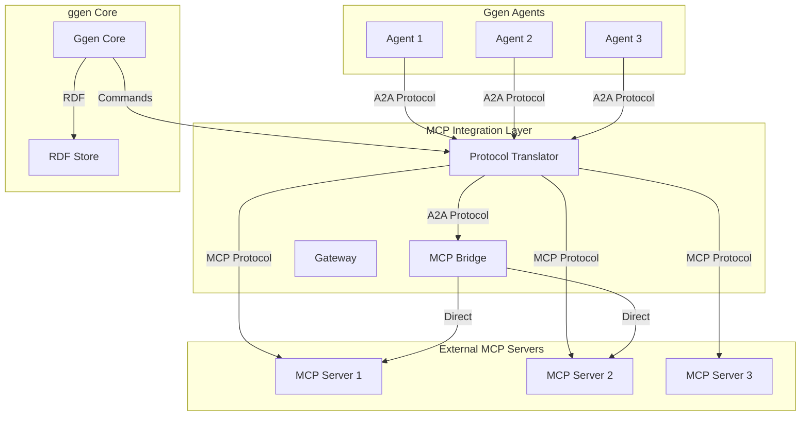
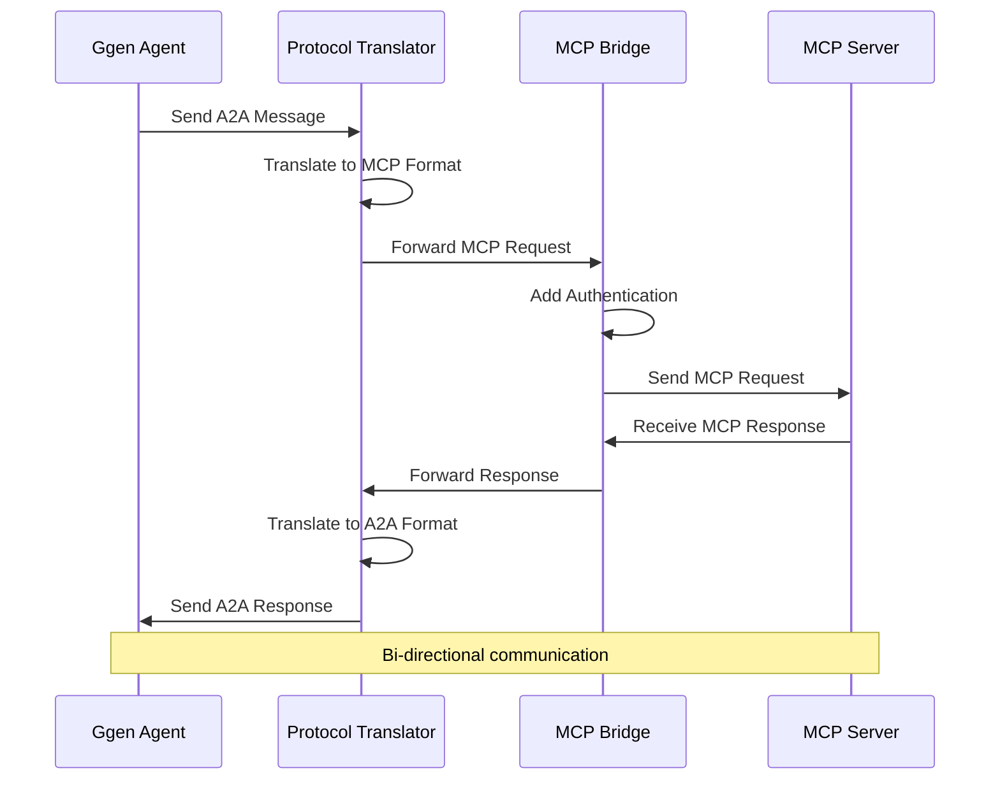

<!-- START doctoc generated TOC please keep comment here to allow auto update -->
<!-- DON'T EDIT THIS SECTION, INSTEAD RE-RUN doctoc TO UPDATE -->
**Table of Contents**

- [MCP A2A Integration Guide](#mcp-a2a-integration-guide)
  - [Table of Contents](#table-of-contents)
  - [Architecture Overview](#architecture-overview)
    - [System Architecture](#system-architecture)
    - [Key Components](#key-components)
  - [Protocol Translation Flow](#protocol-translation-flow)
    - [Message Flow](#message-flow)
    - [Protocol Translation Rules](#protocol-translation-rules)
      - [A2A to MCP Translation](#a2a-to-mcp-translation)
      - [MCP to A2A Translation](#mcp-to-a2a-translation)
  - [Setup and Configuration](#setup-and-configuration)
    - [Installation](#installation)
    - [Basic Configuration](#basic-configuration)
    - [Environment Configuration](#environment-configuration)
  - [Transport Protocols](#transport-protocols)
    - [HTTP Transport](#http-transport)
    - [WebSocket Transport](#websocket-transport)
    - [QUIC Transport](#quic-transport)
  - [Authentication and Security](#authentication-and-security)
    - [JWT Authentication](#jwt-authentication)
    - [API Key Authentication](#api-key-authentication)
    - [Mutual TLS Authentication](#mutual-tls-authentication)
    - [Security Policies](#security-policies)
  - [Migration Guide](#migration-guide)
    - [From v0.x to v1.x](#from-v0x-to-v1x)
      - [Breaking Changes](#breaking-changes)
    - [Migration Steps](#migration-steps)
    - [Performance Considerations](#performance-considerations)
  - [Troubleshooting](#troubleshooting)
    - [Common Issues](#common-issues)
      - [Connection Issues](#connection-issues)
      - [Authentication Issues](#authentication-issues)
      - [Translation Issues](#translation-issues)
    - [Debug Mode](#debug-mode)
    - [Performance Monitoring](#performance-monitoring)
  - [Best Practices](#best-practices)
    - [1. Connection Management](#1-connection-management)
    - [2. Message Handling](#2-message-handling)
    - [3. Security Best Practices](#3-security-best-practices)
    - [4. Monitoring and Observability](#4-monitoring-and-observability)
    - [5. Configuration Management](#5-configuration-management)
  - [CLI Usage Examples](#cli-usage-examples)
    - [Basic MCP Commands](#basic-mcp-commands)
    - [Agent Management Commands](#agent-management-commands)
    - [Advanced Integration Commands](#advanced-integration-commands)
    - [Configuration Commands](#configuration-commands)
    - [Workflow Examples](#workflow-examples)
      - [Complete Agent Setup Workflow](#complete-agent-setup-workflow)
      - [Error Handling Example](#error-handling-example)
      - [Multi-Agent Workflow](#multi-agent-workflow)
    - [Troubleshooting Commands](#troubleshooting-commands)
    - [Environment Configuration File Example](#environment-configuration-file-example)
  - [Conclusion](#conclusion)

<!-- END doctoc generated TOC please keep comment here to allow auto update -->

# MCP A2A Integration Guide

This document provides a comprehensive guide for integrating Model Context Protocol (MCP) servers with ggen's agent-to-agent (A2A) communication system. The integration enables seamless communication between ggen agents and external MCP servers, providing a unified communication fabric for distributed AI systems.

## Table of Contents

1. [Architecture Overview](#architecture-overview)
2. [Protocol Translation Flow](#protocol-translation-flow)
3. [Setup and Configuration](#setup-and-configuration)
4. [Transport Protocols](#transport-protocols)
5. [Authentication and Security](#authentication-and-security)
6. [Migration Guide](#migration-guide)
7. [Troubleshooting](#troubleshooting)
8. [Best Practices](#best-practices)

## Architecture Overview

### System Architecture



### Key Components

1. **MCP Bridge**: Core integration component that handles protocol translation
2. **Gateway**: Direct communication channel for performance-critical paths
3. **Protocol Translator**: Bidirectional protocol adapter between A2A and MCP
4. **Agent Framework**: Provides unified agent interface with MCP support
5. **Transport Layer**: Multiple protocol support (HTTP, WebSocket, QUIC)

## Protocol Translation Flow

### Message Flow



### Protocol Translation Rules

#### A2A to MCP Translation

```rust
// A2A Message
#[derive(Debug, Clone, Serialize, Deserialize)]
pub struct A2AMessage {
    pub id: String,
    pub from: String,
    pub to: String,
    pub payload: MessagePayload,
    pub protocol: String, // "a2a"
}

// MCP Message
#[derive(Debug, Clone, Serialize, Deserialize)]
pub struct MCPMessage {
    pub id: String,
    pub method: String,
    pub params: serde_json::Value,
    pub headers: HashMap<String, String>,
}

// Translation function
pub fn a2a_to_mcp(a2a: A2AMessage) -> MCPMessage {
    MCPMessage {
        id: a2a.id,
        method: translate_method(a2a.payload),
        params: translate_payload(a2a.payload),
        headers: translate_headers(a2a),
    }
}
```

#### MCP to A2A Translation

```rust
pub fn mcp_to_a2a(mcp: MCPMessage) -> A2AMessage {
    A2AMessage {
        id: mcp.id,
        from: "mcp-bridge".to_string(),
        to: mcp.headers.get("target-agent").unwrap_or(&"unknown".to_string()).clone(),
        payload: translate_from_mcp(mcp.method, mcp.params),
        protocol: "a2a".to_string(),
    }
}
```

## Setup and Configuration

### Installation

```bash
# Install MCP integration
cargo add ggen-agent
cargo add ggen-mcp-integration

# Install MCP server dependencies
cargo add mcp-server
cargo add mcp-client
```

### Basic Configuration

```rust
use ggen_agent::{AgentConfig, McpConfig};
use ggen_mcp_integration::{McpBridge, McpIntegrationConfig};

let agent_config = AgentConfig {
    name: "mcp-integrated-agent".to_string(),
    version: "1.0.0".to_string(),
    transport: TransportConfig::WebSocket {
        url: "ws://localhost:8080".to_string(),
        reconnect_interval_ms: 5000,
    },
    authentication: AuthenticationConfig::Jwt {
        secret: "agent-secret".to_string(),
        expiration: 3600,
    },
    mcp: Some(McpConfig {
        server_url: "http://localhost:3000".to_string(),
        api_key: "mcp-api-key".to_string(),
    }),
    observability: ObservabilityConfig::default(),
};

let mcp_config = McpIntegrationConfig {
    bridge: McpBridgeConfig {
        server_url: "http://localhost:3000".to_string(),
        api_key: "mcp-api-key".to_string(),
        timeout_ms: 10000,
        max_retries: 3,
    },
    translation: TranslationConfig {
        enable_bidirectional: true,
        message_buffer_size: 1000,
        protocol_version: "1.0".to_string(),
    },
    security: SecurityConfig {
        encryption: true,
        verify_ssl: true,
        allowed_origins: vec!["*".to_string()],
    },
};
```

### Environment Configuration

```bash
# Agent Configuration
AGENT_NAME=mcp-integrated-agent
AGENT_TRANSPORT=websocket
AGENT_URL=ws://localhost:8080

# MCP Configuration
MCP_SERVER_URL=http://localhost:3000
MCP_API_KEY=your-api-key
MCP_TIMEOUT_MS=10000
MCP_MAX_RETRIES=3

# Integration Configuration
INTEGRATION_BIDIRECTIONAL=true
INTEGRATION_BUFFER_SIZE=1000
INTEGRATION_ENCRYPTION=true
INTEGRATION_VERIFY_SSL=true
```

## Transport Protocols

### HTTP Transport

```rust
use ggen_mcp_integration::transport::{HttpTransport, HttpConfig};

let config = HttpConfig {
    base_url: "http://localhost:3000".to_string(),
    timeout_ms: 10000,
    max_retries: 3,
    headers: vec![
        ("User-Agent".to_string(), "ggen-agent".to_string()),
        ("Content-Type".to_string(), "application/json".to_string()),
        ("Authorization".to_string(), "Bearer your-api-key".to_string()),
    ],
    ssl_verify: true,
    connection_pool_size: 10,
};

let transport = HttpTransport::new(config);
```

### WebSocket Transport

```rust
use ggen_mcp_integration::transport::{WebSocketTransport, WebSocketConfig};

let config = WebSocketConfig {
    url: "ws://localhost:3000".to_string(),
    reconnect_interval_ms: 5000,
    max_reconnect_attempts: 10,
    message_timeout_ms: 30000,
    subprotocols: vec!["mcp-v1".to_string(), "a2a-v1".to_string()],
    compression: true,
};

let transport = WebSocketTransport::new(config);
```

### QUIC Transport

```rust
use ggen_mcp_integration::transport::{QuicTransport, QuicConfig};

let config = QuicConfig {
    server_name: "localhost".to_string(),
    port: 4433,
    alpn_protocols: vec!["mcp-quic".to_string(), "a2a-quic".to_string()],
    idle_timeout_ms: 30000,
    max_concurrent_streams: 100,
    congestion_control: "bbr".to_string(),
    enable_zero_rtt: true,
};

let transport = QuicTransport::new(config);
```

## Authentication and Security

### JWT Authentication

```rust
use ggen_mcp_integration::auth::{JwtAuth, JwtConfig};

let jwt_config = JwtConfig {
    secret: "your-secret-key".to_string(),
    issuer: "ggen-mcp".to_string(),
    audience: "mcp-servers".to_string(),
    expiration: 3600,
    algorithm: "HS256".to_string(),
};

let jwt_auth = JwtAuth::new(jwt_config);

// Generate token for MCP server
let token = jwt_auth.generate_token(&McpClaims {
    agent_id: "my-agent".to_string(),
    permissions: vec!["read".to_string(), "write".to_string()],
    server_permissions: vec!["tools.call".to_string()],
})?;

// Verify token from MCP server
let claims = jwt_auth.verify_token(&token)?;
```

### API Key Authentication

```rust
use ggen_mcp_integration::auth::{ApiKeyAuth, ApiKeyConfig};

let api_key_config = ApiKeyConfig {
    api_key: "your-api-key".to_string(),
    agent_id: "my-agent".to_string(),
    server_id: "mcp-server".to_string(),
    permissions: vec!["read".to_string(), "write".to_string()],
    expiration: 3600,
};

let api_key_auth = ApiKeyAuth::new(api_key_config);

// Validate API key
let is_valid = api_key_auth.validate_key("provided-api-key").await?;
```

### Mutual TLS Authentication

```rust
use ggen_mcp_integration::auth::{TlsAuth, TlsConfig};

let tls_config = TlsConfig {
    client_cert: "/path/to/client.crt".to_string(),
    client_key: "/path/to/client.key".to_string(),
    ca_cert: "/path/to/ca.crt".to_string(),
    server_name: "localhost".to_string(),
    verify_peer: true,
    verify_hostname: true,
};

let tls_auth = TlsAuth::new(tls_config);

// Create TLS transport
let transport = tls_auth.create_transport(QuicConfig::default());
```

### Security Policies

```rust
use ggen_mcp_integration::security::{SecurityPolicy, EncryptionConfig};

let security_policy = SecurityPolicy {
    encryption: EncryptionConfig {
        algorithm: "AES-256-GCM".to_string(),
        key_rotation_days: 30,
        minimum_key_length: 256,
    },
    rate_limiting: RateLimitConfig {
        requests_per_minute: 60,
        burst_size: 10,
    },
    ip_whitelist: vec!["127.0.0.1".to_string(), "localhost".to_string()],
    message_validation: true,
};

// Apply security policy
let bridge = McpBridge::with_security_policy(bridge_config, security_policy);
```

## Migration Guide

### From v0.x to v1.x

#### Breaking Changes

1. **Configuration Format**
   ```rust
   // Old format
   let config = McpConfig {
       url: "http://localhost:3000".to_string(),
       api_key: "key".to_string(),
   };

   // New format
   let config = McpConfig {
       server_url: "http://localhost:3000".to_string(),
       api_key: "key".to_string(),
       timeout_ms: 10000,
       max_retries: 3,
   };
   ```

2. **Message Translation**
   ```rust
   // Old format
   let translation = MessageTranslation {
       from: "a2a",
       to: "mcp",
   };

   // New format
   let translation = ProtocolTranslation {
       source: ProtocolType::A2A,
       target: ProtocolType::MCP,
       bidirectional: true,
   };
   ```

3. **Authentication**
   ```rust
   // Old format
   let auth = AuthConfig::ApiKey { key: "key".to_string() };

   // New format
   let auth = AuthenticationConfig::ApiKey {
       api_key: "key".to_string(),
       agent_id: "agent".to_string(),
   };
   ```

### Migration Steps

1. **Update Dependencies**
   ```bash
   # Remove old dependencies
   cargo remove ggen-mcp-bridge

   # Add new dependencies
   cargo add ggen-mcp-integration
   ```

2. **Update Configuration**
   ```rust
   // Replace old config with new format
   let old_config = load_old_config();
   let new_config = migrate_config(old_config);
   ```

3. **Update Code**
   ```rust
   // Replace old bridge usage
   let bridge = McpBridge::new(config);

   // With new integration
   let integration = McpIntegration::new(config);
   let bridge = integration.create_bridge();
   ```

4. **Update Tests**
   ```rust
   // Update test cases
   #[test]
   fn test_mcp_integration() {
       let config = McpIntegrationConfig::default();
       let integration = McpIntegration::new(config);
       assert!(integration.is_connected());
   }
   ```

### Performance Considerations

1. **Connection Pooling**: Use connection pooling for better performance
2. **Message Buffering**: Implement message buffering for burst traffic
3. **Protocol Optimization**: Use binary protocols for large messages
4. **Compression**: Enable compression for large data transfers

## Troubleshooting

### Common Issues

#### Connection Issues

```rust
// Issue: MCP server connection refused
// Solution: Check server status and network connectivity

let config = McpConfig {
    server_url: "http://localhost:3000".to_string(),
    api_key: "api-key".to_string(),
};

let bridge = McpBridge::new(config);
match bridge.connect().await {
    Ok(_) => println!("Connected to MCP server"),
    Err(e) => {
        if e.to_string().contains("Connection refused") {
            println!("MCP server not running. Please start the server.");
        } else {
            println!("Connection error: {}", e);
        }
    }
}
```

#### Authentication Issues

```rust
// Issue: Authentication failed
// Solution: Check API key and permissions

let auth = ApiKeyAuth::new(api_key_config);
match auth.validate_key(api_key).await {
    Ok(claims) => println!("Authentication successful"),
    Err(e) => {
        if e.to_string().contains("Invalid API key") {
            println("Invalid API key. Check your credentials.");
        } else if e.to_string().contains("Permission denied") {
            println("Insufficient permissions. Check access rights.");
        } else {
            println("Authentication error: {}", e);
        }
    }
}
```

#### Translation Issues

```rust
// Issue: Message translation failed
// Solution: Check protocol compatibility

let translator = ProtocolTranslator::new();
let a2a_message = A2AMessage {
    id: "test".to_string(),
    from: "agent1".to_string(),
    to: "agent2".to_string(),
    payload: MessagePayload::Custom { data: serde_json::json!({"test": "data"}) },
    protocol: "a2a".to_string(),
};

match translator.translate(a2a_message, "mcp").await {
    Ok(mcp_message) => println!("Translation successful"),
    Err(e) => {
        if e.to_string().contains("Unknown protocol") {
            println("Protocol not supported. Check protocol version.");
        } else if e.to_string().contains("Invalid payload") {
            println("Invalid payload format. Check data structure.");
        } else {
            println("Translation error: {}", e);
        }
    }
}
```

### Debug Mode

```rust
// Enable debug mode for troubleshooting
let mut integration = McpIntegration::new(config);
integration.set_debug_mode(true);

// Enable verbose logging
std::env::set_var("RUST_LOG", "debug");
env_logger::init();

// Monitor connection events
integration.subscribe_event(|event| {
    match event {
        Event::Connected => println!("Connected to MCP server"),
        Event::Disconnected => println!("Disconnected from MCP server"),
        Event::Error(e) => println!("Error: {}", e),
        _ => println!("Event: {:?}", event),
    }
});
```

### Performance Monitoring

```rust
// Monitor performance metrics
let metrics = integration.get_metrics();
println!("Performance metrics:");
println!("  Message rate: {} msg/s", metrics.message_rate);
println!("  Average latency: {} ms", metrics.average_latency);
println!("  Error rate: {}%", metrics.error_rate);
println!("  Connection count: {}", metrics.connection_count);

// Set alerts
let alert_manager = AlertManager::new();
alert_manager.set_threshold("message_rate", 100);
alert_manager.set_threshold("error_rate", 5.0);
alert_manager.set_threshold("average_latency", 1000);

alert_manager.subscribe(|alert| {
    println!("Alert: {}", alert.message);
});
```

## Best Practices

### 1. Connection Management

```rust
// Use connection pooling
let pool = ConnectionPool::new(10, 30000);
integration.set_connection_pool(pool);

// Implement exponential backoff for reconnection
let reconnect_strategy = ReconnectStrategy::ExponentialBackoff {
    base_delay_ms: 1000,
    max_delay_ms: 30000,
    max_attempts: 10,
    jitter_ms: 1000,
};

integration.set_reconnect_strategy(reconnect_strategy);
```

### 2. Message Handling

```rust
// Implement message batching
let batcher = MessageBatcher::new(100, 100);
integration.set_message_batcher(batcher);

// Use message queuing for reliability
let queue = MessageQueue::new(1000, 3600);
integration.set_message_queue(queue);

// Implement retry logic
let retry_strategy = RetryStrategy::ExponentialBackoff {
    max_attempts: 5,
    base_delay_ms: 1000,
    max_delay_ms: 30000,
    backoff_factor: 2.0,
};

integration.set_retry_strategy(retry_strategy);
```

### 3. Security Best Practices

```rust
// Use TLS for all communications
let tls_config = TlsConfig::default();
integration.set_tls_config(tls_config);

// Implement rate limiting
let rate_limiter = RateLimiter::new(60, 10);
integration.set_rate_limiter(rate_limiter);

// Use proper error handling
let error_handler = ErrorHandler::new();
error_handler.set_retry_strategy(retry_strategy);
error_handler.set_alert_manager(alert_manager);
integration.set_error_handler(error_handler);
```

### 4. Monitoring and Observability

```rust
// Enable comprehensive monitoring
let monitoring = Monitoring::new();
monitoring.enable_metrics(true);
monitoring.enable_tracing(true);
monitoring.enable_logging(true);
integration.set_monitoring(monitoring);

// Set up health checks
let health_checker = HealthChecker::new();
health_checker.set_check_interval_ms(30000);
health_checker.add_check("connection", || integration.is_connected());
health_checker.add_check("authentication", || integration.is_authenticated());
integration.set_health_checker(health_checker);
```

### 5. Configuration Management

```rust
// Use environment variables for configuration
let config = McpIntegrationConfig::from_env();

// Implement configuration hot-reload
let config_watcher = ConfigWatcher::new();
config_watcher.watch("config.toml");
config_watcher.subscribe(|new_config| {
    integration.update_config(new_config);
});
integration.set_config_watcher(config_watcher);

// Validate configuration
let validator = ConfigValidator::new();
validator.add_rule("server_url", |url| url.starts_with("http"));
validator.add_rule("api_key", |key| !key.is_empty());
validator.add_rule("timeout_ms", |timeout| *timeout > 0);

match validator.validate(&config) {
    Ok(_) => println!("Configuration is valid"),
    Err(e) => println!("Configuration error: {}", e),
}
```

## CLI Usage Examples

### Basic MCP Commands

```bash
# List all available MCP tools
ggen mcp list

# List tools with detailed schema
ggen mcp list --verbose

# Show specific tool status
ggen mcp status "agent-list"

# Show tool with full schema
ggen mcp status "agent-start" --schema

# List all MCP tool schemas
ggen mcp schemas

# Test MCP tool functionality
ggen mcp test "agent-list"

# Test with custom arguments
ggen mcp test "agent-start" --args '{"name": "my-agent"}'
```

### Agent Management Commands

```bash
# List all registered agents
ggen agent list

# List agents with detailed output
ggen agent list --verbose

# Start an agent
ggen agent start "text-generator"

# Start an agent with specific capabilities
ggen agent start "code-analyzer" --capabilities text-generation,code-analysis

# Show agent status
ggen agent status "text-generator"

# Show agent status with metrics
ggen agent status "text-generator" --metrics

# Stop an agent
ggen agent stop "text-generator"

# Stop an agent with timeout
ggen agent stop "text-generator" --timeout 30

# Show agent capabilities
ggen agent capabilities "text-generator"

# Show detailed capabilities
ggen agent capabilities "text-generator" --detailed
```

### Advanced Integration Commands

```bash
# Bridge an agent as MCP tool
ggen mcp bridge "text-generator"

# Bridge agent with custom tool name
ggen mcp bridge "text-generator" --tool-name "ai-assistant"

# Bridge and immediately test
ggen mcp bridge "text-generator" && ggen mcp test "agent-text-generator"

# Check MCP tool status after bridging
ggen mcp status "agent-text-generator"
```

### Configuration Commands

```bash
# Set A2A server URL
export GGEN_A2A_SERVER_URL="http://localhost:8080"

# Set A2A API key
export GGEN_A2A_API_KEY="your-api-key"

# Set A2A timeout
export GGEN_A2A_TIMEOUT_MS=15000

# Enable bidirectional communication
export GGEN_A2A_BIDIRECTIONAL=true

# Enable integration
export GGEN_ENABLE_INTEGRATION=true

# Set buffer size
export GGEN_A2A_BUFFER_SIZE=2000

# Configure MCP server
export GGEN_MCP_SERVER_URL="http://localhost:3000"
export GGEN_MCP_TIMEOUT_MS=10000
```

### Workflow Examples

#### Complete Agent Setup Workflow

```bash
# 1. Configure A2A connection
export GGEN_A2A_SERVER_URL="http://localhost:8080"
export GGEN_A2A_API_KEY="your-secret-key"

# 2. List available MCP tools
ggen mcp list --verbose

# 3. Start an agent
ggen agent start "text-generator"

# 4. Check agent status
ggen agent status "text-generator" --metrics

# 5. Bridge the agent to MCP
ggen mcp bridge "text-generator"

# 6. Test the bridged tool
ggen mcp test "agent-text-generator" --args '{"command": "generate", "prompt": "Hello world"}'

# 7. List tools after bridging
ggen mcp list --verbose

# 8. Show tool schema
ggen mcp status "agent-text-generator" --schema
```

#### Error Handling Example

```bash
# Handle connection errors gracefully
if ! ggen mcp list >/dev/null 2>&1; then
    echo "Error: MCP server not accessible. Please check connection."
    exit 1
fi

# Handle agent startup failures
if ggen agent start "invalid-agent" 2>/dev/null; then
    echo "Agent started successfully"
else
    echo "Error: Failed to start agent. Check agent name and configuration."
fi

# Handle timeout scenarios
ggen agent start "slow-agent" --timeout 60 || echo "Operation timed out"
```

#### Multi-Agent Workflow

```bash
# Start multiple agents
ggen agent start "text-generator" &
ggen agent start "code-analyzer" &
ggen agent start "workflow-agent" &

# Wait for all agents to start
sleep 5

# List all running agents
ggen agent list --verbose

# Bridge multiple agents
for agent in text-generator code-analyzer workflow-agent; do
    ggen mcp bridge "$agent" &
done

# Wait for bridging to complete
sleep 3

# Test all bridged tools
ggen mcp test "agent-text-generator"
ggen mcp test "agent-code-analyzer"
ggen mcp test "agent-workflow-agent"
```

### Troubleshooting Commands

```bash
# Check configuration
echo "A2A Server URL: $GGEN_A2A_SERVER_URL"
echo "MCP Server URL: $GGEN_MCP_SERVER_URL"
echo "Integration Enabled: $GGEN_ENABLE_INTEGRATION"

# Test A2A connection
curl -f "$GGEN_A2A_SERVER_URL/health" || echo "A2A server not accessible"

# Test MCP connection
curl -f "$GGEN_MCP_SERVER_URL/health" || echo "MCP server not accessible"

# Debug mode (if available)
ggen mcp list --debug
ggen agent list --debug

# Check environment variables
ggen env list | grep A2A
ggen env list | grep MCP
```

### Environment Configuration File Example

Create a `.env` file for easier configuration:

```bash
# .env file example
GGEN_A2A_SERVER_URL=http://localhost:8080
GGEN_A2A_API_KEY=your-production-api-key
GGEN_A2A_TIMEOUT_MS=15000
GGEN_A2A_MAX_RETRIES=5
GGEN_A2A_BIDIRECTIONAL=true
GGEN_A2A_BUFFER_SIZE=2000
GGEN_A2A_ENABLE_ENCRYPTION=true
GGEN_A2A_VERIFY_SSL=true

GGEN_MCP_SERVER_URL=http://localhost:3000
GGEN_MCP_TIMEOUT_MS=10000
GGEN_MCP_MAX_RETRIES=3
GGEN_MCP_ENABLE_TLS=false

GGEN_ENABLE_INTEGRATION=true
```

Load the environment:

```bash
# Load environment
source .env

# Verify configuration
ggen mcp list
ggen agent list
```

## Conclusion

The MCP A2A integration provides a robust foundation for connecting ggen agents with external MCP servers. By following this guide, you can successfully integrate MCP servers into your ggen ecosystem, ensuring reliable, secure, and efficient communication between components.

For additional support and updates, refer to the official ggen documentation and GitHub repository.