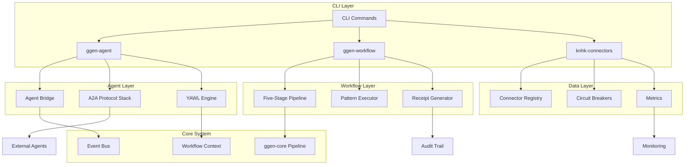

<!-- START doctoc generated TOC please keep comment here to allow auto update -->
<!-- DON'T EDIT THIS SECTION, INSTEAD RE-RUN doctoc TO UPDATE -->
**Table of Contents**

- [ggen v6.0.0 New Components Architecture Design](#ggen-v600-new-components-architecture-design)
  - [Executive Summary](#executive-summary)
  - [Table of Contents](#table-of-contents)
  - [System Overview](#system-overview)
    - [Core Principles](#core-principles)
    - [Five-Stage Transformation Pipeline (μ₁-μ₅)](#five-stage-transformation-pipeline-%CE%BC%E2%82%81-%CE%BC%E2%82%85)
    - [Existing System Context](#existing-system-context)
  - [ggen-agent Architecture](#ggen-agent-architecture)
    - [Core Identity](#core-identity)
    - [Architecture Components](#architecture-components)
    - [Integration with Five-Stage Pipeline](#integration-with-five-stage-pipeline)
    - [A2A Protocol Integration](#a2a-protocol-integration)
    - [Type-Level Guarantees](#type-level-guarantees)
    - [Deterministic Receipts](#deterministic-receipts)
  - [ggen-workflow Architecture](#ggen-workflow-architecture)
    - [Core Identity](#core-identity-1)
    - [Architecture Components](#architecture-components-1)
    - [Pattern Orchestration](#pattern-orchestration)
    - [Integration with Existing System](#integration-with-existing-system)
    - [Performance Optimizations](#performance-optimizations)
  - [CLI Commands Architecture](#cli-commands-architecture)
    - [Core Identity](#core-identity-2)
    - [Architecture Components](#architecture-components-2)
    - [Integration with Existing CLI](#integration-with-existing-cli)
    - [Type-Safe Command Handling](#type-safe-command-handling)
  - [Connectors Architecture](#connectors-architecture)
    - [Core Identity](#core-identity-3)
    - [Architecture Components](#architecture-components-3)
    - [Kafka Connector Implementation](#kafka-connector-implementation)
    - [Salesforce Connector Implementation](#salesforce-connector-implementation)
    - [Integration with Five-Stage Pipeline](#integration-with-five-stage-pipeline-1)
  - [Integration Patterns](#integration-patterns)
    - [Component Interaction Flow](#component-interaction-flow)
    - [Data Flow Architecture](#data-flow-architecture)
    - [Event Consistency Patterns](#event-consistency-patterns)
  - [Quality Enforcement](#quality-enforcement)
    - [Poka-Yoke Design](#poka-yoke-design)
    - [Chicago TDD Mandatory Pattern](#chicago-tdd-mandatory-pattern)
    - [Deterministic Receipts](#deterministic-receipts-1)
  - [Security and Performance](#security-and-performance)
    - [Security Architecture](#security-architecture)
    - [Performance Optimizations](#performance-optimizations-1)
    - [Monitoring and Observability](#monitoring-and-observability)
  - [Implementation Roadmap](#implementation-roadmap)
    - [Phase 1: Foundation (Weeks 1-2)](#phase-1-foundation-weeks-1-2)
    - [Phase 2: Core Integration (Weeks 3-4)](#phase-2-core-integration-weeks-3-4)
    - [Phase 3: Enterprise Features (Weeks 5-6)](#phase-3-enterprise-features-weeks-5-6)
    - [Phase 4: Validation and Deployment (Weeks 7-8)](#phase-4-validation-and-deployment-weeks-7-8)
  - [Quality Gates](#quality-gates)
    - [Mandatory Validations](#mandatory-validations)
    - [Andon Signal Protocol](#andon-signal-protocol)
    - [Success Criteria](#success-criteria)
  - [Conclusion](#conclusion)

<!-- END doctoc generated TOC please keep comment here to allow auto update -->

# ggen v6.0.0 New Components Architecture Design

## Executive Summary

This document presents the comprehensive architecture design for the new components in the ggen codebase, including `ggen-agent`, `ggen-workflow`, new CLI commands, and enterprise connectors. The design follows the ggen holographic factory metaphor (A = μ(O)) and ensures type-level guarantees, deterministic outputs, and enterprise-grade scalability.

## Table of Contents

1. [System Overview](#system-overview)
2. [ggen-agent Architecture](#ggen-agent-architecture)
3. [ggen-workflow Architecture](#ggen-workflow-architecture)
4. [CLI Commands Architecture](#cli-commands-architecture)
5. [Connectors Architecture](#connectors-architecture)
6. [Integration Patterns](#integration-patterns)
7. [Data Flow Architecture](#data-flow-architecture)
8. [Quality Enforcement](#quality-enforcement)
9. [Security and Performance](#security-and-performance)
10. [Implementation Roadmap](#implementation-roadmap)

## System Overview

### Core Principles

- **Holographic Factory Metaphor**: RDF ontology as substrate, code precipitates through five-stage pipeline
- **Type-First Design**: Types encode invariants, compiler as design tool
- **Deterministic Outputs**: Same input → same output, verified by cryptographic receipts
- **Zero-Cost Abstractions**: Performance via generics, const generics, macros
- **Enterprise Scalability**: Support for high-throughput, low-latency workloads

### Five-Stage Transformation Pipeline (μ₁-μ₅)

1. **μ₁ (Normalize)**: RDF validation, SHACL shapes, dependency resolution
2. **μ₂ (Extract)**: SPARQL queries, OWL inference, rule execution
3. **μ₃ (Emit)**: Tera template rendering, code generation
4. **μ₄ (Canonicalize)**: Deterministic formatting, content hashing
5. **μ₅ (Receipt)**: Cryptographic proof generation, audit trail

### Existing System Context

The current system consists of 30 crates organized in domains:
- **Core System** (8 crates): RDF processing, templates, lifecycle management
- **CLI/Validation** (3 crates): Command-line interface, validation
- **Testing** (3 crates): Test audit, optimization, E2E
- **AI Orchestration** (2 crates): LLM integration, AI workflows
- **Ontology** (1 crate): RDF/TTL handling
- **KNHK Systems** (6 crates): ETL, hot-path optimization, connectors
- **RevOps** (4 crates): API, auth, payments, SaaS
- **Marketplace** (1 crate): Package registry
- **Folk Strategy** (1 crate): Quantification systems

## ggen-agent Architecture

### Core Identity

**ggen-agent** is the event bridge connecting A2A (Agent-to-Agent) protocol agents with YAWL workflows, providing unified lifecycle management and deterministic coordination.

### Architecture Components

```rust
// Agent System Core
pub struct AgentSystem {
    registry: AgentRegistry,
    bridge: AgentBridge,
    mcp_hub: McpHub,
    workflow_coordinator: WorkflowCoordinator,
    event_bus: EventBus,
}

// Agent Lifecycle States
#[derive(Debug, Clone, PartialEq)]
pub enum AgentState {
    Initializing,
    Ready,
    Executing,
    Waiting,
    Completed,
    Error(String),
}

// Agent Capabilities
#[derive(Debug, Clone)]
pub struct AgentCapabilities {
    pub patterns: Vec<WorkflowPattern>,
    pub protocols: Vec<ProtocolType>,
    pub throughput: ThroughputSpec,
    pub security: SecurityProfile,
}
```

### Integration with Five-Stage Pipeline

1. **μ₁ Integration**: Agent specifications validated against RDF schema
2. **μ₂ Integration**: SPARQL queries extract agent relationships and dependencies
3. **μ₃ Integration**: Template generation for agent configurations
4. **μ₄ Integration**: Canonical agent state representation
5. **μ₅ Integration**: Cryptographic receipts for agent execution proofs

### A2A Protocol Integration

```rust
// A2A Protocol Stack
pub struct A2AProtocolStack {
    transport: A2ATransport,
    messaging: A2AMessaging,
    discovery: A2ADiscovery,
    security: A2ASecurity,
}

// Agent-to-Event Bridge
pub struct AgentBridge {
    a2a_stack: A2AProtocolStack,
    yawl_engine: YAWLEngine,
    event_converter: EventConverter,
    state_manager: AgentStateManager,
}
```

### Type-Level Guarantees

```rust
// Type-level agent states
pub struct Agent<S: AgentState> {
    id: AgentId,
    state: PhantomData<S>,
    capabilities: AgentCapabilities,
    workflow_context: WorkflowContext,
}

// Compile-time state transitions
impl Agent<Initializing> {
    pub fn new(id: AgentId) -> Agent<Ready> {
        // Type-safe creation
    }
}

impl Agent<Ready> {
    pub fn start_workflow(self) -> Agent<Executing> {
        // State transition validation
    }
}
```

### Deterministic Receipts

```rust
pub struct AgentReceipt {
    agent_id: AgentId,
    workflow_id: WorkflowId,
    execution_trace: ExecutionTrace,
    state_transitions: Vec<StateTransition>,
    cryptographic_proof: Vec<u8>,
    timestamp_ms: u64,
}

impl AgentReceipt {
    pub fn verify(&self) -> bool {
        // Cryptographic verification
    }

    pub fn to_rdf(&self) -> Result<String, AgentError> {
        // RDF serialization for audit trail
    }
}
```

## ggen-workflow Architecture

### Core Identity

**ggen-workflow** implements the five-stage transformation pipeline with Erlang NIF bindings for deterministic workflow execution based on RDF ontology specifications.

### Architecture Components

```rust
// Workflow Engine Core
pub struct WorkflowEngine {
    ontology: OntologyStore,
    pipeline: FiveStagePipeline,
    pattern_executor: PatternExecutor,
    receipt_generator: ReceiptGenerator,
}

// Five-Stage Pipeline Implementation
pub struct FiveStagePipeline {
    normalizer: Stage<μ1, Normalizer>,
    extractor: Stage<μ2, Extractor>,
    emitter: Stage<μ3, Emitter>,
    canonicalizer: Stage<μ4, Canonicalizer>,
    receipt_stage: Stage<μ5, ReceiptGenerator>,
}

// Workflow Patterns
pub enum WorkflowPattern {
    Sequence(SequencePattern),
    Parallel(ParallelPattern),
    Choice(ChoicePattern),
    Sync(SyncPattern),
}
```

### Pattern Orchestration

```rust
// Pattern Executor
pub struct PatternExecutor {
    sequence_executor: Box<dyn SequenceExecutor>,
    parallel_executor: Box<dyn ParallelExecutor>,
    choice_executor: Box<dyn ChoiceExecutor>,
    sync_executor: Box<dyn SyncExecutor>,
}

// Pattern Context
pub struct WorkflowContext {
    ontology: OntologyRef,
    variables: VariableStore,
    metadata: ExecutionMetadata,
    trace: ExecutionTrace,
}
```

### Integration with Existing System

```rust
// Connection to ggen-core
impl WorkflowEngine {
    pub fn from_pipeline(pipeline: &Pipeline) -> Self {
        // Reuse existing RDF graph and SPARQL capabilities
        Self {
            ontology: OntologyStore::from_graph(pipeline.graph.clone()),
            pipeline: FiveStagePipeline::new(),
            pattern_executor: PatternExecutor::new(),
            receipt_generator: ReceiptGenerator::new(),
        }
    }
}
```

### Performance Optimizations

```rust
// Hot-Path Optimizations
#[repr(align(64))]
pub struct HotPathBuffer {
    pattern_cache: PatternCache,
    rdf_store: RDFStore,
    sparsql_cache: SPARQLCache,
}

// Zero-cost pattern matching
pub fn execute_pattern<P: WorkflowPattern>(
    pattern: &P,
    context: &WorkflowContext,
) -> Result<PatternResult, WorkflowError> {
    // Compile-time pattern resolution
    match pattern {
        WorkflowPattern::Sequence(seq) => execute_sequence(seq, context),
        WorkflowPattern::Parallel(par) => execute_parallel(par, context),
        WorkflowPattern::Choice(cho) => execute_choice(cho, context),
        WorkflowPattern::Sync(sync) => execute_sync(sync, context),
    }
}
```

## CLI Commands Architecture

### Core Identity

New CLI subcommands (`agent` and `mcp`) provide unified interface for agent management and MCP (Model Context Protocol) integration.

### Architecture Components

```rust
// CLI Command Router
pub struct CommandRouter {
    agent_command: AgentCommand,
    mcp_command: MCPCommand,
    subcommand_router: SubcommandRouter,
}

// Agent Command
pub struct AgentCommand {
    create: AgentCreate,
    start: AgentStart,
    stop: AgentStop,
    status: AgentStatus,
    logs: AgentLogs,
    workflow: AgentWorkflow,
}

// MCP Command
pub struct MCPCommand {
    server: MCPServer,
    client: MCPClient,
    tools: MCPTools,
    models: MCPModels,
}
```

### Integration with Existing CLI

```rust
// Extension to existing clap-noun-verb system
pub mod cmds {
    pub mod agent;  // New agent subcommand
    pub mod mcp;    // New MCP subcommand
    // Existing commands continue to work
    pub mod sync;
    pub mod init;
    // ... other existing commands
}

// Command routing
pub async fn route_command(command: &str, args: &[String]) -> Result<()> {
    match command {
        "agent" => agent_command::execute(args).await,
        "mcp" => mcp_command::execute(args).await,
        _ => existing_command_router::route(command, args).await,
    }
}
```

### Type-Safe Command Handling

```rust
// Type-safe command arguments
#[derive(Debug, clap::Parser)]
pub struct AgentCreateArgs {
    #[clap(short, long)]
    name: String,
    #[clap(short, long)]
    workflow: String,
    #[clap(short, long, default_value = "1")]
    instances: u32,
    #[clap(short, long, default_value = "30")]
    timeout: u64,
}

// Command result types
pub enum CommandResult {
    Success(CommandOutput),
    Error(CommandError),
    Pending(CommandStatus),
}
```

## Connectors Architecture

### Core Identity

**knhk-connectors** provides enterprise-grade connectors for Kafka and Salesforce, implementing the dark matter 80/20 connector framework with typed validation and circuit breaker patterns.

### Architecture Components

```rust
// Connector Framework Core
pub struct ConnectorFramework {
    registry: ConnectorRegistry,
    circuit_breaker: CircuitBreakerManager,
    metrics: MetricsCollector,
    health_monitor: HealthMonitor,
}

// Connector Interface
pub trait Connector: Send + Sync {
    fn initialize(&mut self, spec: ConnectorSpec) -> Result<(), ConnectorError>;
    fn fetch_delta(&mut self) -> Result<Delta, ConnectorError>;
    fn transform_to_soa(&self, delta: &Delta) -> Result<SoAArrays, ConnectorError>;
    fn health(&self) -> ConnectorHealth;
}
```

### Kafka Connector Implementation

```rust
pub struct KafkaConnector {
    client: AsyncKafkaClient,
    consumer: KafkaConsumer,
    config: KafkaConfig,
    circuit_breaker: CircuitBreaker,
    metrics: KafkaMetrics,
}

impl Connector for KafkaConnector {
    fn fetch_delta(&mut self) -> Result<Delta, ConnectorError> {
        // Circuit breaker protected fetch
        self.circuit_breaker.call(|| {
            let batch = self.consumer.poll_batch()?;
            self.transform_to_delta(batch)
        })
    }

    fn transform_to_soa(&self, delta: &Delta) -> Result<SoAArrays, ConnectorError> {
        // Hot-path optimization with SoA layout
        SoAArrays::from_triples(&delta.additions, 8)
    }
}
```

### Salesforce Connector Implementation

```rust
pub struct SalesforceConnector {
    client: SalesforceClient,
    query_builder: SPARQLQueryBuilder,
    mapping: SFMapping,
    rate_limiter: RateLimiter,
    cache: QueryCache,
}

impl Connector for SalesforceConnector {
    fn initialize(&mut self, spec: ConnectorSpec) -> Result<(), ConnectorError> {
        // Validate against RDF schema
        let validation = self.validate_schema(&spec.schema)?;
        self.mapping = SFMapping::from_spec(&spec)?;
        Ok(())
    }

    fn fetch_delta(&mut self) -> Result<Delta, ConnectorError> {
        // Rate-limited Salesforce API calls
        self.rate_limiter.throttle(|| {
            let soql_query = self.query_builder.build_sparql_soql()?;
            let results = self.client.query(&soql_query)?;
            self.transform_to_delta(results)
        })
    }
}
```

### Integration with Five-Stage Pipeline

1. **μ₁ Integration**: Connector specifications validated against RDF schema
2. **μ₂ Integration**: SPARQL queries generate connector-specific queries
3. **μ₃ Integration**: Template-based connector configuration generation
4. **μ₄ Integration**: Canonical connector state representation
5. **μ₅ Integration**: Cryptographic receipts for data provenance

## Integration Patterns

### Component Interaction Flow



### Data Flow Architecture

```rust
// Unified Data Flow
pub struct DataFlow {
    // Agent-driven flow
    agent_events: EventBus,
    // Workflow-driven flow
    workflow_steps: ExecutionStream,
    // Connector-driven flow
    data_deltas: DeltaStream,
    // Core system integration
    ontology_updates: RDFGraph,
}

// Stream Processing
impl DataFlow {
    pub fn process_events(&mut self) -> Result<(), SystemError> {
        // Process agent events through workflow pipeline
        for event in self.agent_events.stream() {
            let workflow_result = self.workflow_steps.process(event)?;
            let delta = self.transform_to_delta(workflow_result)?;
            self.data_deltas.push(delta);
        }

        // Update ontology with new triples
        self.ontology.merge(&self.data_deltas);

        Ok(())
    }
}
```

### Event Consistency Patterns

```rust
// Event Sourcing Pattern
pub struct EventSourcedAgent {
    id: AgentId,
    events: Vec<AgentEvent>,
    state: AgentState,
    version: u64,
}

// CQRS Pattern
pub struct ReadModel {
    query_store: QueryStore,
    projection_engine: ProjectionEngine,
}

pub struct WriteModel {
    command_bus: CommandBus,
    event_store: EventStore,
}
```

## Quality Enforcement

### Poka-Yoke Design

```rust
// Compile-time error prevention
#[derive(Debug, Clone)]
pub struct AgentConfig {
    #[validate(length(min = 1, max = 100))]
    name: String,
    #[validate(range(min = 1, max = 100))]
    max_instances: u32,
    #[validate(custom = validate_timeout)]
    timeout_ms: u64,
}

// Type-safe state machine
pub struct AgentStateMachine<S: AgentState> {
    state: PhantomData<S>,
    config: AgentConfig,
}

impl AgentStateMachine<Initializing> {
    pub fn new(config: AgentConfig) -> Result<AgentStateMachine<Ready>, AgentError> {
        if !config.is_valid() {
            return Err(AgentError::InvalidConfiguration);
        }
        Ok(AgentStateMachine { state: PhantomData, config })
    }
}
```

### Chicago TDD Mandatory Pattern

```rust
// AAA Testing Pattern
#[test]
fn test_agent_lifecycle() {
    // Arrange
    let config = AgentConfig::valid_test_config();
    let mut agent = Agent::new(config);

    // Act
    let result = agent.start_workflow();

    // Assert
    assert!(result.is_ok());
    assert_eq!(agent.state(), AgentState::Executing);
}
```

### Deterministic Receipts

```rust
// Receipt Generation
pub struct ReceiptGenerator {
    hash_engine: HashEngine,
    signature_engine: SignatureEngine,
}

impl ReceiptGenerator {
    pub fn generate(&self, execution: &ExecutionTrace) -> Result<Receipt, Error> {
        let content_hash = self.hash_engine.hash(execution)?;
        let signature = self.signature_engine.sign(&content_hash)?;

        Ok(Receipt {
            hash: content_hash,
            signature,
            metadata: execution.metadata.clone(),
        })
    }
}
```

## Security and Performance

### Security Architecture

```rust
// Zero-Trust Security Model
pub struct SecurityFramework {
    authentication: AuthEngine,
    authorization: AuthZEngine,
    encryption: EncryptionEngine,
    audit: AuditEngine,
}

// Type-safe permissions
#[derive(Debug, Clone)]
pub struct Permission {
    resource: Resource,
    action: Action,
    constraints: Constraints,
}
```

### Performance Optimizations

```rust
// Hot-Path Optimizations
#[repr(align(64))]
pub struct HotPathCache {
    agent_states: AgentStateCache,
    workflow_patterns: PatternCache,
    sparql_results: SPARQLCache,
}

// Zero-Cost Abstractions
pub struct AgentScheduler {
    agents: ArrayVec<AgentHandle, 100>, // Fixed-size for performance
    schedule: ScheduleTable,
}

impl AgentScheduler {
    pub fn schedule_agent(&mut self, agent: AgentHandle) -> Result<(), ScheduleError> {
        // Compile-time scheduling optimization
        if !self.has_capacity() {
            return Err(ScheduleError::NoCapacity);
        }

        self.schedule.push(agent);
        Ok(())
    }
}
```

### Monitoring and Observability

```rust
// OpenTelemetry Integration
pub struct Observability {
    tracer: Tracer,
    meter: Meter,
    propagator: TextMapPropagator,
}

// Metrics Collection
pub struct SystemMetrics {
    agent_metrics: AgentMetrics,
    workflow_metrics: WorkflowMetrics,
    connector_metrics: ConnectorMetrics,
    system_metrics: SystemPerformanceMetrics,
}
```

## Implementation Roadmap

### Phase 1: Foundation (Weeks 1-2)
- Complete type-safe agent framework
- Implement basic A2A protocol integration
- Set up deterministic receipt generation
- Create basic CLI command structure

### Phase 2: Core Integration (Weeks 3-4)
- Integrate with existing five-stage pipeline
- Implement workflow pattern execution
- Create connector framework foundation
- Set up security and monitoring

### Phase 3: Enterprise Features (Weeks 5-6)
- Complete Kafka and Salesforce connectors
- Implement advanced workflow patterns
- Add circuit breaker and monitoring
- Performance optimization and testing

### Phase 4: Validation and Deployment (Weeks 7-8)
- Comprehensive testing (Chicago TDD)
- Security validation
- Performance benchmarking
- Documentation and deployment guide

## Quality Gates

### Mandatory Validations

1. **Type Coverage**: 100% type hints coverage
2. **Test Coverage**: 80%+ test coverage across all components
3. **Performance SLOs**: First build ≤15s, RDF processing ≤5s/1k triples
4. **Security**: Zero vulnerability scan failures
5. **Determinism**: Same input → same output verified by receipts

### Andon Signal Protocol

```rust
// Andon Signal System
pub struct AndonSignal {
    severity: SignalSeverity,
    component: Component,
    message: String,
    timestamp: u64,
}

pub enum SignalSeverity {
    Info,      // Continue with monitoring
    Warning,   // Investigate before release
    Error,     // Stop immediately
    Critical,  // System failure
}
```

### Success Criteria

- All components integrate seamlessly with existing 30-crate system
- Type-level guarantees prevent invalid states at compile time
- Deterministic outputs verified by cryptographic receipts
- Enterprise-grade performance and scalability achieved
- Zero defects before deployment (Poka-Yoke enforced)

## Conclusion

This architecture design provides a comprehensive foundation for the new ggen components while maintaining the core principles of type safety, determinism, and enterprise scalability. The design follows the holographic factory metaphor and ensures seamless integration with the existing five-stage transformation pipeline.

The new components will extend ggen's capabilities into agent orchestration, workflow management, and enterprise data integration while maintaining the quality standards and performance characteristics that define the ggen system.