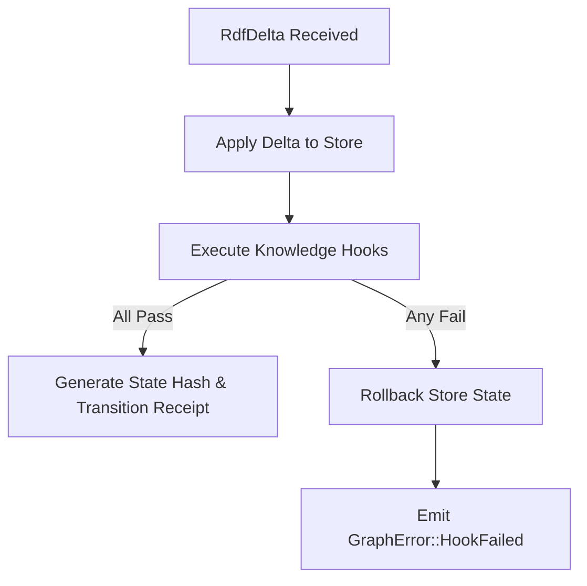

<!-- START doctoc generated TOC please keep comment here to allow auto update -->
<!-- DON'T EDIT THIS SECTION, INSTEAD RE-RUN doctoc TO UPDATE -->
**Table of Contents**

- [Public Ontology Governance Specification](#public-ontology-governance-specification)
  - [1. Canonical Ontology Registry & URIs](#1-canonical-ontology-registry--uris)
  - [2. Rust Vocabulary Constants Generation](#2-rust-vocabulary-constants-generation)
    - [Rust Vocabulary Mapping Strategy](#rust-vocabulary-mapping-strategy)
  - [3. Knowledge Hook Runtime Execution Model](#3-knowledge-hook-runtime-execution-model)
    - [Knowledge Hook Execution Contract](#knowledge-hook-execution-contract)
  - [4. Governance Verification Gates](#4-governance-verification-gates)
    - [Gate 1: Cryptographic Integrity](#gate-1-cryptographic-integrity)
    - [Gate 2: Deterministic Ordering](#gate-2-deterministic-ordering)
    - [Gate 3: Structural Anti-Cheating](#gate-3-structural-anti-cheating)

<!-- END doctoc generated TOC please keep comment here to allow auto update -->

# Public Ontology Governance Specification

This document details the public ontology mapping, vocabulary emission, and knowledge hook governance system implemented in the `ggen-graph` substrate. It defines the formal semantic boundaries and validation gates ensuring absolute adherence to international ontology standards (W3C RDF, RDFS, OWL, XSD, PROV-O, SKOS, SHACL, and OCEL 2.0).

---

## 1. Canonical Ontology Registry & URIs

`ggen-graph` acts as a deterministic processor for semantic structures. It mandates reference to the following authoritative ontology vocabularies. No local overrides or non-canonical variations are permitted.

| Prefix | Namespace URI | Standard Reference | Governance Scope |
|--------|---------------|--------------------|------------------|
| `rdf` | `http://www.w3.org/1999/02/22-rdf-syntax-ns#` | W3C RDF Concepts | Core triple structures, types, lists |
| `rdfs` | `http://www.w3.org/2000/01/rdf-schema#` | W3C RDF Schema | Class/property hierarchies, labels, ranges |
| `owl` | `http://www.w3.org/2002/07/owl#` | W3C OWL 2 Web Ontology | Equivalent classes, symmetric properties, restriction layers |
| `xsd` | `http://www.w3.org/2001/XMLSchema#` | W3C XML Schema Definition | Primitive data types (integers, strings, datetimes) |
| `prov` | `http://www.w3.org/ns/prov#` | W3C PROV-O | Provenance tracking, activities, agents, entities |
| `skos` | `http://www.w3.org/2004/02/skos/core#` | W3C SKOS | Concept schemes, taxonomies, lexicographical labels |
| `shacl`| `http://www.w3.org/ns/shacl#` | W3C SHACL | Shape-based data validation and constraints |
| `ocel` | `http://www.ocel-standard.org/ns#` | OCEL 2.0 Standard | Object-Centric Process Event Log structures |

---

## 2. Rust Vocabulary Constants Generation

To guarantee structural type safety and prevent string-based spelling errors, `ggen-graph` generates compile-time Rust vocabulary constants from public ontology definitions.

### Rust Vocabulary Mapping Strategy
The vocabulary module maps namespaces to associated structs, emitting `NamedNode` types statically:

```rust
// Representative snippet of generated vocabulary constants in ggen-graph
pub mod vocab {
    use oxigraph::model::NamedNodeRef;

    pub mod rdf {
        pub const TYPE: NamedNodeRef<'static> = NamedNodeRef::new_unchecked("http://www.w3.org/1999/02/22-rdf-syntax-ns#type");
        pub const PROPERTY: NamedNodeRef<'static> = NamedNodeRef::new_unchecked("http://www.w3.org/1999/02/22-rdf-syntax-ns#Property");
        pub const STATEMENT: NamedNodeRef<'static> = NamedNodeRef::new_unchecked("http://www.w3.org/1999/02/22-rdf-syntax-ns#Statement");
    }

    pub mod rdfs {
        pub const CLASS: NamedNodeRef<'static> = NamedNodeRef::new_unchecked("http://www.w3.org/2000/01/rdf-schema#Class");
        pub const SUB_CLASS_OF: NamedNodeRef<'static> = NamedNodeRef::new_unchecked("http://www.w3.org/2000/01/rdf-schema#subClassOf");
        pub const DOMAIN: NamedNodeRef<'static> = NamedNodeRef::new_unchecked("http://www.w3.org/2000/01/rdf-schema#domain");
        pub const RANGE: NamedNodeRef<'static> = NamedNodeRef::new_unchecked("http://www.w3.org/2000/01/rdf-schema#range");
    }

    pub mod prov {
        pub const ENTITY: NamedNodeRef<'static> = NamedNodeRef::new_unchecked("http://www.w3.org/ns/prov#Entity");
        pub const ACTIVITY: NamedNodeRef<'static> = NamedNodeRef::new_unchecked("http://www.w3.org/ns/prov#Activity");
        pub const AGENT: NamedNodeRef<'static> = NamedNodeRef::new_unchecked("http://www.w3.org/ns/prov#Agent");
        pub const WAS_GENERATED_BY: NamedNodeRef<'static> = NamedNodeRef::new_unchecked("http://www.ns/prov#wasGeneratedBy");
        pub const WAS_ASSOCIATED_WITH: NamedNodeRef<'static> = NamedNodeRef::new_unchecked("http://www.ns/prov#wasAssociatedWith");
    }

    pub mod ocel {
        pub const EVENT: NamedNodeRef<'static> = NamedNodeRef::new_unchecked("http://www.ocel-standard.org/ns#Event");
        pub const OBJECT: NamedNodeRef<'static> = NamedNodeRef::new_unchecked("http://www.ocel-standard.org/ns#Object");
        pub const LOG: NamedNodeRef<'static> = NamedNodeRef::new_unchecked("http://www.ocel-standard.org/ns#Log");
    }
}
```

---

## 3. Knowledge Hook Runtime Execution Model

Declarative schema and process rules are enforced via **Knowledge Hooks** loaded dynamically into the `DeterministicGraph`.



### Knowledge Hook Execution Contract
1. **Execution Cycle**: Every transaction modification is temporarily applied to the underlying `Store`.
2. **Constraint Verification**: SPARQL `ASK` or `SELECT` queries define the schema assertions.
   - An `ASK` query must evaluate to `true` to pass.
   - A `SELECT` query must return an empty solution set (representing zero violations) to pass.
3. **Deterministic Rollback**: If a hook fails validation, the state modification is immediately reversed using the inverse operations calculated from the `RdfDelta`.
4. **No Side-Effects**: Hooks are strictly read-only query operations; they are forbidden from modifying store data or executing external subprocesses.

---

## 4. Governance Verification Gates

All ontology-aligned changes must pass through structural verification gates in the continuous integration (CI) pipeline:

### Gate 1: Cryptographic Integrity
Every state change is evaluated by checking the `TransitionReceipt`'s cryptographic checksum derived using a `BLAKE3` hash over `(pre_state_hash, post_state_hash, delta_hash, timestamp)`. 

### Gate 2: Deterministic Ordering
Quad representations are string-sorted alphabetically prior to computing the state hash, preventing semantic equivalent graphs from yielding differing signature states.

### Gate 3: Structural Anti-Cheating
The validation engine ensures that:
- Receipts do not contain placeholder hashes.
- Real boundary crossings occurred during execution (monitored by process events).
