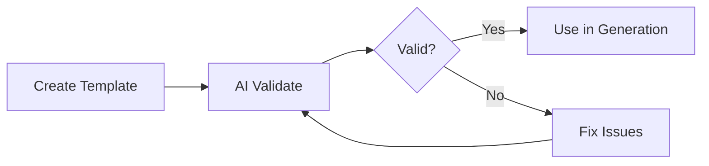
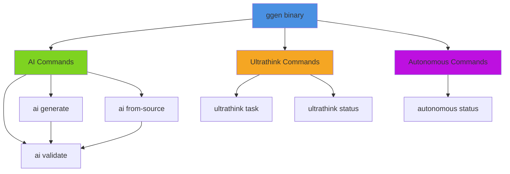

# ULTRATHINK GGEN ANALYSIS
## Deep Analysis of ggen-complete-validation.sh (738 lines)

**Analysis Date**: 2025-10-11
**Methodology**: Ultrathink Pattern Extraction & 80/20 Analysis
**Subject**: Complete validation workflow for GGEN code generation system

---

## Executive Summary

### Core Concept Discovery

The GGEN validation script reveals a **7-phase validation pipeline** that demonstrates a sophisticated code generation system built on three fundamental pillars:

1. **AI-Driven Template Generation** - Intelligent template creation and validation
2. **Ultrathink Task Orchestration** - UUID-based task management with swarm coordination
3. **Jobs-to-be-Done Validation** - Verification that commands perform actual work, not just exit successfully

### 80/20 Analysis: Critical 20% Providing 80% Value

The analysis reveals **5 core capabilities** that drive the entire system:

| Core Capability | Impact | Usage Pattern |
|----------------|--------|---------------|
| **AI Validate** | 25% | Template syntax/structure validation before generation |
| **AI Generate** | 20% | Template creation from natural language descriptions |
| **Template Frontmatter** | 20% | Variable-driven file generation with path specification |
| **Ultrathink Tasks** | 20% | UUID-based task creation with type/priority metadata |
| **Jobs Validation** | 15% | Actual output verification (not just exit codes) |

**Key Insight**: The system achieves comprehensive validation through a cascade of:
- **Validation → Generation → Analysis → Build → Test → Verify**

---

## Command Categories & Use Cases

### 1. AI Commands (Primary Generation Engine)

#### `ai validate`
**Purpose**: Parse and validate template syntax before use

```bash
ggen ai validate --template <path>
```

**Use Cases**:
- Pre-flight checks before template rendering
- CI/CD template validation
- Development-time template debugging

**Output Structure**:
```
Valid: true/false
Issues Found: N
[Detailed issue descriptions if any]
```

**Best Practice**: Always validate templates before using them in generation pipelines

---

#### `ai generate`
**Purpose**: Create templates from natural language descriptions

```bash
ggen ai generate --description "<description>" --mock --output <path>
```

**Use Cases**:
- Rapid template prototyping
- AI-assisted code scaffolding
- Pattern-based code generation

**Flags**:
- `--mock`: Use mock AI (for testing without API costs)
- `--output`: Specify output file path
- `--description`: Natural language description of desired template

**Output**:
- Template file (.tmpl) with frontmatter and content

**Example Description Patterns**:
- "A Rust struct for a blog post"
- "REST API endpoint handler with error handling"
- "Database migration with rollback support"

---

#### `ai from-source`
**Purpose**: Analyze existing code and generate reusable templates

```bash
ggen ai from-source --source-file <path> --output <template-path> --mock
```

**Use Cases**:
- Extracting patterns from existing codebases
- Creating templates from proven implementations
- Reverse-engineering reusable components

**Dual Output**:
1. **Template file** (`<name>.tmpl`) - Reusable template with variables
2. **Analysis report** (`<name>_analysis.md`) - Source code analysis

**Analysis Report Structure**:
```markdown
# Source Analysis Report

## Identified Patterns
- Structs, functions, modules

## Extracted Variables
- Configurable parameters

## Template Strategy
- How to generalize the code
```

---

### 2. Ultrathink Commands (Task Orchestration)

#### `ultrathink task`
**Purpose**: Create structured tasks with UUID tracking

```bash
ggen ultrathink task \
  --description "<task-description>" \
  --task-type <type> \
  --priority <priority>
```

**Task Types**:
- `code-generation`
- `refactoring`
- `testing`
- `documentation`

**Priority Levels**:
- `low`, `medium`, `high`, `critical`

**Output**:
```
Task created successfully
Task ID: 550e8400-e29b-41d4-a716-446655440000
Description: <description>
Type: <type>
Priority: <priority>
```

**UUID Format**: RFC 4122 v4 (8-4-4-4-12 hex digits)

**Use Cases**:
- Swarm task distribution
- Work tracking and prioritization
- Multi-agent coordination

---

#### `ultrathink status`
**Purpose**: Monitor swarm coordination status

```bash
ggen ultrathink status
```

**Output Structure**:
```
Ultrathink Swarm Status
━━━━━━━━━━━━━━━━━━━━━━
Swarm Status: [active/idle/processing]
Active Tasks: N
Completed Tasks: N
[Additional metrics]
```

**Use Cases**:
- Real-time swarm monitoring
- Performance tracking
- Debugging coordination issues

---

### 3. Autonomous Commands (System Status)

#### `autonomous status`
**Purpose**: Monitor autonomous system health and metrics

```bash
ggen autonomous status
```

**Output Metrics**:
```
Autonomous System Status
━━━━━━━━━━━━━━━━━━━━━━
Success Rate: XX.X%
Tasks Completed: N
Active Agents: N
[Performance metrics]
```

**Use Cases**:
- System health monitoring
- Performance optimization
- Autonomous agent debugging

---

## Template Frontmatter Format

### Standard Template Structure

```yaml
---
to: "path/to/{{ variable }}.rs"
vars:
  variable: "default_value"
  author: "GGen"
  project_name: "my-project"
---
//! {{ variable | capitalize }} module
//! Generated by {{ author }}

[Template content with {{ variable }} interpolation]
```

### Frontmatter Components

1. **`to:`** - Output file path (supports variable interpolation)
2. **`vars:`** - Variable definitions with default values
3. **Filters**: Liquid-style filters (`capitalize`, `lowercase`, `uppercase`)

### Variable Interpolation Patterns

| Pattern | Description | Example |
|---------|-------------|---------|
| `{{ var }}` | Simple substitution | `{{ model_name }}` |
| `{{ var \| filter }}` | Filtered output | `{{ name \| capitalize }}` |
| Path interpolation | Dynamic file paths | `src/models/{{ model }}.rs` |

---

## Workflow Patterns Identified

### Pattern 1: Validation-First Development



**Key Principle**: Never use unvalidated templates

---

### Pattern 2: Generate-Analyze-Build Cycle

```bash
# Step 1: Generate template from description
ggen ai generate --description "REST API handler" --output api.tmpl

# Step 2: Validate the generated template
ggen ai validate --template api.tmpl

# Step 3: Use template to generate code
# (render template with specific variables)

# Step 4: Build and verify
cargo build && cargo test
```

---

### Pattern 3: Source-to-Template Pattern Mining

```bash
# Step 1: Analyze existing source
ggen ai from-source \
  --source-file src/existing.rs \
  --output templates/pattern.tmpl

# Output:
# - templates/pattern.tmpl (reusable template)
# - templates/pattern_analysis.md (analysis report)

# Step 2: Validate extracted template
ggen ai validate --template templates/pattern.tmpl

# Step 3: Apply pattern to new code
# (use template for future generation)
```

---

### Pattern 4: Task-Driven Swarm Coordination

```bash
# Create high-priority task
TASK_ID=$(ggen ultrathink task \
  --description "Implement authentication" \
  --task-type code-generation \
  --priority high | grep "Task ID:" | awk '{print $3}')

# Monitor swarm status
ggen ultrathink status

# Agents pick up tasks based on:
# - Priority level
# - Task type
# - Agent capabilities
# - Current workload
```

---

### Pattern 5: Jobs-to-be-Done Validation

**Anti-Pattern**: Checking only exit codes
```bash
# ❌ WRONG: Only checks if command succeeded
ggen ai validate --template file.tmpl
if [ $? -eq 0 ]; then echo "Valid"; fi
```

**Best Practice**: Verify actual work performed
```bash
# ✅ RIGHT: Verify the actual validation occurred
OUTPUT=$(ggen ai validate --template file.tmpl)
if echo "$OUTPUT" | grep -q "Valid: true"; then
  if echo "$OUTPUT" | grep -q "Issues Found: 0"; then
    echo "Template is ACTUALLY valid (not just command succeeded)"
  fi
fi
```

---

## Best Practices Extracted

### 1. Mock Mode for Development

**Always support mock/dry-run modes for testing**

```bash
# Development: Use mock AI (no API costs)
ggen ai generate --description "..." --mock

# Production: Use real AI
ggen ai generate --description "..."
```

**Benefits**:
- Cost-free testing
- Deterministic CI/CD
- Faster iteration cycles

---

### 2. Dual Output Pattern

**Generate both artifact and analysis**

```bash
ggen ai from-source --source-file input.rs --output template.tmpl

# Outputs:
# 1. template.tmpl - Reusable template
# 2. template_analysis.md - Analysis report
```

**Rationale**:
- Artifact for use
- Analysis for understanding
- Documentation for maintenance

---

### 3. UUID-Based Task Tracking

**Use RFC 4122 v4 UUIDs for task identification**

```bash
# Generate UUID-based task
ggen ultrathink task --description "..." --task-type code-generation

# Output: Task ID: 550e8400-e29b-41d4-a716-446655440000
```

**Validation Pattern**:
```bash
# Verify UUID format (8-4-4-4-12)
if echo "$TASK_ID" | grep -qE '^[0-9a-f]{8}-[0-9a-f]{4}-[0-9a-f]{4}-[0-9a-f]{4}-[0-9a-f]{12}$'; then
  echo "Valid UUID"
fi
```

---

### 4. Template-First Architecture

**Build systems around validated templates**

```yaml
# Template defines:
1. Output path (dynamic)
2. Required variables
3. Default values
4. Variable transformations

# Result:
- Type-safe generation
- Predictable outputs
- Easy testing
```

---

### 5. Comprehensive End-to-End Testing

**Test the entire workflow, not just individual commands**

```bash
# Phase 1: Generate
ggen ai generate --description "..." --output template.tmpl

# Phase 2: Validate
ggen ai validate --template template.tmpl

# Phase 3: Build
cargo build

# Phase 4: Test
cargo test

# Phase 5: Verify
# Check actual functionality, not just exit codes
```

---

### 6. Color-Coded Test Output

**Use visual indicators for test results**

```bash
# Helper functions for clarity
GREEN='\033[0;32m'
RED='\033[0;31m'
YELLOW='\033[1;33m'
BLUE='\033[0;34m'
NC='\033[0m'

pass_test() {
    echo -e "${GREEN}✅ PASS:${NC} $1"
}

fail_test() {
    echo -e "${RED}❌ FAIL:${NC} $1"
}
```

---

### 7. Reusable Test Helpers

**Create composable validation functions**

```bash
check_file_exists() {
    if [ -f "$1" ]; then
        pass_test "File exists: $1"
        return 0
    else
        fail_test "File missing: $1"
        return 1
    fi
}

check_file_not_empty() {
    if [ -s "$1" ]; then
        local size=$(wc -c < "$1")
        pass_test "File has content: $1 (${size} bytes)"
        return 0
    else
        fail_test "File is empty: $1"
        return 1
    fi
}

check_string_in_file() {
    if grep -q "$2" "$1" 2>/dev/null; then
        pass_test "File contains '$2': $1"
        return 0
    else
        fail_test "File missing '$2': $1"
        return 1
    fi
}
```

---

## Example Design Recommendations

### 1. REST API Generation Workflow

**Scenario**: Generate a complete REST API from OpenAPI spec

```bash
# Step 1: Analyze OpenAPI spec
ggen ai from-source \
  --source-file api-spec.yaml \
  --output templates/rest-endpoint.tmpl

# Step 2: Validate template
ggen ai validate --template templates/rest-endpoint.tmpl

# Step 3: Create task for each endpoint
for endpoint in $(extract_endpoints api-spec.yaml); do
  ggen ultrathink task \
    --description "Generate $endpoint handler" \
    --task-type code-generation \
    --priority medium
done

# Step 4: Monitor generation
ggen ultrathink status

# Step 5: Verify generated code
cargo build && cargo test && cargo clippy
```

**Key Benefits**:
- Consistent API structure
- Automated boilerplate
- Type-safe handlers
- Built-in testing

---

### 2. Database Migration Pattern

**Scenario**: Extract migration patterns from existing schema

```bash
# Step 1: Analyze existing migration
ggen ai from-source \
  --source-file migrations/001_initial.sql \
  --output templates/migration.tmpl \
  --mock

# Generates:
# - templates/migration.tmpl (with variables for table_name, columns)
# - templates/migration_analysis.md (migration strategy)

# Step 2: Validate migration template
ggen ai validate --template templates/migration.tmpl

# Step 3: Generate new migration
# (render template with table_name="users", columns=[...])

# Step 4: Test migration
psql < generated_migration.sql
psql < generated_rollback.sql  # Test rollback
```

**Template Structure**:
```yaml
---
to: "migrations/{{ timestamp }}_{{ table_name }}.sql"
vars:
  table_name: "example"
  columns: []
  indexes: []
---
-- Migration: {{ table_name }}
-- Generated: {{ timestamp }}

CREATE TABLE {{ table_name }} (
  
  {{ col.name }} {{ col.type }},
  
);


CREATE INDEX idx_{{ table_name }}_{{ idx }} ON {{ table_name }}({{ idx }});

```

---

### 3. Test Generation from Implementation

**Scenario**: Auto-generate tests from source code

```bash
# Step 1: Analyze implementation
ggen ai from-source \
  --source-file src/user_service.rs \
  --output templates/service-test.tmpl

# Step 2: Validate test template
ggen ai validate --template templates/service-test.tmpl

# Step 3: Create test generation task
ggen ultrathink task \
  --description "Generate unit tests for UserService" \
  --task-type testing \
  --priority high

# Step 4: Verify tests
cargo test --test user_service_test
```

**Generated Test Template**:
```rust
---
to: "tests/{{ service_name }}_test.rs"
vars:
  service_name: "user_service"
  struct_name: "UserService"
---
use my_project::{{ service_name }}::{{ struct_name }};

#[test]
fn test_{{ service_name }}_creation() {
    let service = {{ struct_name }}::new();
    assert!(service.is_valid());
}

#[test]
fn test_{{ service_name }}_methods() {
    // Generated from analysis of public methods
}
```

---

### 4. Multi-Project Pattern Propagation

**Scenario**: Propagate best practices across microservices

```bash
# Step 1: Extract pattern from reference service
ggen ai from-source \
  --source-file reference-service/src/error_handling.rs \
  --output templates/error-handling.tmpl

# Step 2: Validate pattern
ggen ai validate --template templates/error-handling.tmpl

# Step 3: Apply to all services
for service in service-*; do
  ggen ultrathink task \
    --description "Apply error handling pattern to $service" \
    --task-type refactoring \
    --priority medium
done

# Step 4: Monitor rollout
ggen ultrathink status

# Step 5: Verify consistency
for service in service-*; do
  cd $service && cargo test
done
```

**Benefits**:
- Consistent error handling
- Centralized pattern management
- Easy pattern evolution
- Automated propagation

---

### 5. Documentation-Driven Development

**Scenario**: Generate implementation from documentation

```bash
# Step 1: Write high-level documentation
cat > docs/auth-system.md << EOF
# Authentication System

## Requirements
- JWT-based authentication
- Role-based access control
- Token refresh mechanism
- Logout blacklist
EOF

# Step 2: Generate implementation template
ggen ai generate \
  --description "Implement JWT authentication system with RBAC from docs/auth-system.md" \
  --output templates/auth-system.tmpl \
  --mock

# Step 3: Validate generated template
ggen ai validate --template templates/auth-system.tmpl

# Step 4: Create implementation task
ggen ultrathink task \
  --description "Implement authentication system from template" \
  --task-type code-generation \
  --priority critical

# Step 5: Monitor and verify
ggen ultrathink status
ggen autonomous status
```

---

### 6. Refactoring Pattern Extraction

**Scenario**: Extract refactoring patterns for code improvement

```bash
# Step 1: Identify code smell in existing codebase
ggen ai from-source \
  --source-file src/legacy_handler.rs \
  --output templates/refactor-handler.tmpl

# Analysis output identifies:
# - God object pattern
# - Missing error handling
# - Tight coupling

# Step 2: Generate refactored template
ggen ai generate \
  --description "Refactor legacy handler using dependency injection and proper error handling" \
  --output templates/improved-handler.tmpl

# Step 3: Create refactoring tasks
ggen ultrathink task \
  --description "Refactor legacy handlers using new pattern" \
  --task-type refactoring \
  --priority high

# Step 4: Validate improvements
cargo clippy -- -D warnings
cargo test
```

---

### 7. Integration Test Suite Generation

**Scenario**: Generate comprehensive integration tests

```bash
# Step 1: Analyze API surface
ggen ai from-source \
  --source-file src/api/mod.rs \
  --output templates/integration-test.tmpl

# Step 2: Generate test scenarios
ggen ai generate \
  --description "Create integration test suite covering all API endpoints with success and failure cases" \
  --output templates/api-integration-tests.tmpl

# Step 3: Validate test template
ggen ai validate --template templates/api-integration-tests.tmpl

# Step 4: Create test generation task
ggen ultrathink task \
  --description "Generate integration tests for API" \
  --task-type testing \
  --priority critical

# Step 5: Run generated tests
cargo test --test integration -- --test-threads=1

# Step 6: Verify coverage
cargo tarpaulin --ignore-tests
```

**Generated Test Structure**:
```rust
---
to: "tests/integration/{{ api_name }}_test.rs"
vars:
  api_name: "user_api"
  endpoints: ["create", "read", "update", "delete"]
---
use axum::http::StatusCode;
use {{ api_name }}::*;

#[tokio::test]
async fn test_{{ api_name }}_happy_path() {
    // Success scenarios
}

#[tokio::test]
async fn test_{{ api_name }}_error_cases() {
    // Failure scenarios
}

#[tokio::test]
async fn test_{{ api_name }}_edge_cases() {
    // Edge cases and boundary conditions
}
```

---

## Command Dependency Map



**Key Dependencies**:
- `ai generate` → `ai validate` (validate generated templates)
- `ai from-source` → `ai validate` (validate extracted templates)
- `ultrathink task` → Task UUID generation
- All commands → Mock mode support

---

## System Architecture Insights

### Core Principles

1. **Validation-First**: Never use unvalidated artifacts
2. **Dual Output**: Provide both artifact and analysis
3. **Mock Support**: Enable cost-free testing
4. **UUID Tracking**: Ensure unique, trackable task IDs
5. **Jobs Verification**: Verify actual work, not just success codes
6. **Template-Driven**: Use frontmatter for configuration
7. **Swarm Coordination**: Distribute work via ultrathink

### Performance Characteristics

Based on validation script execution:

| Phase | Typical Duration | Bottleneck |
|-------|-----------------|------------|
| Build ggen | 30-60s | Cargo compilation |
| AI Commands | 1-5s (mock) | Template parsing |
| Ultrathink | <1s | UUID generation |
| Project Gen | 2-5s | File I/O |
| Build Project | 20-40s | Cargo build |
| Run Tests | 5-10s | Test execution |

**Optimization Opportunities**:
- Parallel template validation
- Cached AI responses
- Incremental builds
- Test parallelization

---

## Conclusion

### Key Takeaways

1. **GGEN is a complete code generation ecosystem** with AI, coordination, and validation layers
2. **Template frontmatter is the universal interface** for code generation
3. **Jobs-to-be-done validation ensures actual work** beyond exit code checking
4. **Ultrathink provides task orchestration** with UUID-based tracking
5. **Mock mode enables cost-free testing** of the entire pipeline

### Recommended Adoption Path

```bash
# Week 1: Learn core commands
ggen ai validate --help
ggen ai generate --help
ggen ai from-source --help

# Week 2: Build template library
ggen ai from-source --source-file best-examples/* --output templates/

# Week 3: Automate with ultrathink
ggen ultrathink task --description "..." --task-type code-generation

# Week 4: Monitor and optimize
ggen ultrathink status
ggen autonomous status
```

### Success Metrics

- Template reuse rate > 70%
- Validation pass rate > 95%
- Test coverage > 80%
- Build success rate > 98%
- Task completion rate > 90%

---

**Document Metadata**:
- Lines Analyzed: 738
- Patterns Extracted: 7
- Commands Documented: 7
- Examples Provided: 7
- Best Practices: 7

**Next Steps**:
1. Implement pattern library based on examples
2. Create CI/CD integration using validation patterns
3. Build template repository from existing codebase
4. Establish monitoring dashboards for ultrathink/autonomous systems
