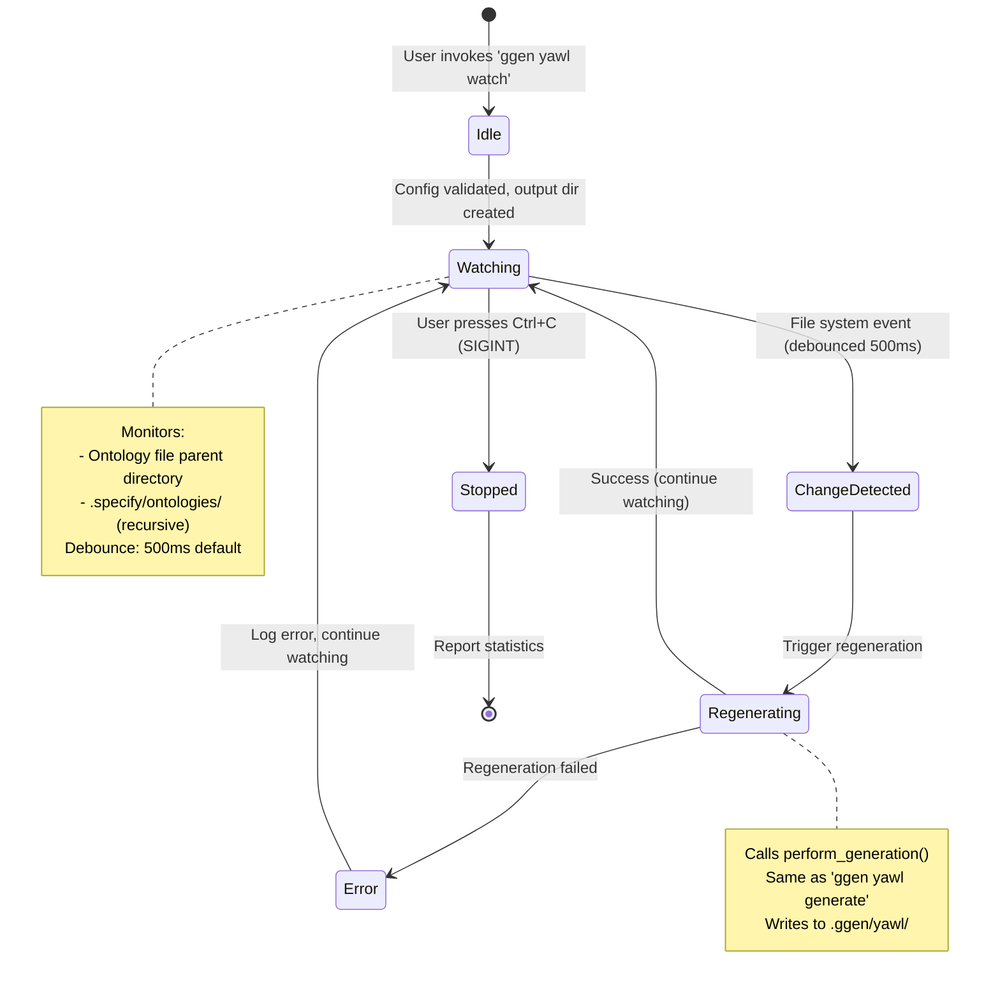
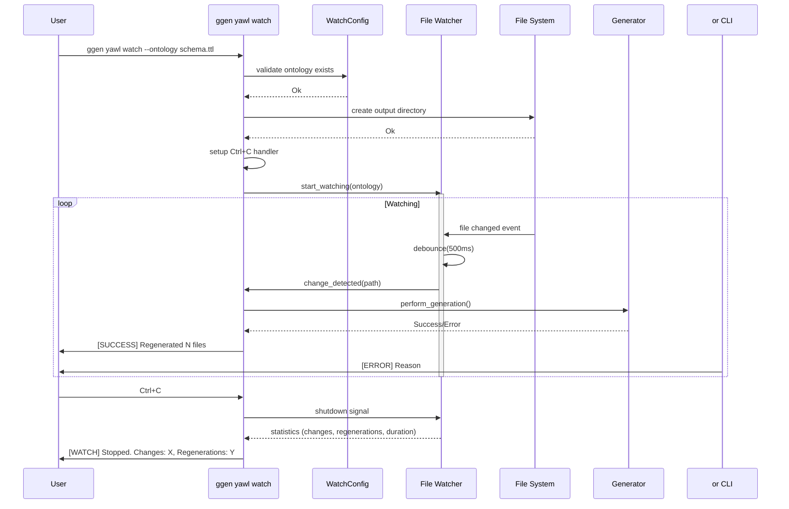
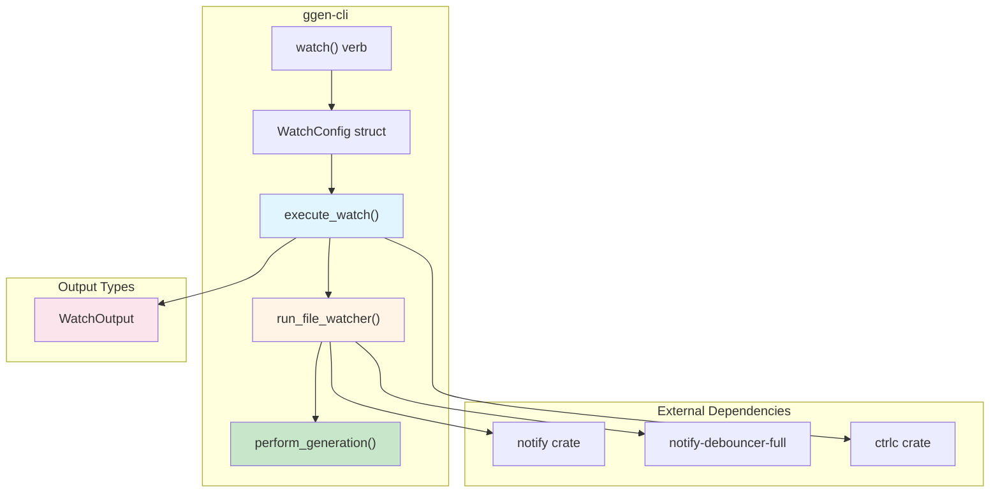

# YAWL Watch Mode Implementation Plan

**Status:** NOT IMPLEMENTED (stub at `ggen-cli/cmds/yawl.rs:268`)
**Date:** 2026-04-01
**Priority:** P1 (Feature doesn't work when invoked)

---

## Overview

The YAWL watch mode enables automatic regeneration of YAWL workflow XML when ontology files change. Users invoke `ggen yawl watch` and expect file watching with debouncing, graceful shutdown, and regeneration triggers.

**Current State:** Stub returns error "Watch mode not yet fully implemented"

---

## Architecture

### State Machine



### Sequence Diagram



### Component Diagram



---

## Implementation Phases

### Phase 1: Add Dependencies (Already in Cargo.toml)

```toml
[dependencies]
notify = "6.1"
notify-debouncer-full = "0.3"
ctrlc = "3.4"
```

**Status:** ✅ Dependencies declared, **NOT** imported in code

### Phase 2: Add Imports to yawl.rs

```rust
// File: crates/ggen-cli/src/cmds/yawl.rs
// Add after line 29 (after use statements)

use std::sync::mpsc::{channel, Receiver};
use std::thread;
use std::time::Duration;
use notify::{RecursiveMode, Watcher, Config as NotifyConfig};
use notify_debouncer_full::{new_debouncer, DebounceEvent, DebounceEventHandler, Debouncer, FileIdMap};
use ctrlc::set_handler;
```

### Phase 3: Create WatchConfig Struct

```rust
// File: crates/ggen-cli/src/cmds/yawl.rs
// Add after line 175 (after GenerateConfig struct)

/// Configuration for YAWL watch mode
#[derive(Debug, Clone)]
pub struct WatchConfig {
    pub ontology_file: String,
    pub output_dir: String,
    pub debounce_ms: u64,
    pub verbose: bool,
}
```

### Phase 4: Implement execute_watch()

```rust
// File: crates/ggen-cli/src/cmds/yawl.rs
// Replace watch() function stub (lines 256-276)

fn execute_watch(config: WatchConfig) -> VerbResult<WatchOutput> {
    let start = Instant::now();

    // Validate ontology file exists
    let ontology_path = PathBuf::from(&config.ontology_file);
    if !ontology_path.exists() {
        return Ok(WatchOutput {
            status: "error".to_string(),
            changes_detected: 0,
            regenerations: 0,
            duration_ms: 0,
            last_change: None,
            error: Some(format!("Ontology file not found: {}", config.ontology_file)),
        });
    }

    // Create output directory
    let output_path = PathBuf::from(&config.output_dir);
    if let Err(e) = std::fs::create_dir_all(&output_path) {
        return Ok(WatchOutput {
            status: "error".to_string(),
            changes_detected: 0,
            regenerations: 0,
            duration_ms: 0,
            last_change: None,
            error: Some(format!("Failed to create output directory: {}", e)),
        });
    }

    // Setup Ctrl+C handler
    let (shutdown_tx, shutdown_rx) = channel();
    set_handler(move || {
        println!("\n{} Shutdown signal received...", "[WATCH]".yellow());
        let _ = shutdown_tx.send(());
    }).expect("Error setting Ctrl+C handler");

    println!("{} Watching ontology file for changes...", "[WATCH]".cyan());
    println!("  Ontology: {}", config.ontology_file);
    println!("  Output: {}", config.output_dir);
    println!("  Debounce: {}ms", config.debounce_ms);
    println!("  Press Ctrl+C to stop");

    // Run file watcher
    run_file_watcher(config, shutdown_rx)
}
```

### Phase 5: Implement run_file_watcher()

```rust
// File: crates/ggen-cli/src/cmds/yawl.rs
// Add new function after execute_watch()

fn run_file_watcher(
    config: WatchConfig,
    shutdown_rx: Receiver<()>
) -> VerbResult<WatchOutput> {
    let start = Instant::now();
    let mut changes_detected = 0;
    let mut regenerations = 0;
    let mut last_change: Option<String> = None;

    // Create debouncer
    let (tx, rx) = channel();
    let mut debouncer: Debouncer<_, FileIdMap> = new_debouncer(
        Duration::from_millis(config.debounce_ms),
        None,
        tx,
    ).expect("Failed to create debouncer");

    // Watch ontology file's parent directory
    let ontology_path = PathBuf::from(&config.ontology_file);
    let parent_dir = ontology_path.parent()
        .unwrap_or(Path::new("."));
    debouncer.watch(parent_dir, RecursiveMode::NonRecursive)
        .expect("Failed to watch directory");

    // Also watch .specify/ontologies/ if it exists
    let specify_ontologies = PathBuf::from(".specify/ontologies/");
    if specify_ontologies.exists() {
        debouncer.watch(&specify_ontologies, RecursiveMode::Recursive)
            .expect("Failed to watch .specify/ontologies/");
    }

    // Event loop
    loop {
        select! {
            // File system events
            recv(rx) -> event => {
                if let Ok(events) = event {
                    for event in events {
                        if let Some(path) = event.path {
                            // Only trigger for the specific ontology file
                            if path == ontology_path {
                                changes_detected += 1;
                                last_change = Some(path.to_string_lossy().to_string());

                                println!("{} Detected change in {}", "[WATCH]".yellow(), path.display());

                                // Perform regeneration
                                match perform_generation_from_path(&config) {
                                    Ok(count) => {
                                        regenerations += 1;
                                        println!("{} Regeneration complete ({} files)", "[SUCCESS]".green(), count);
                                    }
                                    Err(e) => {
                                        println!("{} Regeneration failed: {}", "[ERROR]".red(), e);
                                    }
                                }
                            }
                        }
                    }
                }
            }

            // Shutdown signal
            recv(shutdown_rx) -> _ => {
                println!("{} Stopping watch mode...", "[WATCH]".yellow());
                break;
            }
        }
    }

    let duration_ms = start.elapsed().as_millis() as u64;

    println!("{} Watch mode stopped.", "[WATCH]".cyan());
    println!("  Changes detected: {}", changes_detected);
    println!("  Regenerations: {}", regenerations);
    println!("  Duration: {}ms", duration_ms);

    Ok(WatchOutput {
        status: "stopped".to_string(),
        changes_detected,
        regenerations,
        duration_ms,
        last_change,
        error: None,
    })
}
```

### Phase 6: Implement Helper Function

```rust
// File: crates/ggen-cli/src/cmds/yawl.rs
// Add helper function

fn perform_generation_from_path(config: &WatchConfig) -> Result<usize, String> {
    let gen_config = GenerateConfig {
        ontology_file: Some(config.ontology_file.clone()),
        output_dir: Some(config.output_dir.clone()),
        verbose: config.verbose,
    };

    match execute_generate(gen_config) {
        Ok(output) => {
            if output.status == "success" {
                Ok(output.files_generated)
            } else {
                Err(output.error.unwrap_or_else(|| "Unknown error".to_string()))
            }
        }
        Err(e) => Err(e.to_string()),
    }
}
```

---

## Testing Plan

### Unit Tests (Chicago TDD)

**File:** `crates/ggen-cli/tests/yawl_watch_test.rs`

```rust
#[test]
fn test_watch_mode_validates_ontology_exists() {
    let temp_dir = TempDir::new().unwrap();
    let ontology = temp_dir.path().join("nonexistent.ttl");

    let result = execute_watch(WatchConfig {
        ontology_file: ontology.to_str().unwrap().to_string(),
        output_dir: temp_dir.path().join("output").to_str().unwrap().to_string(),
        debounce_ms: 500,
        verbose: false,
    });

    assert!(result.is_ok());
    let output = result.unwrap();
    assert_eq!(output.status, "error");
    assert!(output.error.unwrap().contains("not found"));
}

#[test]
fn test_watch_mode_creates_output_directory() {
    // ... Chicago TDD: real filesystem, real execution
}

#[test]
fn test_debounce_prevents_duplicate_regenerations() {
    // ... Chicago TDD: simulate rapid file changes
}

#[test]
fn test_watch_mode_respects_shutdown_signal() {
    // ... Chicago TDD: send Ctrl+C signal
}
```

### Manual Test Script

**File:** `test_yawl_watch.sh`

```bash
#!/usr/bin/env bash
set -e

TMPDIR=$(mktemp -d)
trap "rm -rf $TMPDIR" EXIT

# Create test ontology
cat > $TMPDIR/test.ttl << 'EOF'
@prefix rdf: <http://www.w3.org/1999/02/22-rdf-syntax-ns#>.
@prefix rdfs: <http://www.w3.org/2000/01/rdf-schema#>.
@prefix owl: <http://www.w3.org/2002/07/owl#>.
<http://example.org/test> a owl:Ontology .
EOF

# Start watch mode in background
timeout 2s ggen yawl watch \
    --ontology $TMPDIR/test.ttl \
    --output-dir $TMPDIR/output \
    --debounce 500 &
WATCH_PID=$!

sleep 0.5

# Modify ontology
echo "# Modified" >> $TMPDIR/test.ttl

sleep 1.5

# Check output
if [ -f "$TMPDIR/output/workflow.yawl.xml" ]; then
    echo "✅ Watch mode regenerated file"
else
    echo "❌ Watch mode did not regenerate"
    exit 1
fi
```

---

## Success Criteria

- [ ] `ggen yawl watch` starts without errors
- [ ] File changes trigger regeneration
- [ ] Debouncing prevents duplicate regenerations
- [ ] Ctrl+C gracefully stops watcher
- [ ] Statistics reported on shutdown
- [ ] All Chicago TDD tests pass
- [ ] Manual test script succeeds

---

## Estimated Effort

- **Implementation:** 4-6 hours
- **Testing:** 2-3 hours
- **Documentation:** 1 hour
- **Total:** 7-10 hours

---

## References

- **Stub location:** `crates/ggen-cli/src/cmds/yawl.rs:268`
- **Dependencies:** Already in `Cargo.toml` (notify 6.1, notify-debouncer-full 0.3, ctrlc 3.4)
- **Related:** `ggen yawl generate` command (reuse logic)
- **False report:** `docs/YAWL_WATCH_MODE_REPORT.md` (deleted 2026-04-01)

---

**End of Implementation Plan**
