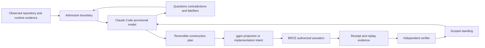
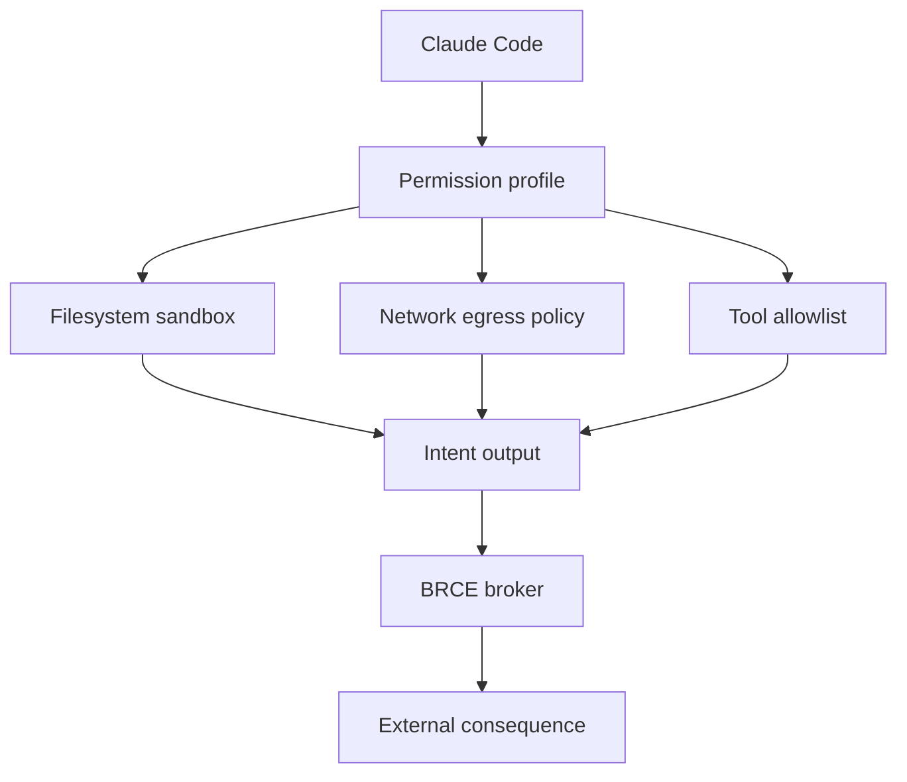
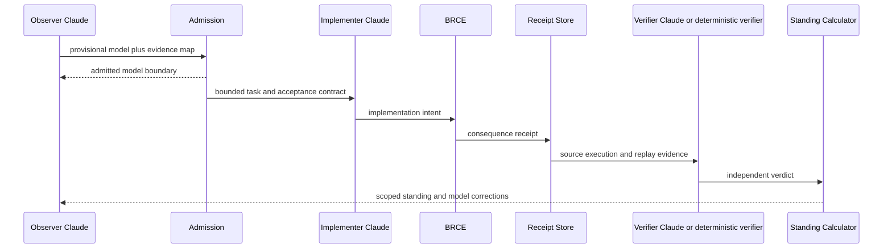

# Claude Code as the First Reference Operator

**Status:** Proposed architecture

**Date:** 2026-08-03

**Scope:** Documentation only. This document does not grant Claude Code authority to modify repositories, actuate infrastructure, approve releases, or establish standing.

## 1. Decision

Use Anthropic Claude Code as the first external reference operator that attempts to reconstruct, explain, challenge, and iteratively improve its understanding of the ggen ecosystem.

Claude Code is not the architecture authority and is not the standing authority. It is the first executable consumer of the architecture contract.

The intended relationship is:

```text
canonical system evidence
→ bounded Claude Code observation
→ explicit system model
→ executable questions and falsifiers
→ ggen-owned admission
→ bounded implementation intent
→ BRCE actuation
→ receipts and replay
→ independent standing
```

Claude Code's value is not that its interpretation is presumed correct. Its value is that it provides a capable, repeatable user whose misunderstandings can be observed, classified, and used to improve the architecture's explanatory and executable surfaces.

## 2. Why Claude Code is the correct first user

Anthropic's published guidance emphasizes several practices that align with the ggen operating model:

1. inspect the repository before implementation;
2. separate exploration and planning from code changes;
3. encode repository instructions in concise `CLAUDE.md` files;
4. use explicit tool permissions and constrained execution environments;
5. iterate against tests, screenshots, or other verifiable targets;
6. use separate contexts or agents for implementation and review;
7. preserve machine-readable output for automation;
8. treat sandboxing and environment boundaries as preferable to repeated ad hoc approvals.

These practices make Claude Code suitable for modeling a system whose central requirements are explicit observation, bounded authority, reversible construction, receipted actuation, replay, and independently calculated standing.

## 3. Architectural role

Claude Code occupies the **Operator and Model Consumer** role.

It may:

- read admitted repository evidence;
- identify architecture components and interfaces;
- produce a provisional capability graph;
- explain its current model;
- identify contradictions, ambiguity, missing evidence, and unsupported assumptions;
- generate questions and falsifiers;
- propose reversible plans and ggen inputs;
- execute bounded verification commands when explicitly admitted;
- compare observed results with expected architecture consequences;
- revise its model after receipt-backed evidence.

It may not independently:

- declare a capability `ALIVE`;
- convert inference into admitted fact;
- edit generated projections directly;
- obtain ambient shell, network, filesystem, cloud, or GitHub authority;
- bypass BRCE for consequential actuation;
- approve its own implementation;
- certify its own receipts;
- merge, deploy, release, or retire a predecessor without separate authority.

## 4. The understanding loop



The loop is intentionally recursive. A successful execution does not merely complete a task; it updates the operator's model and exposes whether the system is understandable through its declared interfaces.

## 5. Epistemic contract

Claude Code must publish its model in a form that distinguishes:

| Claim class | Meaning |
|---|---|
| `OBSERVED` | Directly read from the exact admitted source or runtime output |
| `ADMITTED` | Accepted by an explicit authority or validation boundary |
| `EXECUTED` | Observed during execution against the exact subject |
| `VERIFIED` | Checked by a separate verifier or context |
| `INFERRED` | Reasoned from evidence but not admitted as fact |
| `UNKNOWN` | Required evidence was not observed |
| `BLOCKED` | A required dependency or authority prevented execution |
| `UNSUPPORTED` | Outside the declared system boundary |
| `REFUSED_*` | Rejected by a typed policy or admission rule |

Every architecture explanation should identify its evidence source and claim class. Explanations without this separation are useful prose but are not architecture receipts.

## 6. Repository memory design

Anthropic recommends concise project memory containing commands, architecture, conventions, test instructions, and repository etiquette. For this ecosystem, the root `CLAUDE.md` should be a generated or carefully governed operator briefing rather than a second independent doctrine source.

Recommended structure:

```text
CLAUDE.md
├── system identity and exact scope
├── authority hierarchy
├── evidence vocabulary
├── generated versus manual ownership
├── repository map
├── primary commands
├── verification ladder
├── BRCE and actuation restrictions
├── receipt and replay requirements
├── common typed refusals
└── links to deeper subtree instructions
```

### Ownership rule

```text
canonical ontology and repository doctrine
→ ggen query
→ CLAUDE.md projection
→ Claude Code context
```

`CLAUDE.md` must not silently become a competing ontology. Any durable correction discovered through Claude Code should update the owning graph, contract, or source document and then regenerate or reconcile the operator briefing.

## 7. First-session protocol

The first Claude Code session should run in plan mode or an equivalent read-dominant permission profile.

### Phase A — orient

Claude Code receives:

- repository identity;
- exact base SHA;
- root and nested doctrine;
- architecture documents;
- manifests and task runners;
- generated-surface ownership rules;
- known capability registry;
- verification and receipt schemas.

Expected output:

- repository map;
- architecture component map;
- interface map;
- authority map;
- evidence gaps;
- unresolved questions;
- provisional standing matrix.

No implementation is permitted in this phase.

### Phase B — challenge

Claude Code must generate falsifiers for its own model:

- What evidence would prove this component is not the authority?
- Which interface is inferred rather than observed?
- Which capability appears duplicated under different names?
- Which generated surface lacks an identified owner?
- Which standing claim lacks exact-subject execution?
- Which actuation path could bypass BRCE?
- Which receipt fails to bind the actual operation?

### Phase C — construct

Claude Code proposes reversible architecture changes:

- ontology additions;
- capability identity reconciliation;
- missing interface contracts;
- documentation corrections;
- verifier fixtures;
- typed refusals;
- ggen pack or template requirements.

The plan is an artifact, not authority to act.

### Phase D — execute and observe

Only admitted commands are executed. Each consequential action must pass through the declared boundary and produce a receipt.

### Phase E — independent review

A fresh Claude Code context, another model, or a deterministic verifier reviews:

- the original evidence;
- the proposed model;
- the changes;
- the execution output;
- the receipt topology;
- the standing claim.

The implementation context cannot approve itself.

## 8. Permission and containment profile

Anthropic's recent engineering guidance favors sandbox and environment boundaries over repeated low-information approval prompts. The ecosystem should therefore define a Claude Code Toolchain Capsule with explicit filesystem, command, network, and credential boundaries.



Recommended default:

- read access to the admitted workspace;
- write access only to a purpose branch or scratch worktree;
- no credential discovery;
- no unrestricted network access;
- no direct production access;
- no merge or release authority;
- explicit allowlist for deterministic local verification;
- maximum-turn and cost bounds for non-interactive runs;
- structured JSON output for machine ingestion;
- complete transcript or event capture where policy permits.

The unsafe permission-bypass mode is outside the reference architecture.

## 9. Multi-context verification

Anthropic recommends separating implementation and review contexts. The architecture formalizes that recommendation as distinct roles:



The minimum separation is fresh context. Stronger separation uses a different toolchain capsule, model identity, or deterministic verifier.

## 10. Iteration target: model convergence

The first success metric is not code volume. It is convergence between the operator's model and the canonical architecture.

Track:

- percentage of capabilities correctly identified;
- authority-edge accuracy;
- generated-owner accuracy;
- number of unsupported assumptions;
- number of contradictions found;
- proportion of standing claims with valid receipts;
- replay success rate;
- number of direct-actuation bypass attempts refused;
- corrections promoted into canonical ontology;
- corrections that remain operator-local and should be discarded.

A proposed metric:

```text
Model Convergence Score
  = weighted(
      capability identity accuracy,
      interface accuracy,
      authority accuracy,
      evidence classification accuracy,
      standing accuracy,
      falsifier quality,
      replay agreement
    )
```

The metric must not reward confident prose. It should be calculated from comparison against admitted graph and receipt evidence.

## 11. Claude Code operator pack

The first implementation should be a documentation and configuration pack, not a runtime rewrite.

Proposed pack:

```text
packs/claude-code-operator/
├── ontology.ttl
├── queries/
│   ├── operator-briefing.rq
│   ├── permission-profile.rq
│   ├── architecture-questionnaire.rq
│   └── standing-review.rq
├── templates/
│   ├── CLAUDE.md.tera
│   ├── settings.json.tera
│   ├── first-session-prompt.md.tera
│   ├── architecture-model.json.tera
│   ├── falsifier-report.json.tera
│   └── review-prompt.md.tera
├── shapes/
│   ├── operator-model.shacl.ttl
│   └── permission-profile.shacl.ttl
└── fixtures/
    ├── valid-model/
    ├── inferred-as-observed-refused/
    ├── ambient-actuation-refused/
    └── self-certification-refused/
```

## 12. Required machine-readable artifacts

### `architecture-model.json`

Must bind:

- repository and exact base;
- evidence sources;
- capabilities;
- components;
- interfaces;
- authority edges;
- generated owners;
- standings;
- assumptions;
- contradictions;
- open questions;
- proposed falsifiers.

### `operator-run.json`

Must bind:

- Claude Code version;
- model identifier;
- permission mode;
- allowed and denied tools;
- workspace identity;
- start and end time;
- turn bound;
- commands requested;
- commands admitted;
- commands refused;
- outputs and exit codes;
- produced artifact identities.

### `model-diff.json`

Compares two understanding iterations and records:

- added claims;
- removed claims;
- corrected claims;
- newly grounded claims;
- downgraded claims;
- unresolved contradictions;
- convergence score delta.

## 13. First experiment

Use the existing architecture PR as the initial subject.

### Input

- the exact PR head;
- the three ecosystem architecture documents;
- this reference-operator document;
- root repository doctrine;
- selected source manifests and architecture files.

### Task

Ask Claude Code to:

1. reconstruct the target architecture without implementation;
2. emit the machine-readable architecture model;
3. identify the five most consequential ambiguities;
4. produce one falsifier for each major architecture plane;
5. compare its model to the canonical capability registry;
6. recommend the smallest documentation or ontology correction set;
7. stop before code or actuation.

### Acceptance

- exact subject identity is present;
- all claims are classified;
- no implementation changes occur;
- unsupported assumptions are explicit;
- the architecture model validates against SHACL or equivalent schema;
- a second fresh context can replay the evidence and reproduce the material conclusions;
- differences become a typed `model-diff.json` artifact.

## 14. Standing

| Area | Standing |
|---|---|
| Anthropic best-practice research | `ALIVE` as a documentation observation from official sources |
| Claude Code reference-operator architecture | `PARTIAL_ALIVE` as a documented design |
| Claude Code operator pack | `UNKNOWN` until manufactured |
| Generated `CLAUDE.md` projection | `UNKNOWN` |
| Permission-profile capsule | `UNKNOWN` |
| First-session architecture reconstruction | `UNKNOWN` |
| Independent model replay | `UNKNOWN` |
| Model convergence crown | `UNKNOWN` |
| Direct autonomous production actuation | `UNSUPPORTED` by this architecture |
| Self-certification by Claude Code | `REFUSED_SELF_CERTIFICATION` |
| Permission bypass mode | `UNSUPPORTED` for the reference operator |

## 15. Highest-leverage next sequence

1. define the `OperatorModel`, `OperatorRun`, and `ModelDiff` ontology classes;
2. create SHACL shapes for claim classification and exact-subject identity;
3. manufacture the concise root `CLAUDE.md` from canonical doctrine;
4. manufacture a restrictive Claude Code permission profile;
5. run Claude Code in plan mode against the architecture PR;
6. capture its provisional model and falsifiers;
7. run a fresh-context independent review;
8. compare both models to the canonical graph;
9. promote only receipt-backed corrections into the owning architecture source;
10. repeat until the model-convergence crown closes.

The first deliverable is therefore not code generated by Claude Code. It is evidence that Claude Code can correctly understand the system, expose ambiguity, and improve the canonical model through a controlled, replayable learning loop.

## 16. Research sources

This design was informed by Anthropic's official Claude Code guidance on repository memory, explore-plan-code workflows, test-driven iteration, independent contexts, tool permissions, CLI automation, sandboxing, and containment. Source links should be reviewed periodically because Claude Code capabilities and recommended controls continue to evolve.
