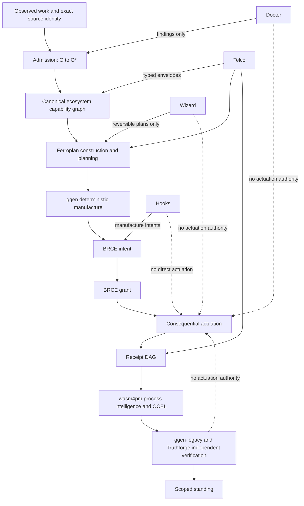
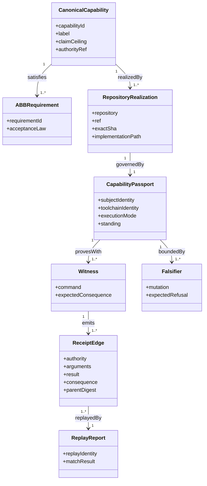
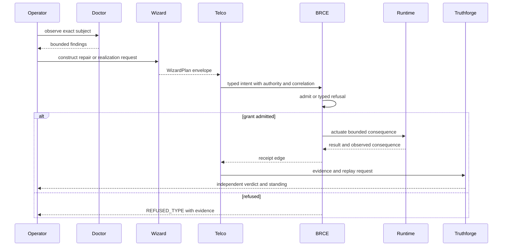
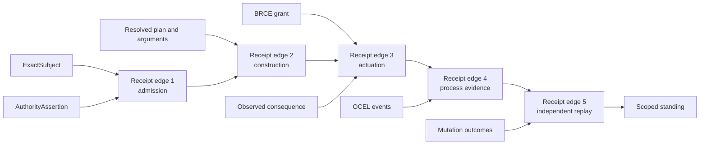
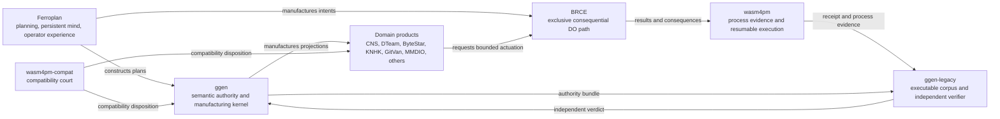
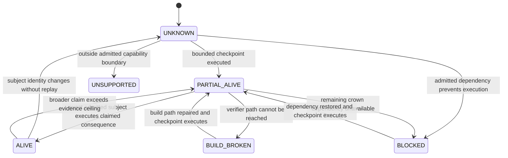
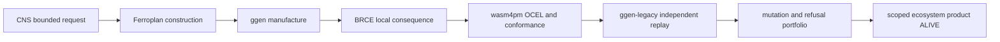
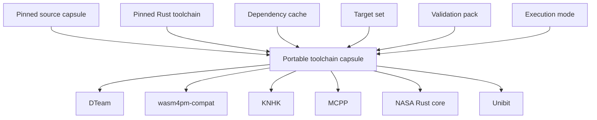
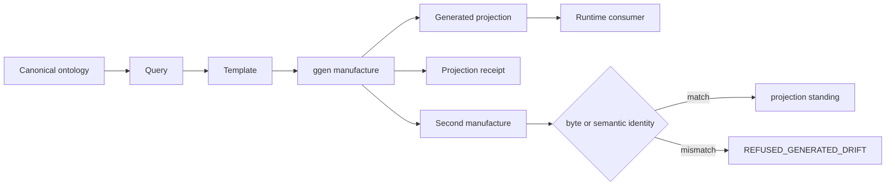

# Ecosystem Architecture Diagrams

**Scope:** documentation-only views of the target architecture described in `2026-08-03-ecosystem-architecture-reconstitution.md`.

## 1. Context and authority boundaries



## 2. Layered target architecture

```mermaid
flowchart TB
    L0[0. Constitutional authority<br/>A=μ(O*), standing, ownership, BRCE, claim ceilings]
    L1[1. Ecosystem capability graph<br/>canonical capabilities, ABB/SBB, realization and substitution]
    L2[2. Observation and admission<br/>exact source, RDF, SHACL, provenance, contradiction]
    L3[3. Construction and planning<br/>CMD, Ferroplan, linear, temporal, FOND, probabilistic]
    L4[4. Manufacture<br/>graph, query, template, ggen, deterministic projection]
    L5[5. Brokered runtime<br/>BRCE grants and consequential boundaries]
    L6[6. Evidence and process intelligence<br/>receipt DAG, OCEL, wasm4pm, replay, conformance]
    L7[7. Independent verification<br/>ggen-legacy, Truthforge, mutation and clean-room replay]
    L8[8. Product projections<br/>CLI, MCP, A2A, LSP, web, browser, television, AtomVM]

    L0 --> L1 --> L2 --> L3 --> L4 --> L5 --> L6 --> L7 --> L8
    L8 -. observed consequence and telemetry .-> L6
    L7 -. verdict and claim ceiling .-> L0
```

## 3. Capability passport model



## 4. Doctor, Wizard, Telco, Truthforge protocol



## 5. Receipt DAG



## 6. Repository role map



## 7. Standing composition



## 8. First reference-product crown



## 9. Toolchain capsule closure



## 10. Generated-surface ownership


