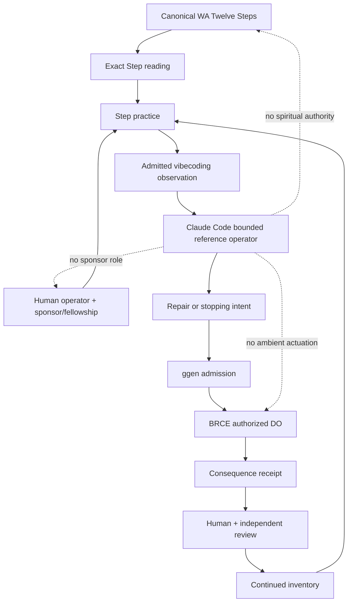

# Vibecoding Through the Twelve Steps of Workaholics Anonymous

**Status:** Architecture proposal

**Scope:** Documentation only

**Canonical authority:** Workaholics Anonymous World Service Organization

- Twelve Steps: https://workaholics-anonymous.org/literature/for-meetings/twelve-steps/
- Recovery from Workaholism: https://workaholics-anonymous.org/literature/pamphlets/recovery-from-workaholism-the-twelve-steps/
- Tools and Principles of Recovery: https://workaholics-anonymous.org/literature/for-meetings/tools-principles-of-recovery-2nd-edition/

## 1. Decision

The Twelve Steps of Workaholics Anonymous are adopted as an immutable recovery sequence for diagnosing and correcting compulsive vibecoding.

The Step text is not rewritten, summarized, secularized, optimized, translated into engineering jargon, or treated as a metaphor. The canonical wording remains external authority and must be read exactly as published by Workaholics Anonymous.

This document supplies a separate engineering application layer beneath each numbered Step. The application layer may evolve. The Step text may not.

```text
canonical WA Step text
        |
        v
personal and group practice
        |
        v
vibecoding observation
        |
        v
bounded engineering response
        |
        v
receipt, review, repair, and continued inventory
```

## 2. Why vibecoding requires a recovery model

Vibecoding can produce extraordinary throughput while also amplifying compulsive work patterns:

- identity fused with output volume, commits, repositories, tokens, benchmarks, or public claims;
- inability to stop because another agent, prompt, branch, benchmark, or proof is always available;
- adrenaline-driven iteration without a stable stopping rule;
- avoidance of uncertainty through more generation rather than admission of not knowing;
- perfectionism disguised as architecture completeness;
- control expressed through excessive orchestration, surveillance, review, or ontology expansion;
- work avoidance expressed through endless planning, redesign, prompt tuning, or infrastructure construction;
- neglect of health, rest, relationships, spirituality, and non-work identity;
- harm externalized through unstable software, unclear authority, misleading claims, abandoned collaborators, or unreviewable output;
- self-certification in which the same agent generates, evaluates, approves, and publicizes its work.

The problem is not high productivity. The problem is compulsion, unmanageability, and loss of proportion.

## 3. Non-paraphrase rule

Every Step session must begin by reading the corresponding Step verbatim from the canonical WA source.

The repository must not maintain an independently edited copy as authority. A future generated projection may cache the exact canonical wording only when provenance, retrieval date, source identity, content digest, and license or permission boundary are recorded.

The engineering material below is explicitly subordinate to the canonical Step.

## 4. Twelve-Step vibecoding application

### Step 1

**Canonical text:** Read Step 1 exactly from the WA canonical source.

**Vibecoding problem surface**

- inability to stop a coding session at the planned boundary;
- uncontrolled repository multiplication;
- escalating token, compute, branch, or agent use;
- generated changes exceeding human or mechanical review capacity;
- repeated claims of completion without exact-subject execution;
- work displacing sleep, meals, exercise, relationships, meetings, prayer, or recovery.

**Required practice**

Create a factual unmanageability inventory. Record what could not be controlled, what was neglected, what consequences occurred, and which claims exceeded evidence. No repair plan is admitted until the loss of control is stated without qualification.

**Engineering artifact**

`vibecoding-unmanageability-inventory.json`

**Refusal**

`REFUSED_DENIAL_OF_UNMANAGEABILITY`

---

### Step 2

**Canonical text:** Read Step 2 exactly from the WA canonical source.

**Vibecoding problem surface**

The operator treats individual intelligence, model capability, commit volume, or local certainty as sufficient authority.

**Required practice**

Admit that restoration requires authority and perspective beyond the isolated operator-model loop. In this architecture, technical mechanisms may include fellowship, sponsor, group conscience, canonical doctrine, independent verifier, exact execution, and external consequence evidence. These mechanisms do not replace the spiritual meaning of the Step.

**Engineering artifact**

`restoration-authorities.ttl`

**Refusal**

`REFUSED_SELF_SUFFICIENT_CERTIFICATION`

---

### Step 3

**Canonical text:** Read Step 3 exactly from the WA canonical source.

**Vibecoding problem surface**

The operator's will becomes the architecture: every idea is implemented, every available capability is exercised, and every uncertainty is answered by more work.

**Required practice**

Before work begins, create a surrender boundary that distinguishes what is entrusted, what is not ours to control, and what must be left undone. The daily plan must be reviewable by another person and must include a stopping condition.

**Engineering artifact**

`daily-surrender-and-stopping-plan.md`

**Refusal**

`REFUSED_WILL_AS_AUTHORITY`

---

### Step 4

**Canonical text:** Read Step 4 exactly from the WA canonical source.

**Vibecoding problem surface**

Compulsion hides behind technically admirable behavior.

**Required practice**

Conduct a searching inventory across motives, fears, resentments, harms, avoidance, control, prestige, comparison, perfectionism, dishonesty, and neglected obligations. Include both overwork and work avoidance. Do not limit the inventory to defects in code.

**Engineering artifact**

`vibecoding-moral-inventory.md`

**Suggested inventory dimensions**

| Dimension | Questions |
|---|---|
| Identity | What output am I using to prove my worth? |
| Fear | What happens, in my mind, if I stop? |
| Control | What people or systems am I trying to dominate? |
| Prestige | Which claims are designed to produce admiration? |
| Avoidance | What necessary task or feeling is hidden by technical activity? |
| Honesty | Which standings, benchmarks, or demonstrations exceed evidence? |
| Relationships | Who receives less presence because of this work? |
| Body | What physical limits have I ignored? |
| Spiritual life | Where has work replaced conscious contact and dependence? |

**Refusal**

`REFUSED_TECHNICAL_INVENTORY_ONLY`

---

### Step 5

**Canonical text:** Read Step 5 exactly from the WA canonical source.

**Vibecoding problem surface**

Private self-review preserves distortion. Agentic systems make it easy to create an apparently independent reviewer that still shares the same assumptions and incentives.

**Required practice**

Disclose the exact inventory to God, self, and another human being. Technical disclosure must include overstated claims, hidden failures, compulsive sessions, neglected commitments, unsafe authority, and known harm. An AI verifier is not the human being required by the Step.

**Engineering artifact**

`step-five-disclosure-receipt.md`

The receipt records that disclosure occurred and what categories were covered. It must not expose confidential spiritual or personal content in a public repository.

**Refusal**

`REFUSED_MACHINE_AS_HUMAN_WITNESS`

---

### Step 6

**Canonical text:** Read Step 6 exactly from the WA canonical source.

**Vibecoding problem surface**

The operator may admit defects while retaining them as competitive advantages: urgency, grandiosity, control, perfectionism, isolation, dishonesty, or refusal to stop.

**Required practice**

Create a readiness inventory distinguishing defects merely recognized from defects the operator is entirely willing to release. Do not convert readiness into another optimization project.

**Engineering artifact**

`readiness-to-release.md`

**Refusal**

`REFUSED_DEFECT_AS_FEATURE`

---

### Step 7

**Canonical text:** Read Step 7 exactly from the WA canonical source.

**Vibecoding problem surface**

Self-improvement becomes another expression of self-reliance and technical control.

**Required practice**

The primary act is humble asking, not manufacturing a superior self. Engineering controls may support the practice by reducing access, limiting sessions, enforcing stopping rules, or requiring review, but controls do not perform the Step.

**Engineering artifact**

`humility-boundaries.toml`

Possible technical boundaries:

- maximum active repositories;
- maximum concurrent agents;
- maximum session duration;
- mandatory meal, sleep, meeting, prayer, exercise, and relationship exclusions;
- no production actuation without BRCE;
- no self-approval;
- no public productivity claim without independent receipt.

**Refusal**

`REFUSED_HUMILITY_AS_OPTIMIZATION`

---

### Step 8

**Canonical text:** Read Step 8 exactly from the WA canonical source.

**Vibecoding problem surface**

The impact of compulsive coding is distributed across people, organizations, users, maintainers, communities, and the operator's own health.

**Required practice**

Create a private harms inventory and become willing to make amends. Harm includes omission, absence, broken promises, misleading claims, unstable deliverables, uncompensated review burden, abandoned work, coercive urgency, and emotional unavailability.

**Engineering artifact**

`private-harms-and-willingness-ledger`

This ledger must remain private unless disclosure is explicitly appropriate and safe.

**Refusal**

`REFUSED_HARM_REDUCED_TO_BUGS`

---

### Step 9

**Canonical text:** Read Step 9 exactly from the WA canonical source.

**Vibecoding problem surface**

Technical repair is mistaken for direct amends, or public confession is used in a way that creates more harm.

**Required practice**

Make direct amends where possible, subject to the Step's explicit protection against injury. The affected person, not the operator's preferred technical solution, determines whether the relational harm has been addressed. Code fixes, corrected claims, deleted artifacts, compensation, restored commitments, or changed work practices may be components of an amend but are not automatically the whole amend.

**Engineering artifact**

`amends-plan.private.md`

**Refusal**

`REFUSED_PATCH_AS_COMPLETE_AMEND`

---

### Step 10

**Canonical text:** Read Step 10 exactly from the WA canonical source.

**Vibecoding problem surface**

Compulsion reappears quickly through small exceptions: one more prompt, one more benchmark, one hidden failure, one exaggerated claim, one skipped commitment.

**Required practice**

Run a daily personal inventory and promptly admit wrongs. The daily inventory precedes the technical daily report. It must include relationships, body, emotional condition, spiritual condition, honesty, stopping behavior, and work avoidance as well as output.

**Engineering artifact**

`daily-inventory/YYYY-MM-DD.private.md`

**Operational cadence**

```text
observe the day
→ admit wrongs
→ disclose promptly
→ repair promptly
→ update boundaries
→ stop
```

**Refusal**

`REFUSED_METRICS_AS_PERSONAL_INVENTORY`

---

### Step 11

**Canonical text:** Read Step 11 exactly from the WA canonical source.

**Vibecoding problem surface**

The first and last input of the day becomes a model, terminal, issue queue, or production dashboard. Work replaces prayer, meditation, listening, and knowledge of right action.

**Required practice**

Protect prayer and meditation from instrumentalization. Do not turn spiritual practice into a productivity accelerator, prompt strategy, cognitive enhancement technique, or performance metric. The technical system should create silence and remove work access during protected periods.

**Engineering artifact**

`protected-conscious-contact-schedule.toml`

**Refusal**

`REFUSED_SPIRITUALITY_AS_PRODUCTIVITY_TOOL`

---

### Step 12

**Canonical text:** Read Step 12 exactly from the WA canonical source.

**Vibecoding problem surface**

Recovery insights become a brand, authority claim, product moat, or means of controlling other workers.

**Required practice**

Carry the message through lived recovery, service, honest disclosure, bounded tools, and attraction rather than domination. Practice the principles across repositories, employment, family, church, recovery communities, finances, health, and public communication. Do not present this architecture as Workaholics Anonymous endorsement.

**Engineering artifact**

`service-and-principles-review.md`

**Refusal**

`REFUSED_RECOVERY_AS_PRESTIGE_SYSTEM`

## 5. Claude Code as the first modeled user

Claude Code is the first reference operator because it can reveal whether the system's boundaries are understandable and enforceable. It is not a member of Workaholics Anonymous, cannot work the Steps, cannot sponsor, cannot receive a spiritual awakening, and cannot replace God, fellowship, sponsor, group conscience, or another human being.

Claude Code may support the process by:

- presenting the canonical Step source before an engineering session;
- asking the operator to identify the current Step and human support context;
- enforcing declared session and authority boundaries;
- detecting escalating scope, repeated extensions, skipped verification, and missing stopping rules;
- generating private inventory templates without filling in personal answers;
- refusing to treat machine review as Step Five disclosure;
- refusing to make amends autonomously;
- creating technical repair intents after human admission and authorization;
- ending a session when the admitted stopping condition is reached.

Claude Code must not:

- interpret the Steps as merely software-development heuristics;
- rewrite their spiritual language;
- diagnose a person as a workaholic;
- claim participation in recovery;
- act as sponsor, clergy, therapist, or fellowship;
- expose private inventories in source control;
- use recovery disclosures to optimize productivity;
- convert willingness, humility, prayer, meditation, or amends into performance scores.

## 6. Architecture



## 7. Vibecoding recovery operating cycle

The Steps are sequential and recurring. They are not a twelve-stage release pipeline. The following operating cycle is a subordinate engineering aid:

```text
read the current Step exactly
→ engage sponsor, fellowship, prayer, and human accountability
→ observe the vibecoding pattern
→ admit the exact problem without technical euphemism
→ construct the smallest bounded technical support
→ actuate only through authorized paths
→ inspect consequences
→ make prompt admission and repair
→ stop at the declared boundary
```

## 8. Recovery-aware standing

Technical standing and recovery standing must never be collapsed.

| Claim | Permitted standing |
|---|---|
| Exact canonical source was retrieved and identified | `ALIVE` when observed against the exact source |
| Operator read a Step | `UNKNOWN` unless directly attested; never inferred from tool use |
| Operator worked a Step | Outside machine authority; no automated `ALIVE` claim |
| Session boundary was enforced | `ALIVE` when exact enforcement and consequence are observed |
| Human disclosure occurred | Private attestation only; content not required |
| Amends were completed | Determined relationally, not by repository state |
| Vibecoding compulsion is cured | Unsupported claim |
| Technical harm was repaired | Bounded standing against exact consequences |

## 9. Required ggen building blocks

- `CanonicalRecoverySource`
- `ExactStepReference`
- `StepReadingAttestation`
- `PrivateInventoryBoundary`
- `HumanWitnessRequirement`
- `SponsorAndFellowshipBoundary`
- `SessionStoppingRule`
- `ProtectedTimeBoundary`
- `CompulsionSignal`
- `WorkAvoidanceSignal`
- `HarmInventoryReference`
- `AmendsSafetyCheck`
- `PromptAdmissionReceipt`
- `RecoveryPrivacyPolicy`
- `RecoveryNonEndorsementNotice`

## 10. Proposed pack

```text
packs/vibecoding-recovery/
├── ontology.ttl
├── sources/
│   └── wa-canonical-sources.ttl
├── queries/
│   ├── session-boundaries.rq
│   ├── stopping-rule.rq
│   ├── private-artifact-policy.rq
│   └── recovery-refusals.rq
├── templates/
│   ├── step-session-briefing.md.tera
│   ├── unmanageability-inventory.json.tera
│   ├── daily-surrender-plan.md.tera
│   ├── moral-inventory.private.md.tera
│   ├── daily-inventory.private.md.tera
│   └── service-review.md.tera
├── shapes/
│   ├── recovery-source.shacl.ttl
│   ├── privacy-boundary.shacl.ttl
│   └── stopping-rule.shacl.ttl
└── fixtures/
    ├── canonical-step-paraphrase-refused/
    ├── machine-as-sponsor-refused/
    ├── public-private-inventory-refused/
    ├── no-stopping-rule-refused/
    ├── patch-as-amend-refused/
    └── spirituality-as-productivity-refused/
```

## 11. Typed refusals

- `REFUSED_CANONICAL_STEP_PARAPHRASE`
- `REFUSED_MACHINE_AS_SPONSOR`
- `REFUSED_MACHINE_AS_HUMAN_WITNESS`
- `REFUSED_RECOVERY_DIAGNOSIS`
- `REFUSED_PRIVATE_INVENTORY_PUBLICATION`
- `REFUSED_RECOVERY_DISCLOSURE_AS_TRAINING_DATA`
- `REFUSED_AMBIENT_ACTUATION`
- `REFUSED_NO_STOPPING_RULE`
- `REFUSED_PATCH_AS_COMPLETE_AMEND`
- `REFUSED_SPIRITUALITY_AS_PRODUCTIVITY_TOOL`
- `REFUSED_RECOVERY_AS_PRESTIGE_SYSTEM`
- `REFUSED_WA_ENDORSEMENT_IMPLICATION`

## 12. First experiment

Use Claude Code in plan mode against the architecture PR.

The operator begins with the canonical reading of Step 1 and human recovery support outside the tool. Claude Code then receives a bounded task:

1. inspect the admitted repository and architecture documents;
2. identify evidence of unmanageable vibecoding at the system level without diagnosing any person;
3. classify each observation as grounded, inferred, unknown, blocked, or unsupported;
4. identify where the architecture enables endless work, scope escalation, self-certification, identity-by-output, or inability to stop;
5. produce a stopping-rule proposal and private-inventory template;
6. make no code changes;
7. perform no actuation;
8. terminate at the declared turn, time, and artifact boundary.

A human operator and a separate verifier then review whether Claude Code respected the Step boundary, privacy boundary, non-diagnosis rule, and stopping rule.

## 13. Acceptance criteria

This architecture is `PARTIAL_ALIVE` only when all of the following are observed:

- the canonical WA source identity is bound without paraphrasing the Steps;
- Claude Code reconstructs the recovery-aware architecture from the documentation;
- the operator session has a declared stopping rule;
- private inventory material is excluded from public source control;
- machine-as-sponsor and machine-as-human-witness attempts are refused;
- no actuation occurs outside BRCE;
- a separate verifier confirms termination at the boundary;
- the result produces a receipt without claiming that a human worked or completed a Step.

The architecture cannot establish spiritual recovery, membership, sponsorship, completed amends, or freedom from workaholism. Those claims remain outside machine authority.

## 14. Non-endorsement

Workaholics Anonymous has not reviewed or endorsed this architecture. The use of WA source references does not imply affiliation, sponsorship, approval, or authority to alter its literature.
