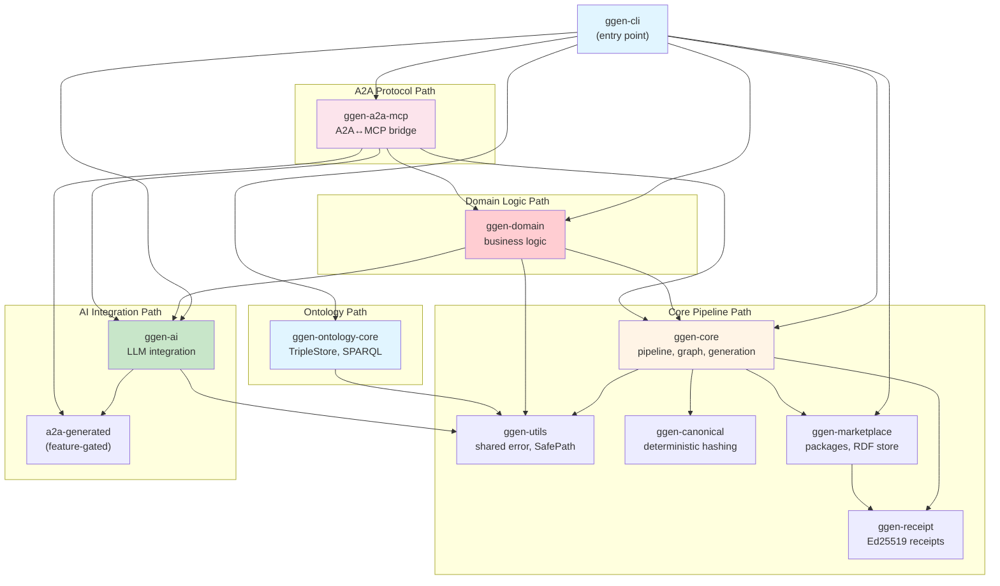
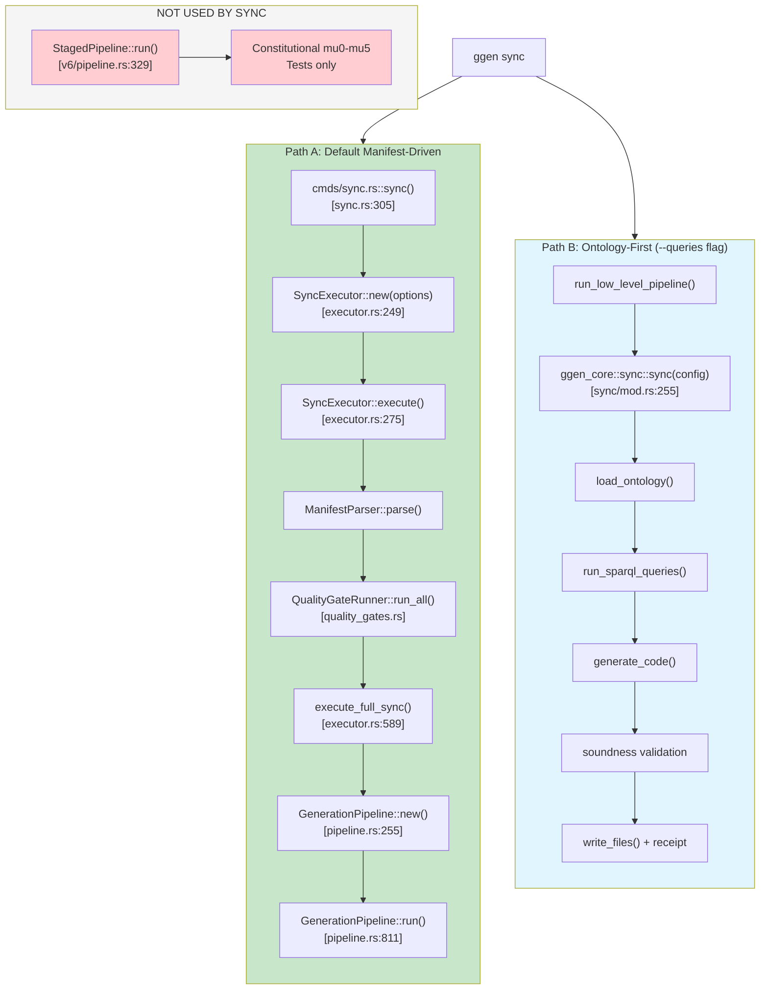
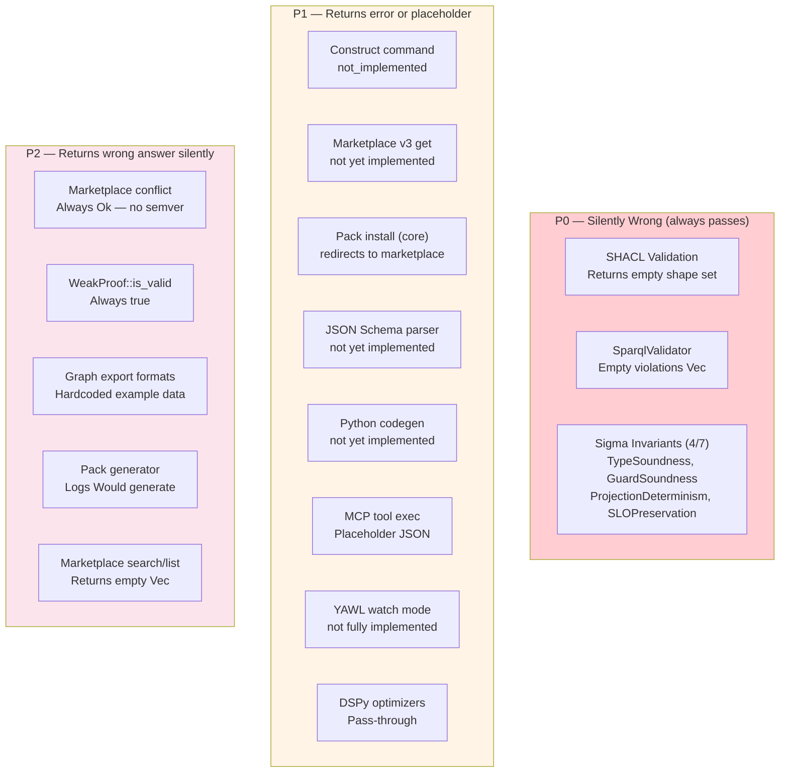
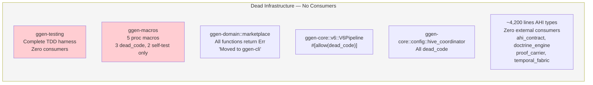

# ggen Architecture — Compressed Reference

**Purpose:** Single document (~2K tokens) that gives an AI agent the same mental map a senior engineer builds over weeks. All paths verified by LSP survey 2026-04-01.

---

## C4 Container Diagram — Actual Dependencies



**Standalone (zero ggen-* deps):**
`ggen-transport`, `ggen-canonical`, `ggen-utils`, `ggen-receipt`

**CRITICAL:** `ggen-core` ↔ `ggen-ai` cycle was deliberately broken.
Both have comments documenting removed mutual dependencies.

---

## Production Sync Flow — The REAL Path



---

## Key Entry Points

| Operation | Function | File:Line |
|-----------|----------|-----------|
| `ggen sync` | `sync()` | `ggen-cli/src/cmds/sync.rs:305` |
| Pipeline execution | `GenerationPipeline::run()` | `ggen-core/src/codegen/pipeline.rs:811` |
| v6 pipeline (tests) | `StagedPipeline::run()` | `ggen-core/src/v6/pipeline.rs:329` |
| Quality gates | `QualityGateRunner::run_all()` | `ggen-core/src/poka_yoke/quality_gates.rs` |
| LLM completion | `GenAiClient::complete()` | `ggen-ai/src/client.rs:203` |
| Marketplace publish | `RdfControlPlane::publish_package()` | `ggen-marketplace/src/rdf/control.rs` |
| Pack install | `Installer::install()` | `ggen-marketplace/src/install.rs` |
| Config loading | `ConfigLoader::from_file()` | `ggen-config/src/parser.rs:56` |
| A2A message routing | `MessageRouter::route()` | `ggen-a2a-mcp/src/handlers.rs` |
| Auth middleware | `http_auth_middleware()` | `vendors/a2a-rs/a2a-rs/src/adapter/auth/authenticator.rs:373` |
| Receipt chain verify | `ReceiptChain::verify()` | `ggen-receipt/src/chain.rs:113` |
| Session management | `SessionManager::create_session()` | `ggen-transport/src/session.rs` |
| Ontology loading | `TripleStore::load_turtle()` | `ggen-ontology-core/src/triple_store.rs` |

---

## Stub Registry — What's Real vs Fake



### P0 — Silently wrong (always passes when it shouldn't)

| Component | File | What's wrong |
|-----------|------|--------------|
| SHACL validation | `ggen-core/src/validation/shacl.rs:132` | Returns empty shape set — always passes |
| SparqlValidator | `ggen-core/src/validation/validator.rs:113` | Empty violations Vec — always passes |
| Sigma invariants (4/7) | `ggen-core/src/ontology/validators.rs:162-172` | TypeSoundness, GuardSoundness, ProjectionDeterminism, SLOPreservation are no-ops |

### P1 — Returns error or placeholder

| Component | File | Returns |
|-----------|------|---------|
| Construct command | `ggen-cli/src/cmds/construct.rs:286` | "not_implemented" (llm_construct commented out) |
| Marketplace v3 get | `ggen-marketplace/src/v3.rs:249` | Error "not yet implemented" |
| Pack install (core) | `ggen-core/src/packs/install.rs:33` | Bails "use ggen_marketplace instead" |
| JSON Schema parser | `ggen-core/src/schema/parser.rs:281` | Error "not yet implemented" |
| Python codegen | `ggen-core/src/schema/generators.rs:601` | Comment "# not yet implemented" |
| MCP tool exec | `ggen-ai/src/mcp/traits.rs:338` | Placeholder JSON |
| YAWL watch mode | `ggen-cli/src/cmds/yawl.rs:268` | Error "not yet fully implemented" |
| DSPy optimizers | `ggen-dspy/src/optimizers/bootstrap.rs:28` | Pass-through (returns input unchanged) |

### P2 — Returns wrong answer silently

| Component | File | What's wrong |
|-----------|------|--------------|
| Marketplace conflict check | `ggen-marketplace/src/install.rs:234` | Always Ok — no semver check |
| WeakProof::is_valid | `ggen-domain/src/action_types.rs:397` | Always true |
| Graph export formats | `ggen-domain/src/graph/export.rs:217-293` | Returns hardcoded example data |
| Pack generator | `ggen-domain/src/packs/generator.rs:70` | Logs "Would generate" — no actual generation |
| Marketplace search/list | `ggen-marketplace/src/rdf/control.rs:391-405` | Returns empty Vec |

---

## Ontology Namespace — CANONICAL

```
Primary:   http://ggen.dev/ontology#       (ggen-core, ggen-domain, config TTLs)
Legacy:    https://ggen.io/marketplace/     (ggen-marketplace operational SPARQL)
Third:     http://ggen.dev/marketplace#     (ggen-marketplace/rdf/ontology.rs:24)

CONFLICT: SPARQL queries with one namespace return empty against triples stored with another.
ACTION NEEDED: Consolidate to single URI. Track in MASTER_TODO.md P0-03.
```

---

## Error Type Map

```
ggen-utils::error::Error    — universal base, 14 From conversions, bail!/ensure! macros
  ├── Re-exported by: ggen-domain, ggen-cli (as UtilsResult)
  └── Not re-exported by: 21 other crates (each has local error module)

CLI prelude has THREE Result types:
  - AnyhowResult    (anyhow)
  - Result          (clap_noun_verb)
  - UtilsResult     (ggen_utils)

Rule: Crate-local Error + From<ggen_utils::Error> for boundary conversion.
```

---

## Dead Infrastructure (do not use)



| Crate/Module | Status | Why |
|-------------|--------|-----|
| `ggen-testing` | Zero consumers | Complete TDD harness, nothing depends on it |
| `ggen-macros` | Zero consumers | 3/5 macros dead_code, 2 only self-tested |
| `ggen-domain::marketplace` | All functions return Err | "Moved to ggen-cli" |
| `ggen-core::v6::V6Pipeline` struct | `#[allow(dead_code)]` | Separate from StagedPipeline |
| `ggen-core::config::hive_coordinator` | All dead_code | Distributed dep resolution, never wired |
| ~4,200 lines AHI types in ggen-domain | Zero external consumers | ahi_contract, doctrine_engine, proof_carrier, temporal_fabric, etc. |

---

## Test Status

```
Total test markers:     ~12,514
#[ignore] tests:        120 (never run in CI)
  - 26 "Phase 2" install tests (permanently dead)
  - 11 Docker-dependent production validation
  - 11 OTLP collector tests
  - 15 Next.js ontology e2e
Hand-rolled mocks:      8 files (Chicago TDD violation)
.unwrap() in tests:     5,046
.expect() in tests:     2,069
```
