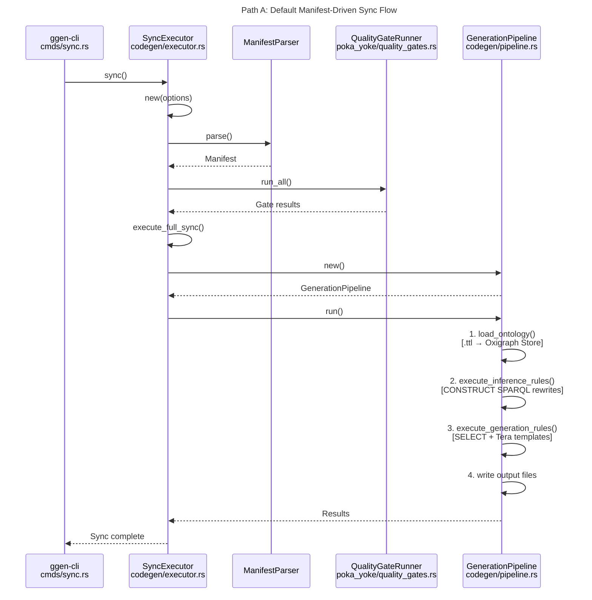
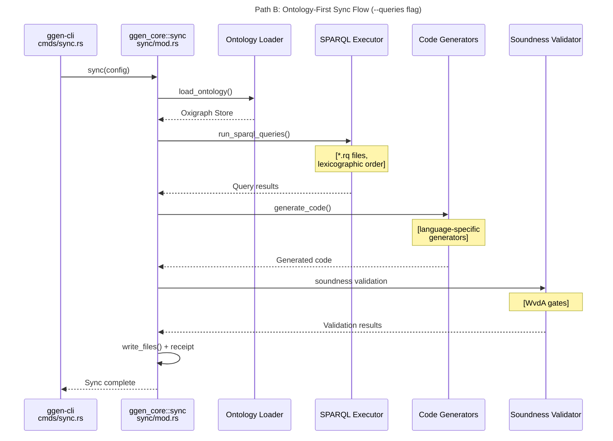
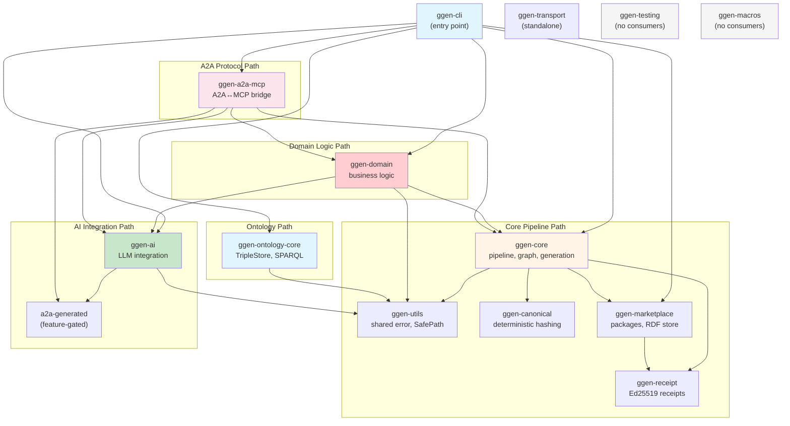
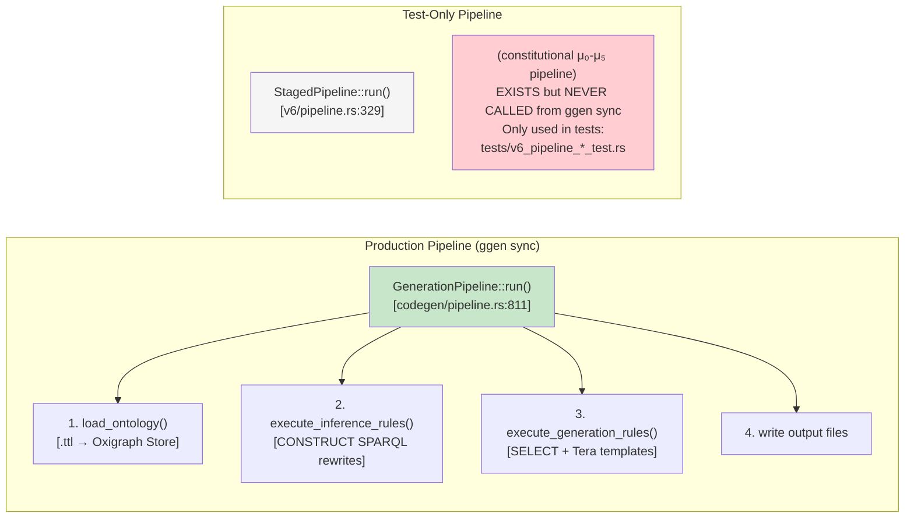

# Architecture Diagram Corrections & Hidden Insights

**Date:** 2026-04-01
**Purpose:** Corrections to the C4/sequence diagrams, plus hidden architectural insights those diagrams miss. These gaps are the exact class of errors that cause AI agents to drift into wrong implementations.

---

## CRITICAL CORRECTIONS (Things the diagrams get wrong)

### 1. The sync flow is WRONG — StagedPipeline is never called

**Diagram says:** `ggen sync → SyncExecutor → StagedPipeline::run()`
**Reality:** `ggen sync → SyncExecutor → GenerationPipeline::run()`

`StagedPipeline` exists in `crates/ggen-core/src/v6/pipeline.rs` but is **never called from any CLI command**. It is only used in its own test files (`tests/v6_pipeline_*_test.rs`). The production sync path uses `GenerationPipeline` from `crates/ggen-core/src/codegen/pipeline.rs`.

**Two actual sync paths:**

### 2. PackResolver file path is WRONG

**Diagram says:** `crates/ggen-core/src/v6/resolver.rs`
**Reality:** `crates/ggen-core/src/pack_resolver.rs` (top-level module, not inside v6/)

### 3. ggen-jidoka crate DOES NOT EXIST

**Diagram shows:** ggen-jidoka as a container with Gate trait, CompilerGate, TestGate, LintGate, ProductionLine
**Reality:** The crate has zero files, zero Cargo.toml, zero code. The types `CompilerGate`, `TestGate`, `LintGate` do not exist anywhere in the workspace. The actual quality gate implementation lives entirely inside `ggen-core` under `src/poka_yoke/quality_gates.rs` and `src/validation/`.

### 4. C4 container diagram is incomplete

**Diagram shows:** ggen-cli depends on ggen-core, ggen-ai, ggen-marketplace
**Reality:** ggen-cli depends on **9 ggen-* crates:**

| Shown in diagram | Not shown |
|---|---|
| ggen-core | ggen-utils |
| ggen-ai | ggen-domain |
| ggen-marketplace | ggen-a2a-mcp |
| | ggen-ontology-core |
| | ggen-receipt |
| | a2a-generated (optional) |

### 5. ggen-core ↔ ggen-ai cycle was deliberately broken

**Diagram implies:** ggen-core and ggen-ai can call each other
**Reality:** Both crates have explicit comments documenting removed mutual dependencies to break a **circular dependency**. ggen-core has no AI dependency. ggen-ai has no code-generation dependency. The CLI wires them together at the top level.

---

## HIDDEN STUBS (Presented as real but non-functional)

### 1. SHACL Validation — entirely stubbed, always passes

**Location:** `crates/ggen-core/src/validation/shacl.rs`

`ShapeLoader::load()` returns an empty shape set. The original 628-line implementation exists only in git history. Comment says: "STUBBED pending investigation of Graph::query() wrapper API."

**Cascade effect:** The v6 normalization pass (`v6/passes/normalization.rs:227`) calls this stub and passes a dummy empty graph, so its validation step is a no-op.

`SparqlValidator::validate()` in `validator.rs:113` also has an empty violations Vec, so it always passes.

**22 Chicago TDD test functions** are also stubbed out (comment at `validation/tests.rs`).

### 2. Code generation without LLM produces TODO comments

**Location:** `crates/ggen-core/src/codegen/pipeline.rs`

`DefaultLlmService` (line 125-162) generates `// TODO: Implement {skill} skill` stubs when no LLM is configured. The Tera template for Rust (`rdf/templates/impl.tera:16`) emits `todo!()` for any method without a body. `CodeGraphBuilder` hardcodes `todo!()` as accessor method bodies.

### 3. Marketplace module in ggen-domain — all functions return errors

**Location:** `crates/ggen-domain/src/marketplace.rs`

All four public functions (`list_all`, `get_package`, `resolve_dependencies`, `execute_install`) immediately return errors. Header says: "Marketplace integration moved to ggen-cli."

### 4. Pack installation in ggen-core — redirects to ggen-marketplace

**Location:** `crates/ggen-core/src/packs/install.rs:33`

`install_pack()` immediately bails: "install_pack is a stub. Use ggen_marketplace::install::Installer instead."

### 5. RdfControlPlane v2 — half the methods are stubs

**Location:** `crates/ggen-marketplace/src/rdf/control.rs`

Core CRUD works (create, publish, state query). These are stubs:
- `search_packages()` → `Vec::new()`
- `list_packages()` → `Vec::new()`
- `get_dependencies()` → `Vec::new()`
- `get_published_package()` → `Error::NotImplemented`
- `get_maturity_metrics()` → hardcoded defaults
- `get_dashboard_stats()` → hardcoded zeros

### 6. Sigma Runtime Invariants — 4 of 7 are mock implementations

**Location:** `crates/ggen-core/src/ontology/validators.rs:162-179`

TypeSoundness, GuardSoundness, ProjectionDeterminism, SLOPreservation all have empty branches with comments like "Would validate... For now: mock implementation."

### 7. JSON Schema parsing — not implemented

**Location:** `crates/ggen-core/src/schema/parser.rs:281`

`from_json_schema()` immediately returns `Err("JSON Schema parsing not yet implemented")`.

### 8. Python code generation — not implemented

**Location:** `crates/ggen-core/src/schema/generators.rs:601`

Returns a comment: "Python code generation not yet implemented for A2A schemas."

---

## HIDDEN ARCHITECTURE (Things the diagrams don't show at all)

### 1. ggen-utils is the real foundation, not a utility crate

15+ modules spanning security, error handling, path validation, logging, alerts. 10 crates depend on it directly. The universal `Error` type has 14 `From` conversions and is re-exported by ggen-domain and ggen-cli.

**Key modules:**
- `safe_path` — Path traversal prevention (25 files reference SafePath)
- `safe_command` — Command injection prevention
- `path_validator` — Enterprise-grade workspace-bounded validation
- `error` — Universal Error/Result with bail!/ensure! macros

**Two modules are commented out** due to compilation errors from Week 8/9 security work: `secrets` and `supply_chain`.

### 2. Error type fragmentation — 23 crates, 23 error modules

Only ggen-domain and ggen-cli re-export the shared `ggen_utils::error::Error`. Every other crate defines its own. The CLI prelude has THREE different Result types: `anyhow::Result`, `ggen_utils::error::Result`, and `clap_noun_verb::Result`.

### 3. ggen-testing — built but never used

Complete Chicago-style TDD framework (TestHarness, StateVerifier, 16 assertions, property testing, snapshot testing, 4 fixture types). Zero other crates depend on it. Dead infrastructure.

### 4. ggen-macros — mostly dead code

5 proc macros. Three marked `#[allow(dead_code)]` with "FUTURE: v4.0". Two active ones (Guard, Bundle) only used in their own tests. No crate depends on ggen-macros.

### 5. vendors/ — the pre-Rust parallel universe

6 vendored codebases the diagrams don't mention:

| Vendor | Language | Purpose |
|--------|----------|---------|
| `a2a-rs/` | Rust | Reference A2A implementation (own git repo) |
| `craftplan/` | Elixir | RDF-driven Elixir code generation |
| `cre/` | Erlang | Composable Runtime Entity |
| `gen_pnet/` | Erlang | Petri net generation |
| `gen_yawl/` | Erlang | YAWL workflow generation |
| `tai-erlang-autonomics/` | Erlang | TAI with 150+ agent delivery receipts |

The Rust crates are a **migration from Erlang/Elixir**, not greenfield. This explains naming patterns (jidoka, heijunka, kaizen) and why some subsystems have Erlang-native implementations that the Rust versions haven't caught up to.

### 6. Ontology namespace split — three competing URIs

| URI | Used By |
|-----|---------|
| `https://ggen.io/marketplace/` | RdfControlPlane SPARQL, registry_rdf, v3, sparql |
| `http://ggen.dev/ontology#` | rdf/ontology.rs, config TTL files, tests |
| `http://ggen.dev/marketplace#` | rdf/ontology.rs (third namespace) |

The SPARQL executor's `package_uri()` builds URIs like `http://ggen.dev/ontology#<id>`, but the control plane queries use `https://ggen.io/marketplace/<id>`. These would not match the same triples.

### 7. Workspace-level Poka-Yoke enforcement

The workspace Cargo.toml denies `unwrap_used`, `expect_used`, `panic`, `todo`, `unimplemented` across all 31 crates via clippy. This is a cross-cutting compiler-level constraint no diagram captures.

---

## THE CORRECTED DEPENDENCY GRAPH

**Standalone (zero ggen-* deps):**
`ggen-transport`, `ggen-canonical`, `ggen-utils`, `ggen-receipt`

**Dead infrastructure (no consumers):**
`ggen-testing`, `ggen-macros`

---

## THE REAL SYNC PIPELINE (corrected)

---

## IMPLICATION FOR AI AGENT COORDINATION

These gaps explain why AI agents drift:

1. **Two pipelines, one name** — agents find `StagedPipeline` documentation and implement against it, but `ggen sync` runs `GenerationPipeline`. Wrong pipeline = wrong code.

2. **Stubbed validation always passes** — agents add code that should fail validation, but SHACL validation is a no-op. Tests pass, agent thinks it's done, real validation would have caught the error.

3. **Three ontology namespaces** — agents generate SPARQL with one namespace, data lives in another, queries return nothing. No error, just empty results.

4. **Dead infrastructure looks real** — ggen-testing has a complete API surface. Agents see it in CLAUDE.md and try to use it. It's never imported anywhere. Same for ggen-macros.

5. **ggen-jidoka is a phantom** — the architecture docs list it as a crate with specific types. Agents implement against those types. They don't exist.

6. **Error type chaos** — agents call a function expecting `ggen_utils::Result` but get the crate's local `Result`. Three different Result types in the CLI alone. Type mismatches cascade.
