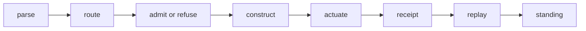

# ggen file-oriented class diagrams

This directory documents the static architecture of `ggen` using one Mermaid class diagram section per source file. The source file is the unit of identity: types are defined only in the section for the file that owns them, while dependencies on foreign types are rendered as directed relationships.

## Standing and boundaries

- Base: `a9fce3c1db64d3e6dff72f61e5dabf4d0af45e73`
- Scope: production Rust entrypoints and architectural boundaries in the active Cargo workspace.
- Excluded: tests, examples, archived code, generated projections, templates, and vendored implementation detail unless they define an active boundary.
- Generated files are named but not treated as editing authorities.
- A diagram is structural documentation. It does not prove runtime execution.

## Reading convention

| Mermaid notation | Meaning |
|---|---|
| `*--` | ownership or composition |
| `o--` | aggregation or registration |
| `-->` | invocation or dependency |
| `..>` | implementation, adaptation, or indirect use |
| `<<module>>` | Rust module/file boundary |
| `<<external>>` | dependency owned outside the file |
| `<<generated>>` | generated projection; edit its authority instead |
| `<<boundary>>` | authority, I/O, protocol, or actuation boundary |

## Diagram catalog

1. [Workspace and root entrypoints](workspace.md)
2. [CLI source files](cli.md)

## Architectural flow

The diagrams preserve the repository's separation between command selection, reversible construction, machine-state actuation, and evidence-bearing receipts.

## Maintenance rule

When a source file gains, removes, or relocates an architectural type, update only that file's section and its inbound or outbound edges. Do not collapse the repository into a single global class diagram: that destroys source ownership and makes generated/manual boundaries ambiguous.
